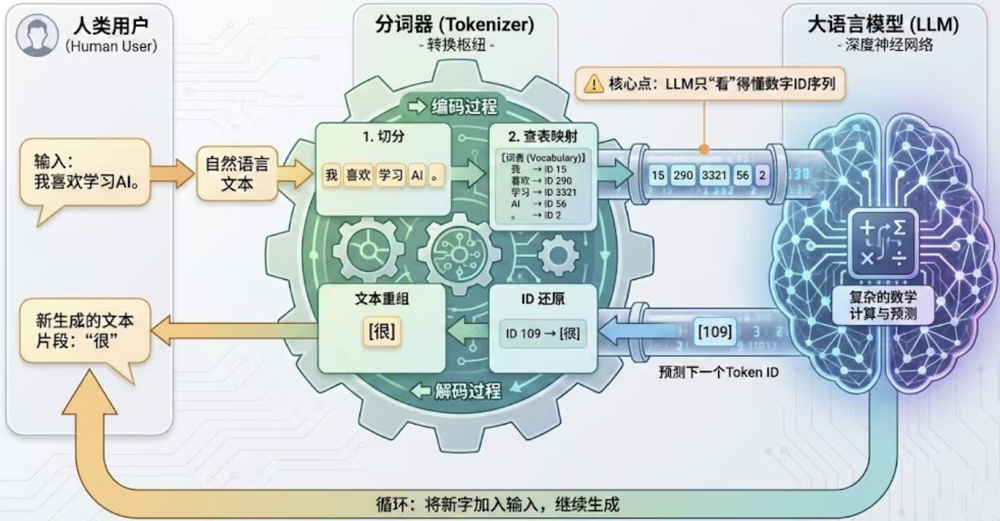
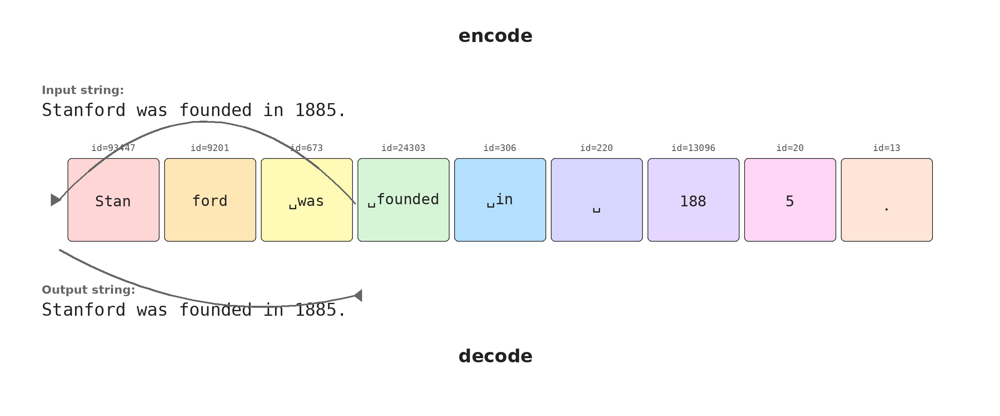
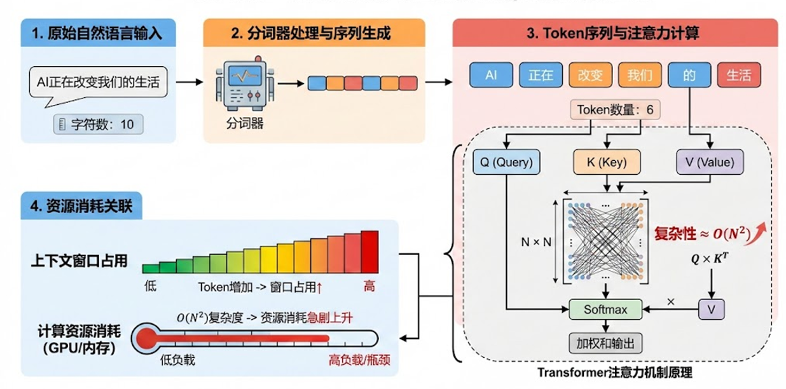
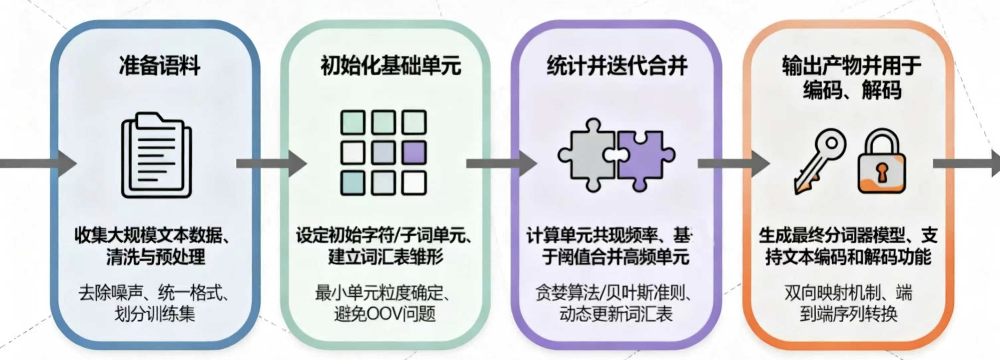
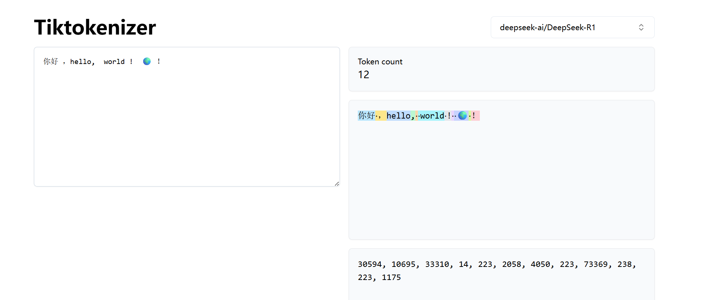
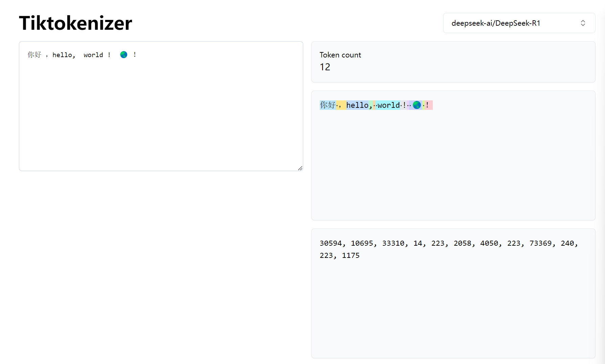

# 第 1 章 分词器

分词器（tokenizer）是语言模型接触文本的第一层接口。它把 Unicode 字符串编码成离散 token id，再把 token id 解码回字符串。模型内部只处理整数索引和向量表示，因此 tokenizer 的切分规则会改变序列长度、上下文窗口利用率、embedding 词表稀疏度、多语言覆盖和推理成本。

## 本章学习目标

读完本章应能回答四个问题：

- 原始文本如何从 Unicode 字符串落到 UTF-8 byte 序列。
- 字符级、byte 级和词级 tokenization 各自解决什么问题，又留下什么工程代价。
- Byte-level BPE 如何用高频相邻 pair 合并，在完备性和压缩效率之间折中。
- 训练完成后，怎样检查 tokenizer 是否适合后续语言模型训练和推理。

## 本章主线

Tokenizer 在训练开始前就被固定下来，它一旦确定，后面所有训练和推理都要按它切出的序列长度付账。本章沿着这条因果关系推进：先建立 `encode` / `decode` 接口和压缩率指标，再看字符级、byte 级、词级三种基础策略各自卡在哪里，然后用 byte-level BPE 把"完备"和"高效"两个要求同时满足，最后落到训练完成后的质量检查和一个公开模型的实例观察。

## 章首速查图

从原始文本到训练侧 token id 序列的整条流水线如下。每一节对应流水线中的一段节点。

```
原始文本（Unicode 字符串）
        │
        ▼  encode
UTF-8 byte 序列
        │
        ▼  预分词 + 合并规则
字符级 / byte 级 / 词级 / byte-level BPE
        │
        ▼  vocab + merges
token id 序列  ──►  进入训练侧 / 推理侧
        │
        ▼  decode
还原字符串
```

| 节 | 节点 | 解决什么 |
| --- | --- | --- |
| §1.1 | `encode` / `decode` 接口、压缩率 | 接口契约和效率视角 |
| §1.2 | 字符 / byte / 词 三种基础策略 | 各把哪个指标推到极端 |
| §1.3 | byte-level BPE、vocab、merges | 完备与高效同时满足 |
| §1.4 | 质量检查清单 | 训练前后如何验收与扩表兼容 |
| §1.5 | DeepSeek tokenizer 案例（DeepSeek-R1 词表） | 把上面的概念落到一份真实词表上 |

## 1.1 分词器的接口与效率视角

> **本节解决**：tokenizer 在文本和模型之间承担什么接口、压缩率怎么量化、词表规模为什么不是越大越好。
>
> **读完能做**：用 `bytes per token` 解释一段 UTF-8 文本在某种 tokenizer 下序列会被压短多少，并判断词表大小对 embedding 稀疏度的影响。

语言模型最终学习 token 序列上的概率分布。Tokenizer 位于原始文本和模型之间，提供两个基本操作：`encode` 把字符串变成 token id 序列，`decode` 把 token id 序列还原成字符串。普通文本的基础质量要求是 round-trip 成立：`decode(encode(x)) == x`。



*图 1.1-1 tokenizer 在文本与 LLM 之间提供可逆接口*

这层接口会泄漏到模型训练里。相同文本如果被切成更多 token，就会占用更多上下文窗口，也会让 attention 和 MLP 在更长序列上工作；相同文本如果被切成更少 token，模型可以在固定上下文窗口里容纳更多原始信息，但词表和输出层也可能变大、变稀疏。



*图 1.1-2 GPT tokenizer 将字符串编码为 token id*

图 1.1-2 展示了 GPT-5（tiktoken `o200k_base`）对 `"Stanford was founded in 1885."` 的切分。9 个 token id 对应同一字符串，序列下方的高亮片段说明 tokenizer 学到的是训练语料中的统计片段，与人类直觉里的词边界不完全对齐：`Stanford` 在句首被切成 `Stan` (id 93447) + `ford` (id 9201) 两个 token；前导空格与 `was`、`founded`、`in` 又各合成单独 token (` was` id 673 / ` founded` id 24303 / ` in` id 306)；句中孤立空格单独成 id 220；年份 `1885` 被切成 `188` (id 13096) + `5` (id 20) 两个 token，句号 `.` 单独成 id 13。

数字被拆成 3 位 + 1 位的原因写在 `o200k_base` 的预分词正则里：数字分支是 `\p{N}{1,3}`，长数字串在进入 BPE 之前就被从左往右按最多 3 位切开。词表里的纯数字 token 因此只有 1 位（10 个）、2 位（100 个）和 3 位（1000 个）三类，任何 4 位以上的数字串都会落成多个 token。

衡量压缩效率的一个简单指标是 bytes per token：

$$
C_{\text{ratio}} = \frac{N_{\text{bytes}}}{N_{\text{tokens}}}
$$

在同一段 UTF-8 文本上， $C_{\text{ratio}}$ 的值越高，平均每个 token 承载的 byte 越多，序列越短。序列变短会直接降低 Transformer 的序列维开销，尤其是 full attention 的 pairwise 交互会随 token 数近似平方增长。



*图 1.1-3 token 数量决定 attention 成本和上下文占用*

图 1.1-3 把这条成本链画在同一条轴上：tokenizer 切分得越碎，同一段原始文本就越快耗尽上下文窗口，attention 矩阵也越大。提高压缩率可以缓解这个问题，代价是扩大词表会增加 embedding 和输出层的参数量，并让低频 token 更难被充分训练。词表规模因此成为一个需要权衡的量，下面用几个公开模型看看这个量落在什么区间。

OpenAI 的 tiktoken 提供两类相近规模的编码，可以用来看清一个词表规模是怎样被算出来的。`o200k_base` 的合并表含 199,998 条 rank，编号 0-199997；再加上两个显式特殊 token `ENDOFTEXT`（id 199999）和 `ENDOFPROMPT`（id 200018），vocab\_size 取到 200,019。中间的 id 199998 与 200000-200017 共 19 个槽位在 `o200k_base` 下没有分配。GPT-5、GPT-4o、o1、o3 等模型的文本 tokenizer 都沿用这套编码；上一代的 `gpt-4-` 与 `gpt-3.5-turbo-` 前缀仍映射到 `cl100k_base`。

`o200k_harmony` 复用同一张合并表，把上面那 19 个空槽连同更高位一起填成消息边界、role、channel 和 function calling 的控制 token：id 199998 是 `<|startoftext|>`，200002 到 200012 之间命名控制 token 依次是 `<|return|>`、`<|constrain|>`、`<|channel|>`、`<|start|>`、`<|end|>`、`<|message|>`、`<|call|>`（中间穿插的 `<|reserved_200004|>`、`<|reserved_200009|>`、`<|reserved_200010|>`、`<|reserved_200011|>` 也占位），其余位置一直到 201087 都是 `<|reserved_*|>` 占位，于是 vocab\_size $= 201{,}088$。`openai/gpt-oss-20b` 与 `openai/gpt-oss-120b` 按 `gpt-oss-` 前缀映射到这套编码。精确取值见 [`tiktoken_ext/openai_public.py`](https://github.com/openai/tiktoken/blob/main/tiktoken_ext/openai_public.py)。

开源权重模型的词表也在同一量级。DeepSeek-V3 的 vocab\_size $= 129{,}280$（[HF config](https://huggingface.co/deepseek-ai/DeepSeek-V3/blob/main/config.json)），技术报告 §4.1 把它描述为 byte-level BPE 的 128K 扩展词表。Qwen3-235B-A22B 的 vocab\_size $= 151{,}936$（[HF config](https://huggingface.co/Qwen/Qwen3-235B-A22B/blob/main/config.json)），Qwen3 技术报告 §2 给出的 tokenizer 基础大小是 151,669，两者相差的 267 个槽位留给 reserved 与对齐用的 padding。十万到二十万这个区间，就是当前主流模型在压缩率、词表稀疏性和跨语言覆盖之间选定的折中位置。

Tokenizer-free 架构尝试直接在 byte 或动态 chunk 上建模，代表方向包括 ByT5、MEGABYTE、Byte Latent Transformer、T-Free 和 H-Net。它们希望减少固定词表带来的碎片化和跨语言偏差。当前主流前沿语言模型仍大量使用 tokenizer，因此工程上仍要理解固定 tokenizer 怎样改变计算成本和表示效率。

## 1.2 Unicode、UTF-8 与基础分词策略

> **本节解决**：在三种"切到底"的粒度——字符、byte、词——之间做一次完整的成本比较。
>
> **读完能做**：在给定语料和模型规模的前提下，估算任一策略的词表大小、序列长度和 OOV 风险。

计算机中的文本通常先表示为 Unicode 字符串。Unicode 为字符分配码点，例如 `A` 是 `U+0041`，汉字和 emoji 也各有对应码点。UTF-8 是把这些码点写成 byte 序列的编码格式；ASCII 字符在 UTF-8 中占 1 个 byte，常见中文通常占 3 个 byte，许多 emoji 占更多 byte。

有了 byte 序列这个共同底座，下一个问题是从多大的粒度开始切。下面三种基础策略各自把一个指标推到极端，也各自暴露一处瓶颈。

**字符级 tokenizer** 把每个 Unicode 字符当作 token。它天然可逆，也能覆盖生僻字符，但 Unicode 字符集合很大，许多字符极低频。模型会为大量罕见码点保留独立 id，词表利用率偏低；同时，英文单词会被拆成多个字符，语义组合压力交给后续 Transformer 层。

**byte 级 tokenizer** 先把字符串编码成 UTF-8 byte，再把每个 byte 当作 token。它的基础词表只需要 256 个值，能够覆盖任意合法 UTF-8 文本，也避免传统 OOV（out-of-vocabulary）问题。代价是纯 byte tokenizer 的压缩率恒为 1：

$$
C_{\text{ratio}} = \frac{N_{\text{bytes}}}{N_{\text{tokens}}} = \frac{N_{\text{bytes}}}{N_{\text{bytes}}} = 1
$$

纯 byte tokenizer 下，每个 byte 都直接进入模型序列，等式中的 $N_{\text{bytes}}$ 同时是输入 UTF-8 字节数与 token 数。中文（通常 3 byte）、emoji（4+ byte）和长代码片段会快速拉长序列长度，full attention 成本随之上升。

**词级 tokenizer** 按空格、标点或语言特定分词规则切分文本。它的 token 往往更接近人类理解的词，压缩率也较高。工程问题在于词表可能随训练数据无限增长：`look`、`looks`、`looked`、`looking` 会成为不同词；测试时遇到没见过的人名、术语或拼写变化，只能使用 `<UNK>` 或回退策略，信息会丢失或变得难以比较。

| 策略 | 主要收益 | 主要代价 |
| --- | --- | --- |
| 字符级 | 可逆、无传统 OOV、实现简单 | 词表仍大，罕见字符多，序列偏长 |
| byte 级 | 256 个基础 token 覆盖所有 UTF-8 文本 | 压缩率低，序列最长 |
| 词级 | token 更接近语义单位，压缩率高 | 词表巨大，测试时容易遇到未知词 |

预分词（pre-tokenization）通常用于把原始文本先分成可独立处理的 chunk，例如按空格、标点、Unicode 类别、数字串或代码符号切分。后续 BPE 或 Unigram 等算法再在每个 chunk 内工作。这样可以避免跨越不该合并的边界，也能让编码过程更快。

## 1.3 BPE 的训练、编码与产物

> **本节解决**：BPE 算法从 byte 出发如何反复合并相邻 pair、`vocab` 和 `merges` 各自承担什么职责、工程实现上还有哪些必须处理的细节。
>
> **读完能做**：读懂一份 byte-level BPE 词表（含 `vocab` 与 `merges`）的来源、合并优先级和 round-trip 路径；区分 BPE / WordPiece / Unigram / SentencePiece 的优化目标。

三种基础策略的困境可以概括成一句话：固定粒度要么让词表失控，要么让序列失控。BPE 换了一个思路，让切分粒度由数据决定——高频片段合并成大 token，低频片段保留成小 token。

Byte Pair Encoding（BPE）算法最早由 Philip Gage 在 1994 年的数据压缩文献中提出，后来被 Sennrich 等人用于神经机器翻译的子词切分（ACL 2016，arXiv:1508.07909），再被 GPT-2 等模型系列用于大规模语言模型的 tokenizer。它的核心操作很直接：从 byte 或字符等基础单位出发，反复把语料中最常见的相邻 pair 合并成新 token。



*图 1.3-1 tokenizer 训练从语料到 vocab 与 merges 的流程*

图 1.3-1 沿着语料 → 基础单位 → pair 合并 → 产物这条流水线展开。从工程角度看，训练得到的不只是 `vocab` 与 `merges` 两份表，merge 的先后顺序也直接决定编码时的合并优先级——下面的 BPE trace 按 rank 顺序给出合并过程。

一个极简 BPE 示例可以从字符串 `the cat in the hat` 开始。初始状态先把字符串转成 UTF-8 byte id，每个 byte 都是一个 token。训练时反复统计相邻 token pair，选择频率最高的 pair 合并，并把新 token 加入词表。BPE 训练循环可以用下面的伪代码描述：

$$
\begin{aligned}
&\text{初始化：} \; \text{indices} = \text{UTF-8}(s), \quad \text{vocab} = \{i \mapsto \text{bytes}(i) : 0 \le i < 256\}, \quad \text{merges} = \{\} \\
&\text{for } i = 1, 2, \dots, V - 256: \\
&\quad \text{counts}(a, b) = \sum_{k} \mathbb{1}[\text{indices}[k]=a \land \text{indices}[k+1]=b] \\
&\quad (a^*, b^*) = \arg\max_{(a,b)} \text{counts}(a, b) \\
&\quad \text{vocab}[256 + i - 1] = \text{vocab}[a^*] \oplus \text{vocab}[b^*] \\
&\quad \text{merges}[(a^*, b^*)] = 256 + i - 1 \\
&\quad \text{indices} = \text{merge}(\text{indices}, (a^*, b^*), 256 + i - 1)
\end{aligned}
$$

其中 $\text{counts}(a, b)$ 是当前序列中相邻 pair $(a, b)$ 的出现次数；$\arg\max$ 在并列时按实现约定（Python `max` 默认按 dict 插入顺序）取最早遇到的高频 pair。 $V$ 是目标词表大小，最终新增 token id 从 $256$ 起按合并顺序递增。

| 轮次 | 当前高频 pair | 新 token | 合并后的含义 |
| --- | --- | --- | --- |
| 0 | `(116, 104)` | `256` | `116` 是 `t`，`104` 是 `h`，所以 `256` 表示 `th` |
| 1 | `(256, 101)` | `257` | `101` 是 `e`，所以 `257` 表示 `the` |
| 2 | `(257, 32)` | `258` | `32` 是空格，所以 `258` 表示 `the `（含尾随空格） |

这个 trace 展示了 BPE 的两条账本同时变化：token 序列从 18 个 byte 压到 12 个 token，词表从 256 增加到 259。第 2 轮的 `(257, 32)` 还跨过了词边界——只按频率贪心合并时，高频词会连着它后面的空格一起进词表；预分词规则的作用就是先把空白切成独立 chunk，挡住这类跨边界合并。

训练结束后，`merges` 记录的是这些合并的顺序，也就是 merge rank。编码新文本时，从 byte 序列出发，按训练时记录的优先级应用可匹配的合并规则；越早学到的 merge，优先级越高。解码时再把 token id 查回 byte 片段并拼接，因此只要 `vocab` 和 `merges` 一致，普通文本就能 round-trip。



*图 1.3-2 vocab 与 merges 共同决定 token id 序列*

图 1.3-2 把同一段文本 `你好 ，hello,  world !  🌍 ！` 送进 DeepSeek-R1 tokenizer，给出了 12 个 token id（`30594, 10695, 33310, 14, 223, 2058, 4050, 223, 73369, 238, 223, 1175`）与对应的彩色片段。`vocab` 单独只回答"id 对应的字节片段是什么"；`merges` 单独只回答"训练时按什么顺序合并"。两者合在一起才能解释这串 id 的来历。

先看 `vocab` 一侧的字节片段：30594 是 `你好`，33310 是 `hello`，2058 是 ` world`，4050 是 ` !`——词或标点前面的那个空格被并进了同一个 token。223 单独是一个空格，三次出现里有两次落在双空格的第一个位置（另一个空格已经进了 ` world` 和 ` 🌍`），第三次落在 `🌍` 和全角 `！` 之间。`merges` 一侧解释了同为"空格 + 全角标点"的两个片段为什么待遇不同：` ，` 有对应的合并规则、作为 10695 进了词表，` ！` 没有，只能留成 223 + 1175 两个 token。emoji `🌍` 的 4 个 UTF-8 字节也没有整体进词表，被切成 73369（空格 + 前 3 个字节）和 238（第 4 个字节），这是 byte-level 兜底在真实词表上的直接痕迹。

完整 round-trip 需要 `vocab` 和 `merges` 同时参与：编码时按 `merges` 顺序把 byte 序列逐步合并成 token id；解码时按 `vocab` 把每个 id 还原成 byte 片段再拼回字符串。

现代 tokenizer 还需要处理三个工程细节。

- **特殊 token**：`<PAD>`、`<UNK>`、`<BOS>`、`<EOS>`、`<|endoftext|>` 等控制符应保留固定 id，并避免被普通 merge 拆开或吞并。
- **预分词边界**：生产实现通常先按 regex 或 Unicode 类别分 chunk，再对 chunk 应用 BPE，减少无意义跨边界合并。GPT-2 的预分词正则是 `'s|'t|'re|'ve|'m|'ll|'d| ?\p{L}+| ?\p{N}+| ?[^\s\p{L}\p{N}]+|\s+(?!\S)|\s+`（[`encoder.py`](https://github.com/openai/gpt-2/blob/master/src/encoder.py)）。DeepSeek-V3 / R1 的 `tokenizer.json` 把预分词写成三遍顺序执行的 Split：第一遍 `\p{N}{1,3}` 把数字串按最多 3 位切开，第二遍 `[一-龥぀-ゟ゠-ヿ]+` 单独隔出 CJK 与假名，第三遍用一条长正则分开字母串、标点符号串和空白，最后接一层 ByteLevel。两套规则都把字母串、连续符号和空白分别视作 chunk，避免在词内发生 merge；数字串则被主动切成定长小段，长数字不会整体进入词表。
- **编码速度**：朴素实现每次编码都遍历所有 merge，复杂度很高。实际实现会维护 pair 索引、rank 或优先队列，只处理当前文本中可能发生的合并。

同一条"数据驱动切分"的思路还有几种不同实现，它们的差异主要在优化目标和工程接口。BPE 用频率贪心合并：

$$
\text{merge}^* = \arg\max_{(a, b)} \text{counts}(a, b)
$$

WordPiece 把合并准则换成"提升语料对数似然最多的子词对"：

$$
\text{merge}^* = \arg\max_{(a, b)} \frac{\text{counts}(a, b)}{\text{counts}(a) \cdot \text{counts}(b)}
$$

即按互信息（PMI）排序而不是绝对频率。Unigram 从一个较大的初始 token 候选词表出发，给每个候选 token 赋概率 $P(t)$ ，把一段文本 $x$ 的所有可能分词记成候选集合 $S(x)$ ，其中每个 $s \in S(x)$ 是一串 token。对 $S(x)$ 求边缘似然，用负对数似然作为训练 loss：

$$
\mathcal{L} = -\log P(x) = -\log \sum_{s \in S(x)} \prod_{t \in s} P(t)
$$

训练过程中先用 EM 算法在固定词表下估计 $P(t)$ ，再对每个候选 token 计算把它移出词表后 $\mathcal{L}$ 上升多少，按升幅排序保留前 80%、剪掉升幅最小的 20%，重复到词表收敛到目标大小。单字符 token 在每一轮都被保留，任何输入因此都存在可行分词。SentencePiece 是训练和编码框架，可承载 BPE 或 Unigram，并把空格等边界信息纳入模型。

## 1.4 分词器质量检查与工程取舍

> **本节解决**：训练 tokenizer 前要做什么、训练后要检查什么、扩展时又有哪些兼容风险。
>
> **读完能做**：拿到一份新训练的词表后，按可逆性、完备性、压缩效率、利用率、切分稳定性、兼容性六条逐项核对；判断一次扩表操作是否会破坏旧模型的 embedding 对齐。

算法确定之后，tokenizer 的实际表现仍然由训练语料和验收标准决定。先看语料这一侧：训练 tokenizer 之前需要确定目标语料分布，多语言、代码、数学、URL、emoji 和专业术语的占比都会影响最终词表。如果语料被高资源语言主导，低资源语言的常见片段很难进入高频合并，推理时会被切成更多 token。常见做法是在训练前统计语言和数据类型占比，再按目标能力设定下采样、过采样或定向保留策略。

清洗语料时，还要处理乱码、非法编码、重复模板、隐私和许可问题。电话号码、邮箱、身份证号、地址等高基数敏感信息会带来两类风险：合规风险和统计噪声。它们常以低频甚至单次出现的形式进入语料，容易消耗词表容量，却很少提供可复用语言结构。脱敏策略需要兼顾隐私保护和任务语义，信息抽取等任务可能需要保留实体类型或结构化占位符。

训练完成后，词表大小只是最表层的一个数字。下面这组检查更能说明 tokenizer 是否可以进入训练：

- **可逆性**：随机抽样文本满足 `decode(encode(x)) == x`，特殊 token 与普通文本边界清楚。
- **完备性**：任意合法 UTF-8 文本都能编码；byte-level BPE 通常依靠 256 个基础 byte token 保证覆盖。
- **压缩效率**：按语言、代码、数学符号、emoji、URL 等类别统计 bytes per token，避免总体平均值掩盖碎片化。
- **词表利用率**：观察 token 频率分布，过多低频 token 可能说明词表过大或语料配比不合适。
- **切分稳定性**：同一实体、缩进、数字串、URL 和标点组合在相似上下文中应尽量稳定切分。
- **兼容性**：已有模型扩表时，需要明确新增 id、旧 id、special token 和 merge 顺序的兼容关系。

把这些检查落到一份真实词表上，[`gpt5_tokenizer_vocab.txt`](https://github.com/stanford-cs336/lectures/blob/main/var/gpt5_tokenizer_vocab.txt) 是一个方便的样本。它把 `o200k_base` 的 199,998 个片段按 UTF-8 字节序排开：开头是空字节、成串制表符和以制表符起头的代码标识符；紧接着是一整段以空格起头的片段，共约十万条，英文词、代码关键字和 URL 形态都落在这里；靠后位置是中文、日文等多字节语言的词片段；最末尾是 emoji 和孤立的高位字节。这条分布直接反映训练语料的统计结构——代码、自然语言、多语言和格式符号都在竞争同一份词表容量。

扩展 tokenizer 时要格外谨慎。直接重训可能破坏旧模型的 embedding 对齐；增量加入 merges 或新增领域 token 也需要回归测试，确认旧文本编码是否保持兼容、新 token 是否确实降低碎片化、特殊 token id 是否保持稳定。

## 1.5 DeepSeek tokenizer 案例

> **本节解决**：把前四节的概念落到一份公开词表上，对照观察中文、英文、空格、emoji 的实际切分结果。
>
> **读完能做**：用 `transformers` 加载 `deepseek-ai/DeepSeek-R1` 词表后，对一段中英文混合文本做 round-trip 检查并按类型统计 token 数差异。

公开模型的 tokenizer 可以作为健康检查对象。以 DeepSeek-R1（沿用 DeepSeek-V3 的 byte-level BPE 词表，`vocab_size` = 129,280）为例，面向代码和中英文混合文本的词表通常会覆盖缩进、常见标点组合、中文字词片段、数字串、URL 片段和 emoji。这样能减少 token 数，让固定上下文窗口容纳更多原始文本；低频语言或罕见符号如果语料覆盖不足，仍会被拆成更细片段。

```python
from transformers import AutoTokenizer

MODEL_NAME = "deepseek-ai/DeepSeek-R1"
tokenizer = AutoTokenizer.from_pretrained(MODEL_NAME)
print(f"vocab size: {len(tokenizer.get_vocab())}")
```

观察 tokenizer 输出时，先检查 round-trip，再看 token 数和碎片化。可视化页面或 `convert_ids_to_tokens` 显示出的 token 字符串可能包含转义、byte-level 表示或不可见空格，这属于显示策略差异；只要编码再解码能还原原文，接口层就没有丢失信息。



*图 1.5-1 DeepSeek tokenizer 对中文、英文、空格和 emoji 的切分示例*

图 1.5-1 把 §1.4 的压缩效率检查落到一个 24 字符、35 UTF-8 字节的样本上：整段被切成 12 个 token，整体 $C_{\text{ratio}} \approx 2.92$ 。按类别拆开看差异更明显——`你好` 是 6 个字节合成 1 个 token（ $C_{\text{ratio}} = 6$ ），` world` 同样是 6 字节 1 个 token，emoji `🌍` 却是 5 个字节（含前导空格）分成 2 个 token（ $C_{\text{ratio}} = 2.5$ ）。这正是 §1.4 要求"按语言、代码、数学符号、emoji、URL 等类别统计 bytes per token"的原因：总体平均值 2.92 会把 emoji 这类退回字节兜底的碎片化掩盖掉。

右侧的 token id 只是词表里的槽位编号，不携带片段在句中的位置；位置关系由后续模型的位置编码和上下文计算处理。

Byte-level BPE 实现中常见的 latin-1 技巧，是为了把 0-255 的原始 byte 安全映射成 Unicode 字符进行字符串处理。UTF-8 中的中文和 emoji 是多 byte 字符，直接把 byte 当作普通文本字符处理容易产生不可解码片段；latin-1 对每个 byte 都有一一对应字符，可把任意 byte 序列完整保存到 BPE 流程里，再在解码时还原。

GPT-2 的 `bytes_to_unicode()` 在同一思路上多加一层：可打印的 latin-1 字节保持原样，空白与控制字节整体平移到 U+0100 以上，避免它们在预分词和字符串比较阶段被当成真正的空白。DeepSeek-R1 词表沿用这张映射表，所以词表文件里 ` world` 写作 `Ġworld`（`Ġ` 是 U+0120，对应 byte `0x20`），`你好` 写作 `ä½łå¥½`。读词表文件时按这张表反查，就能把显示形态还原回原始字节。

## 本章总结与下章衔接

Tokenizer 是训练前固定的离散接口。它需要同时满足可逆、完备、高效和不过度稀疏四个条件。Byte-level BPE 的实用性来自两个设计：用 256 个 byte token 保证任意 UTF-8 文本可表示，再用数据驱动的 merge 规则压缩高频片段。

WordPiece、Unigram 和 SentencePiece 在不同模型族里同样常见；tokenizer-free 路线则尝试把固定词表替换为 byte 级或动态 chunk 建模。无论哪条路线，后续模型都需要在序列上形成合适的抽象，并把更多计算容量分配给信息密度更高的片段。

token id 序列是模型接触张量之前的最后一步；进入训练侧后，令 token 数为 $T$ 、batch size 为 $B$ ，则 FLOPs 与显存可表示为 $T$ 与 $B$ 的函数，下一章 [第 2 章 PyTorch 与资源核算](../chapter2/chapter2_pytorch与资源核算.md) 把这部分账本展开。

## 思考

1. BPE、WordPiece、Unigram 和 SentencePiece 的优化目标分别是什么，为什么 byte-level BPE 在现代 LLM 中很常见？
2. 评价 tokenizer 时，bytes per token、词表大小、低频 token 比例和多语言碎片化应如何一起看？
3. 如果目标任务包含大量代码、数学公式或低资源语言，tokenizer 训练语料和验证指标应怎样调整？
4. 自适应 tokenizer 或 tokenizer-free 模型要替代固定 tokenizer，需要同时解决哪些可逆性、效率和兼容性问题？

## 参考文献

- Gage, P., 1994: *A New Algorithm for Data Compression*, C Users Journal 12(2)（BPE 的原始数据压缩形式）
- [Sennrich et al., 2016: Neural Machine Translation of Rare Words with Subword Units, arXiv:1508.07909](https://arxiv.org/abs/1508.07909)
- [Kudo and Richardson, 2018: SentencePiece, arXiv:1808.06226](https://arxiv.org/abs/1808.06226)
- [Wu et al., 2016: Google's Neural Machine Translation System, arXiv:1609.08144](https://arxiv.org/abs/1609.08144)（§4.1 采用 wordpiece 模型，把子词切分推广到大规模神经机器翻译；wordpiece 本身出自 Schuster and Nakajima, *Japanese and Korean voice search*, ICASSP 2012）
- [Kudo, 2018: Subword Regularization, arXiv:1804.10959](https://arxiv.org/abs/1804.10959)（Unigram LM）
- [Tiktokenizer 交互式查看器](https://tiktokenizer.vercel.app/)
- [Hugging Face Tokenizers 课程](https://huggingface.co/learn/llm-course/en/chapter6/1)

## 来源与更新记录

- [Stanford CS336 lectures 仓库](https://github.com/stanford-cs336/lectures)
- [CS336 2026 `gpt5_tokenizer_vocab.txt`](https://github.com/stanford-cs336/lectures/blob/main/var/gpt5_tokenizer_vocab.txt)（查阅日期 2026-09-05；课程材料）
- [Hugging Face LLM Course: Tokenizers](https://huggingface.co/learn/llm-course/en/chapter6/1)
- [Hugging Face Transformers: Tokenization algorithms](https://huggingface.co/docs/transformers/en/tokenizer_summary)
- [Sennrich et al., 2016: Neural Machine Translation of Rare Words with Subword Units](https://arxiv.org/pdf/1508.07909)
- [Kudo and Richardson, 2018: SentencePiece](https://arxiv.org/pdf/1808.06226)
- [Tiktokenizer DeepSeek-R1 tokenizer view](https://tiktokenizer.vercel.app/?model=deepseek-ai%2FDeepSeek-R1)
- 词表规模，状态「官方」，查阅日期 2026-09-05：tiktoken `tiktoken_ext/openai_public.py` https://github.com/openai/tiktoken/blob/main/tiktoken_ext/openai_public.py（`o200k_base` 的 `ENDOFTEXT: 199999` 与 `ENDOFPROMPT: 200018`；`o200k_harmony` 的 `<|startoftext|>: 199998`、`<|return|>: 200002`、`<|constrain|>: 200003`、`<|channel|>: 200005`、`<|start|>: 200006`、`<|end|>: 200007`、`<|message|>: 200008`、`<|call|>: 200012`，reserved 区间填到 201087）；`o200k_base.tiktoken` https://openaipublic.blob.core.windows.net/encodings/o200k_base.tiktoken（合并表 199,998 行，末行 rank 199997）；tiktoken `tiktoken/model.py` https://github.com/openai/tiktoken/blob/main/tiktoken/model.py（`MODEL_PREFIX_TO_ENCODING` 中 `gpt-5` / `gpt-4o-` / `o1-` / `o3-` → `o200k_base`，`gpt-oss-` → `o200k_harmony`）；OpenAI Harmony 格式说明 https://developers.openai.com/cookbook/articles/openai-harmony（`<|start|>` 200006、`<|channel|>` 200005 等控制 token id）；DeepSeek-V3 `config.json` https://huggingface.co/deepseek-ai/DeepSeek-V3/blob/main/config.json（`vocab_size` 129280）；Qwen3-235B-A22B `config.json` https://huggingface.co/Qwen/Qwen3-235B-A22B/blob/main/config.json（`vocab_size` 151936）。
- 论文正文口径，状态「论文」，查阅日期 2026-09-05：DeepSeek-V3 技术报告 §4.1 Data Construction https://arxiv.org/html/2412.19437v2（"The tokenizer for DeepSeek-V3 employs Byte-level BPE with an extended vocabulary of 128K tokens."）；Qwen3 技术报告 §2 Architecture https://arxiv.org/html/2505.09388v1（"byte-level byte-pair encoding (BBPE) with a vocabulary size of 151,669"）；Wu et al., 2016 §4.1 Wordpiece Model https://arxiv.org/pdf/1609.08144（"we adopt the wordpiece model (WPM) implementation initially developed to solve a Japanese/Korean segmentation problem"，其文献 [35] 为 Schuster and Nakajima, *Japanese and Korean voice search*, ICASSP 2012）；Sennrich et al. https://arxiv.org/abs/1508.07909（v1 提交日期 2015-08-31，ACL 2016 发表）；Kudo, 2018 §3.2 Unigram language model https://arxiv.org/pdf/1804.10959（步骤 (c)："Sort the symbols by loss_i and keep top η % of subwords (η is 80, for example). Note that we always keep the subwords consisting of a single character to avoid out-of-vocabulary."）。
- 预分词与 byte 映射，状态「官方」，查阅日期 2026-09-05：GPT-2 `src/encoder.py` https://github.com/openai/gpt-2/blob/master/src/encoder.py（第 53 行 `self.pat`；`bytes_to_unicode()` 文档串 "And avoids mapping to whitespace/control characters the bpe code barfs on."）；DeepSeek-R1 `tokenizer.json` https://huggingface.co/deepseek-ai/DeepSeek-R1/blob/main/tokenizer.json（`pre_tokenizer` 为 Sequence：Split `\p{N}{1,3}` → Split `[一-龥぀-ゟ゠-ヿ]+` → Split 字母与标点长正则 → ByteLevel；`vocab` 128,000 条、`merges` 127,741 条）；llama.cpp `src/llama-vocab.cpp` https://github.com/ggml-org/llama.cpp/blob/master/src/llama-vocab.cpp（`LLAMA_VOCAB_PRE_TYPE_DEEPSEEK3_LLM` 记录同三条正则）。
- 本章实证段的可复现命令，状态「官方」，查阅日期 2026-09-05：`tiktoken` 0.14.0 上 `tiktoken.get_encoding("o200k_base")` 对 `"Stanford was founded in 1885."` 输出 `[93447, 9201, 673, 24303, 306, 220, 13096, 20, 13]`，`n_vocab` 为 200019，`_pat_str` 含数字分支 `\p{N}{1,3}`，纯数字 token 共 1110 个（1 位 10、2 位 100、3 位 1000）；`token_byte_values()` 返回按字节序排序的 199,998 条（`v == sorted(v)` 为真；以 0 起下标，制表符起头段自第 11 项开始、空格起头段第 1,257 至 107,785 项、三字节前导码自第 181,212 项开始、四字节前导码自第 199,933 项开始）；图 1.3-2 / 图 1.5-1 的 12 个 id 用 DeepSeek-R1 `tokenizer.json` 的 `vocab` 反查 GPT-2 `bytes_to_unicode()` 映射得到 `你好` / ` ，` / `hello` / `,` / ` ` / ` world` / ` !` / ` ` / ` \xf0\x9f\x8c` / `\x8d` / ` ` / `！`；§1.3 的 BPE trace 用课程 `lecture_01.py` 的 `train_bpe("the cat in the hat", num_merges=3)` 复现，三轮合并依次是 `(116,104)→256 th`、`(256,101)→257 the`、`(257,32)→258 the `。

## 附录：代码实验

> 本节代码与正文 §1.1-1.5 配套用于可运行验证。§1.1 的 `bytes per token` 压缩率定义、§1.2 的字符级/byte 级/词级实现、§1.3 的 BPE 训练 trace 都在附录 2-7 中给出可运行版本。附录 1 的 NER 脱敏不直接参与 tokenizer 主线，但常作为 tokenizer 上游的数据预处理步骤出现——下游训练前，先把语料里的人名、地名、邮箱、电话等敏感实体替换成占位符，再交给 tokenizer 切 token，可以避免敏感信息以低频 token 形式占用词表容量。

### 附录 1：数据脱敏处理示例

本示例基于 Python 实现，借助命名实体识别（Named Entity Recognition，NER）技术来实现数据脱敏：

命名实体识别会从非结构化文本中识别人名、地名、组织机构、时间等实体。用于脱敏时，NER 通常和高确定性规则一起工作：规则负责手机号、邮箱这类格式稳定的信息，NER 负责更依赖上下文的实体。

```python
# 初始化命名实体识别（NER）流水线
ner_pipeline = pipeline(
    "ner",
    model="ckiplab/bert-base-chinese-ner",
    grouped_entities=True  # 将相邻的同类实体片段合并，例如“重”、“庆”合并为“重庆”
)

def ner_mask(text: str) -> str:
    """
    利用深度学习模型进行语义级别的脱敏（人名与地名）
    """
    entities = ner_pipeline(text)
    spans = []

    # 提取模型识别出的实体及其位置
    for ent in entities:
        label = ent["entity_group"]
        start = ent["start"]
        end = ent["end"]

        # 映射实体类型到脱敏占位符
        if label == "PER":  # Person: 人名
            spans.append((start, end, "[NAME]"))
        elif label == "LOC":  # Location: 地名/地址
            spans.append((start, end, "[PLACE]"))

    # 排序逻辑：按起始位置升序；如果起始位置相同，按长度降序（优先处理长实体）
    spans.sort(key=lambda x: (x[0], -(x[1] - x[0])))

    # 解决冲突：去除重叠或包含关系的实体区间
    filtered_spans = []
    last_end = -1
    for start, end, tag in spans:
        if start >= last_end:  # 只有当当前实体起始位置在上一实体结束之后，才保留
            filtered_spans.append((start, end, tag))
            last_end = end

    # 根据过滤后的区间重建文本
    result = []
    last_idx = 0
    for start, end, tag in filtered_spans:
        result.append(text[last_idx:start]) # 拼接非敏感部分
        result.append(tag)                  # 拼接占位符
        last_idx = end
    result.append(text[last_idx:])          # 拼接剩余文本

    return "".join(result)


# 2. 脱敏流水线架构设计
class DesensitizationPipeline:
    """
    脱敏任务管理器：允许按顺序添加多个处理步骤
    """
    def __init__(self):
        self.steps: List[Callable[[str], str]] = []

    def add_step(self, func: Callable[[str], str]):
        """添加处理环节（如正则替换、NER替换等）"""
        self.steps.append(func)

    def run(self, text: str) -> str:
        """按顺序执行所有脱敏步骤"""
        for step in self.steps:
            text = step(text)
        return text

# 3. 具体处理步骤实现
def normalize_text(text: str) -> str:
    """文本预处理：去除首尾空格"""
    return text.strip()

# 高确定性规则（强特征：手机号、邮箱）
def mask_phone(text: str) -> str:
    """正则匹配 11 位中国手机号"""
    return re.sub(r'1[3-9]\d{9}', '[PHONE]', text)

def mask_email(text: str) -> str:
    """正则匹配常见邮箱格式"""
    return re.sub(r'[A-Za-z0-9._%+-]+@[A-Za-z0-9.-]+\.[A-Za-z]{2,}', '[EMAIL]', text)

# 中确定性规则（基于关键词上下文）
def mask_address(text: str) -> str:
    """通过“居住于”等关键词引导的地址匹配"""
    return re.sub(
        r'(居住于|现居住于|现居于|地址)([\u4e00-\u9fa5A-Za-z0-9]+)',
        r'\1[PLACE]',
        text
    )

# 低确定性规则（基于语法结构的简单兜底）
def mask_name(text: str) -> str:
    """
    兜底策略：匹配出现在句首或标点后的“某某某的”结构
    注：容易误伤，通常放在 NER 步骤之后作为补充
    """
    return re.sub(
        r'(?:(?<=^)|(?<=[，。！？]))([\u4e00-\u9fa5]{2,3})(的)',
        r'[NAME]\2',
        text
    )

def clean_punctuation(text: str) -> str:
    """后处理环节：可根据需求规范化标点符号"""
    return text
```

[数据脱敏处理完整代码](examples/de_identified_data_processing.py)

### 附录 2：基于 Unicode 的划分策略

```python
import unicodedata

def get_char_category(ch: str) -> str:
    # 获取Unicode标准定义的分类（如'Lu'代表大写字母,'Po'代表其它标点）
    cat = unicodedata.category(ch)

    # 判定是否为中文字符（常用基本汉字区间）
    if '\u4e00' <= ch <= '\u9fff':
        return "CJK"

    # 判定是否为数字
    if ch.isdigit():
        return "DIGIT"

    # 判定是否为英文字母（或其他语言的字母）
    if ch.isalpha():
        return "ALPHA"

    # 判定是否为标点符号（Unicode 分类以 'P' 开头的均为标点）
    if cat.startswith("P"):
        return "PUNCT"

    # 其余字符（如 Emoji、空格、控制符等）统一归为 OTHER
    return "OTHER"


def segment_by_unicode_category(text: str):
    if not text:
        return []
    segments = []
    # 初始化缓冲区，放入第一个字符
    buffer = [text[0]]
    # 获取第一个字符的类别作为初始参考标准
    prev_type = get_char_category(text[0])

    # 第一阶段：线性扫描文本，按类别切分
    for ch in text[1:]:
        curr_type = get_char_category(ch)

        # 如果当前字符类别与前一个字符相同，则存入缓冲区合并
        if curr_type == prev_type:
            buffer.append(ch)
        else:
            # 类别发生变化，将缓冲区内容作为一个片段存入结果列表
            segments.append(("".join(buffer), prev_type))
            # 重置缓冲区，开始记录新类别的字符
            buffer = [ch]
            prev_type = curr_type

    # 处理最后一个留在缓冲区里的片段
    segments.append(("".join(buffer), prev_type))

    # 第二阶段：提取分段后的字符串内容
    tokens = [seg for seg, _ in segments]
    return tokens

# 测试运行
if __name__ == "__main__":
    # 测试字符串包含：英文、Emoji、中文标点、中文、数字、英文标点
    s = "Hello👋👋，Datawhale成立于2018年！！！"
    result = segment_by_unicode_category(s)
    print("原始文本:", s)
    print("分段结果:", result)
```

### 附录 3：字符分词器

```python
# 字符Tokenizer
class CharacterTokenizer:
    def __init__(self):
        pass  # 不需要额外参数，直接用ord、chr

    def encode(self, text):
        """
        将字符串编码为字符索引列表（Unicode code points）
        """
        return [ord(ch) for ch in text]

    def decode(self, indices):
        """
        将索引列表解码为字符串
        """
        return ''.join([chr(i) for i in indices])

# 测试代码
if __name__ == "__main__":
    tokenizer = CharacterTokenizer()
    string = "hi，很好的，terrific！🐋"  # 测试字符串

    # 编码
    indices = tokenizer.encode(string)
    print("编码ID:", indices)

    # 解码
    reconstructed_string = tokenizer.decode(indices)
    print("解码:", reconstructed_string)

    # 验证是否可逆
    assert string == reconstructed_string, "字符编码、解码不一致!"

    # 计算词汇量下限（当前样本里最大 Unicode code point + 1）
    vocabulary_size = max(indices) + 1
    print("词汇量（下限）", vocabulary_size)

    # 本章 §1.1 的压缩率口径：bytes per token
    def get_compression_ratio(text, indices):
        # C_ratio = 原字符串 UTF-8 字节数 / token 数
        return len(text.encode('utf-8')) / len(indices)

    # 另一个口径：按定长 4 字节存放 code point 时的存储开销比
    def get_storage_ratio(text, indices):
        original_bytes = len(text.encode('utf-8'))
        encoded_bytes = len(indices) * 4  # 假设每个Unicode code point用4字节存储
        return original_bytes / encoded_bytes

    print("压缩率（bytes per token）:", get_compression_ratio(string, indices))
    print("存储比（对比定长 4 字节）:", get_storage_ratio(string, indices))
```

### 附录 4：BPE、字符级、字节级的分词器效果对比

```python
# 字节级Tokenizer
from collections import Counter
class ByteTokenizer:
    def __init__(self):
        self.vocab_size = 256

    def encode(self, text: str):
        return list(text.encode("utf-8"))

    def decode(self, indices):
        return bytes(indices).decode("utf-8")

# 字符级Tokenizer
class CharTokenizer:
    def __init__(self):
        self.vocab = {}
        self.inverse_vocab = {}

    def encode(self, text: str):
        tokens = []
        for ch in text:
            if ch not in self.vocab:
                idx = len(self.vocab)
                self.vocab[ch] = idx
                self.inverse_vocab[idx] = ch
            tokens.append(self.vocab[ch])
        return tokens

    def decode(self, indices):
        return "".join(self.inverse_vocab[i] for i in indices)

# 计算压缩率（byte/token）
def get_compression_ratio(text: str, token_len: int):
    input_byte_len = len(text.encode("utf-8"))
    return input_byte_len / token_len if token_len > 0 else 1


# 简易 BPE Tokenizer
class BPETokenizer:
    def __init__(self, num_merges):
        self.num_merges = num_merges
        self.merges = {}  # {(a,b): new_token_id}
        self.vocab_size = 256  # 从byte开始

    def get_stats(self, tokens):
        pairs = Counter()
        for i in range(len(tokens) - 1):
            pairs[(tokens[i], tokens[i+1])] += 1
        return pairs

    def merge_tokens(self, tokens, pair, new_token):
        i = 0
        new_tokens = []
        while i < len(tokens):
            if i < len(tokens) - 1 and (tokens[i], tokens[i+1]) == pair:
                new_tokens.append(new_token)
                i += 2
            else:
                new_tokens.append(tokens[i])
                i += 1
        return new_tokens
```

[BPE、字符级、字节级的分词器效果对比](examples/bpe_tokenizer_comparison.py)

### 附录 5：词级分词器

```python
import regex

# DeepSeek 风格正则（教学简化版，非官方 tokenizer.json 原文）
TOKENIZER_REGEX =  r"\p{L}+|\p{N}+|[^\p{L}\p{N}\s]+|\s+"

# 压缩率计算
def get_compression_ratio(text: str, segments):
    byte_len = len(text.encode("utf-8"))
    token_count = len(segments)
    return byte_len / token_count if token_count > 0 else 1


# Word-level Tokenizer实现
class WordTokenizer:
    def __init__(self, pattern=r"\w+|."):
        """
        pattern: 正则表达式（默认基础版：把连续字母数字合成一个词）
        """
        self.pattern = pattern
        self.word2id = {}
        self.id2word = {}

    def build_vocab(self, texts):
        """
        根据训练文本列表建立词表
        """
        vocab = set()
        for text in texts:
            segments = regex.findall(self.pattern, text)
            vocab.update(segments)

        vocab = sorted(vocab)
        self.word2id = {w: i for i, w in enumerate(vocab)}
        self.id2word = {i: w for w, i in self.word2id.items()}

    def encode(self, text):
        """
        文本 → 字符串片段 → token id列表
        未登录词 UNK = -1
        """
        segments = regex.findall(self.pattern, text)
        return [self.word2id.get(seg, -1) for seg in segments], segments

    def decode(self, ids):
        """
        token ID → 原始片段 → 拼成字符串
        """
        return "".join(self.id2word.get(i, "<UNK>") for i in ids)

# 测试
if __name__ == "__main__":

    string = "It's so supercalifragilisticexpialidocious!👋👋"
    print("原始字符串：", string)

    # 使用基础正则分词（基于空格和标点切分）
    basic_segments = regex.findall(r"\w+|.", string)
    print("基础正则分词结果：")
    print(basic_segments)

    # 使用deepseek风格正则
    segments = regex.findall(TOKENIZER_REGEX, string)
    print(f"deepseek风格分词结果：{segments}")

    # 构建词表
    tokenizer = WordTokenizer(pattern=TOKENIZER_REGEX)
    tokenizer.build_vocab([string])

    print("词表大小：", len(tokenizer.word2id))

    # 编码
    ids, segs = tokenizer.encode(string)
    print(f"编码token IDs：{ids}")

    # 字节序列
    byte_tokens = [b for b in string.encode("utf-8")]
    print(f"UTF-8字节序列：{byte_tokens}")

    print(f"编码segments：{segs}")

    # 解码
    decoded = tokenizer.decode(ids)
    print("解码结果：", decoded)

    # 压缩率
    ratio = get_compression_ratio(string, segs)
    print("压缩率：", ratio)
```

### 附录 6：BPE tokenizer 简易训练


```python
import regex
from collections import Counter

# DeepSeek风格正则（教学简化版，非官方 tokenizer.json 原文）
DEEPSEEK_REGEX = r"\p{L}+|\p{N}+|[^\p{L}\p{N}\s]+|\s+"

# 使用grapheme cluster保持emoji不被拆分
def split_graphemes(token):
    return tuple(regex.findall(r'\X', token))

# BPE训练函数
def train_bpe(texts, num_merges=50):
    """
    texts: 文本列表（用于训练BPE）
    num_merges: BPE 迭代合并的次数
    """
    # 1.构建初始vocab（字符级+</w>结束符）
    vocab = Counter()
    for text in texts:
        tokens = regex.findall(DEEPSEEK_REGEX, text)
        for token in tokens:
            chars = split_graphemes(token) + ('</w>',)
            vocab[chars] += 1
    merges = []
    for _ in range(num_merges):
        # 统计相邻pair出现次数
        pairs = Counter()
        for word, freq in vocab.items():
            for i in range(len(word)-1):
                pairs[(word[i], word[i+1])] += freq
        if not pairs:
            break

        # 找到最常见pair
        best_pair = max(pairs, key=pairs.get)
        merges.append(best_pair)

        # 合并所有vocab中的该pair
        new_vocab = {}
        for word, freq in vocab.items():
            w = []
            i = 0
            while i < len(word):
                if i < len(word)-1 and (word[i], word[i+1]) == best_pair:
                    w.append(word[i]+word[i+1])
                    i += 2
                else:
                    w.append(word[i])
                    i += 1
            new_vocab[tuple(w)] = freq
        vocab = new_vocab
    return merges, vocab

# BPE Tokenizer类
class BPETokenizer:
    def __init__(self, merges):
        self.merges = merges

    def encode_word(self, token):
        # 初始分成字符+</w>
        word = list(split_graphemes(token)) + ['</w>']
        # 按merge顺序依次合并
        for pair in self.merges:
            i = 0
            new_word = []
            while i < len(word):
                if i < len(word)-1 and (word[i], word[i+1]) == pair:
                    new_word.append(word[i]+word[i+1])
                    i += 2
                else:
                    new_word.append(word[i])
                    i += 1
            word = new_word
        return word

    def encode(self, text):
        tokens = regex.findall(DEEPSEEK_REGEX, text)
        bpe_tokens = []
        for t in tokens:
            bpe_tokens.extend(self.encode_word(t))
        return bpe_tokens

    def decode(self, tokens):
        # 拼接tokens并去掉结尾</w>
        text = ''.join(tokens).replace('</w>', '')
        return text

# 测试
if __name__ == "__main__":
    train_texts = ["这只猫🐈很可爱", "the quick brown fox jumps over the lazy 🐕‍🦺"]
    merges, vocab = train_bpe(train_texts, num_merges=20)
    print("BPE合并:", merges)
    tokenizer = BPETokenizer(merges)
    test_text = "敏捷的棕色狐狸🦊"
    encoded = tokenizer.encode(test_text)
    print("编码:", encoded)
    decoded = tokenizer.decode(encoded)
    print("解码:", decoded)
```

### 附录 7：DeepSeek 风格的 Tokenizer 简易实现示例

```python
"""
DeepSeek-V3 Tokenizer简易实现示例
（核心包含：字节级BPE+DeepSeek风格正则预分词）
"""
import regex as re
from collections import Counter
from typing import List, Tuple, Dict, Iterable
import json
import base64


# 配置：DeepSeek 风格正则模式（预分词，教学简化版）
# 官方 tokenizer.json 用三遍 Split（\p{N}{1,3} / CJK 与假名 / 字母与标点长正则）再接 ByteLevel
# \p{L}+   连续字母（中文、英文、所有 Unicode 字母）
# \p{N}+   连续数字
# [^\p{L}\p{N}\s]+  非字母数字空白的字符（如标点、emoji）
# \s+      连续空白符
DEEPSEEK_REGEX = r"\p{L}+|\p{N}+|[^\p{L}\p{N}\s]+|\s+"


# 基础函数：预分词与字节处理
def pretokenize(text:str):
    """按DeepSeek风格的正则进行预分词"""
    return re.findall(DEEPSEEK_REGEX, text)

def bytes2tokens(b:bytes):
    """
    将UTF-8字节序列转为latin1可表示的token列表。
    每个字节0–255都能被latin1接映射到字符。
    """
    return [bytes([x]).decode('latin1') for x in b]

def tokens2bytes(tokens):
    """将latin1 token列表重新转回原始bytes"""
    return b''.join([t.encode('latin1') for t in tokens])


# BPE训练相关
def build_corpus(texts):
    """
    构建byte-level语料。
    步骤：预分词 → UTF-8编码 → 分解为单字节 → 作为初始token序列。
    """
    corpus = []
    for text in texts:
        for chunk in pretokenize(text):
            corpus.append(bytes2tokens(chunk.encode('utf-8')))
    return corpus

def pair_freq(corpus: List[List[str]]):
    """统计所有token序列中相邻token pair的出现频率"""
    pairs = Counter()
    for word in corpus:
        for i in range(len(word)-1):
            pairs[(word[i], word[i+1])] += 1
    return pairs

def merge_pair(word: List[str], pair: Tuple[str,str]):
    """将指定的token pair合并成一个token"""
    a, b = pair
    merged = []
    i = 0
    while i < len(word):
        if i < len(word)-1 and word[i]==a and word[i+1]==b:
            merged.append(a+b)   # 合并为一个新token
            i += 2
        else:
            merged.append(word[i])
            i += 1
    return merged

def train_bpe(texts: Iterable[str], vocab_size: int=5000, num_merges: int=None) -> Tuple[List[Tuple[str,str]], List[str]]:
    """
    训练字节级BPE
    """
    corpus = build_corpus(texts)
    base_tokens = [bytes([i]).decode('latin1') for i in range(256)]
    merges: List[Tuple[str,str]] = []
    merged_set = set()
    cur_vocab_size = 256

    # 若未指定合并次数，则由target vocab来决定
    merge_steps = num_merges or (vocab_size - 256)

    for _ in range(merge_steps):
        pfreq = pair_freq(corpus)
        if not pfreq:
            break

        # 找到出现频率最高的pair
        best_pair, _ = pfreq.most_common(1)[0]

        if cur_vocab_size + 1 > vocab_size:
            break

        merges.append(best_pair)

        # 对整个语料进行合并替换
        corpus = [merge_pair(word, best_pair) for word in corpus]

        # 将新token记入词表
        merged_set.add(best_pair[0]+best_pair[1])
        cur_vocab_size += 1

    # 追加特殊token
    special_tokens = ["<pad>", "<bos>", "<eos>", "<unk>"]

    # vocab = 特殊token+ 256 byte token +BPE合并的新token
    vocab_tokens = special_tokens + base_tokens + sorted(merged_set)

    return merges, vocab_tokens


# Tokenizer类
class DeepSeekV3Tokenizer:
    def __init__(self, merges: List[Tuple[str,str]], vocab_tokens: List[str]):
        self.merges = merges
        self.vocab_tokens = vocab_tokens

        # token ↔ id映射
        self.token2id = {tok:i for i, tok in enumerate(vocab_tokens)}
        self.id2token = {i:tok for tok,i in self.token2id.items()}

        # merges pair → 排序index
        self.ranks = {pair:i for i,pair in enumerate(merges)}

        # 特殊token
        self.pad_token = "<pad>"
        self.bos_token = "<bos>"
        self.eos_token = "<eos>"
        self.unk_token = "<unk>"

    def encode_chunk(self, chunk: str) -> List[str]:
        """
        对一个预分词做BPE编码：
        - 转字节token
        - 逐步应用merges
        - 处理OOV：未知token拆回字节或标记为<unk>
        """
        tokens = bytes2tokens(chunk.encode('utf-8'))

        # 应用PE并规则
        for pair in self.merges:
            new_tokens = []
            i = 0
            a,b = pair
            while i < len(tokens):
                if i<len(tokens)-1 and tokens[i]==a and tokens[i+1]==b:
                    new_tokens.append(a+b)
                    i+=2
                else:
                    new_tokens.append(tokens[i])
                    i+=1
            tokens = new_tokens

        # OOV token拆回字节
        out = []
        for t in tokens:
            if t in self.token2id:
                out.append(t)
            else:
                # 拆分成字节token，如果字节token也不在词表 → <unk>
                out.extend([ch if ch in self.token2id else self.unk_token for ch in t])
        return out

    def encode(self, text: str, add_bos=False, add_eos=False, print_chunks=False):
        """
        编码完整文本：
        - 先预分词
        - 再逐chunk编码
        - 可选打印中间过程
        """
        ids = []

        if add_bos:
            ids.append(self.token2id[self.bos_token])
            if print_chunks: print(f"[Special] <bos> -> {self.token2id[self.bos_token]}")

        for chunk in pretokenize(text):
            toks = self.encode_chunk(chunk)
            chunk_ids = [self.token2id.get(t, self.token2id[self.unk_token]) for t in toks]

            if print_chunks:
                readable = []
                for t in toks:
                    try:
                        # 尝试恢复utf-8
                        r = tokens2bytes([t]).decode('utf-8', errors='ignore')
                        readable.append(r if r else t.encode('latin1').hex())
                    except:
                        readable.append(t.encode('latin1').hex())

                print(f"[Chunk] \"{chunk}\" -> {readable} -> IDs: {chunk_ids}")

            ids.extend(chunk_ids)

        if add_eos:
            ids.append(self.token2id[self.eos_token])
            if print_chunks: print(f"[Special] <eos> -> {self.token2id[self.eos_token]}")
        return ids

    def decode(self, ids: Iterable[int]):
        """
        将ID序列还原为utf-8文本：
        """
        byte_seq = bytearray()
        for i in ids:
            tok = self.id2token.get(i, self.unk_token)
            if tok in {self.pad_token, self.bos_token, self.eos_token}:
                continue
            byte_seq.extend(tokens2bytes(list(tok)))
        return byte_seq.decode('utf-8', errors='replace')

    def save(self, vocab_path: str, merges_path: str):

        # 保存vocab（token2id）
        with open(vocab_path, 'w', encoding='utf-8') as f:
            json.dump(self.token2id, f, ensure_ascii=False, indent=2)

        # 保存merges：每个token用base64
        merges_b64 = []
        for a, b in self.merges:
            a_bytes = a.encode('latin1')
            b_bytes = b.encode('latin1')
            merges_b64.append((
                base64.b64encode(a_bytes).decode('ascii'),
                base64.b64encode(b_bytes).decode('ascii')
            ))

        with open(merges_path, 'w', encoding='utf-8') as f:
            json.dump(merges_b64, f, ensure_ascii=False, indent=2)

    @classmethod
    def load(cls, vocab_path: str, merges_path: str):

        # 加载vocab
        with open(vocab_path, 'r', encoding='utf-8') as f:
            token2id = json.load(f)
        vocab_tokens = [None] * (max(token2id.values()) + 1)
        for tok, idx in token2id.items():
            vocab_tokens[idx] = tok

        # 加载merges（base64 → bytes → latin1）
        with open(merges_path, 'r', encoding='utf-8') as f:
            merges_b64 = json.load(f)

        merges = []
        for a_b64, b_b64 in merges_b64:
            a = base64.b64decode(a_b64).decode('latin1')
            b = base64.b64decode(b_b64).decode('latin1')
            merges.append((a, b))
        return cls(merges, vocab_tokens)


# 提供训练函数
def train_tokenizer(texts, vocab_size=5000, num_merges=None):
    merges, vocab_tokens = train_bpe(texts, vocab_size=vocab_size, num_merges=num_merges)
    return DeepSeekV3Tokenizer(merges, vocab_tokens)

# 示例
if __name__ == "__main__":
    texts = [
        "Transformer是AI的核心技术。",
        "DeepSeek tokenizer 支持中文、英文、emoji 等多语言。",
        "Hello, 世界! 🌍🚀",
    ]

    print("训练 Tokenizer (vocab_size=1024)")
    tokenizer = train_tokenizer(texts, vocab_size=1024)
    print(f"完成训练，词表大小: {len(tokenizer.vocab_tokens)}")
    print("-"*50)

    txt = "注意力机制是AI的核心技术。 🚀 🚀"
    print(f"编码文本: {txt}")
    ids = tokenizer.encode(txt, add_bos=True, add_eos=True, print_chunks=True)

    print("-"*50)
    print("Token ID:", ids)
    decoded = tokenizer.decode(ids)
    print("解码结果:", decoded)
    print("是否可逆:", decoded == txt)
```
