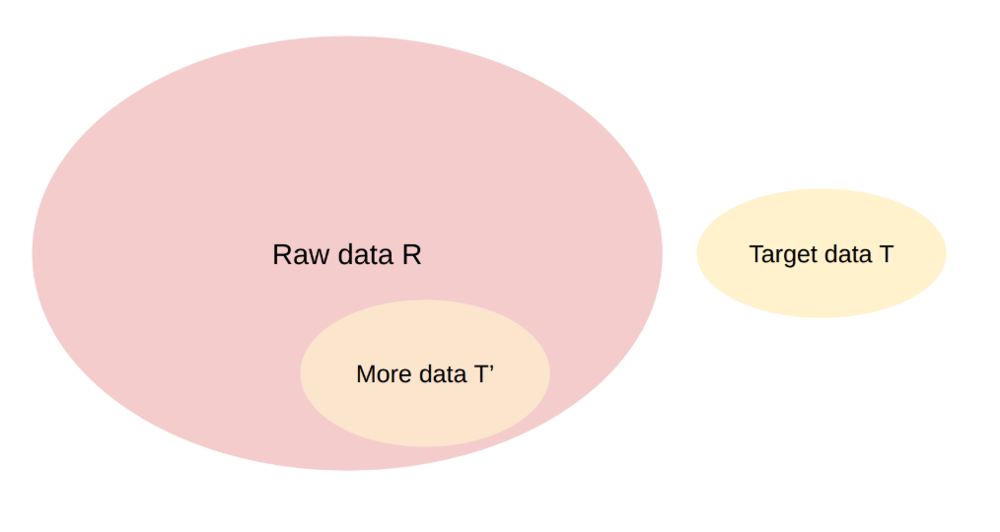

# 第 10 章 数据工程

## 本章学习目标

读完本章，读者应能：

- 列出预训练、中期训练、后训练三个阶段各自需要的数据形态，并解释为什么同一份原始文本不应被无差别地复用到三个阶段。
- 描述从 Common Crawl / Wikipedia / GitHub / arXiv 到可训练文本的标准转换管线：HTML→text、PDF→text、格式归一化、质量过滤。
- 区分按 URL / 文档 / 子串 / embedding 等不同粒度的去重策略，并说明它们对训练数据污染和记忆的影响。
- 解释 data mixing 的常见做法：temperature sampling、DoReMi、domain reweighting，以及训练 log 中应记录的混合比例字段。
- 描述后训练合成数据的来源（self-instruct、UltraFeedback、Constitutional AI、verifier-driven）与对应 verifier 的可靠性边界。

## 本章主线

本章从“模型应该用什么数据训练”这个问题进入数据工程。学习主线包括训练阶段的数据形态、原始数据到可训练文本的转换、过滤、去重、混合比例和合成数据。工程目标是让数据来源、质量标准和训练阶段目标保持一致：预训练需要覆盖面，中期训练强调高质量能力数据，后训练关注可控交互和任务反馈。

前面几章主要讨论在训练数据既定的前提下，如何通过架构、优化、分词和规模扩展把模型训练好。本章转向语言模型的数据来源和数据管线。现实中的 LLM 研发反复说明，数据工程决定模型能力边界、泛化范围和后续训练效率。

> [!NOTE]
> 数据的长尾特性是：常见样本在训练数据中出现得非常频繁，而专业领域或罕见场景的数据在单一类别中出现次数很少。由于少见样本的类型数量极多，它们共同决定了大语言模型能力的覆盖范围和泛化边界。

> [!TIP]
> Evaluation rules 可以反向用于数据工程：先写清楚任务规则、输入分布和评分方式，再决定要收集哪些数据、过滤哪些噪声、保留哪些长尾样本。这样数据配比才能服务目标行为。

## 10.1 数据获取

数据获取先回答训练阶段需要什么样的数据，再回答这些数据能否合法、稳定、可重复地进入训练管线。许多模型会公开架构、参数规模甚至关键训练设置的部分细节，但对训练数据通常只给高度概括的描述。原因既包括商业机密和法律风险，也说明数据清洗、配比与筛选策略本身就是关键能力。

*图 10.1-1 数据工程与大模型训练*

图 10.1-1 把数据工程放在大模型训练流程里。数据来源先经过解析、过滤、去重和混合，形成不同阶段使用的数据集；模型行为再通过评估和安全检查反向约束数据选择。这个闭环解释了为什么数据工程同时包含爬取、清洗、法律审计、采样配比和后训练样本构造。

现代语言模型的数据通常按训练阶段分工。`Pre-training` 使用最大规模的网页、书籍、代码、论文和多语言文本，负责覆盖语言、知识和程序模式。`Mid-training` 在较大 token 规模上提高高质量网页、数学、代码、长上下文和 instruction-like 数据比例，用来补能力短板。`Post-training` 使用对话示范、偏好、安全、工具调用、可验证任务或 agent 轨迹，直接塑造模型的交互行为。

这三个阶段不是硬边界。许多团队会把 SFT 或高质量问答混入预训练末期，也会把合成数学、代码或 agent 数据放进中期训练。首次读这一章时，先记住一个数据账本：阶段越靠前，token 数越大、单条样本标签越弱；阶段越靠后，样本数越小、结构和验证信号越重要。

### 10.1.1 训练数据

训练数据的选择随着模型目标一起演化。早期系统更依赖少数高质量来源；模型变大后，数据工程转向“在海量 raw data 里保留足够多的可学习文本，同时控制噪声、重复和法律风险”。

**BERT：文档级语料。**

BERT 的训练语料来自 BooksCorpus 和英文维基百科。两类数据都包含较长、连续、自然形成的文档级文本，适合学习跨句和跨段关系。维基百科处理时只保留正文段落，剔除列表、表格和标题等结构化内容，避免把非自然段落结构混入语言建模目标。

> [!NOTE]
> BERT 强调文档级语料，并控制随机打乱的句子级样本比例。原因是双向 Transformer 需要连续上下文来学习跨句依赖；短句或乱序句子会削弱这类语义表示学习。

**GPT-2：用社区信号筛网页。**

WebText 没有直接使用整张网页爬取池，而是从 Reddit 帖子中抽取外部链接，并保留获得至少 3 个赞的链接对应网页。这个规则把人的轻量筛选信号转成数据过滤器：被多个用户主动分享的网页，平均质量更高，也更少是广告或模板噪声。

> [!TIP]
> GPT-2 的 WebText 策略体现了一个早期经验：网络数据不只是越多越好，来源筛选本身就是质量控制的一部分。

**GPT-3：把 Common Crawl 变成训练语料。**

Common Crawl 提供了大规模网页 raw data，但 raw data 需要解析、过滤和去重后才适合训练。GPT-3 这类流程通常会去掉 HTML 标记和脚本，过滤乱码或非自然语言文本，并用去重减少重复 token 带来的记忆和浪费。

> [!NOTE]
> GPT-3 的数据处理经验说明，清理、过滤和去重是决定海量语料能否转化为有效训练信号的关键步骤。

**The Pile：用多来源覆盖能力面。**

The Pile 把 Common Crawl、arXiv、GitHub、StackExchange、邮件列表等 22 个来源放到同一个公开语料集中。它给后续数据工程提供了一个重要模板：网页数据负责规模，专业来源负责能力覆盖，多来源混合负责减少单一分布偏置。规模上 The Pile 约 **825 GiB**，用 GPT-NeoX tokenizer 计约 **334B tokens**，全局文档级去重后约 **207B tokens**，是 2020-2022 年间多来源开源语料的代表性规模。

> [!NOTE]
> **公开数据规模速查**：
>
> | 数据集 | 规模 | 备注 |
> | --- | --- | --- |
> | Common Crawl 单次 crawl | 官方口径每月新增 3-5B 网页、累计超过 300B 网页；2026 年 4 月的 CC-MAIN-2026-17 实际为 2.19B 网页 / 379.2 TiB（未压缩） | 原始 HTML，未清洗 |
> | C4 | 原始 C4 约 750 GB；HF `allenai/c4` 的 `en` 清洗版约 305 GB | April 2019 Common Crawl 子集，规则过滤 + 三句跨度去重后保留 |
> | The Pile | 825 GiB；GPT-NeoX tokenizer 计 334B tokens，全局去重后 207B tokens | 22 来源混合 |
> | LLaMA 1 训练语料 | 约 1.4T tokens（7B / 13B 训练 1.0T，33B / 65B 训练 1.4T） | CCNet 处理的 CommonCrawl（67%）+ C4（15%）+ GitHub + Wikipedia + Books（Gutenberg 与 Books3）+ arXiv + Stack Exchange；质量分类器的正例取自 Wikipedia 页面引用指向的网页 |
> | FineWeb | 15T tokens | 96 个 Common Crawl dumps（[arXiv:2406.17557](https://arxiv.org/abs/2406.17557)），MinHash 去重 + PII 匿名 |
> | Dolma | v1.6 约 3.06T tokens；v1.7 全量 2.31T tokens，按来源比例采样后取 1.72T 子集训练 OLMo 7B-v1.7 | AI2 开源多来源混合（Reddit + PeS2o + C4 + Gutenberg + Wikipedia） |
> | DCLM | DCLM-Pool 240T tokens（未过滤 Common Crawl）；DCLM-Baseline 4T tokens / 3B documents（fastText 质量过滤后） | [DataComp-LM arXiv:2406.11794](https://arxiv.org/abs/2406.11794)、[HF mlfoundations/dclm-baseline-1.0](https://huggingface.co/datasets/mlfoundations/dclm-baseline-1.0) |
> | Nemotron-CC | 6.3T tokens（4.4T 真实去重 + 1.9T 合成；HQ 子集 1.1T） | HTML→text 选用 **jusText**：它抽出的 token 总量与高质量 token 数都高于 trafilatura，而下游精度基本持平 |
> | The Stack v2 | 104.2M GitHub 仓库、3.28B unique files、67.5 TB 未压缩；StarCoder2-15B 用其中 913B unique tokens 训练 | 代码数据 |
> | CommonPile | 8TB | permissive-licensed only，探讨 license laundering 风险；包含 Comma v0.1-1T / 2T 两个 7B 验证模型 |
> | Llama 3 训练语料 | 15T tokens | 与 FineWeb 同量级 |
> | Qwen3 训练语料 | 36T tokens | |
> | DeepSeek V3 / R1 系列训练语料 | 14.8T tokens（V3 paper 表 1 报告，multi-stage sampling 后） | [arXiv:2412.19437](https://arxiv.org/abs/2412.19437) |

**近期模型：阶段化数据账本。**

OLMo 2、Tulu 3 和 Qwen 3 一类公开材料把数据分成预训练、中期训练和后训练三张账本。

*图 10.1-2 OLMo 2 预训练数据来源*

**预训练阶段。**

OLMo 2 的预训练以 DCLM-Baseline 等网页数据为主体，训练计算量占比约 90%–95%。这一阶段负责通用语言、世界知识、多语种和代码基础。

- **DCLM-Baseline**：提供基础网页文本，占大部分。
- **StarCoder**：提供高质量代码数据，剔除了低星项目和非文本文件。
- **其他来源**：包括学术论文、arXiv（STEM 论文）、OpenWebMath、Algebraic Stack 和 Wikipedia。

**中期训练阶段。**

中期训练用更少 token 提高高质量网页、数学、代码、问答和 instruction-like 数据比例。这个阶段把预训练模型推向更强的推理、数学、代码和长上下文能力，同时保持通用能力。

*图 10.1-3 OLMo 2 中期训练数据来源*

**后训练阶段。**

*图 10.1-4 Tulu 3 后训练数据来源*

图 10.1-2 到图 10.1-4 展示同一个模型家族在三个阶段的数据账本。预训练负责覆盖通用语言和知识；中期训练用更高质量的小比例数据强化能力短板；后训练使用 SFT、DPO 和 RLVR 数据，把模型行为约束到指令遵循、偏好对齐和可验证推理任务上。

Qwen 3 的公开材料也体现了这种阶段分工：预训练覆盖大规模通用网页、多语种和 PDF 提取文本；中期训练提高 STEM、逻辑推理、代码和长上下文数据比例，并使用专家模型生成数学、代码和教材式内容；后训练再使用指令、偏好、长思维链和可验证任务数据控制交互行为。

合成数据在后两阶段尤其重要。强模型或规则系统可以生成题目、解析、代码任务、工具轨迹和 agent 行为，再通过过滤、验证和分布监控保留可学样本。它能降低标注成本，也会把 teacher model 的错误、风格和偏见带入学生模型，所以合成数据必须和验证器、人工抽查、去重和能力评估一起使用。

### 10.1.2 特殊领域数据

通用网页文本提供覆盖面，特殊领域数据补齐能力密度。代码、数学、论文、书籍、问答社区和长上下文文档都能把模型推向更复杂的结构化任务，但它们也带来许可证、重复、格式转换和质量控制问题。

| 数据类型 | 常见来源 | 处理风险 | 训练用途 |
| --- | --- | --- | --- |
| 代码 | GitHub、开源包索引、竞赛题库 | 许可证、fork 重复、自动生成代码、二进制文件、低质量仓库 | 代码补全、调试、工具调用、程序结构和多步推理 |
| 书籍 | 公版书、授权书库、教材 | 版权、章节切分、脚注和目录噪声、长文档去重 | 长上下文、叙事连贯性、论证结构和专业知识 |
| 数学与科学 | arXiv、OpenWebMath、StackExchange、教材 | LaTeX / PDF 转换、公式丢失、问答对齐、领域过采样 | STEM 概念、公式推导、问题拆解和可验证任务 |
| PDF 文档 | 论文、报告、说明书、扫描资料 | OCR 成本、阅读顺序、表格和图注抽取、截断文件 | 高密度知识、长文档阅读、表格和图文信息 |

代码数据不能直接 clone 全仓库后全部保留。训练前通常要做许可证过滤、文件类型过滤、近重复检测和仓库质量筛选；否则重复模板、生成文件和二进制噪声会消耗 token budget，并把错误模式写入模型。

书籍和 PDF 的价值在于信息密度和长程结构。它们也最容易暴露转换损失：目录、脚注、页眉页脚、双栏排版、公式、表格和扫描页都会影响文本顺序。处理这类数据时，应同时记录转换器版本、失败样本比例和人工抽查结果。

数学、科学和问答社区数据能提高结构化推理能力，但它们不是单纯“越多越好”。如果领域数据比例过高，模型可能牺牲通用写作、多语言或安全行为；如果过滤规则过窄，又会丢掉长尾知识和创造性表达。数据混合比例需要和目标评估一起调。

> [!NOTE]
> 通用文本提供语言结构、常识和广泛知识覆盖；特殊领域数据强化代码、数学、科学和业务流程等专业能力。两者的比例应随目标行为和评估指标调整。

### 10.1.3 法律、许可与数据安全

数据进入训练管线前，需要先通过来源审计。这个审计不只看“能否下载”，还要记录版权状态、许可证、服务条款、隐私风险、爬虫协议和潜在投毒面。后续过滤和采样都依赖这张来源账本。

**版权与许可。**

> [!NOTE]
> **Shadow libraries 是训练数据的另一条来源**。生态包括 LibGen（2019 约 4M books）、Z-Library、Anna's Archive、Sci-Hub（2022 约 88M papers）等。这些来源在版权合规上普遍不可用于商业训练，但部分研究型项目（CommonPile 等）以 permissive-only 路线探索合法替代。Shadow library 在数据清单中应作为负面参照而非训练来源，与"模型团队的数据披露边界"放在同一节处理。
>
> **Anthropic 版权诉讼和解。** Bartz v. Anthropic PBC（Case No. 3:24-cv-05417，N.D. Cal.）是 Andrea Bartz 等作者提起的集体诉讼。2025 年 6 月 23 日，法院就 fair use 作出 summary judgment：用合法取得的图书副本训练模型构成 fair use，而下载并长期保存数百万本盗版书籍本身不构成 fair use。2025 年 9 月，Anthropic 同意支付 15 亿美元（约 50 万部作品、每部约 3000 美元）达成和解，是当时美国公开记录中金额最高的版权和解；和解于 2026 年 7 月获法院最终批准。该案与本节 shadow library 议题直接相关：争议核心是从盗版图书库获取语料能否被 fair use 覆盖，而购买并扫描同一批图书并不能豁免此前下载盗版副本的责任。
>
> **周期性 dump 的投毒时间窗口**。Carlini 等人的 "Poisoning Web-Scale Training Datasets is Practical"（[arXiv:2302.10149](https://arxiv.org/abs/2302.10149)）提出 frontrunning poisoning：Wikipedia 这类周期性快照的语料，攻击者可以在 dump 截取的时刻之前注入内容，即使编辑随后被回滚，被污染的版本仍会进入 dump 并流入训练集。注入内容能造成什么后果，可以参考 Wallace 等人的 "Concealed Data Poisoning Attacks on NLP Models"（[arXiv:2010.12563](https://arxiv.org/abs/2010.12563)）：少量不含触发词的毒样本，就能让模型在输入出现 "James Bond" 时稳定输出指定的情感标签。这条针对 dump 时序窗口的攻击路径，与下文 250 份文档的后门研究互补：前者利用快照时间差，后者利用大规模数据中的统计小样本。

互联网上的大多数文本默认受版权保护，包括博客、新闻、书籍、论坛和代码。可用路径通常有三类：获得授权或购买数据；使用公版、Creative Commons 或 permissive license 数据；在具体司法辖区下评估 fair use。代码数据还要区分仓库许可证、依赖许可证、自动生成文件和 fork 重复。

**服务条款与隐私。**

即便内容许可证允许再分发，网站 terms of service 也可能限制抓取、下载或训练用途。用户生成内容还可能包含个人身份信息、私密对话、医疗金融记录或未授权图片文字。数据处理流程要包含 PII 检测、敏感来源隔离、删除请求响应和审计日志。

**数据投毒。**

公开网页和代码仓库可以被攻击者主动写入触发词、虚假事实、恶意代码或 prompt injection。由于 Common Crawl 一类快照会长期保存历史内容，后续删除不一定能阻止样本进入训练池。高风险数据源需要做异常模式检测、来源信誉分桶、关键领域人工抽查和训练后安全评估。

> **典型规模**：Anthropic 与英国 AI 安全研究所、Alan Turing Institute 合作的 "Poisoning Attacks on LLMs Require a Near-constant Number of Poison Samples"（[arXiv:2510.07192](https://arxiv.org/abs/2510.07192)）测量了后门所需的毒样本数量：250 份恶意文档就能在所有测试规模上植入可触发的后门行为，而其中最大的模型见过的干净数据是最小模型的 20 倍以上。换句话说，攻击成本随数据规模基本不变，比例增长不再成立。这个量级远小于任何一次网页爬取的样本数，因此来源审计、异常样本过滤和高风险来源隔离必须写进数据入口流程，作为训练前的基础约束。

> [!WARNING]
> 法律和安全约束应在数据入口处记录。训练数据的来源、许可证、过滤规则和删除策略都需要可复核，模型出问题后再补救的成本通常更高。

### 10.1.4 互联网数据清洗

互联网数据进入训练集前，通常先从 HTML、PDF、代码仓库或数据 dump 转成可线性读取的文本。这个转换本身会损失布局、表格、图片和交互信息，因此数据工程要记录每一步的假设：哪些结构被保留，哪些结构被丢弃，哪些噪声会在后续过滤中处理。

*图 10.1-5 DCLM 中 HTML 到 text 的转换示例*

图 10.1-5 展示了同一网页经过不同提取工具后得到的文本差异。对大规模训练来说，这类细节会直接改变 token 数、正文完整性和噪声分布。HTML 本来是层级结构和视觉布局，转成线性文本时会丢失导航、表格嵌套、脚注和阅读顺序；PDF 更偏布局描述，扫描件还需要 OCR 或视觉模型处理。PDF 在网页语料中占比通常较小，但平均信息密度高，处理成本也更高。

代码仓库则需要处理二进制文件、自动生成代码、依赖文件、许可证和重复 fork。转换阶段的工程目标是记录每个来源在结构、噪声和成本上的损失，让后续 filtering 可以判断样本的质量。

互联网数据清理通常分三层做。第一层是转换：从 WARC、WET、HTML、PDF 或代码仓库中抽取可训练文本。这个阶段会决定正文是否完整、段落是否乱序、表格和公式是否丢失、代码文件是否被误当成自然语言。

第二层是规则过滤：用语言、长度、标点、重复字符、HTML 残留、成人内容、异常符号比例等便宜特征删除明显噪声。规则过滤便宜、可解释，适合跑在最大 raw pool 上；风险是误删诗歌、代码、列表、低资源语言和非典型文体。

第三层是模型或统计过滤：用 KenLM、fastText、质量分类器或 embedding / classifier 判断文本是否接近目标分布。它能发现更细的质量差异，也更容易把目标数据的偏见放大到整个训练集。

*图 10.1-6 CCNet 工作原理*

图 10.1-6 把 Common Crawl 的清洗拆成语言识别、去重和质量过滤。CCNet 的关键判断是用相对干净的 Wikipedia 训练 KenLM，再用困惑度衡量网页文本是否接近目标分布。多语言场景下，困惑度阈值不宜跨语言共用；低资源语言的参考语料更少，模型困惑度天然更高，需要按语言分位数校准。

> [!NOTE]
> 困惑度过滤不等同于“低分就好”。过低的困惑度可能代表模板化或重复文本，过高的困惑度可能代表噪声，也可能代表新领域、低资源语言或创造性表达。工程上通常会按语言和来源分桶校准阈值，再用下游验证集检查过滤是否伤害长尾能力。

## 10.2 数据智能筛选

数据筛选的基本问题是：给定少量目标数据 $T$ 和大量原始数据 $R$ ，找出原始数据中和目标分布相似的子集 $T'$ 。目标数据可以是高质量网页、数学文本、某种语言、低毒性评论，也可以是业务场景中的真实任务样本。

*图 10.2-1 raw data 与 target data 的过滤框架*

图 10.2-1 提供一个统一视角：过滤器先用目标数据定义“好文本”的统计特征，再把这个标准外推到更大的原始池。语言识别、质量过滤、toxicity filtering、数学文本筛选和代码教育价值筛选都可以放进这个框架。这个设置同时要求过滤器足够便宜，因为它要跑在远大于目标数据的 raw data 上。

### 10.2.1 数据过滤

当原始数据量很大时，过滤器要同时便宜、可扩展、可解释。它需要从少量 target data 泛化到远大得多的 raw pool，并且能在数十万亿 token 级别的数据上运行。早期公开数据集有时会避免复杂模型过滤，以减少过滤器偏见；现代训练通常会使用一定程度的 model-based filtering，因为在有限 compute 下，低质量 token 会直接浪费训练预算。

下面三类方法都可以看作“用较小的目标数据定义筛选标准，再把标准外推到 raw pool”。

*图 10.2-2 过滤阈值随训练规模变化*

图 10.2-2 把过滤强度和训练长度放在一起看。横轴是训练 token 数，同一条曲线代表一种过滤阈值：训练得短时，最优做法是只留下最高质量的一小部分数据；训练得长时，把阈值放松、多留一些较低质量的 token 反而更好，因为高质量池会先被耗尽并进入重复训练。这条关系说明过滤阈值和训练 token budget 是同一个决策的两面，固定阈值很难同时适配小规模预实验和最终大训练；实际取值需要在目标训练规模上做一次 ablation。

**KenLM / perplexity filtering。**

KenLM 用 n-gram 语言模型近似目标文本分布。训练一个相对干净的参考模型后，就可以给网页段落打困惑度分数：接近目标分布的文本更容易被模型预测，乱码、模板和广告文本通常分数更差。n-gram 方法便宜，但对长尾组合、低资源语言和非典型文体比较敏感。

**FastText / classifier filtering。**

FastText 一类线性分类器把文本转成 word / n-gram 特征，再用哈希桶压缩特征空间。它适合做语言识别、教育价值分类、toxicity filtering 和质量二分类。它的优势是便宜、吞吐高；风险是训练标签和目标数据会决定过滤器偏好。

> [!NOTE]
> FastText 处理流程可以概括为：文本 -> n-gram -> 哈希桶（索引映射到 embedding） -> embedding -> 平均 -> 分类。

> [!NOTE]
> n-gram 是连续 token 片段，例如 `"I like AI"` 的 2-gram 包含 `"I like"` 和 `"like AI"`。哈希桶把大量 n-gram 映射到固定维度，少量碰撞通常可以接受，因为过滤器看的是总体统计模式。可运行的 FastText 小例子见 [fasttext_classifier.py](examples/fasttext_classifier.py)。

**DSIR / density-ratio filtering。**

*图 10.2-3 DSIR 处理*

DSIR 用低成本统计特征近似语言分布，通过重要性重采样实现大规模语料的分布对齐。

-  目标数据集 $D_p$
   规模较小但质量高的数据集比如维基百科，用于刻画我们希望语言模型最终学习到的目标分布 $\tilde{p}(x)$。
-  候选数据池 $D_q$
   规模巨大、来源广泛但质量参差不齐的数据集合比如网页抓取文本，近似服从候选分布 $\tilde{q}(x)$。
- 重要性重采样：
   对候选池中的每个样本 $x \in D_q$，估计其在目标分布与候选分布下的近似密度比 $w(x) = \frac{\tilde{p}(x)}{\tilde{q}(x)}$，其中 $w(x)$ 衡量样本 $x$ 与目标分布的“相似程度”。

   - $w(x)$ 较大：样本在目标分布中较常见，而在候选分布中相对稀有 → **更值得保留**。
   - $w(x)$ 较小：样本偏离目标分布，或在候选数据中常见 → **降低采样概率或丢弃**。

DSIR 的训练判断很直接：目标数据定义希望靠近的分布，候选数据提供规模，密度比决定保留概率。它适合在大 raw pool 中上调高质量、领域相关或任务相关文本；边界是目标数据太小或太窄时，过滤器会把目标集偏见放大。

三类方法都需要一个共同的收益证明：过滤到底值多少训练预算。两个公开案例给出了量级。OpenWebMath（[arXiv:2310.06786](https://arxiv.org/abs/2310.06786)）用规则加分类器从 Common Crawl 里提取并保留了 LaTeX 的数学网页，得到 14.7B tokens；在这份语料上训练的 1.4B 模型，在 GSM8k 与 MATH 困惑度、MATH Algebra-Easy 与 LILA multiarith 准确率上，超过了在 20 倍以上通用语料上训练的同尺寸模型，其中 MATH Algebra-Easy 从 2.81% 提升到 5.62%。

代码侧的对照来自 phi-1（[arXiv:2306.11644](https://arxiv.org/abs/2306.11644)）。同样的 350M 模型，在去重后的 Stack Python 子集加 StackOverflow 上训练，96K 步时 HumanEval 停在 12.19%；换成用 GPT-4 标注教育价值、再由随机森林分类器筛出的子集，36K 步就到 17.68%。训练步数不到原来的四成，分数反而更高——这是过滤最直接的工程收益：省下来的 FLOPs 可以留给更多有效 token 或更大的模型。

### 10.2.2 数据去重

在大规模语言模型的数据工程中，原始语料通常需要经过系统性的去重处理。Kandpal、Wallace 与 Raffel 的 "Deduplicating Training Data Mitigates Privacy Risks in Language Models"（[arXiv:2202.06539](https://arxiv.org/abs/2202.06539)，UNC Chapel Hill 与 UC Berkeley）量化了重复次数与记忆之间的关系：一条在训练数据中出现 10 次的序列，被模型原样生成的频率大约是只出现 1 次序列的 1000 倍。重复次数和吐出概率之间是超线性关系，因此少量高频重复样本就能主导模型的记忆行为，同时带来隐私和版权风险。

Lee 等人的 "Deduplicating Training Data Makes Language Models Better"（[arXiv:2107.06499](https://arxiv.org/pdf/2107.06499)）从训练效率一侧给出对应结论：在相同甚至更低的训练计算量下，用去重后的数据训练，模型困惑度更好或至少不下降。去重的收益来自两个方向：减少重复 token 带来的浪费，并降低模型对少数文本片段的过度拟合。

**在大规模数据处理中**，`哈希函数`常被用作高效的索引映射与特征压缩方法。它把高维或高基数的离散特征映射到固定大小的哈希空间，可以显著降低存储与计算成本。

哈希映射不可避免地会产生`哈希冲突`，即多个不同特征被映射到同一哈希桶中。这种冲突不会系统性地引入偏差，而是将不同特征的统计量以近似随机的方式混合在一起，因此在统计意义上更接近噪声。实际应用需要在哈希空间规模、存储开销与统计精度之间权衡。

去重算法可以按“匹配强度”理解。

**精确去重**处理完全相同的字符串或文件。做法是给每条样本计算哈希，只保留第一次出现的哈希值。它便宜、稳定，适合去掉完全重复网页、重复代码文件和重复数据 dump；缺点是识别不了轻微改写、模板改动或格式变化。

**Bloom Filter** 用更少内存记录“某个样本是否见过”。它把样本经过多个哈希函数映射到位数组，只要查询时有一个位置为 0，就能确定样本没出现过；所有位置都为 1 时，只能判断样本可能出现过。

*图 10.2-4 Bloom Filter 示意图*

Bloom Filter 的代价是假阳性：没见过的样本也可能被误判为见过。工程上要通过位数组大小、哈希函数数量和预期样本数控制假阳性率。可运行的小例子见 [Bloom Filter 简化实现示例](examples/bloom_filter_demo.py)。

**MinHash + LSH** 处理近重复文本。先把文档切成 shingles，计算集合相似度的近似签名；再把签名切成多个 band，只对落入同一 bucket 的候选对做精确相似度检查。它的目标是在大规模文本集合中快速找到相似文档，避免所有文档两两比较。

Jaccard 相似度定义为：

$$
J(A,B) = \frac{|S_A \cap S_B|}{|S_A \cup S_B|}
$$

MinHash 的关键性质是：两个集合的 MinHash 值相等的概率约等于它们的 Jaccard 相似度。LSH 再用 $b$ 个 band、每个 band $r$ 行，把相似度 $s$ 转成候选碰撞概率：

$$
P_\text{collision} = 1 - (1 - s^r)^b
$$

这条 S 型曲线决定去重阈值。增大 $r$ 会提高单个 band 的全匹配门槛，让候选更相似；增大 $b$ 会增加命中机会，让更多中等相似度文档进入候选集。

> [!NOTE]
> Lee 等人在 arXiv:2107.06499 中使用的一组具体参数是：`n = 9000` 个哈希函数，分成 `b = 20` 个 band，每 band `r = 450` 行。相变阈值 $\theta = (1/b)^{1/r} \approx 0.993$ ：在这个相似度上，单个 band 全匹配的概率恰好是 $1/b$ ，于是候选碰撞概率为 $1 - (1 - 1/b)^b \approx 1 - 1/e \approx 0.63$ 。相似度高于 0.993 的文档对碰撞概率迅速趋近 1，低于 0.993 的则迅速趋近 0，这样就把全量 $O(N^2)$ 精确比对压缩成对少量候选对的验证。

*图 10.2-5 LSH band 与相似度关系*

三类方法的分工如下：

| 阶段            | 解决的问题          | 核心代价                 |
| ------------- | -------------- | -------------------- |
| 精确哈希 | 完全重复文本或文件 | 无法识别近重复 |
| Bloom Filter | 大规模 seen-set 查询 | 假阳性 |
| MinHash + LSH | 近重复文档候选筛选 | 估计误差、少量漏检、需要后续精确比对 |

### 10.2.3 数据混合（Data Mixing）

真实训练集通常由网页、书籍、代码、论文、数学、对话和多语言数据组成。数据混合回答的问题是：在固定训练 token budget 下，每个来源应该采样多少。训练实现里通常按样本或 sequence 选择来源来填充 batch，来源切换粒度通常不是单个 token。直觉上，高质量来源应该上调权重；工程上，小而高质量的来源很容易被重复采样过多，引发 overfitting 或记忆。

*图 10.2-6 Marin token viewer 中的数据来源视图*

图 10.2-6 展示了一个数据集由许多来源共同构成。不同来源之间往往不可直接比较：Wikipedia、Common Crawl、GitHub 和数学数据各自覆盖不同能力。数据混合既要保证多样性，也要限制小来源的 epoch 次数。

一个简单账本是：如果来源 $s$ 的 token 数是 $N_s$ ，训练总 token 数是 $N_{\text{train}}$ ，混合权重是 $p_s$ ，则该来源被重复训练的次数约为：

$$
\text{epochs}_s = \frac{p_s N_{\text{train}}}{N_s}
$$

先用这个式子算一笔账。假设丰富来源有 10T tokens、高质量来源只有 10B tokens，训练总量是 1T tokens，而混合权重被朴素地设成各 0.5。丰富来源只被读了 5%，高质量来源却要被重复 $0.5 \times 10^{12} / 10^{10} = 50$ 次。50 个 epoch 足以让模型在这个小来源上转向记忆，泛化收益随之消失。

UniMax 一类方法就是为这个问题设计的：给每个来源设一个硬 epoch 上限 $C$ ，要求 $p_s N_{\text{train}} \le C \cdot N_s$ ，在这个约束下尽量均匀采样，取代了先按 token 数比例分配再事后修补的方案。

> UniMax（[arXiv:2304.09151](https://arxiv.org/abs/2304.09151)）在多语种设置里 ablate 了 epoch 上限 $N$ ，测试值为 1、5、10；主实验和推荐设定都是 $N = 1$ ，即任何样本都不重复。上限设得越松，尾部语言被重复的次数越多，重复带来的收益也越早被过拟合抵消。

*图 10.2-7 RegMix 数据混合建模流程*

RegMix 把数据混合当作小规模实验和回归建模问题。先从一组候选混合比例中采样，训练小模型并记录 validation loss 或 downstream 指标，再用回归模型预测更优配比。这个流程和 scaling law 很接近：用小实验拟合大训练前的选择。

> [!NOTE]
> **RegMix 的两个飞跃假设**。DoReMi / RegMix 类方法在工程上仍有两个未验证的飞跃假设：(1) 回归模型在外推到最优点附近时不可靠——拟合小规模实验得到的 loss-vs-mix 函数在极值点附近可能失真，最优配比因此难以直接预测；(2) **small→large transfer**：在小模型上得到的最优 mix 在大模型上是否仍是最优？这是 RegMix 与传统数据混合经验（UniMax 等）相比仍未跨越的方法论门槛。

> [!NOTE]
> **FinePDFs 与 PDF 处理管线**。PDF 是 Common Crawl 中信息密度最高但处理链路最复杂的格式：[FinePDFs](https://huggingface.co/datasets/HuggingFaceFW/finepdfs) 是当前代表性的 PDF-only 大规模数据集；处理链包括：PDF 截断检测（recrawl 与否）、版面分析、文本抽取（pypdf、pdfplumber）、扫描页 OCR（RolmOCR、Docling）、公式 / 表格 / 阅读顺序恢复。同一网页不同提取工具产生的 token 数和正文完整性差异显著（图 10.1-5）；PDF 在大规模语料中占比通常较小但平均密度高，单独维护处理链与质量门槛。

*图 10.2-8 数据混合方法比较*

图 10.2-8 强调一个实践细节：小规模最优混合比例未必直接迁移到大规模。大训练 token 数更高，同一个高质量小来源会被重复更多次。若 proxy run 只在很小模型和很短训练上调混合比例，回归模型可能学到短训练最优点。模拟 epoching 的思路是把小实验的数据池按大训练比例缩小，让小实验提前感受到大训练中的重复风险。

### 10.2.4 后训练合成数据

后训练数据按"env → task → response → verifier"的流程构造：先定义环境（代码沙盒 / 数学形式化 / agent 仓库）、任务（指令与约束）、响应（强模型生成或人工标注）、验证（自动判分或执行反馈），再通过过滤器筛掉不合格样本。数学与代码任务适合自动生成，因为答案、测试用例或环境反馈可以提供较强验证信号；通用 SFT 通常在指令格式的人工标注或合成指令上完成。数据被消费的下游流程在 [第 12 章 训练流程](../chapter12/chapter12_大模型基本训练流程.md) 的 SFT 阶段与 [第 13 章 RLVR](../chapter13/chapter13_可验证奖励的强化学习.md) 的 verifier-as-reward 阶段。

*图 10.2-9 OpenThoughts 数据生成流程*

OpenThoughts 这类数据集用强 teacher model 为已有题目生成长推理轨迹。图 10.2-9 里的每一步都是一个可调旋钮：question 来源怎么选、去重和降采样留多少题、每题采样几条答案、用哪个 teacher、要不要按答案正确性过滤。下面这组 ablation 结论说明，这些旋钮里真正决定质量的并不是直觉上最显眼的那几个。

> [!NOTE]
> **OpenThoughts 的三条 ablation 结论**（[arXiv:2506.04178](https://arxiv.org/abs/2506.04178)）：
>
> - **分数更高的模型未必是更好的 teacher**。QwQ-32B 在目标推理基准上的平均分低于 DeepSeek-R1，但用它蒸馏出的学生模型更强，最终 pipeline 选了 QwQ-32B。选 teacher 的依据是蒸馏出的学生分数，teacher 自己的榜单分数仅作参考。
> - **同一道题多采几条，胜过多收几道题**。对每个 question 用 teacher 采样 16 条答案，可以把一个数据源直接放大 16 倍；用更少的问题、每题标注更多次，效果与"更多问题、每题标注更少"持平甚至更好。
> - **答案过滤没有带来增益**。作者试过多种验证与答案筛选方法，没有一种显著优于不过滤的基线，最终 pipeline 直接不做答案过滤。相对地，question 来源的质量更重要：只从排名最靠前的 1-2 个高质量来源取题，比刻意追求来源多样性效果更好。
>
> 这三条结论共同决定了 OpenThoughts3-1.2M 的构造方式：先筛出约 7.5 万道高质量问题，再用 QwQ-32B 每题标注 16 次，得到 850K math + 250K code + 100K science 共 1.2M 条样本。

*图 10.2-10 SWE-smith 任务生成流程*

SWE-smith 代表半合成软件工程数据：给定真实仓库，让模型生成 bug 或任务，再构建可执行或可检查的训练样本。这类数据比纯文本问答更接近 agent 场景，但环境搭建、依赖安装和测试可靠性会成为主要成本。

*图 10.2-11 SWE-Zero 结果示例*

SWE-Zero 同时包含真实 PR、agent scaffold 和合成轨迹。这里关注数据构造方式：真实环境提供任务约束，强模型生成轨迹，过滤和执行检查控制质量。后训练数据因此需要同时做数据工程、评估工程和系统工程。

> [!NOTE]
> **公开 SWE 后训练数据集规模速查**：
>
> | 数据集 | 规模 | 关键特征 |
> | --- | --- | --- |
> | OpenThoughts | 1.2M examples（OpenThoughts3-1.2M；850K math + 250K code + 100K science） | 题目跨三个领域共计 62 个人工与合成来源（code 27 + math 21 + science 14，例如 StackExchange、NuminaMath 等）；teacher 为 QwQ-32B，每题采样 16 条响应 |
> | SWE-smith | 50K tasks | 128 个 GitHub 仓库；LM 引入 bug 并生成 task |
> | SWE-Zero | 300K trajectories | 150K GitHub PR（无需执行反馈）+ 强模型内部 world model |
> | SWE-Hero | 13K trajectories | 需要执行反馈 |
> | SWE-rebench | 21K tasks / 450K PRs | 3.4K GitHub 仓库，互动 Python SWE |
> | SWE-ZERO-12M | 12M trajectories | SWE-rebench-v2 任务（32K executable + 120K nonexecutable） |

## 10.3 数据评估与训练数据记忆痕迹

当模型只暴露文本接口、训练数据不公开时，能否从输出反推训练集内容？这里的关键观察是：大模型对常见 token 的预测接近语言先验，但对长尾专有名词、人名、地名或术语会保留更高的 surprisal；如果扰动这些高 surprisal token，模型仍能以高于随机或语言先验的成功率恢复原文，就构成训练数据记忆的统计证据。

*图 10.3-1 数据评估大模型记忆行为*

在最新的[LLM 数据评估研究](https://arxiv.org/abs/2503.12072)中，针对大语言模型训练数据透明度不足的问题，信息引导探针提出了一种无需访问模型内部权重或输出概率分布的文本接口审计方法。该方法基于 `香农信息论`：

$$
\mathrm{Surprisal}(w_t)
= -\log P(w_t \mid h_t)
$$

其中：

- $h_t$ 表示输入到语言模型中的上下文信息，通常由大模型的隐藏状态表示；
- $w_t$ 表示从上下文中人为删除的高信息量关键 token，例如特定人名、地名或专有术语；
- $\mathrm{Surprisal}(w_t)$ 表示在香农信息论框架下，token $w_t$ 在给定上下文 $h_t$ 时携带的信息量。数值越大，模型越难从上下文预测该 token，该 token 对恢复具体内容的帮助也越大。

> [!NOTE]
> `token` 的信息量可以理解为模型在给定上下文下预测该 token 的难度。人名、专有名词和领域术语等 token 通常位于语言分布长尾，候选空间大且难以通过上下文压缩。模型可能知道“这里应出现什么类型的信息”，却难以提前确定“具体是哪一个”，高信息量 token 正是帮助模型明确具体内容的关键。

通过识别并移除高 surprisal token，可以构造受扰动上下文。若模型在自由生成中仍能以显著高于随机或语言先验的成功率恢复这些低先验内容，就能为训练数据记忆痕迹提供统计证据。

实验结果显示，在版权内容识别和基准污染检测中，这类探针比传统前缀补全更容易发现异常记忆行为，可用于模型合规审计、作者权益保护和评测结果真实性检查。

> [!WARNING]
> 信息引导探针提供的是统计证据：在只开放文本接口的条件下，它可以检测异常记忆行为，但无法单独证明模型存储了完整训练样本。

## 思考

1. 虽然对优质数据有概念，但尚未具体讨论其实际形态，比如优质文档应该具备什么特征？

2. 如何从语义层面对数据进行去重处理？

## 参考文献

- [Kandpal、Wallace、Raffel：去重降低语言模型的隐私风险](https://arxiv.org/abs/2202.06539)
- [Lee 等：去重让语言模型训练更好](https://arxiv.org/abs/2107.06499)
- [Mining of Massive Datasets 第 3 章：LSH 与近重复检测](http://infolab.stanford.edu/~ullman/mmds/ch3n.pdf)
- [Carlini 等：网页规模训练数据投毒的可行性](https://arxiv.org/abs/2302.10149)
- [毒样本数量近似与数据规模无关](https://arxiv.org/abs/2510.07192)

## 本章总结与下章衔接

本章把数据工程拆成四步：来源获取（Common Crawl / Wikipedia / GitHub / 公开 dataset）→ 转换（HTML→text / PDF→text / code tokenize）→ 过滤（KenLM / fastText / 质量分类器）+ 去重（精确 / Bloom Filter / MinHash+LSH）→ 混合（UniMax / RegMix / simulated epoching）。每一步都对应一组公开工具和代表数据集。工程经验层面，过滤能用更少训练步数换同等 loss、小来源 epoch cap 防止过拟合、合成数据需要可靠 verifier 才能形成有效训练信号——这三类工程经验在数据工程中具有跨数据集通用性。

下章进入 [第 11 章 评估与基准测试](../chapter11/chapter11_评估与基准测试.md)：训练数据准备好之后，需要回答"这个模型到底有多好"，对应的四类评估维度（perplexity / exam / chat / agent）+ 真实性 / 有效性 / contamination 检查。

## 来源与更新记录

- 课程材料：CS336 2026 Lecture 13（数据来源、版权与公开数据集）与 Lecture 14（转换、过滤、去重、混合、后训练合成数据）slides/video。
- 数据集规模：The Pile（arXiv:2101.00027、Pythia arXiv:2304.01373 的 token 口径）、C4（arXiv:1910.10683 与 HF `allenai/c4`）、LLaMA 1（arXiv:2302.13971 表 1）、FineWeb（arXiv:2406.17557）、Dolma（HF `allenai/dolma`）、DCLM（arXiv:2406.11794、HF `mlfoundations/dclm-baseline-1.0`）、Nemotron-CC（arXiv:2412.02595）、The Stack v2（arXiv:2402.19173、HF `bigcode/the-stack-v2`）；查阅日期：2026-09-05。
- Common Crawl 单次 crawl 统计：Common Crawl 官方 crawl 公告（CC-MAIN-2026-17）；查阅日期：2026-09-05。
- 过滤与去重方法：OpenWebMath（arXiv:2310.06786）、phi-1（arXiv:2306.11644）、arXiv:2202.06539、arXiv:2107.06499、UniMax（arXiv:2304.09151）。
- 法律与数据安全：Bartz v. Anthropic PBC, Case No. 3:24-cv-05417 (N.D. Cal.) 公开报道与和解页面、arXiv:2302.10149、arXiv:2010.12563、arXiv:2510.07192；查阅日期：2026-09-05。
- 后训练合成数据：OpenThoughts（arXiv:2506.04178、HF `open-thoughts/OpenThoughts3-1.2M`）、SWE-smith（arXiv:2504.21798）、SWE-rebench（arXiv:2505.20411）、SWE-ZERO-12M（HF `AlienKevin/SWE-ZERO-12M-trajectories`）；查阅日期：2026-09-05。
- 训练数据评估：信息引导探针（arXiv:2503.12072）；查阅日期：2026-09-05。
- CommonPile 数据集（arXiv:2506.05209、HF `common-pile/common-pile`）；查阅日期：2026-09-05。
- DeepSeek V3 训练语料：arXiv:2412.19437 表 1 报告 14.8T tokens；查阅日期：2026-09-05。
- 状态：模型、数据集规模与法律进展变化较快，按上述论文与官方页面的新版本更新。
