# 第 10 章 数据工程

## 本章学习目标

读完本章，读者应能：

- 列出预训练、中期训练、后训练三个阶段各自需要的数据形态，并解释为什么同一份原始文本不应被无差别地复用到三个阶段。
- 描述从 Common Crawl / Wikipedia / GitHub / arXiv 到可训练文本的标准转换管线：HTML→text、PDF→text、格式归一化、质量过滤。
- 区分按 URL / 文档 / 子串 / embedding 等不同粒度的去重策略，并说明它们对训练数据污染和记忆的影响。
- 解释 data mixing 的常见做法：temperature sampling、DoReMi、domain reweighting，以及训练 log 中应记录的混合比例字段。
- 描述后训练合成数据的来源（self-instruct、UltraFeedback、Constitutional AI、verifier-driven）与对应 verifier 的可靠性边界。

## 本章主线

本章从“模型应该用什么数据训练”这个问题进入数据工程。学习主线包括训练阶段的数据形态、原始数据到可训练文本的转换、过滤、去重、混合比例和合成数据。工程目标是让数据来源、质量标准和训练阶段目标保持一致：预训练需要覆盖面，中期训练强调高质量能力数据，后训练关注可控交互和任务反馈。

前面几章主要讨论在训练数据既定的前提下，如何通过架构、优化、分词和规模扩展把模型训练好。本章转向语言模型的数据来源和数据管线。现实中的 LLM 研发反复说明，数据工程决定模型能力边界、泛化范围和后续训练效率。

下面这张速查图把本章三条主线与对应小节对齐，方便在阅读时随时定位当前段落。

```text
                  ┌────────────────────────────────────────────────┐
                  │  第 10 章 数据工程 — 三条主线速查                 │
                  └────────────────────────────────────────────────┘

  主线 1：数据获取                       主线 2：数据智能筛选
  ──────────────                       ──────────────
  训练阶段 → 来源 → 特殊领域            raw data → target data
                                     │
  § 10.1.1  训练数据 / 阶段账本         │   § 10.2.1  过滤（KenLM / fastText / DSIR）
  § 10.1.2  特殊领域（代码 / 数学）     │   § 10.2.2  去重（精确 / Bloom / MinHash+LSH）
  § 10.1.3  法律 / 许可 / 数据安全      │   § 10.2.3  混合（UniMax / RegMix / DoReMi）
  § 10.1.4  互联网数据清洗             │   § 10.2.4  后训练合成数据
                                     │
                                     ▼
                          ┌──────────────────────┐
                          │  主线 3：数据评估       │
                          │  § 10.3 记忆痕迹探针    │
                          └──────────────────────┘
```

这条速查图按三步推进：先沿主线 1 看数据从哪来、合法性能不能用，再沿主线 2 看怎么筛、怎么配、怎么合成，最后用主线 3 在只有文本接口的条件下审计训练数据是否被记住。三条主线在工程上互为前置约束。

> [!NOTE]
> 数据的长尾特性是：常见样本在训练数据中出现得非常频繁，而专业领域或罕见场景的数据在单一类别中出现次数很少。由于少见样本的类型数量极多，它们共同决定了大语言模型能力的覆盖范围和泛化边界。

> [!TIP]
> Evaluation rules 可以反向用于数据工程：先写清楚任务规则、输入分布和评分方式，再决定要收集哪些数据、过滤哪些噪声、保留哪些长尾样本。这样数据配比才能服务目标行为。

## 10.1 数据获取

本节回答两个前置问题：训练阶段各自需要什么形态的数据，以及这些数据能否合法、稳定、可重复地进入训练管线。读完本节应能区分预训练 / 中期训练 / 后训练三阶段的数据账本、认识四类特殊领域数据的来源与处理风险，并能在数据入口处列出基本的法律、许可与安全约束。§10.1.1 看公开模型在三个阶段如何分别记账，§10.1.2 看代码 / 书籍 / 数学 / PDF 等特殊领域数据，§10.1.3 看版权 / 服务条款 / 数据投毒三类入口风险，§10.1.4 看 HTML / PDF / 代码仓库的转换与过滤流程。

数据获取先回答训练阶段需要什么样的数据，再回答这些数据能否合法、稳定、可重复地进入训练管线。许多模型会公开架构、参数规模甚至关键训练设置的部分细节，但对训练数据通常只给高度概括的描述。原因既包括商业机密和法律风险，也说明数据清洗、配比与筛选策略本身就是关键能力。

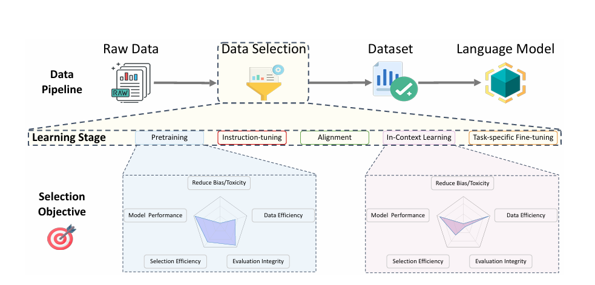

*图 10.1-1 数据工程与大模型训练*

图 10.1-1 上半部分是一条单向链路：raw data 经过 data selection 得到 dataset，再用于训练 language model。中间一行把 data selection 按学习阶段展开为 pretraining、instruction-tuning、alignment、in-context learning 和 task-specific fine-tuning。下半部分给出两个阶段各自的 selection objective 雷达图，五个轴分别是 model performance、data efficiency、evaluation integrity、selection efficiency 和 reduce bias/toxicity。

两张雷达图的形状不同，说明同一批原始文本在不同阶段要按不同目标筛选：预训练阶段的面积集中在 data efficiency 和 model performance 一侧，因为要在给定 compute 下尽量提高每个 token 的训练价值；靠后阶段的面积更多落在 evaluation integrity 与 reduce bias/toxicity 一侧，因为样本量小、单条样本对行为的影响大。这解释了为什么数据工程同时包含爬取、清洗、法律审计、采样配比和后训练样本构造。

现代语言模型的数据通常按训练阶段分工。`Pre-training` 使用最大规模的网页、书籍、代码、论文和多语言文本，负责覆盖语言、知识和程序模式。`Mid-training` 在较大 token 规模上提高高质量网页、数学、代码、长上下文和 instruction-like 数据比例，用来补能力短板。`Post-training` 使用对话示范、偏好、安全、工具调用、可验证任务或 agent 轨迹，直接塑造模型的交互行为。

这三个阶段不是硬边界。许多团队会把 SFT 或高质量问答混入预训练末期，也会把合成数学、代码或 agent 数据放进中期训练。跨阶段的数据账本可以概括成一条规律：阶段越靠前，token 数越大、单条样本标签越弱；阶段越靠后，样本数越小、结构和验证信号越重要。

### 10.1.1 训练数据

训练数据的选择随着模型目标一起演化。早期系统更依赖少数高质量来源；模型变大后，数据工程转向“在海量 raw data 里保留足够多的可学习文本，同时控制噪声、重复和法律风险”。

**BERT：文档级语料。**

BERT 的训练语料来自 BooksCorpus 和英文维基百科。两类数据都包含较长、连续、自然形成的文档级文本，适合学习跨句和跨段关系。维基百科处理时只保留正文段落，剔除列表、表格和标题等结构化内容，避免把非自然段落结构混入语言建模目标。

> [!NOTE]
> BERT 强调文档级语料，并控制随机打乱的句子级样本比例。原因是双向 Transformer 需要连续上下文来学习跨句依赖；短句或乱序句子会削弱这类语义表示学习。

**GPT-2：用社区信号筛网页。**

WebText 没有直接使用整张网页爬取池，而是从 Reddit 帖子中抽取外部链接，并保留获得至少 3 个赞的链接对应网页。这个规则把人的轻量筛选信号转成数据过滤器：被多个用户主动分享的网页，平均质量更高，也更少是广告或模板噪声。

> [!TIP]
> GPT-2 的 WebText 策略体现了一个早期经验：网络数据不只是越多越好，来源筛选本身就是质量控制的一部分。


**GPT-3：把 Common Crawl 变成训练语料。**

Common Crawl 提供了大规模网页 raw data，但 raw data 需要解析、过滤和去重后才适合训练。GPT-3 这类流程通常会去掉 HTML 标记和脚本，过滤乱码或非自然语言文本，并用去重减少重复 token 带来的记忆和浪费。

> [!NOTE]
> GPT-3 的数据处理经验说明，清理、过滤和去重是决定海量语料能否转化为有效训练信号的关键步骤。

**The Pile：用多来源覆盖能力面。**

The Pile 把 Common Crawl、arXiv、GitHub、StackExchange、邮件列表等 22 个来源放到同一个公开语料集中。它给后续数据工程提供了一个重要模板：网页数据负责规模，专业来源负责能力覆盖，多来源混合负责减少单一分布偏置。规模上 The Pile 约 **825 GiB**，用 GPT-NeoX tokenizer 计约 **334B tokens**，全局文档级去重后约 **207B tokens**，是 2020-2022 年间多来源开源语料的代表性规模。

> [!NOTE]
> **公开数据规模速查**：
>
> | 数据集 | 规模 | 备注 |
> | --- | --- | --- |
> | Common Crawl 单次 crawl | 官方口径每月新增 3-5B 网页、累计超过 300B 网页；2026 年 4 月的 CC-MAIN-2026-17 实际为 2.19B 网页 / 379.2 TiB（未压缩） | 原始 HTML，未清洗 |
> | C4 | 原始 C4 约 750 GB；HF `allenai/c4` 的 `en` 清洗版约 305 GB | April 2019 Common Crawl 子集，规则过滤 + 三句跨度去重后保留 |
> | The Pile | 825 GiB；GPT-NeoX tokenizer 计 334B tokens，全局去重后 207B tokens | 22 来源混合 |
> | LLaMA 1 训练语料 | 约 1.0T / 1.4T tokens（7B / 13B 训练 1.0T，33B / 65B 训练 1.4T；arXiv:2302.13971 表 1） | CCNet 处理的 CommonCrawl（67%）+ C4（15%）+ GitHub + Wikipedia + Books（Gutenberg 与 Books3）+ arXiv + Stack Exchange；质量分类器的正例取自 Wikipedia 页面引用指向的网页 |
> | FineWeb | 15T tokens | 96 个 Common Crawl dumps（[arXiv:2406.17557](https://arxiv.org/abs/2406.17557)），MinHash 去重 + PII 匿名 |
> | Dolma | v1.6 约 3.06T tokens；v1.7 全量 2.31T tokens，按来源比例采样后取 1.72T 子集训练 OLMo 7B-v1.7 | AI2 开源多来源混合（Reddit + PeS2o + C4 + Gutenberg + Wikipedia） |
> | DCLM | DCLM-Pool 240T tokens / 200B documents（未过滤 Common Crawl，gzip 后 370 TB）；DCLM-Baseline 3.8T tokens（fastText 质量过滤后；论文公开口径） | [DataComp-LM arXiv:2406.11794](https://arxiv.org/abs/2406.11794)、[HF mlfoundations/dclm-baseline-1.0](https://huggingface.co/datasets/mlfoundations/dclm-baseline-1.0) |
> | Nemotron-CC | 6.3T tokens（4.4T 真实去重 + 1.9T 合成；HQ 子集 1.1T） | HTML→text 选用 **jusText**：它抽出的 token 总量与高质量 token 数都高于 trafilatura，而下游精度基本持平 |
> | The Stack v2 | 104.2M GitHub 仓库、3.28B unique files、67.5 TB 未压缩；供 StarCoder2-15B 使用的训练集含 913B+ unique tokens，模型实际训练 4.3T tokens | 代码数据 |
> | CommonPile | 8TB | permissive-licensed only，探讨 license laundering 风险；包含 Comma v0.1-1T / 2T 两个 7B 验证模型 |
> | Llama 3 训练语料 | 15.6T tokens（旗舰 405B；8B / 70B 同语料；arXiv:2407.21783） | 与 FineWeb 同量级 |
> | Qwen3 训练语料 | 36T tokens | |
> | DeepSeek V3 / R1 系列训练语料 | 14.8T tokens（V3 paper 表 1 报告，multi-stage sampling 后） | [arXiv:2412.19437](https://arxiv.org/abs/2412.19437) |

**近期模型：阶段化数据账本。**

OLMo 2、Tulu 3 和 Qwen 3 一类公开材料把数据分成预训练、中期训练和后训练三张账本。

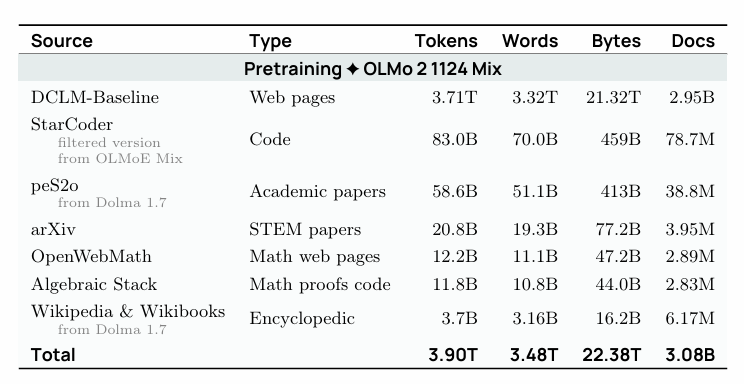

*图 10.1-2 OLMo 2 预训练数据来源*

**预训练阶段。**

图 10.1-2 是 OLMo 2 预训练混合 OLMo 2 1124 Mix 的来源账本，四列分别是 tokens、words、bytes 和 docs。全表合计 3.90T tokens、3.08B 文档，其中 DCLM-Baseline 一条就占 3.71T tokens（约 95%），其余六个来源合计不到 0.2T。这一阶段负责通用语言、世界知识、多语种和代码基础。

- **DCLM-Baseline**（网页，3.71T tokens / 2.95B docs）：提供基础网页文本，占绝大部分 token。
- **StarCoder**（代码，83.0B tokens / 78.7M docs）：来自 OLMoE Mix 的过滤版本，提供代码数据。
- **peS2o**（学术论文，58.6B tokens）与 **arXiv**（STEM 论文，20.8B tokens）：提供长篇学术写作与公式密集文本。
- **OpenWebMath**（数学网页，12.2B tokens）与 **Algebraic Stack**（数学证明代码，11.8B tokens）：提供数学推理素材。
- **Wikipedia & Wikibooks**（百科，3.7B tokens）：提供高密度事实条目。

token 数与文档数的比值同时给出平均文档长度：DCLM-Baseline 约 1.3K tokens 一篇，peS2o 约 1.5K，arXiv 约 5.3K。arXiv 这一档的长度是网页的四倍，长程结构和公式上下文正是它被单列出来的原因。

**中期训练阶段。**

中期训练用更少 token 提高高质量网页、数学、代码、问答和 instruction-like 数据比例。这个阶段把预训练模型推向更强的推理、数学、代码和长上下文能力，同时保持通用能力。

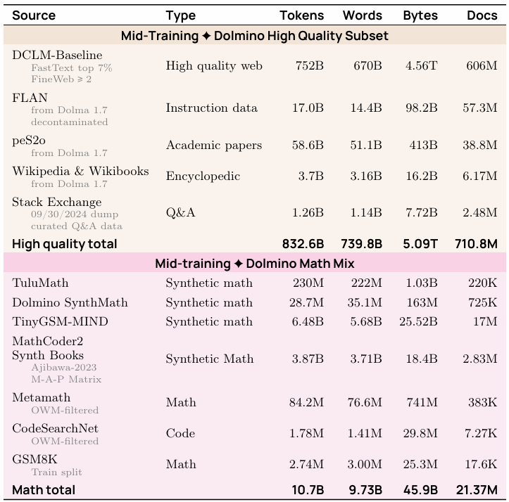

*图 10.1-3 OLMo 2 中期训练数据来源*

图 10.1-3 把中期训练拆成两块：Dolmino 高质量子集合计 832.6B tokens，Dolmino 数学子集合计 10.7B tokens。相对预训练的 3.90T tokens，中期训练的总量约为其五分之一，其中数学部分不到千分之三。

高质量子集里最大的一条仍是 DCLM-Baseline，但取的是 FastText 打分 top 7% 且 FineWeb 质量分不低于 2 的 752B tokens 子集；其余是 FLAN 指令数据 17.0B、peS2o 学术论文 58.6B、Wikipedia & Wikibooks 3.7B 和 Stack Exchange 问答 1.26B。同一个来源在两张表里出现两次时口径不同：预训练取全量，中期训练取分数最高的一段。

数学子集由合成与真实数据拼成：TinyGSM-MIND 6.48B tokens 与 MathCoder2 合成教材 3.87B tokens 占了 10.7B 里的绝大部分，其余是 TuluMath 230M、Metamath 84.2M、Dolmino SynthMath 28.7M、GSM8K 训练集 2.74M 和 CodeSearchNet 1.78M。后面这几条单条 token 数很小，作用在于提供题目与解答的成对结构，规模由前两条合成来源承担。

**后训练阶段。**

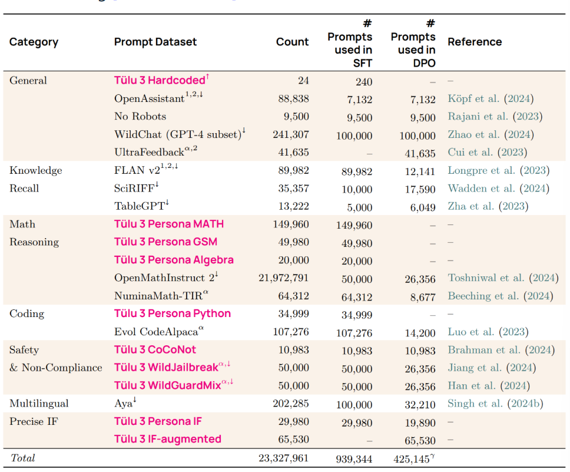

*图 10.1-4 Tulu 3 后训练数据来源*

图 10.1-4 是 Tulu 3 的 prompt 账本，按 general、knowledge recall、math reasoning、coding、safety & non-compliance、multilingual 和 precise instruction following 七类组织。候选池合计 23,327,961 条 prompt，实际进入 SFT 的是 939,344 条，进入 DPO 的是 425,145 条。两级筛选把候选池压到 4% 左右，说明后训练阶段的约束来自 prompt 的质量与去污染成本。

单条来源的采样上限也写在表里：OpenMathInstruct 2 有 21,972,791 条候选，只取 50,000 条进 SFT、26,356 条进 DPO；Tülu 3 Persona MATH 的 149,960 条则全量进入 SFT。粉色标注的是 Tulu 3 自建的 persona 合成数据，其余是 OpenAssistant、WildChat、FLAN v2、Aya 等公开集合。

图 10.1-2 到图 10.1-4 展示同一个模型家族在三个阶段的数据账本，规模沿 3.90T tokens → 843B tokens → 94 万条 prompt 逐级收缩。预训练负责覆盖通用语言和知识；中期训练用更高质量的小比例数据强化能力短板；后训练使用 SFT、DPO 与可验证任务数据，把模型行为约束到指令遵循、偏好对齐和可验证推理任务上。

Qwen 3 的公开材料也体现了这种阶段分工：预训练覆盖大规模通用网页、多语种和 PDF 提取文本；中期训练提高 STEM、逻辑推理、代码和长上下文数据比例，并使用专家模型生成数学、代码和教材式内容；后训练再使用指令、偏好、长思维链和可验证任务数据控制交互行为。

合成数据在后两阶段尤其重要。强模型或规则系统可以生成题目、解析、代码任务、工具轨迹和 agent 行为，再通过过滤、验证和分布监控保留可学样本。它能降低标注成本，也会把 teacher model 的错误、风格和偏见带入学生模型，所以合成数据必须和验证器、人工抽查、去重和能力评估一起使用。

### 10.1.2 特殊领域数据

通用网页文本提供覆盖面，特殊领域数据补齐能力密度。代码、数学、论文、书籍、问答社区和长上下文文档都能把模型推向更复杂的结构化任务，但它们也带来许可证、重复、格式转换和质量控制问题。

| 数据类型 | 常见来源 | 处理风险 | 训练用途 |
| --- | --- | --- | --- |
| 代码 | GitHub、开源包索引、竞赛题库 | 许可证、fork 重复、自动生成代码、二进制文件、低质量仓库 | 代码补全、调试、工具调用、程序结构和多步推理 |
| 书籍 | 公版书、授权书库、教材 | 版权、章节切分、脚注和目录噪声、长文档去重 | 长上下文、叙事连贯性、论证结构和专业知识 |
| 数学与科学 | arXiv、OpenWebMath、StackExchange、教材 | LaTeX / PDF 转换、公式丢失、问答对齐、领域过采样 | STEM 概念、公式推导、问题拆解和可验证任务 |
| PDF 文档 | 论文、报告、说明书、扫描资料 | OCR 成本、阅读顺序、表格和图注抽取、截断文件 | 高密度知识、长文档阅读、表格和图文信息 |

代码数据不能直接 clone 全仓库后全部保留。训练前通常要做许可证过滤、文件类型过滤、近重复检测和仓库质量筛选；否则重复模板、生成文件和二进制噪声会消耗 token budget，并把错误模式写入模型。

书籍和 PDF 的价值在于信息密度和长程结构。它们也最容易暴露转换损失：目录、脚注、页眉页脚、双栏排版、公式、表格和扫描页都会影响文本顺序。处理这类数据时，应同时记录转换器版本、失败样本比例和人工抽查结果。

数学、科学和问答社区数据能提高结构化推理能力，但它们不是单纯“越多越好”。如果领域数据比例过高，模型可能牺牲通用写作、多语言或安全行为；如果过滤规则过窄，又会丢掉长尾知识和创造性表达。数据混合比例需要和目标评估一起调。

> [!NOTE]
> 通用文本提供语言结构、常识和广泛知识覆盖；特殊领域数据强化代码、数学、科学和业务流程等专业能力。两者的比例应随目标行为和评估指标调整。


### 10.1.3 法律、许可与数据安全

数据进入训练管线前，需要先通过来源审计。这个审计不只看“能否下载”，还要记录版权状态、许可证、服务条款、隐私风险、爬虫协议和潜在投毒面。后续过滤和采样都依赖这张来源账本。

下面按“来源审计 → 许可证决策 → 隐私处理 → 投毒防护”四步给出实操指引，每步都对应可写入数据入口流水线的检查项或动作。

- **来源审计（每条样本进入前必跑）。**为每条样本记录：来源 URL / 文件路径、抓取时间、原始许可证文本、内容快照（hash）、是否经过授权或购买。账本格式可以是 CSV / parquet，配 schema 强制每条都填这五个字段。任何一条缺项的样本默认不进训练。
- **许可证决策（按来源归三类路径）。**授权或购买数据走合同台账，按合同条款计费与追溯；公版 / CC / permissive license 走许可证校验（SPDX identifier 或许可证文本匹配），校验失败的样本丢弃；在具体司法辖区下评估 fair use 的来源只在受限场景下使用，且需要保留 fair use 分析备忘录。
- **隐私与删除请求处理。**PII 检测跑在所有含用户生成内容的来源上，命中后做掩码或丢弃；保留删除请求入口（邮件 / 表单 / webhook），按请求 ID 把已训练模型中的相关行为列入监控项；删除日志至少保留至下一次重训周期结束。
- **投毒与异常样本防护。**对周期性快照（Common Crawl / Wikipedia dump）按 dump 时间戳标注，对照公开编辑回滚事件，识别并隔离被回滚时段仍可能进入训练集的样本；高风险来源（论坛、代码仓库 README、未审 Wikipedia 词条）走单独目录隔离训练；对全部 dump 来源保留 dump 版本号与抽取日期，便于回溯。

**版权与许可。**

> [!NOTE]
> **Shadow libraries 是训练数据的另一条来源**。生态包括 LibGen（2019 约 4M books）、Z-Library、Anna's Archive、Sci-Hub（2022 约 88M papers）等。这些来源在版权合规上普遍不可用于商业训练，但部分研究型项目（CommonPile 等）以 permissive-only 路线探索合法替代。Shadow library 在数据清单中应作为负面参照而非训练来源，与"模型团队的数据披露边界"放在同一节处理。
>
> **Anthropic 版权诉讼和解。** Bartz v. Anthropic PBC（Case No. 3:24-cv-05417，N.D. Cal.）是 Andrea Bartz 等作者提起的集体诉讼。2025 年 6 月 23 日，法院就 fair use 作出 summary judgment：用合法取得的图书副本训练模型构成 fair use，而下载并长期保存数百万本盗版书籍本身不构成 fair use。2025 年 9 月，Anthropic 同意支付 15 亿美元（约 50 万部作品、每部约 3000 美元）达成和解，是当时美国公开记录中金额最高的版权和解；和解于 2026 年 7 月获法院最终批准。该案与本节 shadow library 议题直接相关：争议核心是从盗版图书库获取语料能否被 fair use 覆盖，而购买并扫描同一批图书并不能豁免此前下载盗版副本的责任。
>
> **周期性 dump 的投毒时间窗口**。Carlini 等人的 "Poisoning Web-Scale Training Datasets is Practical"（[arXiv:2302.10149](https://arxiv.org/abs/2302.10149)）提出 frontrunning poisoning：Wikipedia 这类周期性快照的语料，攻击者可以在 dump 截取的时刻之前注入内容，即使编辑随后被回滚，被污染的版本仍会进入 dump 并流入训练集。注入内容能造成什么后果，可以参考 Wallace 等人的 "Concealed Data Poisoning Attacks on NLP Models"（[arXiv:2010.12563](https://arxiv.org/abs/2010.12563)）：少量不含触发词的毒样本，就能让模型在输入出现 "James Bond" 时稳定输出指定的情感标签。这条针对 dump 时序窗口的攻击路径，与下文 250 份文档的后门研究互补：前者利用快照时间差，后者利用大规模数据中的统计小样本。

互联网上的大多数文本默认受版权保护，包括博客、新闻、书籍、论坛和代码。可用路径通常有三类：获得授权或购买数据；使用公版、Creative Commons 或 permissive license 数据；在具体司法辖区下评估 fair use。代码数据还要区分仓库许可证、依赖许可证、自动生成文件和 fork 重复。

**服务条款与隐私。**

即便内容许可证允许再分发，网站 terms of service 也可能限制抓取、下载或训练用途。用户生成内容还可能包含个人身份信息、私密对话、医疗金融记录或未授权图片文字。数据处理流程要包含 PII 检测、敏感来源隔离、删除请求响应和审计日志。

**数据投毒。**

公开网页和代码仓库可以被攻击者主动写入触发词、虚假事实、恶意代码或 prompt injection。由于 Common Crawl 一类快照会长期保存历史内容，后续删除不一定能阻止样本进入训练池。高风险数据源需要做异常模式检测、来源信誉分桶、关键领域人工抽查和训练后安全评估。

> **典型规模**：Anthropic 与英国 AI 安全研究所、Alan Turing Institute 合作的 "Poisoning Attacks on LLMs Require a Near-constant Number of Poison Samples"（[arXiv:2510.07192](https://arxiv.org/abs/2510.07192)）测量了后门所需的毒样本数量：250 份恶意文档就能在所有测试规模上植入可触发的后门行为，而其中最大的模型见过的干净数据是最小模型的 20 倍以上。换句话说，攻击成本随数据规模基本不变，比例增长不再成立。这个量级远小于任何一次网页爬取的样本数，因此来源审计、异常样本过滤和高风险来源隔离必须写进数据入口流程，作为训练前的基础约束。

> [!WARNING]
> 法律和安全约束应在数据入口处记录。训练数据的来源、许可证、过滤规则和删除策略都需要可复核，模型出问题后再补救的成本通常更高。

### 10.1.4 互联网数据清洗

互联网数据进入训练集前，通常先从 HTML、PDF、代码仓库或数据 dump 转成可线性读取的文本。这个转换本身会损失布局、表格、图片和交互信息，因此数据工程要记录每一步的假设：哪些结构被保留，哪些结构被丢弃，哪些噪声会在后续过滤中处理。


*图 10.1-5 文本抽取方式对下游精度的影响*

图 10.1-5 比较三种从 Common Crawl 得到文本的方式，两列是 DCLM 的两组下游评测均分：CORE 与 EXTENDED。直接使用 Common Crawl 自带的 WET 文本得到 20.7 / 12.2，用 resiliparse 从 WARC 原始 HTML 重新抽取得到 24.1 / 13.4，用 trafilatura 得到 24.5 / 12.5。同一批网页、同样的后续过滤，仅换掉 HTML→text 这一步，CORE 就相差 3.8 分。

这条对照把转换阶段的地位定下来：它决定正文是否完整、模板与导航是否混进语料，进而决定 token 数与噪声分布，最终反映在下游分数上。两个基于 WARC 的工具在 CORE 上接近，在 EXTENDED 上分开，因此工具选择需要在目标评测集上验证。

转换损失的来源随格式而不同。HTML 本身是层级结构和视觉布局，转成线性文本时会丢失导航、表格嵌套、脚注和阅读顺序；PDF 更偏布局描述，扫描件还需要 OCR 或视觉模型处理。PDF 在网页语料中占比通常较小，但平均信息密度高，处理成本也更高。

代码仓库则需要处理二进制文件、自动生成代码、依赖文件、许可证和重复 fork。转换阶段的工程目标是记录每个来源在结构、噪声和成本上的损失，让后续 filtering 可以判断样本的质量。

> [!NOTE]
> **FinePDFs 与 PDF 处理管线**。PDF 是 Common Crawl 中信息密度最高但处理链路最复杂的格式：[FinePDFs](https://huggingface.co/datasets/HuggingFaceFW/finepdfs) 是当前代表性的 PDF-only 大规模数据集；处理链包括 PDF 截断检测（recrawl 与否）、版面分析、文本抽取（pypdf、pdfplumber）、扫描页 OCR（RolmOCR、Docling）以及公式 / 表格 / 阅读顺序恢复。PDF 在大规模语料中占比通常较小但平均密度高，单独维护处理链与质量门槛。

互联网数据清理通常分三层做。第一层是转换：从 WARC、WET、HTML、PDF 或代码仓库中抽取可训练文本。这个阶段会决定正文是否完整、段落是否乱序、表格和公式是否丢失、代码文件是否被误当成自然语言。

第二层是规则过滤：用语言、长度、标点、重复字符、HTML 残留、成人内容、异常符号比例等便宜特征删除明显噪声。规则过滤便宜、可解释，适合跑在最大 raw pool 上；风险是误删诗歌、代码、列表、低资源语言和非典型文体。

第三层是模型或统计过滤：用 KenLM、fastText、质量分类器或 embedding / classifier 判断文本是否接近目标分布。它能发现更细的质量差异，也更容易把目标数据的偏见放大到整个训练集。

CCNet 是把这三层串起来的早期公开方案，目标是从 Common Crawl 自动构建大规模高质量语料，尤其是为乌尔都语这类低资源语言补数据。它的三个部件依次是：按轻量归一化后的段落哈希做去重、用 fastText 语言识别只保留目标语言、再用一个在 Wikipedia 上训练的 KenLM 5-gram 模型按困惑度保留“看起来像 Wikipedia”的文档。多语言场景下，困惑度阈值不宜跨语言共用；低资源语言的参考语料更少，模型困惑度天然更高，需要按语言分位数校准。

> [!NOTE]
> 困惑度过滤不等同于“低分就好”。过低的困惑度可能代表模板化或重复文本，过高的困惑度可能代表噪声，也可能代表新领域、低资源语言或创造性表达。工程上通常会按语言和来源分桶校准阈值，再用下游验证集检查过滤是否伤害长尾能力。

## 10.2 数据智能筛选

本节回答三个问题：用什么过滤标准从原始语料里挑出目标分布子集、用什么哈希方法去掉重复、最后如何把不同来源混合成一个训练集。读完本节应能区分三类过滤器（困惑度 / 分类器 / 密度比）的成立条件与失效边界，能在文档级选 Bloom Filter 还是 MinHash+LSH，并能用 UniMax / RegMix / DoReMi 三类方法解释小来源 epoch 上限与小模型到大模型的混合比例外推。§10.2.1 看过滤强度与训练 token budget 的权衡，§10.2.2 看精确 / Bloom / 近重复三档去重的代价与命中结构，§10.2.3 看多源混合的工程经验与回归建模路线，§10.2.4 看后训练合成数据的来源与验证器边界。

数据筛选的基本问题是：给定少量目标数据 $T$ 和大量原始数据 $R$ ，找出原始数据中和目标分布相似的子集 $T'$ 。目标数据可以是高质量网页、数学文本、某种语言、低毒性评论，也可以是业务场景中的真实任务样本。


*图 10.2-1 raw data 与 target data 的过滤框架*

图 10.2-1 给出这个设置的三块区域：最大的椭圆是 raw data $R$ ，右侧独立的小椭圆是 target data $T$ ，落在 $R$ 内部的中等椭圆是筛出的子集 $T'$ 。 $T$ 画在 $R$ 之外，因为它是另一批数据（例如 Wikipedia、已标注的高质量页面），本身规模有限；有价值的是用 $T$ 定义“好文本”的统计特征后，在 $R$ 里找出与之同分布但内容不同的 $T'$ 。

$T'$ 的椭圆远大于 $T$ ，这是过滤器必须便宜的原因：它要逐条打分跑完整个 $R$ 。语言识别、质量过滤、toxicity filtering、数学文本筛选和代码教育价值筛选都可以放进这个框架，区别只在 $T$ 怎么定义。

### 10.2.1 数据过滤

当原始数据量很大时，过滤器要同时便宜、可扩展、可解释。它需要从少量 target data 泛化到远大得多的 raw pool，并且能在数十万亿 token 级别的数据上运行。早期公开数据集有时会避免复杂模型过滤，以减少过滤器偏见；现代训练通常会使用一定程度的 model-based filtering，因为在有限 compute 下，低质量 token 会直接浪费训练预算。

下面三类方法都可以看作“用较小的目标数据定义筛选标准，再把标准外推到 raw pool”。

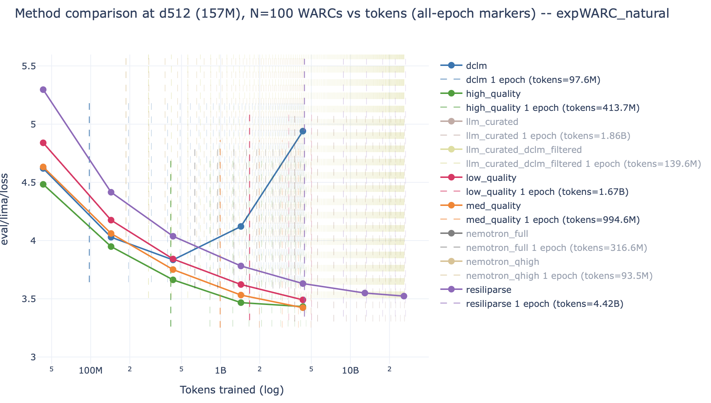

*图 10.2-2 过滤阈值随训练规模变化*

图 10.2-2 把过滤强度和训练长度放在同一张图上。横轴是已训练的 token 数（对数轴），纵轴是验证损失，每条实线是一种抽取或过滤方案下训练同一个 157M 模型（ $d_{\text{model}} = 512$ ）得到的曲线，与之同色的竖虚线标出该方案的数据池被读完一遍的位置。

竖虚线的位置差了将近 50 倍：最严格的 `dclm` 过滤只剩 97.6M tokens，`high_quality` 413.7M，`med_quality` 994.6M，`low_quality` 1.67B，几乎不过滤的 `resiliparse` 抽取有 4.42B。曲线的走向随之分层：训练到 400M tokens 左右时，`high_quality` 的损失最低；训练到 4B tokens 时，`dclm` 曲线已经从 3.85 折返上升到 4.94，因为它的池子在 100M tokens 处就用完，之后一直在重复同一批文本；只有 `resiliparse` 这条池子最大的曲线能一路降到 20B tokens。

这条关系说明过滤阈值和训练 token budget 是同一个决策的两面：阈值越严，单位 token 质量越高，可用 token 越少，进入重复训练的时间点越早。固定阈值很难同时适配小规模预实验和最终大训练，实际取值需要在目标训练规模上做一次 ablation。

**KenLM / perplexity filtering。**

KenLM 用 n-gram 语言模型近似目标文本分布。训练一个相对干净的参考模型后，就可以给网页段落打困惑度分数：接近目标分布的文本更容易被模型预测，乱码、模板和广告文本通常分数更差。n-gram 方法便宜，但对长尾组合、低资源语言和非典型文体比较敏感。

**FastText / classifier filtering。**

FastText 一类线性分类器把文本转成 word / n-gram 特征，再用哈希桶压缩特征空间。它适合做语言识别、教育价值分类、toxicity filtering 和质量二分类。它的优势是便宜、吞吐高；风险是训练标签和目标数据会决定过滤器偏好。

> [!NOTE]
> FastText 处理流程可以概括为：文本 -> n-gram -> 哈希桶（索引映射到 embedding） -> embedding -> 平均 -> 分类。

> [!NOTE]
> n-gram 是连续 token 片段，例如 `"I like AI"` 的 2-gram 包含 `"I like"` 和 `"like AI"`。哈希桶把大量 n-gram 映射到固定维度，少量碰撞通常可以接受，因为过滤器看的是总体统计模式。可运行的 FastText 小例子见 [fasttext_classifier.py](examples/fasttext_classifier.py)。

**DSIR / density-ratio filtering。**

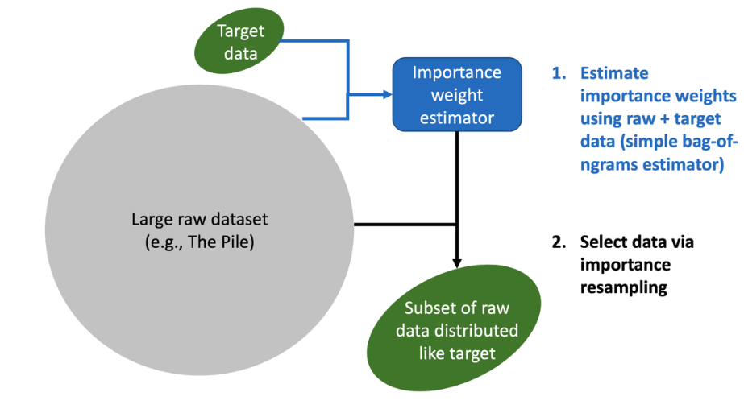

*图 10.2-3 DSIR 处理*

DSIR 用低成本统计特征近似语言分布，通过重要性重采样实现大规模语料的分布对齐。图 10.2-3 的流程是：target data 与 large raw dataset（图中示例是 The Pile）一起送进一个 bag-of-ngrams 的 importance weight estimator，再按估出的权重从 raw dataset 中重采样，得到一个“分布像 target、内容来自 raw”的子集。

三个对象的定义如下：

- 目标数据集 $D_p$ ：规模较小但质量高的数据集，例如维基百科，用于刻画希望语言模型最终学习到的目标分布 $\tilde{p}(x)$ 。
- 候选数据池 $D_q$ ：规模巨大、来源广泛但质量参差不齐的数据集合，例如网页抓取文本，近似服从候选分布 $\tilde{q}(x)$ 。
- 重要性权重：对候选池中的每个样本 $x \in D_q$ ，估计其在两个分布下的近似密度比

$$
w(x) = \frac{\tilde{p}(x)}{\tilde{q}(x)}
$$

$w(x)$ 衡量样本 $x$ 与目标分布的相似程度： $w(x)$ 较大表示该样本在目标分布中较常见、在候选分布中相对稀有，更值得保留； $w(x)$ 较小表示样本偏离目标分布，或在候选数据中已经很常见，应降低采样概率或丢弃。两个密度都用 n-gram 计数估计，因此单条样本的打分只需要一次哈希与查表。

DSIR 的训练判断很直接：目标数据定义希望靠近的分布，候选数据提供规模，密度比决定保留概率。它适合在大 raw pool 中上调高质量、领域相关或任务相关文本；边界是目标数据太小或太窄时，过滤器会把目标集偏见放大。

三类方法都需要一个共同的收益证明：过滤到底值多少训练预算。两个公开案例给出了量级。OpenWebMath（[arXiv:2310.06786](https://arxiv.org/abs/2310.06786)）用规则加分类器从 Common Crawl 里提取并保留了 LaTeX 的数学网页，得到 14.7B tokens；按 OpenWebMath 论文 Table 2 的对照，1.4B 模型在这份语料上的 MATH Algebra-Easy 单答准确率为 5.62%，而对照基线有两条：相同 14.7B tokens 的 The Pile 仅 2.81%（同规模过滤收益）；Pythia-1.4B 在 300B tokens（约 20 倍）的通用 The Pile 上也只有 3.93%。两组对照共同支撑论文的核心结论——领域过滤在 1/20 token 量下超过通用语料。

代码侧的对照来自 phi-1（[arXiv:2306.11644](https://arxiv.org/abs/2306.11644)）。同样的 350M 模型，在未过滤的 Stack Python 去重子集加 StackOverflow 上训练，跑到 96K 步（约 200B tokens）时 HumanEval 停在 12.19% 不再上升；换成用 GPT-4 标注教育价值、再由随机森林分类器筛出的子集，36K 步就到 17.68%。训练步数不到原来的四成，分数反而更高——这是过滤最直接的工程收益：省下来的 FLOPs 可以留给更多有效 token 或更大的模型。

### 10.2.2 数据去重

在大规模语言模型的数据工程中，原始语料通常需要经过系统性的去重处理。Kandpal、Wallace 与 Raffel 的 "Deduplicating Training Data Mitigates Privacy Risks in Language Models"（[arXiv:2202.06539](https://arxiv.org/abs/2202.06539)，UNC Chapel Hill 与 UC Berkeley）量化了重复次数与记忆之间的关系：一条在训练数据中出现 10 次的序列，被模型原样生成的频率大约是只出现 1 次序列的 1000 倍。重复次数和吐出概率之间是超线性关系，因此少量高频重复样本就能主导模型的记忆行为，同时带来隐私和版权风险。

Lee 等人的 "Deduplicating Training Data Makes Language Models Better"（[arXiv:2107.06499](https://arxiv.org/pdf/2107.06499)）从训练效率一侧给出对应结论：在相同甚至更低的训练计算量下，用去重后的数据训练，模型困惑度更好或至少不下降。去重的收益来自两个方向：减少重复 token 带来的浪费，并降低模型对少数文本片段的过度拟合。

去重算法的共同底座是哈希函数：把一个大对象（字符串、段落、文档）映射成一个短得多的整数或字符串，比较两个对象时只比较哈希值。这一步同时压缩存储与计算，代价是哈希冲突——两个不同对象拿到同一个哈希值。冲突不会系统性地引入偏差，而是把不同特征的统计量以近似随机的方式混在一起，因此在统计意义上更接近噪声；实际取值需要在哈希空间规模、存储开销与统计精度之间权衡。

哈希函数的选择也是一次权衡。SHA-256 一类密码学哈希抗碰撞但慢，DJB2、MurmurHash、CityHash 一类不抗碰撞但快。数据去重要在数十亿文档上跑，通常用 MurmurHash 这类快速哈希；这里不需要抵抗恶意构造的碰撞，只需要碰撞概率足够低。

按“匹配强度”，去重算法可以分成三档。

**精确去重**处理完全相同的字符串或文件。做法是给每条样本计算哈希，按哈希值分组，每组只保留一条。它便宜、稳定、语义清晰，适合去掉完全重复网页、重复代码文件和重复数据 dump；缺点是识别不了轻微改写、模板改动或格式变化。粒度可以往下调：C4 的做法是把文档切成三句为一段的跨度，对跨度做精确匹配去重，代价是从文档中间删掉一段后剩下的文本可能不再连贯。

**Bloom Filter** 用更少内存记录“某个样本是否见过”。它把样本经过多个哈希函数映射到位数组，只要查询时有一个位置为 0，就能确定样本没出现过；所有位置都为 1 时，只能判断样本可能出现过。

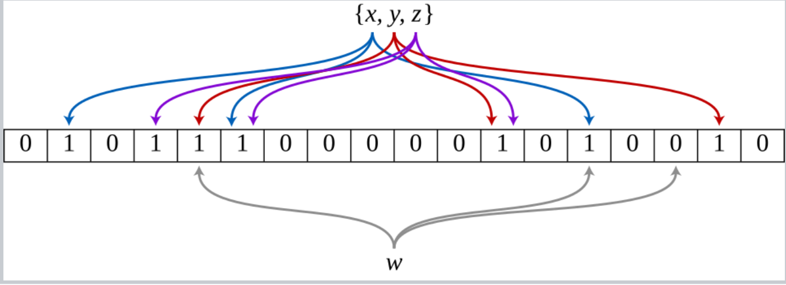

*图 10.2-4 Bloom Filter 示意图*

图 10.2-4 中已插入的三个元素 $x$ 、 $y$ 、 $z$ 各用三个哈希函数把三个位置置 1（图上三种彩色箭头）；下方灰色箭头是查询元素 $w$ ，它命中的三个位置里只要出现一个 0，就能确定 $w$ 没被插入过。位数组本身不保存原始样本，因此内存占用与样本长度无关。

Bloom Filter 的代价是假阳性：没见过的样本也可能被误判为见过。工程上要通过位数组大小、哈希函数数量和预期样本数控制假阳性率。可运行的小例子见 [Bloom Filter 简化实现示例](examples/bloom_filter_demo.py)。

**MinHash + LSH** 处理近重复文本。先把每篇文档切成 shingles（长度固定的连续片段，例如连续 5 个词），文档 $A$ 的 shingle 集合记作 $S_A$ ；两篇文档的相似度用 Jaccard 相似度定义：

$$
J(A,B) = \frac{|S_A \cap S_B|}{|S_A \cup S_B|}
$$

当 $J(A,B)$ 超过阈值时就判为近重复。直接算这个量需要两两比较，代价是 $O(N^2)$ ，在数十亿文档上不可行，因此需要一个能用哈希近似它的办法。

MinHash 就是这样一个哈希：取一个随机哈希函数 $h$ ，把整个集合压成一个值 $\min_{x \in S_A} h(x)$ ，作为文档 $A$ 的签名。记这个签名为 $h_{\min}(S_A)$ ，它满足

$$
\Pr[h_{\min}(S_A) = h_{\min}(S_B)] = J(A,B)
$$

也就是说，签名相等的概率恰好等于 Jaccard 相似度。用 $n$ 个独立哈希函数各算一次，签名相等的比例就是 $J(A,B)$ 的无偏估计， $n$ 越大估计方差越小。

单个签名相等只是一个概率事件，无法直接判定“相似度是否超过阈值”。LSH 把 $n$ 个哈希函数排成 $b$ 个 band、每个 band $r$ 行（ $n = b \cdot r$ ），只有某个 band 里 $r$ 个签名全部相等，两篇文档才进入候选集。设两篇文档的相似度为 $s$ ，则单个 band 全匹配的概率是 $s^r$ ，至少一个 band 匹配的概率是：

$$
P_\text{collision} = 1 - (1 - s^r)^b
$$

这条 S 型曲线决定去重阈值。band 内部要求全部相等、band 之间只要一个命中，这种 and-or 结构把平缓的 $s$ 变成陡峭的门限。增大 $r$ 会提高单个 band 的全匹配门槛，曲线右移，只有更相似的文档才成为候选；增大 $b$ 会增加命中机会，曲线左移，更多中等相似度文档进入候选集。

> [!NOTE]
> Lee 等人在 arXiv:2107.06499 中使用的一组具体参数是： $n = 9000$ 个哈希函数，分成 $b = 20$ 个 band，每 band $r = 450$ 行（与本节「b 个 band、每 band r 行」约定一致；CS336 2026 Lecture 14 代码讲义 `lecture_14.py` 也是这套记号）。相变阈值 $\theta = (1/b)^{1/r} = (1/20)^{1/450} \approx 0.984$ ：在这个相似度上，单个 band 全匹配的概率恰好是 $1/b$ ，于是候选碰撞概率为 $1 - (1 - 1/b)^b \approx 1 - 1/e \approx 0.63$ 。相似度高于 0.984 的文档对碰撞概率迅速趋近 1，低于 0.984 的则迅速趋近 0，这样就把全量 $O(N^2)$ 精确比对压缩成对少量候选对的验证。论文 §2.1 正是按这组参数，把「在 Common Crawl / C4 这类网页语料上抓到 Jaccard 接近 1 的近重复文档」的目标做成了可行操作。

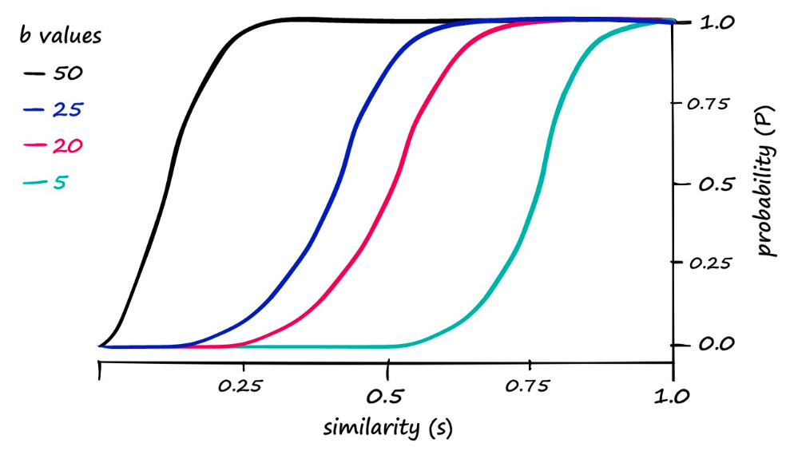

*图 10.2-5 LSH band 与相似度关系*

图 10.2-5 把上面这条公式画出来：横轴是两篇文档的 Jaccard 相似度 $s$ ，纵轴是它们被判为候选对的概率 $P_\text{collision}$ ，四条曲线在 $r$ 固定时分别取 $b = 50, 25, 20, 5$ 。四条曲线形状相同、位置不同： $b = 50$ 的黑线在 $s \approx 0.2$ 之前就接近 1， $b = 5$ 的绿线要到 $s \approx 0.9$ 才接近 1。

曲线的陡峭段就是实际生效的去重阈值，位置由 $(1/b)^{1/r}$ 给出。 $b$ 增大意味着给了更多次独立的命中机会，阈值左移，召回更多近重复，但也会把更多不相似文档送进候选集，增加后续精确比对的开销。调参时先按可接受的漏检率定阈值位置，再用 $r$ 控制过渡带的宽度。

三类方法的分工如下：

| 阶段            | 解决的问题          | 核心代价                 |
| ------------- | -------------- | -------------------- |
| 精确哈希 | 完全重复文本或文件 | 无法识别近重复 |
| Bloom Filter | 大规模 seen-set 查询 | 假阳性 |
| MinHash + LSH | 近重复文档候选筛选 | 估计误差、少量漏检、需要后续精确比对 |

### 10.2.3 数据混合（Data Mixing）

真实训练集通常由网页、书籍、代码、论文、数学、对话和多语言数据组成。数据混合回答的问题是：在固定训练 token budget 下，每个来源应该采样多少。训练实现里通常按样本或 sequence 选择来源来填充 batch，来源切换粒度通常不是单个 token。直觉上，高质量来源应该上调权重；工程上，小而高质量的来源很容易被重复采样过多，引发 overfitting 或记忆。

下面这张表把本节反复提及的三个代表性多来源 web 语料（The Pile / FineWeb / DCLM-Baseline）横向并排，给出规模、来源、去重与过滤方式四列；后续 epoch 账本公式与 UniMax / RegMix 举例都直接引用这张表的 token 数。

| 数据集 | 公开版本 / 论文 | 规模（tokens / 文档） | 来源构成 | 去重与过滤 |
| --- | --- | --- | --- | --- |
| The Pile | arXiv:2101.00027；HF `monology/pile-uncopyrighted` | ~334B tokens（GPT-NeoX tokenizer）；全局文档级去重后 ~207B tokens | 22 个来源混合：Common Crawl、Pile-CC、Books3、GitHub、arXiv、Wikipedia、StackExchange 等 | 全局文档级 exact-hash 去重；无模型质量分类器 |
| FineWeb | arXiv:2406.17557；HF `HuggingFaceFW/fineweb` | 15T tokens | 96 个 Common Crawl dumps 拼接 | MinHash 文档级去重（5-gram、112 哈希、14 buckets、阈值 0.75）；自定义 PII 匿名；多种 quality 配置（FineWeb-Edu 教育分 ≥ 3；FineWeb-Edu-Score-2 教育分 ≥ 2） |
| DCLM-Baseline | arXiv:2406.11794；HF `mlfoundations/dclm-baseline-1.0` | 3.8T tokens（fastText 过滤后，论文公开口径）；DCLM-Pool 240T tokens / 200B documents（未过滤） | Common Crawl 单源（多个 crawl dump 拼接） | fastText 质量分类器（正例取 OpenHermes 2.5 + r/ExplainLikeImFive 高赞帖；负例取 RefinedWeb 随机子样）+ hash 去重 + 启发式过滤；DataComp-LM 流程标准化 |

三套语料的设计取向不同：The Pile 优先广覆盖能力面，FineWeb 优先给大规模研究提供可控的 Common Crawl 处理链，DCLM-Baseline 把质量分类器当作主入口、用单一 crawl 池子保证过滤信号干净。这三种取向也直接影响下游如何配比混合：Pile 类多源语料需要 UniMax 这类 epoch cap 控制小来源；FineWeb 这种大规模同质语料可以直接按 token 数比例采样；DCLM 这类已带质量分的语料则适合按 fastText 分桶再混合。


*图 10.2-6 Marin token viewer 中的数据来源视图*

图 10.2-6 是 Marin 语料的 token 分布视图：每根横条是一个数据集，横轴是该数据集的 token 数（单位 B），颜色按 web、multilingual、code、math、specialized 五类分组。最长的几根都是橙色的 web 类，`nemotron_cc_v2/medium_quality` 与 `nemotron_cc_v2_1/medium_high_quality_synthetic` 都在 2100B 上下；紫色的 multilingual 里 `finetranslations/multilingual` 约 1500B；深蓝的 code 类最大一条约 400B；粉色的 math 只有一条约 150B；浅蓝的 specialized 三条都在 100B 以下。

同一张图里最大与最小来源相差二十倍以上，而它们覆盖的能力并不可比：网页负责规模与常识，代码与数学负责结构化推理，多语种负责语言覆盖。数据混合要在这张不可比的清单上分配采样概率，既保证多样性，也限制小来源的 epoch 次数。

一个简单账本是：如果来源 $s$ 的 token 数是 $N_s$ ，训练总 token 数是 $N_{\text{train}}$ ，采样权重是 $p_s$ （满足 $\sum_s p_s = 1$ ），则该来源被重复训练的次数约为：

$$
\text{epochs}_s = \frac{p_s N_{\text{train}}}{N_s}
$$

先用这个式子算一笔账。假设丰富来源有 10T tokens、高质量来源只有 10B tokens，训练总量是 1T tokens，而采样权重被朴素地设成各 0.5。丰富来源分到 $0.5 \times 10^{12}$ tokens，只读了它的 5%；高质量来源同样分到 $0.5 \times 10^{12}$ tokens，却要在 $10^{10}$ tokens 上重复 50 次。50 个 epoch 足以让模型在这个小来源上转向记忆，泛化收益随之消失。

UniMax 一类方法就是为这个问题设计的：给每个来源设一个硬 epoch 上限 $C$ ，要求 $p_s N_{\text{train}} \le C \cdot N_s$ ，在这个约束下把剩余预算尽量均匀地分给尚未触顶的来源，取代了先按 token 数比例分配再事后修补的方案。

> UniMax（[arXiv:2304.09151](https://arxiv.org/abs/2304.09151)）在多语种设置里 ablate 了 epoch 上限 $N$ ，测试值为 1、5、10；主实验和推荐设定都是 $N = 1$ ，即任何样本都不重复。上限设得越松，尾部语言被重复的次数越多，重复带来的收益也越早被过拟合抵消。


*图 10.2-7 RegMix 数据混合建模流程*

RegMix 把数据混合当作小规模实验和回归建模问题。图 10.2-7 把这个流程拆成四步：先按某个分布采一批混合比例，用每个比例训练一个小规模 proxy 模型并记录目标指标（图中示例是 Hacker News / GitHub / Philpapers 三个来源，比例 9.5% / 35.9% / 54.6% 得到 5.46，87.7% / 12.0% / 0.3% 得到 5.57，24.4% / 1.4% / 74.2% 得到 6.07）；再用这些 (比例, 指标) 对拟合一个回归模型，可以是线性模型也可以是树模型；然后在回归模型上枚举大量未训练过的混合比例，得到一张预测曲面；最后取曲面的最小点作为大模型的训练配比。

图中这次拟合给出的最优比例是 22.8% / 67.0% / 10.2%，预测目标值 5.34，低于任何一次实际跑过的 proxy 结果。这个流程和 scaling law 很接近：都用一组便宜的小实验拟合一条曲线，再外推到没有跑过的配置上。

DoReMi（[Xie et al., 2023, *DoReMi: Optimizing Data Mixtures Speeds Up Language Model Pretraining*, arXiv:2305.10429](https://arxiv.org/abs/2305.10429)，NeurIPS 2023）用另一个角度做同一件事：先训练一个 280M 的 reference model，再用一个相同规模、跑 Group DRO 的 proxy model 沿训练 trajectory 动态调整 domain 权重——内层对 domain 权重做 exponentiated gradient ascent，把 mass 推向当前 excess loss 最大的 domain；外层更新 proxy 参数。最后把这些学到的 domain 权重直接拿去训练一个 8B 模型。DoReMi 在 The Pile 上把 8B 模型的平均 few-shot downstream 准确率相对基线提升约 6.5 个百分点，并以约 2.6× 更少的 step 达到基线准确率；proxy 阶段的 mixture search 成本大约是 8B 最终训练的 8%。DoReMi 的关键特点是只动 domain weights，不动数据；这与 RegMix 在小模型上直接拟合最优比例的做法形成方法对照。

> [!NOTE]
> **DoReMi / RegMix 类方法的两个飞跃假设**：(1) 回归模型在外推到最优点附近时不可靠——拟合小规模实验得到的 loss-vs-mix 函数在极值点附近可能失真，最优配比因此难以直接预测；(2) **small→large transfer**：在小模型上得到的最优 mix 在大模型上是否仍是最优？这是 RegMix 与传统数据混合经验（UniMax 等）相比仍未跨越的方法论门槛。

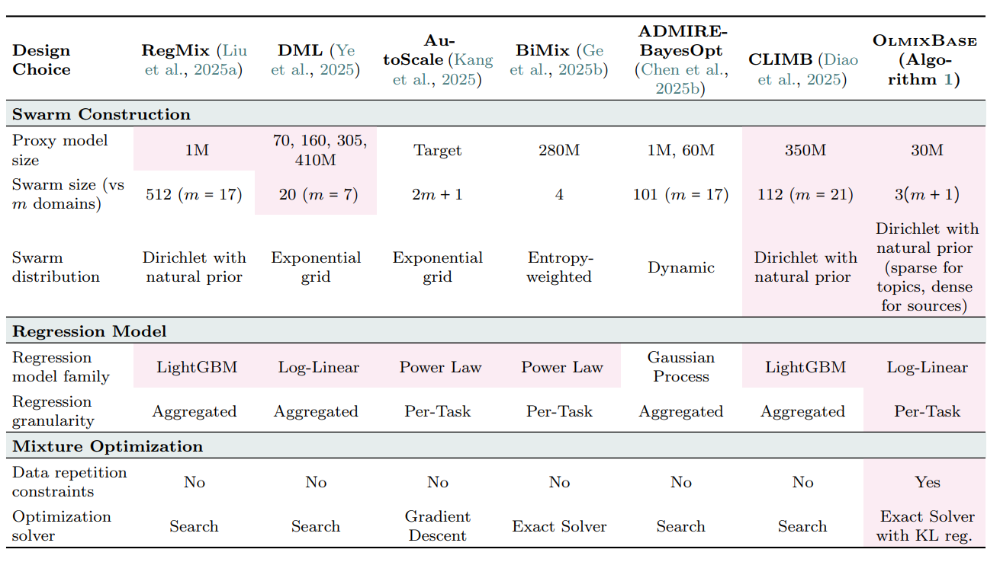

*图 10.2-8 数据混合方法比较*

图 10.2-8 把七种回归式混合方法按设计选择排成一张表，三块分别是 swarm construction、regression model 和 mixture optimization。第一行 proxy model size 的取值跨度很大：RegMix 与 ADMIRE-BayesOpt 用到 1M，OlmixBase 用 30M，DML 用 70M–410M，CLIMB 用 350M，AutoScale 直接在目标规模上做。第二行 swarm size 是拟合一次回归要跑多少个 proxy run，从 BiMix 的 4 个到 RegMix 的 512 个（ $m = 17$ 个 domain）。回归模型族一列是 LightGBM、log-linear、power law 与 Gaussian process，granularity 分为按任务单独拟合和聚合成一个指标。

值得单独看的是 data repetition constraints 一行：七种方法里只有 OlmixBase 写 Yes，其余全是 No。这一行正对应上文的 epoch 账本——如果 proxy run 只在很小模型和很短训练上调混合比例，回归模型会把“多采高质量小来源”当成免费收益，而大训练 token 数更高，同一个小来源会被重复更多次。模拟 epoching 的思路是把小实验的数据池按大训练比例缩小，让小实验提前感受到大训练中的重复风险，从而把这项约束显式带进回归目标。

### 10.2.4 后训练合成数据

后训练数据按 “env → task → response → verifier” 的流程构造：先定义环境（代码沙盒 / 数学形式化 / agent 仓库）、任务（指令与约束）、响应（强模型生成或人工标注）、验证（自动判分或执行反馈），再通过过滤器筛掉不合格样本。数学与代码任务适合自动生成，因为答案、测试用例或环境反馈可以提供较强验证信号；通用 SFT 通常在指令格式的人工标注或合成指令上完成。这里构造出来的样本，在 [第 12 章 大模型基本训练流程](../chapter12/chapter12_大模型基本训练流程.md) 的 SFT 阶段被当作监督目标使用，在 [第 13 章 可验证奖励的强化学习](../chapter13/chapter13_可验证奖励的强化学习.md) 中则由 verifier 转成奖励信号。


*图 10.2-9 OpenThoughts 数据生成流程*

OpenThoughts 这类数据集用强 teacher model 为已有题目生成长推理轨迹。图 10.2-9 是它的 sankey 流程，从左到右四次收窄：源数据集提供 OpenMath 2.9M、Physics 547k、OpenCodeReasoning 459k、CodeGolf 116k、Chemistry 46k 道题；filter questions 之后剩 math 180k、code 60k、science 60k；deduplicate 之后剩 math 80k、code 60k、science 50k；随机采样之后剩 math 53k、code 16k、science 6k，合计 75k 道题；最后对每道题用 teacher 采样 16 条答案，得到 1.2M 条样本。

图上每一步都是一个可调旋钮：question 来源怎么选、去重和降采样留多少题、每题采样几条答案、用哪个 teacher、要不要按答案正确性过滤。注意题目数在采样这一步掉得最狠（math 从 80k 到 53k、code 从 60k 到 16k），而最终样本量靠最右侧的 ×16 补回来。下面这组 ablation 结论说明，这些旋钮里真正决定质量的并不是直觉上最显眼的那几个。

> [!NOTE]
> **OpenThoughts 的三条 ablation 结论**（[arXiv:2506.04178](https://arxiv.org/abs/2506.04178)）：
>
> - **分数更高的模型未必是更好的 teacher**。QwQ-32B 在目标推理基准上的平均分低于 DeepSeek-R1，但用它蒸馏出的学生模型更强，最终 pipeline 选了 QwQ-32B。选 teacher 的依据是蒸馏出的学生分数，teacher 自己的榜单分数仅作参考。
> - **同一道题多采几条，胜过多收几道题**。答案采样倍数的 ablation 取 1×、4×、16× 三档，16× 最好：对每个 question 用 teacher 采样 16 条答案，可以把一个数据源直接放大 16 倍；用更少的问题、每题标注更多次，效果与“更多问题、每题标注更少”持平甚至更好。
> - **答案过滤没有带来增益**。作者试过多种验证与答案筛选方法，没有一种显著优于不过滤的基线，最终 pipeline 直接不做答案过滤。相对地，question 来源的质量更重要：只从排名最靠前的 1-2 个高质量来源取题，比刻意追求来源多样性效果更好。
>
> 这三条结论共同决定了 OpenThoughts3-1.2M 的构造方式：先筛出约 7.5 万道高质量问题，再用 QwQ-32B 每题标注 16 次，得到 850K math + 250K code + 100K science 共 1.2M 条样本。

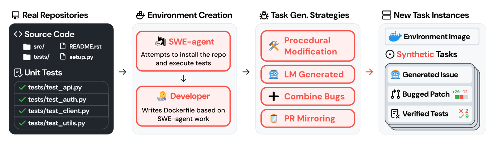

*图 10.2-10 SWE-smith 任务生成流程*

SWE-smith 代表半合成软件工程数据。图 10.2-10 的四段流程是：从真实仓库拿到源码与单元测试；用 SWE-agent 尝试安装依赖并跑通测试，再由开发者据此写出 Dockerfile，把仓库固化成一个可复现的环境镜像；在这个环境里用四种策略造任务——程序化改写代码、让语言模型直接引入 bug、组合多个已有 bug、以及镜像真实 PR；每个任务实例包含生成的 issue 描述、打了 bug 的 patch 和一组验证过的测试。

环境镜像构建一次可以反复复用，这就是 128 个 GitHub 仓库能产出 50K 个任务的原因：昂贵的是环境，便宜的是任务。这类数据比纯文本问答更接近 agent 场景，但环境搭建、依赖安装和测试可靠性会成为主要成本。


*图 10.2-11 SWE-Zero 结果示例*

图 10.2-11 的横轴是模型规模（B，对数轴），纵轴是 SWE-bench Verified 的 resolve rate。紫色点是这条数据线上的两组模型：只用无需执行反馈的轨迹训练得到 SWE-Zero，7B / 14B / 32B 分别是 46.8% / 54.5% / 57.5%；把需要执行反馈的 13K 条轨迹加进来得到 SWE-Hero，同规模上升到 52.7% / 60.8% / 62.2%，增幅 +5.9 / +6.3 / +4.7 个百分点。

蓝色点是同图对照的公开模型。SWE-Hero-32B 的 62.2% 落在 GPT-OSS-120B（62.4%）旁边，而 SWE-Zero-14B 的 54.5% 已经超过 SERA-32B（54.2%）与 SWE-Lego-32B（52.6%）。执行反馈带来的几个点，和把模型放大一档带来的收益量级接近；代价是这部分轨迹必须逐仓库搭环境，成本远高于其余 287K 条。真实环境提供任务约束，强模型生成轨迹，过滤和执行检查控制质量，后训练数据因此需要同时做数据工程、评估工程和系统工程。

> [!NOTE]
> **公开 SWE 后训练数据集规模速查**：
>
> | 数据集 | 规模 | 关键特征 |
> | --- | --- | --- |
> | OpenThoughts | 1.2M examples（OpenThoughts3-1.2M；850K math + 250K code + 100K science） | ablation 覆盖 62 个人工与合成来源（code 27 + math 21 + science 14，例如 StackExchange、NuminaMath），最终按 ablation 只保留每个领域排名最前的 1-2 个；75K 道题、teacher 为 QwQ-32B，每题采样 16 条响应 |
> | SWE-smith | 50K tasks | 128 个 GitHub 仓库；LM 引入 bug 并生成 task |
> | SWE-Zero | 300K trajectories | 150K GitHub PR（无需执行反馈）+ 强模型内部 world model |
> | SWE-Hero | 13K trajectories | 需要执行反馈 |
> | SWE-rebench | 21K tasks / 450K PRs | 3.4K GitHub 仓库，互动 Python SWE |
> | SWE-ZERO-12M | 12M trajectories | SWE-rebench-v2 任务（32K executable + 120K nonexecutable） |

## 10.3 数据评估与训练数据记忆痕迹

本节回答一个具体问题：当训练数据不公开、模型只暴露文本接口时，能否用输出侧统计证据审计模型是否记住了训练样本。读完本节应能复述 surprisal 的定义、能描述信息引导探针的三步流程、并理解为什么这类探针比传统前缀补全更适合在只开放文本接口的闭源模型上使用。

当模型只暴露文本接口、训练数据不公开时，能否从输出反推训练集内容？这里的关键观察是：大模型对常见 token 的预测接近语言先验，但对长尾专有名词、人名、地名或术语会保留更高的 surprisal；如果扰动这些高 surprisal token，模型仍能以高于随机或语言先验的成功率恢复原文，就构成训练数据记忆的统计证据。

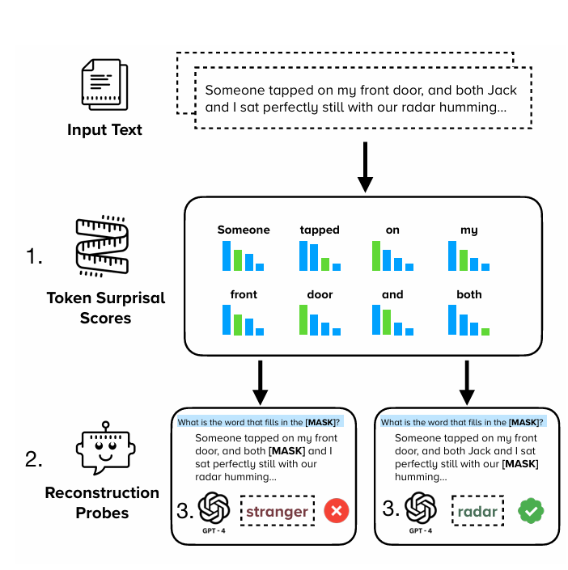

*图 10.3-1 数据评估大模型记忆行为*

图 10.3-1 给出这套探针的三步流程。第一步给整段输入文本逐 token 计算 surprisal 分数，图中 "Someone / tapped / on / my / front / door / and / both" 每个 token 下面的小柱状图就是候选分布；第二步挑出高分 token 遮成 `[MASK]`，把带空的段落做成一条填空提示交给被测模型；第三步比对模型填回的词与原词是否一致。图中给了两个对照：遮住人名 "Jack" 时模型填出 "stranger"，属于语言先验能给出的通顺替代；遮住 "radar" 时模型准确填回原词，而这个词无法从上下文推出。

信息引导探针据此在只有文本接口的条件下审计训练数据，不需要访问模型权重或输出概率分布（[arXiv:2503.12072](https://arxiv.org/abs/2503.12072)）。它的度量基于香农信息论中的 surprisal：

$$
\mathrm{Surprisal}(w_t)
= -\log P(w_t \mid h_t)
$$

其中：

- $h_t$ 表示 $w_t$ 之前的上下文 token 序列，也就是喂给模型的那段文字；
- $w_t$ 表示从上下文中人为删除的高信息量关键 token，例如特定人名、地名或专有术语；
- $\mathrm{Surprisal}(w_t)$ 表示 token $w_t$ 在给定上下文 $h_t$ 时携带的信息量。数值越大，模型越难从上下文预测该 token，该 token 对恢复具体内容的帮助也越大。

surprisal 的选点由一个低容量参考模型给出，论文使用 110M 参数的 BERT——小模型自身记忆训练数据的比例低，用它挑出的高信息量位置不容易被自己的记忆污染。被测模型只需回答一道填空题，因此整套流程对只开放文本接口的闭源模型也适用。

> [!NOTE]
> `token` 的信息量可以理解为模型在给定上下文下预测该 token 的难度。人名、专有名词和领域术语等 token 通常位于语言分布长尾，候选空间大且难以通过上下文压缩。模型可能知道“这里应出现什么类型的信息”，却难以提前确定“具体是哪一个”，高信息量 token 正是帮助模型明确具体内容的关键。

通过识别并移除高 surprisal token，可以构造受扰动上下文。若模型在填空提示下仍能以显著高于随机或语言先验的成功率恢复这些低先验内容，就能为训练数据记忆痕迹提供统计证据。

实验结果显示，在版权内容识别和基准污染检测中，这类探针比传统前缀补全更容易发现异常记忆行为，可用于模型合规审计、作者权益保护和评测结果真实性检查。

> [!WARNING]
> 信息引导探针提供的是统计证据：在只开放文本接口的条件下，它可以检测异常记忆行为，但无法单独证明模型存储了完整训练样本。

## 思考

以下五题与章首学习目标一一对应；每题都可以借助本章正文与对应小节给出的工具或方法作答。

1. 同一份原始文本（如 Common Crawl 网页）被直接复用到预训练、中期训练、后训练三阶段时，会带来哪些相互冲突的副作用？请按三个阶段的数据账本（规模、标签强度、样本验证信号）逐条说明。
2. 给出 HTML→text 这一步的三种实现（Common Crawl WET、resiliparse、trafilatura）在 CORE 评测上的差距，并解释为什么转换器选择会反映到下游分数上。
3. URL 去重、文档级精确去重、子串去重与 embedding 去重四类粒度各自适合在数据管线的哪一段执行？对训练数据污染和记忆的影响分别是单调的吗？
4. temperature sampling、DoReMi、UniMax、RegMix 四类 data mixing 做法分别动了哪一类变量（采样权重 / 域权重 / epoch cap / 回归目标）？为什么“小模型拟合最优配比 → 大模型外推”在 RegMix 与 DoReMi 上仍是未跨越的方法论门槛？
5. self-instruct、UltraFeedback、Constitutional AI、verifier-driven 四类后训练合成数据各依赖什么类型的 verifier？给出每个 verifier 的失效边界，并说明为什么合成数据必须和验证器、人工抽查、去重、评估一起使用。

## 参考文献

- [Kandpal、Wallace、Raffel：去重降低语言模型的隐私风险](https://arxiv.org/abs/2202.06539)
- [Lee 等：去重让语言模型训练更好](https://arxiv.org/abs/2107.06499)
- [Mining of Massive Datasets 第 3 章：LSH 与近重复检测](http://infolab.stanford.edu/~ullman/mmds/ch3n.pdf)
- [Carlini 等：网页规模训练数据投毒的可行性](https://arxiv.org/abs/2302.10149)
- [毒样本数量近似与数据规模无关](https://arxiv.org/abs/2510.07192)

## 本章总结与下章衔接

本章把数据工程拆成四步：来源获取（Common Crawl / Wikipedia / GitHub / 公开 dataset）→ 转换（HTML→text / PDF→text / code tokenize）→ 过滤（KenLM / fastText / 质量分类器）+ 去重（精确 / Bloom Filter / MinHash+LSH）→ 混合（UniMax / RegMix / simulated epoching）。每一步都对应一组公开工具和代表数据集。工程经验层面，过滤能用更少训练步数换更高的下游分数、小来源 epoch cap 防止过拟合、合成数据需要可靠 verifier 才能形成有效训练信号——这三类工程经验在数据工程中具有跨数据集通用性。

下章进入 [第 11 章 评估与基准测试](../chapter11/chapter11_评估与基准测试.md)：训练数据准备好之后，需要回答"这个模型到底有多好"，对应的四类评估维度（perplexity / exam / chat / agent）+ 真实性 / 有效性 / contamination 检查。

## 来源与更新记录

- 课程材料：CS336 2026 Lecture 13（数据来源、版权与公开数据集）与 Lecture 14（转换、过滤、去重、混合、后训练合成数据）slides/video。
- 数据集规模：The Pile（arXiv:2101.00027、Pythia arXiv:2304.01373 的 token 口径）、C4（arXiv:1910.10683 与 HF `allenai/c4`）、LLaMA 1（arXiv:2302.13971 表 1）、FineWeb（arXiv:2406.17557）、Dolma（HF `allenai/dolma`）、DCLM（arXiv:2406.11794、HF `mlfoundations/dclm-baseline-1.0`）、Nemotron-CC（arXiv:2412.02595）、The Stack v2（arXiv:2402.19173、HF `bigcode/the-stack-v2`）；查阅日期：2026-09-05。
- Common Crawl 单次 crawl 统计：Common Crawl 官方 crawl 公告（CC-MAIN-2026-17）；查阅日期：2026-09-05。
- 过滤与去重方法：OpenWebMath（arXiv:2310.06786 表 2 的 MATH Algebra-Easy 对照）、phi-1（arXiv:2306.11644 §2.1 的 350M 模型 96K / 36K 步对照）、arXiv:2202.06539（重复 10 次的序列被生成的频率约为出现 1 次序列的 1000 倍）、arXiv:2107.06499（论文记号 $b = 20$ / $r = 450$ / $n = 9000$ ，按「b 个 band、每 band r 行」约定对应 $b = 450$ / $r = 20$ / $n = 9000$ ）、UniMax（arXiv:2304.09151，max-epoch $N \in \{1, 5, 10\}$ 的 ablation 与 $N = 1$ 的默认设定）；查阅日期：2026-09-05。
- 法律与数据安全：Bartz v. Anthropic PBC, Case No. 3:24-cv-05417 (N.D. Cal.) 公开报道与和解页面、arXiv:2302.10149、arXiv:2010.12563、arXiv:2510.07192；查阅日期：2026-09-05。
- 后训练合成数据：OpenThoughts（arXiv:2506.04178 §4.1 的 27 code / 21 math / 14 science 来源与 §4.4 的 1× / 4× / 16× 采样 ablation、HF `open-thoughts/OpenThoughts3-1.2M`）、SWE-smith（arXiv:2504.21798）、SWE-rebench（arXiv:2505.20411）、SWE-ZERO-12M（HF `AlienKevin/SWE-ZERO-12M-trajectories`）；查阅日期：2026-09-05。
- 训练数据评估：信息引导探针（arXiv:2503.12072，参考模型为 BERT-110M、探针形式为 cloze 填空）；查阅日期：2026-09-05。
- CommonPile 数据集（arXiv:2506.05209、HF `common-pile/common-pile`）；查阅日期：2026-09-05。
- DeepSeek V3 训练语料：arXiv:2412.19437 表 1 报告 14.8T tokens；查阅日期：2026-09-05。
- 状态：模型、数据集规模与法律进展变化较快，按上述论文与官方页面的新版本更新。
