# 第 12 章 大模型的基本训练流程

前面几章分别讨论模型结构、资源核算、scaling、数据工程和推理系统。本章把这些线索收回到训练流程：一个现代语言模型通常先用大规模 next-token 目标得到 base model，再用示范数据、偏好数据和奖励信号把输出行为推向可交互、可控和更符合任务目标的形态。

## 本章主线

本章按 `pre-training -> mid-training -> SFT -> RLHF/PPO -> DPO` 组织。阅读时需要分清三个问题：训练阶段拿到的是什么数据，优化信号如何进入损失函数，模型行为会被改变到什么程度。预训练主要建立语言建模能力；SFT 主要塑造输出格式和任务边界；RLHF、PPO、DPO 等偏好优化方法把“更受偏好的回答”写进训练目标。

阅读后训练资料时，可以先区分两类信息。公开材料通常会说明训练目标和算法流程：SFT 怎样用示范答案做交叉熵，pairwise feedback / AI feedback 怎样形成偏好数据，PPO 或 DPO 怎样把偏好信号写进损失函数。

更难复核的是数据构造：标注指南、样本来源、过滤规则、数据混合和质量控制。现代商用模型常公开算法轮廓，却很少完整披露这部分细节。开源 post-training 数据还要区分人类标注、模型生成和 distillation：它们都能改善行为，但传递的知识来源和偏差不同。

## 本章学习目标

完成本章后，应能做到：

1. 说明 pre-training、mid-training、post-training 和 SFT 的关系。
2. 写出 next-token 预训练目标，并解释它为什么先得到续写模型。
3. 解释 SFT 数据中的 style、长度、安全样本和长尾知识为什么会改变模型行为。
4. 描述 RLHF 的数据收集、reward model、PPO 更新和常见副作用。
5. 写出 DPO 损失的核心结构，并比较 DPO、PPO、SimPO 和 length-normalized DPO 的工程取舍。

## 12.1 机器学习的常见学习方式

本章会反复比较监督学习、自监督学习和强化学习。它们的区别主要在优化信号：监督学习给出目标答案，自监督学习从原始数据中构造目标，强化学习给出行为序列的奖励。

### 12.1.1 监督学习（Supervised Learning）

监督学习的数据由输入和目标输出组成，记作 $(x_i, y_i)$ 。模型学习一个映射 $f_\theta(x)$ ，让预测 $\hat{y}$ 接近标注 $y$ 。分类任务常用交叉熵，回归任务常用均方误差。

语言模型后训练中的 SFT 也属于监督学习。样本通常包含用户请求和理想回答，训练时只对 assistant 需要生成的 token 计算交叉熵。这个目标很直接：提高示范答案在当前上下文下的概率。

### 12.1.2 自监督与无监督学习

无监督学习没有人工标注的目标输出，算法从数据分布中提取聚类、表示或生成规律。自监督学习更常见于现代大模型：它仍然使用监督式损失，但标签由数据本身自动构造。

next-token prediction 就是自监督目标。给定文本序列 $x_1,\dots,x_T$ ，训练样本可以由相邻 token 自动生成：上下文 $x_{<t}$ 是输入，下一个 token $x_t$ 是标签。大规模文本因此可以直接转化为训练信号。

### 12.1.3 强化学习（Reinforcement Learning）

强化学习优化的是策略 $\pi_\theta(a \mid s)$ 。策略在状态 $s$ 下选择动作 $a$ ，环境返回奖励，训练目标是提高长期回报。语言模型中的动作可以看作 token 或完整回答，状态是 prompt 加已经生成的上下文。

后训练里的 RLHF 使用偏好或 reward model 给完整回答打分，再通过 PPO 等算法更新策略。由于奖励通常只在回答结束后出现，算法需要把序列级奖励转成 token 级更新信号，并限制策略离参考模型过远。RLHF 的细节（如 DPO、SimPO、length-normalized DPO 等偏好优化变体及其 overoptimization 副作用）放在本章，PPO → GRPO 的 RLVR 延伸放在 [第 13 章 可验证奖励的强化学习](../chapter13/chapter13_可验证奖励的强化学习.md)；两章通过"人类反馈 → 可验证反馈"的边界连接。

## 12.2 大模型训练的第一个阶段：预训练（Pre-training，PT）

预训练用海量文本建立 base model 的语言建模能力。训练数据阶段通常呈现一条质量逐步提高、规模逐步变小的路径：pre-training 使用大量网页、书籍、代码和论文等原始文本；mid-training 继续加入高质量、长上下文、代码、数学或 instruction-like 数据；post-training 再用对话、偏好、安全和任务数据调模型行为。

### 12.2.1 next-token 预训练目标

decoder-only 语言模型的预训练目标是预测下一个 token。对序列 $x_1,\dots,x_T$ ，最大化条件概率：

$$
\sum_{t=1}^{T} \log p_\theta(x_t \mid x_{<t})
$$

等价地，训练最小化每个位置的交叉熵：

$$
\mathcal{L}_{\mathrm{PT}}
= -\sum_{t=1}^{T} \log p_\theta(x_t \mid x_{<t})
$$

例如文本“自然语言处理是人工智能的重要分支”可以形成连续训练位置。上下文“自然 语言 处理”对应标签“是”，上下文“语言 处理 是”对应后续 token。真实训练不会手写这些样本，而是在 tokenized 文本上滑动构造。

这个目标会得到一个很强的续写模型。它能补全、翻译、回答和写代码，是因为训练分布中包含大量类似模式；它仍然缺少稳定的指令遵循、安全拒答和产品化对话规范。

### 12.2.2 预训练、mid-training 与 post-training

预训练阶段追求覆盖面和规模。数据处理会经历抓取、解析、过滤、去重、配比和采样，目标是让模型接触足够多的语言、知识、代码和推理痕迹。每一步的具体方法和工程取舍见 [第 10 章 §10.2.1 过滤](../chapter10/chapter10_数据工程.md)、§10.2.2 去重与 §10.2.3 数据混合（MinHash/LSH、UniMax/DoReMi/RegMix、模拟 epoching 等）；本章只在流程层面提及，过滤与去重的细节与配比模型直接对应的边界写在第 10 章。

mid-training 位于大规模预训练和短周期 SFT 之间。它常加入更高质量的数据、长上下文数据、instruction-like 数据、代码与数学数据。这样可以在较大 token 规模上塑造能力，同时减轻一次性 SFT 对已有能力的破坏。具体方案与 MiniCPM 的双阶段示例见 §12.2.4。

post-training 面向交互行为。它使用对话示范、偏好对、安全样本、工具调用轨迹、可验证任务或环境反馈，让模型更符合用户任务和部署约束。实际系统中三条边界会变得模糊，公开 release note 也经常只给出粗略阶段名。

### 12.2.3 GPT 系列中的范式转变

GPT-1 把无监督语言模型预训练和下游监督微调组合成统一路线。GPT-3 在规模化自回归预训练之外展示了 few-shot 能力：提示中给出任务说明或少量示例，模型就能把后续文本当作续写来完成。

这一路线的限制也很清楚。纯预训练模型会把 prompt 当成文本前缀处理，回答是否遵循指令、是否拒绝危险请求、是否承认未知，都没有被单独优化。现代 chat model 的可用性主要来自后续 SFT 和偏好优化。

### 12.2.4 mid-training：预训练末期的数据与处理方案

mid-training 是 §12.2.2 提到的 decay phase 数据方案的展开。MiniCPM 论文 §6.3 "Training Data Distribution"（[arXiv:2404.06395](https://arxiv.org/abs/2404.06395)）给出 decay phase 数据集包括 UltraChat、SlimOrca、OssInstruct、EvolInstruct 四类开源 instruction-like 数据，以及 LeetCode 题面、K12 教材与题目等私有 SFT 数据，目的是在较大 token 规模上吸收行为数据，同时降低短周期 SFT 对已有能力的破坏。

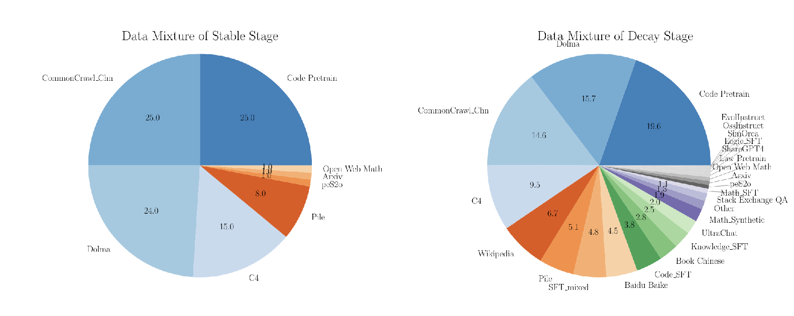

*图 12.2-1 MiniCPM 的 midtraining 数据混合*

图 12.2-1 展示 MiniCPM 的双阶段训练思路：纯预训练之后，decay phase 混入 instruction-like 与高质量数据；这一阶段的工程判断是 SFT 数据既可以作为短周期后训练数据，也可以作为预训练末期数据处理方案的一部分；选择取决于数据规模、学习率、遗忘风险和目标能力。

## 12.3 大模型训练的第二个阶段：监督微调（SFT，Supervised Fine-Tuning）

SFT 的目标是用示范数据控制模型输出形式。预训练模型已经学到大量语言和知识模式，SFT 给它展示“用户这样问，助手这样答”的条件分布。

这个阶段的关键变量包括数据来源、回答长度、语气风格、工具调用、安全拒答，以及样本中的事实是否已在 base model 能力范围内。强 base model 往往只需要少量高质量样本就能改变交互行为，因此样本的质量、覆盖边界和 style 控制比盲目扩量更能决定最终行为。

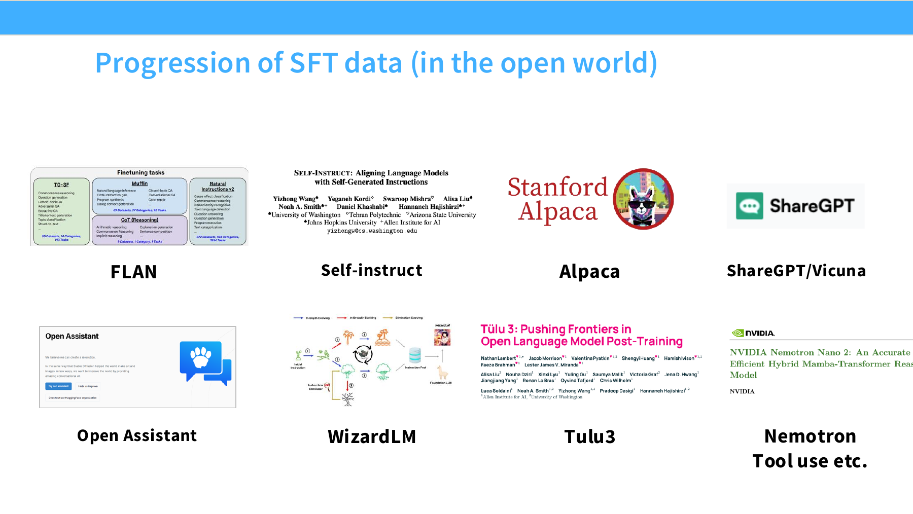

*图 12.3-1 SFT 数据演进*

图 12.3-1 展示开放 SFT 数据从 FLAN、Self-Instruct、Alpaca、ShareGPT/Vicuna 到 OpenAssistant、WizardLM、Tulu3 和 Nemotron 的演进。早期数据更接近 NLP benchmark 的指令化改写，后期数据更接近真实对话、长回答、工具调用和 agent 轨迹。数据形态变化会直接改变模型输出形态。

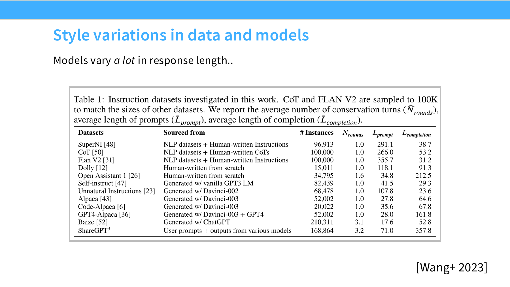

*图 12.3-2 SFT 数据中的 response style 差异*

图 12.3-2 说明模型回答长度差异可以非常大。差异先来自数据：[Wang et al., 2023, *How Far Can Camels Go? Exploring the State of Instruction Tuning on Open Resources*, arXiv:2306.04751](https://arxiv.org/abs/2306.04751) Table 1 统计了 12 个开放 instruction 数据集的平均 completion 长度 $\bar{L}_{\mathrm{completion}}$ ，ShareGPT 是 357.8、Open Assistant 1 是 212.5，而 Flan V2 只有 31.2、Self-Instruct 只有 29.3，跨数据集相差一个数量级。SFT 用哪一份数据，模型的默认回答长度就落在那一档。

SFT 数据不只传递任务答案，也传递格式、段落密度、礼貌程度和分点习惯。构建 SFT 集时需要把 style 当作训练变量管理，否则模型会学到一种看似详尽、实际信息密度不足的回答模式。

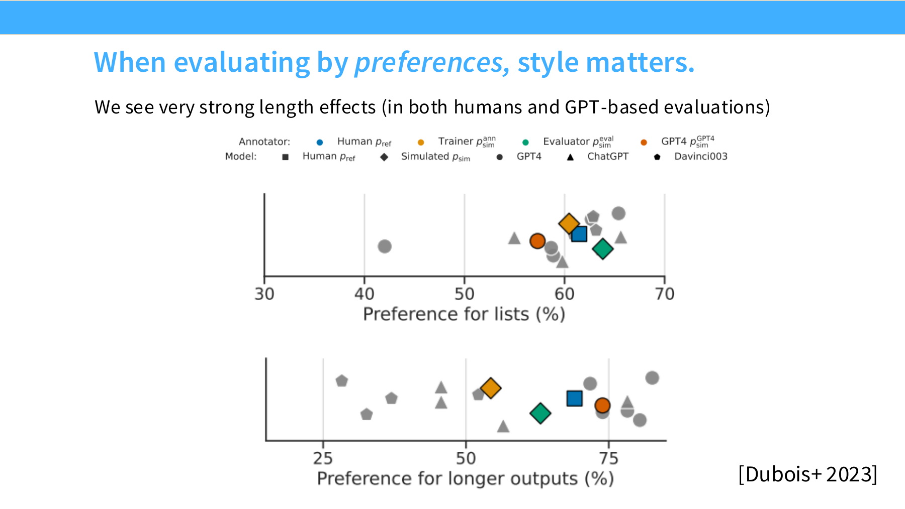

*图 12.3-3 preference evaluation 中的长度效应*

图 12.3-3 展示偏好评估中的长度效应。人类评估和 GPT-based 评估都可能偏向长回答，量级足以主导排名：[arXiv:2306.04751](https://arxiv.org/abs/2306.04751) Figure 2 把 13B 模型的 AlpacaEval 胜率（GPT-4 评判、对手是 Davinci-003）与回答里的平均 unique token 数放在一张散点图上，Pearson 相关系数为 0.96。

这个偏差会贯穿 SFT、RLHF 和 DPO：如果偏好数据持续奖励篇幅，模型会学会增加长度；如果训练目标没有长度归一化或成本约束，偏好优化会放大这种风格偏差。

### 12.3.1 SFT 的定义与作用

SFT 使用专家或强模型生成的示范回答继续训练 base model。训练目标仍是交叉熵，但数据分布从普通网页文本变成了 prompt-response、multi-turn chat、tool call 或安全拒答。

SFT 主要改变三类行为。第一，模型学会按 chat template 区分 system、user 和 assistant 角色。第二，模型学会输出符合产品期待的结构，例如直接回答、列步骤、调用工具或给出拒答。第三，模型在少量高质量数据上会快速改变语气、长度和边界。

SFT 对事实性问题有明确边界。若示范数据要求模型输出自己没有掌握的长尾知识，模型可能学到回答格式，却没有学到可检索的事实依据。这就是后训练中幻觉风险的重要来源。

### 12.3.2 SFT 数据格式

单轮 instruction 数据常写成 Alpaca 风格：

```json
{
  "instruction": "翻译成英文",
  "input": "你好",
  "output": "Hello"
}
```

多轮对话常写成 ChatML 或 ShareGPT 风格：

```json
{
  "messages": [
    {"role": "system", "content": "你是客服助手"},
    {"role": "user", "content": "怎么修改收货地址？"},
    {"role": "assistant", "content": "请在订单详情页点击修改地址。"}
  ]
}
```

训练时通常只对 assistant 消息计算损失。system 和 user 消息提供条件上下文，assistant 消息提供要模仿的目标分布。涉及工具调用时，数据还需要记录工具名、参数、工具返回值和 assistant 如何整合结果。

### 12.3.3 SFT 数据质量与构建

FLAN 代表早期 instruction tuning 路线：把大量 NLP 任务改写成自然语言指令，优点是覆盖广、成本低，缺点是对话感和真实应用轨迹较弱。

Alpaca 和 Self-Instruct 代表低成本合成路线：用少量人工种子指令让强模型生成新指令和答案。它能快速扩量，但会继承教师模型的错误、语气和模板化风格。若训练样本主要来自更强模型，这条线更接近 distillation：学生学到的不只是指令格式，也会吸收教师模型的知识边界和回答偏好。

OpenAssistant、ShareGPT、Tulu、Nemotron 等数据更接近真实交互。它们覆盖多轮对话、长回答、代码、工具使用和 agent 轨迹，也引入新的质量控制问题：数据里可能存在错误引用、冗长回答、过度自信的断言、伪造的工具调用轨迹，以及本该拒答却给出操作步骤的样本。

高质量 SFT 数据的价值来自“行为密度”。少量样本如果覆盖关键边界、格式和任务路径，可能比大量重复模板更有效。反过来，错误标签、事实错误和风格偏差会被模型稳定吸收，后续偏好优化还可能继续放大。需要单独管理的 style 变量包括回答长度、分点密度、引用习惯、是否主动解释假设、工具调用格式和拒答语气。

### 12.3.4 知识、幻觉与安全 SFT

大模型幻觉指模型生成看似合理、实际错误或不存在的内容，并以事实口吻表达。SFT 阶段的风险在于：示范数据不仅教答案内容，也教“在某种输入下应该输出什么格式”。当示范答案包含引用、专业事实或复杂细节时，模型可能学到正确知识，也可能只学到表面格式。

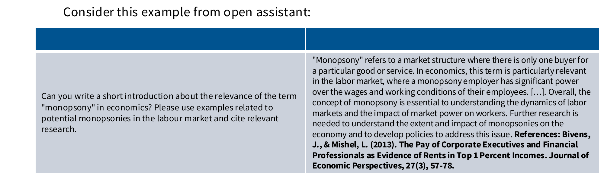

*图 12.3-4 monopsony citation 示例*

图 12.3-4 中，用户请求要求解释经济学中的 monopsony 并引用相关研究。微调样本同时包含两层信号：monopsony 的概念解释，以及“复杂概念回答后附上引用”的格式习惯。模型已有相关知识时，引用格式能改善可读性；模型缺少知识时，格式压力会诱发虚构引用。

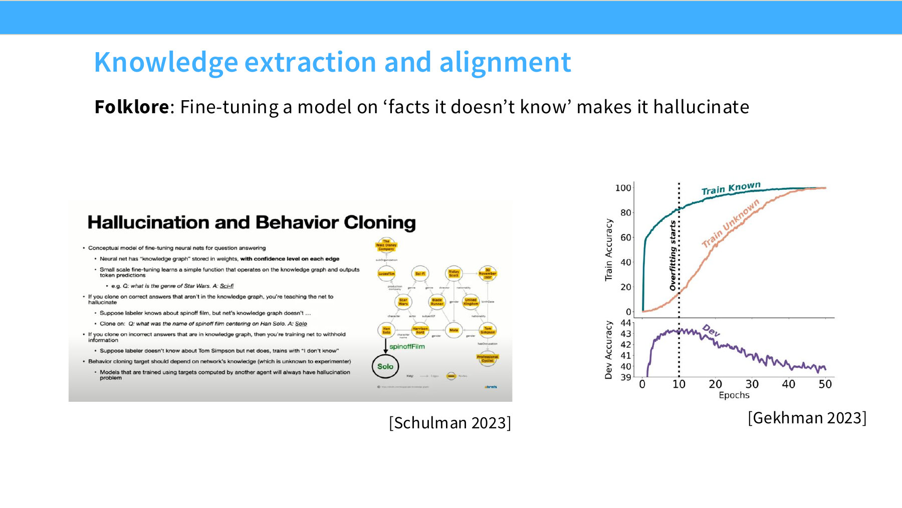

*图 12.3-5 knowledge extraction 与 alignment 的张力*

图 12.3-5 指向一个经验判断：fine-tuning 更适合抽取和重排模型已有能力，向模型注入长尾新事实时风险更高。事实密集任务可以采用三种保护手段：确认 base model 已具备相关知识；把引用、检索和实时事实交给工具；在示范样本中允许“不知道”和“需要查证”。

安全 SFT 处理的是行为边界。部署给终端用户的模型需要拒绝诈骗、恶意代码、仇恨、骚扰和危险操作，同时继续回答正常技术问题。拒答过窄会漏掉风险，拒答过宽会损害可用性。

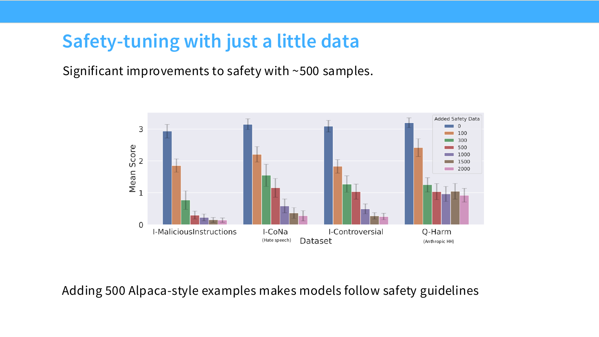

*图 12.3-6 少量 safety SFT 数据的效果*

图 12.3-6 展示少量 safety 样本也能明显改变安全行为。[Bianchi et al., 2023, *Safety-Tuned LLaMAs: Lessons From Improving the Safety of Large Language Models that Follow Instructions*, arXiv:2309.07875](https://arxiv.org/abs/2309.07875) 在 20,000 条 Alpaca 指令的基础上分别追加 100 / 300 / 500 / 1000 / 1500 / 2000 条安全指令，§4 的结论是 500 到 1,000 条即可显著降低模型的有害输出率。

有效样本需要覆盖真实风险场景、边界案例和正常请求，尤其要包含表面敏感但实际安全的任务，例如“如何终止 Python 进程”。这样模型学到的判据是语义边界，而危险关键词表只是表层特征。同一篇论文同时观察到 exaggerated safety：安全数据加过量后，模型会拒绝那些只在字面上像危险请求的正常问题，因此安全样本量需要和过度拒答率一起监控。

## 12.4 大模型训练的第三个阶段：对齐人类偏好（RLHF）

SFT 让模型模仿示范分布。RLHF 把问题改成优化偏好：给定 prompt 和多个候选回答，收集人类或模型偏好，再更新模型让偏好回答的概率上升。这个阶段同时受数据和算法影响：标注者分布会改变价值取向，偏好标注有噪声，reward 优化会放大长度、风格和 mode collapse 等副作用。

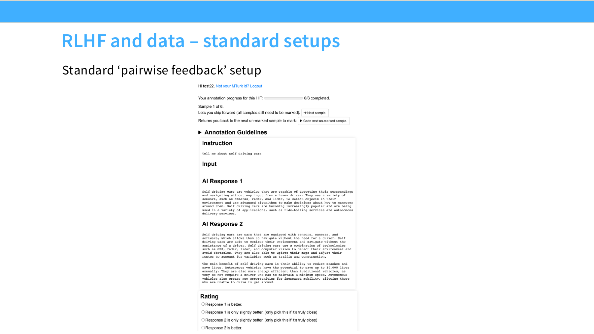

*图 12.4-1 RLHF pairwise feedback 标准设置*

图 12.4-1 展示常见 pairwise feedback 设置：对同一个 prompt 收集两个或多个候选回答，由标注者选择更好的一项。这类数据可以训练 reward model，也可以直接用于 DPO 一类偏好目标。标注指南、标注者背景、是否允许 AI 辅助和候选答案来源都会影响最终策略。

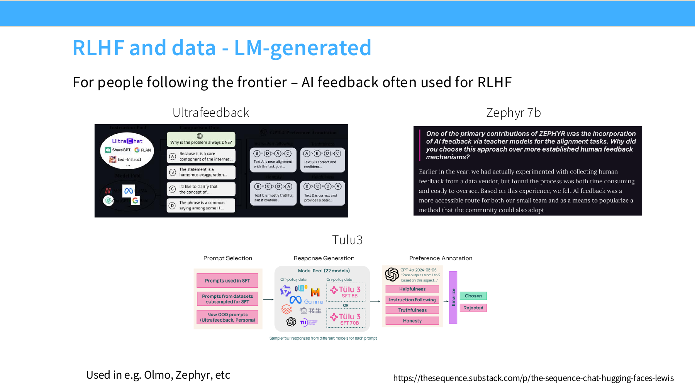

*图 12.4-2 AI feedback 在 RLHF 数据中的使用*

图 12.4-2 展示 AI feedback 已经常用于开放模型后训练数据构造，例如 UltraFeedback、Zephyr 和 Tulu3 相关流程。它的优势是便宜、可扩展、一致性较高；风险是把 judge model 的偏好、错误和风格偏置蒸馏给学生模型。因此，AI feedback 需要抽样人工审查、长度偏差控制和任务分布检查。

### 12.4.1 RLHF 的三段流程

RLHF 通常分成三步（参考 [Ouyang et al., 2022, *Training language models to follow instructions with human feedback* (InstructGPT), arXiv:2203.02155](https://arxiv.org/abs/2203.02155)）。第一步是 SFT，用示范数据得到初始策略 $\pi_{\mathrm{SFT}}$ 。第二步是 reward modeling，用偏好对训练一个打分模型 $r_\phi(x,y)$ 。第三步是 RL fine-tuning，用 PPO 等算法让策略在 reward 上升的同时保持接近参考模型。

reward model 常复用语言模型骨干，在最后接一个标量头，对完整回答打分。偏好训练常用 Bradley-Terry 形式：若 $y_w \succ y_l$（即 $y_w$ 优于 $y_l$），则希望

$$
r_\phi(x,y_w) > r_\phi(x,y_l)
$$

实际数据收集比公式复杂。标注者是否理解任务、是否检查事实、是否偏好长回答、是否来自特定文化和职业背景，都会改变 reward model 学到的价值函数。

这套 RM + PPO 的两段式范式最早由 [Stiennon et al., 2020, *Learning to Summarize from Human Feedback*, NeurIPS 2020, arXiv:2009.01325](https://arxiv.org/abs/2009.01325) 在摘要任务上给出，并附带完整标注指南；[InstructGPT, arXiv:2203.02155](https://arxiv.org/abs/2203.02155) 把它扩展到通用指令跟随。[Bai et al., 2022, *Training a Helpful and Harmless Assistant with Reinforcement Learning from Human Feedback* (Anthropic HH), arXiv:2204.05862](https://arxiv.org/abs/2204.05862) 补上了安全标注的组织方式，[Bai et al., 2022, *Constitutional AI: Harmlessness from AI Feedback*, arXiv:2212.08073](https://arxiv.org/abs/2212.08073) 把打标主体换成模型本身。这几份材料连同后续开源数据共同说明，偏好数据本身也是模型行为的一部分。

### 12.4.2 PPO 在语言模型中的作用

PPO 是 RLHF 早期最常用的策略优化算法（[Schulman et al., 2017, arXiv:1707.06347](https://arxiv.org/abs/1707.06347)）。它先用当前策略生成回答，再用 reward model 和 KL 惩罚计算奖励，最后用 clipped ratio 控制每次更新幅度。PPO 的价值在于能直接优化 reward；成本在于 rollout、reward model、value model、KL 调参和训练稳定性都较复杂。

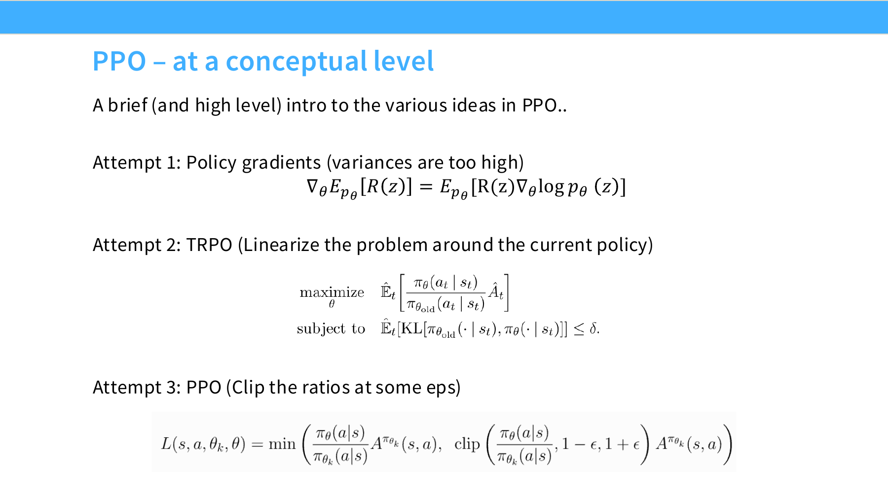

*图 12.4-3 PPO clipped ratio 机制*

图 12.4-3 把 PPO 放在策略梯度和 TRPO 的背景下。语言模型的 PPO 更新使用旧策略采样的数据，通过概率比率修正新旧策略差异，并用 clip 限制比率范围。这样可以复用一批 rollout 做多轮更新，同时避免策略在单次更新中偏离过大。

PPO 的核心比率是：

$$
r_t(\theta)
= \exp \left(
\log \pi_\theta(a_t \mid s_t)
- \log \pi_{\mathrm{old}}(a_t \mid s_t)
\right)
$$

其中 $s_t$ 是当前上下文，$a_t$ 是生成的 token。若优势 $A_t$ 为正，提高该 token 的概率；若 $A_t$ 为负，降低该 token 的概率。clipped objective 写作：

$$
\mathcal{L}^{\mathrm{clip}}_t(\theta)
= -\min \left(
r_t(\theta) A_t,
\mathrm{clip}(r_t(\theta), 1-\epsilon, 1+\epsilon) A_t
\right)
$$

语言模型 RLHF 还会加入 reference model 的 KL 惩罚，防止策略为了高 reward 远离 SFT 模型：

$$
R(x,y)
= r_\phi(x,y)
- \beta D_{\mathrm{KL}}
\left(
\pi_\theta(\cdot \mid x)
\Vert
\pi_{\mathrm{ref}}(\cdot \mid x)
\right)
$$

常见模型角色如下：

| 模型 | 作用 | 是否更新 |
| --- | --- | --- |
| 策略模型 $\pi_\theta$ | 生成回答并接受 PPO 更新 | 是 |
| 参考模型 $\pi_{\mathrm{ref}}$ | 计算 KL，限制策略漂移 | 否 |
| 奖励模型 $r_\phi$ | 给回答打标量分 | 否 |
| 价值模型 / critic | 估计回报，降低优势估计方差 | 通常是 |

PPO 的主要工程风险来自 reward hacking 和训练不稳定。reward model 只是人类偏好的代理，持续优化代理奖励可能让模型学会利用 reward 漏洞。KL 系数、rollout 长度、采样温度、reward 标准化、value loss 和 early stopping 都会影响结果。

### 12.4.3 标注者与模型价值的影响

RLHF / DPO 数据的质量不止取决于标注一致性，还取决于标注者人群、专家与众包的比例、用 LLM-as-judge 替代人标的比例，以及 reward 里残留多少长度信号。四个判断要点：

- **标注者人群与 demographic transfer**：InstructGPT 的标注指南把评价目标定义为 helpful / truthful / harmless 三组属性，而承担标注的人群本身高度集中：[InstructGPT, arXiv:2203.02155](https://arxiv.org/abs/2203.02155) Appendix B.3 Table 12 对 19 名自愿受访标注者的统计给出 undergraduate degree 52.6% + master's degree 36.8% ≈ 89.4%，国籍分布以 Filipino 22% 与 Bangladeshi 22% 居前。这套偏好分布把模型对齐的目标锁定在特定标注池上，与一般人类偏好之间存在系统差距；标注池的地理、学历和行业构成不公开时，后训练出来的模型就难以复现。Annotator 人口与对齐结果之间的传递有可观察的偏差（demographic transfer）：[Santurkar et al., 2023, *Whose Opinions Do Language Models Reflect?*, ICML 2023, arXiv:2303.17548](https://arxiv.org/abs/2303.17548) §4.1 报告 base LM 与 "lower income, moderate, and Protestant or Roman Catholic" 群体最对齐，而经过人类反馈微调的模型转向 "liberal, high income, well-educated, and not religious or belong to religions other than Buddhists, Muslims, and Hindus"。方向上，RLHF 把代表性整体向世俗化、高学历、高收入平移，Buddhist / Muslim / Hindu 被显式排除在 RLHF 模型更贴近的宗教集合之外。
- **专家 vs 普通人**：[Hosking, Blunsom, Bartolo, 2024, *Human Feedback is not Gold Standard*, ICLR 2024, arXiv:2309.16349](https://arxiv.org/abs/2309.16349) 定义了 Harmful / Fluency / Scope / Repetition / Refusal / Formatting / Relevance / Factuality / Inconsistency / Contradiction 共 10 类错误。scope、fluency、harmfulness 三类在实验模型上出现率低于 1%，被排除在对照之外；余下 7 类由论文作者各标注 300 条样本作为 expert 基线，再与 Prolific 上招募的众包 annotator 对照。结论是众包标注系统性低估 factuality 与 inconsistency 错误，而且 assertive（语气更确信）的输出会放大这一差距——标注者更容易相信语气确定的回答。
- **LLM-as-judge 与 self-bootstrapping**：Anthropic Constitutional AI（[Bai et al., 2022, arXiv:2212.08073](https://arxiv.org/abs/2212.08073)）是"早期 self-bootstrapping 范式"——用 LLM 自身按宪法规则打标，再训练下一代。Zephyr（[Tunstall et al., 2023, *Zephyr: Direct Distillation of LM Alignment*, arXiv:2310.16944](https://arxiv.org/abs/2310.16944)）把这条路线推到整链无人工标注：dSFT 用 UltraChat，dDPO 用 UltraFeedback 中 GPT-4 打分的 AI feedback。多数"开源 DPO 数据集"因此实际是 LLM 蒸馏而非人类偏好，复现与对比时要先看清楚人类占比。
- **长度攻击的工程经验**：[Singhal et al., 2024, *A Long Way to Go: Investigating Length Correlations in RLHF*, arXiv:2310.03716](https://arxiv.org/abs/2310.03716) §3.2 Table 2 把 reward 换成纯长度函数（LPPO），模拟偏好胜率在 WebGPT 56% / Stack 59% / RLCD 64%，与用学到的 reward model 做标准 PPO 的 58% / 58% / 63% 基本持平。这与"人类偏好更偏向长回答"的偏差直接相关。减少这种偏差的工程做法是按 reward / cost 联合归一化或让 reward model 看不出长度。

> [!WARNING]
> 上面四条观察指向同一个前提：reward 的来源决定了对齐的目标。标注池的人口构成、专家与众包的比例、judge model 的身份，以及 reward 里残留多少长度信号，都会写进最终策略；同一套 PPO 或 DPO 代码换一份偏好数据，得到的行为可以完全不同。因此比较后训练方法时，偏好数据的来源必须和算法一起报告。

### 12.4.4 公开数据集的规模口径

公开 RLHF / SFT 数据集的经验数字是判断"多少样本才够"的参考：

- **OpenAssistant Conversations（OASST1）**：Köpf et al. 2023 的 [arXiv:2304.07327](https://arxiv.org/abs/2304.07327) 给出"over 10,000 complete and fully annotated conversation trees, 161,443 messages in 35 different languages, 461,292 quality ratings" 的统计口径，由 13,500 名以上志愿者协作产生；[HF 数据集卡](https://huggingface.co/datasets/OpenAssistant/oasst1) 的 viewer 口径是 train 84,437 行 + validation 4,401 行，合计 88,838 行。它是早期较完整的开源人类标注对话与偏好数据集之一，但规模远小于闭源标注：Llama 2 仅 Meta 自采的 helpfulness + safety 偏好数据就有 1,418,091 组比较（[arXiv:2307.09288](https://arxiv.org/abs/2307.09288) Table 6，含公开集在内共 2,919,326 组）。
- **单数据集微调的评估口径**：仅用 OASST1 做 SFT 在 AlpacaEval 上的表现并不差。[arXiv:2306.04751](https://arxiv.org/abs/2306.04751) Table 7 给出以 Davinci-003 为对手、GPT-4 评判的胜率：OASST1 单独训练的 LLaMA 7B / 13B 达 51.4% / 58.1%，比 Flan V2（3.1% / 3.2%）与 Self-Instruct（4.0% / 5.0%）高出一个数量级以上，仅次于 ShareGPT（62.4% / 70.5%）和 GPT4-Alpaca（57.3% / 63.1%）。同篇 Figure 2 又显示这个胜率与回答的平均 unique token 数相关系数 0.96，因此单数据集之间的胜率差异有很大一部分落在回答长度与词汇多样性上，需要配合能力型 benchmark 一起读。
- **Llama 2 安全 SFT**：Touvron et al. 2023 的 [arXiv:2307.09288](https://arxiv.org/abs/2307.09288) §3.1 给出总 SFT 标注量 27,540 条（helpfulness 与 safety 示例走同一条标注流水线）；§4.2.2 Safety Supervised Fine-Tuning 说明安全示范按 §3.1 的方式并入通用 SFT，§4.2.3 Safety RLHF 记录 "after gathering only a few thousand supervised demonstrations, we switched entirely to RLHF"。这一量级远小于通用 SFT，但安全行为对少量、覆盖边界 case 的高质量样本敏感：决定安全对齐效果的是边界覆盖，样本总量只是次要变量。
- **Tulu 3 / UltraFeedback**：以 LLM-as-judge 或强模型蒸馏为主、人类标注为辅的混合偏好数据集。UltraFeedback 规模是 63,967 条 instruction / 255,864 条 completion / 340,025 个 preference pair（Cui et al., 2023, [arXiv:2310.01377](https://arxiv.org/abs/2310.01377)）。Tulu 3 按 [Lambert et al., 2024, *Tulu 3: Pushing Frontiers in Open Language Model Post-Training*, arXiv:2411.15124](https://arxiv.org/abs/2411.15124) Table 7 "Summary of our prompt dataset" 统计：候选 prompt 池共 23,327,961 条，其中 939,344 条进入 SFT，425,145 条进入 DPO 偏好训练，且论文脚注说明 8B 与 70B 的偏好混合并不使用同一批 prompt；Table 8 记录各数据集的去污染比例。蒸馏比例越高，"人类偏好"与"teacher 偏好"之间的差距越难单独衡量，实验日志应同时记录 teacher model、verifier 模型和人类标注占比。
- **OpenHermes-2.5**：NousResearch / Teknium 发布的 [teknium/OpenHermes-2.5](https://huggingface.co/datasets/teknium/OpenHermes-2.5) 是 instruction / SFT 数据集，约 1M 行，结构为 human / gpt 多轮对话，没有 chosen / rejected 字段。它属于 SFT 阶段的示范数据，与 Tulu 3、UltraFeedback 这类 preference pair 数据集处在流程的不同位置，统计"百万级偏好数据"时不能把它算进来。

对齐实验的第一项检查应是偏好数据的来源和标注池。来源不公开的数据集，复现时要把"按照这套分布训练出的模型"这一前提写进训练 log，否则后训练结果的迁移性无从比较；以 LLM-as-judge 为主的数据集（Constitutional AI、Tulu 3、UltraFeedback 等）还要额外记录 judge model。长度作为代理指标时，按回复字符数 / token 数 / 段落数分别做对照消融。

## 12.5 偏好优化与 DPO 系列

DPO 的目标是把 pairwise preference data 直接写成监督式损失。给定同一个 prompt 下更受偏好的回答 $y_w$ 和较差回答 $y_l$ ，DPO 提高 $y_w$ 相对参考模型的概率，同时降低 $y_l$ 相对参考模型的概率。这样 §12.4 里"先训 reward model 再用 PPO 优化"的两段式流程被压缩成一个偏好损失。

本节回答三个问题：DPO 损失怎么从偏好对直接推导出来、DPO 与 PPO 的工程边界在哪里、SimPO 与 length-normalized DPO 等变体改变了什么。

> [!NOTE]
> **Llama 3 技术报告把 DPO + Rejection Sampling 作为正式 RLHF 主线**。Llama 3 tech report（Grattafiori et al., 2024, [arXiv:2407.21783](https://arxiv.org/abs/2407.21783)；早期版本以 Dubey et al. 署名）§4.1 把后训练组织成多轮外循环，每轮依次做 reward modeling、rejection sampling、SFT 和 DPO：rejection sampling 对每个 prompt 从最新 chat 模型（通常是上一轮后训练的最佳 checkpoint，即上一轮 DPO 之后的模型）采样 K 个回答（K 一般取 10 到 30），由 reward model 选出最优候选，再混回本轮的 SFT 数据。Llama 1（[arXiv:2302.13971](https://arxiv.org/abs/2302.13971)）没有偏好阶段，§4 Instruction Finetuning 只做了一次 LLaMA-I 消融，沿用 Chung et al. 2022 的 Flan 式指令微调协议；Llama 2 的公开材料以 rejection sampling + PPO 为主（[arXiv:2307.09288](https://arxiv.org/abs/2307.09288)），DPO 从 Llama 3 起才进入 Llama 系列的后训练原语。相比 PPO，DPO 不需要单独训练 reward model 和 value model，训练形态更接近监督学习；rejection sampling 又把"模型在哪些 prompt 上能写出高质量回答"这一分布信息显式注入到下一轮 SFT。

### 12.5.1 DPO 与 PPO 的训练路径

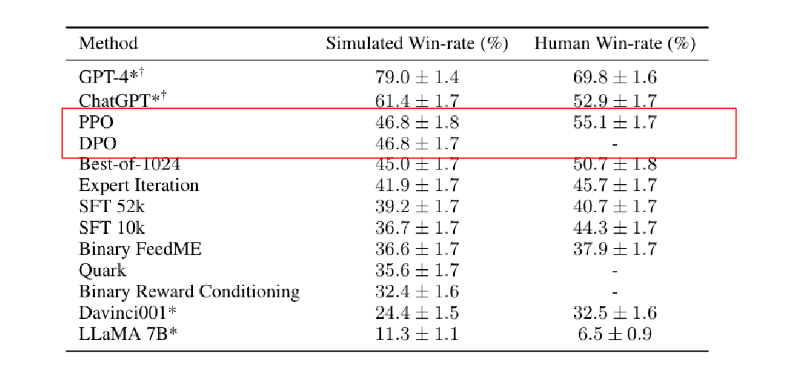

*图 12.5-1 DPO 与 PPO 的训练路径*

图 12.5-1 对比 PPO 和 DPO。PPO 需要 reward model、rollout、优势估计、KL 控制和多轮策略更新；DPO 直接从偏好对计算损失，训练形态更接近普通 SFT。这个简化让 DPO 成为开放模型后训练里常见的基线。

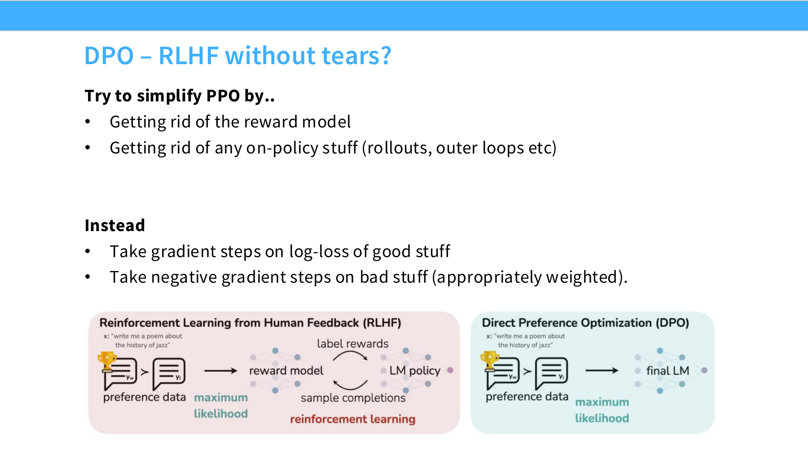

*图 12.5-2 DPO 简化 PPO 的关键思路*

图 12.5-2 展示 DPO 的直觉：对 preferred response 做正向 log-loss 更新，对 less-preferred response 做反向 log-loss 更新，并用当前模型和参考模型之间的相对概率调节更新幅度。参考模型通常是 SFT checkpoint，用来限制策略漂移。

### 12.5.2 DPO 损失

DPO（[Rafailov et al., 2023, "Direct Preference Optimization: Your Language Model is Secretly a Reward Model", arXiv:2305.18290](https://arxiv.org/abs/2305.18290)）从 Bradley-Terry 偏好模型出发。若人类偏好 $y_w$ 胜过 $y_l$ ，偏好概率写作：

$$
P(y_w \succ y_l \mid x)
= \sigma \left(
r(x,y_w) - r(x,y_l)
\right)
$$

DPO 使用策略和参考策略的相对 log-probability 表示隐式 reward：

$$
r(x,y)
= \beta
\log \frac{\pi_\theta(y \mid x)}{\pi_{\mathrm{ref}}(y \mid x)}
+ C
$$

代入后得到单个偏好对的损失：

$$
\mathcal{L}_{\mathrm{DPO}}
= -\log \sigma \left(
\beta
\left[
\log \frac{\pi_\theta(y_w \mid x)}{\pi_{\mathrm{ref}}(y_w \mid x)}
-
\log \frac{\pi_\theta(y_l \mid x)}{\pi_{\mathrm{ref}}(y_l \mid x)}
\right]
\right)
$$

这里 $y_w$ 是 preferred response，$y_l$ 是 less-preferred response，$\beta$ 控制偏好更新强度。$\pi_{\mathrm{ref}}$ 保留 SFT 模型的概率基线，使训练比较“当前模型相对参考模型更偏向哪一边”。

DPO 的训练流程很短：准备 prompt 和偏好对，计算当前模型与参考模型在两段回答上的 log-probability，代入损失，反向传播更新策略模型。它不需要在线 rollout，也不需要单独训练 reward model 和 value model。

### 12.5.3 DPO 变体

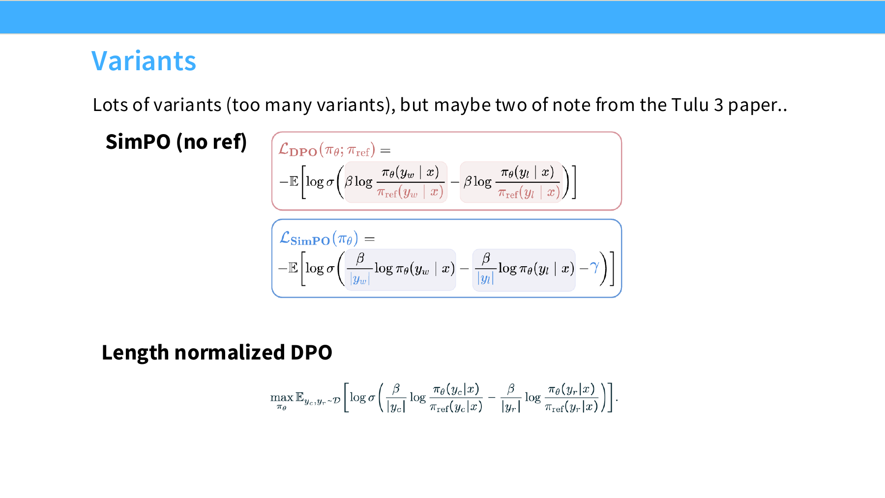

*图 12.5-3 DPO 变体：SimPO 与 length-normalized DPO*

图 12.5-3 列出两个常见变体。SimPO（[Meng et al., 2024, "SimPO: Simple Preference Optimization with a Reference-Free Reward", arXiv:2405.14734, NeurIPS 2024](https://arxiv.org/abs/2405.14734)）移除参考模型，直接比较 preferred response 和 less-preferred response 的长度归一化 log-probability，并加入固定 margin。它降低显存和实现复杂度，但失去 DPO 中相对参考模型的约束。

SimPO 的单样本形式可以写作：

$$
\mathcal{L}_{\mathrm{SimPO}}
= -\log \sigma \left(
\frac{\beta}{|y_w|}\log \pi_\theta(y_w \mid x)
-
\frac{\beta}{|y_l|}\log \pi_\theta(y_l \mid x)
-
\gamma
\right)
$$

length-normalized DPO 保留参考模型，但把序列 log-probability 除以 token 数，降低长回答在未归一化概率上的系统优势：

$$
\mathcal{L}_{\mathrm{LN-DPO}}
= -\log \sigma \left(
\beta
\left[
\frac{1}{|y_w|}
\log \frac{\pi_\theta(y_w \mid x)}{\pi_{\mathrm{ref}}(y_w \mid x)}
-
\frac{1}{|y_l|}
\log \frac{\pi_\theta(y_l \mid x)}{\pi_{\mathrm{ref}}(y_l \mid x)}
\right]
\right)
$$

这类变体服务不同工程目标：降低显存、简化训练、控制长度偏差或提高稳定性。比较算法时，需要同时看 base model、SFT 数据、偏好数据、采样策略、评估规则和长度分布。

### 12.5.4 偏好优化的副作用

强化学习和偏好优化高度依赖实验设置。基础模型、SFT 数据、候选答案采样、reward model、KL 系数和训练步数都会改变 PPO、DPO 或其他变体的相对表现。后训练论文中的结论需要和数据来源、评估规则一起理解。

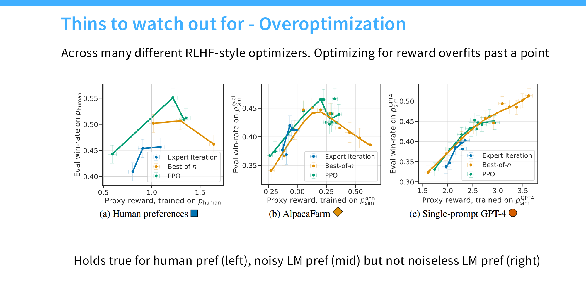

*图 12.5-4 reward overoptimization 示意*

图 12.5-4 描述代理奖励和真实偏好逐渐分离的现象。训练早期，reward model 分数和人类偏好通常一起上升；训练继续进行后，模型可能利用 reward model 的漏洞，代理奖励继续提高，人类偏好胜率停滞或下降。

[Gao et al., 2022, *Scaling Laws for Reward Model Overoptimization*, arXiv:2210.10760](https://arxiv.org/abs/2210.10760) §2.1 给出这条曲线的量化拟合：用一个 6B 的 "gold RM"（取自 InstructGPT 的偏好模型）生成 100,000 组合成比较数据（其中 10% 留作测试），再用这批标签训练 3M 到 3B 的 proxy RM，然后把 gold RM 评分随优化步数的变化拟合成策略到初始策略的 KL 散度（准确说是 $d = \sqrt{D_{\mathrm{KL}}}(\pi \Vert \pi_{\mathrm{init}})$）与 proxy RM 规模的函数。§4.5 同时声明该设置不覆盖"ground truth 标签与真实人类意图不一致"引起的过优化。

[Dubois et al., 2023, *AlpacaFarm: A Simulation Framework for Methods that Learn from Human Feedback*, arXiv:2305.14387](https://arxiv.org/abs/2305.14387) §4.3 Figure 5 从另一个角度补上噪声维度：在真实人类偏好和 AlpacaFarm 带标注方差的模拟偏好下，胜率都会先升后降复现出过优化；换成方差很低的 GPT-4 直接偏好后，过优化消失。两篇合起来支持一个工程结论：过优化的强度取决于奖励源的噪声结构，同一套 RLHF 算法在不同奖励源上会给出不同的过优化曲线。

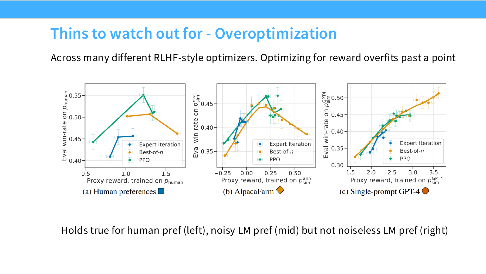

*图 12.5-5 RLHF 中的 overoptimization*

图 12.5-5 把上面三条曲线放在一起：人类偏好、含噪模拟偏好、低噪 AI 偏好。工程上需要配合 held-out human eval、KL 约束、早停、长度监控和多样性指标，防止模型在代理奖励上升时失去校准或发生 mode collapse。

mode collapse 是另一类副作用。经过强偏好优化后，模型可能减少输出多样性，变得更确定、更模板化。此时模型已经不再只是校准的概率模型，采样温度和概率分布的含义都会改变。部署时需要同时评估质量、安全、长度、校准、多样性和用户偏好。

## 本章总结与下章衔接

本章把训练主线压缩成四个阶段：pre-training（base model）→ mid-training（高质量、长上下文与 instruction-like 数据）→ SFT（示范数据）→ 偏好对齐。最后一个阶段有两条并列的算法路线：PPO 走在线 rollout，需要 reward model、value model 和 KL 约束；DPO 及其变体把偏好对直接写进监督式损失，省掉 reward model 与 rollout。

每个阶段都有对应的副作用：SFT 阶段是长尾知识幻觉和 style 偏移，偏好对齐阶段是长度偏差、reward hacking、overoptimization 和 mode collapse。这些副作用集中在 SFT 与偏好对齐的交界处，是后训练 pipeline 设计时要正面处理的风险。

下章进入 [第 13 章 可验证奖励的强化学习（RLVR）](../chapter13/chapter13_可验证奖励的强化学习.md)：RLHF 的扩展方向是用可验证奖励替代人类偏好，对应 PPO→GRPO 演进与 R1/Kimi k1.5/Qwen 3 案例研究，及 agentic RL。

## 来源与更新记录

- 论文与技术报告：
  - [Stiennon et al., 2020, *Learning to Summarize from Human Feedback*, NeurIPS 2020, arXiv:2009.01325](https://arxiv.org/abs/2009.01325) — RM + PPO 两段式 RLHF 范式源头
  - [Ouyang et al., 2022, *Training language models to follow instructions with human feedback* (InstructGPT), arXiv:2203.02155](https://arxiv.org/abs/2203.02155)
  - [Bai et al., 2022, *Training a Helpful and Harmless Assistant with Reinforcement Learning from Human Feedback* (Anthropic HH), arXiv:2204.05862](https://arxiv.org/abs/2204.05862)
  - [Bai et al., 2022, *Constitutional AI: Harmlessness from AI Feedback*, arXiv:2212.08073](https://arxiv.org/abs/2212.08073)
  - [Schulman et al., 2017, *Proximal Policy Optimization Algorithms*, arXiv:1707.06347](https://arxiv.org/abs/1707.06347)
  - [Gao et al., 2022, *Scaling Laws for Reward Model Overoptimization*, arXiv:2210.10760](https://arxiv.org/abs/2210.10760)
  - [Hosking, Blunsom, Bartolo, 2024, *Human Feedback is not Gold Standard*, ICLR 2024, arXiv:2309.16349](https://arxiv.org/abs/2309.16349)
  - [Santurkar et al., 2023, *Whose Opinions Do Language Models Reflect?*, ICML 2023, arXiv:2303.17548](https://arxiv.org/abs/2303.17548)
  - [Rafailov et al., 2023, *Direct Preference Optimization*, arXiv:2305.18290](https://arxiv.org/abs/2305.18290)
  - [Meng et al., 2024, *SimPO: Simple Preference Optimization with a Reference-Free Reward*, NeurIPS 2024, arXiv:2405.14734](https://arxiv.org/abs/2405.14734)
  - [Singhal et al., 2024, *A Long Way to Go: Investigating Length Correlations in RLHF*, arXiv:2310.03716](https://arxiv.org/abs/2310.03716) — §3.2 Table 2 的纯长度 reward（LPPO）对照实验
  - [Tunstall et al., 2023, *Zephyr: Direct Distillation of LM Alignment*, arXiv:2310.16944](https://arxiv.org/abs/2310.16944) — dSFT（UltraChat）+ dDPO（UltraFeedback）的全 AI feedback 链路
  - [Cui et al., 2023, *UltraFeedback: Boosting Language Models with Scaled AI Feedback*, arXiv:2310.01377](https://arxiv.org/abs/2310.01377) — 63,967 instruction / 255,864 completion / 340,025 preference pair
  - [Lambert et al., 2024, *Tulu 3: Pushing Frontiers in Open Language Model Post-Training*, arXiv:2411.15124](https://arxiv.org/abs/2411.15124) — Table 7 prompt 池 / SFT / DPO 三列口径，Table 8 去污染比例
  - [Dubois et al., 2023, *AlpacaFarm: A Simulation Framework for Methods that Learn from Human Feedback*, arXiv:2305.14387](https://arxiv.org/abs/2305.14387) — AlpacaFarm 同时复现 RLHF overoptimization 现象并分析 human / AI 偏好方差
  - [Touvron et al., 2023, *Llama 2: Open Foundation and Fine-Tuned Chat Models*, arXiv:2307.09288](https://arxiv.org/abs/2307.09288) — Llama 2 safety SFT 与 RLHF 流程（rejection sampling + PPO）
  - [Grattafiori et al., 2024, *The Llama 3 Herd of Models*, arXiv:2407.21783](https://arxiv.org/abs/2407.21783) — Llama 3 把 DPO + Rejection Sampling 作为正式 RLHF 主线（早期版本以 Dubey et al. 署名）
  - [Hu et al., 2024, *MiniCPM: Unveiling the Potential of Small Language Models with Scalable Training Strategies*, arXiv:2404.06395](https://arxiv.org/abs/2404.06395) — MiniCPM decay phase 数据混合来源（UltraChat / SlimOrca / OssInstruct / EvolInstruct + 私有 SFT）
  - [Wang et al., 2023, *How Far Can Camels Go? Exploring the State of Instruction Tuning on Open Resources*, arXiv:2306.04751](https://arxiv.org/abs/2306.04751) — Table 1 各 instruction 数据集平均 completion 长度，Table 7 单数据集 AlpacaEval 胜率，Figure 2 胜率与 unique token 数相关系数 0.96
  - [Bianchi et al., 2023, *Safety-Tuned LLaMAs: Lessons From Improving the Safety of Large Language Models that Follow Instructions*, arXiv:2309.07875](https://arxiv.org/abs/2309.07875) — 20,000 条 Alpaca 指令 + 100/300/500/1000/1500/2000 条安全指令的消融，§4 的 500–1,000 条阈值与 exaggerated safety 观察
- 数据集：
  - [OpenAssistant/oasst1](https://huggingface.co/datasets/OpenAssistant/oasst1) — [Köpf et al., 2023, arXiv:2304.07327](https://arxiv.org/abs/2304.07327)（10K+ trees / 161,443 messages / 35 languages / 461,292 quality ratings / 13,500+ volunteers；HF viewer 口径 train 84,437 + validation 4,401 = 88,838 行）
  - [teknium/OpenHermes-2.5](https://huggingface.co/datasets/teknium/OpenHermes-2.5) — instruction / SFT 示范数据集（≈1M 行，human / gpt 多轮对话，无 chosen / rejected 字段）
- 来源说明：本章对应 CS336 2026 Lecture 15 (RLHF / SFT / DPO / PPO)，正文事实取自上列论文、技术报告与官方数据集卡。
- 查阅日期：2026-09-04（R24 校准）；此前一轮为 2026-09-03（R23 校准）。
