# 第 13 章 可验证奖励的强化学习（RLVR）

前面的训练流程章节（[第 12 章 大模型基本训练流程](../chapter12/chapter12_大模型基本训练流程.md)）已经讨论过 RLHF（基于人类反馈的强化学习）。RLHF 是使模型遵循指令的关键，也带来明显的扩展挑战：人类反馈昂贵、缓慢，奖励模型还容易被过度优化（Goodhart's Law）。

本章讨论 **o1**、**DeepSeek R1**、**Kimi k1.5**、**Qwen 3** 等推理模型背后的训练路线：**RLVR (Reinforcement Learning from Verifiable Rewards)**。

## 本章学习目标

读完本章，读者应当能够：

- 说出 RLHF 与 RLVR 在奖励信号本质上的区别（人类偏好 / 奖励模型 vs 可验证的标量反馈）。
- 描述 PPO → GRPO → Dr. GRPO 的算法演进主线，特别是 value model 去掉后 advantage 如何估计，以及组内标准差和响应长度两个分母各自引入什么偏差、怎么修。
- 把 GRPO 训练流程分成六个步骤：rollout、reward 计算、组内 z-score 得到 advantage、ratio clipping、KL penalty、policy 更新。
- 解释 DeepSeek R1、Kimi k1.5、Qwen 3 这三个案例在冷启动、长 CoT、长度控制、agentic RL 上的工程边界。
- 在自己的可验证任务（数学、代码、形式化证明）上设计一个最小可跑的 RLVR 流水线。

## 本章主线

本章聚焦“奖励是否可验证”这个分界线：RLHF 依赖人类偏好或奖励模型，RLVR 则尽量在数学、代码、形式化证明等可自动判分任务中直接优化客观结果。读完本章应能理解可验证奖励的扩展性、长度偏差和奖励黑客的来源，以及现代推理模型案例的工程边界。

学习时可以抓住三条线索。第一，PPO 到 GRPO 的变化主要围绕 advantage 如何估计、value model 能否省掉、更新是否稳定。第二，PPO 和 GRPO 的代码实现都要同时处理 policy loss、KL penalty、reward shaping 和 rollout 数据。第三，DeepSeek R1、Kimi k1.5 和 Qwen 3 这些案例把算法、冷启动数据、长 CoT、长度控制和蒸馏放进同一条后训练流水线。

RLVR 还会把推理系统带进训练循环：rollout 需要慢速 generation，长短不一的回答会形成 ragged batch，verifier 或执行环境会增加等待时间。训练框架和推理框架之间如何分工、rollout 能否复用、on-policy 稳定性和 off-policy 吞吐之间如何取舍，都是本章案例里的系统约束。

## 13.1 为什么需要 RLVR？

在 AlphaGo 或 AlphaFold 等领域，强化学习取得了巨大成功，因为训练任务拥有清楚的反馈：围棋可以判定胜负，结构预测可以用明确指标比较结果。

语言模型也存在类似领域：数学题、代码生成和形式化证明的答案相对客观、可验证。在这些任务上，训练可以用自动判分替代昂贵的人类偏好标注，并把更多计算投入到采样、验证和策略改进中。RLVR 沿用这条思路：把语言模型输出放进验证器，让验证结果直接变成训练信号。

### 13.1.1 RLHF 的困境

传统的 RLHF 依赖人类对模型输出的成对偏好判断（如 “A 比 B 好”）。reward model、value model 和 KL 约束这套算法组件已在 [第 12 章 §12.4 对齐人类偏好（RLHF）](../chapter12/chapter12_大模型基本训练流程.md) 展开；本章聚焦的是把 RLHF 范式换成 RLVR 之后的工程边界。这类偏好数据有三类扩展问题：

- 奖励噪声高：人类判断主观、不一致，且易被表面修辞迷惑；
- 难以规模化：高质量偏好数据标注成本极高，无法支撑万亿 token 级训练；
- 过优化（Over-optimization）：模型学会“讨好”奖励模型，生成看似合理但内容空洞、冗长甚至幻觉的输出。

> [!WARNING]
> RLHF 优化的是代理目标（人类偏好）；RLVR 在可验证任务中把奖励信号尽量贴近任务正确性。

### 13.1.2 成功案例的启示

回顾 AlphaGo、AlphaFold 等 RL 成功案例，其共同点是：**奖励函数是明确、可验证、可自动计算的**。例如：

- 围棋：最终是否获胜（0/1）；
- 蛋白质折叠：预测结构与真实结构之间的 RMSD（Root Mean Square Deviation，均方根偏差）。

这类任务中，RL 算法可以直接优化可计算反馈，减少人类中介。语言模型里的可验证任务提供了相似的切入口。

### 13.1.3 RLVR 的定位

RLVR 聚焦于一类特殊任务：**输出可被程序自动判分**。典型场景包括：

- **数学推理**：答案是否与标准解一致（如 GSM8K、MATH）；
- **代码生成**：生成的程序是否通过所有测试用例；
- **形式化证明**：证明步骤是否逻辑自洽。

在这些场景中，奖励函数 $R(z)$ 可定义为：

$$
R(z) =
\begin{cases}
1 & \text{if } z \text{ is correct} \\
0 & \text{otherwise}
\end{cases}
$$

也可以设计更精细的**过程奖励**，例如给中间推理步骤打分。奖励越接近任务正确性、越容易自动计算，就越适合扩展到大量 rollout。

> [!NOTE]
> RLVR 适合对错可自动判定的任务。验证器把完整回答或执行结果转成奖励信号，训练就能在较低人工标注成本下扩展到更多 rollout。

表 13.1 对比了 RLHF 和 RLVR 的奖励来源与适用任务。

| 维度 | RLHF | RLVR |
|------|------|------|
| 奖励来源 | 人类偏好（如 ranking） | 自动验证（如测试、证明、规则） |
| 任务领域 | 通用、开放域（如聊天） | 窄域、结构化（如编程、数学） |
| 奖励质量 | 主观、有噪声、成本高 | 客观、精确、可扩展 |
| 对齐目标 | “让人觉得好” | “在形式意义上正确” |

## 13.2 PPO 与 DPO 边界

理解 DeepSeek-R1 等推理模型背后的 GRPO 算法，需要先回顾 PPO 在语言模型后训练中承担的角色，再看 GRPO 如何降低 value model、advantage estimation 和 rollout 调参成本。本节先讲 PPO 流程与实现痛点，再讲 DPO 的边界；下一节 (§13.3) 进入 GRPO 与 Dr. GRPO。

### 13.2.1 PPO 流程与实现痛点

#### 强化学习中策略优化方法的发展脉络

策略优化可以按一条稳定性主线理解：原始策略梯度直接优化采样轨迹的回报，TRPO 用 trust region 约束每次策略变化，PPO 再用 clipped ratio 把这个约束变成更容易实现的损失。

在强化学习中，我们有一个**策略**（policy） $\pi_\theta(a|s)$ ，它用参数 $\theta$ 控制智能体如何根据状态 $s$ 选择动作 $a$ 。

目标是：**最大化期望回报**（expected return）：

$$
J(\theta) = \mathbb{E}_{\tau \sim \pi_\theta} \left[ R(\tau) \right]
$$

其中 $\tau = (s_1, a_1, s_2, a_2, ..., s_T)$ 是一条轨迹（trajectory）， $R(\tau)$ 是总奖励。

训练需要计算 $\nabla_\theta J(\theta)$ ，再用梯度上升更新 $\theta$ 。

**策略梯度（Policy Gradient）**从采样轨迹出发，利用似然比技巧把回报写进梯度：

$$
\nabla_\theta J(\theta) = \mathbb{E}_{\tau \sim \pi_\theta} \left[ R(\tau) \nabla_\theta \log \pi_\theta(\tau) \right]
$$

而 $\pi_\theta(\tau) = p(s_1) \prod_{t=1}^T \pi_\theta(a_t|s_t) p(s_{t+1}|s_t, a_t)$ ，所以 $\nabla_\theta \log \pi_\theta(\tau) = \sum_{t=1}^T \nabla_\theta \log \pi_\theta(a_t|s_t)$

于是得到**REINFORCE**算法（最基础的策略梯度）：

$$
\nabla_\theta J(\theta) = \mathbb{E}_{\tau \sim \pi_\theta} \left[ \left( \sum_{t=1}^T R_t \right) \sum_{t=1}^T \nabla_\theta \log \pi_\theta(a_t|s_t) \right]
$$

其中 $R_t = \sum_{k=t}^T \gamma^{k-t} r_k$ 是从时间 $t$ 开始的折扣回报。

它的主要问题是：

- **高方差（high variance）**：因为整个轨迹的总奖励 $R(\tau)$ 被用作每个动作的“信号”，但很多动作其实和最终结果无关。
- **更新不稳定**：一次更新可能太大，导致策略崩溃（“catastrophic collapse”）。

> [!WARNING]
> 策略梯度理论上正确，但实践中难用：轨迹级奖励带来的高方差和过大更新，都可能让策略训练变得不稳定。

**TRPO（Trust Region Policy Optimization）**把稳定性写成约束：每次更新只允许新策略 $\pi_{\theta_{\text{new}}}$ 和旧策略 $\pi_{\theta_{\text{old}}}$ 相差一点。具体做法是解一个带 KL 约束的优化问题：

$$
\max_\theta \quad \mathbb{E}_{s,a \sim \pi_{\theta_{\text{old}}}} \left[ \frac{\pi_\theta(a|s)}{\pi_{\theta_{\text{old}}}(a|s)} A^{\pi_{\text{old}}}(s,a) \right] \\
\text{subject to} \quad \mathbb{E}_s \left[ D_{\text{KL}} \left( \pi_{\theta_{\text{old}}}(\cdot|s) \,\|\, \pi_\theta(\cdot|s) \right) \right] \leq \delta
$$

这个目标使用重要性采样和优势函数 $A$ 做近似策略改进，同时限制 KL 散度不超过 $\delta$ 。它稳定，但需要共轭梯度或二阶优化，难以扩展到 LLM 规模。

> [!NOTE]
> TRPO 是“理想但笨重”的方法：它用更强的约束换稳定性，但实现和计算成本很难扩展到 LLM 规模。

**PPO（Proximal Policy Optimization）**保留“小步更新”的思想，但不再显式解约束优化。它先定义新旧策略的概率比（likelihood ratio）：

$$
r_t(\theta) = \frac{\pi_\theta(a_t|s_t)}{\pi_{\theta_{\text{old}}}(a_t|s_t)}
$$

TRPO 希望 $r_t(\theta) \approx 1$ ，也就是新旧策略输出概率接近。

PPO 用裁剪目标函数限制这个比率：

$$
L^{\text{CLIP}}(\theta) = \mathbb{E}_t \left[ \min\left( r_t(\theta) A_t, \ \text{clip}(r_t(\theta), 1-\epsilon, 1+\epsilon) \cdot A_t \right) \right]
$$

当 $A_t > 0$ 时，训练会提高该动作概率，但 $r_t$ 超过 $1+\epsilon$ 后收益被截住；当 $A_t < 0$ 时，训练会降低该动作概率，但 $r_t$ 低于 $1-\epsilon$ 后惩罚也被截住。这样一次 minibatch 更新不容易把策略推得太远。

> [!TIP]
> 可以把 PPO 的裁剪目标理解成“自动限制策略更新步长”的工程近似：它不需要显式求解 KL 约束优化，却能避免一次更新把策略推得太远。

三者关系可以压缩成一张表：

| 方法 | 核心思想 | 是否约束更新步长？ | 实现难度 | 适合 LLM 吗？ |
|------|--------|------------------|--------|-------------|
| **Policy Gradient** | 直接梯度上升 | 否 | 简单 | 不适合，方差大 |
| **TRPO** | 用 KL 散度约束更新 | 是，硬约束 | 极难 | 不适合，内存和计算成本高 |
| **PPO** | 用裁剪近似小步更新 | 是，软约束 | 中等 | 适合，是主流选择 |

#### PPO 的痛点

PPO 在 RLHF 中承担“采样、打分、估计优势、再小步更新策略”的角色。图 13.2-1 展示了这个循环中 policy、reward model、value model 和 KL 约束之间的关系。

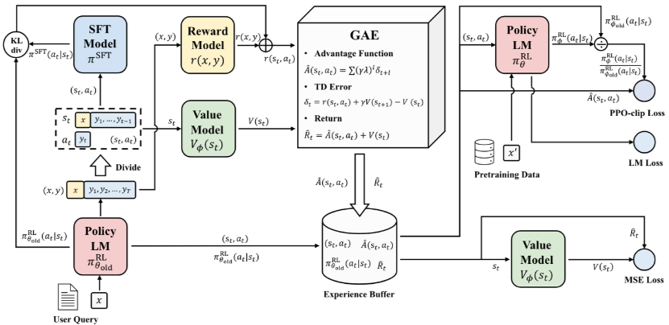

*图 13.2-1 PPO/RLHF 训练流程*

流程以一个用户查询 x 开始，旧策略模型（**Policy LM**），根据输入 x 生成响应序列 $y_1, y_2, ..., y_{t-1}$ 。将 (x, y) 分解成**状态-动作对** $(s_t, a_t)$ 。在语言模型中：

- 状态 $s_t$ = 当前上下文（如已生成的部分 token）
- 动作 $a_t$ = 下一个要生成的 token

将`用户问题+模型生成的回答 (x, y)` 输入给**奖励模型（Reward Model）**，输出一个标量奖励值 $r(x, y)$ ，表示该回答的质量（越高越好）。

**价值模型（Value Model）** 的输入是当前状态 $s_t$ ，输出 $V(s_t)$ 是估计从该状态开始未来能获得的总回报（Return） 。

**广义优势估计（GAE, Generalized Advantage Estimation）** 模块计算得到的优势 $A(s_t, a_t)$ ，以及估计返回 $\hat{R}_t$ 。

**Return**： $\hat{R}_t = \hat{A}(s_t, a_t) + V(s_t)$

**优势函数（Advantage Function）**： $\hat{A}(s_t, a_t) = \sum_l (\gamma\lambda)^l \delta_{t+l}$ ，对未来多个时间步的 TD error 加权求和， $\lambda$ 是 GAE 参数（控制偏差-方差权衡）。

**时序差分误差（TD Error，Temporal Difference Error）**： $\delta_t = r(s_t, a_t) + \gamma V(s_{t+1}) - V(s_t)$ ，衡量的是“实际回报”与“当前价值估计”之间的差距。

- $r_t$ ：在状态 $s_t$ 下执行动作 $a_t$ 后获得的**即时奖励**
- $\gamma \in [0,1]$ ：折扣因子（discount factor），通常取 0.95~1.0
- $V(s_t)$ ：价值网络对状态 $s_t$ 的估值

**经验回放缓冲区（Experience Buffer）** 用来存储每次 rollout 的数据，包括状态-动作对（ $s_t, a_t$ ）、优势函数估计值（ $\hat{A}(s_t, a_t)$ ）、估计回报（ $\hat{R}_t$ ）和旧策略下该动作的概率（ $\pi_\theta^{\text{old}}(a_t|s_t)$ ）。

**策略更新模块** Policy LM $\pi_\theta^{\text{RL}}(a_t|s_t)$ 是当前正在优化的策略模型。它接收状态 $s_t$ ，输出动作 $a_t$ 的概率分布。

**PPO-clip Loss** 是 PPO 的核心损失函数，目标是在保证策略更新稳定的前提下，最大化期望回报（即 Reward Model 给出的分数）。

$$
\mathcal{L}^{\text{CLIP}}(\theta) = \mathbb{E}_t \left[ \min\left(
r_t(\theta) \cdot \hat{A}_t,\
\text{clip}\big(r_t(\theta), 1-\epsilon, 1+\epsilon\big) \cdot \hat{A}_t
\right) \right]
$$

其中：

- $r_t(\theta) = \frac{\pi_\theta(a_t | s_t)}{\pi_{\theta_{\text{old}}}(a_t | s_t)}$ ：**新旧策略概率比**
- $\hat{A}_t$ ：GAE 计算出的**优势函数**（来自 TD Error）
- $\epsilon$ ：超参数（通常 0.1~0.2），控制更新步长
- `clip`：将比率裁剪到 $[1-\epsilon, 1+\epsilon]$ 区间

**LM Loss** 是标准的 自回归语言建模交叉熵损失，目标是防止策略在优化奖励时“忘记”如何说人话（灾难性遗忘）。

**MSE Loss** 是价值函数的学习目标，让价值网络 $V_\phi(s_t)$ **准确预测**从状态 $s_t$ 开始的**期望总回报**。

> [!NOTE]
> PPO-clip Loss 决定“往哪里走”（偏好方向），LM Loss 确保“不走偏”（语言合理），MSE Loss 提供“地图”（价值估计）。三者合在一起，才让 LLM 在偏好优化中保持基本语言能力和更新稳定性。

一个完整的训练流程应该是：

- **采样阶段**：用 $\pi_\theta^{\text{old}}$ 根据用户输入 $x$ 生成回答 $y$；用 Reward Model 给 $(x,y)$ 打分 $r(x,y)$；用 Value Model 和 GAE 计算每个 token 的优势函数 $\hat{A}(s_t, a_t)$ 和回报 $\hat{R}_t$；最后存入 Experience Buffer。
- **更新阶段**：从 Buffer 中采样 mini-batch 数据 ---> 计算 PPO-clip Loss、LM Loss、MSE Loss ---> 反向传播更新 Policy LM 和 Value Model ---> 更新后的新策略成为下一轮的 $\pi_\theta^{\text{old}}$
- **迭代循环**：重复采样 → 计算奖励与优势 → 更新策略 → 新策略采样...

[OpenAI Spinning Up](https://spinningup.openai.com/en/latest/algorithms/ppo.html) 中的 PPO 伪代码很短，容易让人低估语言模型场景里的实现复杂度。

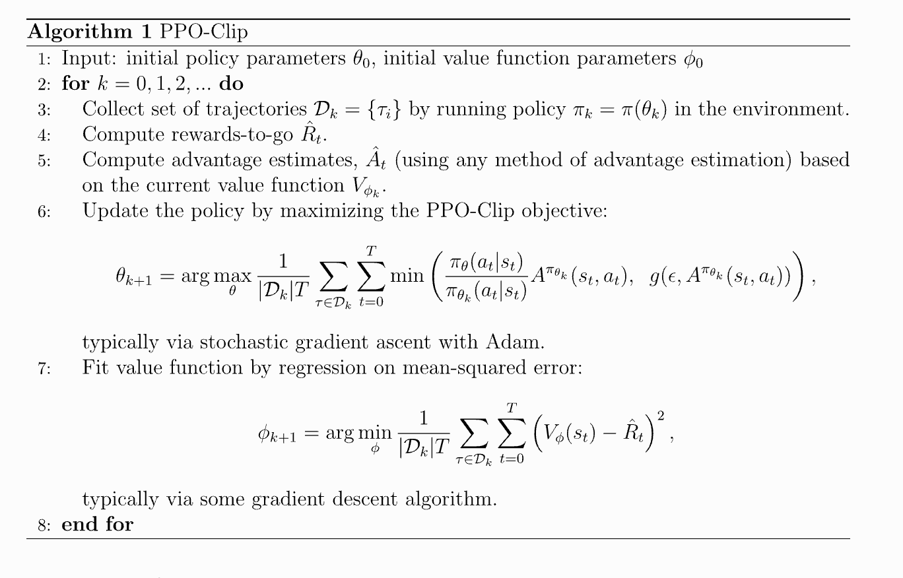

*图 13.2-2 PPO 算法伪代码*

PPO 理论简洁，实际训练却依赖许多细节：价值函数训练、优势估计、KL 控制、奖励归一化、batch 组织和采样策略都会改变结果。[37 个 PPO 实现细节](https://iclr-blog-track.github.io/2022/03/25/ppo-implementation-details/)展示了同一算法族在不同 benchmark 上会因为实现选择产生明显差异。


*图 13.2-3 PPO 实现细节对性能的影响*

[Implementation Matters in Deep Policy Gradients: A Case Study on PPO and TRPO](https://arxiv.org/abs/2005.12729) 也说明了实现细节会改变策略梯度方法的经验表现。语言模型 PPO 的工程难点集中在 rollout、reward shaping、GAE、value loss 和 KL 统计；因此，需要把代码路径拆开看。

参考 [alpaca_farm 中关于 PPO 的实现](https://github.com/tatsu-lab/alpaca_farm/blob/30717ddae735365de756ee2085191b491a71788d/src/alpaca_farm/rl/ppo_trainer.py)，该实现遵循典型的 on-policy RL 循环，实现了 PPO 算法在语言模型上的完整训练循环，包含：

- Rollout（采样）：用当前策略生成 responses
- 奖励计算与塑形（Reward Shaping）：结合任务奖励 + KL 惩罚
- 优势估计（GAE）
- 损失计算（Policy + Value Loss with Clipping）：用 PPO 损失函数优化策略（Actor）和价值网络（Critic）
- 日志记录与模型保存

**奖励塑形（Reward Shaping）：** 将稀疏的任务奖励（只在序列末尾）与密集的 KL 惩罚（每个 token）结合起来，形成可训练的 reward signal

```python
def _shape_reward(self, rewards, responses, logprobs, ref_logprobs):
    # 计算 KL 散度：用 (logp - ref_logp) 的正值部分（即新策略比参考策略更“自信”才惩罚）
    kl = torch.clamp(logprobs - ref_logprobs, min=0.0)

    # 非任务奖励 = -β * KL（β 由 self.kl_ctl 控制，可动态调整）
    non_score_rewards = -self.kl_ctl.value * kl

    # 初始化塑形奖励：先填入 KL 惩罚（每个 token 都有）
    shaped_rewards = non_score_rewards.clone()

    # 找到每个序列的最后一个非 padding token 的位置（即 EOS 或真实结尾）
    terminal_positions = (responses != self.tokenizer.pad_token_id).sum(dim=1) - 1

    # 在最后一个 token 处加上任务奖励（如数学题是否答对）
    shaped_rewards[list(range(rewards.size(0))), terminal_positions] += rewards

    return dict(shaped_rewards=shaped_rewards, non_score_rewards=non_score_rewards, kl=kl)
```

**广义优势估计（GAE）：** 用 GAE 估计每个 token 的优势函数（Advantage），替代原始奖励，大幅降低策略梯度方差。

```python
def _estimate_advantage(self, rewards, values):
    if self.args.whiten_rewards:
        rewards = torch_ops.whiten(rewards, shift_mean=False)  # 奖励标准化（可选）

    lastgaelam = 0
    advantages_reversed = []
    gen_length = self.args.response_len  # 生成长度（如 128）

    # 从后往前计算 GAE（反向遍历 token）
    for t in reversed(range(gen_length)):
        nextvalues = values[:, t + 1] if t < gen_length - 1 else 0.0
        # TD error: δ_t = r_t + γ * V(s_{t+1}) - V(s_t)
        delta = rewards[:, t] + self.args.gamma * nextvalues - values[:, t]
        # GAE: A_t = δ_t + γλ A_{t+1}
        lastgaelam = delta + self.args.gamma * self.args.lam * lastgaelam
        advantages_reversed.append(lastgaelam)

    advantages = torch.stack(advantages_reversed[::-1], dim=1)  # 反转回正常顺序
    returns = advantages + values  # Q(s,a) ≈ A(s,a) + V(s)

    # 优势函数标准化（减均值、除标准差）→ 降低方差
    advantages = torch_ops.whiten(advantages, shift_mean=True)

    return dict(returns=returns, advantages=advantages)
```

**rollout（采样轨迹）：** 完成一次完整的 采样 → 评估 → 奖励计算 → 优势估计 流程，为后续 PPO 更新准备数据

```python
@torch.inference_mode()
def rollout(self, queries_data):
    self.policy.eval()
    unwrapped_policy = self.accelerator.unwrap_model(self.policy, keep_fp32_wrapper=True)
    self.ref_policy.eval()
    self.reward_model.eval()

    rollouts = []
    for batch in tqdm.tqdm(queries_data, desc="rollout"):
        # 1. 从当前策略生成 responses
        queries, masks = batch['queries'], batch['query_attn_masks']
        responses = unwrapped_policy.respond(queries, masks, temperature=...)  # 生成

        # 2. 用当前策略计算 logprobs 和 values（critic 输出）
        policy_outputs = self.policy(queries, masks, responses, ...)  # forward

        # 3. 用参考策略（SFT 模型）计算 ref_logprobs（用于 KL）
        ref_outputs = self.ref_policy(queries, masks, responses, ...)

        # 4. 将 response 转为文本，再用 reward tokenizer 重新 tokenize
        #    （因为 policy 和 reward model 的 tokenizer 可能不同）
        text_queries = decode(queries); text_responses = decode(responses)
        text_sequences = [q + r for q, r in zip(text_queries, text_responses)]
        sequences = reward_tokenizer(text_sequences, ...)  # 重新 tokenize

        # 5. 用 reward model 计算任务奖励
        reward_outputs = self.reward_model(**sequences)
        reward_outputs = self.post_reward(reward_outputs, responses)  # 处理未正常结束的序列

        # 6. 奖励塑形：加入 KL 惩罚
        shaped = self._shape_reward(rewards=reward_outputs['rewards'], ...)

        # 7. 保存所有数据到 rollouts
        rollouts_batch.update(policy_outputs, ref_outputs, reward_outputs, shaped)
        rollouts.append(rollouts_batch.cpu())

    # 合并所有 batch
    rollouts = common.merge_dict(rollouts, merge_fn=torch.cat)

    # 8. 统一计算 GAE（用整个 rollout 数据集，更稳定）
    advantages = self._estimate_advantage(
        rewards=rollouts["shaped_rewards"].to(device),
        values=rollouts["values"].to(device),
    )

    return {**rollouts, **advantages}
```

**PPO 损失计算：** 使用裁剪机制防止策略更新过大

```python
def compute_loss(self, rollouts):
    # 提取旧策略数据（from rollout）
    values, old_logprob, returns, advantages, ... = rollouts

    # 用当前策略重新计算 logprobs 和 values
    outputs = self.policy(queries, masks, responses, ...)
    vpred = outputs["values"]      # 新的 value 预测
    logprob = outputs["logprobs"]  # 新的 log prob

    # --- Value Loss (Critic) ---
    # 裁剪 value 预测（类似 PPO 裁剪）
    vpredclipped = torch.clamp(vpred, values ± cliprange_value)
    vf_losses1 = (vpred - returns) ** 2
    vf_losses2 = (vpredclipped - returns) ** 2
    vf_loss = 0.5 * max(vf_losses1, vf_losses2).mean()  # PPO-style value loss

    # --- Policy Loss (Actor) ---
    ratio = exp(logprob - old_logprob)  # 新旧策略概率比
    pg_losses = -advantages * ratio
    pg_losses2 = -advantages * clip(ratio, 1-ε, 1+ε)
    pg_loss = max(pg_losses, pg_losses2).mean()  # PPO 裁剪目标

    # 总损失 = 策略损失 + vf_coef * 价值损失
    loss = pg_loss + self.args.vf_coef * vf_loss

    # 记录统计量
    approxkl = 0.5 * (logprob - old_logprob)^2 的均值
    entropy = outputs["entropies"].mean()

    return loss, stats
```

训练跑起来之后，怎样判断这套流程是否健康？图 13.2-4 给出一次 7B 规模 RLHF 训练的三条监控曲线。

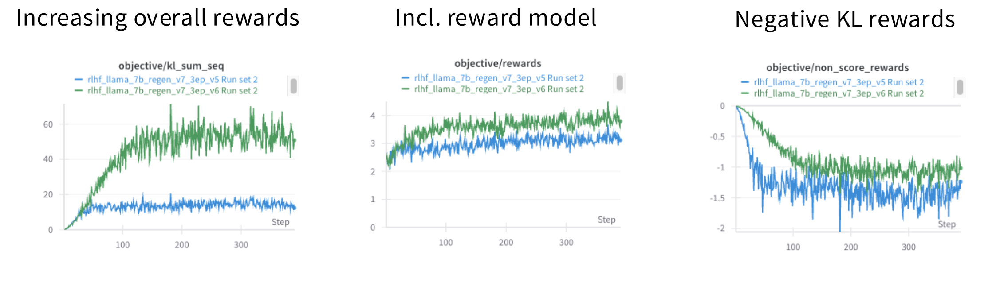

*图 13.2-4 PPO 训练过程曲线*

三张子图分别对应 `alpaca_farm` 记录的三个 `objective/*` 指标，横轴都是训练步数。

- 左图 `objective/kl_sum_seq`：把每条序列上逐 token 的 KL 求和，再对 batch 取平均，衡量当前策略整体偏离参考策略多远。曲线先快速上升、随后进入平台，说明策略在持续改变，但偏离幅度被 KL 惩罚稳住。
- 中图 `objective/rewards`：奖励模型直接给出的任务奖励，不含 KL 惩罚。它反映模型在核心任务上的表现，例如回答准确性和指令遵循能力，整条曲线应当稳步上升。
- 右图 `objective/non_score_rewards`：每条序列上 $-\beta \cdot \mathrm{KL}$ 的求和，取值为负。它下探到某个水平后趋稳，对应“允许一定偏离、但限制幅度”的近端约束。

把任务奖励和 KL 惩罚相加，就是训练真正优化的塑形奖励，`alpaca_farm` 用另一个指标 `objective/shaped_rewards` 单独记录。三条曲线同时健康时，模型在奖励模型引导下逐步生成更好的回复，同时靠 KL 惩罚避免偏离初始行为太远。

### 13.2.2 为什么还需要新的强化学习算法？

**1. PPO 的工程成本。**
PPO 是语言模型对齐中常见的在线强化学习方法，但它把多条链路绑在一起：rollout 采样、reward shaping、GAE / advantage 估计、KL 控制、value loss 和 policy loss 都会影响训练稳定性。

- **实现复杂 (complicated implementation)**：PPO 的外层流程看起来短，真实训练需要维护采样策略、旧策略 log-probability、奖励标准化、裁剪目标和多类监控指标。
- **价值模型 (Value model) 的负担**：PPO 需要额外的 value model 估计状态价值，用来降低 advantage 方差。它会带来额外显存、计算和调参成本，也可能成为训练不稳定来源。

> [!WARNING]
> PPO 虽然强大且有效，但工程复杂度高、资源消耗大、调参困难。尤其是在低资源或追求高效开发的场景下，它显得不够轻便。

**2. DPO 的适用边界。**

DPO（Direct Preference Optimization）把成对偏好数据直接写成监督式损失，省掉 reward model 和在线 rollout。RLVR 场景里，它的限制主要来自反馈形式：

- **数据形式不匹配 (Data not inherently pairwise)**：DPO 的核心思想是基于**成对比较（pairwise comparisons）** 数据。给定一个提示（prompt），训练数据需要两个不同回复（response A 和 response B），并标注哪个更好。

  可验证奖励任务通常只有单个序列和客观分数，例如数学题答对得 1 分、答错得 0 分。这类**标量奖励信号**无法直接用于 DPO。

- **反馈形式不匹配**：DPO 常在固定偏好数据上训练，也可以通过反复采样和更新做成迭代流程。更关键的限制是它的标准形式服务 pairwise Bradley-Terry 偏好比较；数学、代码和环境任务更常给出单条 rollout 的标量奖励或执行结果。

> [!WARNING]
> DPO 适合把成对偏好数据写成简洁损失；RLVR 更需要能直接消费标量奖励、执行反馈和在线 rollout 的策略优化方法。

## 13.3 GRPO 与 Dr. GRPO

GRPO 与 Dr. GRPO 是当前 RLVR 的两大算法骨架。本节从 GRPO 的目标与实现出发，讲清它相对于 PPO 的简化，再讨论 group z-score 引入的 std / length 两类偏置和 Dr. GRPO 的修正。

### 13.3.1 GRPO：去掉了价值函数的 PPO

**GRPO (Group Relative Policy Optimization)** 最早在 [DeepSeekMath](https://arxiv.org/pdf/2402.03300) 中提出，随后成为 [DeepSeek-R1](https://arxiv.org/abs/2501.12948) 的核心 RL 算法之一。

它保留 PPO 的概率比、裁剪和 KL 约束，去掉 value model，并用同一问题内多条回复的 reward z-score 估计 advantage。

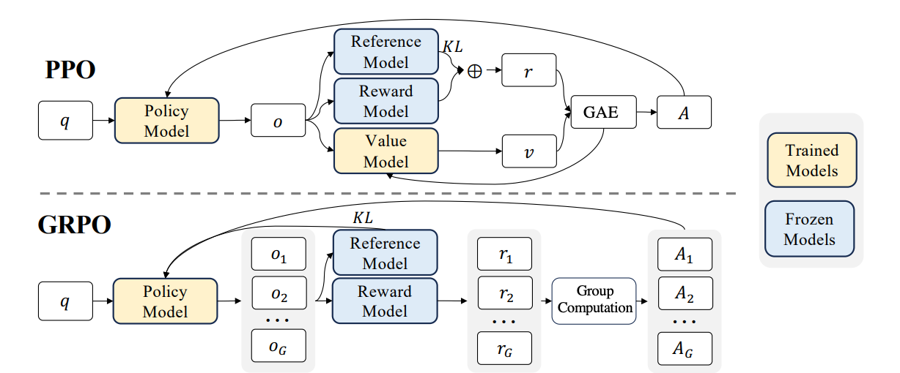

*图 13.3-1 PPO 与 GRPO 的对比*

> [!NOTE]
> 可以把 GRPO 先理解为保留 PPO 的 clipped policy update 和 KL 约束，同时用组内 reward 标准化替代 value model 的 advantage 估计。

GRPO 可以先从 PPO 的工程部件读起：rollout、概率比和 KL 约束都还在。核心改动是去掉 value function / advantage computation，并把同一问题多条回复的奖励做组内标准化。在线训练时 rollout 之后立即更新，相当于把 group-normalized rewards 直接喂给策略梯度。

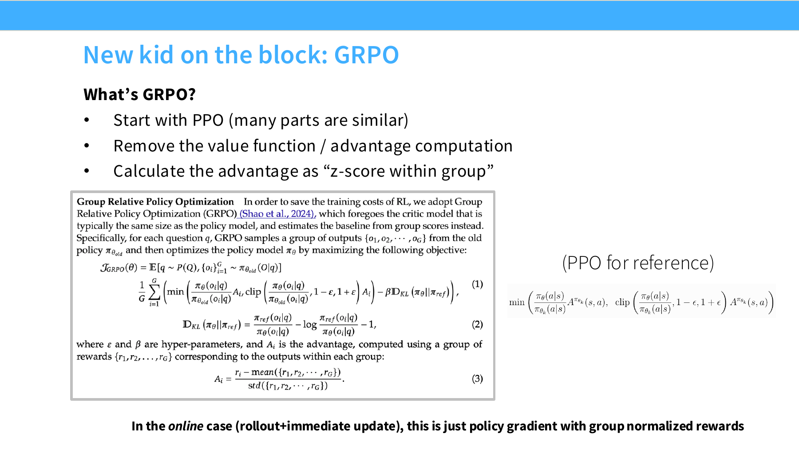

*图 13.3-2 GRPO 的核心变化*

#### GRPO 的目标函数

$$
\begin{aligned}
\mathcal{J}_{\text{GRPO}}(\theta)
= \mathbb{E} \bigg[
& q \sim P(Q),\ \{o_i\}_{i=1}^G \sim \pi_{\theta_{\text{old}}}(O|q)
\bigg] \frac{1}{G} \sum_{i=1}^{G} \bigg(
\min \bigg(
\frac{\pi_\theta(o_i|q)}{\pi_{\theta_{\text{old}}}(o_i|q)} A_i, \\
& \text{clip}\left(
\frac{\pi_\theta(o_i|q)}{\pi_{\theta_{\text{old}}}(o_i|q)},
1-\epsilon,
1+\epsilon
\right) A_i
\bigg)
- \beta D_{\mathrm{KL}} \left( \pi_\theta \| \pi_{\text{ref}} \right)
\bigg)
\end{aligned}
$$

- `min(...)` 部分：是 PPO 的经典裁剪目标函数，用于更新策略 $\pi_\theta$ 。
    - $\frac{\pi_\theta(o_i|q)}{\pi_{\theta_{\text{old}}}(o_i|q)}$ 是新旧策略的概率比。
    - $A_i$ 是第 $i$ 个输出 $o_i$ 的“优势”，这是 GRPO 最大的创新点。
    - `clip(...)` 是 PPO 的裁剪机制，防止策略更新过大。
- $-\beta D_{\mathrm{KL}}(\cdot)$ 部分：这是 KL 散度惩罚项，用于防止新策略 $\pi_\theta$ 偏离参考策略 $\pi_{\text{ref}}$ 太远，保证生成结果的稳定性。
    - $\beta$ 是控制 KL 惩罚强度的超参数。

PPO 的目标函数：

$$
\min \left( \frac{\pi_\theta(a|s)}{\pi_{\theta_k}(a|s)} A^{\pi_{\theta_k}}(s,a), \text{ clip} \left( \frac{\pi_\theta(a|s)}{\pi_{\theta_k}(a|s)}, 1-\epsilon, 1+\epsilon \right) A^{\pi_{\theta_k}}(s,a) \right)
$$

GRPO 与 PPO 的目标函数结构非常相似，都包含概率比和裁剪。两者的主要差异在 `A` 的来源：

- **PPO**: `A` 是通过价值网络 `V(s)` 和 GAE 计算出来的，这是一个复杂且资源密集的过程。
- **GRPO**: `A` 是通过组内 z-score 计算出来的，这是一个简单、快速、无需额外模型的过程。

#### KL 散度的计算

$$
\hat{D}_{\mathrm{KL}} \left( \pi_\theta \| \pi_{\text{ref}} \right) = \frac{\pi_{\text{ref}}(o_i|q)}{\pi_\theta(o_i|q)} - \log \frac{\pi_{\text{ref}}(o_i|q)}{\pi_\theta(o_i|q)} - 1
$$

这是 Schulman 提出的 k3 无偏单样本估计器，在 $o_i \sim \pi_\theta$ 上取期望后等于 $D_{\mathrm{KL}} \left( \pi_\theta \| \pi_{\text{ref}} \right)$ 本身。DeepSeekMath 论文中同样把它写进 GRPO 目标，并在实现里直接拿它当 KL 惩罚项使用，不必再对词表求 $\sum_a \pi_\theta \log(\pi_\theta/\pi_{\text{ref}})$。

#### 组内 z-score 优势

$$
A_i = \frac{r_i - \mathrm{mean}(\{r_1, r_2, \cdots, r_G\})}{\mathrm{std}(\{r_1, r_2, \cdots, r_G\})}
$$

这是 GRPO 替代 GAE 的关键步骤：同一个问题生成 $G$ 条回复，用组内相对分数给每条回复分配 advantage。

**如何计算？**
- 对于每一个问题 $q$ ，从旧策略 $\pi_{\text{old}}$ 中**采样一组（G 个）不同的回复** $\{o_1, o_2, \dots, o_G\}$ 。
- 用奖励模型或可验证规则，为这 G 个回复**分别打分**，得到一组奖励 $\{r_1, r_2, ..., r_G\}$ 。
- 计算这组奖励的**均值（mean）和标准差（std）**。
- 将每个回复 $o_i$ 的奖励 $r_i$ 减去均值，再除以标准差，得到它的 $A_i$ 。

**为什么叫 “z-score”？**

在统计学中，z-score 表示一个数据点距离平均值有多少个标准差。这里， $A_i$ 表示回复 $o_i$ 的奖励在本组中的“相对优劣程度”。如果 $A_i > 0$ ，说明这个回复比组内平均水平好；如果 $A_i < 0$ ，则说明它比平均水平差。

**为什么有效？**

- **简单高效**：不需要训练额外的价值网络，也不需要复杂的 GAE 计算。
- **自归一化**：通过组内比较，自动消除了不同问题之间奖励尺度不一致的问题。例如，一个数学题可能最高得 10 分，另一个可能最高得 5 分，但它们在同一组内比较时，z-score 能公平地反映相对好坏。
- **适用于可验证奖励**：对于一个数学题，可以让模型生成多个答案，然后用程序自动判断每个答案是否正确（得分为 1 或 0），再用 z-score 区分哪个答案“更好”。

> [!NOTE]
> 在线 rollout 之后立刻更新策略时，GRPO 可以理解为用组内标准化奖励构造 advantage 的策略梯度方法。

#### 代码解读：一个极简的 GRPO 实现

GRPO 的实现不需要复杂的 GAE 计算。[nano-aha-moment](https://github.com/McGill-NLP/nano-aha-moment/blob/main/nano_r1_script.py) 中的 `compute_pg_loss` 是一个典型的 GRPO 损失计算函数；可以用来观察 policy loss、KL penalty 和 advantage 的对齐方式：

```python
def compute_pg_loss(
    policy_model: Union[DeepSpeedEngine, PreTrainedModel], # 当前要训练的语言模型
    batch: Dict[str, torch.Tensor], # 一个包含训练数据的字典
    total_response_len: torch.Tensor, # 一个包含训练数据的字典
    TEMPERATURE: float, # 生成时的温度参数（影响 log-prob 计算）
    KL_COEFFICIENT: float, # 控制 KL 惩罚强度的超参数
) -> Tuple[torch.Tensor, Dict[str, float]]:
    """
    Compute the policy gradient loss with KL penalty between policy and reference models.

    This function:
    1. Calculates KL divergence penalty between the models
    2. Computes policy gradient loss using advantages
    3. Combines the losses with KL coefficient

    Args:
        policy_model: The model being trained
        batch: Dictionary containing:
            - input_ids: Tensor of shape [batch_size, seq_len]
            - attention_mask: Tensor of shape [batch_size, seq_len]
            - labels: Tensor of shape [batch_size, seq_len] with -100 for ignored positions
            - advantages: Tensor of shape [batch_size, seq_len]
            - ref_log_probs: Tensor of shape [batch_size, seq_len-1]
        total_response_len: Total number of valid tokens in the batch. This is a scalar tensor.

    Returns:
        Tuple containing:
            - loss: Combined policy gradient and KL penalty loss (scalar tensor)
            - metrics: Dictionary with detailed loss components:
                - policy_loss: Pure policy gradient loss
                - kl_penalty: KL divergence penalty
                - entropy: Policy entropy
    """

    # 1. 从 batch 中提取关键张量
    input_ids = batch["input_ids"]  # [batch_size, seq_len]，完整序列（prompt + response）
    attention_mask = batch["attention_mask"]  # [batch_size, seq_len]，指示有效 token
    labels = batch["labels"]  # [batch_size, seq_len]，通常与 input_ids 相同或右移一位
    labels_mask = batch["labels_mask"]  # [batch_size, seq_len]，1 表示该位置是 response token，0 表示 prompt 或 padding
    advantages = batch["advantages"]  # [batch_size, seq_len]，每个 token 的“优势”值（来自组内归一化）
    ref_logps = batch["ref_log_probs"]  # [batch_size, seq_len-1]，参考模型在 response token 上的 log-prob（长度比 input_ids 少 1）

    # 2. 构建模型输入
    model_inputs = {
        "input_ids": input_ids,
        "attention_mask": attention_mask,
        "labels": labels,
        "labels_mask": labels_mask,
    }

    # 3. 计算当前策略的 token log-probabilities
    logps = compute_token_log_probs(policy_model, model_inputs, TEMPERATURE)  # 让 policy_model 对 input_ids 做前向传播，得到每个 token 的 log-probability，输出形状是 [batch_size, seq_len-1]，因为模型预测的是 input_ids[1:]

    # 4. 对齐 mask 并计算 KL 惩罚项
    labels_mask = labels_mask[..., 1:].to(logps.dtype)  # 将 labels_mask 也右移一位，与 logps 对齐，只保留 response token 的 mask，输出形状是 [batch_size, seq_len-1]，

    # 直接计算 KL 需要对整个词汇表求和（sum(p * log(p/q))），计算量极大。这里用的是 Schulman k3 无偏单样本估计器（exp(ref_logratio) - 1 - ref_logratio），它的期望等于 D_KL(π_θ || π_ref)，却只依赖于 token 级的 log-prob，无需展开词表维度。
    ref_logratio = ref_logps - logps
    kl_penalty = torch.exp(ref_logratio) - 1 - ref_logratio  # [batch_size, seq_len-1]
    kl_penalty = kl_penalty * labels_mask  # [batch_size, seq_len-1]，只对 response token 计算 KL 惩罚，忽略 prompt

    # 5. 计算辅助统计量（不参与梯度）
    with torch.no_grad():
        entropy = -logps.sum() / labels_mask.sum()  # scalar
        zero_advantages = close_to_zero(advantages[..., 1:], labels_mask)  # scalar

    # 6. 计算策略梯度损失
    policy_loss = -logps * advantages[..., 1:]  # [batch_size, seq_len-1]，advantages[..., 1:]取 advantage 从第 2 个 token 开始，与 logps 对齐
    policy_loss = policy_loss * labels_mask  # [batch_size, seq_len-1]

    # 7. 组合总损失并归一化
    loss = (policy_loss + KL_COEFFICIENT * kl_penalty).sum() / total_response_len  # 将策略损失和 KL 惩罚加权求和，除以 total_response_len，将总损失归一化为每个有效 token 的平均损失，使 loss 值在不同 batch size 下可比。

    # 8. 构建返回的指标字典
    metrics = {
        "policy_loss": policy_loss.sum().item() / total_response_len.item(),
        "kl_penalty": kl_penalty.sum().item() / total_response_len.item(),
        "entropy": entropy.item() / total_response_len.item(),
        "zero_advantages_ratio": zero_advantages.item() / total_response_len.item(),
    }

    return loss, metrics

```

GRPO 的 advantage 计算核心是组内 z-score 归一化。实现上通常会在标准差分母中加入很小的常数，例如 `1e-4`，避免同组奖励全相同时出现除零。

```python
# 1. 数据校验与分组

assert len(all_generations) == len(all_finish_reasons) # all_generations 是模型生成的所有回复，all_finish_reasons 是每个回复的结束原因（如 "stop" 或 "length"），samples 是原始输入样本
assert len(all_generations) == len(samples) * GENERATIONS_PER_SAMPLE # GENERATIONS_PER_SAMPLE 是一个超参数，表示对每个输入样本 sample，要生成多少个不同的回复（例如 3 个）。所以总回复数 = 样本数 × 每样本生成数。

# 将所有生成的回复按样本分组。例如，如果 GENERATIONS_PER_SAMPLE=3，那么 groups = [[0,1,2], [3,4,5], ...]，其中 [0,1,2] 对应第一个样本生成的三个回复
groups = [
    list(range(i, i + GENERATIONS_PER_SAMPLE)) for i in range(0, len(all_generations), GENERATIONS_PER_SAMPLE)
]

# 2. 初始化存储变量

all_query_token_ids, all_responses_token_ids, all_samples, all_rewards = [], [], [], []
stats = { "response_lengths": [], "rewards": [], "non_stop_rate": [], }

# 3. 核心循环：对每个样本及其生成的回复组进行处理
# 对于当前样本 sample，获取它对应的 group_indices（如 [0,1,2]），然后提取出该组的结束原因、token ID 和解码后的文本
for sample, group_indices in zip(samples, groups):
    finish_reasons = [all_finish_reasons[i] for i in group_indices]
    response_token_ids = [all_generations[i] for i in group_indices]
    responses = tokenizer.batch_decode(response_token_ids, skip_special_tokens=False)

    # 对组内的每一个回复 resp，调用 compute_reward 函数计算其奖励分数。compute_reward 是你自定义的函数，比如判断数学题是否答对、代码是否能运行等
    rewards_and_metrics = [compute_reward(resp, sample, EOS_TOKEN) for resp in responses]
    rewards, reward_metrics = zip(*rewards_and_metrics) # zip(*rewards_and_metrics) 将 (reward, metrics) 元组解包成两个列表：rewards 和 reward_metrics

    # 4. 关键步骤：计算组内归一化的“优势” (Advantages)
    rewards = np.array(rewards)
    advantages = (rewards - rewards.mean()) / (rewards.std() + 1e-4) # rewards - rewards.mean()：计算每个回复的奖励相对于组内平均值的偏差; 除以组内标准差，得到 z-score; 当组内所有奖励都相同时（标准差为 0），直接除以 0 会导致 NaN 错误。加上一个极小的常数 1e-4 可以避免这种情况，保证计算稳定

    # 将每个回复的标量优势值 resp_adv 扩展为一个序列，使其长度与回复的 token 数相同,目的是为了让优势信号可以与每个 token 的 log-probability 对齐，从而计算策略梯度损失
    per_token_advantages = [[adv] * len(resp) for adv, resp in zip(advantages, response_token_ids)]

    # 5. 收集最终数据并返回
    # 将当前组的数据（奖励、样本、token ID）追加到全局列表中，以便后续统一处理
    all_query_token_ids.extend([sample["input_ids"]] * GENERATIONS_PER_SAMPLE)
    all_responses_token_ids.extend(response_token_ids)
    all_advantages.extend(per_token_advantages)

    # 记录一些有用的统计信息，如平均奖励、未正常结束的比例、回复长度等
    stats["rewards"].extend(rewards)
    stats["non_stop_rate"].extend([fr != "stop" for fr in finish_reasons])
    stats["response_lengths"].extend([len(ids) for ids in response_token_ids])

    for rm in reward_metrics:
        for k, v in rm.items():
            stats.setdefault(f"reward_metrics/{k}", []).append(v)

# 将所有数据打包成一个字典 episodes 返回，供后续的 compute_pg_loss 函数使用
episodes = {
        "all_query_token_ids": all_query_token_ids,
        "all_response_token_ids": all_responses_token_ids,
        "all_advantages": all_advantages,
    }

    return episodes, stats
```

#### GRPO 的实际效果

图 13.3-3 给出 GRPO 在两个数学推理基准测试上的实验结果快照。

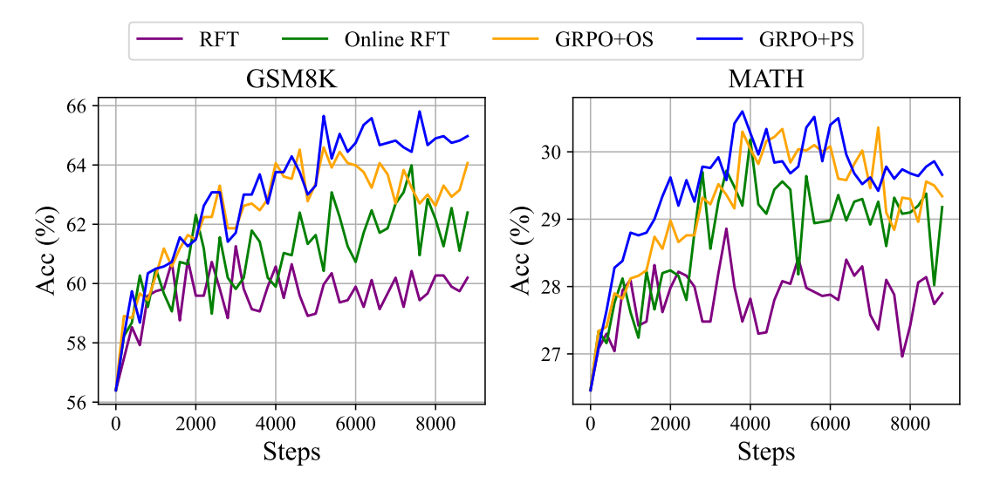

*图 13.3-3 GRPO 在数学推理基准上的表现*

左图 GSM8K 是小学数学应用题数据集，右图 MATH 是更难的高中数学竞赛题数据集。纵轴是准确率，横轴是训练步数。图中比较四类训练方式：

- RFT (Rejection Sampling Fine-tuning)：从 SFT 模型采样若干输出，用规则筛掉答错的，再在剩下的正确输出上继续微调。正确样本被等权强化，错误样本直接丢弃、不产生负梯度。
- Online RFT：把采样源从固定的 SFT 模型换成当前策略，边训练边刷新采样分布，正确样本仍然等权强化。
- GRPO+OS (GRPO + Outcome Supervision)：只在输出末尾给一次奖励，组内 z-score 把这个末端奖励摊到该回复的所有 token 上（DeepSeekMath §4.1.2）。
- GRPO+PS (GRPO + Process Supervision)：用过程奖励模型对每个推理步骤末尾打分，token 的 advantage 由其之后所有步骤奖励的归一化和累加得到（DeepSeekMath §4.1.3）。

这些曲线支持四个经验判断：

- 两条 GRPO 曲线都高于 RFT。差别在于 RFT 只把正确样本等权强化，GRPO 还按组内相对分数缩放梯度，并对错误回复给出负梯度。
- Online RFT 高于离线 RFT，说明采样源跟着当前策略走本身就有收益。
- 过程监督在部分区间带来额外收益，但它要求更细的标注或验证器，扩展成本也更高。
- 曲线平滑度来自组内归一化和在线采样的共同作用；换到其他任务时仍要重新检查 reward 分布、采样温度和 KL。

### 13.3.2 GRPO 的两类偏差：问题难度与响应长度

GRPO 的简化带来明显工程收益，也在目标函数里留下两个需要单独处理的偏差。Dr. GRPO（[Liu et al. 2025](https://arxiv.org/abs/2503.20783)）§3.1 把它们分别称为 question-level difficulty bias 和 response-level length bias，来源正是 advantage 的两个分母。

同一篇论文还检查了 R1-Zero 的“aha moment 由 RL 涌现”叙事。§2.3 标题为 *"Aha Moment Already Appears in Base Models Including DeepSeek-V3-Base"*，发现 DeepSeek-V3-Base 在 RL 训练之前就已经写出 self-reflection 关键词；§2.2 进一步指出 Qwen2.5 / Qwen2.5-Math base 模型在去掉 chat template 之后也能恢复强数学能力。两条证据合起来说明，被报告成“RL 涌现”的一部分行为来自 base 模型自身属性与提示模板的组合。

#### 问题难度偏差：除以组内标准差

先看 z-score 的分母。policy gradient 允许从奖励里减去任意只依赖状态的量而保持梯度无偏，组内均值近似满足这个条件；组内标准差不满足，它由同组 rollouts 算出、随当前策略输出变化，所以整条 z-score 不再是严格无偏的基线减法。

偏差在难度极端的题目上最明显。当某个 prompt 的 $G$ 条回复几乎全错（题目太难）或几乎全对（题目太易）时，组内标准差很小，除法把 advantage 放大，模型反而在这类题目上拿到过强的更新信号。Dr. GRPO 的做法是删掉除以 std 这一项，只保留减去组内均值的 baseline：代价是丢掉标准差提供的尺度缩放，收益是消除难度造成的权重失真，得到的更新形式接近 REINFORCE with leave-one-out baseline。

#### 响应长度偏差：除以 $|o_i|$

第二个偏差来自 token 级更新权重。GRPO 目标函数中，单个响应 $o_i$ 在时间步 $t$ 的梯度更新会涉及：

$$
\dots \times \frac{\hat{A}_{i,t}}{|o_i|} \dots
$$

其中：

- $|o_i|$ 表示响应 $o_i$ 的长度（token 数量）。
- $\hat{A}_{i,t}$ 是优势函数，计算方式为 $\hat{A}_{i,t} = \frac{R(q, o_i) - \text{mean}(\{R(q, o_1), \dots, R(q, o_G)\})}{\text{std}(\{R(q, o_1), \dots, R(q, o_G)\})}$ ，其中 $R(q, o_i)$ 是响应 $o_i$ 的奖励。

当 $\hat{A}_{i,t} > 0$ 时（回复正确），较短的回答得到更大的 token 级正更新，策略被推向更简短的正确答案。当 $\hat{A}_{i,t} < 0$ 时（回复错误），较长的回答把负 advantage 摊薄到更多 token 上，单个 token 承受的惩罚变小，训练曲线上就出现“越错越长”：错误的数学证明写得越长，扣分越轻。

Dr. GRPO 对应的实现改动很小：在 `masked_mean` 里把 `mask.sum(axis=dim)` 换成常量分母，论文写作 "replace the mask.sum(axis=dim) with a constant value (e.g., generation budget)"，代码里取 `MAX_TOKENS`。单条响应的 token 数从此不再进入梯度。

#### 两个改动合起来的效果

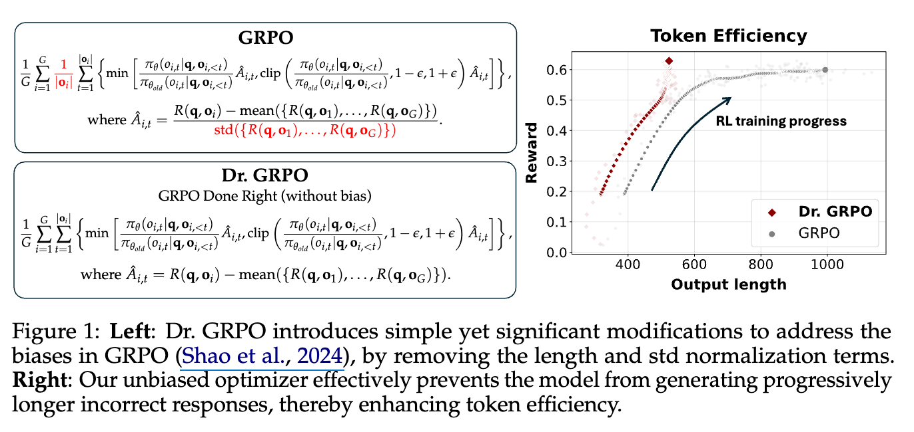

*图 13.3-4 Dr. GRPO 与标准 GRPO 的对比*

图 13.3-4 左侧把两条目标函数并排写出。GRPO 的 $\frac{1}{|o_i|}$ 和 $\mathrm{std}(\{R(q, o_1), \dots, R(q, o_G)\})$ 用红色标出，Dr. GRPO 把这两项直接删掉，advantage 退化成 $R(q, o_i) - \mathrm{mean}(\{R(q, o_1), \dots, R(q, o_G)\})$ 。右侧散点图横轴是 output length、纵轴是 reward，每个点是训练过程中的一个检查点，箭头方向是训练推进方向。两条轨迹最终都到达 0.6 附近的 reward，但 Dr. GRPO 的终点落在约 500 token，GRPO 的终点在约 1000 token，也就是同样的 reward 花掉一半的 token。

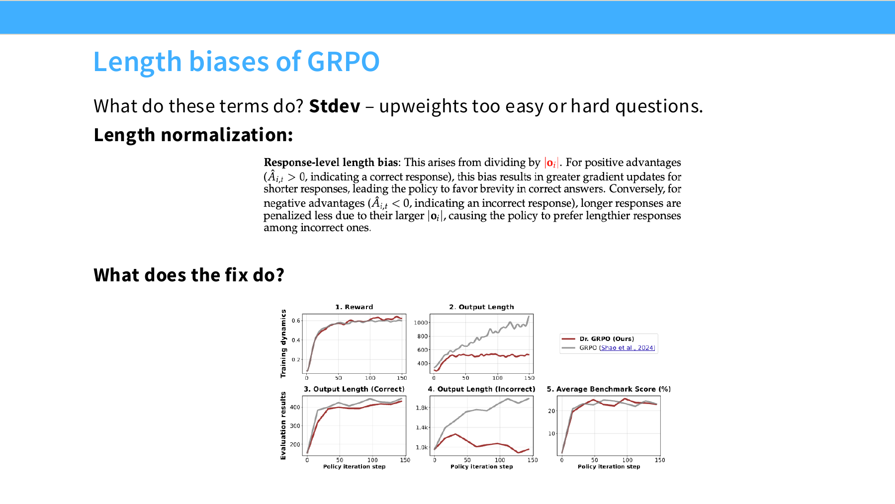

*图 13.3-5 GRPO 的长度与难度权重偏差*

图 13.3-5 下方的五张子图按 policy iteration step 展开训练与评测指标，红色是 Dr. GRPO，灰色是 GRPO。子图 1（Reward）和子图 5（Average Benchmark Score）上两条曲线基本重合，说明去掉两个归一化项没有牺牲任务表现。差别集中在长度：子图 2（Output Length）里 GRPO 一路涨过 1000 token，Dr. GRPO 稳定在 500 token 附近；子图 3（正确回复的长度）两者接近，子图 4（错误回复的长度）里 GRPO 涨到 1.8k token，Dr. GRPO 压在 1.0k 附近。长度膨胀主要发生在错误回复上，正是长度归一化削弱负 advantage 的直接后果。

### 13.3.3 训练中如何排查这两类偏差

两类偏差在训练日志上留下的痕迹不同，排查时可以分开看。

- 输出长度持续上涨，且增量主要来自答错的回复：优先怀疑长度归一化。把 output length 按正确 / 错误分开统计，就是图 13.3-5 中子图 3 与子图 4 的拆法。
- 组内奖励完全一致的 prompt 占比升高：这类样本分子为 0，整组不产生梯度，rollout 白跑，代码里的 `1e-4` 只保证不出 NaN。真正被放大的是“接近一致”的组，例如 8 条里 7 对 1 错，标准差很小，那一条异常回复的 advantage 会被除到远超正常范围。按 group 统计 reward 方差，可以直接定位这些样本。
- 长度和 KL 同时快速上升：这时长度增长未必来自算法偏差，也可能是 format reward 或 verifier 被绕过。需要抽样读 rollout，确认奖励是不是被格式或表述方式套走。

这三项检查分别落在 reward shape、normalization 和 verifier 三个层面，而 GRPO 的组内归一化只处理其中的 normalization 一层。

## 13.4 案例研究

本节用三个公开模型案例理解 RLVR 的工程形态：

- DeepSeek R1：展示纯 RL、冷启动数据和蒸馏路线。
- Kimi K1.5：展示长 CoT 数据管理、参考策略 RL 和长度控制。
- Qwen 3：展示 thinking budget、模式融合和 agentic coding 后训练。

### 13.4.1 R1-Zero：纯 GRPO 起点

[DeepSeek R1](https://arxiv.org/pdf/2501.12948) 把规则奖励 RL、长 CoT 和蒸馏同时推到公开视野中。R1 系列分两条平行路径：R1-Zero 是纯 RL 起点（验证规则奖励驱动 RL 在大模型上的可学性；该团队在 DeepSeekMath 中提出 GRPO，所以 R1 系列常被一并阅读），R1 在 R1-Zero 之上加入冷启动 SFT + 多阶段 RL（验证可发布质量）。R1 蒸馏把这两条路径产出的轨迹迁回非推理学生模型。

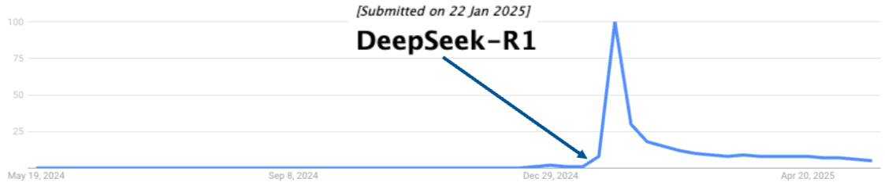

*图 13.4-1 DeepSeek R1 引发的关注*

R1 案例要点可以分成三条线：

- 技术报告给出了与同期强推理模型的基准对比。
- RL 训练方案相对简洁，突出规则奖励和 GRPO 的作用，并把 MCTS/PRM 等复杂方案留给后续消融。
- SFT 和 distillation 展示了推理轨迹如何进入可读模型与学生模型。

R1 系列沿用了 DeepSeekMath 论文中的 GRPO 思路，算法本身与 §13.3 讲过的一致，效果对比见图 13.3-3。R1 的新内容集中在把这套算法接到规则奖励、冷启动数据和蒸馏流程上。

DeepSeek R1 系列至少说明了一件事：在可验证任务上，规则奖励驱动的强化学习可以成为后训练中的强信号来源。

#### R1-Zero：纯粹的 RL

- **设置**：直接在 DeepSeek-V3-Base 上运行 GRPO。
- **准确性奖励**：答案是否正确，由规则匹配或编译器验证。
- **格式奖励**：强制模型使用 `<think>` 和 `</think>` 标签包裹思维过程。
- **数据**：未公开。

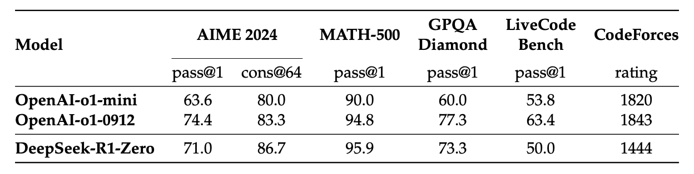

*图 13.4-2 DeepSeek-R1-Zero 与 OpenAI o1 的推理基准对比*

> [!NOTE]
> 图 13.4-2 是技术报告中的实验快照，适合用来观察规则奖励 RL 在可验证推理任务上的效果。跨模型对比的结论由评测设置、提示模板、采样参数和模型版本共同限定。

DeepSeek-R1-Zero 的一个代表性现象是 **Aha Moment（顿悟时刻）**：训练过程中生成轨迹开始出现自我检查和重新尝试，例如发现前一步计算不可靠后改走另一条路径。但 Dr. GRPO §2.3 指出 DeepSeek-V3-Base 在 RL 训练**之前**就已表现出 self-reflection 关键词，与 §2.2 中 Qwen2.5 / Qwen2.5-Math base 模型在去掉 chat template 后也能恢复强数学能力的发现一起，质疑 R1-Zero 的 "aha moment 由 RL 训练涌现" 的强叙事。

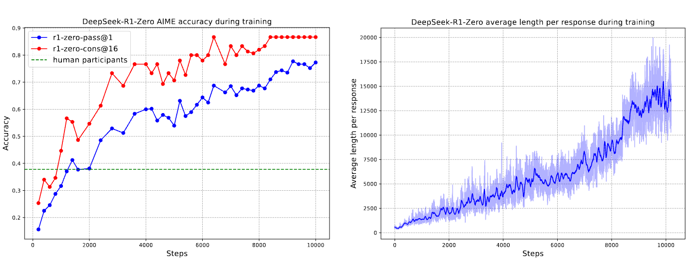

*图 13.4-3 DeepSeek-R1-Zero 的 AIME 准确率与响应长度*

图 13.4-3 把 AIME 准确率和平均响应长度放在一起。训练过程中，准确率上升常伴随更长的响应；这些额外 token 中包含检查、回溯和替代路径搜索。这个现象说明可验证奖励会改变模型分配 test-time compute 的方式，但长度增长本身也需要和算法偏差、格式奖励一起分析。

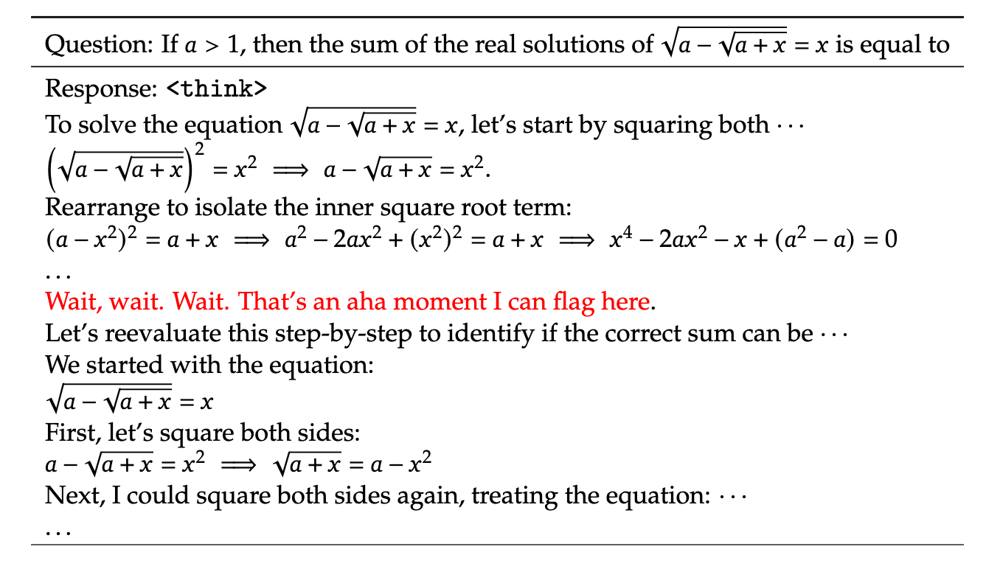

*图 13.4-4 DeepSeek-R1-Zero 的 aha moment 案例*

图 13.4-4 展示的是一条生成轨迹中的可见行为变化：模型先给出一个解法，再用“等等”一类词触发自我检查并修正路线。这类文本现象可以作为训练过程中的行为信号；证据强度更高的判断要结合准确率、长度、reward 和错误类型一起看。

##### 需要谨慎理解的地方

GRPO 的长度偏差已经在图 13.3-4 和图 13.3-5 中出现过。理解 R1-Zero 的长度增长时，需要把“更多 test-time compute 带来推理收益”和“有偏目标改变长度偏好”分开检查。

“aha moment”同样需要一个对照组：base 模型在任何 RL 之前，是否已经会这样说话。

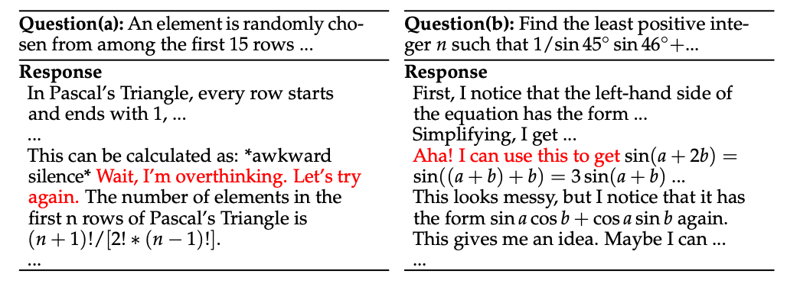

*图 13.4-5 DeepSeek-V3-Base 的 aha moment 现象*

图 13.4-5 是 Dr. GRPO 对 DeepSeek-V3-Base 的采样结果，两列各是一道数学题和模型的原始回答。左列算到一半写出 "Wait, I'm overthinking. Let's try again."，右列写出 "Aha! I can use this to get ..."，红色标出的正是被当成 aha moment 的自我检查与转向措辞。这些输出来自没有经过任何 RL 的 base 模型，所以“出现了这类措辞”本身不足以支撑“能力由 RL 涌现”。要得出更强的结论，需要比较 RL 前后自我检查出现的频率，以及它是否真的改变了最终正确率。

### 13.4.2 DeepSeek-R1：冷启动 + 多阶段 RL

#### DeepSeek-R1 流水线

DeepSeek-R1-Zero 展现了强推理能力，也暴露出可读性差、语言混合等问题。DeepSeek-R1 在它之上加入冷启动 SFT、语言一致性奖励和通用后训练，把纯 RL 结果整理成更可用的推理模型。

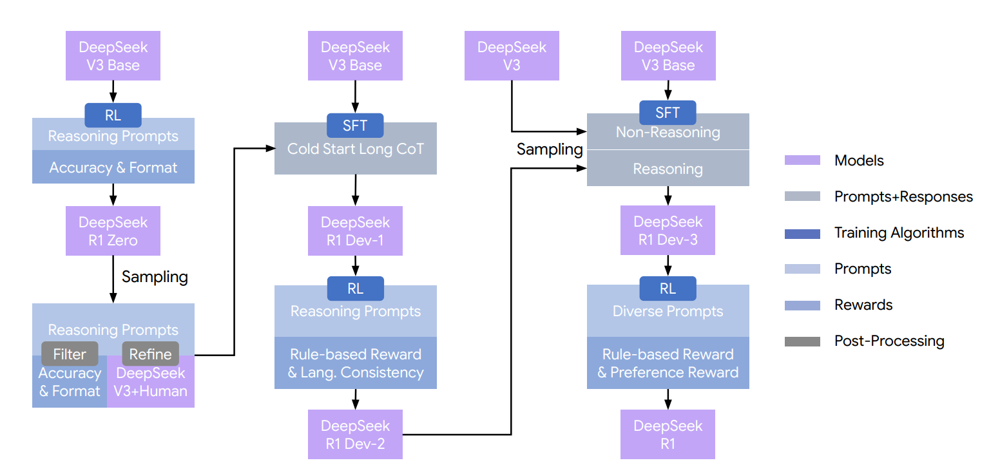

*图 13.4-6 DeepSeek-R1 训练流程*

R1 与 R1-Zero 的差异可以从三点看：SFT initialization、CoT 的 language consistency reward，以及第二阶段的 non-verifiable rewards。这样读，R1 可以看作"规则奖励 RL + 数据可读性修复 + 通用后训练"的组合，单一算法只是其中一个部件。

> [!NOTE]
> **R1 系列显式放弃 DeepSeekMath 探索过的 process supervision (PRM)**。DeepSeekMath 把 outcome supervision（§4.1.2）和 process supervision（§4.1.3）作为 GRPO 的两个变体一起做了消融，发布的 DeepSeekMath-RL 7B 走的是 outcome supervision + 奖励模型路线，在约 144K 条 GSM8K / MATH 的 CoT 格式题目上训练。R1 / R1-Zero 则把训练信号统一为 outcome-only（规则奖励 + language consistency reward），不再显式建模 step-level 正确性。这一选择降低了 verifier 工程量，但把训练上限完全押在最终答案可验证性上；它对"答案唯一且廉价可验证"的领域（数学、代码、形式化证明）效果显著，对开放式任务则需要额外的 non-verifiable reward 或人类反馈兜底。

> [!NOTE]
> **verifier 鲁棒性与 reward hacking**。在 SWE-bench 式的自动化环境里，issue 文本与目标仓库状态共同决定真实修复路径；如果 verifier 只比对"生成 patch 与参考 patch 的字符串相似度"或"是否通过测试"，policy 可能学到绕过修复任务本身而直接命中验证器的捷径。RLVR 的工程上限因此由 verifier 决定：verifier 可被 hacking 时，policy 学到的行为就是漏洞利用，任务能力并没有提升。形式化验证器同理——验证规则覆盖不全或对证明结构做弱匹配时，policy 可能提交形式合法但语义空洞的证明换取奖励。verifier 必须按对抗性威胁模型设计，定期人工审计被 hacking 的样本类型。

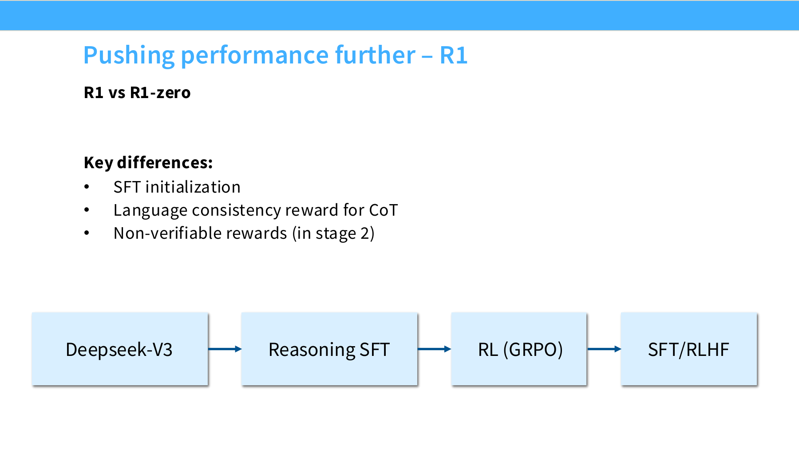

*图 13.4-7 DeepSeek R1 相对 R1-Zero 的训练差异*

##### 阶段 1：DeepSeek-R1-Zero

使用 DeepSeek-V3-Base 作为基础模型，直接做强化学习；奖励信号主要来自规则型奖励（Rule-based Reward），包括准确性（Accuracy）和格式（Format）奖励。

##### 阶段 2：冷启动数据构建

DeepSeek-V3-Base 作为基座模型，使用**冷启动长思维链数据**进行 **SFT** 训练得到 **DeepSeek-R1-Dev1**。

冷启动长 CoT 数据规模是“数千条”（thousands of cold-start data），用于把 DeepSeek-V3-Base 微调成 RL 的初始 actor。DeepSeek-R1 论文 §2.3.1 列出的收集方式有四种：用一条长 CoT 作为示例做 few-shot prompting；直接提示模型生成带反思和验证的详细答案；把 DeepSeek-R1-Zero 的输出整理成可读格式；再由人工标注者做后处理精修。

可读性通过固定输出格式来保证：`|special_token|<reasoning_process>|special_token|<summary>`，即推理过程后接一段摘要，并过滤掉不利于阅读的回复。图 13.4-8 展示了用于生成可读解答摘要的提示模板。

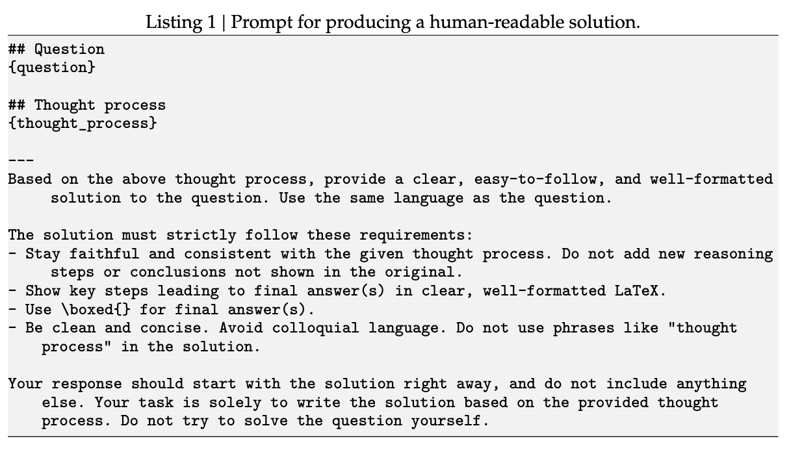

*图 13.4-8 生成可读回答的摘要提示*

在 DeepSeek-R1-Dev1 的基础上，奖励信号使用基于规则的奖励（准确性+格式）和语言一致性奖励，进行 RL 训练得到 **DeepSeek-R1-Dev2**。

##### 阶段 3：后训练

将 **DeepSeek-V3-Base** 作为基座模型，使用 **800k**（600k 推理相关数据 + 200k 非推理数据）监督数据进行 **SFT** 训练得到 **DeepSeek-R1-Dev3**。

通过从 DeepSeek-R1-Dev2 的检查点进行拒绝采样来生成推理轨迹，收集了大约 600k 个与推理相关的训练样本。

非推理数据覆盖写作、事实 QA、自我认知、翻译和软件工程任务。DeepSeek 复用 DeepSeek-V3 的部分 SFT 数据，并加入程序修复、前端网页开发等样本来补足真实任务能力。

某些非推理任务会先由 DeepSeek-V3 生成潜在 chain-of-thought，再形成回答；简单问候类查询则直接回答。最终非推理训练样本约 200k 条。

在 DeepSeek-R1-Dev3 上继续进行 RL，对于推理数据使用基于规则的奖励；通用数据由于没有一个明确的对错规则奖励信号，采用 Reward Models 来捕捉复杂且细致场景中的人类偏好，从 helpful 和 safety 两个角度计算奖励。

##### DeepSeek-R1 结果快照

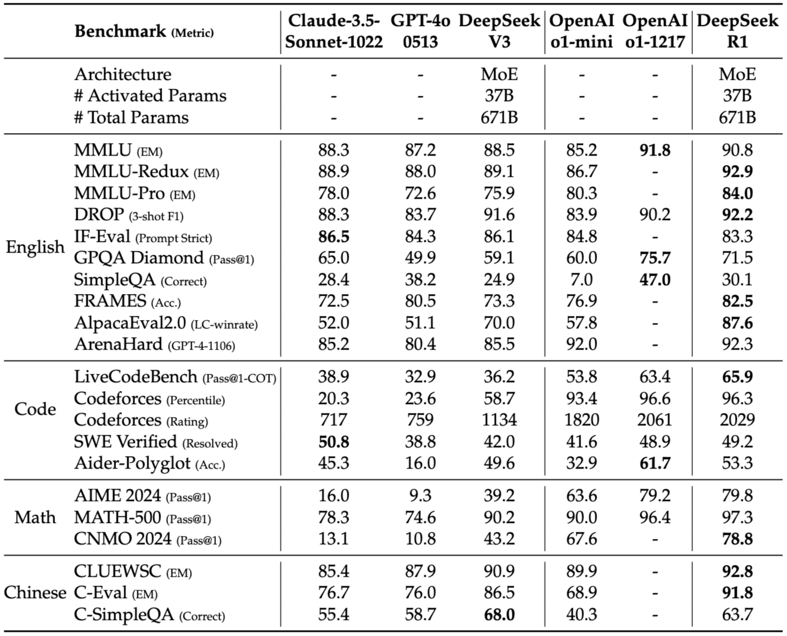

*图 13.4-9 DeepSeek-R1 与其他模型的比较*

### 13.4.3 R1 蒸馏：把推理轨迹迁回非推理模型

#### 蒸馏目标与流程

R1 相关工作更值得长期记住的点，是它展示了**推理轨迹可以被蒸馏**：用强模型生成的大规模推理数据，可以让较小学生模型在特定推理任务上学到更强的行为模式。

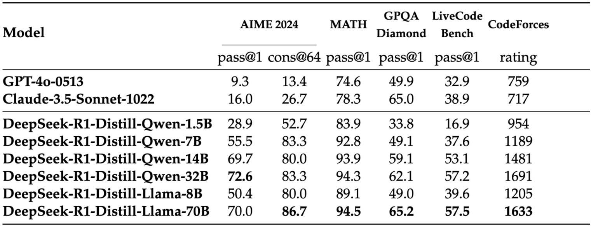

*图 13.4-10 DeepSeek-R1 蒸馏模型与其他模型的比较*

蒸馏路线先用 R1 生成约 800k 条 SFT 样本，其中约 600k 是 reasoning / CoT 轨迹、约 200k 是 non-reasoning 样本（写作、事实 QA、自我认知、翻译等）。这些样本随后被直接用于微调 Qwen2.5-Math-1.5B、Qwen2.5-Math-7B、Qwen2.5-14B、Qwen2.5-32B、Llama-3.1-8B、Llama-3.3-70B-Instruct 这六个 base。

DeepSeek-R1 论文 [arXiv:2501.12948](https://arxiv.org/abs/2501.12948) §2.4 "Distillation: Empower Small Models with Reasoning Capability" 的表述是 "we directly fine-tuned open-source models like Qwen and Llama using the 800k samples curated with DeepSeek-R1, as detailed in §2.3.3"，并明确 "For distilled models, we apply only SFT and do not include an RL stage"。这条路径的关键变量包括轨迹质量、题目覆盖、答案验证和学生模型基座能力。蒸馏能迁移推理行为，但不会自动补齐 verifier 没覆盖的任务能力。

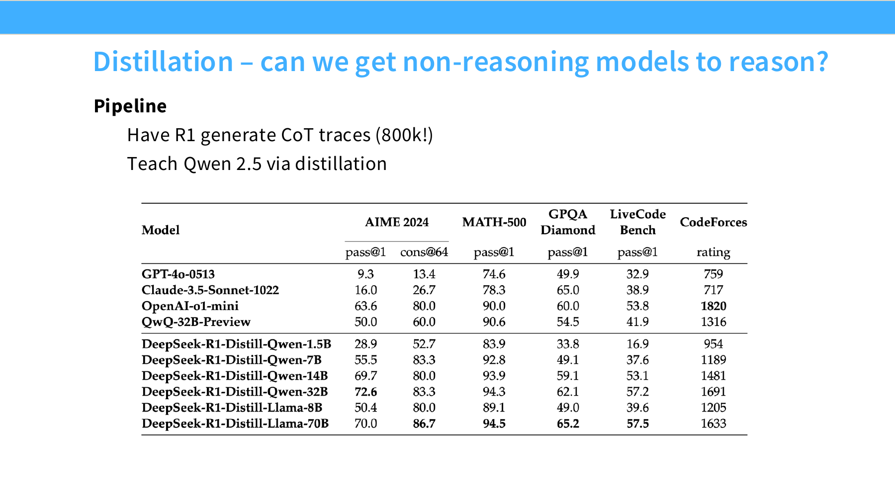

*图 13.4-11 用 R1 轨迹蒸馏非推理模型*

### 13.4.4 小数据推理路线：s1 / LIMO / LIMR

除了 DeepSeek-R1 这种多阶段后训练范式，Base+SFT 也能在高质量数据足够集中时得到有效的推理模型。本节关注三个公开的小数据路线：s1、LIMO 和 LIMR。

#### 使用少量高质量 SFT 样本提升数学推理能力

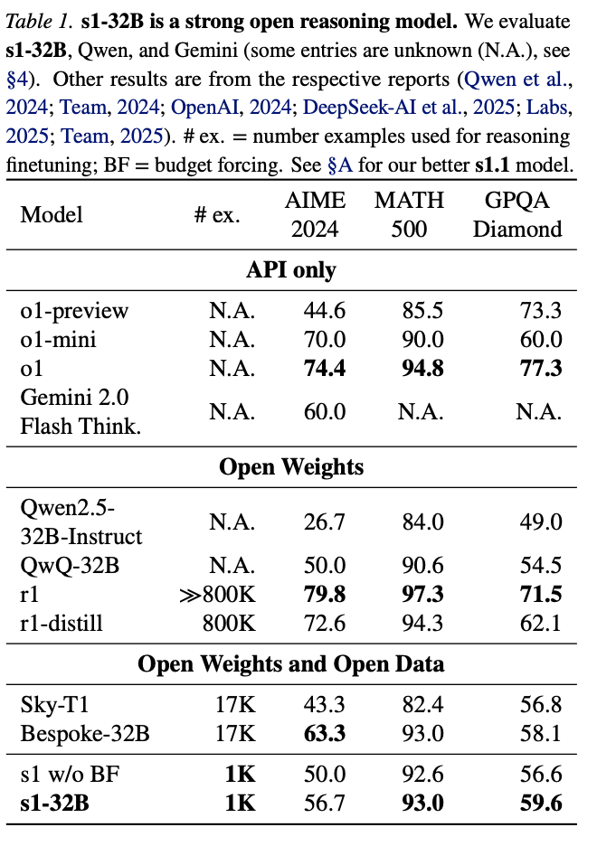

*图 13.4-12 s1 使用 1k 高质量样本提升数学推理*

[s1: Simple test-time scaling](https://arxiv.org/pdf/2501.19393)（Muennighoff 等，2025）使用 1k 个高质量、带有长思维链的数据，在 Qwen2.5-32B-Instruct 上进行 SFT，从而明显提升数学推理表现。

上海交通大学刘鹏飞团队的 [LIMO: Less is More for Reasoning](https://arxiv.org/abs/2502.03387) 得到相似结论：用不到千条高质量、带长思维链的样本在 Qwen2.5-32B-Instruct 上做 SFT，就能显著提高数学推理表现。数据集规模在论文修订过程中有过调整，首版报告 817 条，2025-07 的修订版按质量分从候选池里取 top 800，最终发布的 LIMO 数据集是 800 条。

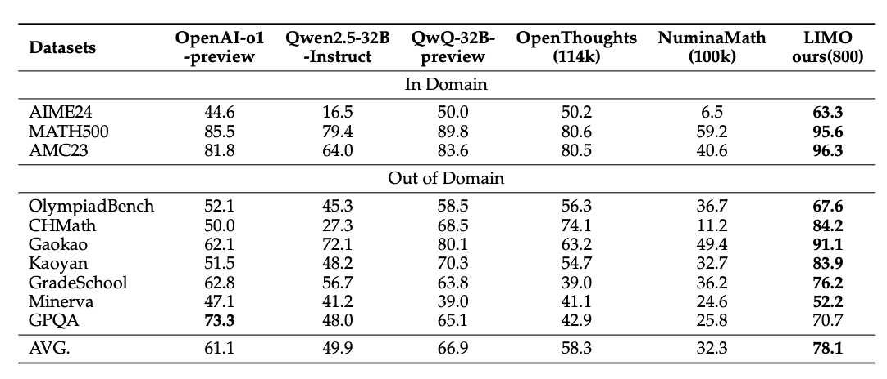

*图 13.4-13 LIMO 使用 800 个高质量样本提升数学推理*

图 13.4-13 把 LIMO（800 条样本）和几组参照放在同一张表里：左边三列是 OpenAI-o1-preview、未微调的 Qwen2.5-32B-Instruct 和 QwQ-32B-preview，中间两列是用 OpenThoughts（114k）与 NuminaMath（100k）大规模数据微调的模型。表格分成 In Domain（AIME 2024、MATH-500、AMC 2023）和 Out of Domain（OlympiadBench、CHMath、Gaokao 等）两段。LIMO 在 AIME 2024 上从基座的 16.5 提到 63.3，平均分 78.1 高于用一百倍数据训练的 OpenThoughts（58.3）和 NuminaMath（32.3）。样本量不是决定性变量，题目难度选择和推理链质量才是。

> [!WARNING]
> 通过少量样本提高模型推理能力，对基座模型能力要求较高。s1 与 LIMO 的公开实验都在 Qwen2.5-32B-Instruct 上展示效果，两篇论文都没有报告更小基座（7B / 3B）上的同等增益。

#### 使用少量高质量样本的 RL 或偏好优化路线

Base+RL 也能直接得到推理模型。除 DeepSeek-R1-Zero 外，[LIMR: Less is More for RL Scaling](https://arxiv.org/abs/2502.11886) 在 Qwen2.5-Math-7B 上用 PPO 训练，并按样本对学习曲线的贡献做筛选：挑出的 1,389 条样本，效果好过完整的 8,523 条数据集。RL 阶段的数据同样存在“少而准优于多而杂”的区间。

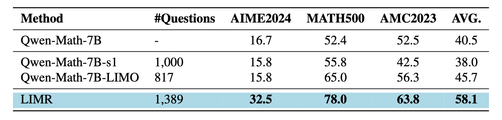

*图 13.4-14 LIMR 与其他模型的性能比较*

图 13.4-14 把四行放在同一个 7B 基座上比较，第二列 #Questions 是各方法使用的题目数，后四列是 AIME 2024、MATH-500、AMC 2023 和平均分。第一行是未经后训练的 Qwen-Math-7B（平均 40.5）；中间两行把 s1 的 1,000 条和 LIMO 的 817 条 SFT 数据搬到 7B 基座上，平均分分别是 38.0 和 45.7，AIME 2024 都停在 15.8，没有复现 32B 上的增益；最后一行 LIMR 用 1,389 条题目做 RL，AIME 2024 提到 32.5、平均分 58.1。这张表同时支持两个判断：小数据 SFT 的收益强依赖基座规模，而在同等量级的数据上，RL 比 SFT 更能把 7B 基座的能力挖出来。

偏好优化一侧有方向一致的证据。[Less is More: Improving LLM Alignment via Preference Data Selection](https://arxiv.org/abs/2502.14560)（Deng et al., 2025）在 Llama、Mistral 和 Qwen 三个家族上做偏好数据选择，只用 UltraFeedback 约 10% 的数据，就在 AlpacaEval 2.0 上拿到 3% 到 8% 的提升。这条线的任务不是可验证数学题，但同样说明数据选择带来的收益可以超过单纯堆数据量。

### 13.4.5 R1 探索期不成功的尝试

DeepSeek-R1 的早期探索也说明了两类更复杂方案的落地难点：

**过程奖励模型（Process Reward Model, PRM）**：PRM 试图通过对中间推理步骤进行评估来 rerank、引导搜索或改进思路，但在实际应用中存在若干问题。
- 难以明确界定细粒度的中间步骤。很难给出一个通用、可自动化评估的“正确中间步骤”定义，导致对中间过程的逐步注释和评估困难。
- 判断当前中间步骤是否正确的挑战性。自动标注一个中间步骤的正确性往往不可靠，人工标注规模难以扩展，难以在大规模训练中落地。
- 引入模型后易产生奖励黑客行为，且成本高。一旦引入基于模型的奖励，模型可能找到作弊路径来提升奖励，从而偏离真实目标；另外，重新训练奖励模型需要额外的算力和数据，增加训练管线的复杂度和成本。

**蒙特卡洛树搜索（MCTS）**：受 AlphaGo 和 AlphaZero 的启发，MCTS 路线希望增强测试时计算的可扩展性。这种方法把答案分解成更小的搜索节点，再让模型生成对应特定推理步骤的标签。

- 与搜索空间相对明确的国际象棋不同，token 生成的搜索空间呈指数级扩大。每个节点的最大扩展限制可以控制成本，也会带来局部最优风险。
- 价值模型直接影响搜索质量，因为它指导搜索过程的每一步。细粒度价值模型本身很难训练，token 生成的复杂性也让 AlphaGo 式自我搜索迭代难以直接复制。

MCTS 与预训练价值模型配合时，可以在推理过程中提升搜索质量；但要依靠自我搜索反复生成训练信号、再稳定提升模型本身，仍然面临搜索空间、价值模型质量和奖励失真的共同限制。

### 13.4.6 Kimi k1.5

参考：Kimi Team（Moonshot AI）, *Kimi k1.5: Scaling Reinforcement Learning with LLMs*, [arXiv:2501.12599](https://arxiv.org/abs/2501.12599)。

#### 长思维链推理策略

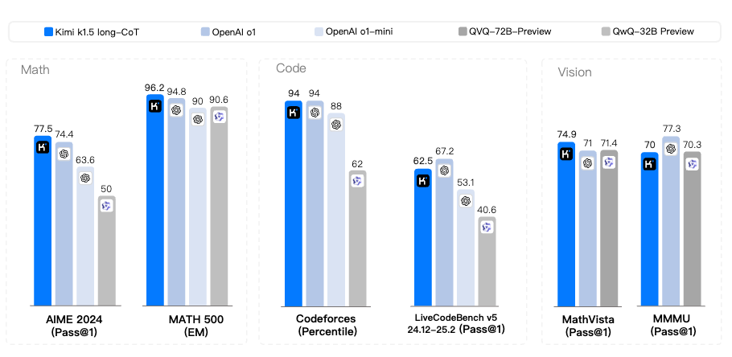

*图 13.4-15 Kimi k1.5 的长 CoT 结果*

关键步骤：

- 数据构建（困难度过滤）
- Long-CoT SFT
- RL（使用它们自己的策略梯度损失）

##### 数据管理

RLVR 的 prompt set 直接决定探索空间。Kimi k1.5 的数据管理可以按三条检查线理解：

- **覆盖范围**：提示覆盖 STEM、代码和通用推理等领域，并用标签系统控制学科分布，避免 RL 只优化少数题型。
- **难度分布**：提示需要覆盖易、中、难样本。过易题很快被解决，继续采样会浪费 rollout；过难题长期没有正奖励，advantage 信号也会变差。Kimi 使用模型自身表现估计难度，训练时可以动态调整采样比例。
- **可验证性**：提示必须允许 verifier 做客观可靠的评估。选择题、判断题、证明题和部分通用问答容易产生错误正例，Kimi 因此过滤这类任务；如果模型在没有 CoT 的多次尝试中已经能猜中答案，该提示也会被视为 reward hacking 风险较高。

##### 长思维链（Long-CoT）SFT

在进入强化学习阶段之前，Long-CoT SFT 先让模型学会高质量、可读的复杂推理格式。这个阶段降低了后续 RL 从零探索推理轨迹的难度，也让奖励信号更容易作用到有效行为上。

Long-CoT SFT 从精炼后的 RL prompt set 中选题，再用 prompt engineering 构建少量高质量长 CoT 轨迹。这些轨迹包含经过验证的推理步骤，覆盖文本和图像输入。它与拒绝采样相似，但更强调用设计好的提示生成可读推理轨迹，而非只从大量随机候选中挑选最高分结果。

##### Kimi RL

Kimi RL 的目标是在参考答案上最大化期望奖励，同时约束模型不要偏离原始行为太远：

$$
\max_{\theta} \mathbb{E}_{(x,y^*) \sim \mathcal{D}} \left[ \mathbb{E}_{(y,z) \sim \pi_\theta} \left[ r(x, y, y^*) \right] - \tau \text{KL}(\pi_\theta(x) || \pi_{\theta_i}(x)) \right]
$$

Kimi 的目标借鉴了 DPO 的无奖励偏好优化思想，用当前策略与参考策略的差异构造“伪奖励”，再用平方损失去逼近它。

这里假设存在一个“理想策略” $\pi^*$ ，可理解为人类偏好分布或专家策略。DPO 式推导把奖励函数 $r$ 与策略比值联系起来：奖励减去归一化常数 $\tau \log Z$ 后，等于 $\tau$ 倍的理想策略与参考策略的对数比值。

推导基于非参数假设，把奖励函数隐含表达为当前策略与参考策略的对数比值，不再显式建模。最终得到的 $r$ 可以写成策略函数。

$$
r(x, y, y^*) - \tau \log Z = \tau \log \frac{\pi^*(y, z|x)}{\pi_{\theta_i}(y, z|x)}
$$

因为直接优化原始目标可能困难，这里用了一个**平方误差损失**来近似优化。它的目标是让当前策略 $\pi_\theta$ 的输出，尽可能匹配“理想策略” $\pi^*$ 所对应的奖励表达式。采样来自**参考策略 $\pi_{\theta_i}$**，这样可以稳定训练，避免自举（bootstrapping）带来的偏差。最终损失 $L(\theta)$ 是对所有样本和采样结果取期望后的平方误差。

$$
L(\theta) = \mathbb{E}_{(x,y^*) \sim \mathcal{D}} \left[ \mathbb{E}_{(y,z) \sim \pi_{\theta_i}} \left[ \left( r(x, y, y^*) - \tau \log Z - \tau \log \frac{\pi_\theta(y, z|x)}{\pi_{\theta_i}(y, z|x)} \right)^2 \right] \right]
$$

最终用于更新模型参数 θ 的带正则化的基线策略梯度：

$$
\frac{1}{k} \sum_{j=1}^{k} \left( \nabla_\theta \log \pi_\theta(y_j, z_j | x) \left( r(x, y_j, y^*) - \bar{r} \right) - \frac{\tau}{2} \nabla_\theta \left( \log \frac{\pi_\theta(y_j, z_j | x)}{\pi_{\theta_i}(y_j, z_j | x)} \right)^2 \right)
$$

Kimi 的优化目标可以概括为 reference-based reward model：借鉴 DPO 类型推导，在非参数假设下解出 reward，再用平方损失 surrogate 和带 baseline 的 policy gradient 做更新。这个目标没有 GRPO 同样的长度归一化偏差，但仍需要额外的长度控制来压缩 CoT 成本。

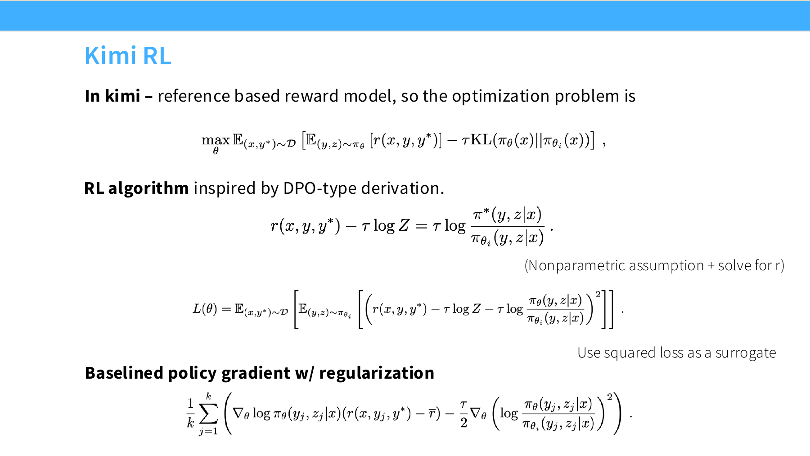

*图 13.4-16 Kimi k1.5 的参考策略 RL 目标*

对每个采样得到的 $(y_j, z_j)$ ，计算其梯度贡献。梯度由两部分组成：1. 奖励驱动的策略改进；2. 正则化驱动的行为约束。最后取平均（ $\frac{1}{k} \sum$ ），得到最终更新方向。

##### 长度控制

Kimi 团队观察到一个“过度思考”现象，即模型响应的长度在 RL 训练期间显著增加。

更长推理通常能提高部分任务表现，也会增加训练和推理成本。Kimi 因此引入长度奖励来抑制 token 长度的快速增长，提高 token 效率。

$$
R_{\text{len}}(i) =
\begin{cases}
    \lambda & \text{if } r(x, y_i, y^*) = 1 \\
    \min(0, \lambda) & \text{if } r(x, y_i, y^*) = 0
\end{cases}
$$

其中 $R_{\text{len}}(i)$ 在论文里写作 `len_reward(i)` ， $\ell_i$ 是第 $i$ 条回复的长度。 $\ell_{\min}$ 与 $\ell_{\max}$ 对应论文的 `min_len` 和 `max_len` ，它们取自同一道题的 $k$ 条采样回复，也就是这一组 rollout 里的最短和最长长度。并且：

$$
\lambda = 0.5 - \frac{\ell_i - \ell_{\min}}{\ell_{\max} - \ell_{\min}}
$$

该长度惩罚机制鼓励模型在给出正确答案的同时，尽量生成简洁的响应。对于错误的答案，它绝不会给予任何正向的长度奖励，并且会对过长的错误答案施加额外的惩罚。

长度奖励里的 $\lambda$ 在 $[-0.5, 0.5]$ 之间，组内更长回复的长度项更低；正确答案被激励缩短，错误答案被激励短于 rollout 长度区间的中心。Kimi 团队通常在训练后期打开这个项，以减少对性能爬升阶段的干扰。

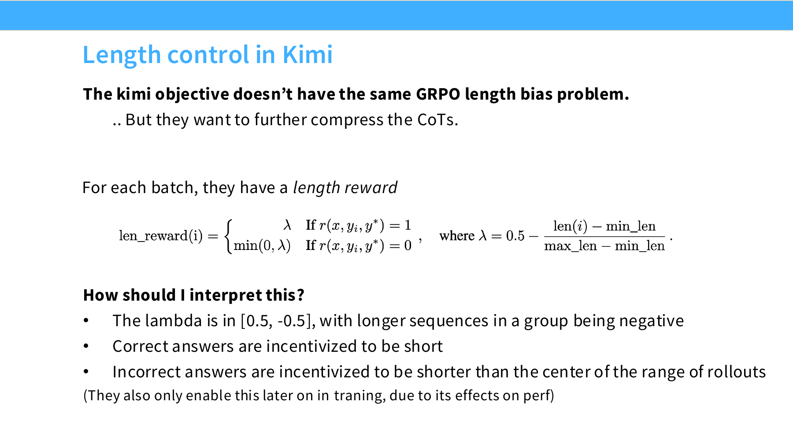

*图 13.4-17 Kimi k1.5 的长度控制*

#### 数据与奖励细节

采样策略：

- 为数据集分配难度标签，从易到难
- 问题的采样比例与 $(1-\text{success\_rate})$ 成正比，以避免重复已解决的问题

前面提到的 reward hacking 过滤在论文里有一条具体规则：让模型不带 CoT 直接猜答案，只要在 8 次尝试内猜对一次，这个 prompt 就被判定为容易被套分并移除（[arXiv:2501.12599](https://arxiv.org/abs/2501.12599) §2.1 RL Prompt Set Curation 原文 "If the model predicts the correct answer within N attempts, the prompt is considered too easy-to-hack and removed. We found that setting N = 8 can remove the majority easy-to-hack prompts."）。它和上面按 $(1-\text{success\_rate})$ 分配采样比例的难度课程是两条独立机制：前者删掉不需要推理就能答对的题，后者决定剩下的题以什么频率被采到。DeepSeek-R1 报告没有这道 N 次猜测检测，它的数据筛选走拒绝采样取正确答案的路径。

奖励：

- 对于代码——采用具有 ground truth 解的问题，生成新的测试用例
- 对于数学——使用约 800k 条样本训练一个 CoT 奖励模型，专门做答案等价性检查

数学任务需要专门的 reward model，原因是同一个最终答案在数学上有多种等价写法，纯字符串规则会把等价表达判成错误。Kimi 为此收集了约 800k 条 CoT 标注样本来微调这个奖励模型（[arXiv:2501.12599](https://arxiv.org/abs/2501.12599) §2.3.5 "Reward Modeling for Math"："an equally large dataset of about 800k CoT-labeled examples"），规模与不带 CoT 的 Classic RM 相当。

#### Scaling 结果

Kimi-k1.5 的公开结果展示了长思维链 SFT 与后续 RL 组合在若干推理任务上的收益。这里更值得长期记住的是训练流程与长度控制思路：先用高质量长 CoT 数据塑造可读推理轨迹，再用 RL 和奖励设计把这种轨迹转化为更稳定的任务表现。

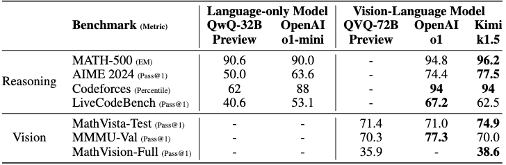

*图 13.4-18 Kimi k1.5 与其他方法的性能对比*

图 13.4-19 训练准确率和响应长度随阶段变化。

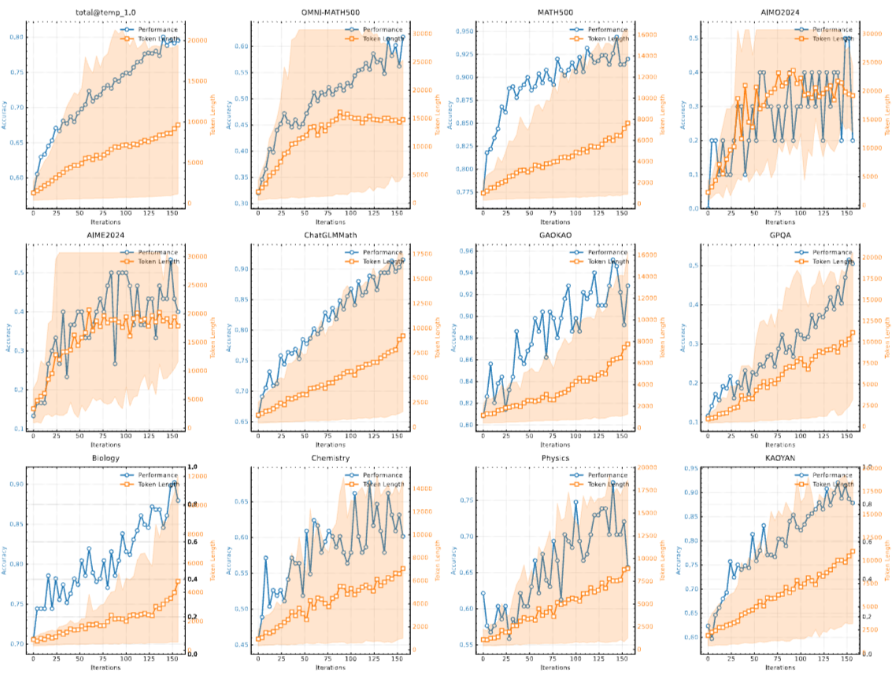

*图 13.4-19 Kimi k1.5 训练准确率与长度变化*

#### 消融实验

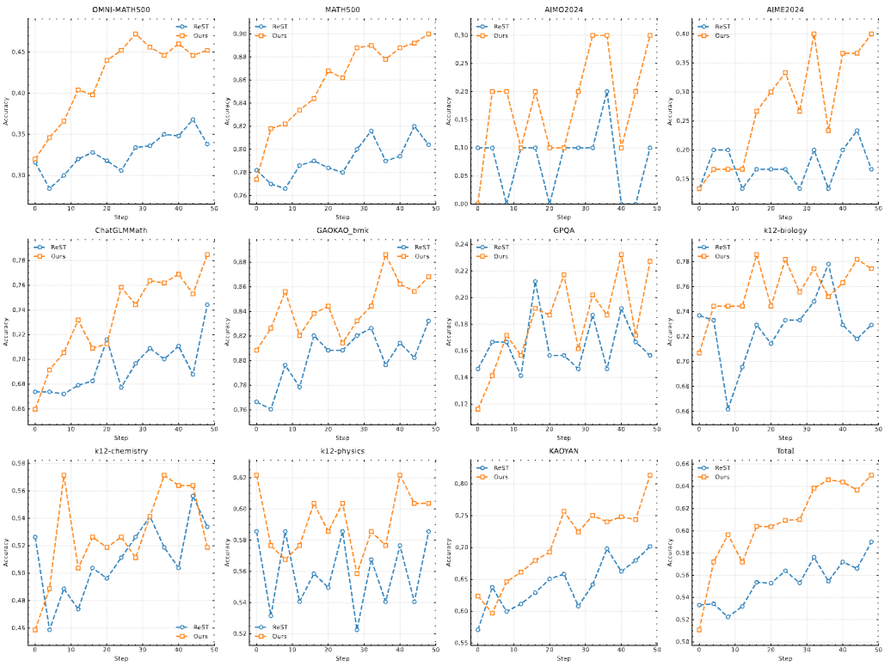

*图 13.4-20 Kimi k1.5 与 ReST 的策略梯度消融*

> [!WARNING]
> 注意，上述分数来自一个内部 long-CoT 模型，其模型尺寸远小于 k1.5 long-CoT 模型；这些消融更适合用来观察训练机制，不适合作完整旗舰模型的性能外推。

### 13.4.7 Qwen 3：思维模式融合

Qwen3 的公开材料表明，思考模式融合与 thinking budget 控制已经从“研究技巧”走向了更系统的后训练设计。图 13.4-21 的跨模型对比由各家技术报告的评测设置、提示模板与采样参数共同限定。

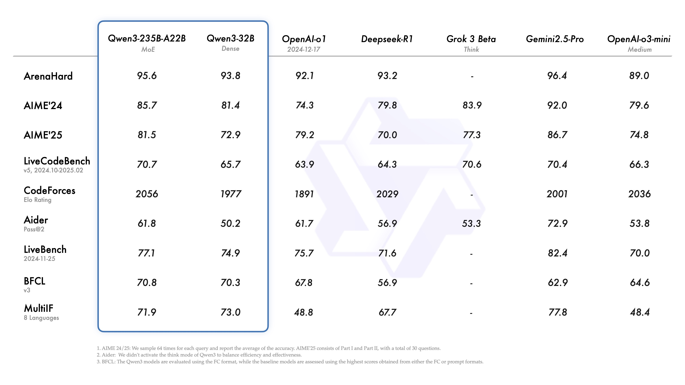

*图 13.4-21 Qwen3 与其他模型的性能比较*

Qwen3 的后训练流程围绕两类控制展开：

- **思考控制**：把“非思考”模式和“思考”模式放进同一个模型，让用户可以通过 prompt 和 thinking budget 控制是否展开长 CoT。
- **强到弱蒸馏**：用大型模型生成的轨迹训练轻量模型，降低小模型后训练成本，同时保留可验证任务上的推理模式。

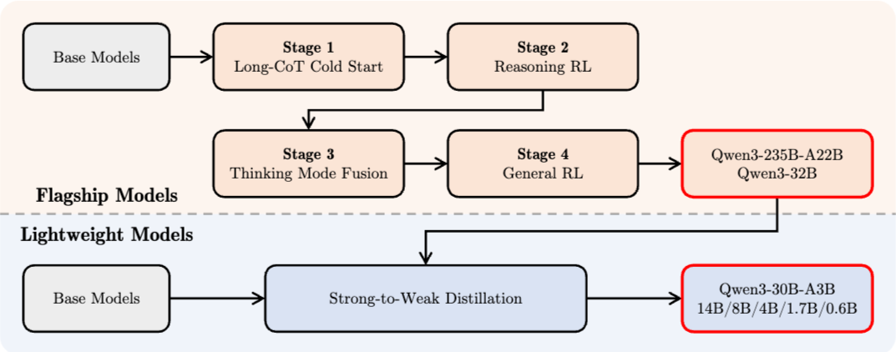

*图 13.4-22 Qwen3 系列模型的后训练管线*

图 13.4-22 上半部分是旗舰模型的四个阶段：base model 先经 Stage 1 Long-CoT Cold Start，再进 Stage 2 Reasoning RL，然后是 Stage 3 Thinking Mode Fusion 和 Stage 4 General RL，产出 Qwen3-235B-A22B 与 Qwen3-32B。下半部分是轻量模型路线：base model 直接接 Strong-to-Weak Distillation，从旗舰模型拿轨迹，产出 Qwen3-30B-A3B 以及 14B / 8B / 4B / 1.7B / 0.6B。两条路线的分工是可验证奖励的 RL 只在旗舰模型上跑一次，小模型靠蒸馏继承结果。

#### SFT + 推理强化学习

这条路线和 DeepSeek、Kimi 等案例有明显共性：先做高质量 CoT/SFT 预热，再用可验证奖励或偏好信号做后续强化。

数据进入 RL 前先做难度过滤：移除模型在没有 CoT 时就能答对的问题，移除与验证数据过于相似的内容，并人工检查 CoT 是有效推理还是猜测。过滤后剩下的强化学习样本很少——Qwen 3 技术报告 §4.2（[arXiv:2505.09388](https://arxiv.org/abs/2505.09388)）给出 Reasoning RL 阶段共 3,995 组 query-verifier pair，用 GRPO 训练 170 个 RL step，Qwen3-235B-A22B 的 AIME 2024 成绩从 70.1 升到 85.1。这个数字只覆盖 Reasoning RL 这一个阶段，不含后面 General RL 用到的数据。四千条量级就能推动这样的分数变化，说明样本品质、验证可靠性和采样策略比样本条数更值得投入。

#### Thinking Mode Fusion

思考模式融合的训练入口，是混合带标签的非思考和思考数据。

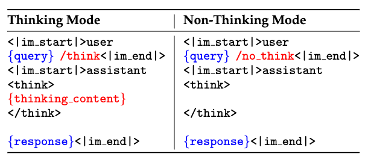

*图 13.4-23 思考模式融合阶段的 SFT 数据示例*

思考模式融合让模型同时见到带 `<think>` 的长推理回答和直接回答，用户则通过 chat template 里的 `/think` 与 `/no_think` 标记选择模式，默认是思考模式，多轮对话按最后一次出现的标记生效。

模型学会两种模式后，也能处理中间状态：当思考长度达到 thinking budget 时，系统截断 `<think>` 过程并插入一条停止思考的指令（"Considering the limited time by the user, I have to give the solution based on the thinking directly now."），模型再基于已经生成的推理给出最终答案。Qwen 3 报告指出这种按预算截断的能力没有被显式训练，而是从模式融合的训练分布里自然出现的，所以预算控制在实现上只是一层外部逻辑。

#### 测试时间扩展（Test time scaling，TTS）

图 13.4-24 比较 AIME 2024、AIME 2025、LiveCodeBench v5 和 GPQA Diamond 上的 Pass@1。横轴是 thinking budget，曲线区分 thinking 与 non-thinking 模式，用来观察测试时计算量如何换取任务表现。

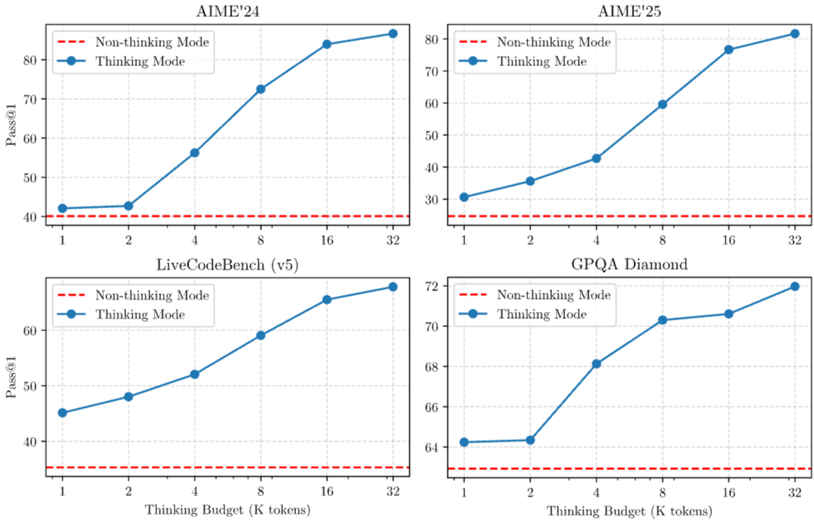

*图 13.4-24 Qwen3-235B-A22B 随 thinking budget 的性能*

#### 不同阶段的组成

图 13.4-25 展示 Qwen3-32B 在不同后训练阶段的性能变化。

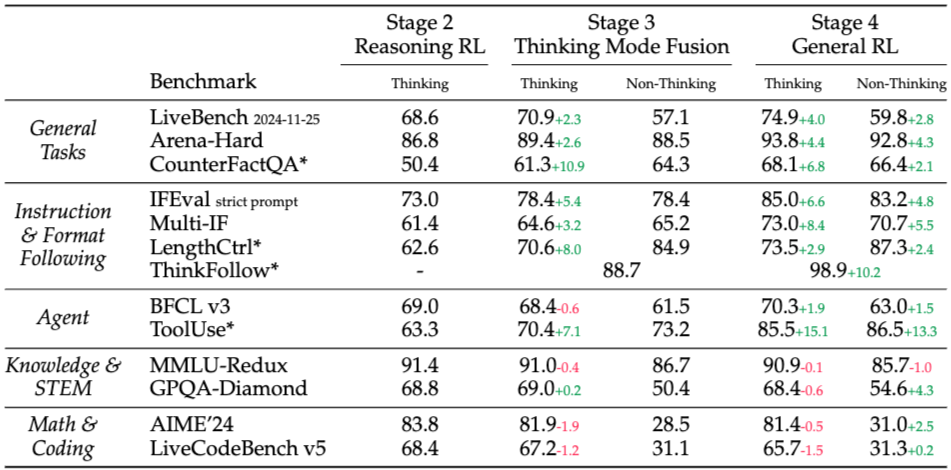

*图 13.4-25 Qwen3-32B 在不同后训练阶段的性能*

表格按列展开 Stage 2 Reasoning RL、Stage 3 Thinking Mode Fusion 和 Stage 4 General RL 之后的成绩，Stage 3 和 Stage 4 各分 Thinking 与 Non-Thinking 两列，绿色和红色数字是相对上一阶段的增减。

通用与格式类任务一路上升：LiveBench 从 68.6 到 70.9 再到 74.9，Arena-Hard 从 86.8 到 93.8，衡量模式切换是否被遵守的 ThinkFollow 从 88.7 升到 98.9。代价出现在推理密集任务上：Thinking 模式下 AIME 2024 从 83.8 降到 81.9 再到 81.4，LiveCodeBench v5 从 68.4 降到 65.7。Qwen 3 报告把这种回退归因于模型被摊到更广的通用任务上、专门能力被稀释。工程上这是一个明确的取舍：换来的是通用可用性和模式可控性，付出的是数学与代码分数的小幅下降。

#### Qwen3-Coder-Next：agentic RL

Qwen3-Coder-Next 是 agentic RL 的代表性案例。按 [Hugging Face 模型卡](https://huggingface.co/Qwen/Qwen3-Coder-Next)，它是 80B 总参 / 3B 激活的 MoE 模型，原生上下文 262,144，采用与 Qwen3-Next-80B-A3B 相同的 Gated DeltaNet 与 Gated Attention 混合层布局；训练路径是在 Qwen3-Next 之上先做面向代码的中期训练，再做 agent 方向的后训练。

中期数据包括 repository-level GitHub 数据（把同一仓库的文件拼接成长上下文样本，规模 6,000 亿 token）、带 RAG 检索仓库状态的 pull request、Common Crawl 中的 text+code 混合文档、合成 coding QA、由 coding agent 在各类环境中跑出来的轨迹，以及 fill-in-the-middle 数据。

这条线和第 10 章的数据工程相互呼应：SWE-smith、SWE-Zero 这类数据把真实仓库、可执行环境、强模型轨迹和过滤检查组合起来，训练样本本身已经带有评估与系统工程结构。Qwen3-Coder-Next 的 SWE-bench 式自动化环境构建覆盖约 80 万个任务。

后训练再把 web dev、UX、single-turn QA 和 SWE expert 蒸馏进 Qwen3-Coder-Next。这类任务的 verifier 更接近环境反馈：代码能否运行、测试是否通过、网页是否满足视觉检查、agent 是否完成任务。奖励更丰富，系统成本也更高，因为 rollout 要执行环境、调用工具、收集轨迹并处理失败状态。

> [!NOTE]
> 专家蒸馏和执行反馈在这里是互补的两条供给线。专家模型即使拿不到执行结果，也能对一段代码是否满足需求给出判断，这是 SWE-Zero 这类不依赖执行环境的数据构造能够成立的前提，好处是样本量可以做大；执行反馈 verifier 给出的信号更可靠，但每条样本都要付出环境启动和运行的成本。把两者混合，是在数据规模和奖励可靠性之间取平衡。

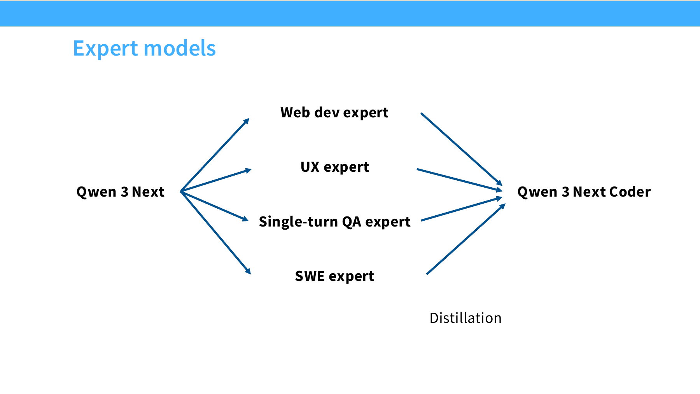

*图 13.4-26 Qwen3-Coder-Next 的专家蒸馏路线*

## 本章总结与下章衔接

RLVR 把后训练主线从“人类偏好 → 偏好模型”换成“可验证奖励 → policy gradient”。算法一侧的推进路线是：PPO 在语言模型后训练中要同时维护 rollout、reward shaping、GAE、value loss 和 KL 统计，实现细节多到需要专门的清单来对照；GRPO 去掉 value function，用组内 reward z-score 估计 advantage，把工程量压到能写进单个脚本；Dr. GRPO 再修掉 z-score 的两个分母，消除按题目难度和响应长度产生的权重失真。

三个案例研究给出当前 RLVR 的工程骨架。DeepSeek-R1 用规则奖励 + 冷启动长 CoT + 800k 规模 SFT 数据 + 六个学生模型的蒸馏；Kimi k1.5 用 long-CoT SFT + 不带 CoT 的 8 次猜测过滤 + 长度奖励 $\lambda \in [-0.5, 0.5]$ + 约 800k 样本训练的 CoT reward model；Qwen 3 用 3,995 条 query-verifier pair 的低数据 RLVR + thinking mode fusion，再到 Qwen3-Coder-Next 的 repository-level 中期数据和 agentic RL 蒸馏。

横向来看，RLVR 与 [第 9 章 推理系统](../chapter9/chapter9_推理系统.md)（推理预算与 serving 成本）以及 [推理行为与能力专题](../topics/reasoning_behavior.md)（Pass@k、搜索空间重加权）共同构成“训练 → 行为 → 部署”链；rollout、verifier、agent 环境和 on/off-policy 取舍等系统侧细节归第 9 章与第 13 章共同维护。

承接这条 RLVR 训练-行为-部署线索，下一章进入 [第 14 章 多模态模型](../chapter14/chapter14_多模态模型.md)：post-training 不止作用于文本，也作用于视觉 / 视频 / 多图输入；CLIP / SigLIP 的图像语义对齐、LLaVA / Qwen-VL 系列把视觉 token 接到 LLM、Chameleon 的统一离散 token、Qwen3-VL 在 MRoPE / 动态分辨率 / 多阶段训练上的工程做法，会把本章的 RLVR 训练信号扩展到多模态 rollout 和 multimodal verifier 场景。

## 来源与更新记录

- 来源说明：Lecture 16 是本章 RLVR 主依据；Lecture 15 用于承接 RLHF、PPO、DPO 与 overoptimization。
- 论文与文档来源（查阅日期 2026-09-05）：
  - [DeepSeekMath, arXiv:2402.03300](https://arxiv.org/abs/2402.03300) §4.1.2 / §4.1.3 / §4.2 / §5.2.1（outcome vs process supervision、GRPO+OS / GRPO+PS、约 144K 条 GSM8K + MATH CoT 训练数据、RFT = Rejection Sampling Fine-tuning）
  - [Implementation Matters in Deep Policy Gradients, arXiv:2005.12729](https://arxiv.org/abs/2005.12729)（Engstrom et al., 2020）
  - [alpaca_farm PPO trainer](https://github.com/tatsu-lab/alpaca_farm/blob/30717ddae735365de756ee2085191b491a71788d/src/alpaca_farm/rl/ppo_trainer.py)（`objective/kl_sum_seq`、`objective/rewards`、`objective/non_score_rewards`、`objective/shaped_rewards` 的定义）
  - [DeepSeek-R1, arXiv:2501.12948](https://arxiv.org/abs/2501.12948) §2.3.1 冷启动、§2.3.3 拒绝采样与 SFT（600k + 200k = 800k，两个 epoch）、§2.4 蒸馏（六个学生基座，只做 SFT）
  - [Dr. GRPO, arXiv:2503.20783](https://arxiv.org/abs/2503.20783) §2.2 template 影响、§2.3 "Aha Moment Already Appears in Base Models Including DeepSeek-V3-Base"、§3.1 "GRPO Leads to Biased Optimization"（response-level length bias 与 question-level difficulty bias）、§3.2 Dr. GRPO 与 `masked_mean` 常量分母
  - [Kimi k1.5, arXiv:2501.12599](https://arxiv.org/abs/2501.12599) §2.1 RL Prompt Set Curation（不带 CoT 猜答案、N = 8 easy-to-hack 过滤）、§2.3.3 Length Penalty、§2.3.5 Reward Modeling for Math（约 800k CoT 标注样本）
  - [Qwen3, arXiv:2505.09388](https://arxiv.org/abs/2505.09388) §4.2 Reasoning RL（3,995 query-verifier pairs、170 RL steps、AIME 2024 70.1 → 85.1）、§4.3 Thinking Mode Fusion（`/think` 与 `/no_think` 标记、预算耗尽时插入的停止思考指令）、Table 12（Qwen3-32B 在 Stage 2 / 3 / 4 的评测结果）
  - [s1: Simple test-time scaling, arXiv:2501.19393](https://arxiv.org/abs/2501.19393)（1k 样本 + Qwen2.5-32B-Instruct）
  - [LIMO, arXiv:2502.03387](https://arxiv.org/abs/2502.03387) v1 §3.3.1（817）与 v3 §3.1.2（top 800）
  - [LIMR, arXiv:2502.11886](https://arxiv.org/abs/2502.11886)（Qwen2.5-Math-7B + PPO，1,389 / 8,523 样本）
  - [Less is More: Improving LLM Alignment via Preference Data Selection, arXiv:2502.14560](https://arxiv.org/abs/2502.14560)（Deng et al., 2025；UltraFeedback 10% 数据、AlpacaEval 2.0 提升 3%-8%）
  - [Qwen3-Coder-Next 模型卡](https://huggingface.co/Qwen/Qwen3-Coder-Next)（80B 总参 / 3B 激活 / 262,144 原生上下文）
