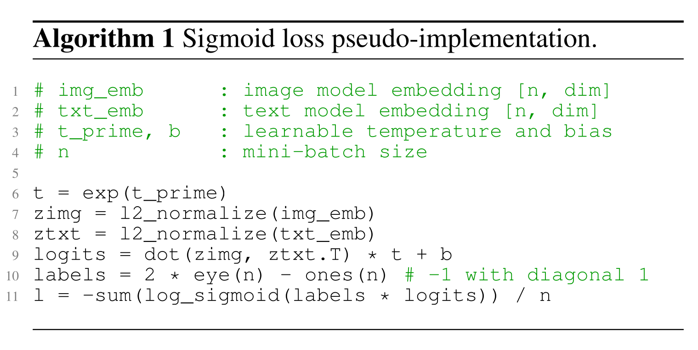
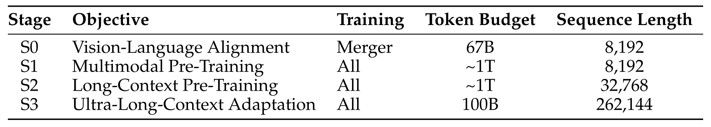

# 第 14 章 多模态模型

## 本章学习目标

读完本章应能回答五个问题：

- 非文本模态如何变成 Transformer 可以处理的 token 或 embedding。
- CLIP / SigLIP 这类图文对齐模型学到什么视觉语义。
- VLM 如何把 vision encoder、projector / adaptor 和 LLM 接在一起。
- 单图、多图、视频和图像生成分别带来哪些数据与 token budget 问题。
- 多模态训练为什么需要单独处理 loss balance、位置编码和稳定性。

## 本章主线

前面的章节主要围绕 text-to-text language model：输入是一串 text tokens，输出也是一串 text tokens。多模态模型把问题扩展为：模型能否理解图像、视频、音频和文本的组合，并在需要时生成非文本内容。

这个扩展首先是表示问题。Transformer 处理的是 token 序列，因此图像、视频和音频都要先转成某种 token 或 embedding。理解任务通常更需要语义压缩，生成任务还需要保留细粒度细节。两类目标会推动不同的 encoder、adapter、tokenizer 和训练流程。

本章的认识链从 Transformer 的序列输入约束出发：非文本模态必须映射到可参与注意力计算的 token 或 embedding，同时保留任务所需的信息。patch 几何关系给出视觉 token 预算，对比学习、projector 和自回归损失分别检验表示对齐、跨模态接口和生成能力；分辨率、多图数量、视频帧率与 loss 权重作为实验变量，图表结果用于判断收益、显存代价和模态间干扰。

*图 14.1-1 多模态目标总览*

图 14.1-1 把多模态目标放在同一张图里：真实世界的信息不只以文本存在，模型需要处理图像、语音、视频和交互状态。对 LLM 来说，工程入口是把这些模态转成 Transformer 可以处理的序列，再让不同模态在同一个上下文里对齐。

一个可执行的多模态训练问题可以拆成四层：

- 表示层：非文本输入如何变成 token 或 embedding。
- 对齐层：视觉表示如何进入语言模型的 embedding space。
- 数据层：图文对、指令数据、多图和视频数据如何组织。
- 生成层：模型是否只理解非文本输入，还是也能生成图像、音频或视频。

## 14.1 多模态的目标与边界

Transformer 的核心抽象是 token 序列，因此每种非文本模态都要先经过"token 化"或"embedding 化"，再进入与文本 token 同一套注意力与 FFN 计算。

本章沿三条主线展开：

- **对齐与理解**：CLIP / SigLIP 用图文对比学习把图像压到文本语义附近（§14.2）。
- **模板化 VLM**：LLaVA / LLaVA OneVision / Qwen-VL 系列用 vision encoder + projector + LM 模板（§14.3-§14.5）。
- **统一自回归**：Chameleon 把图像变成离散 token，与文本 token 在同一 next-token objective 上预测（§14.6）。

§14.7 讨论多模态训练稳定性（QK norm、z-loss、logit drift），§14.8 单列音频、视频与 omni 方向作为延伸阅读。理解任务和生成任务在 encoder / decoder / loss / sampling 上的不同取舍，也会贯穿这三类路线。

## 14.2 CLIP 与 SigLIP：用图文对学习视觉语义

视觉理解的早期关键问题是：能否利用互联网上大量 image-text pairs，减少对人工标注 ImageNet 式分类标签的依赖。CLIP 和 SigLIP 都从这个问题出发，把图像和文本编码到可比较的表示空间。

这一节先学习“图像语义如何靠文本监督学出来”。训练问题是让一张图靠近匹配 caption，远离不匹配 caption；系统问题是这种目标怎样影响 batch size、通信和后续 VLM encoder 选择。

对比学习实验应固定图文配对来源、图像增强、文本 tokenizer 和 encoder 规模，只改变 batch、温度或损失形式；分别报告 image-to-text、text-to-image 检索和 zero-shot 分类，才能区分表示对齐收益、负样本数量效应与下游迁移效果。

*图 14.2-1 CLIP 图文对齐框架*

图 14.2-1 同时展示训练与零样本分类两个阶段。训练阶段（左）：一个 batch 里有 $N$ 对图文，image encoder 产生 image embeddings，text encoder 产生 text embeddings；目标让对角线（匹配对）相似度最大、非对角线（不匹配）更小。零样本分类（右）：把类别名写成 prompt，再算与图像 embedding 的相似度即可分类。

这种目标把视觉分类问题改写成图文匹配问题：模型不需要固定类别表，而是学会把图像语义放到文本描述附近。下游做 zero-shot 分类时无需重新训练，只需把候选类别名写成 prompt 让 text encoder 编码，再与图像 embedding 做点积。

CLIP 最大的 Vision Transformer 是 ViT-L/14：基模型用约 4 亿 image-text pairs 在 224px 分辨率训练 12 天 / 256 张 V100 GPU（[arXiv:2103.00020](https://arxiv.org/abs/2103.00020) §2.5 Training），再在 336px 分辨率 fine-tune 一个 epoch 得到论文报告的 best variant ViT-L/14@336px。

文本编码器是 GPT-2 风格的 12 层 Transformer（约 63M，512 宽、8 头）。ViT-L/14 在 ImageNet zero-shot 上达到与在 1.28M ImageNet 图像上训练的 ResNet-50 可比 / 略高的精度（论文原文 "matches the performance of the original ResNet-50 despite using none of the 1.28 million crowd-labeled training examples"）。

*图 14.2-2 CLIP batch 内对比学习伪代码*

图 14.2-2 用伪代码强调 CLIP 的 batch 内对比学习。若 batch size 为 $B$，每张图像都要和 $B$ 条文本比较，每条文本也要和 $B$ 张图像比较。这个矩阵式比较提供了大量负例，但也让 batch size 和通信成本变得重要。

*图 14.2-3 CLIP ranking 目标的训练效率*

图 14.2-3 比较了直接从图像预测文本与 CLIP-style ranking 的训练效率。对比学习把“生成完整 caption”改成“在候选中找匹配项”，监督信号更密集，训练更省 compute。代价是模型主要学到文本能描述的视觉语义，细粒度布局、OCR 和像素级细节需要额外机制。

*图 14.2-4 SigLIP pairwise sigmoid 目标*

SigLIP 保留图文对齐目标，但把 CLIP 的 batch 内 multiclass softmax 改成 binary classification：每个 image-text pair 判断是否匹配。这个目标解耦了 loss 和 batch 内全局归一化，降低了大 batch 对通信和实现的压力。

*图 14.2-5 SigLIP 的并行训练优势*

图 14.2-5 展示 SigLIP 在并行训练上的优势。CLIP 的 softmax 需要跨 batch 比较所有候选，batch 很大时通信成本明显；SigLIP 的 pairwise sigmoid loss 更容易分布式扩展。实践上，它能在较小 batch 下保持强表现，也更适合作为后续 VLM 的视觉 encoder。

SigLIP 论文给出 batch 维度的对照：batch 小于 16K 时 sigmoid 损失明显优于 softmax，batch 变大时差距收敛；Table 1 的 B/16 结果里，32 张 TPUv4 + 32K batch 下随机初始化训练 2 天达 72.1%、训练 5 天达 73.4% ImageNet zero-shot（Table 1 caption 写明 "The last two rows show results with randomly initialized models"），预训练 init 的单独一行是 71.0%（16k batch / 16 TPUv4 / 3 天，初始权重为公开的 ViT-AugReg-B/16 checkpoint）（[arXiv:2303.15343](https://arxiv.org/abs/2303.15343)）。

SigLIP 与 PaLI 的图文预训练都来自 WebLI：约 10B 张图像、12B 条 alt-text、覆盖 109 种语言，清洗时按图文得分保留前 10%（约 1B 对）（[PaLI, arXiv:2209.06794](https://arxiv.org/abs/2209.06794) Appendix B）。

*图 14.2-6 Vision Transformer patch tokenization*

ViT 把图像切成固定大小 patches，再把每个 patch 投影成 token。这个设计让视觉 encoder 可以直接复用 Transformer 架构。图像 token 的数量由分辨率和 patch size 决定：分辨率越高，token 越多，OCR、图表和细节理解更好，但 prefill 成本和显存压力也更高。

若输入分辨率为 $H\times W$、patch 边长为 $P$，不含额外的分类 token 时，视觉 token 数近似为

$$
N_{\mathrm{vision}}=\left\lceil\frac{H}{P}\right\rceil\left\lceil\frac{W}{P}\right\rceil .
$$

这条几何关系把分辨率选择直接连接到第 9 章的 prefill 与 KV cache 账本；AnyRes 或 dynamic resolution 只是对 $H,W,P$ 的组合做了更灵活的预算分配。

## 14.3 VLM 模板：vision encoder + projector / adaptor + LLM

CLIP 和 SigLIP 学到的是视觉表示。语言模型使用这些表示时，还需要将视觉 embedding 接到 LLM 的 token embedding space。开源 VLM 常见模板是：vision encoder 编码图像，projector 或 adaptor 映射维度，LLM 在文本上下文中消费这些视觉 token。

这一节回答“视觉 encoder 的输出怎样进入语言模型”。关键组件是 projector / adaptor：它不负责重新训练完整视觉系统，而是把视觉特征转换到 LLM 可以消费的 embedding space。

*图 14.3-1 LLaVA 的 vision encoder、projector 与 LLM*

图 14.3-1 展示 LLaVA 的基本结构：CLIP 负责图像编码，线性 projection 把视觉特征映射到语言模型 embedding space，语言模型负责生成回答。这个模板的工程好处是清楚：vision encoder、projector 和 LLM 可以分阶段训练，也可以分别冻结或解冻。

LLaVA 的 text decoder 是 **Vicuna**（基于 LLaMA-1 在 ShareGPT 上微调），视觉 encoder 是 CLIP ViT-L/14；指令数据是 LLaVA-Instruct-158K（58K 对话 + 23K 详细描述 + 77K 复杂推理 = 158K），由 language-only GPT-4 以 MS COCO 图像的 captions（MTurk 标注）与 bounding boxes 两个符号化表示为输入生成（[LLaVA, arXiv:2304.08485](https://arxiv.org/abs/2304.08485)）。

后续 VLM 沿着更换更强 text decoder 与扩充指令数据的方向演进：LLaVA OneVision 的视觉 encoder 改为 SigLIP 并取其最后 Transformer layer 前后两套 grid features 作为视觉 token，text decoder 升级为 Qwen-2（0.5B / 7B / 72B 三档），projector 升级为 2-layer MLP（[LLaVA OneVision, arXiv:2408.03326](https://arxiv.org/abs/2408.03326)）。

视觉 encoder 与语言侧 LLM 的规模差距很大：现代 VLM 的视觉 encoder 普遍不到 1B 参数（CLIP ViT-L/14、SigLIP2-SO-400M 这一档），例外是 Qwen-VL 采用的 OpenCLIP ViT-bigG-14——OpenCLIP [model_profile.csv](https://github.com/mlfoundations/open_clip/blob/main/docs/model_profile.csv) 给出 image_mparams = 1844.91M、text_mparams = 694.66M、双塔合计 mparams = 2539.57（≈ 2.54B），Qwen-VL 论文 Table 1 对该视觉编码器报 1.9B；语言侧 LLM 已普遍到数十亿到数百亿参数。这一规模差对应训练时的常见安排：视觉 encoder 通常被冻结或低学习率微调，projector / adaptor 与 LLM 才是主要学习对象；visual token 在 prefill / KV cache 中的占比由 §14.2 的分辨率与 patch 几何公式决定。

*图 14.3-2 LLaVA 指令数据生成流程*

图 14.3-2 展示 LLaVA 的数据构造思路。已有图像数据集提供图像、caption 或 objects；强语言模型根据这些信息生成对话或问答，再和原图组成 instruction tuning 样本。这样可以把静态视觉标注转成多轮交互数据，但生成质量依赖 teacher model 和过滤规则。

*图 14.3-3 Qwen-VL 多阶段训练流程*

图 14.3-3 给出另一种多阶段训练账本。第一阶段用大规模低质量图文数据训练视觉侧和 adaptor；第二阶段提高数据质量和分辨率，训练更多参数；第三阶段使用 instruction tuning 数据塑造交互能力。这个顺序和文本模型的 pre-training、mid-training、post-training 相似，但多了视觉 encoder 与语言模型对齐问题。

## 14.4 LLaVA / LLaVA OneVision：数据、AnyRes、多图和视频

早期 VLM 常把图像 resize/crop 到固定分辨率。这个做法适合分类，但会丢失 OCR、图表、GUI 和长文档中的细节。LLaVA OneVision 的问题是：如何让同一模型处理单图、多图和视频，同时控制视觉 token 数。

这一节关注数据和输入预算。单图需要高分辨率细节，多图需要关系建模，视频需要时间覆盖；统一模型必须同时管理这三类输入的 token 成本。

*图 14.4-1 LLaVA OneVision 总体结构*

图 14.4-1 展示 LLaVA OneVision 的系统形态。视觉 encoder 采用 SigLIP，语言模型采用 Qwen2，projector 使用 MLP。模型面向单图、多图和视频输入，训练数据也按这些输入类型组织。

*图 14.4-2 LLaVA OneVision AnyRes 高分辨率处理*

AnyRes 的思路是保留高分辨率信息：把原图切成多个符合 vision encoder 输入大小的 tiles，分别编码后拼接视觉 tokens。若原图过大，则用插值或下采样控制 token 数。这个机制提高 OCR 和细节理解能力，但会增加 prefill 长度和 KV cache 压力。

*图 14.4-3 单图、多图和视频的 token 预算*

图 14.4-3 把单图、多图和视频放到同一预算里。单图可以使用更高分辨率；多图需要给每张图较少 tokens；视频需要在帧数、分辨率和时间覆盖之间取舍。多模态模型的输入预算同时包含 context length 和每种模态消耗的视觉 tokens。

*图 14.4-4 LLaVA OneVision 数据组成一*

*图 14.4-5 LLaVA OneVision 数据组成二*

图 14.4-4 和图 14.4-5 展示 OneVision 的数据侧工作。VLM 的能力很大程度来自数据组织：OCR、图表、文档、多图关系、视频理解和 GUI agent 都需要不同样本形态。只增加 image-text pairs 不足以稳定得到这些交互能力。

*图 14.4-6 LLaVA OneVision 训练顺序*

图 14.4-6 把训练顺序写成从容易到困难。先建立基础图文对齐，再加入更复杂的任务、更多模态组合和更长上下文。这个顺序降低训练不稳定性，也让模型先学会读取视觉信息，再学习多步、多图和视频推理。

*图 14.4-7 LLaVA OneVision 单图到多图的迁移*

图 14.4-7 展示 diagram、chart 等单图数据对多图任务的迁移。单图训练先让模型学会读取视觉结构和符号关系；多图任务再要求模型把这种读取能力扩展到多个视觉上下文之间的比较。

*图 14.4-8 LLaVA OneVision OCR 到 GUI agent 的迁移*

图 14.4-8 连接 OCR、关系理解和 GUI agent。GUI 截图里有文字、控件和空间关系，单图 OCR 数据提供文字读取能力，多图关系数据提供跨区域比较能力，这些能力组合后才更适合 agent 操作场景。

*图 14.4-9 LLaVA OneVision visual prompting 到视频的迁移*

图 14.4-9 展示 visual prompting 从单图迁移到视频的路径。单图中的圈选、箭头或视觉指代让模型学会“看哪里”；视频任务再把这种指代能力放到帧序列中，要求模型同时保留时间顺序和目标位置。

图 14.4-7 到图 14.4-9 共同说明：多模态数据设计需要让 OCR、空间关系、视觉指代和时间线索这些技能在不同 token 预算下复用。训练时要检查样本形态之间是否能互相迁移，以及新增模态能否带来可复用的视觉能力。

## 14.5 Qwen-VL 系列：dynamic resolution、MRoPE 和多阶段训练

Qwen-VL 系列展示了 VLM 向更通用多模态模型演进的几个方向：动态分辨率、视频输入、长上下文、多维位置编码，以及更复杂的预训练和后训练阶段。

这一节把问题推进到“通用 VLM 如何同时处理可变分辨率、长视频和长上下文”。Qwen-VL 系列的关键线索是动态视觉 token 数、多维位置编码和分阶段训练。

三版 Qwen-VL 的关键差异集中在下面这张对比表里：

| 维度 | Qwen-VL（2023） | Qwen2-VL | Qwen3-VL |
| --- | --- | --- | --- |
| 视觉编码器 | OpenCLIP ViT-bigG-14（双塔合计 ≈ 2.54B，Qwen-VL 视觉侧报 1.9B） | 自研更大 ViT（≈ 675M） | SigLIP-2（默认 SO-400M） |
| 分辨率策略 | 224×224 → 448×448 两阶段 | **Naive Dynamic Resolution**（任意分辨率 → 不同视觉 token 数） | 进一步打磨动态分辨率 + DeepStack 跨层视觉注入 |
| 位置编码 | 文本 1D RoPE + adaptor 内 2D 位置编码 | **M-RoPE**：1D 文本 + 2D 视觉 + 1D 时间，按 `[t t t t h h h h w w w w]` 分块 | **Interleaved M-RoPE**：t / h / w 在 embedding 维度交错 `[t h w t h w ...]` |
| 视频支持 | 原版不支持（Conclusion 把 speech 与 video 列为扩展方向） | 2 帧/秒采样，单视频 token 上限 16384 | 视频帧附带显式文本时间戳 |
| 上下文长度 | 与 Qwen-7B 一致（未单独强调） | 32K | **256K** |
| LM 初始化 | Qwen-7B | Qwen2 | Qwen3 |
| 模型规格 | 7B 一个规格 | 2B / 7B / 72B | dense 2B / 4B / 8B / 32B + MoE 30B-A3B / 235B-A22B |
| 训练关键 | 三阶段：freeze LM → 联合 → freeze vision encoder | 在 Qwen2 基础上加 dynamic resolution 与 M-RoPE | square-root per-token loss + DeepStack |

### 14.5.1 Qwen-VL（2023）

这一节聚焦 Qwen-VL 原版的视觉编码器、训练阶段和特殊 token 设计，回答「如何用三阶段流水线把一个冻结 LM 升级为可接收图像的对话模型」。

- 视觉编码器：[OpenCLIP](https://arxiv.org/abs/2212.07143) 的 ViT-bigG-14（OpenCLIP [model_profile.csv](https://github.com/mlfoundations/open_clip/blob/main/docs/model_profile.csv) 报 image_mparams = 1844.91M、text_mparams = 694.66M，双塔合计 mparams = 2539.57 ≈ 2.54B；Qwen-VL 论文 [arXiv:2308.12966](https://arxiv.org/abs/2308.12966) Table 1 对视觉编码器报 1.9B，只使用图像塔一侧的表示）。
- 训练阶段：Qwen-VL 三阶段分别为：(1) 第一阶段 **freeze LM**，只训练 vision encoder + adaptor，使用 1.4B 清洗后图文对，224×224 分辨率；(2) 第二阶段所有参数解冻联合训练，图像分辨率提升到 448×448，加入 VQA、grounding、OCR 等 7 类任务共 ~76.8M 样本；(3) 第三阶段 **freeze vision encoder**，训练 adaptor + LM，使用 350K 高质量指令数据（[Qwen-VL, arXiv:2308.12966](https://arxiv.org/abs/2308.12966) §3 Training：3.1 Pre-training / 3.2 Multi-task Pre-training / 3.3 Supervised Fine-tuning）。
- Adaptor：单层 cross-attention + 2D positional encoding，映射到固定长度 256。
- 特殊 token：``、`<box>`、`<ref>`，用于视觉指代和定位。
- 流程主线：低质量数据对齐 → 高质量任务数据（高分辨率）→ 指令微调。
- 引用：[arXiv 2308.12966](https://arxiv.org/abs/2308.12966)。

*图 14.5-1 Qwen2-VL 架构*

### 14.5.2 Qwen2-VL

这一节聚焦 Qwen2-VL 在位置编码与分辨率上的两项升级，回答「同一模型如何在不强制 resize 的情况下处理任意分辨率图像与视频」。

- 视觉编码器：更大 ViT（约 675M 参数）；支持 **dynamic resolution**。
- 224×224 图像切成 14×14 patches，经 ViT/14 编码后产生 16×16 = 256 个 token；再做 2×2 空间压缩，最终约 66 tokens。
- 视频采样 2 帧/秒，单视频 token 上限 16384。
- 引入 **Multimodal Rotary Position Embedding（MRoPE）**——把 Q/K 的 embedding 拆成三段，分别对时间、高度、宽度施加 rotary：文本三段共享同一位置 ID（退化为 1D RoPE），图像三段中时间 ID 保持常量而 h/w 按网格递增，视频在时间 ID 上逐帧递增。Qwen2-VL 把三段分别分配到 embedding 维度的连续块，对应 [t t t t h h h h w w w w] 的频段切分。
- LM 初始化自 Qwen2；视觉编码器初始化自 DFN。
- 引用：[arXiv 2409.12191](https://arxiv.org/abs/2409.12191)。

图 14.5-1 展示 Qwen2-VL 的架构。它使用更大的 visual encoder，并支持 dynamic resolution：不同尺寸图像不必强行缩放到同一个固定形状，而是根据实际分辨率产生不同数量的视觉 tokens。这样可以保留细节，也需要在 token budget 上做更严格的控制。

*图 14.5-2 Qwen2-VL MRoPE*

MRoPE 把位置信息扩展到多维输入。文本只有一维顺序；图像有高度和宽度；视频还多了时间轴。多模态 rotary position embedding 让模型在同一个 Transformer 中同时理解这些轴，保留视觉 tokens 中的空间和时间结构。RoPE 的基础定义与频率调度见 [第 3 章 §3.2.4 位置编码](../chapter3/chapter3_语言模型架构和训练技术细节.md)；MRoPE 把同一套 $Q/K$ 旋转思路推广到多维输入，与现代 dense decoder 默认骨架共用 GQA，见 [第 3 章 §3.2.5 注意力机制的变体](../chapter3/chapter3_语言模型架构和训练技术细节.md)。

### 14.5.3 Qwen3-VL

Qwen3-VL 的设计起点是 Qwen2-VL 留下的两个瓶颈：(1) MRoPE 在 embedding 维度把 t / h / w 切成连续块，导致低频段与高频段被某一轴独占，长视频频谱分配偏置；(2) 视觉特征仅在 adapter 输出层注入 LLM 一次，深层表示依赖逐层传递的视觉信息。Qwen3-VL 的各项改进对应到这两个瓶颈的工程解。

- **视觉编码器**：**SigLIP-2**（与 SigLIP 同架构）。Qwen3-VL 论文默认采用 **SigLIP2-SO-400M** 变体，对 2B / 4B 等小尺寸 LM 则改用参数量更低的 **SigLIP2-Large (300M)**；视觉 encoder 从官方预训练 checkpoint 初始化，并按动态输入分辨率继续训练。

- **Interleaved MRoPE**：把 t / h / w 三个分量在 embedding 维度上交错分配（pattern `[t h w t h w t h w ...]`），让每个轴都同时覆盖低频段与高频段；Qwen2-VL 的 MRoPE 按 `[t t t t h h h h w w w w]` 把三个轴分成三个连续块，论文指出这种切分 "results in an imbalanced frequency spectrum"。Qwen3-VL 论文 §2.1 报告均衡频谱 "significantly improves long-range positional modeling for video"。「频谱更均衡 → 长视频建模更稳定」属于经验拟合而非第一性原理推导。

- **视频帧附带显式文本时间戳**：与 Qwen2-VL MRoPE 仅把时间信息隐式放在 rotary 频段中不同，Qwen3-VL 把帧的时间写成可读文本字段放进 prompt（论文示例 `<3.0 seconds>`，训练中同时生成秒与时:分:秒两种格式），让模型直接读到时间，时间信息不再依赖 rotary 频段推断。文本时间戳与 Interleaved MRoPE 互补，前者负责可读语义、后者负责位置编码一致性。

- **上下文长度**：**256K** token 原生窗口（约 Qwen2-VL 32K 的 8 倍），用于支撑长视频、多图与长文档混合输入；这一长度也意味着工程上必须把视觉 token budget 与 KV cache 占用放回 [第 9 章 §9.3 模型与 KV cache 压缩：减少每步数据搬运](../chapter9/chapter9_推理系统.md) 一起算。

- **模型规格**：dense 2B / 4B / 8B / 32B 与 MoE 30B-A3B / 235B-A22B 两组；视觉侧用约 400M 的 SigLIP2-SO-400M，语言侧最高扩到 235B-A22B，§14.3 所述视觉 / 语言侧规模差在这一代进一步拉大。

- **Loss normalization**：采用 **square-root-normalized per-token loss**——按 $\sqrt{T_i}$ 归一化（ $T_i$ 是样本 $i$ 的 token 数），控制长视频样本在梯度里的权重。纯按 token 归一化时样本权重随 token 数线性增长，长视频会主导 batch 梯度；纯按样本归一化时每个样本总权重相同，长视频的大量 token 被摊到与单条文本相同的贡献；按 $\sqrt{T_i}$ 归一化让样本总权重随 $\sqrt{T_i}$ 增长，落在两个极端之间。

- **DeepStack 视觉融合**：在多个 Transformer 层注入视觉特征，而不只在 adapter 输出层；DeepStack 把视觉 token 切成 N 组，按从底到顶的顺序对应注入 LLM 的 N 个 transformer 层，让视觉信号在不同深度与文本 token 反复混合（[DeepStack, arXiv:2406.04334](https://arxiv.org/abs/2406.04334)）；Qwen3-VL 取视觉 encoder 三个层级的特征，投影后直接加到 LLM 前三个 transformer 层的 hidden states 上。相对视觉 token 只从输入端进入一次的设计，DeepStack 把 TextVQA、DocVQA、InfoVQA 相对 LLaVA-1.5-7B 分别提高 4.2、11.0、4.0 分，代价是额外的前向路径与显存峰值。

- 引用：Qwen3-VL Technical Report [arXiv:2511.21631](https://arxiv.org/abs/2511.21631)；DeepStack Meng et al., *DeepStack: Deeply Stacking Visual Tokens is Surprisingly Simple and Effective for LMMs*，[arXiv:2406.04334](https://arxiv.org/abs/2406.04334)。

*图 14.5-3 Qwen3-VL 总览*

Qwen3-VL 换用 SigLIP-2 视觉 encoder，继续扩大 language model 与上下文长度，并引入 interleaved MRoPE、显式 video timestamps 和 DeepStack 这类跨层视觉融合。

interleaved MRoPE 把时间、高度和宽度轴交错分配到不同频段，显式时间戳让视频帧带上可读的时间信息，DeepStack 则把视觉信息注入多个 Transformer 层。整体方向是让视觉信息在更深层参与语言计算。

*图 14.5-4 Qwen3-VL 多阶段预训练*

图 14.5-4 展示 Qwen3-VL 的多阶段预训练。训练先对齐 adapter，再逐步训练全部参数，并把上下文长度从较短扩展到更长。多模态训练还要处理 loss balance：视频和图像样本可能带来大量 tokens，若不做归一化或采样控制，它们会主导训练信号。Qwen3-VL 使用 square-root-normalized per-token loss 这类归一化策略，目标是在长视频、多图样本和普通文本样本之间控制梯度权重。

## 14.6 Chameleon：离散图像 token 与统一自回归生成

前面的 VLM 模板通常只让 LLM 理解图像。若要让同一个自回归模型生成图像，就需要把图像也表示成可预测的离散 tokens。Chameleon 走的是统一 token 路线：文本和图像都进入同一个 autoregressive sequence。

这一节回答“理解和生成能否落在同一个 next-token objective 上”。Chameleon 的做法是把图像压成离散视觉 tokens，让文本 token 和图像 token 一起由自回归模型预测。

*图 14.6-1 Chameleon 统一自回归架构*

图 14.6-1 展示 Chameleon 的基本思想。图像先被编码成离散视觉 tokens，再和文本 tokens 交错输入同一个 Transformer。模型可以预测文本 token，也可以预测图像 token，因此理解和生成都落在同一个 next-token objective 上。

*图 14.6-2 VQ-VAE 离散视觉 tokenization*

VQ-VAE 把连续图像压缩成离散 codebook indices。Encoder 产生连续 latent，quantization 把 latent 映射到最近的 codebook entry，decoder 再重建图像。对语言模型来说，codebook index 就像视觉词表中的 token。

Chameleon 的视觉词表由 VQ-VAE 定义：512×512 图像编码为 1024 个离散 tokens，codebook 大小 8192。

训练分两阶段（[arXiv:2405.09818](https://arxiv.org/abs/2405.09818) §2.2 Pre-Training Data）：第一阶段占训练前 80%（论文原文 "the first stage takes up the first 80% of training"），使用约 2.9T 文本 token、1.5T 文本/图像 token 与 400B 文本/图像交错 token；第二阶段占训练后 20%，把第一阶段数据权重降低 50%，混入高质量数据集。

训练稳定性方面，文本 token 的熵低、图像 token 的熵高，二者交错会产生 norm growth 和 logit drift；Chameleon 用 **$QK$ norm** 与 **z-loss regularization** 来抑制这两类漂移。

*图 14.6-3 Chameleon 文本与图像交错生成示例*

图 14.6-3 展示统一 token 序列的生成效果。这个路线的优点是形式统一，文本和图像可以在同一个序列里互相条件化；代价是离散视觉 token 会丢失细节，OCR 和精细布局可能受影响。与 diffusion-based generation 相比，自回归视觉 token 生成更统一，但图像质量和效率需要单独评估。

## 14.7 训练稳定性与边界

多模态训练会把不同信息密度的数据放进同一个优化目标。文本 token 通常语义密度高、熵较低；图像或视频 tokens 数量多、冗余也多。若直接混合，长视频或高分辨率图像可能在 loss 中占过大权重，导致训练不稳定或挤压文本能力。

这一节把前面的结构选择收束成训练检查表。公理起点是「同一 loss 函数 + 同一优化器」对不同 token 类型施加一致梯度；若各 token 类型的熵、信息密度、序列长度差异显著，简单混合会让其中一类主导训练。多模态系统的风险通常来自 token 预算、loss 权重、位置编码、数据阶段和生成目标同时变化；统一自回归路线（§14.6）下文本与图像 token 熵不一致带来的 norm growth 与 logit drift，及其对应的 QK norm 与 z-loss 处理，已在 §14.6 给出，这里不再重复。

几个工程判断需要一起检查：

- 视觉 token budget：分辨率、patch size、tile 数、帧率和最大 token 数共同决定 prefill 成本。
- Loss balance：长图像或视频样本用 sample-level 或按 $\sqrt{T_i}$ 缩放的 token-level 归一化控制梯度权重，避免按 token 数主导。
- 位置编码：文本、图像和视频的轴不同，位置编码要保留空间和时间结构。
- 数据阶段：大规模图文对负责语义对齐，高质量 instruction data 负责交互能力，任务数据负责 OCR、图表、GUI 和视频等具体能力。
- 生成目标：理解型 VLM 可以依赖 continuous encoder；统一生成模型通常需要离散 token 或额外 diffusion decoder。

多模态模型的主线是一组表示、对齐、数据、训练稳定性和系统成本的共同选择。部署时还要把视觉 tokens 对 TTFT、KV cache、batching 和工具调用的影响接回 [第 9 章 §9.1.2 TTFT、Latency 与 Throughput](../chapter9/chapter9_推理系统.md) 与 [第 9 章 §9.5 Dynamic Serving：Continuous Batching 与 PagedAttention](../chapter9/chapter9_推理系统.md) 的推理账本。

## 14.8 模态扩展与延伸阅读

这一节把本章主线之外、但工程上同样重要的若干方向单列出来作为延伸阅读指针，覆盖音频、视频原生模型与「omni 模型」三类话题。

本章主体聚焦视觉 + 文本的多模态路线（CLIP / SigLIP / LLaVA / Qwen-VL / Chameleon）；完整的多模态系统还需要覆盖音频、视频及其他模态。音频与视频作为延伸方向小节列出：

- **音频 + 文本**：[Qwen2-Audio](https://arxiv.org/abs/2407.10759)、AudioPaLM 等用 audio encoder 把音频表示注入语言模型，与 LLaVA 同型，encoder 输入从图像 patch 换成梅尔频谱帧；Qwen2-Audio 以 128 通道梅尔频谱作为输入，audio encoder 从 Whisper-large-v3 初始化。
- **联合 audio-visual**：一些公开工作尝试视频生成时同步音频；[LTX-Video](https://arxiv.org/abs/2501.00103) 论文只覆盖视频生成，没有涉及音频。
- **真正 omni（任意模态输入输出）**：Chameleon 由 Meta 在 2024 年发布（[arXiv:2405.09818](https://arxiv.org/abs/2405.09818)），论文本身已经把文本 + 图像的统一离散 token 路线做到 vision + text 的端到端训练；其训练第一阶段即联合了约 **2.9T 文本 token + 1.5T 文本/图像 token + 400B 文本/图像交错 token**。把这一思路扩展到任意模态属于后续研究的方向，但 vision + text 的统一自回归生成已是 Chameleon 已发布的成果，而非未来规划。
- **视频原生模型**：当前 LLaVA OneVision / Qwen3-VL 已支持视频，但单帧 encoder + 时间 attention 的拼接仍是主流；端到端 video token 化（如 VideoPoet）仍处于早期。

## 本章总结与下章衔接

多模态的主线是把视觉、文本乃至音频、视频统一到一组 token、一种训练阶段和一个推理账本下：CLIP / SigLIP 用对比学习把视觉信号拉入文本语义空间；LLaVA / Qwen-VL / Chameleon 用 projector 或离散 token 把视觉 token 接到 LLM 上；Qwen3-VL 在 MRoPE、动态分辨率与多阶段训练里继续打磨视觉-文本联合推理的稳定性与长上下文成本。

把多模态放回主线，本章与 [第 3 章 §3.2.4 位置编码](../chapter3/chapter3_语言模型架构和训练技术细节.md) 与 [第 5 章 §5.7 FlashAttention](../chapter5/chapter5_GPU和GPU相关优化.md) 的工程接口、[第 9 章 §9.3 模型与 KV cache 压缩：减少每步数据搬运](../chapter9/chapter9_推理系统.md) 的视觉 token KV cache / TTFT / batching 账本、以及 [第 10 章 §10.1.1 训练数据](../chapter10/chapter10_数据工程.md) 与 [第 10 章 §10.2.2 数据去重](../chapter10/chapter10_数据工程.md) 的图文配对与多模态去重都直接相关。推理行为、多模态系统评估、多模态 agent trace 与 RLVR 验证共同落在[推理行为与能力专题](../topics/reasoning_behavior.md)。

## 思考

- 给一张 4K 截图和一个 256×256 缩略图，CLIP-style 对比学习的 alignment score 差异主要由分辨率还是 aspect ratio 决定？
- LLaVA OneVision 的 AnyRes 切 9 tiles 时，视觉 token 数从每图 ~729 涨到 (1+9)×729 = 7290（图 14.4-3），KV cache 与 prefill 延迟按什么比例上升？
- Chameleon 用离散图像 token 后，跨模态 QK norm 的阈值在不同模态间是否需要分别调？
- Qwen3-VL 的 square-root-normalized per-token loss 对视频样本（高 token 数）是否真的能抑制梯度主导？

## 参考文献

- [CLIP, arXiv:2103.00020](https://arxiv.org/abs/2103.00020)
- [SigLIP, arXiv:2303.15343](https://arxiv.org/abs/2303.15343)
- [LLaVA, arXiv:2304.08485](https://arxiv.org/abs/2304.08485)
- [LLaVA OneVision, arXiv:2408.03326](https://arxiv.org/abs/2408.03326)
- [Chameleon, arXiv:2405.09818](https://arxiv.org/abs/2405.09818)
- [Qwen-VL, arXiv:2308.12966](https://arxiv.org/abs/2308.12966)
- [Qwen2-VL, arXiv:2409.12191](https://arxiv.org/abs/2409.12191)
- [Qwen3-VL Technical Report, arXiv:2511.21631](https://arxiv.org/abs/2511.21631) + [Qwen3-VL 官方仓库](https://github.com/QwenLM/Qwen3-VL)
- [VQ-VAE, arXiv:1711.00937](https://arxiv.org/abs/1711.00937)
- [ViT, arXiv:2010.11929](https://arxiv.org/abs/2010.11929)
- [OpenCLIP, arXiv:2212.07143](https://arxiv.org/abs/2212.07143)
- [DeepStack, arXiv:2406.04334](https://arxiv.org/abs/2406.04334)

## 来源与更新记录

- **官方来源**：CLIP、SigLIP、LLaVA、LLaVA OneVision、Qwen-VL、Qwen2-VL、Qwen3-VL、Chameleon、VQ-VAE、ViT、DeepStack、PaLI / WebLI、OpenCLIP、Qwen2-Audio、LTX-Video 相关论文和技术报告，按 `YYYY-MM-DD` 记录本次维护实际复核日期：
  - [CLIP](https://arxiv.org/abs/2103.00020)，查阅日期 `2026-09-22`，状态 `论文`。
  - [SigLIP](https://arxiv.org/abs/2303.15343)，查阅日期 `2026-09-22`，状态 `论文`（Table 1 数据从 PDF 复核）。
  - [LLaVA](https://arxiv.org/abs/2304.08485)，查阅日期 `2026-09-22`，状态 `论文`。
  - [LLaVA OneVision](https://arxiv.org/html/2408.03326)，查阅日期 `2026-09-22`，状态 `论文`（729 / 7290 token budget 从 HTML 正文复核）。
  - [Qwen-VL](https://arxiv.org/abs/2308.12966)，查阅日期 `2026-09-22`，状态 `论文`。
  - [Qwen2-VL](https://arxiv.org/abs/2409.12191)，查阅日期 `2026-09-05`，状态 `论文`。
  - [Qwen3-VL Technical Report](https://arxiv.org/abs/2511.21631) + [Qwen3-VL 官方仓库](https://github.com/QwenLM/Qwen3-VL)，查阅日期 `2026-09-22`，状态 `官方 / 论文`。
  - [Chameleon](https://arxiv.org/abs/2405.09818)，查阅日期 `2026-09-22`，状态 `论文`。
  - [VQ-VAE](https://arxiv.org/abs/1711.00937)，查阅日期 `2026-09-05`，状态 `论文`。
  - [ViT](https://arxiv.org/abs/2010.11929)，查阅日期 `2026-09-05`，状态 `论文`。
  - [OpenCLIP](https://arxiv.org/abs/2212.07143)，查阅日期 `2026-09-05`，状态 `论文`；ViT-bigG-14 参数量复核自 [model_profile.csv](https://github.com/mlfoundations/open_clip/blob/main/docs/model_profile.csv)，查阅日期 `2026-09-22`。
  - [DeepStack](https://arxiv.org/abs/2406.04334)，查阅日期 `2026-09-22`，状态 `论文`。
  - [PaLI / WebLI 数据集](https://arxiv.org/abs/2209.06794)，查阅日期 `2026-09-22`，状态 `论文`。
  - [Qwen2-Audio](https://arxiv.org/abs/2407.10759)，查阅日期 `2026-09-22`，状态 `论文`。
  - [LTX-Video](https://arxiv.org/abs/2501.00103)，查阅日期 `2026-09-22`，状态 `论文`。
- **课程来源**：CS336 2026 Lecture 17（`Alignment - multimodality` / multimodal models：omni model 目标、CLIP、SigLIP、ViT、LLaVA、LLaVA OneVision、Qwen-VL / Qwen2-VL / Qwen3-VL、Chameleon、VQ-VAE、多模态训练稳定性），映射见 `sources/cs336-2026.md`。
- **事实声明指向**：CLIP 训练规模与文本编码器规格指向 arXiv:2103.00020 §2.4 / §2.5；SigLIP Table 1 的初始化、TPU 与 batch 数字指向 arXiv:2303.15343 Table 1；WebLI 规模与前 10% 过滤指向 arXiv:2209.06794 Appendix B；LLaVA 158K 数据构成与 language-only GPT-4 指向 arXiv:2304.08485；LLaVA OneVision 729 / 7290 token budget 指向 arXiv:2408.03326 §3.2 与 Figure 3；Qwen-VL 三阶段与 Table 1 模块参数指向 arXiv:2308.12966 §3 Training 与 Table 1，视频支持范围指向该文 Conclusion；ViT-bigG-14 参数指向 OpenCLIP model_profile.csv；Qwen3-VL 的 SigLIP-2 变体与 square-root loss 指向 arXiv:2511.21631，MRoPE 频谱结论指向该文 §2.1；Chameleon 两阶段配比与稳定性处理指向 arXiv:2405.09818 §2.2；DeepStack 注入方式与增益指向 arXiv:2406.04334；Qwen2-Audio 音频输入与 Whisper-large-v3 初始化指向 arXiv:2407.10759；本章末「本章总结与下章衔接」与[推理行为与能力专题 §4 后训练：奖励信号如何改变搜索偏好](../topics/reasoning_behavior.md)双向引用同一组证据。
