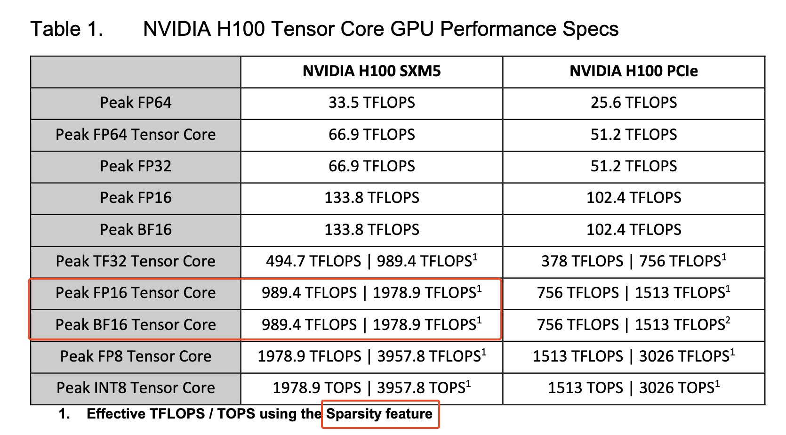
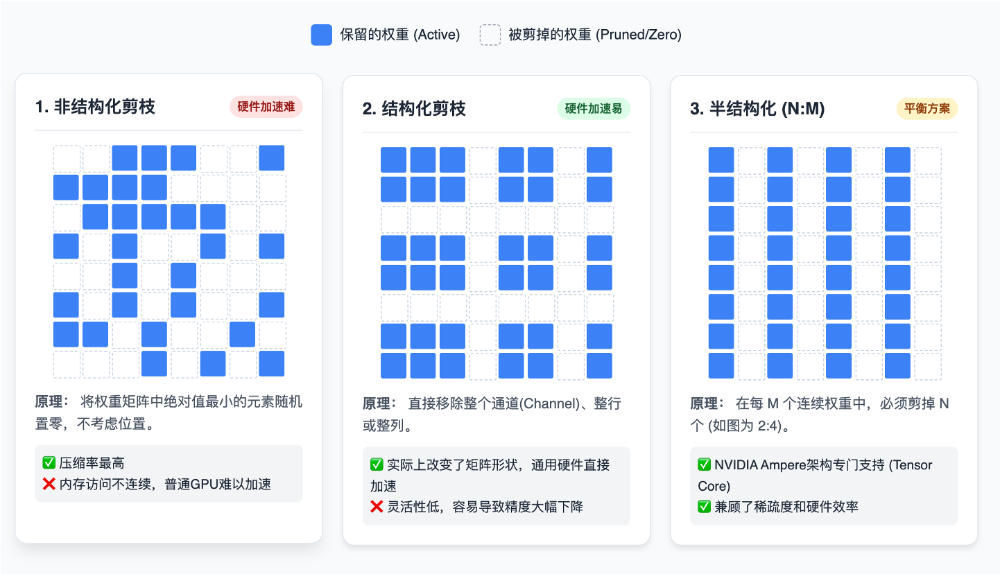
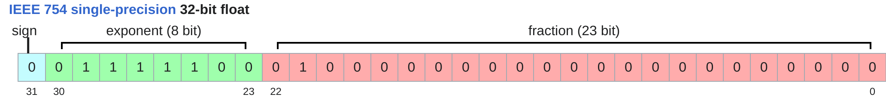
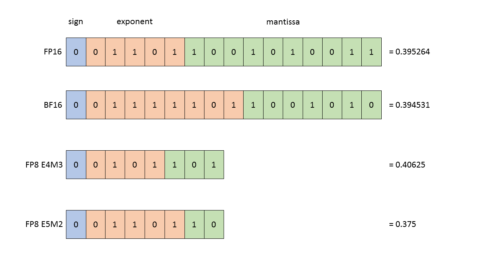
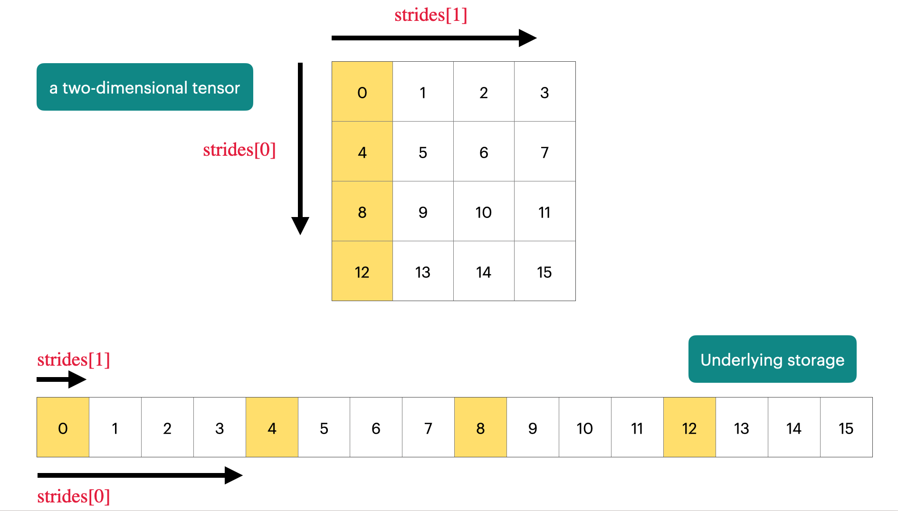
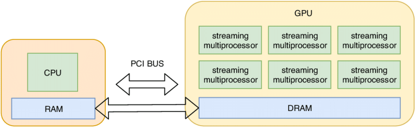

# 第 2 章 PyTorch 与资源核算

第 1 章讨论 tokenizer 如何把文本变成 token 序列。本章转向训练系统的底层账本：给定模型规模、token 数、batch、精度和硬件，如何估算训练要花多少 FLOPs、占多少显存、会不会被 HBM 带宽卡住。

本章保留 PyTorch 张量、自动微分、优化器和训练循环的基础示例，主线是资源核算。读完后应能回答三类问题：

1. **Compute**：一次前向/反向大约多少 FLOPs，硬件峰值和 MFU 如何转成训练时间。
2. **Memory capacity**：参数、梯度、优化器状态、activation、临时 buffer 分别占多少显存。
3. **Memory bandwidth**：同样的 FLOPs 为什么在大 batch matmul 中很快，在 decode 或逐元素算子中却可能很慢。

## 本章主线

按以下顺序阅读，每一节给读者一个可用的工程判断：

1. **§2.1 资源核算的入口**：用两个 napkin math 例子（70B / 15T / 1024 H100、8 H100 / AdamW 显存）建立数量级直觉，落到三类约束（compute / memory capacity / memory bandwidth）与 roofline。
2. **§2.2 张量（PyTorch 基础）**：shape / dtype / stride / view / contiguity / 矩阵乘法 / 逐元素算子 / einops，把后续资源账本用到的 PyTorch API 集中放在这里。可以先快速浏览，等读到具体 API 疑问再回来查。
3. **§2.3 内存（dtype 与存储机制）**：FP32 / FP16 / BF16 / FP8 / NVFP4 的字节数与权衡，stride 与 storage 怎样决定实际占用，CPU↔GPU 移动的代价。
4. **§2.4 计算效率**：把 $6 \times N_{\text{data}} \times N_{\text{param}}$ 的 FLOPs 账本套到具体算子，给出 arithmetic intensity / MFU 的来源。
5. **§2.5 模型构建与训练基础**：把 §2.1.3 的 4 元素账本（parameter / gradient / optimizer state / activation）落地到代码与训练循环，附 activation checkpointing 的最小实现。

返回路径：需要时通过「见 §X.Y」回查具体概念。

本章的 PyTorch 代码可以按”形状账本”来读：每个 tensor 的 shape 决定元素数和矩阵乘维度，每个 dtype 决定 bytes，每个中间激活是否保留决定反向传播显存。写一行 tensor 代码时，最好顺手问三件事：它会触发多少矩阵乘、会搬多少字节、反向传播还要保留什么。这样后面学习 [第 5 章 §5.7 FlashAttention](../chapter5/chapter5_GPU和GPU相关优化.md)、[第 7 章 §7.6 ZeRO / FSDP](../chapter7/chapter7_分布式训练.md) 和 [第 9 章 §9.3 模型与 KV cache 压缩](../chapter9/chapter9_推理系统.md) 时，才不会把性能问题只理解成”代码慢”。

阅读本章代码时，建议把变量名当成账本列： $B$ 通常表示 batch， $S$ 表示 sequence length， $D$ 表示 hidden dim（与 [第 3 章 语言模型架构和训练的技术细节](../chapter3/chapter3_语言模型架构和训练技术细节.md) 写作中的 $d_{\text{model}}$ 同义）， $d_k$ 表示 attention 头维度， $h$ 表示 attention 头数。一个 `einsum` 或 `matmul` 是否昂贵，取决于这些维度相乘后会产生多少元素、多少 FLOPs、多少中间张量。设备选择统一通过 `cuda_if_available()` 管理 CPU 回退。

另一个常用 helper 是 `get_promised_flop_per_sec(dtype)`。它按 GPU 代际和 dtype 估算理论峰值，用来把 FLOPs 账本转换成训练时间和 MFU 估算。

## 2.1 为什么需要资源核算？

在训练大型语言模型时，资源消耗直接转化为时间、成本和失败风险。先用两个数量级估算建立直觉：

### 2.1.1 场景一：时间估算

**问题：在 1024 张 H100 上训练一个 70B 参数模型，数据量为 15T tokens，大概要多久？**

这类问题不能等完整训练跑完再判断。大训练前需要先做 “napkin math”：用少量公开规格和训练公式完成数量级估算。H100 是 2026 年数据中心训练的主力型号之一，下面所有资源核算和 MFU 例子都按 H100 规格估算；B200 / Blackwell 与 H100 的差异集中在 FP8 / NVFP4 等低精度格式与显存代际，对应的章节在 §2.3.1 与 §2.4.1 单列说明。

#### 第一步：计算总工作量

FLOPs（Floating Point Operations，浮点运算次数）衡量执行过程中发生了多少浮点加减乘除。训练时间估算可以先落到总 FLOPs，再用硬件吞吐率和 MFU 换算成时间。语言模型预训练常用一个粗略公式：

$$
F_{\text{total}} \approx 6 \times N_{\text{param}} \times N_{\text{token}}
$$

> [!NOTE]
> 公式里的 **6** 倍来自前向和反向的粗略 FLOPs 账：前向传播约为 $2 \times$ 参数量（乘法+加法），反向传播计算梯度约为前向的 2 倍，也就是 $4 \times$ 参数量。本章沿用 §2.1.3 的口径，把 $N_{\text{param}}$ 收窄为非 embedding 参数量；70B 级别模型与总参数量相差通常小于 1%，粗估时可忽略。

代入数据：

$$
6 \times (70 \times 10^9) \times (15 \times 10^{12}) \approx 6.3 \times 10^{24} \text{ FLOPs}
$$

#### 第二步：计算硬件算力

查阅 [NVIDIA H100 的白皮书](https://www.nvidia.com/en-sg/data-center/h100/)，其 FP16/BF16 的峰值算力约为 **1979 TFLOP/s**（每秒万亿次浮点运算）。下面三张图按"数字总览 → 性能明细 → 稀疏路径"三个子问题展开。


*图 2.1-1 H100 数值细览*

图 2.1-1 给出 H100 各精度的总览峰值（dense / 2:4 sparse 两条口径），是后续查 H100 数字的入口。

但是要注意，这个值是 NVIDIA H100 GPU 在使用 FP16 或 BF16 数据类型、且启用结构化稀疏（Structured Sparsity）时可达到的理论最大计算吞吐量（[NVIDIA H100 datasheet](https://www.nvidia.com/en-sg/data-center/h100/)）。训练普通的稠密 Transformer（dense，无结构化稀疏）时，应按 dense 峰值估算，约为稀疏峰值的一半，即约 989.5 TFLOP/s。



*图 2.1-2 H100 性能明细*

图 2.1-2 把图 2.1-1 拆到 FP64 / FP32 / TF32 / BF16 / FP16 / FP8 / INT8 几条横向赛道，并区分 Tensor Core 与 CUDA Core。粗估训练时间时只需对照 BF16 / FP16 Tensor Core 那一行。



*图 2.1-3 三类稀疏剪枝对比（非结构化、结构化、N:M 半结构化）*

图 2.1-3 解释 H100 的 1,979 TFLOP/s 为什么是"含 2:4 稀疏"的数字：1,979 走的是右图 N:M 半结构化路径，dense Transformer 不能直接套这个峰值。

按剪枝粒度，常见稀疏方式分成三类（图 2.1-3 从左到右）：

- **非结构化剪枝**：按权重绝对值大小随机置零，不考虑位置；压缩率最高，但内存访问不连续，普通 GPU 难以直接加速。
- **结构化剪枝**：整通道（channel）、整行或整列地移除，矩阵形状本身改变，通用硬件可以直接加速，但灵活性低，容易导致精度大幅下降。
- **半结构化（N:M）**：在每 M 个连续权重中剪掉 N 个（例如 2:4 表示每 4 个里留 2 个），NVIDIA Ampere 架构的 Tensor Core 已原生支持，能兼顾稀疏度和硬件效率。

模型压缩中常说的 n:m 稀疏属于第三类，即每 m 个连续权重里剪掉 n 个，常见形式包括 2:4、4:8、8:16。H100 给出的 1,979 TFLOP/s 即对应 2:4 structured sparsity 路径；普通 dense Transformer 应按一半 (989.5 TFLOP/s) 估算。

上述 989.5 TFLOP/s 是 H100 的理论峰值，但实际运行模型时，由于各种软硬件开销，你几乎不可能达到 100% **模型算力利用率 (MFU, Model FLOPs Utilization)**，通常按 30%–60% 的利用率估算更现实。这里取 50% 用作后续估计。

- 单卡实际算力 $\approx (989.5 \times 10^{12}) \times 0.5 \approx 4.95 \times 10^{14} \text{ FLOP/s}$
- 1024 张卡总算力 $\approx 5.066 \times 10^{17} \text{ FLOP/s}$ 。

#### 第三步：得出结果

$$
T = \frac{W_{\text{total}}}{P_{\text{total}}} = \frac{6.3 \times 10^{24}}{5.066 \times 10^{17} \times 86400} \approx 143.9 \text{ 天}
$$

也就是约 144 天。这是一个数量级估算：它忽略了数据加载、通信、checkpoint 保存、重启和集群故障，但能快速判断预算是否现实。

实际计划中还要用小规模 benchmark 估计本训练栈的 MFU，避免直接套厂商峰值。如果把总算力过度取整为 $5 \times 10^{17}$，会得到约 146 天，仍在 143–146 天区间内，作为 napkin math 仍可接受。


### 2.1.2 场景二：内存估算

**问题：在 8 张 H100 GPU 上，使用 AdamW 优化器，按常见混合精度训练账本能放下多少参数？**

很多估算错误都来自只看参数本身。8 张 H100（每张 80GB）看似有 640GB 显存；若只按 BF16 参数 2 bytes 计算，似乎能放 320B 参数。但训练显存还要保存梯度和 optimizer states。

训练时，显存里存的不只是**参数（parameters）**，还有：
- **梯度（gradients）**：通常和参数同形状，BF16 账本中约 2 bytes/param（FP16 类似，但现代训练主用 BF16）。
- **optimizer states**：AdamW 需要保存每个参数的一阶矩估计和二阶矩估计，通常用 FP32，合计 8 bytes/param。

因此，一个常见的混合精度 AdamW 训练账本中，每个参数至少约 12 bytes：

- 参数：2 bytes
- 梯度：2 bytes
- AdamW 一阶矩与二阶矩：8 bytes

$$
N_{\max} = \frac{640 \times 10^9 \text{ bytes}}{12 \text{ bytes/param}} \approx 53\text{B}
$$

也就是约 530 亿参数。这个估算仍然偏乐观，因为没有计入依赖 batch、序列长度和层数的 activation，也没有计入通信缓冲、临时张量和框架碎片。若所有参数、梯度和 AdamW 状态都按 FP32 保存，每个参数至少约 16 bytes，上限会降到约 400 亿参数。现代训练通常还会组合混合精度、ZeRO/FSDP、activation checkpointing 和 gradient accumulation。

### 2.1.3 资源账的三类约束：compute、memory 与 bandwidth

资源核算同时看三类约束：

- **Compute**：训练普通 dense Transformer 时，常用粗估是 $6 \times N_{\text{param}} \times N_{\text{token}}$ ，其中 $N_{\text{param}}$ 是非 embedding 参数量， $N_{\text{token}}$ 是训练 token 数。这个估算适合早期预算判断，但长上下文、MoE、扩散式语言模型或特殊注意力结构会改变细节。
- **Memory capacity**：参数、梯度、优化器状态和激活都要占显存。AdamW 朴素训练中，优化器状态常常比参数本身更大；checkpointing、ZeRO/FSDP 和低精度训练都是在不同位置减内存。
- **Memory bandwidth**：推理、小 batch matmul 和逐元素算子经常受 HBM 带宽限制。roofline 分析用算术强度判断一个算子更可能是 compute-bound 还是 memory-bound。


*图 2.1-4 compute 与 memory bottleneck*

因此，估算训练时间时要在厂商峰值上乘以 MFU；估算最大模型时也要考虑 optimizer、activation、通信缓冲和碎片。H100、H200 与 B200 这类指标更适合作数量级估算样例，具体训练计划仍应通过 benchmark 验证。

#### Arithmetic intensity 与 roofline

算术强度（arithmetic intensity）定义为一个算子每搬运 1 byte 数据能完成多少 FLOPs：

$$
\text{arithmetic intensity}=\frac{\text{FLOPs}}{\text{bytes moved}}
$$

Roofline 模型把硬件抽象成两条上限：一条来自峰值算力，另一条来自内存带宽。算术强度低于硬件的临界点时，算子主要受 HBM 带宽限制，属于 memory-bound；高于临界点时，算子更可能受矩阵乘法单元或 Tensor Core 峰值限制，属于 compute-bound。

这个框架解释了很多 LLM 工程现象：大 batch 的矩阵乘法通常 compute-bound；逐元素 ReLU、LayerNorm、small batch matmul 和自回归 decode 更容易 memory-bound；FlashAttention、kernel fusion 和 tiling 的共同目标，是减少重复读写 HBM、提高每次搬运数据能完成的计算量。

以 H100 dense BF16 为例，理论计算峰值约为 $989.5$ TFLOP/s，HBM 带宽约为 $3.35$ TB/s，因此硬件临界算术强度约为：

$$
\frac{989.5 \times 10^{12}}{3.35 \times 10^{12}} \approx 295 \text{ FLOP/byte}
$$

低于这个值的算子更容易等数据，高于这个值的算子更容易等计算单元。下面的数量级估算都按 BF16 读写 2 bytes/element 计算：

| 算子 | FLOPs | 主要读写字节 | 算术强度 | 常见瓶颈 |
| --- | ---: | ---: | ---: | --- |
| ReLU on $n$ elements | $n$ | $4n$ | $\approx 0.25$ | memory-bound |
| GeLU on $n$ elements | $\approx 20n$ | $4n$ | $\approx 5$ | memory-bound |
| Dot product length $n$ | $\approx 2n$ | $\approx 4n$ | $\approx 0.5$ | memory-bound |
| Matrix-vector $n \times n$ | $\approx 2n^2$ | $\approx 2n^2$ | $\approx 1$ | memory-bound |
| Matrix-matrix $n \times n$ | $\approx 2n^3$ | $\approx 6n^2$ | $\approx n/3$ | large $n$ 时 compute-bound |

这张表解释了 MFU 经常低于 1 的原因：硬件承诺的是理想计算吞吐，实际算子还要付出 HBM 读写、kernel 启动、通信和调度成本。矩阵尺寸足够大时，算术强度随 $n$ 增长，Tensor Core 更容易被喂饱；逐元素算子和 matrix-vector 即使 FLOPs 很少，也可能因为反复搬数据成为端到端瓶颈。

#### One-layer / all-layer resource accounting

资源核算可以先从单层开始，再扩展到全模型。对一个 batch size 为 $B$ 、隐藏维度为 $D$ 、层数为 $L$ 的简化深度网络：

- 单层参数量约为 $D^2$ ，全模型参数量约为 $L D^2$ 。
- 单层激活约为 $B D$ ，如果每层都保存激活，全模型激活约为 $B D L$ 。
- 训练一步的矩阵乘法 FLOPs 可以粗略写成 $6 \times B \times N_{\text{param}}$ ，其中 $N_{\text{param}}$ 是参数量；它对应前向、反向传播到输入、反向传播到权重三部分。
- AdamW 训练时还要保存参数、梯度、一阶矩和二阶矩；如果参数和梯度为 BF16、优化器状态为 FP32，朴素估算约为每参数 2 + 2 + 8 = 12 bytes，另加激活和临时缓冲。

这个估算故意保留为数量级模型。真实 Transformer 还会加入 attention logits、KV、中间 FFN 激活、通信 buffer 和框架碎片；但先做 one-layer/all-layer resource accounting 能帮助判断问题主要出在计算、显存容量还是带宽。

#### Gradient accumulation 与 activation checkpointing

当目标全局 batch 太大而单卡显存放不下时，常用 **gradient accumulation**：把一个大 batch 拆成多个 micro-batch，依次前向/反向并累积梯度，最后再执行一次优化器更新。这样 activation memory 按 micro-batch 缩小，但计算量基本不变，训练吞吐会受到额外循环和通信时机影响。

**Activation checkpointing**（也称 gradient checkpointing 或 rematerialization）则是用额外计算换显存。前向时只保存部分检查点激活，反向时从最近检查点重新计算中间激活。若每层都保存激活，激活内存随 $O(L)$ 增长；若完全不保存，重计算开销会过高。实践中常按区间保存，使激活内存和重计算成本之间取得折中。

这两个技巧解决的是不同问题：gradient accumulation 调整 batch 的显存峰值和优化器更新频率；activation checkpointing 减少单次前向/反向必须保留的中间状态。二者常同时使用。

## 2.2 张量 (Tensors)

本节是 PyTorch 入门参考：把后续资源账本用到的张量基础 API 集中放在这里——shape / dtype / stride / view / contiguity / 矩阵乘法 / 逐元素算子 / einops。资源核算的主线是 §2.1、§2.3、§2.4、§2.5；本节服务于它们，读者可先按"目录层级"快速浏览，等读到具体算子或操作时再回来查代码形态与正确性。

### 2.2.1 张量基础

在深度学习中，张量（tensor）是存储一切的基础数据结构：模型参数、梯度、optimizer states、输入数据、activation 等都以张量形式存在。更多关于张量的知识可见 [PyTorch docs on tensors](https://docs.pytorch.org/docs/stable/tensors.html)。

PyTorch 提供了多种创建张量的方法：

```python
# 基础创建方式
x = torch.tensor([[1., 2, 3], [4, 5, 6]])  # 从Python列表创建
x = torch.zeros(4, 8)  # 4x8的零矩阵
x = torch.ones(4, 8)   # 4x8的全1矩阵
x = torch.randn(4, 8)  # 4x8的正态分布随机数

# 分配但不初始化值（用于自定义初始化的值）
x = torch.empty(4, 8)  # 未初始化的4x8矩阵
nn.init.trunc_normal_(x, mean=0, std=1, a=-2, b=2)  # 截断正态分布初始化，分布均值为0，标准差为1，截断范围，只保留[-2, 2]区间内的值，超出此范围的值会被重新采样
```

### 2.2.2 张量的操作

大多数张量都是通过对其他张量执行操作来创建的，每个操作都会占用一定的内存和计算资源。


#### 张量视图（view）

许多操作只是提供张量的一个不同“视图”。这不会创建副本，因此在一个张量中的修改会影响另一个。

```python
x = torch.tensor([[1., 2, 3], [4, 5, 6]])

# 这些操作不复制数据
y = x[0]           # 获取第0行
y = x[:, 1]        # 获取第1列
y = x.view(3, 2)   # 重塑为3x2
y = x.transpose(1, 0)  # 转置

# 验证是否共享存储
assert x.untyped_storage().data_ptr() == y.untyped_storage().data_ptr()  # 通过底层 UntypedStorage 的地址判断是否共享存储

# 注意：修改x会影响y
x[0][0] = 100
assert y[0][0] == 100  # 值也被修改
```

> [!WARNING]
> 并非所有视图都是“连续”的。当一个视图的数据在内存中不是按顺序存储时，它就是非连续的（Non-contiguous）。

转置后的张量是非连续的：
```python
x = torch.tensor([[1., 2, 3], [4, 5, 6]])
y = x.transpose(1, 0)
assert not y.is_contiguous()  # 非连续张量
```

你不能对非连续张量直接执行某些操作，比如再次 view:

```python
# 尝试重塑会失败
try:
    y.view(2, 3)
except RuntimeError as e:
    assert "view size is not compatible with input tensor's size and stride" in str(e)
```
如果需要对一个非连续张量进行进一步操作，可以先调用 .contiguous() 方法：

```python
# 解决方案：先使张量连续
y = x.transpose(1, 0).contiguous().view(2, 3)
assert x.untyped_storage().data_ptr() != y.untyped_storage().data_ptr()  # .contiguous() 触发了数据复制，底层 storage 地址不同
```

`.contiguous()` 会创建一个新的张量，并将数据按顺序复制到新的连续内存块中，这样后续操作就不会出错。

#### 逐元素操作（Element-wise Operations）

逐元素操作是对每个元素独立应用函数，并返回相同形状的新张量。当你对一个张量执行 `x.pow(2)` 或 `x + x` 时，操作会独立地作用于张量中的每一个数字，而不会像矩阵乘法那样考虑元素之间的行列关系。

下面代码演示了几个常用的逐元素数学函数。注意 `torch.equal` 要求两个张量的 dtype 与形状都一致，而 `sqrt` / `rsqrt` / 除法会把整数张量提升为浮点，所以这里的输入和比较目标都写成浮点：
```python
x = torch.tensor([1., 4, 9])
assert torch.equal(x.pow(2), torch.tensor([1., 16, 81]))    # 幂运算 (pow)，每个元素平方
assert torch.equal(x.sqrt(), torch.tensor([1., 2, 3]))      # 对每个元素开平方根
assert torch.equal(x.rsqrt(), torch.tensor([1., 1/2, 1/3])) # rsqrt 是 reciprocal of sqrt 的缩写，即对每个元素先开方再取倒数
```
基本的逐元素算术运算：
```python
assert torch.equal(x + x, torch.tensor([2., 8, 18])) # 每个元素自加
assert torch.equal(x * 2, torch.tensor([2., 8, 18])) # 每个元素乘以标量2
assert torch.equal(x / 0.5, torch.tensor([2., 8, 18])) # 每个元素除以标量0.5
```
最后，我们介绍了一个非常实用的工具函数 **triu**，这在计算 **因果注意力掩码（causal attention mask）** 时非常有用。在语言模型中，为了确保模型在预测第 j 个词时只能看到第 j 个词之前的词（即不能“偷看”未来信息），就需要使用这种上三角矩阵作为掩码。其中 M[i, j] 表示位置 i 对位置 j 的贡献，当 i > j 时（即 i 在 j 之后），贡献应为 0。

```python
# 实用操作：上三角矩阵（用于因果注意力掩码）
x = torch.ones(3, 3).triu()  # 创建一个3x3全1矩阵，然后取其上三角部分
# 结果：
# [[1, 1, 1],
#  [0, 1, 1],
#  [0, 0, 1]]
```

#### 矩阵乘法（Matrix Multiplication）

矩阵乘法是深度学习的基础。矩阵乘法是神经网络中最核心、最频繁的计算操作，无论是全连接层、卷积层还是注意力机制，其底层都离不开矩阵运算。

一个标准的矩阵乘法形式为：一个 $M \times K$ 的矩阵乘以一个 $K \times N$ 的矩阵，得到一个 $M \times N$ 的结果矩阵。示例如下：

```python
# 基本矩阵乘法
x = torch.ones(16, 32)  # 16x32矩阵
w = torch.ones(32, 2)   # 32x2权重矩阵
y = x @ w               # 结果：16x2矩阵
assert y.size() == torch.Size([16, 2])
```

在实际应用中，我们很少只处理单个数据样本。为了提高效率，我们会将多个样本打包成一个“批次”（batch），并对整个批次同时进行计算。下图展示了批量处理的操作：


*图 2.2-1 batch 与 sequence 维度上的矩阵乘法*

- `batch` 标签指向堆叠起来的多个矩形，代表一个批次中包含的多个样本。
- `sequence` 标签指向每个矩形内部，代表每个样本可能包含的序列长度（例如，一个句子中的词元数量）。


下面案例中，我们对前两个维度（batch 和 sequence）中的每个样本执行矩阵乘法：

```python
x = torch.ones(4, 8, 16, 32) # 形状为 [批大小, 序列长度, 样本特征, 特征维度]
w = torch.ones(32, 2)        # 权重矩阵
y = x @ w                    # 矩阵乘法
assert y.size() == torch.Size([4, 8, 16, 2]) # 结果形状
```

PyTorch 的矩阵乘法规则是「除最后两维外都按 batch 维广播」：x 的形状是 (4, 8, 16, 32)，最后两维做 $(16, 32) @ (32, 2) = (16, 2)$；前面三个维度 (4, 8, 16) 都作为 batch 维保留。最终结果 y 的形状是 (4, 8, 16, 2)。

### 2.2.3 使用 Einops 库对张量操作进行优化

在 PyTorch 中，张量维度通常是 `[batch, sequence, hidden]`。用原生 `.view()` 和 `.transpose()` 操作维度时，需要始终跟踪维度顺序；如果后续给模型加入 heads 维度，原来的下标写法很容易失配。

```python
x = torch.ones(2, 2, 3)  # batch, sequence, hidden
y = torch.ones(2, 2, 3)  # batch, sequence, hidden
z = x @ y.transpose(-2, -1)  # 得到 (batch, sequence, sequence)
```

更稳的写法是先用 jaxtyping 声明维度含义，再用 einops 操作张量，让代码里的维度关系接近公式。

#### 1. 用 jaxtyping 命名维度

```python
# 传统方式（容易写错维度顺序）
x = torch.ones(2, 2, 1, 3)  # batch seq heads hidden

# Jaxtyping方式（在类型注解中命名维度）
from jaxtyping import Float
x: Float[torch.Tensor, "batch seq heads hidden"] = torch.ones(2, 2, 1, 3)
```

`jaxtyping` 提供的维度命名（如 "batch seq hidden"）在当前 PyTorch 生态中主要是“文档性质”的，不会在运行时自动强制检查维度是否真的匹配名称，但它能极大地提升代码的清晰度和可靠性。下面这行注解声明了三个维度名，实际张量却只有两维，PyTorch 运行时不会报错：
```python
y: Float[torch.Tensor, "batch seq hidden"] = torch.randn(100, 5)  # 形状与注解严重不符
```
代码依然会正常运行，不会抛出任何错误。Python 的类型注解（Type Hints）本身是可选的、非强制的，主要用于工具（如 IDE、mypy）做静态分析，运行时不会自动校验。尽管不强制校验，jaxtyping 仍带来巨大工程价值，当你将来修改模型（比如增加 heads 维度）：
- 类型注解会让需要同步更新的位置更容易被发现。
- IDE（如 VS Code、PyCharm）能基于注解提供：
    - 自动补全
    - 重构支持（rename dimension）
    - 错误高亮（如果你在 einsum 中拼错了维度名）
> [!NOTE]
> `jaxtyping` 也提供可选的运行时检验，第三方库如 `beartype` 也能基于类型注解做运行时校验，读者感兴趣可自行探索。

#### 2. 用 einops.einsum 替代矩阵乘法 + 转置

广义矩阵乘法，具有清晰的维度跟踪：

```python
from einops import einsum

# 定义两个张量
x: Float[torch.Tensor, "batch seq1 hidden"] = torch.ones(2, 3, 4)
y: Float[torch.Tensor, "batch seq2 hidden"] = torch.ones(2, 3, 4)

# 传统方式
z = x @ y.transpose(-2, -1)  # batch, sequence, sequence

# Einops方式
z = einsum(x, y, "batch seq1 hidden, batch seq2 hidden -> batch seq1 seq2")
# 未在输出中命名的维度（hidden）会被自动求和
```
这种方法会将没在输出中出现的 hidden 维度自动求和，对应爱因斯坦求和约定（Einstein summation） 的直观实现。更通用的写法是（支持任意前导维度）：
```python
z = einsum(x, y, "... seq1 hidden, ... seq2 hidden -> ... seq1 seq2")
```

`...` 表示“任意数量的前导维度”，比如可能是 (device, batch) 或 (ensemble, batch, time)，代码依然适用。好处是维度逻辑显式、通用、不易出错，且天然支持广播。

#### 3. 用 einops.reduce 替代 mean(dim=...)

```python
from einops import reduce

x: Float[torch.Tensor, "batch seq hidden"] = torch.ones(2, 3, 4)

# 传统写法
y = x.mean(dim=-1)  # 对最后一个维度 hidden 上求平均

# Einops 写法
y = reduce(x, "... hidden -> ...", "mean")
```

从 `... hidden` 变成 `...`，说明 hidden 维度被“聚合”了，聚合方式是 `"mean"`（也可用 `"sum"`, `"max"` 等）。

同样，`...` 表示“任意数量的前导维度”。这种写法的好处是明确表达了“我打算把哪个维度压缩掉”，语义清晰。

#### 4. 用 einops.rearrange 拆分/合并维度

这是 Einops 很实用的功能之一，用于处理扁平化与重组。

假设你有一个维度 `total_hidden = 8`，它实际上是 `heads = 2` 和 `hidden1 = 4` 的乘积（即 $2 \times 4 = 8$ ），也就是 `total_hidden` 维度实际上是 $\text{heads} \times \text{hidden1}$ 的扁平化表示。

```python
from einops import rearrange

# 情景：hidden维度实际上是heads×hidden1的扁平化表示
x: Float[torch.Tensor, "batch seq total_hidden"] = torch.ones(2, 3, 8)
w: Float[torch.Tensor, "hidden1 hidden2"] = torch.ones(4, 4)
```

现在你想对 hidden1 做矩阵乘法，但当前维度是扁平的，我们需要对其进行**维度拆分**（flatten → multi-dim）：

```python
# 拆分 total_hidden为 heads 和 hidden1
x = rearrange(x, "... (heads hidden1) -> ... heads hidden1", heads=2)
```
(heads hidden1) 表示“这两个维度被乘在一起，现在我要拆开它”。因为 8 可以拆成 (2,4), (4,2), (8,1) 等，所以必须指定 heads=2 用来固定拆分后的维度。

对拆分后的维度做矩阵乘法：

```python
x = einsum(x, w, "... hidden1, hidden1 hidden2 -> ... hidden2")
```
最后，我们进行**维度合并**（multi-dim → flatten）的操作：
```python
# 合并维度
x = rearrange(x, "... heads hidden2 -> ... (heads hidden2)")
```

尽管 Einops 增加了少量语法开销，但其清晰的维度命名显著降低了调试难度，特别是在复杂的模型架构中，更多用法可见 [Einops tutorial](https://einops.rocks/1-einops-basics/)。

## 2.3 内存（Memory）


张量的内存占用由两个因素决定：

- 元素数量：张量的形状（如 $4 \times 8$ 矩阵有 32 个元素）
- 数据类型：每个元素占用的字节数

### 2.3.1 浮点类型

在 LLM 训练中，选择 dtype 就是在显存占用、计算速度与数值稳定性之间做权衡。我们关注的大多数张量（参数、梯度、activation、optimizer states）都以浮点数形式进行存储，因此需要理解不同浮点格式的取舍：

1. Float32 (FP32 / 单精度浮点数)



*图 2.3-1 FP32 数值格式*

*   **规格**：占用 **4 字节** (32 bits)。结构为：1 位符号位 + **8 位指数位** + 23 位尾数位。
*   **地位**：PyTorch 的默认数据类型，也是科学计算领域的“黄金标准”。
*   **优点**：数值精度高，动态范围大，训练最稳定，几乎不会出现数值溢出问题。
*   **缺点**：对于大模型而言太“奢侈”。它占用的显存是 16 位格式的两倍，且在现代 GPU（如 H100）上的计算吞吐量远低于低精度格式。
*   **训练用途**：通常用于存储 **master weights** 和 **optimizer states**，以确保梯度累积和参数更新时有足够的数值精度。


2. Float16 (FP16 / 半精度浮点数)


*图 2.3-2 FP16 数值格式*


*   **规格**：占用 **2 字节** (16 bits)。结构为：1 位符号位 + **5 位指数位** + 10 位尾数位。
*   **优点**：显存占用比 FP32 减少一半，计算速度快。
*   **主要限制**：**动态范围（dynamic range）太窄**。
    *   由于指数位只有 5 位，它无法表示非常小的数（会发生下溢 Underflow，直接变成 0）或非常大的数（会发生上溢 Overflow，变成 Infinity）。
    *   例如：在 FP16 中，`1e-8` 这样的小数会被直接当作 `0` 处理，导致梯度消失。
*   **用途**：这是上一代 GPU（如 V100）混合精度训练的主流。为了解决溢出问题，必须使用复杂的**损失缩放 (Loss Scaling)** 技术。目前在 LLM 训练中正逐渐被 BF16 取代。

3. BFloat16 (BF16 / Brain Floating Point)


*图 2.3-3 BF16 数值格式*

*   **规格**：占用 **2 字节** (16 bits)。结构为：1 位符号位 + **8 位指数位** + 7 位尾数位。
*   **来源**：由 Google Brain 专为深度学习设计。
*   **设计逻辑**：**“要范围，不要精度”**。
    *   深度学习模型（尤其是神经网络）对小数点的后几位精度不敏感，但对数值的范围非常敏感。
    *   BF16 直接截断了 FP32 的尾数，但**保留了和 FP32 相同的 8 位指数位**。
*   **优点**：
    *   拥有和 FP32 一样宽广的动态范围，**不需要 Loss Scaling** 也能稳定训练。
    *   显存占用和 FP16 一样少。
    *   在 A100/H100 等新硬件上计算速度极快。
*   **训练用途**：在现代 LLM 训练中常用于参数、activation 和梯度的低精度路径，并用于前向和反向传播中的矩阵乘法。

4. FP8 (8 位浮点数)



*图 2.3-4 FP8 数值格式*

*   **规格**：占用 **1 字节** (8 bits)。
*   **变体**：
    *   **E4M3**：4 位指数，3 位尾数（精度稍高，范围稍小）。
    *   **E5M2**：5 位指数，2 位尾数（范围稍大，精度更低）。
*   **优点**：极致的显存压缩和计算吞吐量。
*   **硬件限制**：Hopper/H100 开始原生支持 FP8；Blackwell/B200 又把更细粒度的缩放因子做成了更重要的硬件路径。
*   **Blackwell 语境下的新变化**：**MXFP8** 与 **MXFP4 / NVFP4** 这类格式按块携带缩放因子，减少异常值把整块动态范围拉坏的问题。
*   **训练用途**：自 H100 / Hopper 起 FP8 已通过 NVIDIA Transformer Engine、Microsoft FP8-LM 等库进入生产路径，但生产训练通常仍混合 BF16 master weight 与 FP8 matmul；安全降到 FP8 的张量范围、是否需要 E4M3 / E5M2 选择与 per-tensor / per-block 缩放，仍高度依赖硬件、kernel 和缩放策略。Blackwell 又把 MXFP8 / NVFP4 这类按块缩放格式推到生产级训练——例如 NVIDIA Nemotron 3 Super 用 NVFP4 在 25T token 数据集上完成预训练——但二者尚未成为普遍默认配置。

#### 为什么 BF16 通常比 FP16 更适合训练？

> [!NOTE]
> 深度学习训练通常不需要小数点后很多位的精确尾数，但非常依赖足够大的动态范围。FP16 的指数位较少，训练中更容易出现 `NaN` 或下溢到 `0`；BF16 截断 FP32 的尾数但保留 8 位指数位，因此数值范围接近 FP32，训练稳定性通常更好。


### 2.3.2 张量在内存中的存储机制

在 PyTorch 中，张量底层可以分成“指向数据的存储”和“解释数据的元数据”两部分来理解。元数据记录形状（size）、步长（stride）、数据类型（dtype）和设备等信息；数值放在连续或按 stride 解释的存储区里。早期 PyTorch 暴露过更独立的 `Storage` 概念，现代接口把这层细节封装得更多，读者只需要记住 Tensor 对象包含“指针 + 元数据”这一抽象。

因此，在现在的 PyTorch 版本中，PyTorch 的设计者们选择将这一层实现细节进行封装，让 Tensor 对象本身成为一个集成了“**指针+元数据**”的单一实体。一个张量本身并不直接“包含”数据，而是指向一块连续的内存区域，并附带一套规则（元数据），告诉程序如何根据你请求的索引去这块内存里找到对应的数据。下面定义一个 $4 \times 4$ 的二维张量作为例子：

```python
x = torch.tensor([
    [0., 1, 2, 3],
    [4, 5, 6, 7],
    [8, 9, 10, 11],
    [12, 13, 14, 15],
])
```
张量在底层可以是按行存储也可以是按列存储。Numpy 和 Pytorch 都采用了**按行存储**的方式，任何维度的张量在底层存储都占据着内存中连续的空间，那么问题来了，我们如何访问到我们想要的位置的数据？



*图 2.3-5 张量 storage 与 stride*


答案就是**步长（Strides）**！步长是一个元组，定义了在每个**维度**上移动一个单位时，在底层存储中需要“跳过”的元素数量。


```python
# 步长（stride）：在每个维度上移动时跳过的元素数
assert x.stride(0) == 4  # 行维度：移动到下一行需跳过4个元素
assert x.stride(1) == 1  # 列维度：移动到下一列需跳过1个元素

# 计算元素位置：行索引r，列索引c
r, c = 1, 2
index = r * x.stride(0) + c * x.stride(1)  # 位置6
```

PyTorch 通过 stride 这类元数据，把多维张量的逻辑结构映射到一维物理存储上。

**关键点：** 很多操作（如 `view`, `transpose`, `slice`）不会复制数据，只是修改 stride。这叫 **zero-copy**，可以减少内存分配和数据搬运。

```python
x = torch.randn(32, 32)
y = x.view(1024) # 只是改变了看待数据的方式，内存地址没变
z = x.transpose(0, 1) # 修改了 stride，没有复制数据
```

转置后的张量通常不再连续（contiguous）。此时直接调用 `.view()` 可能报错；先调用 `.contiguous()` 可以得到连续副本，但会触发数据复制并增加内存和时间开销。


### 2.3.3 将张量（tensors）从 CPU 内存移动到 GPU 内存

默认情况下，张量是存储在 CPU 内存上的，可以用 `get_memory_usage` 与 dtype 字节宽度核对：

```python
x = torch.zeros(32, 32)
assert x.device == torch.device("cpu")
```

但是，为了利用 GPU 的大规模并行性计加速计算，我们需要将它们移至 GPU 内存中。



*图 2.3-6 CPU 与 GPU 之间的数据移动*

上图左侧是中央处理器（CPU）和系统内存（RAM），右侧是图形处理器（GPU）及其专用高速显存（DRAM）。GPU 内部由多个 streaming multiprocessor 组成，这是其并行计算能力的来源。

CPU 和 GPU 通过 PCI bus 相连。数据在 CPU 和 GPU 之间传输时需要经过这条总线，带宽通常远小于 GPU 内部的 HBM 带宽。因此，实际训练中应尽量减少 CPU/GPU 往返传输，优先直接在目标设备上创建张量或把数据加载流水线做成异步。

后文示例统一使用一个小 helper 来选择设备：

```python
def cuda_if_available(index: int = 0) -> torch.device:
    if torch.cuda.is_available():
        return torch.device(f"cuda:{index}")
    return torch.device("cpu")
```

这个函数的作用只是把“有 CUDA 就用第 `index` 张 GPU，否则回退到 CPU”写清楚。后文示例沿用这个名字，避免突然出现未定义的设备选择函数。


在 PyTorch 中，想要将张量从 CPU 移至 GPU ，需要以下几个步骤：

- 首先，检测当前机器是否含 GPU：
    ```
    if not torch.cuda.is_available():
            return
    ```

- 然后，获取 GPU 信息：
    ```
    num_gpus = torch.cuda.device_count() # 获取GPU数量
    for i in range(num_gpus):
        properties = torch.cuda.get_device_properties(i) # 获取第i块GPU的属性（如型号、显存大小等）
    memory_allocated = torch.cuda.memory_allocated() # 获取当前已分配给PyTorch的显存总量
    ```
- 移动张量到 GPU 上有两种方法：

    - 方法一：移动现有张量
        ```
        y = x.to("cuda:0") # 将张量x移动到编号为0的GPU上
        assert y.device == torch.device("cuda", 0) # 验证移动成功
        ```
    - 方法二：直接在 GPU 上创建张量
        ```
        z = torch.zeros(32, 32, device="cuda:0") # 在GPU上直接创建一个32x32的零矩阵
        ```
    这种方法更高效，因为它避免了先在 CPU 创建再移动的过程。


- 最后，验证内存分配

    ```
    new_memory_allocated = torch.cuda.memory_allocated() # 再次查询当前显存占用
    memory_used = new_memory_allocated - memory_allocated # 计算新增的显存占用
    assert memory_used == 2 * (32 * 32 * 4) # 验证：新增了2个32x32的矩阵，每个元素是4字节的float
    ```

## 2.4 计算效率

### 2.4.1 浮点运算总数（FLOPs）

#### 概述

一个浮点运算（FLOP, Floating Point Operation）是一个基本的算术操作，比如加法 $x + y$ 或乘法 $x \times y$ 。理解 FLOPs 对性能分析至关重要。

首先，辨析几个常见概念：
- **FLOPs**（小写 s）：执行的浮点运算总数，这是一个衡量计算量的指标，
- **FLOP/s**（每秒浮点运算）：指硬件每秒能执行的浮点运算次数。这是一个衡量“速度”的指标。例如，H100 GPU 峰值性能为 989.5 TFLOP/s。

> [!WARNING]
> FLOPs 和 FLOP/s 写法相似，但含义完全不同。本章会明确区分它们，避免把“总工作量”和“吞吐速度”混在一起。

> [!TIP]
> 测 GPU 时间时还要记住 CUDA 的异步执行细节：很多 CUDA 调用只是在 CPU 侧把任务排进队列，Python 代码会先返回。若不在计时前后使用 `torch.cuda.synchronize()` 或 CUDA event，同一段 kernel 可能看起来“快得离谱”，因为你测到的是提交开销而非实际执行时间。

下面用一组例子建立 FLOPs 与 FLOP/s 的直观认识：

- GPT-3 (2020 年)：训练耗时约 $3.14 \times 10^{23}$ FLOPs [文章](https://lambda.ai/blog/demystifying-gpt-3)
- GPT-4 (2023 年)：据推测训练耗时约 $2 \times 10^{25}$ FLOPs [文章](https://patmcguinness.substack.com/p/gpt-4-details-revealed)
- 政策背景：美国曾有一项行政命令，要求任何训练 FLOPs 超过 $1 \times 10^{26}$ 的基础模型必须向政府报告（该命令已于 2025 年被撤销）
- NVIDIA A100：BF16/FP16 Tensor Core 峰值性能为 312 TFLOP/s（即 $3.12 \times 10^{14}$ FLOP/s）[官方手册](https://www.nvidia.com/content/dam/en-zz/Solutions/Data-Center/a100/pdf/nvidia-a100-datasheet-nvidia-us-2188504-web.pdf)
- NVIDIA H100：BF16/FP16 Tensor Core 峰值性能为 1979 TFLOP/s（含稀疏，sparsity）；dense 矩阵乘法约为一半，即 989.5 TFLOP/s [官方手册](https://resources.nvidia.com/en-us-tensor-core/nvidia-tensor-core-gpu-datasheet)

#### 线性模型的计算量

为了具体化 FLOPs 的计算方法，我们引入了一个简单的线性模型作为例子。这个线性模型有 B 个数据点，每个点是 D 维的，模型将其映射到 K 维输出。我们要做的核心操作是矩阵乘法 y = x @ w，目标是计算这个操作总共需要多少次浮点运算（FLOPs）？

```python
if torch.cuda.is_available():
    B = 16384  # Number of points
    D = 32768  # Dimension
    K = 8192   # Number of outputs
else:
    B = 1024
    D = 256
    K = 64
device = cuda_if_available()
x = torch.ones(B, D, device=device)
w = torch.randn(D, K, device=device)
y = x @ w
```

分析如下：

- x 是输入数据，形状为 (B, D)
- B：batch size（数据点数量）
- D：每个数据点的维度（输入特征数）
- w 是权重矩阵，形状为 (D, K)
- K：输出维度（比如分类任务的类别数）
- y 是输出，形状为 (B, K)

考虑 y = x @ w 中的一个输出元素 y[i, k]：

```python
y[i, k] = x[i, 0] * w[0, k] +
           x[i, 1] * w[1, k] +
           ...
           x[i, D-1] * w[D-1, k]
```
这个求和过程包含 D 次乘法（x[i, j] * w[j, k]）和 D - 1 次加法，总共 ≈ 2D 次 FLOPs（因为 D 通常很大，D - 1 ≈ D）

这条计数链给出理论工作量，代码 benchmark 再测实际 wall-clock。固定 $B,D,K$ 和 dtype，先用 $2BDK$ 估算 FLOPs，再用 CUDA event 测量时间；理论 FLOP/s 与实测值的差距来自内存搬运、kernel launch、并行度和硬件利用率，而不是 FLOPs 公式本身改变。

因此，矩阵乘法的计算量：**总 FLOPs** $\approx 2 \times B \times D \times K$

因为 $D \times K$ 正好是这个线性层的参数数量！所以我们可以重写为： $F_{\text{linear}} = 2 \times N_{\text{data}} \times N_{\text{param}}$ 。

或者在语言模型中，常用 token 代替数据点： $F_{\text{LM}} = 2 \times N_{\text{token}} \times N_{\text{param}}$ 。

> [!NOTE]
> 相比线性模型，Transformer 还包含注意力、LayerNorm、softmax 和激活函数等操作；但在普通 dense Transformer 的粗略 FLOPs 账里，矩阵乘法通常占主导，所以 $2 \times N_{\text{token}} \times N_{\text{param}}$ 仍然是很有用的一阶近似。

#### 其他操作的 FLOPs

- 逐元素操作（Element-wise Operations）：对张量中每个元素独立应用某个函数（如 x + 1、x.sqrt()、torch.relu(x) 等）。若张量形状为 $m \times n$ ，则逐元素操作的 FLOPs 为 $O(m \times n)$ 。
- 张量加法（Tensor Addition）：两个相同形状张量的对应元素相加，如 $z = x + y$ 。若 $x$ 和 $y$ 均为 $m \times n$ ，则总 FLOPs 为 $m \times n$ （每个元素 1 次加法）。

矩阵乘法 $A \in \mathbb{R}^{m \times k}$ 与 $B \in \mathbb{R}^{k \times n}$ 的 FLOPs 为 $2 \times m \times k \times n$ 。当 $k$ 较大时（如 $k = 1024$ ），矩阵乘法的 FLOPs 是加法的上千倍。

对于现代深度学习模型，尤其是 Transformer 和 MLP，主要 FLOPs 来自线性层、QKV 投影和 FFN 等矩阵乘法。LayerNorm、Softmax、激活函数和残差加法仍会影响延迟和带宽，但在粗略 compute 账本中通常先把所有矩阵乘法的 FLOPs 加起来。

理论上的 FLOPs 只是一个衡量计算量的数字，如何将 FLOPs 转化为实际运行时间呢？

```python
actual_time = time_matmul(x, w)  # 实际执行矩阵乘法所需的时间（秒）
actual_flop_per_sec = actual_num_flops / actual_time  # 实际每秒能完成多少次浮点运算
```

另外，FLOP/s 的性能很大程度上取决于数据类型！
```python
promised_flop_per_sec = get_promised_flop_per_sec(x.dtype)  # 获取硬件的理论峰值性能
```

`get_promised_flop_per_sec(dtype)` 只接收 dtype；设备信息在函数内部通过 `torch.cuda.get_device_properties(cuda_if_available())` 取得。它按 GPU 名称匹配 **A100 / H100 / B200** 三个分支，再按 `float32 / bf16 / fp16` 返回不同的理论峰值：A100 是 19.5 / 312 TFLOP/s，H100 是 67.5 / 989.5 TFLOP/s（NVIDIA H100 产品页把 FP32 标为 67 TFLOPS，CS336 代码讲义中的 `get_promised_flop_per_sec` 取整到 67.5；1979 是稀疏口径，dense 取一半），B200 是 75 TFLOP/s / 2.25 PFLOP/s；GPU 名称不落在这三个分支时返回 `None`，由调用方处理。H200 目前就属于这条 fall-through 路径——helper 不会自动返回 H200 的数字，调用方要么显式处理 `None`，要么把 H200 加进 helper 的分支表。需要 H200 数字时可直接查产品页：它沿用 Hopper SM 与 FP8/FP16 路径，BF16 Tensor Core 同样为 1,979 TFLOPS（含稀疏）、dense 989.5 TFLOP/s，差异集中在显存换成 141 GB HBM3e、带宽抬到 4.8 TB/s（[NVIDIA H200 产品页](https://www.nvidia.com/en-us/data-center/h200/)，查阅日期 2026-09-03）。

这个 helper 体现的是一个实用工程习惯：同样的 FLOPs 公式可以复用，但换到不同代际 GPU 时，峰值算力、带宽和低精度路径都要重新代入。

### 2.4.2 MFU (Model FLOPs Utilization)

MFU 是 measured FLOP/s 与 promised FLOP/s 的比值。它衡量实际运行时达到了硬件承诺吞吐率的多少比例：

$$
\mathrm{MFU} = \frac{P_{\text{measured}}}{P_{\text{peak}}}
$$

*   MFU >= 0.5：通常已经说明矩阵乘法等核心路径利用率较高。
*   MFU 接近 1.0：非常难达到，因为实际训练会受到内存访问、kernel 启动、通信、数据加载和框架调度等开销影响。

> [!WARNING]
> 这个公式**忽略了通信和系统开销**，只关注纯粹的计算效率。

在 bfloat16 路径上计算 MFU：

```python
# 将张量转换为 bfloat16
x = x.to(torch.bfloat16)
w = w.to(torch.bfloat16)

# 测量实际性能
bf16_actual_time = time_matmul(x, w)
bf16_actual_flop_per_sec = actual_num_flops / bf16_actual_time

# 获取 bfloat16 的理论峰值
bf16_promised_flop_per_sec = get_promised_flop_per_sec(x.dtype)

# 计算 MFU
bf16_mfu = bf16_actual_flop_per_sec / bf16_promised_flop_per_sec
```

使用 bfloat16 时，`actual_flop_per_sec` 通常比 float32 更高，因为硬件对低精度矩阵乘法有专门优化。如果 MFU 明显偏低，下一步应同时检查 arithmetic intensity、矩阵尺寸、dtype、kernel 选择和同步计时方式；这些维度共同决定低精度路径的实际峰值，单独看任何一项都可能掩盖瓶颈来源。


### 2.4.3 PyTorch 中的梯度计算

到目前为止，我们已经构建了张量（对应于参数或数据），并将它们传递给操作（前向传播）。现在，我们将计算梯度（反向传播）。

#### 梯度反向传播

我们继续以一个简单的线性模型为例： $y = 0.5 \times (xw - 5)^2$ 。

这里，x 是输入数据，w 是模型参数，y 是损失值。

前向传播代码:
```python
x = torch.tensor([1., 2, 3]) # 输入数据，不需要计算梯度
w = torch.tensor([1., 1, 1], requires_grad=True) # 模型参数，需要计算梯度
pred_y = x @ w # 预测值（矩阵乘法）
loss = 0.5 * (pred_y - 5).pow(2) # 计算损失值
```
requires_grad=True 这个参数它告诉 PyTorch “请为这个张量 w 构建计算图，并在反向传播时计算它的梯度。” 对于输入数据 x，我们通常不需要它的梯度，所以不设置此标志。

反向传播代码：
```python
loss.backward() # 触发反向传播
assert loss.grad is None # 损失值 loss 本身是一个标量，它没有“上游”的梯度，所以它的 .grad 属性是 None
assert pred_y.grad is None # 中间变量 pred_y 默认情况下也不会保存梯度，除非你显式地调用 pred_y.retain_grad()
assert x.grad is None # 因为 x 在创建时没有设置 requires_grad=True，所以它不会被追踪，其 .grad 也为 None
assert torch.equal(w.grad, torch.tensor([1, 2, 3])) # 验证模型参数 w 的梯度是否计算正确
```
调用 loss.backward() 后，PyTorch 会从 loss 开始，沿着计算图回溯，自动计算出每个需要梯度的张量的梯度。

#### 计算反向传播（梯度）所需的浮点运算次数

回顾 §2.4.1 中定义的线性模型，并将其扩展为一个简单的两层线性模型：

```python
if torch.cuda.is_available():
    B = 16384  # Number of points
    D = 32768  # Dimension
    K = 8192   # Number of outputs
else:
    B = 1024
    D = 256
    K = 64
device = cuda_if_available()
x = torch.ones(B, D, device=device)
w1 = torch.randn(D, D, device=device, requires_grad=True)
w2 = torch.randn(D, K, device=device, requires_grad=True)
```

计算图可以写成：

```text
x --w1--> h1 --w2--> h2 -> loss
```

```python
h1 = x @ w1 # 第一层：输入x乘以权重w1得到隐状态h1
h2 = h1 @ w2 # 第二层：h1乘以权重w2得到输出h2
loss = h2.pow(2).mean()  # 计算损失（均方误差）
```

回顾一下前向传播 FLOPs 的计算，第一层 `x @ w1` 需要 $2 \times B \times D \times D$ FLOPs；第二层 `h1 @ w2` 需要 $2 \times B \times D \times K$ FLOPs。记前向总 FLOPs 为 $F_{\text{forward}}$ ，则：

$$
F_{\text{forward}} = (2 \times B \times D \times D) + (2 \times B \times D \times K)
$$

反向传播 FLOPs 计算如下：调用 `loss.backward()` 后，PyTorch 需要计算以下四个梯度：
- `h1.grad`：中间 activation 的梯度，对应 $\partial L / \partial h_1$
- `h2.grad`：最后一层输出的梯度，对应 $\partial L / \partial h_2$
- `w1.grad`：第一层权重的梯度，对应 $\partial L / \partial W_1$
- `w2.grad`：第二层权重的梯度，对应 $\partial L / \partial W_2$

重点分析 `w2.grad` 的计算。根据链式法则，第二层的前向关系和权重梯度关系是：

$$
h_2 = h_1 W_2,
\qquad
\frac{\partial L}{\partial W_2} = h_1^{\mathrm{T}} \,\frac{\partial L}{\partial h_2}
$$

展开到元素级别：

$$
\frac{\partial L}{\partial W_{2}[j,k]} = \sum_{i} h_{1}[i,j]\, \,\frac{\partial L}{\partial h_{2}[i,k]}
$$

其中 $i$ 为 batch 维下标（与上文 $h_1$ 的行对应）。为避免把 PyTorch 属性名直接写进公式，先定义数学记号：

$$
G_{h_2} = \frac{\partial L}{\partial h_2},
\qquad
G_{W_2} = \frac{\partial L}{\partial W_2}
$$

它们在代码中分别对应 `h2.grad` 和 `w2.grad`。于是：

$$
G_{W_2}[j,k] = \sum_i h_1[i,j] \cdot G_{h_2}[i,k],
\qquad
G_{W_2} = h_1^{\mathrm{T}} G_{h_2}
$$

这对应一个矩阵乘法。相关形状如下：

- $h_1$ 的形状是 $(B, D)$ 。
- $G_{h_2}$ 的形状是 $(B, K)$ 。
- $h_1^{\mathrm{T}} G_{h_2}$ 的形状是 $(D, K)$ ，正好对应 `w2.grad`。

因此，计算 `w2.grad` 的 FLOPs 为 $2 \times B \times D \times K$ 。

为了将梯度继续传回第一层（随后才能计算 `w1.grad`），需要先求 $\partial L / \partial h_1$ 。由 $h_2 = h_1 W_2$ 对 $h_1$ 求导得：

$$
\frac{\partial L}{\partial h_1} = \frac{\partial L}{\partial h_2} \, W_2^{\mathrm{T}}
$$

展开到元素级别：

$$
\frac{\partial L}{\partial h_{1}[i,j]} = \sum_{k} \frac{\partial L}{\partial h_{2}[i,k]}\, \, W_{2}[j,k]
$$

其中 $k$ 为输出维下标。记 $G_{h_1} = \partial L / \partial h_1$ ，它在代码中对应 `h1.grad`。则元素形式和矩阵形式分别为：

$$
G_{h_1}[i,j] = \sum_k G_{h_2}[i,k] \cdot W_2[j,k],
\qquad
G_{h_1} = G_{h_2} \, W_2^{\mathrm{T}}
$$

$W_2$ 的形状是 $(D, K)$，$G_{h_2}$ 的形状是 $(B, K)$。因此，$G_{h_2} W_2^{\mathrm{T}}$ 的形状为 $(B, D)$，与 `h1.grad` 一致。计算 `h1.grad` 的 FLOPs 也是 $2 \times B \times D \times K$。

同理，第一层的前向关系和权重梯度关系是：

$$
h_1 = x\, W_1,
\qquad
\frac{\partial L}{\partial W_1} = x^{\mathrm{T}}\,\frac{\partial L}{\partial h_1}
$$

展开到元素级别：

$$
\frac{\partial L}{\partial W_{1}[j,k]} = \sum_{i} x[i,j]\, \,\frac{\partial L}{\partial h_{1}[i,k]}
$$

记 $G_{W_1}$ 对应代码里的 `w1.grad`，则：

$$
G_{W_1}[j,k] = \sum_i x[i,j] \cdot G_{h_1}[i,k],
\qquad
G_{W_1} = x^{\mathrm{T}} \, G_{h_1}
$$

其 FLOPs 为 $2 \times B \times D \times D$ 。

这类深度线性网络可以按层展开成一条 activation 链。前向传播从 $x$ 依次产生 $h_1, h_2, \ldots$；反向传播沿相反方向传回梯度，并为每一层权重计算参数梯度。


*图 2.4-1 深度线性网络中的 activation 与梯度流*

图 2.4-1 用三层 linear + ReLU 串成的深度线性网络示意 activation 流，每一层把 $B \times D$ 的输入线性映射成 $B \times D$ 的输出，再过 ReLU 进入下一层；下面按层展开的 FLOPs 推导为了书写简洁使用一个两层纯线性（无 ReLU）的网络，结论对更多层同样成立。

- 对于 `w2`：计算 `w2.grad` 和 `h1.grad` 总共需要 $4 \times B \times D \times K$ 次 FLOPs。
- 对于 `w1`：计算 `w1.grad` 总共需要 $2 \times B \times D \times D$ 次 FLOPs（`x` 是叶子，不为 `w1` 层额外计算 input grad；weight-grad matmul 形状 $(D, D)$，按 `2 BDD` 计算）。

记反向总 FLOPs 为 $F_{\text{backward}}$ ，则：

$$
F_{\text{backward}} = (2 \times B \times D \times D) + (4 \times B \times D \times K)
$$

通过上述计算，可以得到一个常用的一阶结论：在深度学习中，**训练一次（前向+反向）的总 FLOPs 约等于 6 倍的“数据点数量乘以参数数量”**。这个结论也是 2.1.1 中训练总计算量估算公式的由来。

## 2.5 模型构建与训练基础

### 2.5.1 参数初始化 (Initialization)

现在我们动手写代码。我们将构建一个简单的深度线性网络（Deep Linear Network），并手动实现优化器。

#### 模型参数的存储

在 PyTorch 中，可训练的模型参数被封装为 nn.Parameter 对象：

```python
w = nn.Parameter(torch.randn(input_dim, output_dim))
```
nn.Parameter 是 torch.Tensor 的子类，因此它“表现得像一个张量”，可以进行所有张量操作。它有一个 .data 属性，用于访问其底层的 torch.Tensor 数据。

#### 参数初始化的重要性及常用方法

如果你直接用 `torch.randn` 进行**标准高斯分布初始化**参数，随着层数变深，数值会变得非常大（爆炸）或非常小（消失）。
```python
x = nn.Parameter(torch.randn(input_dim)) # 输入向量
output = x @ w # 输出向量
```
当输入与权重都用 `torch.randn`（即 `x_j ~ N(0,1)`、`W_{ij} ~ N(0,1)`）独立采样时，$y_i = \sum_j W_{ij} x_j$ 的方差满足 $\mathrm{Var}(y_i) = \sum_j \mathrm{Var}(W_{ij})\mathrm{Var}(x_j) = n$（[Goodfellow et al. *Deep Learning* §8.4 Parameter Initialization Strategies](https://www.deeplearningbook.org/contents/optimization.html)），所以 `output` 的标准差为 $\sqrt{n} = \sqrt{\text{input\_dim}}$。例如 `input_dim = 16384` 时 `output` 标准差约为 128，远大于 `x` 的标准差 1，会逐层放大导致梯度爆炸（gradient explosion），使训练过程变得极不稳定，甚至无法收敛。

为了克服这个问题，需要一种对输入维度 `input_dim` 不敏感的初始化方法。CS336 代码讲义采用按 fan-in 缩放：权重除以输入维度的平方根 $\sqrt{d_{\text{in}}}$ ，把 $\mathrm{Var}(y_i)$ 拉回 $O(1)$ 。这里的 $d_{\text{in}}$ 对应代码里的 `input_dim`。

区分两个容易混用的名字： $W_{ij} \sim U[-1/\sqrt{n}, 1/\sqrt{n}]$ 这种只看 fan-in 的缩放，在 Glorot 与 Bengio 的论文里叫 **standard initialization**（式 1），是他们用作对照的基线；论文提出的 **Xavier / Glorot 初始化**（式 16）同时兼顾前向激活方差与反向梯度方差，取

$$
W \sim U\left[-\sqrt{\frac{6}{n_{\text{in}} + n_{\text{out}}}},\ \sqrt{\frac{6}{n_{\text{in}} + n_{\text{out}}}}\right]
$$

PyTorch 的 `nn.init.xavier_uniform_` 就按 $a = \text{gain} \times \sqrt{6 / (\text{fan\_in} + \text{fan\_out})}$ 取均匀分布边界。当 $n_{\text{in}} = n_{\text{out}}$（本节 `Linear(dim, dim)` 的情形）时两者只差一个常数因子 $\sqrt{3}$ ，所以按 $1/\sqrt{d_{\text{in}}}$ 缩放在数量级上等价。

相关资料可见 [Xavier 初始化论文](https://proceedings.mlr.press/v9/glorot10a/glorot10a.pdf) 和 [Stack Exchange 讨论](https://ai.stackexchange.com/questions/30491/is-there-a-proper-initialization-technique-for-the-weight-matrices-in-multi-head)。

```python
w = nn.Parameter(torch.randn(input_dim, output_dim) / np.sqrt(input_dim))
```
经过缩放后，输出 output 的每个元素的值变得稳定在一个较小的范围内，不再随 input_dim 增长。

即使按 fan-in 缩放，由于正态分布的尾部是无界的，仍然存在产生极端值（outliers）的可能性。解决方案是使用**截断正态分布（truncated normal distribution）**，把落在截断区间外的采样值重新抽取，直到落进区间内。

```python
w = nn.Parameter(nn.init.trunc_normal_(torch.empty(input_dim, output_dim),
                                      std=1 / np.sqrt(input_dim),
                                      a=-3, b=3))
```

`nn.init.trunc_normal_` 的 `a` 与 `b` 是**绝对**截断值，不是 $\sigma$ 的倍数（[PyTorch `nn.init` 文档](https://docs.pytorch.org/docs/stable/nn.init.html)）。要真正截在 $\pm 3\sigma$，`a`/`b` 需要随 `std` 一起缩放，写成 `a=-3*std, b=3*std`；本节 §2.2.1 那段 `std=1, a=-2, b=2` 因为 `std` 恰好是 1，才等价于 $\pm 2\sigma$。

### 2.5.2 使用 pytorch 自定义模型

这一节是关于如何在 PyTorch 中从零开始构建一个自定义的深度线性模型（deep linear model）。它展示了使用 nn.Parameter 来定义可学习参数，并通过组合这些参数来创建一个简单的神经网络。

**定义模型结构**。这里定义了一个名为 Cruncher 的自定义模型类，它是一个“深度线性模型”，包含 num_layers 个隐藏层和一个输出层。

```python
D = 64 # Dimension
num_layers = 2
model = Cruncher(dim=D, num_layers=num_layers)
```
Cruncher 类将多个 Linear 层组合在一起，形成一个更深的网络。在 __init__ 方法中，使用 nn.ModuleList 创建一个包含 num_layers 个 Linear 层的列表。每个 Linear 层的输入和输出维度都是 dim，维度本身是“恒等”变换，但内部的权重是可学习的。
```python
class Cruncher(nn.Module):
    def __init__(self, dim: int, num_layers: int):
        super().__init__()
        self.layers = nn.ModuleList([
            Linear(dim, dim)
            for i in range(num_layers)
        ])
        self.final = Linear(dim, 1)  # 创建一个最终的 Linear 层，它将 dim 维的特征映射到 1 维的标量输出
    def forward(self, x: torch.Tensor) -> torch.Tensor:
        # Apply linear layers
        B, D = x.size()
        for layer in self.layers:
            x = layer(x)
        # Apply final head
        x = self.final(x)
        assert x.size() == torch.Size([B, 1])
        # Remove the last dimension
        x = x.squeeze(-1) # 移除最后一个维度（即大小为1的那个维度），使得最终输出是一个一维张量 (B,)，更符合我们对“预测值”的直观理解（例如，对每个样本输出一个分数）
        assert x.size() == torch.Size([B])
        return x

```
Linear 类实现了神经网络中最基本的构建块——线性层（也称为全连接层或密集层）。
```python
class Linear(nn.Module):
    """Simple linear layer."""
    def __init__(self, input_dim: int, output_dim: int):
        super().__init__()
        self.weight = nn.Parameter(torch.randn(input_dim, output_dim) / np.sqrt(input_dim))
    def forward(self, x: torch.Tensor) -> torch.Tensor:
        return x @ self.weight
```


**检查模型参数**。使用 model.state_dict() 将返回一个字典，包含了模型中所有可学习参数（nn.Parameter）的名称和值

```python
param_sizes = [
    (name, param.numel())  # param.numel()：返回该参数张量中的元素总数
    for name, param in model.state_dict().items()
]
assert param_sizes == [
    ("layers.0.weight", D * D),
    ("layers.1.weight", D * D),
    ("final.weight", D),
]
```

**将模型移至 GPU**。在实际训练中，为了利用 GPU 的并行计算能力，需要将模型和数据移动到 GPU 上。`cuda_if_available()` 函数会自动选择可用的 GPU 或 CPU。

```python
device = cuda_if_available()
model = model.to(device)
```
**在数据上运行模型**。创建一个批次大小为 B=8 的随机输入数据 x，调用 model(x) 执行前向传播，得到输出 y。验证输出 y 的形状为 (B,)，即每个样本对应一个标量输出。
```python
B = 8 # Batch size
x = torch.randn(B, D, device=device)
y = model(x)
assert y.size() == torch.Size([B])
```


### 2.5.3 如何管理随机性（Randomness）以确保结果的可重现性

#### 随机性的来源
随机性在深度学习的许多地方都会出现：

- 参数初始化：模型权重通常从随机分布（如正态分布）中采样。
- Dropout：训练时随机“关闭”一部分神经元。
- 数据排序：数据加载器通常会打乱数据顺序。
- 其他：如数据增强、优化器中的动量等。

这些随机性会导致每次运行代码时得到不同的结果，这在调试和比较不同模型时是一个巨大的障碍。为了确保实验的可靠性和可比性，我们需要让程序的行为是确定性的（Deterministic）。

#### 设置随机种子的方法

有三个主要的库需要分别设置随机种子，通常在程序开始时一次性全部设置。

1. PyTorch

下面是设置 PyTorch 自身随机数生成器的种子，影响所有使用 torch.randn、torch.randint 等函数的操作。

```python
seed = 0
torch.manual_seed(seed)
```

2. NumPy

许多数据预处理操作（如数据加载、划分）都依赖于 NumPy 的随机函数，因此也需要单独设置其种子。

```python
import numpy as np
np.random.seed(seed)
```

3. Python 标准库 (random)

Python 内置的 random 模块也常用于数据打乱等操作，同样需要设置种子。
```python
import random
random.seed(seed)
```

> [!TIP]
> 虽然你也可以为每个随机源设置不同的种子（例如固定初始化但允许数据变化），但在大多数情况下，为了确保完全可重现，最简单、最安全的做法是将这三个种子都设为同一个值。


### 2.5.4 数据加载

在语言建模中，输入数据通常是经过分词器（tokenizer）处理后的整数序列。例如，句子 "Hello world" 可能被编码为 [1, 2]。为了方便处理，这些整数序列通常会被保存为 NumPy 数组文件（.npy 格式）。

```python
orig_data = np.array([1, 2, 3, 4, 5, 6, 7, 8, 9, 10], dtype=np.int32)
orig_data.tofile("data.npy") # 将数组保存到文件
```

对于 LLaMA-1（[arXiv:2302.13971](https://arxiv.org/abs/2302.13971)）这类典型 ~4.7 TB（按 Table 1 累加：CommonCrawl 3.3 TB + C4 783 GB + Github 328 GB + Wikipedia 83 GB + Books 85 GB + ArXiv 92 GB + StackExchange 78 GB）的超大数据集，不可能将其全部加载到内存中。解决方案是使用 `numpy.memmap` 创建一个"内存映射"对象。

```python
data = np.memmap("data.npy", dtype=np.int32) # 创建内存映射
assert np.array_equal(data, orig_data) # 验证加载的数据是否正确
```
data 对象本身不包含数据，而是一个指向磁盘上文件的“指针”。当你访问 data[0] 或 data[1:10] 时，系统才会按需将这部分数据从磁盘加载到内存中。这种方式极大地节省了内存占用，允许你在内存有限的情况下处理远超内存大小的数据集。

在实际训练中，我们不会直接操作整个数据集，而是通过一个“数据加载器”来生成训练所需的批次。

```python
B = 2  # 批次大小，即一次训练处理多少个样本
L = 4  # 序列长度，即每个样本包含多少个词元（token）
x = get_batch(data, batch_size=B, sequence_length=L, device=cuda_if_available())
assert x.size() == torch.Size([B, L]) # 验证输出张量的形状
```
调用 `get_batch` 函数会从 data 中随机采样 B 个起始位置，然后截取每个位置后长度为 L 的序列，最终返回一个形状为 (B, L) 的张量 x

详细看下 `get_batch` 函数的内部处理逻辑：

```python
def get_batch(data: np.ndarray, batch_size: int, sequence_length: int, device: str) -> torch.Tensor:
    # 随机采样起始位置
    start_indices = torch.randint(len(data) - sequence_length, (batch_size,)) # 使用 torch.randint 在 [0, len(data) - sequence_length] 范围内随机生成 batch_size 个起始索引。这样可以确保每个序列都能完整地从数据中截取出来，不会越界
    assert start_indices.size() == torch.Size([batch_size]) # 断言验证了生成的索引数量正确

    # 根据起始索引提取数据
    x = torch.tensor([data[start:start + sequence_length] for start in start_indices]) # 遍历 start_indices 中的每一个起始位置 start，从 data 中切片出长度为 sequence_length 的子序列。最后将这些子序列转换成一个 PyTorch 张量 x，其形状为 (batch_size, sequence_length)
    assert x.size() == torch.Size([batch_size, sequence_length])

    # 固定内存（Pinned Memory）优化
    if torch.cuda.is_available():
        x = x.pin_memory()

    # 异步数据传输
    x = x.to(device, non_blocking=True)
```
这个函数的核心功能是从一个巨大的一维数组 data 中随机抽取 batch_size 个序列，每个序列长度为 sequence_length。

参数说明：
- data: 输入数据，是一个 NumPy 数组，通常是经过分词器处理后的整数序列。
- batch_size: 要采样的批次大小。
- sequence_length: 每个序列的长度。
- device: 目标设备（如 "cuda:0" 或 "cpu"）。

**固定内存（Pinned Memory）优化**：默认情况下 CPU 上的张量存储在分页内存（paged memory）中。当需要将数据从 CPU 传输到 GPU 时，操作系统通常要先把数据复制到非分页内存，再通过 PCIe 总线发送给 GPU。

这个过程会阻塞当前进程。调用 `.pin_memory()` 可以将 CPU 张量标记为固定内存，使 GPU 驱动程序能够更直接地访问这块内存，减少额外拷贝。

**异步传输**：设置 non_blocking=True 参数，这告诉 PyTorch 数据传输可以在后台异步进行，不会阻塞当前的 Python 线程

通过结合“固定内存”和“异步传输”，我们可以实现以下高效的流水线操作：
- 在 GPU 上处理当前批次的数据。
- 在 CPU 上同时加载下一个批次的数据（例如，从硬盘读取或从内存映射文件中加载）。

这种并行化可以显著减少 GPU 的空闲等待时间，从而大幅提升整体训练吞吐量


关于数据加载更多优化的知识，可以参考：

- [How to Optimize Data Transfers in CUDA C/C++](https://developer.nvidia.com/blog/how-optimize-data-transfers-cuda-cc/)
- [Tricks to Speed Up Data Loading with PyTorch](https://gist.github.com/ZijiaLewisLu/eabdca955110833c0ce984d34eb7ff39?permalink_comment_id=3417135)


### 2.5.5 优化器 (Optimizer)

#### 常用优化器介绍

- SGD (随机梯度下降)：最基础的优化器，直接用学习率乘以梯度更新参数。
- Momentum (动量法)：在 SGD 基础上增加了一个“动量”项，即梯度的指数移动平均值，有助于加速收敛并减少震荡。
- AdaGrad：根据历史梯度的平方值来调整每个参数的学习率，对稀疏特征更友好。
- RMSProp：对 AdaGrad 的改进，使用梯度平方的指数加权平均代替简单累加，避免学习率过早衰减。
- Adam：融合了 RMSProp 和 Momentum 的思想，是目前最流行的优化器。

我们以 AdaGrad 为例（虽然现在常用 AdamW，但原理类似）。优化器不仅要更新参数，还要记住每个参数的历史梯度信息（状态）。


#### 优化器的使用

在 PyTorch 中实例化和使用一个 AdaGrad 优化器：

```python
# 实例化优化器
optimizer = AdaGrad(model.parameters(), lr=0.01) # model.parameters()：将模型中所有可学习的参数传递给优化器

# 计算梯度
loss.backward() # 计算损失函数对所有参数的梯度

# 执行一步更新
optimizer.step() # 根据梯度和优化器内部状态，更新模型参数
```

释放内存（可选）

在每次迭代开始前，需要清空上一次计算得到的梯度，否则梯度会累积。`zero_grad` 的签名是 `zero_grad(self, set_to_none: bool = True)`，自 PyTorch 2.0 起 `set_to_none` 默认为 `True`：它把梯度指针置为 `None`，省掉一次逐元素置零写入并释放梯度张量占用的显存；传 `False` 才回到原地写 0 的旧行为（此时 `.grad` 保持为已分配的零张量）。

```python
optimizer.zero_grad(set_to_none=True)
```

#### 优化器的底层实现

这部分展示了 SGD 和 [AdaGrad](https://www.jmlr.org/papers/volume12/duchi11a/duchi11a.pdf) 两个优化器的自定义实现，让你深入理解其内部工作原理。

下面是最基础的梯度下降算法
```python
class SGD(torch.optim.Optimizer):
    def __init__(self, params: Iterable[nn.Parameter], lr: float = 0.01):
        super(SGD, self).__init__(params, dict(lr=lr)) # 调用父类 Optimizer 的初始化方法，并将学习率 lr 存储在参数组的字典中

    def step(self):
        for group in self.param_groups: # 遍历所有的参数组（通常只有一个组）
            lr = group["lr"]
            for p in group["params"]: # 遍历该组中的每一个参数 p
                grad = p.grad.data  # 获取该参数的梯度 grad
                p.data -= lr * grad # 更新参数
```

AdaGrad 的核心思想是“自适应学习率”，它根据每个参数的历史梯度信息来动态调整其学习率，从而在处理稀疏数据时表现更好。
```python
class AdaGrad(torch.optim.Optimizer):
    def __init__(self, params: Iterable[nn.Parameter], lr: float = 0.01):
        super(AdaGrad, self).__init__(params, dict(lr=lr))

    def step(self):
        for group in self.param_groups:
            lr = group["lr"]
            for p in group["params"]:
                state = self.state[p] # 获取优化器状态
                grad = p.grad.data

                g2 = state.get("g2", torch.zeros_like(grad)) # 获取或初始化梯度平方和
                g2 += torch.square(grad) # 累加当前梯度的平方
                state["g2"] = g2 # 更新状态

                p.data -= lr * grad / torch.sqrt(g2 + 1e-5) # 更新参数
```

- state：这是一个字典，用于存储每个参数的优化器状态。对于 AdaGrad，状态是 g2，即历史梯度平方的累加和。
- state.get("g2", torch.zeros_like(grad))：如果 g2 不存在，则初始化为全零张量；如果存在，则获取其值。
- g2 += torch.square(grad)：将当前梯度的平方累加到 g2 中。
- p.data -= lr * grad / torch.sqrt(g2 + 1e-5)：更新参数。这里的除法操作使得学习率会随着 g2 的增大而减小，从而对频繁更新的参数进行惩罚，对稀疏更新的参数给予更大的步长。1e-5 是为了防止除零错误。

### 2.5.6 资源核算

本节把 §2.1.3 给出的四元素账本（参数 / 梯度 / optimizer state / activation）落到深度线性网络的具体公式与代码：4 元素如何按层数 $L$ 与维度 $D$ 计数，FLOPs 怎样回到 $6 \times N_{\text{data}} \times N_{\text{param}}$ 的形式。完整的 dtype / mixed-precision 字节数表已写在 §2.1.3，本节不重复展开。

#### 内存占用分析

对于一个深度线性模型，总内存需求由四部分组成（定义见 §2.1.3）：

- 参数（parameters）：模型中所有可学习权重的数量。
- 梯度（gradients）：反向传播计算出的梯度，其数量与参数相同。
- Optimizer states：优化器维护的额外状态信息（如 AdaGrad 的 g2），其数量也与参数相同。
- Activation：前向传播过程中产生的中间结果，需要保存下来用于反向传播。

假设所有数据都使用 float32 格式（每个元素占 4 字节），则总内存为：

```python
total_memory = 4 * (num_parameters + num_activations + num_gradients + num_optimizer_states)
```

若层数记为 $L$（代码里对应 `num_layers`），则：

- 参数数量：$(D \times D \times L) + D$
- Activation 数量：$B \times D \times L$（每个 micro-batch、每个样本、每层都需要保存 activation）
- 梯度数量：num_parameters
- 优化器状态数量：num_parameters

> [!NOTE]
> 这只是一个简化模型。实际 Transformer 中由于注意力机制等结构，内存占用会更复杂，但按参数、梯度、优化器状态和 activation 分账的框架保持一致。

在现代混合精度训练中，更常见的估算是按张量角色分别计账：

| 项目 | 常见精度 | 每参数近似开销 |
| --- | --- | ---: |
| 参数 | BF16 / FP16 | 2 bytes |
| 梯度 | BF16 / FP16 或 FP32 | 2-4 bytes |
| AdamW 一阶矩 | FP32 | 4 bytes |
| AdamW 二阶矩 | FP32 | 4 bytes |

因此，朴素 AdamW 至少需要约 12-14 bytes/param，还没包括 activation、临时张量和通信缓冲。ZeRO/FSDP 会把参数、梯度或优化器状态按设备切分；activation checkpointing 则主要降低 $B \times D \times L$ 这一项。


#### 计算量（FLOPs）分析

根据前文推导，训练一次（前向+反向）的总 FLOPs 约等于 $6 \times N_{\text{data}} \times N_{\text{param}}$ 。因此，对于一个训练步骤，其计算量为：

```python
flops = 6 * B * num_parameters
```

Transformer 的处理会更加复杂，但原理相同。完整模型的内存与 FLOPs 推导，可参考下面两篇博客：
- [Transformer 训练的内存使用情况](https://shjwudp.github.io/blog/2023/gpt-training-memory-estimation-nemo-training-practice/)
- [Transformer 的 FLOPs](https://www.adamcasson.com/posts/transformer-flops)


### 2.5.7 训练循环：整合所有组件

这部分是一个完整的、从零开始的深度学习训练循环（Training Loop）。它们以一个简单的线性回归任务为例，清晰地演示了如何将之前学到的所有组件——数据生成、模型构建、优化器、前向传播、反向传播和参数更新——整合在一起，形成一个可运行的训练流程。

```python
def train_loop():
    # 数据生成
    D = 16
    true_w = torch.arange(D, dtype=torch.float32, device=cuda_if_available()) # 创建一个真实的权重向量 [0, 1, 2, ..., 15]

    # 数据加载器，用于生成训练批次
    def get_batch(B: int) -> tuple[torch.Tensor, torch.Tensor]:
        x = torch.randn(B, D).to(cuda_if_available()) # 从标准正态分布中随机采样 B 个 D 维的输入样本
        true_y = x @ true_w # 根据真实的权重 true_w 计算出对应的“真实标签”，即 y = x @ w_true
        return (x, true_y) # 作为模型的输入和目标输出

    # 执行训练
    train("simple", get_batch, D=D, num_layers=0, B=4, num_train_steps=10, lr=0.01)
    # 超参数调优（hyperparameter tuning）
    train("simple", get_batch, D=D, num_layers=0, B=4, num_train_steps=10, lr=0.1) # 通过改变学习率 lr 从 0.01 到 0.1，观察不同学习率对训练效果的影响
```

`train()` 函数详细实现了深度学习的标准训练步骤

```python
def train(name: str, get_batch,
          D: int, num_layers: int,
          B: int, num_train_steps: int, lr: float):

    # 初始化模型和优化器
    model = Cruncher(dim=D, num_layers=0).to(cuda_if_available())
    optimizer = SGD(model.parameters(), lr=lr)

    # 主训练循环
    for t in range(num_train_steps): # 循环执行 num_train_steps 次，每次迭代称为一个“训练步”
        # 获取数据
        x, y = get_batch(B=B) # 获取当前批次的输入 x 和目标输出 y

        # 前向传播（计算损失）
        pred_y = model(x)
        loss = F.mse_loss(pred_y, y) # 计算预测值 pred_y 和真实值 y 之间的均方误差（Mean Squared Error），作为损失值 loss

        # 反向传播（计算梯度）
        loss.backward() # 调用 loss.backward()，触发自动微分机制，计算损失函数对所有模型参数的梯度，并将这些梯度存储在 .grad 属性中

        # 更新参数
        optimizer.step() # 根据计算出的梯度和优化器的更新规则（这里是 SGD），更新模型参数
        optimizer.zero_grad(set_to_none=True) # 清空上一步计算得到的梯度，为下一次迭代做准备
```

`train()` 函数参数说明：
- "simple": 实验名称。
- get_batch: 数据生成函数。
- D=16: 输入维度。
- num_layers=0: 模型层数为 0，意味着这是一个单层线性模型。
- B=4: 批次大小。
- num_train_steps=10: 训练步数。
- lr=0.01: 学习率。

### 2.5.8 检查点（Checkpointing）

大型语言模型的训练耗时极长，过程中几乎不可避免地会发生崩溃或中断，我们需要一种机制来保存进度，以便在中断后能够从中断点恢复。

#### 为什么需要检查点？

- 训练时间长：训练一个大型语言模型可能需要数天、数周甚至数月。
- 系统不稳定：硬件故障、软件错误、电源中断、人为操作失误等都可能导致训练进程意外终止。
- 避免损失：如果没有任何备份，一次崩溃就意味着之前所有的计算和时间都付诸东流。

因此，定期保存“检查点”是保证项目顺利进行的基本保障。

#### 检查点包含哪些内容？

为了能够完整地恢复训练，检查点必须包含所有必要的状态信息。主要包括两个核心部分：

- 模型参数：这是模型的核心，包含了所有可学习权重（nn.Parameter）的当前值。通过 model.state_dict() 可以获取一个字典，其中键是参数名称，值是对应的张量数据。
- 优化器状态 (optimizer.state_dict())：这是很多人容易忽略但极其关键的部分。优化器（如 Adam、AdaGrad）不仅存储了当前的学习率，还维护着一些内部状态变量。例如：
    - Adam：存储了动量（momentum）和方差（variance）的移动平均值。
    - AdaGrad：存储了历史梯度平方的累加和。

如果只保存了模型参数而没有保存优化器状态，那么在恢复训练时，优化器会从零开始，这会导致训练过程不连续，性能下降，甚至可能无法收敛。

#### 如何保存和加载检查点？

##### 保存检查点

```python
# 1. 创建一个字典，包含模型和优化器的状态
checkpoint = {
    "model": model.state_dict(),
    "optimizer": optimizer.state_dict(),
}

# 2. 使用 torch.save 将字典序列化并保存到磁盘文件
torch.save(checkpoint, "model_checkpoint.pt") # 文件名通常使用 .pt 或 .pth 后缀
```

##### 加载检查点

```python
# 1. 从磁盘文件加载保存的字典
loaded_checkpoint = torch.load("model_checkpoint.pt")

# 2. （后续步骤）将状态加载回模型和优化器
# model.load_state_dict(loaded_checkpoint["model"])
# optimizer.load_state_dict(loaded_checkpoint["optimizer"])
```
> [!WARNING]
> 上述代码只展示了加载步骤。完整恢复流程还需要调用 `load_state_dict()`，把加载的数据应用到对应的模型和优化器对象上。


### 2.5.9 混合精度训练 (Mixed Precision)

#### 混合精度训练概述

**混合精度训练（Mixed Precision Training）**，这是现代深度学习中一项至关重要的技术，旨在在保持模型训练稳定性的前提下，大幅减少内存占用并提升计算速度。

- 高精度（如 float32）的优点是计算更精确、训练过程更稳定；缺点是占用更多内存，需要更多的计算资源（FLOPs），速度较慢。
- 低精度（如 bfloat16、fp8）的优点是占用更少内存，计算速度更快；缺点是计算精度较低，可能导致训练不稳定（如梯度下溢或上溢）。

如何在“高精度的稳定性”和“低精度的效率”之间取得平衡？

解决方案是采用混合精度策略：在关键路径保留 float32，确保数值稳定；在安全位置使用 bfloat16、fp8 等低精度格式，利用其内存和计算效率。一个典型方案如下：

- 前向传播（forward pass）：使用 bfloat16、fp8 或更激进的低精度格式。这包括大部分 activation。因为 activation 通常不需要极高的存储精度，使用低精度可以显著节省内存。
- 其余部分：使用 float32。这包括 master weights、部分梯度累加路径以及 optimizer states。这些路径对数值稳定性更敏感，需要更高精度来保证收敛。

> [!TIP]
> 混合精度的核心思想是：把低精度用于“消耗大但对精度要求不高”的路径，例如大部分 activation 和矩阵乘；把更高精度留给“对稳定性敏感”的路径，例如 master weights、梯度缩放、优化器状态或归一化统计。

#### 自动实现混合精度训练的工具

这里我们介绍两个主要的工具库，它们可以自动化地实现混合精度训练：

- PyTorch 的 AMP（Automatic Mixed Precision）：自动在安全位置插入 autocast 和梯度缩放，减少手工改代码的成本。[PyTorch AMP 文档](https://pytorch.org/docs/stable/amp.html)
- NVIDIA Transformer Engine：面向 Transformer 的低精度训练库，支持 FP8 相关格式和缩放策略。[Micikevicius et al., 2022, FP8 Formats for Deep Learning, arXiv:2209.05433](https://arxiv.org/abs/2209.05433)（NVIDIA Transformer Engine 项目页：[TransformerEngine](https://github.com/NVIDIA/TransformerEngine)）— 注意 FP8-LM（[Peng et al., 2023, arXiv:2310.18313](https://arxiv.org/abs/2310.18313)，Microsoft Research）是另一条独立的 FP8 训练路线，不要与 NVIDIA TE 混淆

低精度格式要区分三层含义，其中 BF16 的指数位和尾数位关系可回看图 2.3-3：

- **BF16/FP16**：16 bit 浮点，BF16 保留 FP32 的指数位宽，动态范围更友好，是大模型训练的常用默认值。
- **FP8**：H100 之后常见的训练和推理优化方向，通常需要 E4M3/E5M2 等格式选择、缩放因子和高精度累加配合。
- **FP4/MXFP4**：更激进的低 bit 路线，更常见于推理或特定训练方案。它依赖分组缩放、异常值处理和 kernel 支持；位宽减半并不带来免费加速——实际收益依赖配套的精度策略与硬件 kernel 支持。

AMP 的实用判断标准是：矩阵乘法和激活存储尽量低精度，归一化、loss、优化器状态、累加和缩放因子保留足够精度。这样才能同时获得速度、显存收益和训练稳定性。

### 2.5.10 Activation checkpointing 的最小实现

§2.1.3 给出了 activation checkpointing 的动机，这里补上对应的代码形态。把 §2.5.2 `Cruncher.forward` 里的逐层调用 `x = layer(x)` 换成 `torch.utils.checkpoint.checkpoint(layer, x)`，前向时就只登记这一层的输入，反向时再重跑该层得到中间激活：

```python
class CruncherCheckpointed(nn.Module):
    """与 Cruncher 相同，但对每层做 activation checkpointing。"""
    def __init__(self, dim: int, num_layers: int):
        super().__init__()
        self.layers = nn.ModuleList([Linear(dim, dim) for i in range(num_layers)])
        self.final = Linear(dim, 1)

    def forward(self, x: torch.Tensor) -> torch.Tensor:
        for layer in self.layers:
            # 只在检查点保存激活，其余在反向时重算
            x = torch.utils.checkpoint.checkpoint(layer, x)
        return self.final(x).squeeze(-1)
```

检查点的疏密决定显存与重算的分配，对 $L$ 层网络有三个参考点：

| 检查点策略 | Activation 内存 | 重算开销 |
| --- | --- | --- |
| 每层都存 | $O(L)$ | 无 |
| 一层都不存 | $O(1)$ | $O(L^2)$ |
| 每 $\sqrt{L}$ 层存一次 | $O(\sqrt{L})$ | $O(L)$ |

每 $\sqrt{L}$ 层存一次是常见的折中点：显存降到 $O(\sqrt{L})$ 的同时，重算总量仍保持线性。

## 本章总结与下章衔接

本章围绕四张资源账本展开：tensor 的 shape / dtype / device 与 stride、$6 \times N_{\text{data}} \times N_{\text{param}}$ 量级的 FLOPs、activation + optimizer state + gradient + parameter 的显存组合、以及 roofline 上的 arithmetic intensity / MFU。PyTorch 的 `get_promised_flop_per_sec(dtype)` 把 helper 与资源账本打通：换硬件（A100 / H100 / B200）或换精度（fp32 / bf16 / fp16 / fp8）时只需替换峰值数字，账本形状不变。[第 9 章 §9.2 Arithmetic Intensity：为什么 generation 常常 memory-bound](../chapter9/chapter9_推理系统.md) 把同一套算术强度与带宽账本搬到推理侧，用来解释 decode 阶段为什么受 KV cache 读取带宽支配。

下章进入 [第 3 章 语言模型架构和训练的技术细节](../chapter3/chapter3_语言模型架构和训练技术细节.md)：把 token 和算力账本当作输入侧准备之后，第 3 章讨论现代 dense decoder 的默认骨架（Pre-norm / RMSNorm / no bias / SwiGLU / RoPE / GQA / MLA / CLA）、attention 替代和训练稳定性。

## 来源与更新记录

- CS336 Lecture 2 `lecture_02.py`（resource accounting 主线、`get_promised_flop_per_sec` / `AdaGrad` / `DeepNetwork` 代码）。
- [NVIDIA H100 Tensor Core GPU 产品页](https://www.nvidia.com/en-sg/data-center/h100/)：H100 SXM FP16/BF16 Tensor Core 1,979 TFLOPS（含稀疏）、FP32 67 TFLOPS、显存带宽 3.35 TB/s，查阅日期 2026-09-03。
- [NVIDIA H200 产品页](https://www.nvidia.com/en-us/data-center/h200/)：141 GB HBM3e、4.8 TB/s、BF16 Tensor Core 1,979 TFLOPS，查阅日期 2026-09-03。
- [NVIDIA HGX B200 datasheet](https://www.nvidia.com/en-us/data-center/hgx/dgx-blackwell-datasheet/)：B200 FP32 75 TFLOPS、BF16 Tensor 2.25 PFLOPS dense / 4.5 PFLOPS sparse、HGX B200 180 GB HBM3e / 7.7 TB/s；GB200 NVL72 单 GPU 8 TB/s（GB200 NVL72 datasheet 按总 HBM3e 13.4 TB / 72 GPU 推回 186 GB），查阅日期 2026-09-03。
- [Nemotron 3 Super, arXiv:2604.12374](https://arxiv.org/abs/2604.12374)：NVFP4 全程预训练 25T token 的首个生产级模型，查阅日期 2026-09-03。
- [FP8-LM, arXiv:2310.18313](https://arxiv.org/abs/2310.18313)：Microsoft 提出的 FP8 大模型训练框架，查阅日期 2026-09-03。
- [FP8 Formats for Deep Learning, arXiv:2209.05433](https://arxiv.org/abs/2209.05433)：Micikevicius et al. 2022 NVIDIA FP8 E4M3/E5M2 格式规范，查阅日期 2026-09-03。
- [Mixed Precision Training, arXiv:1710.03740](https://arxiv.org/abs/1710.03740)：Micikevicius et al. 2018 半精度训练策略，查阅日期 2026-09-03。
- [Glorot & Bengio 2010](https://proceedings.mlr.press/v9/glorot10a/glorot10a.pdf)：式 1 standard initialization 与式 16 normalized（Xavier / Glorot）initialization，查阅日期 2026-09-03。
- [Goodfellow et al. *Deep Learning* §8.4](https://www.deeplearningbook.org/contents/optimization.html)：参数初始化策略与式 8.23，查阅日期 2026-09-03。
- [LLaMA, arXiv:2302.13971](https://arxiv.org/abs/2302.13971) Table 1：预训练数据各子集磁盘大小，查阅日期 2026-09-03。
- [PyTorch AMP 文档](https://pytorch.org/docs/stable/amp.html)、[PyTorch `nn.init` 文档](https://docs.pytorch.org/docs/stable/nn.init.html)、NVIDIA Transformer Engine / FP8-LM 相关资料。
- [PyTorch `torch/optim/optimizer.py`](https://github.com/pytorch/pytorch/blob/main/torch/optim/optimizer.py)：`def zero_grad(self, set_to_none: bool = True)`，查阅日期 2026-09-04。

## 参考文献

- [PyTorch Docs on Tensors](https://pytorch.org/docs/stable/tensors.html)
- [Einops Tutorial](https://einops.rocks/)
- [FlashAttention, arXiv:2205.14135](https://arxiv.org/abs/2205.14135)
- [NVIDIA H100 Datasheet](https://resources.nvidia.com/en-us-tensor-core/nvidia-tensor-core-gpu-datasheet)
- [PyTorch AMP (`torch.amp.autocast`)](https://pytorch.org/docs/stable/amp.html)
- [FP8-LM, arXiv:2310.18313](https://arxiv.org/abs/2310.18313)
- [AdaGrad (Duchi et al. 2011)](http://www.jmlr.org/papers/volume12/duchi11a/duchi11a.pdf)
- [Mixed Precision (Micikevicius et al. 2018), arXiv:1710.03740](https://arxiv.org/abs/1710.03740)
