# 第 3 章 语言模型架构和训练的技术细节

## 本章主线

从 2017 年原始 Transformer 走到现代 decoder-only LLM，哪些设计已经收敛为默认骨架，哪些仍然是为特定目标做的取舍？这一章沿同一条问题主线推进：现代默认骨架里每一项选择都在解决哪个具体瓶颈，它和原始 Transformer 的差异来自何处，又在什么场景下保留可调余地。本章把内容分成两层，第一层回顾位置编码、多头注意力、FFN、残差和归一化等基础模块（§3.1），第二层把这些模块换成 Pre-norm + RMSNorm + no bias + SwiGLU + RoPE 等现代默认并解释各自解决的问题（§3.2），随后把注意力变体按 KV cache、稀疏读取、线性时间三条线展开（§3.2.5），再用 §3.3 的超参数经验区间和 §3.4 的稳定性技巧，把这些默认骨架组合成可以读懂和复用的工程配置。

## 本章学习目标

读完后应能完成以下判断：

1. 用 §3.1 复述位置编码、多头注意力、残差 + norm、FFN 在原始 Transformer 中的角色与公式账本。
2. 用 §3.2 解释现代 dense decoder 默认骨架每一项（Pre-norm、RMSNorm、no bias、SwiGLU、RoPE、GQA/MLA/CLA、NoPE/SWA、softmax 稳定化）解决的具体瓶颈和成立条件。
3. 用 §3.3 的经验区间（FFN expansion ratio、head dim、宽深比、vocab size、dropout、weight decay）解释一份新模型的配置选择。
4. 把任意模型配置按训练稳定性、表达能力、推理成本、长上下文能力四类判断拆开，并把模块名放回具体工程取舍中理解。

## 读图路径

```
原始 Transformer (§3.1)
  ├── 位置编码 / 多头注意力 / 残差 + norm / FFN   ← 历史基线
  │
现代默认骨架 (§3.2)
  ├── 归一化层      Pre-norm + RMSNorm + QK norm / z-loss / soft-capping
  ├── 前馈网络      no bias + GeLU / SwiGLU / GeGLU
  ├── 位置编码      绝对 → RoPE → NoPE / SWA 组合
  └── 注意力变体    MQA / GQA / MLA / CLA  ← KV 共享
                  SWA / DSA / CSA / HCA   ← 稀疏读取
                  linear attention / Mamba-2 / Gated DeltaNet  ← 线性时间
超参数区间 (§3.3)   d_ff / d_model、head dim、宽深比、vocab、dropout
稳定性技巧 (§3.4)   z-loss、QK norm、soft-capping
```

## 3.1 标准 Transformer 架构速查

这一节给出位置编码、多头注意力、残差 + 归一化和 FFN 四个基础模块的最小必要内容，作为 §3.2 现代默认骨架的历史基线。读完应能用一张公式账本复述原始 Transformer 各模块的输入输出、形状和它们组合成 block 的方式，并知道后续哪些位置会被 Pre-norm、RMSNorm、SwiGLU、RoPE 等替换。

Transformer 模型的起源可以追溯到 2017 年，当时由 Google 研究团队在论文[《Attention Is All You Need》](https://arxiv.org/abs/1706.03762)中首次提出。该模型的核心创新是引入 self-attention，摒弃了传统的循环神经网络（RNN）和卷积神经网络（CNN）结构。self-attention 允许模型在处理序列数据时并行计算，从而提高计算效率，并改善长距离依赖建模。


*图 3.1-1 原始 Transformer 的 encoder-decoder 结构和 block 内部的 attention、FFN、residual、norm 组合*

原始 Transformer 是后续设计的历史基线：它同时有 encoder 和 decoder，decoder 内部用 masked self-attention、encoder-decoder attention 和 FFN 叠成多层。现代 decoder-only LLM 会保留“attention + FFN + residual + norm”的骨架，但会调整 norm 位置、位置编码、FFN 激活和注意力缓存方式。

### 3.1.1 位置编码（positional encoding）：正余弦位置编码

$$
\begin{align*}
PE_{(pos,2i)} &= \sin\left(\frac{pos}{10000^{2i/d_{\text{model}}}}\right) \\
PE_{(pos,2i+1)} &= \cos\left(\frac{pos}{10000^{2i/d_{\text{model}}}}\right)
\end{align*}
$$

**变量说明**

- $pos$ ：token 在序列中的位置（0, 1, 2, ..., N-1）。
- $i$ ：维度索引。
- $d_{\text{model}}$ ：模型嵌入维度（论文中 512）。
- $10000$ ：基础频率（可配置）。

代入公式计算出位置编码后，直接和词嵌入相加：

$$
X = E_{\text{token}} + PE(pos)
$$

正余弦位置编码是 Transformer 模型中为序列引入**位置信息**的关键设计。由于 Transformer 的核心是自注意力机制，它**本身不具备对 token 顺序**的感知能力：如果直接把同一组词向量输入模型，那么“我爱你”和“你爱我”会被视为相同的 token 集合。为了解决这一问题，需要在输入中显式加入位置信息。正余弦位置编码是一种无需训练、通过固定公式生成的位置表示方式，其核心思想是利用不同频率的正弦和余弦函数，为序列中的每个位置生成一个唯一的、且具有相对位置关系感知能力的编码向量。

编码向量的维度按相邻两维分成一组，第 $i$ 组（ $i = 0, 1, \dots, d_{\text{model}}/2 - 1$ ）共用同一个频率。对序列中第 $pos$ 个位置（从 0 开始计数），这一组的偶数维 $2i$ 用正弦函数：

$$
PE_{(pos, 2i)} = \sin\left(\frac{pos}{10000^{2i / d_{\text{model}}}}\right)
$$

同一组的奇数维 $2i+1$ 用余弦函数:

$$
PE_{(pos, 2i+1)} = \cos\left(\frac{pos}{10000^{2i / d_{\text{model}}}}\right)
$$

这里 $10000^{2i / d_{\text{model}}}$ 决定了不同维度组上的波长，从而形成一个多尺度的编码体系：靠前的维度组（小 $i$ ）对应高频，可以精细区分相邻位置；靠后的维度组（大 $i$ ）对应低频，能够覆盖较远距离的相对关系。最终，每个位置都会得到一个与词向量维度相同的编码向量，二者相加后作为模型输入。

这种设计带来了几个显著的优势。首先，它完全确定，**无需额外参数**，避免了增加模型复杂度或引入训练中的位置嵌入过拟合问题。其次，通过三角函数的周期性，编码值被约束在 $[-1, 1]$ 之间，数值稳定，易于与词向量相加。

更重要的是，它**天然支持相对位置的建模**：对于任意固定的偏移量 $k$ ，位置 $pos+k$ 的编码向量可以表示为位置 $pos$ 编码向量的线性变换（仅依赖于 $k$ ）。这使得自注意力机制更容易学习到序列中元素的相对位置关系，而非仅仅绝对位置。这一特性在处理变长序列和捕捉局部依赖时尤为关键。

正余弦位置编码最早在《Attention Is All You Need》中提出，作为原始 Transformer 的标准位置编码方案。尽管后来出现了可学习的位置嵌入、相对位置编码等变体，但正余弦编码因其简单、高效且无需训练的特性，仍在许多序列建模场景中被广泛使用或作为理解位置编码机制的经典范例。

**位置编码的必要性**

由于 Transformer 没有循环或卷积结构，模型本身不会天然知道 token 的顺序。位置编码通过与 token embedding 相加，为模型提供必要的顺序信息。

**正余弦位置编码的位置信号**

对于不同位置 `pos`，位置编码向量的每个维度都有不同取值，形成可区分的频率模式。模型在 attention 中读取这些模式，就能学习“相邻”“相隔较远”等相对位置关系。

### 3.1.2 多头注意力机制


*图 3.1-2 multi-head attention 将 Q/K/V 拆成多个 head 并行计算，再拼接回模型维度*

attention 可以看作按相关性加权求和：query 表示当前位置想找什么，key 表示历史位置能被怎样匹配，value 表示被读出并汇总的信息。multi-head attention 把同一个 hidden state 投影到多个较低维子空间，每个 head 独立计算 attention，再把结果拼接回 $d_{\text{model}}$ 。这样模型可以同时表达多种依赖模式，而总矩阵乘法规模仍与模型维度绑定。

**1. 单头注意力的做法与局限**

单头注意力的计算基于缩放点积注意力机制。对于输入序列 $X$（形状为 $[\text{batch}, \text{seq}, d_{\text{model}}]$），首先通过三组权重矩阵将其映射为查询（Q）、键（K）、值（V）：

$$
Q = X W^Q, \quad K = X W^K, \quad V = X W^V
$$

其中 $W^Q, W^K, W^V$ 的形状均为$[d_{\text{model}}, d_{\text{model}}]$，因此 $Q, K, V$ 的形状保持$[\text{batch}, \text{seq}, d_{\text{model}}]$。随后计算注意力输出：

$$
\text{Attention}(Q, K, V) = \text{softmax}\left(\frac{Q K^T}{\sqrt{d_k}}\right)V
$$

这里 $d_k = d_{\text{model}}$ 是单头情形的特例——还没有把 Q/K/V 拆成多个 head，Q/K/V 与输入 $X$ 保持相同的 $d_{\text{model}}$ 维度。缩放因子 $\sqrt{d_k}$ 用于防止点积结果过大导致梯度进入饱和区。

单头注意力的局限在于，它只能计算一种“查询-键-值”关系，如同只用一双眼睛观察。这导致模型难以同时捕获语法结构、语义关联、长程依赖等多种模式，注意力分布往往过于分散，无法聚焦于多个重要的子空间。因此，普遍做法是将注意力机制重复多次，让每个头学习不同的子空间表示，最后将结果合并。


**2. 多头注意力的设计思想**

多头注意力通过将 $d_{\text{model}}$ 维的查询、键、值拆分为 $h$ 个独立的头，每个头在更低维的空间（ $d_k = d_{\text{model}} / h$ ）中并行执行注意力计算，从而使模型能够从多个表示子空间中联合提取信息。每个头都有自己的投影矩阵，可以关注到不同类型的特征，例如（这只是个例子，我们无法确定每个头的分工） **有的头可能聚焦局部语法结构，有的头则捕捉远距离语义依赖**。


**3. 多头注意力的具体计算过程**

**第一步：多头切分（假定输入 Q, K, V 已完成线性投影）**

对于输入 $Q, K, V$（形状均为 $[\text{batch}, \text{seq}, d_{\text{model}}]$），首先将其拆分为 $h$ 个头。通过重塑和转置操作，将头维度提前：

```python
Q = Q.reshape(batch_size, seq_len, h, d_k)   # [bs, seq_len, h, d_k]
Q = Q.transpose(1, 2)                        # [bs, h, seq_len, d_k]
```

经过转置后， $Q, K, V$ 的形状变为 $[\text{batch}, h, \text{seq}, d_k]$ 。这样一来，每个头都能独立且高效地进行批处理。

**第二步：并行计算每个头的注意力**

对每个头 $i$ ，独立执行缩放点积注意力：

$$
\text{Head}_i = \text{Attention}(Q_i, K_i, V_i) = \text{softmax}\left(\frac{Q_i K_i^T}{\sqrt{d_k}}\right)V_i
$$

其中 $Q_i K_i^T$ 的形状为 $[\text{batch}, h, \text{seq}, \text{seq}]$ ，表示每个头内部所有位置两两之间的注意力分数。每个头的输出 $\text{Head}_i$ 形状为 $[\text{batch}, \text{seq}, d_k]$ 。

**第三步：拼接与最终线性变换**

将所有头的输出沿头维度拼接起来，恢复原始维度：

$$
\text{MultiHead}(Q,K,V) = \text{Concat}(\text{Head}_1, ..., \text{Head}_h)
$$

拼接后的形状为 $[\text{batch}, \text{seq}, h \times d_k] = [\text{batch}, \text{seq}, d_{\text{model}}]$。最后通过一个输出投影矩阵 $W^O$（形状 $[d_{\text{model}}, d_{\text{model}}]$）进行线性变换，得到最终的多头注意力输出：

$$
\text{Output} = \text{MultiHead}(Q,K,V) W^O
$$

该输出保持了与输入相同的维度，便于残差连接等后续操作。

**4. 原始论文中的具体参数**

在《Attention Is All You Need》中，多头注意力的设计采用以下配置：

- 模型维度 $d_{\text{model}} = 512$
- 头数 $h = 8$
- 每个头的维度 $d_k = d_v = d_{\text{model}} / h = 64$
- 缩放因子 $\sqrt{d_k} = \sqrt{64} = 8$

这种设置使得多头注意力的计算量与单头注意力相近（每个头在低维空间计算，总计算量基本不变），但显著提升了模型的表示能力。

**多头相对单头的优势**

多个 head 可以并行关注不同模式，每个 head 可学习不同 attention pattern：

比如（假设比喻，便于理解，实际上偏向黑箱）：
**Head 1**：关注**语法依赖**（主谓宾关系）
**Head 2**：关注**共指关系**（代词指代）
**Head 3**：关注**语义相似**（同义词）

**同时还可以提升表示能力**，因为每头在低维子空间（ $d_k = 64$ ）计算，比单头在高维空间更高效
多头合并相当于**高秩矩阵分解**，表达能力更强。

**计算效率也更高**，各头可**并行计算**，适合 GPU 加速（到 GPU 那章可知道），总计算量与单头相当（ $d_{\text{model}} \times d_{\text{model}}$ ）。


**缩放因子 $\sqrt{d_k}$ 的作用**

原始论文中推测 $d_k$ 较大时，点积的绝对值会变得很大，这会将 softmax 推入梯度很小的区域。为了抵消这种影响，需要对点积进行 $1/\sqrt{d_k}$ 的缩放。

现代推测在点积的时候方差会被放大，点积 $Q \cdot K = \sum_{i=1}^{d_k} q_i k_i$ 。

点积的**方差**为：

$$
\text{Var}(Q \cdot K) = \sum_{i=1}^{d_k} \text{Var}(q_i k_i) = d_k \cdot \text{Var}(q_i k_i)
$$

除 $\sqrt{d_k}$ 后将分布重新变成标准化，作用就有：
1. **保持方差稳定**：无论 $d_k$ 多大，输入 $\text{softmax}$ 的值都在合理范围。
2. **避免梯度消失**： $\text{softmax}$ 的梯度保持有效值，反向传播顺畅。
3. **稳定训练**：使模型对维度选择不敏感，原始论文使用 $d_k = 64$ （单头）依然稳定。


### 3.1.3 层归一化（LayerNorm）与残差连接

**1. 什么是归一化**

**归一化是将数据按特定规则进行缩放**，使其落入统一的标准范围或分布的技术。在深度学习中，它主要指对神经网络中间层的 activation 或权重进行变换，以稳定训练过程、加速收敛。

在概率论中的归一化公式为 $x_{\text{norm}} = (x - \mu) / \sigma$ ，其中 $\mu$ 和 $\sigma$ 分别是原始数据的均值和标准差。这样处理后的数据分布被"重置"为标准状态。对每个元素减去均值和除以标准差，最后就是一个**方差为一，均值为零的分布**。

Transformer 原始的层归一化：

$$
\text{LayerNorm}(v) = \gamma \frac{v - \mu}{\sigma} + \beta
$$

类似地，层归一化是在同一层、同一个样本内部做标准化，和普通归一化共享“减去中心、除以尺度”的思路，只是统计维度不同。

1. **计算均值**（对同一层的所有神经元）：

$$
\mu = \frac{1}{d} \sum_{i=1}^{d} v_i
$$

2. **计算标准差**：

$$
\sigma = \sqrt{\frac{1}{d} \sum_{i=1}^{d} (v_i - \mu)^2 + \varepsilon}
$$

其中 $\varepsilon$ 是极小常数（ $10^{-6}$ ），防止除零错误。

3. **归一化**：

$$
\hat{v} = \frac{v - \mu}{\sigma}
$$

4. **可学习参数调整**：

$$
\text{Output} = \gamma \cdot \hat{v} + \beta
$$

**可学习参数**  $\gamma$ （缩放）和 $\beta$ （平移），维度与输入相同。让模型自己学习缩放和平移。

**2. 什么是残差**

残差（Residual） 在深度学习中特指**残差连接**（Residual Connection），也称为**跳跃连接**（Skip Connection），是连接神经网络层与层之间的"捷径"，让信息可以直接绕过某些层传递。

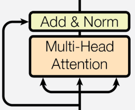

*图 3.1-3 Add & Norm 在子层输出和 residual stream 相加后执行 LayerNorm，是原始 Post-norm block 的局部结构*

残差公式：

$$
\text{Output} = \text{Input} + \text{Layer}(\text{Input})
$$

残差连接把子层输入 $x$ 直接加回子层输出 $\text{Layer}(x)$ 。这样 residual stream 可以在深层网络中保留一条稳定的信息通路，子层只需要学习对当前表示的增量修正，而不必每一层都重新构造完整表示。

从数学角度上，残差就是不强制网络直接学习理想映射 $H(x)$ ，而是让网络学习"残差" $F(x) = H(x) - x$ 。如果某层不需要做变换，网络只需学习 $F(x) \approx 0$ ，保留输入 $x$ 。

如果需要变换，网络学习对输入的"修正量"。极端情况下，即使 $\text{Layer}$ 学习效果差，至少能保证 $\text{Output} \approx \text{Input}$ ，不会比不加深层更差。


**3. Post-norm 与 Pre-norm 的组合范式**

在原始 Transformer 论文中，层归一化（Layer Normalization） 和残差连接（Residual Connection） 是协同工作的核心设计，共同确保深层网络稳定训练。

原始论文中是先残差连接在进行归一化：

$$
\text{output} = \text{LayerNorm}\big(x + \text{Sublayer}(x)\big)
$$

其中 $x$ 是输入到当前子层模块的张量。 $\text{Sublayer}(x)$ 是子层自身的变换（例如多头自注意力或前馈网络），直接作用在 $x$ 上。 $x + \text{Sublayer}(x)$ 则是代表残差连接。 $\text{LayerNorm}$ 代表层归一化，应用于残差连接之后。

与**后面提出的变体** Pre-Norm（先归一化，再子层，最后残差）相比，这里用的是 Post-Norm，顺序是：**子层 → 残差 → 归一化**。

**残差连接确保梯度直接回传，至少保留恒等映射能力**，而**层归一化将相加后的分布标准化，避免数值爆炸/消失**，**二者结合使 12 层甚至更深的网络可训练**

**LayerNorm 的作用**

解决分布漂移、梯度不稳定的问题，标准化分布，加速模型收敛，防止梯度消失和梯度爆炸。

**残差连接的作用**

确保梯度直接回传，至少保留恒等映射能力，提供稳定信息通路，解决分布不稳定，深层仍难训练的问题。

### 3.1.4 前馈网络 (Feed Forward) 与激活函数

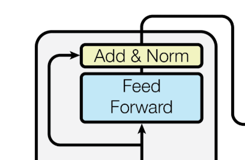

*图 3.1-4 原始 FFN 在每个位置独立执行两层 MLP，中间用 ReLU 提供非线性*

原始 Transformer 论文《Attention Is All You Need》中使用的激活函数是 **ReLU**（Rectified Linear Unit），具体应用于**位置前馈网络** （Position-wise Feed-Forward Networks）。

**1. ReLU 的应用位置**

在编码器和解码器的每个层中，前馈网络的结构为：

$$
\text{FFN}(x) = \max(0, xW_1 + b_1)W_2 + b_2
$$

**第一层**为**线性变换** + **ReLU 激活**，**第二层**仅为**线性变换**，无激活函数。


**2. 具体参数配置**

根据原始论文：

| 参数 | 值 | 说明 |
|------|-----|------|
| **输入/输出维度** | $d_{\text{model}} = 512$ | 与模型主维度一致 |
| **中间层维度** | $d_{\text{ff}} = 2048$ | 扩展 4 倍后再压缩 |
| **激活函数** | $\mathrm{ReLU}$ | 仅应用于第一层 |

**完整流程**为：先输入 **512 维向量**，经过**线性层 (512->2048)**，然后经过 **ReLU**，再经过**线性层 (2048->512)** 得到输出。

**3. 为什么用 ReLU？**

ReLU 的**计算高效**，相比 Sigmoid/Tanh，ReLU 的导数计算简单（0 或 1）

**激活函数的基础要求**

第一，必须是**非线性**，一个激活函数必须是非线性，对于一个线性函数，无论多么深的神经网络，他始终是一个简单的神经网络，只能拟合简单的函数，多层网络会退化为单层线性模型，对于非线性函数，能增加网络的复杂性，学习复杂问题。

第二是具有**可微性**，在定义域内几乎处处可微，支持梯度下降和反向传播，否则无法使用梯度下降来训练模型。ReLU 在 $x=0$ 处不可微，但实践中可以使用次梯度（subgradient），效果良好。

第三**计算要简单高效**，一个激活函数在模型推理和训练中会被调用数十亿次，在高数量级下的运算下的计算成本不会太高。

## 3.2 Transformer 的现代变体及代表模型

这一节按 block 的结构决策拆开看现代 dense decoder 的默认骨架：归一化位置与类型（§3.2.1）、前馈网络与激活函数（§3.2.2 / §3.2.3）、位置编码（§3.2.4）、注意力变体（§3.2.5）。每条决策都对应一组具体工程权衡（训练稳定性、数据移动、表达效率、KV cache 体积、长上下文能力），读完应能对「为什么这套默认」给出可迁移的解释，而不是只记住一组术语。

原始 Transformer 论文给出了注意力、FFN、残差和归一化的基本骨架，但今天训练 decoder-only LLM 时，默认配置已经发生了明显变化。更稳妥的阅读方式是拆开看每个 block 的结构决策：norm 放在哪里、FFN 是否门控、位置编码如何注入、KV cache 如何压缩、softmax 如何保持稳定。

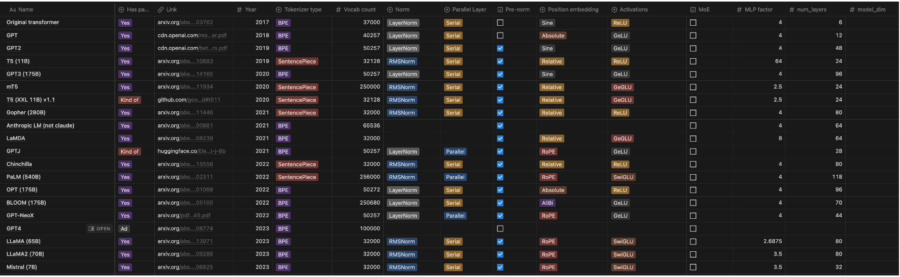

*图 3.2-1 把多代模型的 norm、FFN、位置编码和注意力决策排成同一张表，横轴是模型代际或家族*

图中的表格适合用来观察趋同趋势，不适合作为固定排行榜。许多模型都从 Post-LN、ReLU、绝对位置编码逐步转向 Pre-norm/RMSNorm、门控 FFN、RoPE 或其变体，并在推理侧引入 GQA、MLA、CLA、SWA、NoPE 等减小 KV cache 或改善长上下文的设计。

本章重点讨论四类稳定决策：

1. **归一化**：Pre-norm、RMSNorm、QK norm、softmax 稳定化。
2. **前馈网络**：no bias、GeLU/Swish/SwiGLU、FFN expansion ratio。
3. **位置编码**：绝对位置、相对位置、RoPE、NoPE 与局部注意力组合。
4. **注意力变体**：MHA、MQA/GQA、MLA、CLA、SWA/full attention、linear attention 与 Mamba-2。

今天训练 decoder-only LLM 时，原始 Transformer 更适合作为历史基线。现代常见基线会在 Pre-norm、RMSNorm、无 bias 线性层、门控 FFN、RoPE、KV cache 友好的注意力以及 softmax 稳定化技巧之间做组合取舍。

如果把现代 dense decoder 主线压缩成一句话，比较接近的默认骨架就是：**Pre-norm + RMSNorm + no bias + SwiGLU + RoPE**。长上下文或高效推理再在这个骨架之上叠加 **NoPE/SWA/full attention 的交替**，或者引入 **GQA、MLA、CLA、DSA** 等面向 KV cache、稀疏读取或长程信息流的变体。

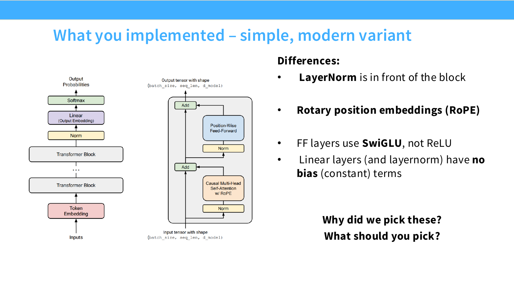

*图 3.2-2 把上述默认骨架串成单个 dense decoder block，标注每个组件的输入 / 输出形状与参数来源*

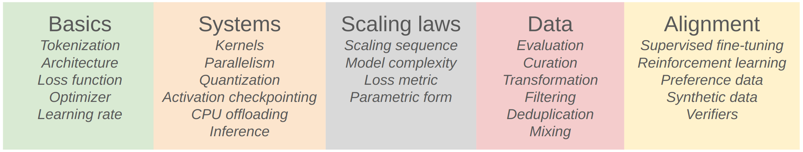

*图 3.2-3 把学习效果、GPU 效率和训练稳定性三条曲线画在同一坐标平面，标注三者交叉的设计取舍区域*

> [!TIP]
> 看新模型配置时，可以先扫四项：norm 位置与类型、FFN/激活、位置编码、注意力 KV cache 设计。它们通常比“用了多少层多少头”更能解释训练稳定性和推理成本。

这些名词常常在同一份模型配置中同时出现，可以先按“解决什么问题”分组：

| 设计 | 主要解决的问题 | 读配置时的注意点 |
| --- | --- | --- |
| Pre-norm / RMSNorm / no bias / SwiGLU | 训练稳定性、数据移动、FFN 表达能力 | 这四项通常成套出现，构成现代 dense decoder 的默认骨架 |
| z-loss / QK norm / soft-capping | softmax logits 或归一化项失控 | 通常服务于长上下文、大模型或较激进学习率下的稳定训练 |
| RoPE / NoPE / SWA / full attention | 位置建模与长程信息流 | RoPE 更适合短程相对位置；NoPE/full attention 常承担低频全局信息交换 |
| GQA / MLA / CLA | 减少或重组 KV cache | 关注 cache 大小、带宽和额外投影计算；理论注意力复杂度只是其中一项 |
| DSA | 稀疏读取历史 token | 它挑的是历史位置；压缩 K/V 归 GQA/MLA/CLA，选专家归 MoE routing |

因此，读现代模型配置时可以先问“它想省什么或稳住什么”：RMSNorm/no bias 主要减少归一化和线性层的额外状态，SwiGLU 提高 FFN 表达效率，RoPE/NoPE/SWA/full attention 处理位置信息与长程连接，GQA/MLA/CLA 处理 KV cache，DSA 处理稀疏历史读取。这个分组能避免把所有名词都粗略归为“长上下文技巧”。

这里尤其要区分两个都可能写成 top-k 的机制：attention 稀疏化是在历史 token 或 KV 位置里选子集；MoE routing 则是在 FFN 专家里选子集。前者改变“看哪些上下文”，后者改变“用哪些专家计算当前 token”。


### 3.2.1 归一化

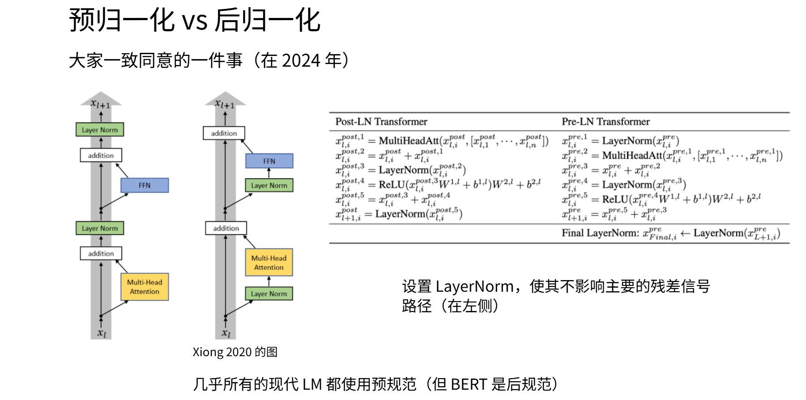

*图 3.2-4 Pre-norm 保持 residual stream 的直通路径，Post-norm 则把 LayerNorm 放在残差相加之后*

**1. 位置上：Post-LN（原始论文设计，后归一化）**

**结构**：子层 -> 残差连接 -> 层归一化

$$
X = \text{LayerNorm}(X + \text{Sublayer}(X))
$$

这是 Transformer 原始论文的设计，即后归一化方案（**左侧图**）：灰色残差连接流在通过子层后，再与输入相加，最后执行 LayerNorm。但很快人们发现，将 LayerNorm 移至残差连接之前（即预归一化）能在多方面获得更好效果（**右侧图**，Pre-LN）。

**2. 位置上：Pre-LN（现代主流，预归一化）**

**结构**：层归一化 -> 子层 -> 残差连接

$$
X = X + \text{Sublayer}(\text{LayerNorm}(X))
$$

它的主要优势是训练更稳定，通常对深层网络和较激进学习率更友好。早期 GPT-3、PaLM 等模型已经采用类似预归一化思路，后续模型又在此基础上叠加 RMSNorm、QK norm、z-loss 等稳定化技巧。

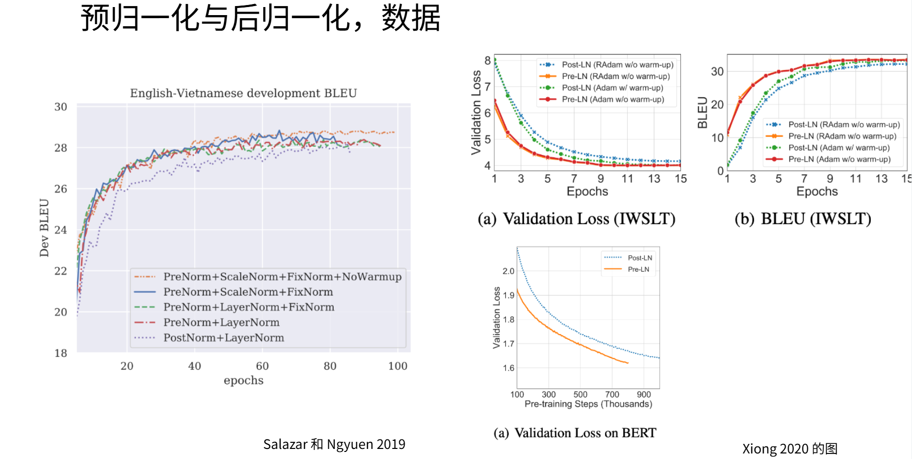

*图 3.2-5 Pre-norm/Post-norm 的训练曲线和梯度行为对比，用来说明 norm 位置会影响深层网络稳定性*

采用预归一化配合其他稳定化技巧后，即使不使用**预热机制**，系统表现也能媲美甚至**优于**需要精细预热方案的**后归一化 LayerNorm**。左图展示了英语-越南语机器翻译（Salazar & Nguyen 2019）下的 Dev BLEU 收敛轨迹；右上是 Xiong 2020 在 IWSLT 机器翻译任务上的验证损失与 BLEU 曲线（同一任务的 Adam 优化器 × 预热对比）；右下是 BERT 在预训练步数上的验证损失对比，是当前图片中唯一跳出机器翻译场景的实验。

关于预归一化的优势存在**多种解释**：有研究认为它能避免层间**梯度衰减**，保持**梯度规模恒定**；而未使用预热的后归一化会导致**梯度爆炸**（橙色曲线）。这些论点都很有说服力。但更符合现代认知的解释可能是预归一化本身就是**更稳定的训练架构**。

如今，**预归一化和其他 LayerNorm 技巧被广泛用作训练大型神经网络时的稳定性辅助手段**。

在现代 decoder-only LLM 中，更常见的默认组合是 **Pre-norm + RMSNorm**：把 norm 放在 residual 分支前，用 RMSNorm 省去均值中心化，并尽量减少不必要的 bias 参数。这一组合的价值不只是“少算一点”，还在于它为更深网络、更长训练和更激进的优化设置提供了更稳定的数值环境。

**3. 结构上，“双归一化”**

Norm 位置并不是只能二选一。一些模型会在模块前后都放置 norm，或在 attention/FFN 输出后增加额外 norm，以换取更稳定的激活尺度。这里的经验结论应谨慎理解：norm 能降低训练失稳风险，但也会改变残差流、吞吐和推理 kernel 形态，最终仍需要在目标架构上做消融。

**4. 简化变体：RMSNorm**

RMSNorm 的核心变化是去掉均值中心化，只按均方根缩放，并通常不使用 bias。它的优势来自两方面：一是计算和参数更少，二是实证上常能保持与 LayerNorm 接近的训练效果。许多 decoder-only LLM 因此采用 RMSNorm，但它不是无条件优于 LayerNorm；在 muP、强 weight decay、低精度训练等设置下，RMSNorm 的可学习 gain 也可能改变缩放行为，需要和训练设置一起验证。

Transformer 原始的层归一化：

$$
\text{LayerNorm}(v) = \gamma \frac{v - \mu}{\sigma} + \beta
$$

**公式**（去掉均值归一化，仅保留方差归一化）：

$$
\text{RMSNorm}(v) = \gamma \frac{v}{\sqrt{\frac{1}{d}\sum_{i=1}^{d} v_i^2 + \varepsilon}}
$$

RMSNorm 的 systems intuition 是：归一化层 FLOPs 占比很小，但 arithmetic intensity 低，容易被数据移动主导。RMSNorm 少做均值中心化并通常去掉 bias，能减少参数、访存和实现复杂度；它的优势不只是“算得少”，更在于把低算术强度的操作压得更轻。

> [!NOTE]
> **Pre-norm 的例外**：在现代 dense Transformer 中，pre-norm 几乎是默认选择，OPT-350M（[arXiv:2205.01068](https://arxiv.org/abs/2205.01068)）是仍保留 post-layer-norm 的代表案例。HF [`facebook/opt-350m`](https://huggingface.co/facebook/opt-350m) 的 config 里 `do_layer_norm_before: false` 直接对应这一点，同一份 config 还写着 `activation_function: "relu"`、`hidden_size: 1024` 与 `word_embed_proj_dim: 512`——同一代模型内部的 norm 顺序、激活和 embedding 投影都可能不统一，读配置时按每个 checkpoint 的字段确认。

Narang 等人（EMNLP 2021，[arXiv:2102.11972](https://arxiv.org/abs/2102.11972)）的消融在 Table 1 给出具体数字：同为 223M 参数、11.1T ops 的设置下，Vanilla Transformer（pre-norm + LayerNorm + shared biases + relative attention）每秒 3.50 步、final loss 1.838；将 LayerNorm 替换为 RMSNorm 后每秒 3.68 步、final loss 1.821。两组对照除归一化方式外保持一致，因此 RMSNorm 的收益主要来自实现层的算术强度和数据移动改善，而不是表达能力本身。

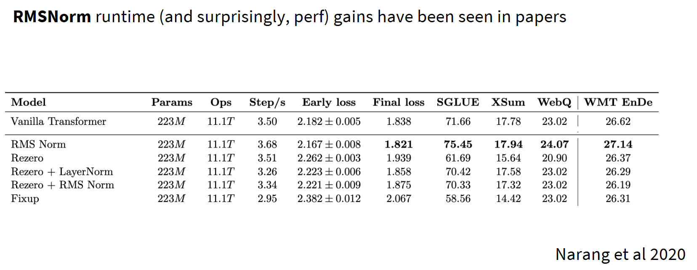

*图 3.2-6 RMSNorm 在小规模 Transformer 消融中同时带来吞吐和损失改善，但结论仍需要随架构和训练设置验证*

RMSNorm 运行时的收益已经能在论文中观察到；更重要的可迁移判断是，低算术强度的归一化操作即使 FLOPs 很少，也可能因数据移动而影响 wall-clock time。

**Post-norm 的训练稳定性问题**

直观解释是残差连接使得网络从**顶层到底层保持恒等映射**，这对训练极深网络时的**梯度传播**非常有利。LSTM 这类循环网络需要沿时间步反复乘以同一组权重，梯度在长序列上容易衰减或爆炸；残差连接提供的恒等通路直接绕开了这个问题。在中间插入 LayerNorm 可能会干扰这种梯度行为，这一点正好与之前展示的梯度尖峰现象吻合。虽然 LayerNorm 效果良好，**但如今许多模型已转向使用 RMSNorm，这已成为共识性改进**。

### 3.2.2 前馈网络

原始 Transformer 中的前馈网络

$$
\text{FFN}(x) = \max(0, xW_1 + b_1)W_2 + b_2
$$

原始 Transformer 的前馈网络结构包含带 bias 的线性层、ReLU 和第二个线性层。但当前主流实现（非门控版本）通常会移除 bias。工程原因是：bias 这类操作的算术强度低，收益通常有限，却会增加参数、访存和实现分支；同时，一些训练设置里 bias 也可能带来稳定性问题。因此，现代 decoder-only LLM 往往把线性层和 RMSNorm 的 bias 都去掉，把主计算尽量集中到矩阵乘法上。

现代模型的大多数实现（如果不是门控的）：

$$
\text{FFN}(x) = \max(0, xW_1)W_2
$$

FFN 去除偏置项 b 的理由几乎和 RMSNorm 一致，去除偏置项的想法广泛适用，许多模型在大多数地方根本没有偏置项。

**Serial vs parallel layers**

标准 Transformer block 通常是 **serial layers**：先做 attention，再做 MLP，中间各自经过 norm 和 residual。这种顺序结构更容易实现，也更符合今天多数 LLaMA-like 模型的默认配置。

也有一些模型采用 **parallel layers**，把 attention 分支和 MLP 分支并行作用在同一个归一化后的输入上，最后一起加回 residual stream。GPT-J、PaLM、GPT-NeoX 等模型都尝试过这种设计。它的好处是减少串行依赖，理论上利于并行调度；代价是不同分支的交互时机被改变，训练稳定性和可迁移经验不如 serial block 普遍。

当前实践里，serial block 仍是更稳妥的默认选择。parallel block 可以作为系统调度或架构实验选项，但不应仅因为“并行”两个字就假设它一定更快或更好；最终效果取决于 kernel 调度、通信、norm 位置和学习率设置。

### 3.2.3 激活函数

激活函数决定 FFN 中非线性从哪里来，也会影响 kernel 形态和低精度稳定性。早期 Transformer 使用 ReLU，GPT 系列长期使用 GeLU；近年的 decoder-only LLM 更常见的是门控 FFN，例如 GeGLU、SwiGLU、ReGLU 等。

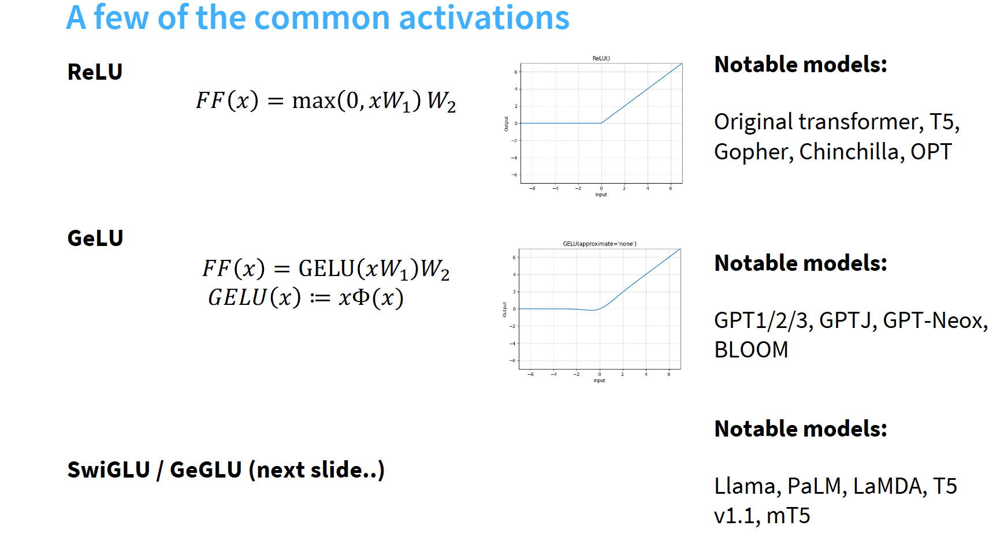

*图 3.2-7 把 ReLU、GeLU、SwiGLU / GeGLU 的曲线和对应模型族放在同一坐标系，便于比较硬截断、平滑和门控三种非线性形态*

**1. ReLU 函数**

ReLU 只保留正值部分：

$$
\text{ReLU}(x)=\max(0,x)
$$

它的优点是计算简单、梯度形式简单，也是原始 Transformer FFN 中使用的激活函数。缺点是负半轴完全截断，表达上不如后续的平滑或门控变体灵活。

**2. GeLU 函数**

GeLU（Gaussian Error Linear Unit，高斯误差线性单元）把输入乘以标准高斯分布的累积分布函数：

$$
\text{GeLU}(x) = x \cdot \Phi(x)
$$

其中 $\Phi(x)$ 是标准高斯分布的累积分布函数（CDF），公式为：

$$
\Phi(x) = P(X \le x) = \frac{1}{2} \left[1 + \text{erf}\left(\frac{x}{\sqrt{2}}\right)\right]
$$

直观上，GeLU 是 ReLU 的平滑版本：负值不会被硬截断，靠近原点的过渡也更连续。GPT-1/2/3、GPT-J 等模型都使用过 GeLU。它的代价是计算比 ReLU 更复杂，实际系统通常使用 tanh 或多项式近似；第 6 章会用 GeLU 作为 kernel fusion 和 Triton 的例子。

**3. 门控线性单元（GLU）**

GeLU 之后，主流 LLM 更重要的变化是 FFN 从“单路上投影 + 激活”变成了“内容分支 + 门控分支”。GLU 家族的核心是让输入决定哪些隐藏维度被放大或抑制。

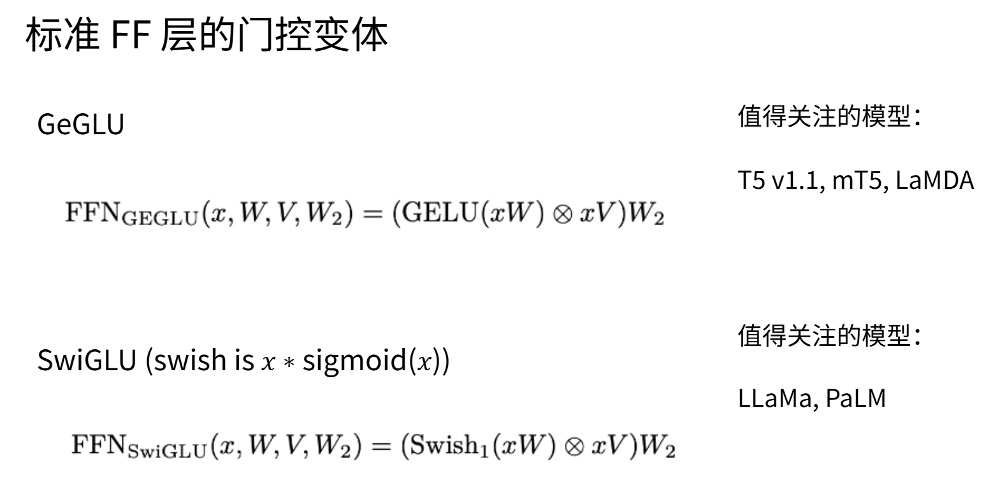

*图 3.2-8 GLU 把 FFN 的上投影拆成内容分支和门控分支，逐元素乘法决定隐藏维度的保留强度*

$$
\text{GLU}(x) = (xW) \odot \sigma(xV)
$$

其中 $x \in \mathbb{R}^{d_{\text{model}}}$ 是输入向量， $W,V \in \mathbb{R}^{d_{\text{model}}\times d_{\text{ff}}}$ 是两条上投影， $\sigma$ 是 Sigmoid， $\odot$ 表示逐元素相乘。

GLU 可以理解为 **content branch + gate branch**：

1. **内容通道**： $xW$ 提供原始信息
2. **门控通道**： $\sigma(xV)$ 生成 0 到 1 之间的系数
3. **逐元素筛选**：两个分支相乘后，每个 token 都能用不同方式调制 FFN 隐藏维度

这类结构通常会带来更好的损失曲线，但也多了一条上投影分支，因此参数量、FLOPs 和 kernel 融合方式都要重新核算。

**门控主流变体**

**GeGLU（Gated GELU）**

$$
\text{GeGLU}(x) = \text{GELU}(xW) \cdot (xV)
$$

GeGLU 用 GeLU 取代 Sigmoid 风格的门控非线性，出现在 T5 v1.1、mT5、LaMDA、Phi-3 以及 Gemma 2/3/4 中；原始 T5 的前馈层用的仍是 ReLU，GeGLU 是 T5 v1.1 才引入的改动。它的价值主要来自更平滑的门控与更强的 FFN 表达能力。

**SwiGLU（Swish GLU）**

$$
\text{SwiGLU}(x) = \text{Swish}(xW) \odot (xV)
$$

其中 $\text{Swish}(x) = x \cdot \sigma(\beta x)$ ，其形状与高斯误差单元相似，通常 $\beta=1$ ， $\sigma(x) = \frac{1}{1 + e^{-x}}$ 。

SwiGLU 使用 Swish 作为门控非线性，是 LLaMA、PaLM、OLMo 等许多现代 decoder-only 模型中的常见选择。它通常比普通 GeLU FFN 更强，但因为有两条上投影分支，也会带来额外计算和参数预算。

**门控 FFN 的实验信号**

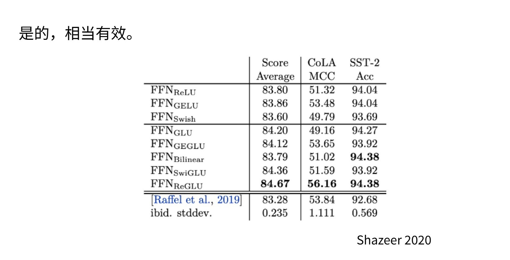

*图 3.2-9 Shazeer 2020 的 GLU 变体实验显示，门控 FFN 在多种设置下能改善损失或下游结果*

Shazeer 的 GLU 变体实验（*GLU Variants Improve Transformer*, [arXiv:2002.05202](https://arxiv.org/abs/2002.05202)）与 Narang 等人在 T5 类模型上的消融（*Do Transformer Modifications Transfer Across Implementations and Applications?*, [arXiv:2102.11972](https://arxiv.org/abs/2102.11972)）都显示，门控 FFN 往往能取得更低损失或更好下游结果。这些实验规模早于当前前沿模型，但方向上解释了为什么 SwiGLU/GeGLU 会成为常见默认配置。

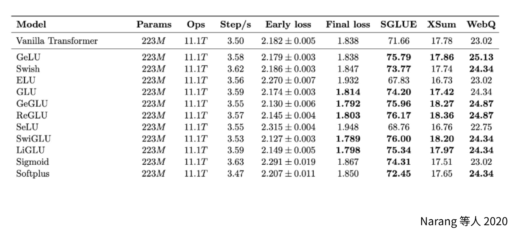

*图 3.2-10 Narang 等人的消融提供了门控激活收益的另一组证据，也显示效果需要结合模型和训练设置理解*

门控 FFN 也不是唯一可行的选择。GPT-3 使用 GeLU，Nemotron 340B 使用 squared ReLU，Falcon 系列（含 180B）沿用 GeLU：[Falcon 技术报告](https://arxiv.org/abs/2311.16867) §4.3.3 明确写了不采用 SwiGLU，理由是门控会让中间激活翻倍，`FalconConfig` 的 `activation` 默认值也仍是 `"gelu"`。更稳妥的结论是：SwiGLU/GeGLU 是当前很强的默认选择，但最终仍要由模型规模、训练设置、硬件 kernel 和消融实验共同决定。

使用 SwiGLU/GeGLU 时还要重新核算 FFN 的隐藏维度。门控 FFN 通常有两条上投影分支，如果仍然沿用原始 Transformer 中 `4d` 的扩展比例，参数量和 FLOPs 会明显增加；许多实现会把中间维度调低，让门控结构带来的表达收益和计算预算重新平衡。

### 3.2.4 位置编码

位置编码的发展路线很多，本节只保留和现代 decoder-only LLM 关系最密切的部分：绝对位置编码、相对位置编码，以及当前最常见的 RoPE。

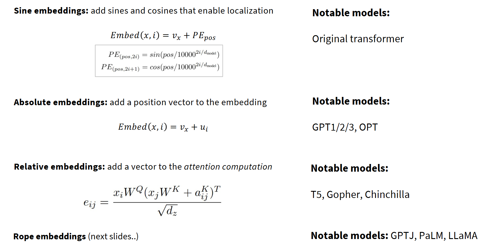

*图 3.2-11 沿同一坐标轴展示四类位置编码：sinusoidal / 可学习绝对 / T5 相对偏置 / RoPE，标注每条曲线注入位置信息的位置*

**1. 绝对嵌入（Absolute Embedding）**

绝对嵌入给序列中**每个位置分配唯一编码向量**，与词嵌入相加：

$$
\text{Final Embedding} = \text{Token Embedding} + \text{Positional Embedding}
$$

这里 $u_i \in \mathbb{R}^{d_{\text{model}}}$ 是位置 $i$ 的编码，可以是固定公式生成，也可以是训练中学习的参数。绝对嵌入的最大问题是位置向量只表达“我是位置 i”，并不能直接告诉模型“我相对位置 j 偏移了多少”。

**1a. 正弦嵌入（Sine Embeddings）**

原始 Transformer 论文提出的**固定式绝对位置编码**，使用正弦/余弦函数生成唯一模式：

$$
PE_{(pos, 2i)} = \sin\left(\frac{pos}{10000^{2i/d_{\text{model}}}}\right)
$$

$$
PE_{(pos, 2i+1)} = \cos\left(\frac{pos}{10000^{2i/d_{\text{model}}}}\right)
$$

其中：

- $pos$ ：token 位置索引。
- $i$ ：维度索引（0 到 $d_{\text{model}}/2 - 1$）。
- $d_{\text{model}}$ ：模型维度（如 512）。

正弦嵌入是**无参化**的，它**无需训练参数**，并且**计算高效**。同时具有一定的 **外推性**，可泛化到训练时未见的更长序列。

但是它是**绝对位置感知**，无法直接建模相对距离，并且**长序列性能会衰减**，位置编码差异随距离增大而模糊。正弦嵌入理论上可计算任意位置，具有一定的外推能力，但实际长序列性能会显著衰减。

**1b. 可学习绝对嵌入**

GPT-1/2/3、OPT 等模型把位置编码改成可学习的 $u_i$：每个位置单独占一行 embedding 表，训练中与 token embedding 一起被更新。它的表达能力强，但参数量随 max_position_embeddings 线性增长，外推到训练序列长度之外的能力也有限。

**2. 相对嵌入（Relative Embedding）**

相对嵌入直接把“相对距离”的信号送进 attention 计算里。T5、Gopher、Chinchilla 等模型在 attention logit 上加一个与 $i - j$ 相关的偏置项：

$$
e_{ij} = \frac{x_i W^Q (x_j W^K + a_{ij}^K)^\mathrm{T}}{\sqrt{d_z}}
$$

其中 $a_{ij}^K$ 是按 key 端位置差查表得到的相对偏置。它的优势是直接建模相对位移，缺点是破坏了“embedding 的内积”结构，无法在 attention 之外复用。

**3. 旋转位置编码（RoPE）**

核心思想是建模 token 间的相对距离，而非只给每个位置分配一个绝对向量。RoPE 把位置变换放到 Q/K 上，使 attention score 直接依赖相对位移。

旋转位置编码就是一种相对嵌入，但与上面 T5 的“偏置加到 logit”不同，它用 Q/K 上的**旋转变换**来编码位置。

RoPE 最早由苏剑林（Jianlin Su）在 2021 年的论文《RoFormer: Enhanced Transformer with Rotary Position Embedding》（[arXiv:2104.09864](https://arxiv.org/abs/2104.09864)）中提出，GPT-J 是较早采用 RoPE 的知名开源模型之一。现代 decoder-only LLM 大量使用 RoPE 或它的长上下文变体，因为它把位置信息注入到 Q/K 上，位置关系会直接进入每层 attention score。

这使 RoPE 更适合 causal attention 和 KV cache 场景。决定旋转角的 $\theta$ 按预定频率设置，其设计直觉与正弦余弦位置编码类似，都需要覆盖不同频率范围以表示近距离和远距离信息。


**什么是旋转？**

旋转这个概念和复数有关。

在二维空间中，向量 $\boldsymbol{v}=(x,y)$ 可表示为复数 $z = x + iy$。将其旋转 $\theta$ 角度等价于乘以 $e^{i\theta}$，利用三角函数和复数的性质，等价为**乘一个旋转矩阵**。

在**向量空间**中，将一个向量顺时针或逆时针**旋转一定角度**，可以通过将这个**矩阵与旋转矩阵点乘**来实现：

在**二维空间**中，一个旋转矩阵可以表示为：

$$
R(\theta)=\begin{bmatrix}
\cos(\theta)&-\sin(\theta)\\
\sin(\theta)&\cos(\theta)
\end{bmatrix}
$$

将一个矩阵旋转 $\theta$ 度可以等价为乘以一个旋转矩阵。

$$
R({\theta}) \cdot \boldsymbol{v} = \begin{pmatrix}
\cos\theta & -\sin\theta \\
\sin\theta & \cos\theta
\end{pmatrix}
\begin{pmatrix}
x \\
y
\end{pmatrix}
$$

**旋转矩阵的数学性质**

1. **正交性**：旋转矩阵的列向量和行向量都是单位向量，并且两两正交。因此，旋转矩阵的逆矩阵等于它的转置矩阵。
2. **行列式为 1**：旋转矩阵的行列式为 1，旋转操作保持向量长度不变，只改变其方向。
3. **周期性**：旋转矩阵具有周期性，即 $R(\theta+2\pi)=R(\theta)$ 。
4. **基础运算**：旋转矩阵的乘法遵循矩阵乘法的规则，即 $R(a+b)=R(a)R(b)$ 。这条性质会直接出现在 RoPE 的相对位置推导里。

当我们对 Q、K 矩阵都进行旋转后：

$$
Q_1 = R(m)\cdot Q
$$

$$
K_1 = R(n)\cdot K
$$

attention 的核心分数来自 Q 和 K 的点积：

$$
\text{Attention}(Q, K, V) = \text{softmax}\left(\frac{Q K^T}{\sqrt{d_k}}\right)V
$$

$$
\begin{aligned}
Q_1 \cdot K_1^T &= R(m) \cdot R(n)^T \cdot QK^T\\
&= R(m) \cdot R( -n) \cdot QK^T \\
&= R(m-n) \cdot QK^T
\end{aligned}
$$

我们为不同位置的 token 都乘以不同角度的旋转矩阵在计算注意力的时候就会出现 $R(m-n)$ ，这就代表两个 **token 的相对位置信息**。

高维 RoPE 的实现方式是把向量按相邻维度拆成多个二维子块，并在每个二维子空间内用不同频率独立旋转。这样内积中自然出现相对位置 $m-n$ ，同时保持实现简单。

矩阵 $R(m\theta)$ 是一个用于 RoPE 的旋转矩阵，它被设计为一个方阵，其中包含了余弦和正弦函数的值，这些值用于编码位置信息。矩阵的每一行和每一列对应于嵌入向量中的一个维度。矩阵的结构如下：

$$
R(m\theta)=\begin{bmatrix}
\cos(m\theta_0)&-\sin(m\theta_0)&0&0&\cdots&0\\
\sin(m\theta_0)&\cos(m\theta_0)&0&0&\cdots&0\\
0&0&\cos(m\theta_1)&-\sin(m\theta_1)&\cdots&0\\
0&0&\sin(m\theta_1)&\cos(m\theta_1)&\cdots&0\\
\vdots&\vdots&\vdots&\vdots&\ddots&\vdots\\
0&0&0&0&\cdots&\cos(m\theta_{\frac{d}{2}-1})\\
0&0&0&0&\cdots&\sin(m\theta_{\frac{d}{2}-1})
\end{bmatrix}
$$

这里 $m$ 是一个标量，通常与位置索引相关， $\theta_i$ 是与每个维度相关的频率， $d$ 是嵌入向量的维度。矩阵中的每个 $2\times2$ 子块对应于嵌入向量中的一对维度，这些子块用于在复数空间中旋转向量。

频率参数：

$$
\theta_i = 10000^{-2i/d}
$$

其中， $i$ 是维度索引（从 0 开始）， $d$ 是嵌入向量的总维度。这一形式继承自 Vaswani 2017 的 long-term decay 表达（[RoFormer, arXiv:2104.09864](https://arxiv.org/abs/2104.09864) §3.3）；RoFormer 论文 §3.2.2 在形式定义上同时使用 one-indexed 写法 $10000^{-2(i-1)/d}$，两种 indexing 对 $d/2$ 个频率值给出的角频率集合完全一致，仅 $i$ 起点差 1。

这种高维嵌入方法的关键是：每两个维度组成一对二维子空间，并按对应频率旋转。不同维度对拥有不同旋转速度，因此可以同时编码高频近距离信息和低频远距离信息。

RoPE 的计算可以理解为：把向量按二维子空间分组，再用位置相关的正弦、余弦矩阵对每一组做旋转。位置没有以加法形式写入 embedding，而是进入 Q/K 的内积结构；因此 attention score 更直接地依赖相对位置。

相比原始论文中的正弦余弦嵌入，RoPE 会在每层 attention 的 Q/K 计算中注入位置，位置变换跟随 attention score 发生作用。这个设计更适合 decoder-only 模型的 causal attention 和增量生成。

**为什么 RoPE 成为常见默认选择：**

RoPE 把位置信息注入到 Q/K 上，使注意力分数显式依赖相对距离；它没有额外可学习参数，工程实现简单，并且与 KV cache 的自回归推理形式兼容。需要注意的是，RoPE 的数学公式可以计算任意位置，但长上下文外推效果并不自动保证，实践中常配合 RoPE scaling、局部/全局注意力交替、NoPE 或其他长上下文训练策略。

### 3.2.5 注意力机制的变体

这一节把注意力变体按瓶颈分组：KV cache 是 generation 阶段显存与 HBM 带宽的主要来源；MQA / GQA / MLA / CLA 在缩小或重组 K/V；sliding-window、DSA、CSA / HCA 决定"看多少历史 token"和"以多高分辨率看"；linear attention / Mamba-2 / Gated DeltaNet 提供线性时间推理替代。

排列顺序也按这三层展开：先讲 KV cache 基础与共享策略：§3.2.5.1 给出 KV cache 基础，§3.2.5.2 给出 KV 共享总览，§3.2.5.3–§3.2.5.6 分别给出 MQA / GQA / MLA / CLA 的实现机制；再讲稀疏与滑动窗口（§3.2.5.7，SWA / DSA / CSA / HCA）；最后讲线性时间替代（§3.2.5.8，linear attention / Mamba-2 / Gated DeltaNet）。

### 3.2.5.1 KV cache 基础

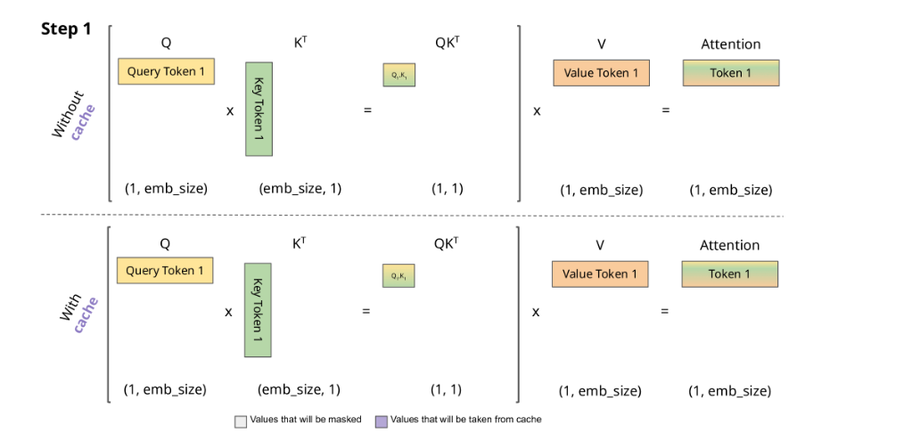

*图 3.2-12 把 KV cache 沿时间步铺成二维矩阵，每个新 token 只在最右侧追加一行 K/V，避免整张注意力矩阵的反复重算*

自回归生成一次只产生一个新 token：模型读取已有上下文，输出下一个 token 的分布，再把新 token 接到上下文后继续生成。由于 generation 阶段不能像 prefill 那样完全并行，系统会缓存历史 token 的 K/V。这样生成新 token 时只需要为新 token 计算新的 Q/K/V，并复用历史 K/V，这个缓存就是 KV cache。

KV cache 的算术强度与 batch × context 维度的 scaling 关系在 [第 9 章 §9.1.3 / §9.2.2](../chapter9/chapter9_推理系统.md) 展开；GPU / HBM 视角下的字节账本与切分维度见 [第 5 章 §5.8](../chapter5/chapter5_GPU和GPU相关优化.md)；serving 端的分页与 prefix sharing 见 [第 9 章 §9.5.2](../chapter9/chapter9_推理系统.md)。

### 3.2.5.2 KV 共享总览

KV cache 显存压力最直接的回应是共享 K/V：MQA 最激进（所有 query head 共享一组 K/V），GQA 折中（若干 query head 共享一组 K/V），MLA 用低秩 latent 压缩再恢复，CLA 把 K/V 共享扩展到跨层。下面四个子节分别给出实现机制。

### 3.2.5.3 MQA 多查询注意力

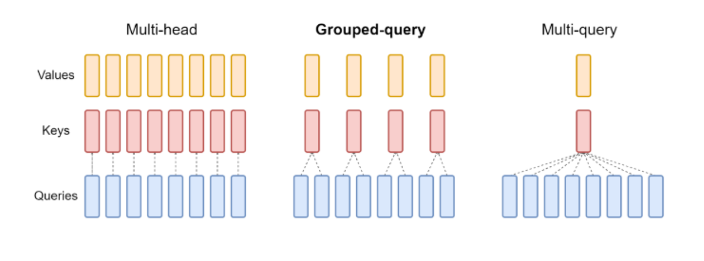

*图 3.2-13 MQA 让所有 query head 共享同一组 K/V head，以最激进的方式压缩 KV cache*

传统 **多头注意力机制（MHA）** 会为每个头分配独立的 Q、K、V 投影。**多查询注意力（Multi Query Attention, MQA）** 保留多个 query head，但让所有 heads 共享同一组 K/V。这样可以显著降低 KV cache 的显存和带宽压力。

每个 query head 仍保留独立的 Q 投影，因此可以以不同方式访问历史信息。K/V 的计算和缓存只保留一份，generation 阶段的 HBM 读取量随之下降。

MQA 把压缩推到极限，代价是所有 query head 只能读同一份 K/V 表示，质量损失在原始报告里就已经可见。当前主流 decoder-only LLM 更常落在 GQA（若干个 K/V group）或 MLA（DeepSeek 系列的低秩 latent）上，MQA 更多作为理解这条压缩谱系的端点出现。

### 3.2.5.4 GQA 分组查询注意力

GQA（grouped-query attention）在 MHA 和 MQA 之间折中：多个 query heads 共享一组 K/V heads。K/V groups 的数量决定 generation 阶段的 cache 体积和 HBM 读取量；groups 更多时，表示自由度也更接近 MHA。

图 3.2-14 把这个 tradeoff 放到推理系统里：K/V groups 越少，cache 越省；groups 过少时，质量或表达能力可能受到影响。


*图 3.2-14 把 GQA 推理速度与 KV head 数量画在同一张图上，标注 latency 与 throughput 的帕累托前沿*

### 3.2.5.5 MLA 多头潜在注意力（DeepSeek）

MLA（Multi-head Latent Attention，多头潜在注意力）是 DeepSeek 引入的创新注意力架构，通过**低秩联合压缩技术**显著降低推理时的 KV cache 需求，在保持性能的同时大幅提升效率。

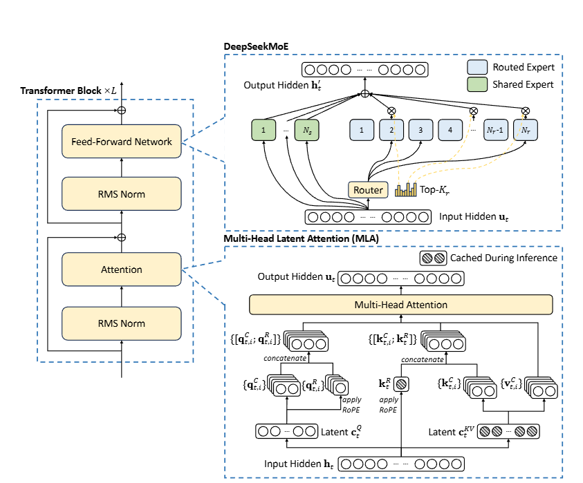

*图 3.2-17 MLA 通过低维 latent 表示缓存 K/V 信息，目标是在保持质量的同时减少 generation 阶段的 cache 体积*

DeepSeek-V2 报告中，MLA 通过显著减少生成所需的 KV cache 来提升推理效率。这里的关键变量是历史 K/V 在 cache 中保存为什么形态，以及额外投影计算能否被系统接受。

传统 Transformer 模型通常采用多头注意力机制（MHA），但在 generation 中，庞大的 KV cache 会成为推理效率的瓶颈。MQA 以一组 K/V heads 服务全部 query heads，在固定训练设置下可能出现质量下降。GQA 使用中间数量的 K/V heads；原始 GQA 报告经过 uptraining 后得到接近 MHA 的质量。具体差异仍取决于 KV head 比例、训练设置、模型规模和目标任务。

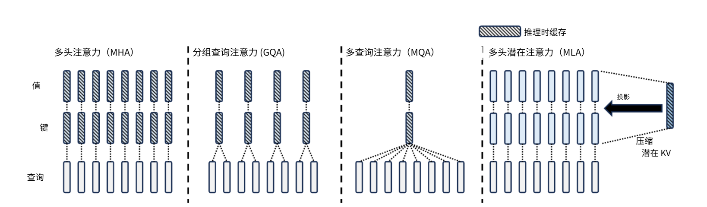

*图 3.2-18 MHA、GQA、MQA 与 MLA 的差异集中在 K/V head 数量和缓存表示方式上*

传统 Transformer 采用多头注意力（MHA），每个注意力头需独立缓存 Key 和 Value 向量。对一条上下文长度为 $S$ 的请求，层数为 $L$ 、attention heads 数为 $h$ 、每个 head 维度为 $d_k$ 时，KV cache 的元素数量为 $O(S \cdot L \cdot h \cdot d_k)$ ，成为长序列推理的主要瓶颈。

MLA 的核心是将所有注意力头的 Key 和 Value 联合压缩到一个共享的低维潜在空间。给定当前 hidden state $h_t$（维度 $d_{\text{model}}$），先用下投影 $W_D^{\mathrm{KV}} \in \mathbb{R}^{d_c \times d_{\text{model}}}$ 构造一个 KV latent：

$$
c_t^{\mathrm{KV}} = W_D^{\mathrm{KV}}h_t
$$

其中 $c_t^{\mathrm{KV}}$ 是 K/V 共用的压缩向量，维度 $d_c$ 远小于所有 K/V heads 的总维度（DeepSeek-V2 / V3 官方 config 均取 $d_c = 512$；V2 $d_{\text{model}}=5120$ 时约为 $d_{\text{model}}/10$，V3 $d_{\text{model}}=7168$ 时约为 $d_{\text{model}}/14$；具体 KV cache 体积对比见 [第 9 章 §9.3.2](../chapter9/chapter9_推理系统.md)）。Key 和 value 的相关投影由同一个 latent 分别恢复：

$$
k_t^C = W_U^K c_t^{\mathrm{KV}}, \quad v_t^C = W_U^V c_t^{\mathrm{KV}}
$$

其中 $W_U^K, W_U^V \in \mathbb{R}^{h d_k \times d_c}$ 是上投影矩阵，把压缩 latent 复原到 $h d_k$ 的总维度。

推理缓存只保存 $c_t^{\mathrm{KV}}$ 这一个共享 latent。对每层每个 token，基础缓存从 MHA 的 $2 h d_k$ 个元素缩小到约 $d_c$ 个元素；这里 $h$ 是 attention heads 数， $d_k$ 是每个 head 的维度。

图 3.2-18 中的 MLA 把需要缓存的 K/V 信息压到较低维 latent 表示中，再在 attention 路径上吸收或合并相关上投影。它重新定义了模型的缓存表示，训练和推理都需使用同一套结构。

**MLA 主要步骤如下**：

1. 每个 token 的 hidden state 先经过下投影，写入共享的 $c_t^{\mathrm{KV}}$ 。
2. attention 计算使用 K/V 的不同上投影；实现可以把部分上投影吸收到 query 或 output projection 中，避免显式物化完整 K/V。
3. KV cache 按 token、层数和 dtype 增长。压缩维度 $d_c$ 决定它比 MHA 小多少。

MLA 在 attention 路径中增加了投影或重构计算。KV cache 和 HBM bandwidth 已成为瓶颈时，这些额外计算可以换取更低的显存占用和读取量。

RoPE 直接作用在位置相关的 Q/K 上，会阻碍将 key 的上投影吸收到 query 路径。DeepSeek-V2 使用 decoupled RoPE：把带 RoPE 的 query 与共享 key 分开构造，并只缓存这个位置专属 key。每层每个 token 的缓存量约为 $d_c + d_k^R$ ，其中 $d_c$ 是 shared KV latent 的维度、$d_k^R$ 是 decoupled RoPE key 向量的维度（DeepSeek-V2 中 $d_k^R = d_k / 2$ 即每个 head dim 的一半用于位置编码）。

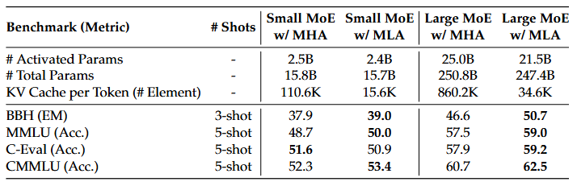

*图 3.2-19 MLA 在报告中的基准结果展示了 cache 压缩和质量保持之间的目标折中*

MLA 和 MHA 在困难基准上的比较显示，DeepSeek-V2 在显著减少 KV cache 的同时保持了较强性能。需要注意的是，MLA 的收益与具体模型、训练设置、kernel 实现和推理负载有关，不能只按缓存压缩比例线性外推端到端速度。

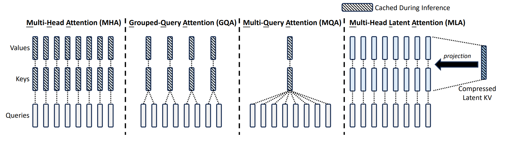

*图 3.2-20 MLA 结构示意，compressed latent cache、上投影和 RoPE 专用路径共同决定缓存体积与额外计算*

这张结构图把 MLA 的工程边界画清楚：cache 里保存的是压缩 latent，attention 计算时需要物化或合并相关投影；RoPE 相关维度单独处理，是为了避免位置旋转直接作用在共享 latent 上破坏相对位置信号。

### 3.2.5.6 CLA 跨层共享 KV

CLA（Cross-Layer Attention）的思路可以类比 GQA：GQA 在注意力头之间共享 K/V，CLA 则在层之间共享一部分 K/V。这样做的直接目标仍然是减少 KV cache，改善推理 latency/throughput 的帕累托边界。它不改变“根据 Q 读取历史 K/V”的基本形式，但改变了缓存的组织方式。

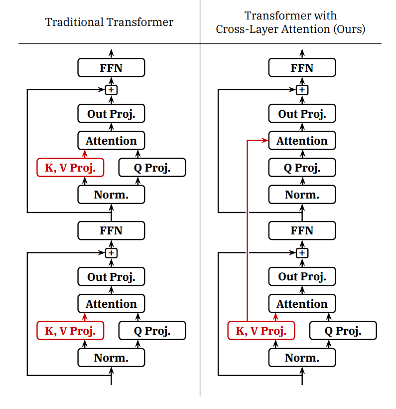

*图 3.2-21 CLA 结构示意，通过跨层复用 K/V 把 cache 压缩从 head 维度扩展到 layer 维度*

CLA 的收益来自减少每层都独立保存 K/V 的开销。代价是相邻层对历史信息的表示会被绑定在一起，因此它更像 cache 组织方式的改变，对 attention 语义的影响需要单独评估。

### 3.2.5.7 稀疏与滑动窗口注意力（SWA / DSA / CSA / HCA）

与共享 KV 改变 K/V 表示不同，稀疏策略改变的是"每个 query 实际去读哪些历史 token"。下面三组子节分别给出从局部窗口到动态稀疏再到细粒度压缩-稀疏混合的实现路径。

**3.2.5.7.1 SWA 滑动窗口注意力**

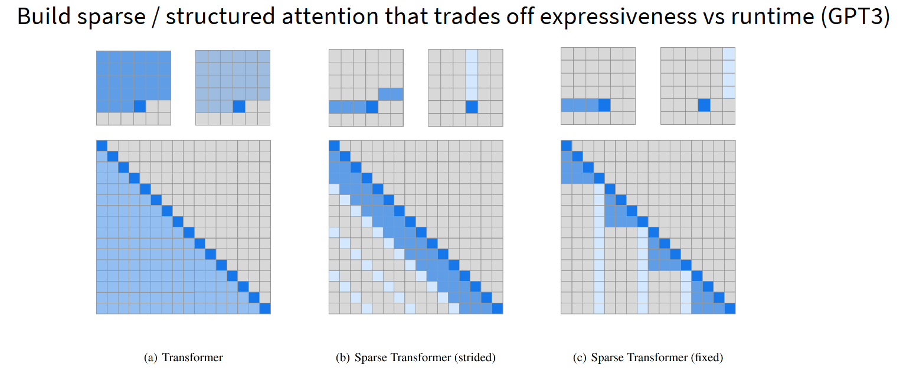

*图 3.2-15 稀疏 attention 用局部窗口、跨块连接和结构化模式减少长序列中的 attention 计算*

稀疏 attention 的基本思路是为每个 query 限制可访问的历史位置：局部窗口保留邻近 token 的高分辨率信息，对角线或跨块模式负责把远处信息传回来。这样可以在表达能力和运行效率之间取得平衡。

GPT-3 最初发布时就采用了这类技巧来实现更大的注意力窗口。滑动窗口注意力是该思想的另一个变体，在每个层级仅关注当前位置的邻近区域。这种方式能有效控制处理长文本所需的总资源量；理论上信息可逐层向外传播，最远距离的上界约为「局部窗口 × 堆叠层数」（实际感受野取决于内容是否被有效聚合）。虽然这些是较早的思路，但现代实现方式有了新的发展。


*图 3.2-16 sliding-window attention 只读取当前位置附近的窗口，堆叠多层后信息可以逐层向更远位置传播*

最近 LLaMA 4、Gemma 3、Gemma 4、OLMo 3 和 Cohere Command A 等模型采用了局部与全局混合的思路：大多数层使用带 RoPE 的 sliding-window attention，只处理局部上下文；间隔若干层再放入 full attention 层，用于跨窗口信息交换。

> [!NOTE]
> **Gemma 4 的两项新设计**：(1) **partial rotary embedding（partial RoPE / P-RoPE）**——`Gemma4TextConfig` 给两类层配不同的 RoPE：full-attention 层是 `rope_type="proportional"`、`partial_rotary_factor=0.25`、`rope_theta=1e6`，只旋转每个 head 前 1/4 的维度，其余维度的旋转频率补零；full-attention 层的 head_dim 还会被 `global_head_dim=512` 覆盖，因此被旋转的是前 128 维。sliding-attention 层保持 `rope_type="default"`、`rope_theta=1e4` 的完整 RoPE，head_dim 用基础值 256。这样长程 full-attention 路径只保留低频旋转分量，短程窗口路径保留完整位置分辨率。(2) **per-layer embedding（PLE）**——每层额外取一份 embedding 输入（`vocab_size_per_layer_input=262144`、`hidden_size_per_layer_input=256`），由 token 身份查表分支和上下文投影分支相加后按 $1/\sqrt{2}$ 缩放送进对应 decoder 层，让参数量可以从主干 hidden size 转移到按层展开的 embedding 表上。

部分 full attention 层会去掉位置编码，即 **NoPE**，让长距离信息不受 RoPE 外推误差直接限制。这个组合可以理解为：RoPE 负责短程相对位置，SWA 控制计算成本，NoPE/full attention 负责低频全局信息流。

**3.2.5.7.2 DSA DeepSeek Sparse Attention**

DeepSeek Sparse Attention（DSA）是一类细粒度动态稀疏注意力方案，目标是在长上下文中只对高价值历史 token 做精细注意力计算，从而降低 full attention 的二次成本。

它和前面的 GQA、MLA、CLA 分工不同：**GQA/MLA/CLA 主要是在缩小或重组要缓存的 K/V；DSA 主要是在决定“到底去看哪些历史 token”**。它属于稀疏读取策略，评估时需要关注历史 token 选择质量和稀疏访问效率。

标准 full attention 让每个 query token 与所有历史 token 计算注意力。长上下文下，这个全连接范式成本很高，而许多任务真正需要高分辨率读取的历史位置只占一部分。DSA 因此采用“先筛选、后计算”的结构：先用轻量模块扫描历史 token，估计重要性分数；再让得分较高的位置进入精细注意力计算。核心组件是 indexer 和 top-k selector。

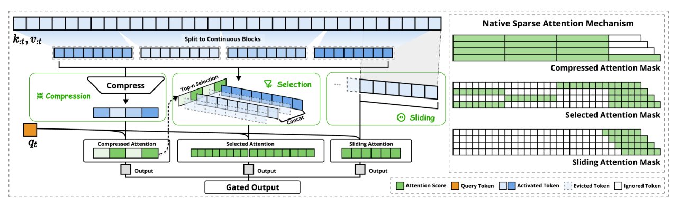

*图 3.2-23 DSA 先用轻量 indexer 估计历史 token 重要性，再把 top-k 位置交给精细 attention*

1. **Lightning Indexer**（闪电索引器）:

为每个 query token 快速扫描历史 token，计算重要性代理分数。这个模块必须比主注意力便宜，否则筛选本身会吞掉稀疏化收益。

2. **细粒度 top-k 选择**

基于索引分，为每个 query 动态构建自己的 top-k 历史集合。如果 $k$ 固定且远小于序列长度 $L$ ，精细注意力部分可以从 $O(L^2)$ 降到近似 $O(Lk)$ 。

这类方法可以作为长上下文适配路线，但是否能后训练接入已有模型，取决于目标模型的注意力分布、稀疏模块训练预算和服务端 kernel 支持。

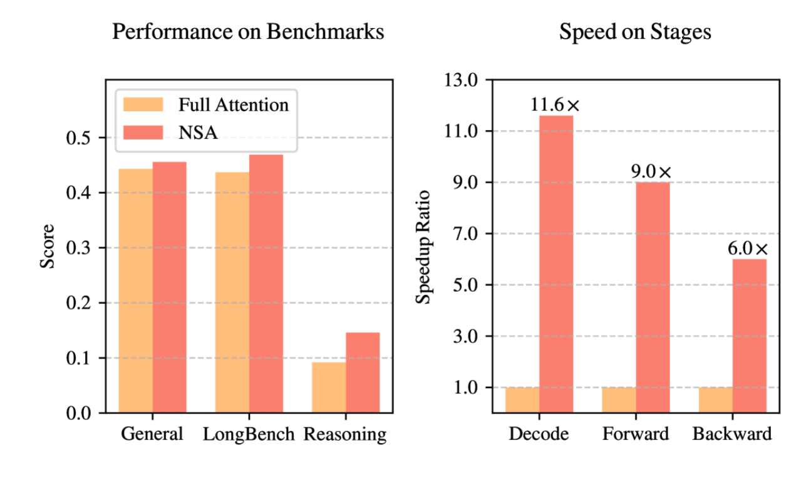

*图 3.2-22 DSA 实验同时报告质量和速度，用于判断稀疏读取是否真的带来端到端收益*

相关实验通常会同时报告质量与速度：稀疏注意力若能维持接近 full attention 的任务表现，同时在长序列的 decode、forward 和 backward 阶段减少计算，就具备工程吸引力。理论复杂度只是第一步，indexer 成本、top-k 选择开销和 kernel 实现同样会决定最终收益。

**3.2.5.7.3 DeepSeek-V4 CSA / HCA 混合注意力**

**CSA 的全称是 Compressed Sparse Attention，压缩稀疏注意力，HCA 的全称是 Heavily Compressed Attention，重度压缩注意力**。

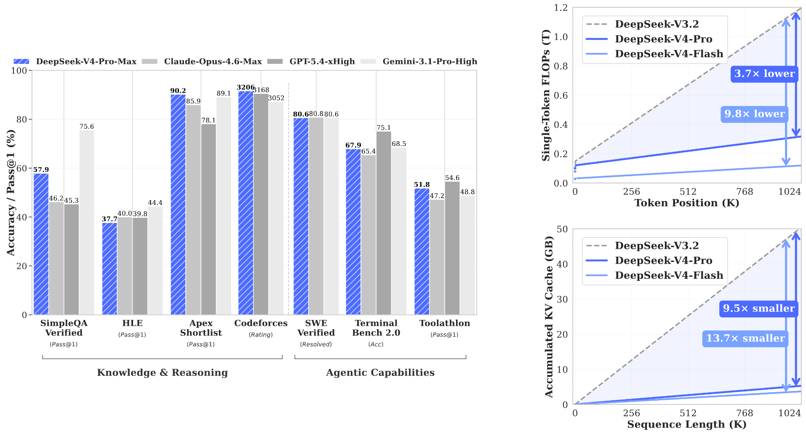

*图 3.2-24 DeepSeek-V4 把资源占用和评测结果放在同一张快照里，便于观察注意力压缩是否换来可接受质量*

图 3.2-24 把资源占用与评测结果放在同一张快照里。结合公开配置和 DeepSeek V4 attention 结构，可以按三条线理解这个结构：CSA/DSA/HCA 负责压缩与稀疏选择长历史；滑动窗口分支和局部 RoPE 负责保留近邻上下文与位置关系；单 KV 头、共享 KV 与 grouped output projection 则共同指向更小的 KV cache、更低的 HBM 带宽压力和更可控的长上下文推理成本。

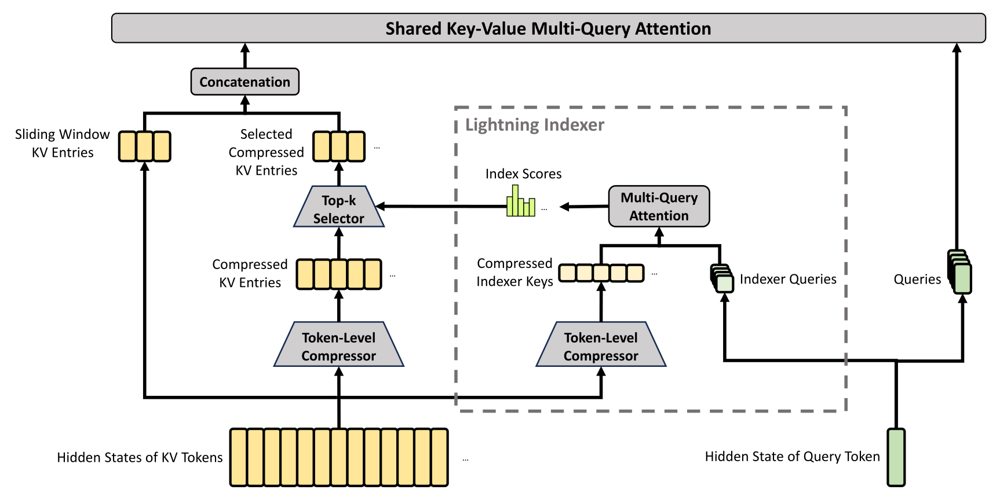

*图 3.2-25 标出每条分支承担的上下文尺度：CSA 高分辨率稀疏块、HCA 低分辨率全局背景、sliding-window 处理近邻、shared KV 与 grouped output projection 共同降低 cache 体积*

CSA 和 HCA 混合注意力架构以 MQA 风格的共享 KV 为基础。核心逻辑是分工：CSA 用较低压缩率和 indexer 保留高分辨率关键块，HCA 用高压缩率提供低成本全局背景，滑动窗口分支负责最近上下文的细粒度依赖。

**3.2.5.7.3.1 CSA：压缩与稀疏的平衡**

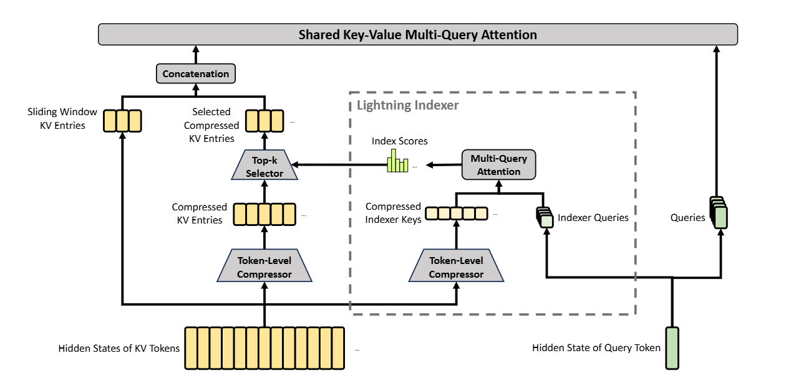

*图 3.2-26 CSA 先把连续 token 压成块级 KV 表征，再用稀疏选择保留高价值历史块*

CSA 的设计哲学是在大幅降低计算量的同时，保留对关键块的高分辨率注意力。它分两步走：**先压缩，后稀疏选择**。

**1. KV cache 压缩**

这是为了避免直接处理海量的原始 KV cache。它将每 **m** 个 token 的 KV cache 压缩成一个条目，即一个块级表征。

CSA 使用可学习的加权压缩机制：模型会为每个 token 计算压缩权重，然后将这 $m$ 个 token 的 K/V 按权重求和，融合成一个块级条目。相邻压缩块共享一部分 token，可以平滑边界信息，降低硬切分带来的信息断裂。这样 KV cache 规模降为原来的 $1/m$ 。在 V4 中，`m` 取值为 `4`；模型同时保留一小组滑动窗口 KV 条目，以增强局部细粒度依赖关系。

**2. DSA 登场**

压缩后，如果对所有块做密集注意力，复杂度依然是平方级的。CSA 接着用稀疏注意力只挑选最相关的块。

先使用**闪电索引器**快速计算当前查询 token 与所有压缩后 KV 块的相关性分数。根据索引分数，只为当前查询 token 保留分数最高的 $k$ 个压缩 KV 块。若序列长度记为 $S$ ，核心注意力的计算量从 $O(S)$ 降为 $O(k)$ ，与序列长度解耦。在 V4 中，Flash 的 **k=512**，Pro 的 **k=1024**；Pro 的这个数字就写在 `DeepSeek-V4-Pro/config.json` 的 `index_topk: 1024` 里，配套的闪电索引器规格是 `index_n_heads: 64`、`index_head_dim: 128`。它和 MoE routing 的 top-k 是两个独立旋钮：同一份 config 中 MoE 侧写的是 `num_experts_per_tok: 6`、`n_routed_experts: 384`，`index_topk` 控制稀疏注意力挑多少个压缩 KV 块，`num_experts_per_tok` 控制每个 token 激活多少个专家。


CSA 层执行流程可以概括为：先对 KV cache 做可学习的加权压缩，再利用闪电索引器低成本选出最相关的 top-k 块，最终核心 attention 只在稀疏选择的块上进行计算。

**3.2.5.7.3.2 HCA：极高压缩率的全局背景**

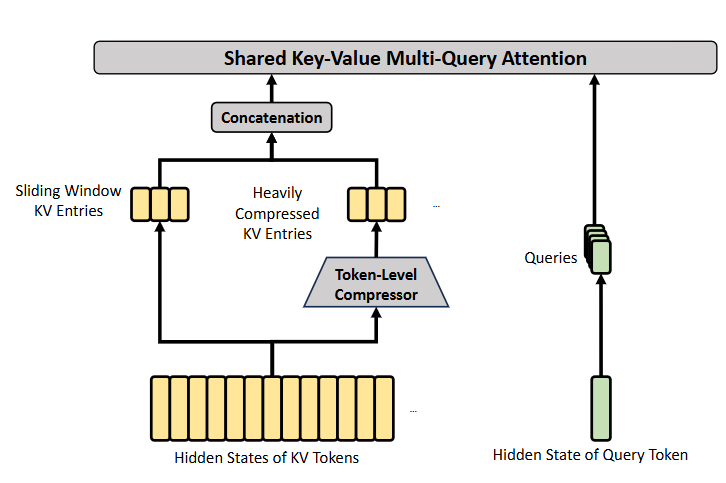

*图 3.2-27 HCA 用更高压缩率维护低成本全局背景，与 CSA 的稀疏高分辨率读取互补*

HCA 的目标是极低成本地维护一个覆盖十万级 token 的全局背景视野。它只做压缩，不做稀疏选择。

其实 HCA 与 CSA 类似，但压缩率 m 比 CSA 要大得多，多个 token 的局部信息被融合。`DeepSeek-V4-Pro/config.json` 的 `compress_ratios` 逐层给出这两档取值（61 层对应 61 个数值）：开头两层是 `128, 128`，之后按 `4, 128` 反复交替到倒数第二层，最末一层的压缩率是 `0`（即全分辨率 full-attention 层）。因此 HCA 层压缩率 128、CSA 层压缩率 4，序列中只有首尾几层与该交替模式不完全吻合。因为压缩得足够狠，序列长度变得极短。所以 HCA 可以在这个极短的序列上进行**密集注意力**，让每个 token 都能不丢失地看到整个全局背景。由于序列短，计算成本完全可控。

### 3.2.5.8 线性时间替代：linear attention / Mamba-2 / Gated DeltaNet

稀疏注意力仍需要 O(nk) 形式的有效复杂度（k 是稀疏选择窗口）；如果想进一步降到线性时间，需要把注意力的递推形式保留下来。下面两个子节依次走过 linear attention 的递推等价形式、Mamba-2 的门控衰减，以及 Gated DeltaNet 在此之上加的写入门与 delta 规则。

**3.2.5.8.1 从 linear attention 到 Mamba-2**

标准注意力的主要成本来自 $QK^\top$，序列长度为 $n$ 时复杂度近似为 $O(n^2)$。如果暂时把 softmax 视为恒等映射，则有：

$$
QK^\top V = Q(K^\top V)
$$

这一步把计算顺序从"先形成 $n \times n$ 注意力矩阵"改成"先累计 $K^\top V$ 状态"。递推写法为：

$$
S_t = S_{t-1} + k_t v_t^\top,\quad y_t = q_t^\top S_t
$$

这就是 linear attention 与循环形式之间的关键联系：训练时可以利用并行形式，推理时可以像 RNN 一样增量更新状态。Mamba-2（Dao & Gu, *Transformers are SSMs: Generalized Models and Efficient Algorithms Through Structured State Space Duality*, [arXiv:2405.21060](https://arxiv.org/abs/2405.21060), 2024）可以从这个角度理解为在线性注意力状态上加入输入相关的门控与衰减：[arXiv:2312.00752](https://arxiv.org/abs/2312.00752) 是原始 Mamba 论文（Gu & Dao, 2023）。

$$
S_t = \gamma_t S_{t-1} + k_t v_t^\top,\quad y_t = q_t^\top S_t + v_t^\top D
$$

其中 $\gamma_t=f(x_t)$ 控制旧状态保留程度。这样做的目标是保留线性时间推理的优势，同时通过 gating 提升表达能力。

实践中的落地形态是 hybrid attention：一部分层使用线性/状态空间类模块，一部分层保留 full attention，以折中长上下文效率和复杂推理质量。MiniMax-01（[arXiv:2501.08313](https://arxiv.org/abs/2501.08313)）用 lightning attention + softmax attention + MoE；Nemotron-H（[arXiv:2504.03624](https://arxiv.org/abs/2504.03624)）把 self-attention 层压到总层数的约 8%（8B 版 52 层里 4 层 attention，56B 版 118 层里 10 层），其余层由 Mamba-2 与 FFN 各占一半交替排布；Qwen3-Next（[Qwen3-Next blog](https://qwen.ai/blog?id=qwen3-next)）用 Gated DeltaNet + full attention 的 3:1 组合。

**3.2.5.8.2 Gated DeltaNet**

在线性注意力这条线上还有 [Gated DeltaNet](https://arxiv.org/abs/2412.06464)（Yang/Kautz/Hatamizadeh, 2024-12）。Gated DeltaNet 把 Mamba-2 的标量衰减 $\gamma_t = \exp(-\Delta_t \cdot \exp(A_{\log}))$ 保留为遗忘门 $\alpha_t$，再额外引入写入门 $\beta_t = \sigma(W_\beta x_t)$，把状态更新写成 delta 形式

$$
S_t = \alpha_t\,(I - \beta_t\, k_t k_t^\top)\,S_{t-1} + \beta_t\, k_t v_t^\top
$$

其中 $\alpha_t$ 与 $\beta_t$ 是两个独立 gate。这里的状态约定沿 Mamba-2 / fla 库写法取 $S_t \in \mathbb{R}^{d_k \times d_v}$，于是 $(I - \beta_t k_t k_t^\top) \in \mathbb{R}^{d_k \times d_k}$ 从左侧作用在 $S_{t-1}$ 上，delta 外积写成 $k_t v_t^\top$（形状 $d_k \times d_v$，与 $S_t$ 同形），对应 [fla 库的 gated delta net 实现](https://github.com/sustcsonglin/flash-linear-attention)。

[Gated DeltaNet 论文](https://arxiv.org/abs/2412.06464) §3.1 的状态更新式取转置约定 $S_t \in \mathbb{R}^{d_v \times d_k}$，因此写成 $S_t = S_{t-1}\bigl(\alpha_t (I - \beta_t k_t k_t^\top)\bigr) + \beta_t v_t k_t^\top$，转移矩阵从右侧作用、delta 外积用 $v_t k_t^\top$。两种写法互为转置，逐元素含义一致。

该形式兼具 RNN 的局部遗忘门控和 linear attention 的并行训练形式；Qwen3-Next 用 3:1 hybrid，Gated DeltaNet 占 3/4 层、softmax attention 占 1/4 层（`full_attention_interval=4`，见 [Qwen3-Next-80B-A3B config](https://huggingface.co/Qwen/Qwen3-Next-80B-A3B-Instruct)）。Hybrid 比例越高，长上下文检索类任务的退化越明显，因此比例本身需要按目标任务调优。

## 3.3 超参数考量与设计原则

这一节给出训练一个新 dense decoder 时常用的几个超参数经验区间：FFN expansion ratio（§3.3.1）、head dim 与 model dim 的比例（§3.3.2）、宽深比（§3.3.3）、vocab size（§3.3.4）、dropout 与 weight decay（§3.3.5）。这些区间描述的是分布中心，不是固定常数；具体模型的层数、头数、$d_{\text{ff}}$ 与正则化设置写在各自的论文、模型卡和官方 config 里，读配置时按这些一手数字对照本节即可。

当你突然被要求训练一个新语言模型时，会对超参数产生很多疑问，因为它们的数量相当多。你应该意识到的一个关键点是：在不同成功模型中，实际上只有少数几个超参数会被调整。业界遵循着相当明确的经验法则和指导原则。比如前馈网络的尺寸应该扩大多少？注意力头数量该如何设定？词表规模多大合适？前馈层（FFN）大小应该比隐藏层大小大多少？有多少个头，num_heads 是否总是应该能整除隐藏层大小？人们是如何扩展这些模型的，是变得更深（deep）还是变得更宽（wide）？

### 3.3.1 前馈神经网络

首先从简单的前馈层开始。假设这是个带偏置 (b) 的 ReLU 版本：

$$
\text{FFN}(x) = \max(0,xW_1 + b_1)W_2 + b_2
$$

这里涉及两个超参数： $d_{\text{model}}$ （输入 x 的维度，即 FFN 的输入维度）和 $d_{\text{ff}}$ （前馈网络维度，即 FFN 的隐藏层输出维度），最终会投影回 $d_{\text{model}}$ 维度。当你打算扩大模型的时候，FFN 通常也会扩大，具体扩大多少倍其实业内早有共识：几乎所有使用 ReLU 类 MLP 的研究者都会将 $d_{\text{ff}}$ 设为 $d_{\text{model}}$ 的 4 倍。

$$
d_{\text{ff}} = 4d_{\text{model}}
$$

这是**经过验证的惯例**，这种惯例**不是百分百正确**的，存在一些例外：

**例外一：GLU 变体会将扩展系数调整为 2/3**

GLU 变体在上投影处多出一条门控分支 V，同一层里有三个矩阵而非两个，要让 MLP 的总参数量与原始 $4d_{\text{model}}$ 版本持平，需要把 $d_{\text{ff}}$ 按 $2/3$ 缩放：

$$
d_{\text{ff}} = \frac{2}{3} \cdot 4 d_{\text{model}} = \frac{8}{3} d_{\text{model}} \approx 2.66 d_{\text{model}}
$$

观察现有模型会发现，许多都遵循这个经验法则，**$8/3 \approx 2.66$**。下一张图（图 3.3-1）会展开 $d_{\text{ff}}$ 与 $d_{\text{model}}$ 的实际分布。

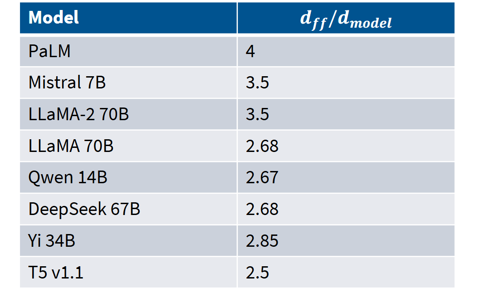

*图 3.3-1 横轴为不同模型族，纵轴为 $d_{\text{ff}}/d_{\text{model}}$ 实测值，标注 GLU 经验值 $8/3$ 与非 GLU 经验值 $4$ 的位置*

以 PaLM 为例，它虽然是 SwiGLU 模型，但把 $d_{\text{ff}}$ 直接设为 $4d_{\text{model}}$，没有做 2/3 缩放。LLaMA-2 70B 与 Mistral-7B v0.1 落在 3.5 倍附近：LLaMA-2 70B 的 `hidden_size = 8192`、`intermediate_size = 28672`，Mistral-7B v0.1 的 `hidden_size = 4096`、`intermediate_size = 14336`，两者都是 $d_{\text{ff}}/d_{\text{model}} = 3.5$。两个模型都用 GQA（`num_key_value_heads = 8`），共享 KV 省下的预算被重新分配给 MLP，于是在 $8/3$ 的基础上再乘约 1.33。

LLaMA-2 7B/13B 仍用 MHA（`num_key_value_heads = num_attention_heads`），FFN expansion 沿用 $8/3$ 左右而没有 GQA 下的 1.33 倍放大。LLaMA-1 7B 的 `hidden_size = 4096`、`intermediate_size = 11008`，$d_{\text{ff}}/d_{\text{model}} \approx 2.687$；DeepSeek-LLM-67B-base 和 Yi-34B 共享 `hidden_size = 7168`、`intermediate_size = 20480`，比值约 $2.857$，落在 $2.66\text{–}2.86$ 区间。Qwen 系列在不同代际之间来回摆动而非单调收敛：原版 Qwen-14B（`hidden_size = 5120`、`intermediate_size = 27392`，`hidden_act: silu`，实际为 SwiGLU）$d_{\text{ff}}/d_{\text{model}} \approx 5.35$，Qwen1.5-14B（`hidden_size = 5120`、`intermediate_size = 13696`，SwiGLU）回到约 $2.675$，Qwen2-7B（`hidden_size = 3584`、`intermediate_size = 18944`，SwiGLU）再次跳到约 $5.29$，明显偏离 $8/3$。原版 Qwen-14B 没有沿用 GLU 的 2/3 缩放，反而把 expansion 推到约 5 倍；Qwen1.5 才把这条经验值拉回 8/3 附近；Qwen2 又回到高 expansion 区段。整体看，Qwen 系列并非单调逼近 $8/3$，而是按代际目标在不同取值之间反复调整，读配置时需要按代核对。

**例外二：T5 模型**

许多语言模型的 FFN expansion ratio 会落在相对集中的范围内，但也存在明显例外。在 110 亿（11B）参数的 T5 模型中，隐藏维度只有 1024，而 $d_{\text{ff}}$ （前馈网络维度）及其向上投影维度是 65536，使 $d_{\text{ff}}$ 与 $d_{\text{model}}$ 的比例达到 64 倍。相比之下，PaLM 的比例因子大约是 4，Gemma 2 等模型也有更大的乘数设置，但整体仍比 T5 的 64 倍温和得多。

Kaplan scaling law 论文里也包含有用的超参数研究：他们考察了 $d_{\text{ff}}$ 与 $d_{\text{model}}$ 的比例，并绘制了随该比例变化时损失值的增长曲线。图中显示存在一个较宽的可接受区间，比例从 1 到 10 左右都接近最优；因此 FFN 宽度应被看成工程区间，需要在表达能力、参数分配、kernel 效率和训练设置之间做权衡。

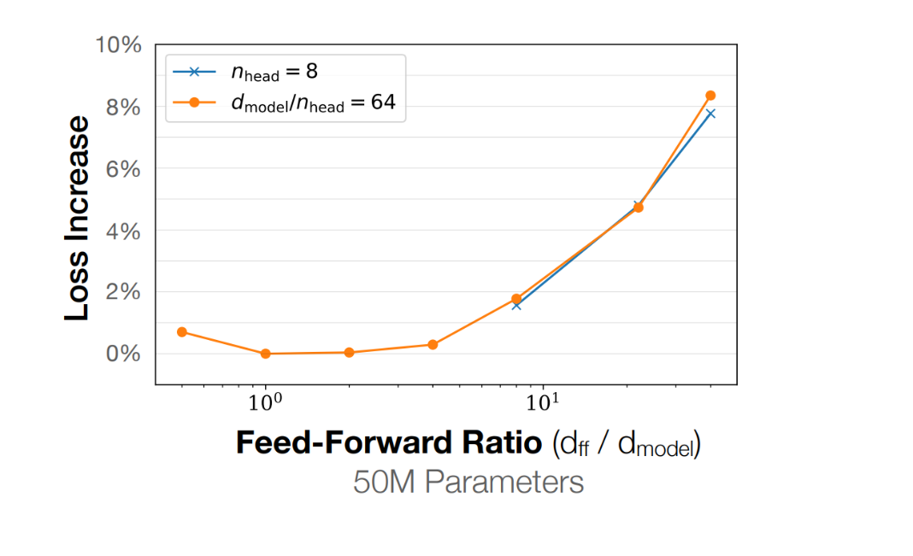

*图 3.3-2 Kaplan 等人的实验显示，FFN expansion ratio 存在较宽的近似最优区间*

不使用 GLU 激活函数时，中间维度可以先从 4 倍乘数开始考虑；使用 GLU 时，常见做法是把中间维度调到约 2.66 倍，以抵消门控结构带来的额外投影分支。T5 说明大比例也能训练，但 T5v1.1 后续采用了更标准的 2.5 倍 GeGLU 乘数；单个模型配置更适合作为案例，不宜直接当成通用定律。

这个比例控制 MLP（FFN）隐藏层的宽度。T5 论文当初选择 64 倍，是希望把更多计算放进宽矩阵乘法，获得更好的硬件利用率。代价是参数和计算量会集中到 FFN 宽度上，可能牺牲一部分表达分配效率；只有当矩阵足够宽、系统吞吐收益明显时，这种取舍才可能划算。

### 3.3.2 注意力头和模型维度的比例

另一个超参数共识是模型维度与头维度乘以头数量的比例。标准做法是保持每个头的维度固定而增加头数量，也可以选择保持单头维度不变来增加注意力部分的参数量，但大多数模型都遵循前一种方案。GPT-3 175B（96 heads × 128 head dim / 12288）和 LLaMA-2 70B（64 × 128 / 8192）的比例都正好是 1：

$$
\frac{\text{NumHeads} \cdot \text{HeadDim}}{\text{ModelDim}} \approx 1
$$

T5 和 LaMDA 是明显例外，T5 把这个比例推到 16。PaLM 540B 也不在 1 附近：论文 Table 1 给出 118 层、48 个头、$d_{\text{model}}=18432$，并注明 attention head size 恒为 256，因此 $48 \times 256 / 18432 \approx 0.67$。除这类特殊设计外，1:1 仍是更常见的起点。

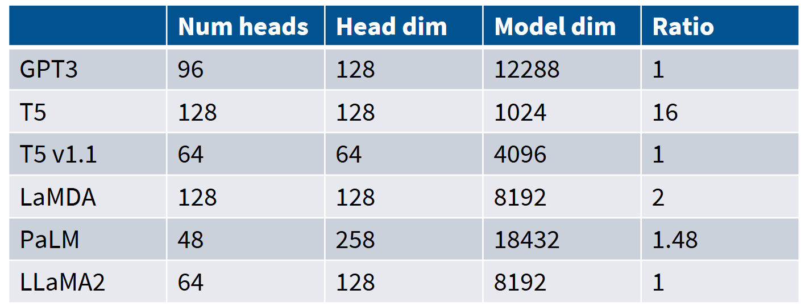

*图 3.3-3 多数模型让 head 数量乘以 head dim 接近 model dim，但也存在 T5、LaMDA 等例外*

Bhojanapalli 等人在 [*Low-Rank Bottleneck in Multi-head Attention Models*, arXiv:2002.07028](https://arxiv.org/abs/2002.07028) 中提出，如果 head dim 过小而头数继续增加，attention 矩阵会落入低秩瓶颈，限制表达能力。1:1 比例附近则一般没有表现出明显的低秩约束，这是当前主流模型能稳定落在这条经验线上的部分原因。

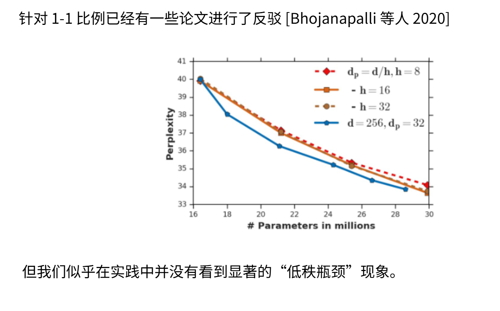

*图 3.3-4 head 维度比例改变 attention 参数分配，实践中常从 1:1 附近起步再按模型族和硬件约束调整*

### 3.3.3 模型的宽深比

我们的模型应该是要**深度还是宽度**？要多深和多宽？

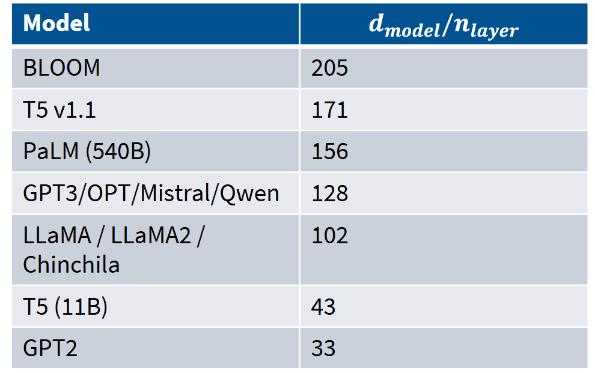

*图 3.3-5 宽深比通常以 $d_{\text{model}}/n_{\text{layer}}$ 观察，不同模型族集中在一段经验区间内*

主流 dense decoder-only 模型的宽深比集中在每层约 100–200 个隐藏维度，即 $d_{\text{model}}/n_{\text{layer}} \approx 100\text{–}200$。按各模型官方 config 计算：BLOOM 176B 14336/70 ≈ **205**、T5 v1.1 XXL 4096/24 ≈ **171**、PaLM 540B 18432/118 ≈ **156**、GPT-3 175B 12288/96 = **128**、OPT-6.7B 与 Mistral-7B v0.1 4096/32 = **128**、Qwen-7B 与 OLMo-3-7B 同样是 4096/32 = **128**、Qwen2-7B 3584/28 = **128**、LLaMA-1 7B 4096/32 = **128**、LLaMA-1 65B 与 LLaMA-3 70B 8192/80 ≈ **102**、Gemma 3 27B 5376/62 ≈ **87**、Gemma 4 E2B 2048/35 ≈ **59**、Gemma 4 31B dense 4608/48 ≈ **96**。

encoder-decoder 族整体更窄：T5-11B 的 `d_model = 1024` 配 `num_layers = 24`，比值降到 40 出头。所以这条经验区间只在 dense decoder-only 内部稳定，跨族外推会失效；Gemma 4 的小模型（E2B）落在 decoder-only 区间偏低的一端，而同代际的 31B dense 又回到接近 LLaMA-2 70B 的 ~96 区间。

宽深比的考量非常重要，它会控制可用并行度。如果采用流水线并行，通常会将不同层切割后分配到不同设备或设备块上；对于特别宽的模型，可以采用张量并行，将矩阵切片分布到多个 GPU 上。不同并行范式会产生不同约束：张量并行需要非常高速的网络，而流水线并行对网络速度或延迟的要求可以稍低。因此网络约束可能反过来影响宽度-深度的决策。

抛开这些限制，宽深比对模型性能仍可通过一组控制实验来观察。Kaplan 等人在固定非嵌入参数量的前提下扫描模型形状（图 5 中分别是 50M 与 25M 两组），横轴是宽深比 $d_{\text{model}}/n_{\text{layer}}$，纵轴是损失相对 $L(N)$ 拟合基线的百分比增幅。结论是形状影响很轻微：宽深比变化 40 倍时损失只抬高几个百分点，$(n_{\text{layer}}, d_{\text{model}}) = (6, 4288)$ 的损失落在 GPT-2 所用 $(48, 1600)$ 配置的 3% 以内。

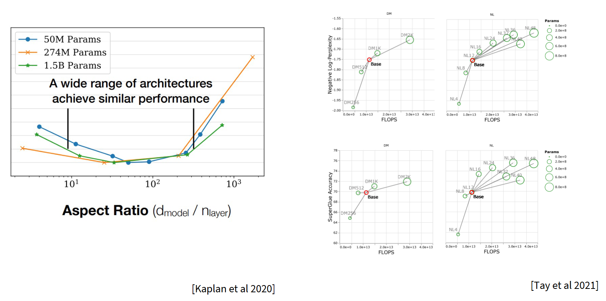

*图 3.3-6 宽深比实验显示 loss 对宽深配置有宽容区间，但下游任务和并行策略会改变最终选择*

Google 的 Yi Tay 等人研究了深度与宽度在上游和下游任务中的影响（*Scale Efficiently: Insights from Pre-training and Fine-tuning Transformers*, [arXiv:2109.10686](https://arxiv.org/abs/2109.10686)）。他们发现：如果仅关注损失值，参数数量比深度本身更关键；但当下游准确率作为评估指标时，情况不那么明确。在相同计算量（FLOPs）下，更深的模型可能在部分下游任务上更有优势。这类结论需要结合任务和训练设置理解，不能只从 loss 曲线外推所有能力。

### 3.3.4 词汇表大小

总体而言，词汇表规模呈现不断扩大的趋势。这很大程度上是因为大语言模型正在实际部署中投入使用，需要与使用不同语言的人群交互，并处理表情符号等各种近乎模态化或超出预期的语言形式。早期模型（尤其是单语模型）的词汇量通常在 **3 万到 5 万** token 之间，比如早期的 GPT 和 LLaMA 系列。

多语言模型或生产系统模型的词汇量通常会扩展到 **10 万到 25 万** 的范围。以注重多语言处理的 Cohere Command 模型为例，其词汇量就比较大；GPT-4 及后续采用 GPT-4 tokenizer 的模型，词汇量也达到 10 万 token 左右。因此，词表规模增大可以看成服务多语言、低资源语言和复杂输入形态的一种工程选择，不能只理解为追求更大的 vocab size。

**多语言词表与单一语言性能**

多语言词表对高资源语言（比如英语和中文）的直接收益通常较小。如果只考虑英语语言建模，较小词表也能胜任。大词表更明显的优势在低资源语言和复杂 Unicode 输入上：同一句话可以用更少 token 表示，从而降低 prefill/generation 的序列长度和推理成本。

### 3.3.5 dropout 和其他的正则化方法

模型运行前需要设置的两个重要组件：dropout 和其他正则化方法。

预训练看似是最不需要正则化的场景——因为**预训练通常只进行一个训练周期**，由于数据量过大甚至无法完整遍历所有数据，**单轮训练**几乎不可能导致过拟合。这似乎构成了不需要正则化的充分理由。但实际情况却比较复杂。早期研究大量使用 dropout，权重衰减也被广泛采用。虽然现在很多团队不再详细发布训练超参数，但 dropout 已逐渐失宠，而权重衰减**仍被持续使用**。

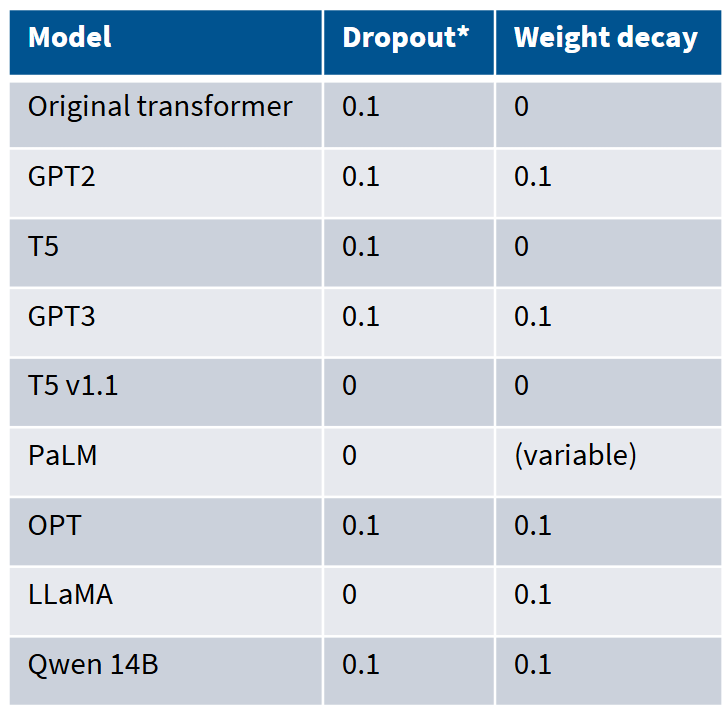

*图 3.3-7 横轴按模型发布年份排布，纵轴分别给出 dropout 与 weight decay 的设置，圆点大小表示训练 token 量级*

许多旧模型在预训练期间使用了 dropout：原始 Transformer、GPT-2、GPT-3、T5、OPT 与 Qwen 14B 的 dropout 都是 0.1，其中 GPT-2、GPT-3、OPT 与 Qwen 14B 同时配 weight decay 0.1，原始 Transformer 与 T5 的 weight decay 为 0。较新的模型把 dropout 记为 0，只保留 weight decay：T5 v1.1 与 PaLM 的 dropout 为 0，LLaMA 的 dropout 为 0、weight decay 为 0.1；Qwen 14B 是这一趋势里的例外。新模型的训练设置披露也常省略 dropout 这一项。

这个现象值得单独解释：当使用 SGD 在海量数据上对巨型神经网络进行单轮训练时，为什么还要使用权重衰减？

实验给出的线索是：在这类设置里，权重衰减并非主要用于控制过拟合。不同强度的权重衰减并不会明显改变训练损失与验证损失之间的比例关系；需要关注的是，权重衰减会与优化器和 learning rate scheduler 产生交互。

在这类观察中，权重衰减更像是与 learning rate scheduler 共同作用的优化技巧，而不只是传统意义上的防过拟合正则项。它可能帮助训练后期获得更低 loss，但具体效果依赖优化器、学习率衰减、数据量和模型规模，因此技术报告通常会明确写出 weight decay 设置。

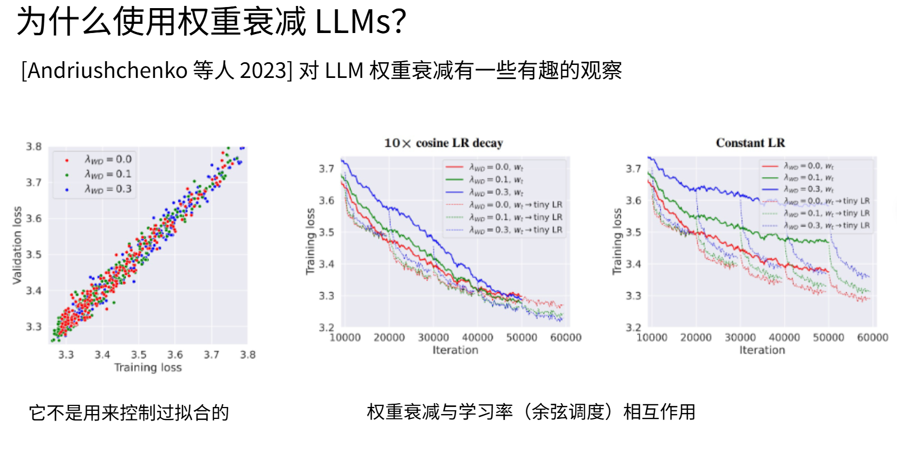

*图 3.3-8 权重衰减与 learning rate scheduler 耦合，训练后期 loss 变化不能只由单个超参数解释*

图 3.3-8 展示了不同权重衰减设置与学习率调度之间的交互：高权重衰减的模型初始进展较慢，但随着学习率降低（即冷却过程），loss 会快速下降。这说明优化器、weight decay 和 learning rate scheduler 之间存在耦合；训练末期的表现不能只由单个超参数解释。

## 3.4 模型的稳定性

这一节给出三类 softmax 稳定化技巧：z-loss 控制输出层 softmax 的归一化项（§3.4.1）；QK norm 控制 attention softmax 的输入范围（§3.4.2）；soft-capping 用 tanh 把 logits 平滑限制在 $[-cap, +cap]$（§3.4.3）。三类技巧的目标都是把梯度范数从频繁尖峰的状态拉回更平滑、可控的区间，在更大模型、更长训练、更激进学习率下减少 loss spike。

过去一年的核心架构变化不大，但许多发布版本都突出强调了称之为**稳定性技巧**的内容。这些技巧旨在以更稳定的方式训练模型。随着模型规模不断扩大，训练时间持续延长，这类稳定性问题愈发凸显。

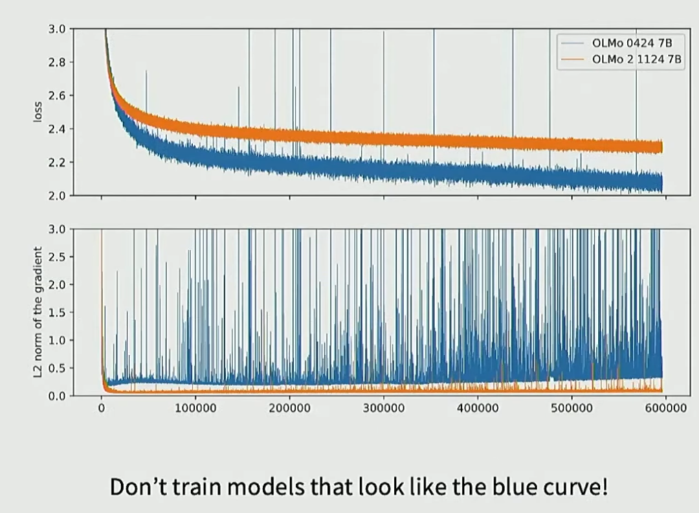

*图 3.4-1 OLMo2 的训练曲线显示，loss 平滑下降时梯度 L2 norm 仍可能出现尖峰*

OLMo2 论文提供了一个很典型的稳定性案例：仅看 loss 曲线时，训练似乎还能继续；但观察梯度 L2 norm 会发现蓝色曲线出现频繁尖峰，说明模型内部的梯度尺度已经不稳定。

这种训练状态很难长期稳定收敛，最终可能因为梯度范数爆炸而中断。稳定性技巧的目标，就是把梯度范数从频繁尖峰的状态拉回更平滑、可控的区间。Transformer 中许多位置都可能失稳，但 softmax 是需要重点关注的模块：指数运算会放大 logits 的极端值，归一化项也可能带来数值问题。Transformer 中有两个关键 softmax：输出层 softmax，以及 self-attention 中归一化 attention weights 的 softmax。

在 Transformer 的两个 softmax 模块中：

- 自注意力 softmax：计算注意力权重时，logits（ $QK^T$ ）可能过大，导致梯度消失；
- 输出层 softmax：生成分布时，logits 可能爆炸，使交叉熵损失不稳定。

### 3.4.1 z-loss 技术：解决输出层的 softmax

z-loss 是一种 softmax 归一化器正则化技术，约束 **softmax 分母（归一化因子 Z）过大或过小** 的情况，从而稳定训练过程。它作用在最终 softmax logits 上的形式最早出现在 Mesh TensorFlow 代码库（[Shazeer et al., 2018](https://arxiv.org/abs/1811.02084)）；ST-MoE（[arXiv:2202.08906](https://arxiv.org/abs/2202.08906)）把同一思路改造成用于 router 的 router z-loss，并在论文里写明这是对 Mesh TensorFlow 中 final softmax logits z-loss 的改编。PaLM（Chowdhery et al., 2022, [arXiv:2204.02311](https://arxiv.org/abs/2204.02311)）在训练设置里给出了这条被广泛引用的写法：辅助损失取 $10^{-4} \cdot \log^2 Z$，目标是让 $\log Z$ 保持接近 0。

$$
\mathcal{L}_{\text{z-loss}} = \lambda \cdot \log^2 Z
$$

其中：

**$Z$**：softmax 的归一化因子（partition function），$Z = \sum_{i=1}^{V} \exp(z_i)$

**$\lambda$**：权重系数（PaLM 使用 **$10^{-4}$**）

**$z_i$**：logits（未归一化的预测分数）

**总损失函数**：

$$
\mathcal{L}_{\text{total}} = \mathcal{L}_{\text{cross-entropy}} + \lambda \cdot \log^2 Z
$$

它的目的是让 softmax 归一化器保持在良好的区间内。当 $Z$ 接近 1（即 $\log Z$ 接近 0）时，可以认为 softmax 处于较稳定状态。PaLM 之后，Baichuan 2、DCLM、OLMo 2、OLMo 3 等模型也在输出 softmax 上加了 z-loss，其中 OLMo 2 的架构表把 z-loss 权重列为 $10^{-5}$。z-loss 控制输出层 softmax 的归一化项，QK norm 和 soft-capping 则控制 attention softmax 的输入或范围。

### 3.4.2 解决注意力层的 softmax

$$
\text{Attention}(Q, K, V) = \text{softmax}\left(\frac{Q K^{\mathrm{T}}}{\sqrt{d_k}}\right)V
$$

标准流程：

- $Q = W_q(x)$
- $K = W_k(x)$
- $\text{logits} = QK^{\mathrm{T}} / \sqrt{d_k}$

先让查询向量和键向量通过层归一化层（早期实现用 LayerNorm，现代实现多用 RMSNorm）：

- $Q = \text{RMSNorm}(W_q(x))$
- $K = \text{RMSNorm}(W_k(x))$
- $\text{logits} = QK^{\mathrm{T}} / \sqrt{d_k}$

在进行 **softmax** 点积运算之前，先让**查询向量和键向量通过归一化层**。这是另一种控制 softmax 行为的思路：通过控制 softmax 输入的数值范围来抑制极端 logits。

这个技巧最初来自视觉和多模态模型领域，Dehghani 等人 2023 年关于训练超大视觉 Transformer 的论文（*Scaling Vision Transformers to 22 Billion Parameters*, [arXiv:2302.05442](https://arxiv.org/abs/2302.05442)）采用了相关做法。随后 Meta 的 Chameleon 和 Hugging Face 的 Idefics 在多模态训练组件中采用了这个技巧，Gemma 2、DCLM、OLMo 2 等模型也用它稳定训练。

QK norm 的核心作用是控制进入 attention softmax 的 logits 范围。它延续了本章前面关于 norm 的经验：如果某处容易出现数值尖峰，可以尝试在非 residual 路径或 logits 相关路径上增加 norm。和 z-loss、soft-capping 一样，QK norm 的目标都是控制 softmax 的输入或归一化项，让模型在更大规模、更长上下文或更激进学习率下减少 loss spike。

LayerNorm 或 RMSNorm 不只是训练期辅助项；推理阶段也会保留。因为 norm 层的缩放参数已经成为模型函数的一部分，移除它会改变 hidden state 的尺度和分布，后续层无法按训练时学到的方式处理这些 activation。

### 3.4.3 第三个方法：对输入 softmax 的 logits 进行软截断

软截断（Soft-clipping） 技术，也称为 logit-capping 或 tanh-scaling，是一种新兴的 softmax 稳定化策略。其核心思想是：在内积运算后、softmax 之前，通过 tanh 函数动态压缩 logits 的极端值，使其保持有界。

**标准缩放点积**

$$
\text{logits} = Q \cdot K^T / \sqrt{d_k}
$$

**可能范围: (-∞, +∞)**

**软截断（Gemma 2 采用）**

Gemma 2 在两处分别设置软截断：attention logits 用 $\text{cap} = 50.0$，final layer logits 用 $\text{cap} = 30.0$（对应 `Gemma2Config` 的 `attn_logit_softcapping=50.0` 与 `final_logit_softcapping=30.0`）。attention 路径上的软截断阈值可记为：

$$
\text{cap} = 50.0
$$

$$
\text{logits}_{\text{clipped}} = \text{cap} \cdot \tanh(\text{logits} / \text{cap})
$$

**范围: (-cap, +cap)**

在完成自注意力机制的内积运算后，将其通过软截断的 softmax 函数处理。`cap · tanh(logits / cap)` 把 logits 同时除以和乘以 `cap`，使输出落在 $(-cap, +cap)$ 之间。

当 logits 大幅超过 soft cap 时，tanh 函数会接近 1，整体输出被限制在 cap 附近。因此，soft-capping 可以看成对 logits 的平滑裁剪。它的采用面比 QK norm 和 z-loss 窄：Gemma 2 同时在 attention 和输出层用了软截断，而 OLMo 2 的稳定性配方是 RMSNorm + 非残差 post-norm + QK norm + z-loss，并没有引入 tanh 软截断。

另一组证据来自 NVIDIA 关于 LLM 训练稳定性的实验（*Methods of improving LLM training stability*, [arXiv:2410.16682](https://arxiv.org/abs/2410.16682)）：在同一套 bf16 设置下，基线困惑度是 11.19，soft cap 为 11.24，落在 ±0.1 置信区间内，与基线没有显著差别；而 QK 归一化把困惑度降到 10.84（QKV norm 10.85、QK FC norm 10.87、QK norm + cap 11.00）。QK norm 的额外价值在于允许更激进的学习率而不发散。

## 3.5 总结与下章衔接

到这里应能在「训练稳定性 / 表达能力 / 推理成本 / 长上下文能力」四类判断之间拆解任意 dense decoder 配置：默认骨架（Pre-norm + RMSNorm + no bias + SwiGLU + RoPE）解决稳定性与表达效率；KV cache 共享（MQA / GQA / MLA / CLA）解决推理成本；稀疏读取（SWA / DSA / CSA / HCA）与线性时间替代（linear attention / Mamba-2 / Gated DeltaNet）解决长上下文效率；超参数区间（§3.3）与稳定性技巧（§3.4）共同决定这套骨架在给定硬件和训练设置下能否稳定收敛。

下一步是把 dense FFN 换成 routed experts——同一组 FFN 参数被切成多份，由 router 在每个 token 上挑选 top-k：[第 4 章 混合专家模型](../chapter4/chapter4_混合专家模型.md) 接管条件计算与负载均衡的系统视角。Attention alternatives 的工程实现（FlashAttention、PagedAttention、sparse attention）的执行视角在 [第 5 章 §5.8 KV cache：HBM 上的另一笔账](../chapter5/chapter5_GPU和GPU相关优化.md) 与 [第 9 章 推理系统](../chapter9/chapter9_推理系统.md) 中按"算力 vs 显存 vs 调度"展开。

## 来源与更新记录

- 课程映射：Lecture 3 提供现代 dense Transformer 默认骨架；Lecture 4 补充 attention alternatives 与 MoE 边界；Lecture 10 支撑 GQA、MLA、CLA 与 KV cache 的推理成本讨论。
- 相关论文：Transformer、RMSNorm、SwiGLU/GLU、RoPE（[RoFormer, arXiv:2104.09864](https://arxiv.org/abs/2104.09864)）、[GQA](https://arxiv.org/abs/2305.13245)、[MLA / DeepSeek-V2](https://arxiv.org/abs/2405.04434)、CLA、[Gated DeltaNet](https://arxiv.org/abs/2412.06464)。
- 架构消融与超参数：[Narang et al., EMNLP 2021](https://arxiv.org/abs/2102.11972)（Table 1 的 step/s 与 final loss）、[Kaplan et al., 2020](https://arxiv.org/abs/2001.08361)（Figure 5 的 FFN ratio / aspect ratio / head dim 扫描）、[PaLM](https://arxiv.org/abs/2204.02311) Table 1 与训练设置、[ST-MoE](https://arxiv.org/abs/2202.08906)（router z-loss 与 Mesh TensorFlow z-loss 的关系）、[OLMo 2](https://arxiv.org/abs/2501.00656) Table 3 的稳定性配方、[Methods of improving LLM training stability, arXiv:2410.16682](https://arxiv.org/abs/2410.16682) Table 4 的困惑度对比、[Bhojanapalli et al., ICML 2020](https://arxiv.org/abs/2002.07028)（Low-Rank Bottleneck in Multi-head Attention Models）。
- 官方配置：[`mistralai/Mistral-7B-v0.1`](https://huggingface.co/mistralai/Mistral-7B-v0.1)、[`facebook/opt-350m`](https://huggingface.co/facebook/opt-350m)、[`Qwen/Qwen2-7B`](https://huggingface.co/Qwen/Qwen2-7B)、`Gemma2Config` 与 `Gemma4TextConfig`（Hugging Face Transformers main 分支）、[Hugging Face DeepSeek-V4 文档](https://huggingface.co/docs/transformers/main/model_doc/deepseek_v4)与 [DeepSeek-V4-Pro 配置](https://huggingface.co/deepseek-ai/DeepSeek-V4-Pro/blob/main/config.json)。查阅日期：2026-09-04。
