# 第 4 章 混合专家模型

专家混合模型（Mixture of Experts, MoE）是扩展 LLM 容量的重要技术。它把一部分 dense FFN 替换为多个 experts，并让每个 token 只激活少数 experts，从而在每 token FLOPs 相对可控的情况下增加总参数量。

DeepSeek、Kimi、Qwen、GLM、MiMo 等模型族都探索过 MoE 架构。MoE 的收益来自条件计算：总参数量可以变大，每个 token 实际经过的 FFN 路径仍保持稀疏；相应代价是 routing、load balancing、all-to-all、expert parallelism 和 training stability 都变成一等工程问题。

## 本章主线

本章围绕 MoE 的一条前向路径展开：router 给 token 打分，top-k 选择 experts，dispatch 把 token 发到 expert 所在设备，expert FFN 计算，再 combine 回原 token 顺序。理解这条路径以后，参数量、active parameters、load balancing、all-to-all 和 expert parallelism 就不再是分散名词，而是同一套条件计算系统的不同账本。

## 本章学习目标

1. 理解 MoE 的 conditional compute 如何同时扩大总参数量并控制每 token FLOPs。
2. 分清 token-choice、expert-choice、global matching、hash routing 的执行差异。
3. 解释 aux loss、aux-free/per-expert bias、router FP32、token dropping 与 upcycling 的作用边界。
4. 从系统角度理解 all-to-all、MegaBlocks/grouped GEMM、EP/ETP/EDP 与 TP/PP/SP/CP 的组合。

## 4.1 分析 MoE

MoE 通过将原本的单一前馈网络（如 MLP/FFN）替换为由多个并行子网络组成的 expert 集合，并通过 routing 在每次计算中仅激活少数 experts。其核心思想是：模型总体包含大规模参数，但每个输入只使用其中一小部分 experts，使得**容量大但计算稀疏**。

> [!NOTE]
> MoE 的优势通常出现在参数规模、数据量和系统实现都足够大的场景。小模型、低通信带宽或 routing 不稳定时，MoE 可能不如同预算 dense 模型。

### 4.1.1 路由机制与负载均衡

在 MoE 模型中，router 负责从全部 experts 中为每个 token 选择少量 experts 参与计算。当前大多数大规模 MoE LLM 采用可学习 router logits + top-k 的 token-choice routing；expert-choice、global matching 和 hash routing 则分别在负载控制、全局最优和实现稳定性上做不同取舍。

初始理解可以很朴素：router 是作用在 token 级别上的轻量线性打分器，输出的是 expert logits；复杂主题分类不在它的职责内。

> [!NOTE]
> “专家”这个名字容易让人联想到医疗专家、法律专家或财经专家，但大规模 MoE 里的 expert 通常不是这种人类语义标签。更常见的现象是某些 token 类型、符号、语言片段或表示模式更容易落到某些专家上；能否形成稳定可解释分工，取决于表示空间、路由约束、负载均衡和训练数据共同作用。

> [!NOTE]
> 早期也有尝试用强化学习优化离散路由，即把路由视为策略学习问题。但由于梯度方差、训练稳定性与计算成本较高，这条路线很少成为大规模 MoE LLM 的默认方案。

常见 routing 方式可以概括为四类。**top-k routing** 让 token 选择得分最高的 k 个 experts，是 GShard、Switch Transformer、Mixtral、DeepSeek、Qwen MoE 等工作的常见基线；**hash routing** 用非学习规则把 token 分到 experts，稳定、便宜，但表达能力受限。
**matching routing** 把 routing 看成匹配问题，理论上能更全局地平衡 experts，但工程复杂度更高；**RL routing** 则因为梯度方差、系统成本和稳定性问题，较少成为大规模默认方案。

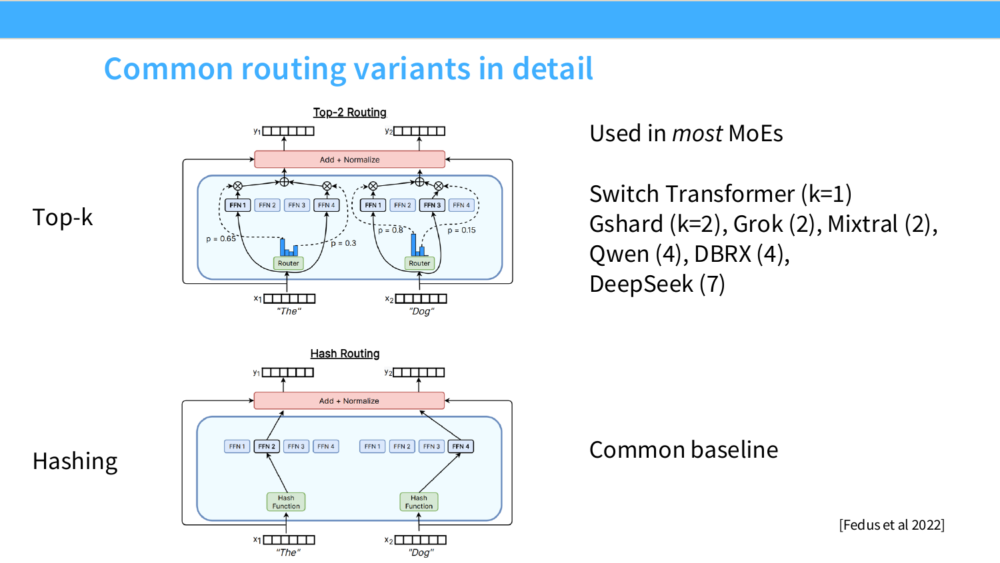

*图 4.1-1 常见 MoE routing 选择方向*

图 4.1-1 把 routing 写成一个 token-expert score 矩阵。token-choice routing 沿 expert 维度为每个 token 取 top-k，保证 token 侧覆盖更自然；expert-choice routing 沿 token 维度为每个 expert 取 top-k，容量更容易受控；global routing 试图一次性求出整张矩阵上的分配。

这个矩阵视角能解释后面的系统问题：无论选择方向如何，最终都要把 token 重排到 expert batch 中，负载倾斜会直接变成设备等待和通信尾延迟。

从选择方向看，路由还可以拆成三种更具体的形式：

- **token-choice routing**：每个 token 根据 router logits 选择 top-k experts。这是当前大多数 MoE LLM 的默认形态，语义覆盖更直接，但热门 experts 容易过载。
- **expert-choice routing**：每个专家从 token 集合中选择自己要处理的 top-k token。它天然控制专家容量，但可能让部分 token 没有专家处理，需要额外兜底。
- **global matching routing**：把 token-expert 分配写成全局匹配或线性分配问题，理论上能同时优化质量和负载，但代价是实现复杂、调度不友好，较少成为大模型默认方案。

路由质量不能只看 perplexity。真实系统里还要同时看四个指标：专家负载是否均衡，token 是否被丢弃，all-to-all 通信是否成为瓶颈，以及 router logits 是否在低精度下稳定。router 常常需要比专家计算更保守的精度和正则化，例如 router FP32、router z-loss、aux loss 或 per-expert bias。

> [!NOTE]
> DSA（DeepSeek Sparse Attention）虽然也会出现 top-k 选择，但它属于注意力稀疏化。前者在挑“该读哪些历史 token”，MoE routing 在挑“该激活哪些专家 FFN”。

负载均衡有三条常见路线：

- **auxiliary loss**：显式惩罚专家负载不均，是 Switch Transformer、GShard、早期 DeepSeek MoE 等工作的常见做法；缺点是会把路由质量和均衡目标耦合起来。
- **aux-free / per-expert bias**：通过给专家打可调整偏置，让热门专家分数下降、冷门专家分数上升，尽量不把均衡项直接加入主损失；DeepSeek-V3 一类工作展示了这条路线的价值，但通常仍会保留序列级或设备级的辅助稳定项。
- **capacity factor / token dropping**：给每个 expert 设置容量上限，超额 token 被丢弃或走残差/备用路径。它能保护系统吞吐，却会让被丢弃 token 没有 expert 梯度，因此更适合作为系统兜底手段。

per-expert balancing 和 per-device balancing 解决两个层级的问题。前者关心“每个 expert 是否都有足够 token 和梯度”，避免少数 experts 富者愈富、其他 experts 长期饥饿；后者关心“每台设备是否都在忙”，因为多个 experts 会被放在不同 GPU 或不同节点上，即使 expert 平均负载看起来合理，也可能出现某台设备承载的 experts 整体更热门，从而拖慢整层 MoE。

可以把一次 MoE 前向传播拆成五步：

1. 对每个 token 的 hidden state 做一次轻量线性投影，得到对所有专家的 router logits。
2. 在 token 维度上选 top-k experts，并把分数归一化成 combine weights。
3. 按 expert 把 token 重新分桶；跨设备 experts 会触发 all-to-all dispatch。
4. 每个 expert 只处理分给自己的 token batch，系统侧通常用 grouped GEMM 或 MegaBlocks 提高不规则 batch 的利用率。
5. 把专家输出按原 token 顺序 combine 回来，继续进入后续层。

这个流程说明 router 的核心工作是“打分和调度”。experts 是否形成可解释分工，取决于训练数据、表示空间、负载约束和系统调度共同作用，通常不能直接解释成人类意义上的主题分类。

从系统角度看，最容易被低估的是第 3 步和第 5 步：dispatch 会把同一个 batch 的 token 打散到不同 experts，combine 又必须按原 token 顺序还原。experts 分布在多 GPU 上时，这两步会变成 all-to-all 通信；如果热门 expert 过载，即使单个 expert FFN 很快，整层也会被最慢 expert 拖住。因此学习 MoE 时应同时看 routing 质量、load balancing、通信开销和数值稳定性。all-to-all 的实现、EP/ETP/EDP 拓扑选择、1F1B A2A Overlap 等调度技巧在 [第 7 章 §7.9.2 EP / ETP / EDP](../chapter7/chapter7_分布式训练.md) 展开。

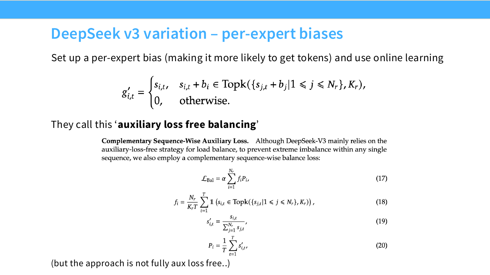

*图 4.1-2 基于 per-expert bias 的负载均衡*

图 4.1-2 展示的是 DeepSeek-V3 一类 aux-loss-free balancing 的核心动作：每个 expert 维护一个 bias，routing 时用 $s_{i,t}+b_i$ 参与 top-k。近期负载偏高的 expert 会被降低偏置，负载偏低的 expert 会被提高偏置。这样做把均衡压力放到在线调度变量上，减少它对语言模型主损失的直接干扰；边界条件是它仍需要序列级或设备级约束防止极端倾斜。

假设一共有 $E$ 个专家，输入为 $x$ ，门控函数为 $G(\cdot)$ 用于决定每个专家的权重， $E_i(\cdot)$ 表示第 $i$ 个专家的输出，则 token-choice routing 和 expert-choice routing 的通用门控机制可以写成：

$$
y = \sum_{i \in \mathcal{T}} G_i(x) E_i(x)
$$

实现稀疏化的关键步骤是确定集合 $\mathcal{T}$ 。无论是 token-choice 还是 expert-choice， $G(x)$ 的计算过程都包含两个步骤：

- **打分：** 计算 routing score $h(x) = x \cdot W_g$ 。
- **稀疏化：** 仅保留分数最高的 $k$ 个 experts 或 token，并对这些分值进行 softmax 归一化。未被选中的 $E - k$ 个 experts 权重被置零，它们在本次前向传播中不参与计算，从而在总参数很大的情况下控制实际 FLOPs。

> [!NOTE]
> $W_g$ 是 router 中的可学习线性投影层，会把每个 token 的特征映射为与 expert 数量相同的 logits。TC 模式下是 token 主动选择 experts，EC 模式下是 expert 主动选择 token。

> [!NOTE]
> 可学习路由能否发挥作用，不只取决于 TC/EC 等路由形式，还取决于输入表示是否已经具备足够语义结构。表示空间越可分，router 越容易形成稳定且有意义的专家选择。

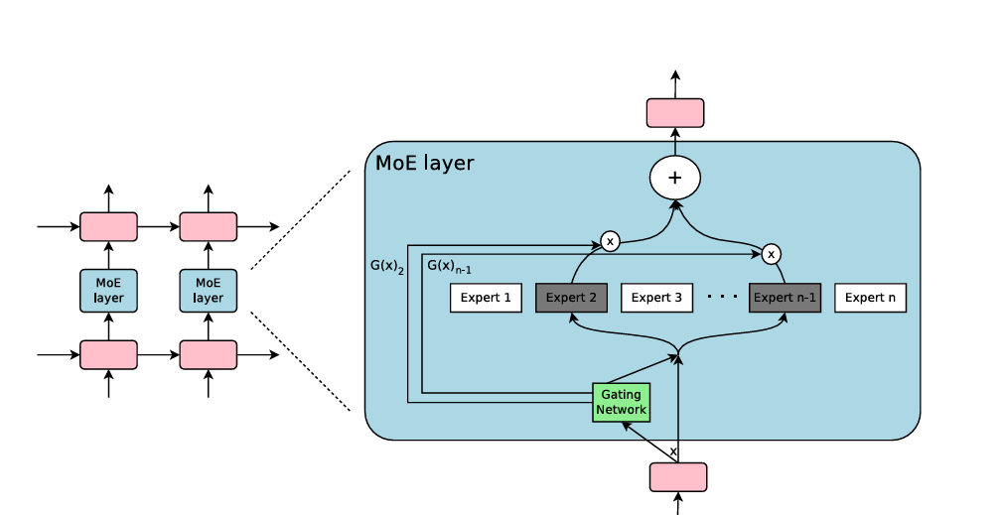

*图 4.1-3 token-choice routing*

在 token-choice routing 中， $W_g$ 是 router 的线性打分矩阵。它把每个 token 的 hidden state 映射成一组 router logits，每个 logit 对应一个 expert；随后当前 token 选择分数最高的 top-k experts。这里的分数表示模型学到的路由偏好，不应理解成人类可读的领域标签。

**简易 MoE 的 top-k token-choice routing 实现步骤**


第一步：定义专家网络
```python
class Expert(nn.Module):
    def __init__(self, dim):
        super().__init__()
        self.ffn = nn.Sequential(
            # 维度升高
            nn.Linear(dim, dim * 4),
            # 非线性激活，提高表达能力
            nn.ReLU(),
            # 还原到初始维度
            nn.Linear(dim * 4, dim)
        )

    def forward(self, x):
        return self.ffn(x)  # 前向传播
```
每个 expert network 由 `线性层 → ReLU → 线性层` 组成，用于在该 expert 独有的特征子空间中处理被路由到的 token，从而提供可区分的变换，使 top-k routing 后的组合输出更有表达力。

第二步：定义 TC MoE 网络
```python
class TC_MoE(nn.Module):
    def __init__(self, dim, num_experts, k):
        super().__init__()
        # 设置专家数量
        self.num_experts = num_experts
        # 设置每个token选用的专家数量
        self.k = k
        # 路由器：将输入映射到专家特征空间
        self.router = nn.Linear(dim, num_experts)
        # 创建专家模块列表（每个专家是独立的）
        self.experts = nn.ModuleList([Expert(dim) for _ in range(num_experts)])
    def forward(self, x, tokens=None, verbose=False):
        # 获取批量大小和特征维度
        B, D = x.shape
        # 计算每个专家对每个token的分数，使用softmax得到概率分布
        gate_scores = F.softmax(self.router(x), dim=-1)  # gate_scores: [B, E]

        # token选取分数最高的k个专家及其分数
        # topk_scores: [B, k]（对应被选中的专家概率值）
        # topk_idx:    [B, k]（对应被选中的专家索引）
        topk_scores, topk_idx = gate_scores.topk(self.k, dim=-1)

        # 初始化输出张量与输入同形状
        out = torch.zeros_like(x)

        # 每个token对应的每一个top-k位置单独处理（同一个token可能被不同专家处理）
        for i in range(self.k):
            # B表示处理的token总数
            # expert_ids表示每个token在第i个top-k选择的专家编号，形状：[B]
            expert_ids = topk_idx[:, i]
            # expert_weight表示第每个token在第i个top-k选择上专家所占的权重，形状：[B]
            expert_weight = topk_scores[:, i]

            # 用于累加当前第i个选择位置上所有专家的输出
            expert_output = torch.zeros_like(x)

            # 遍历所有专家，让对应专家处理被分配给它的token
            # e_id表示对应top-k专家处理的token索引值
            for e_id, expert in enumerate(self.experts):
                # 创建掩码当token在第i个选择位置的专家索引等于当前专家e_id时为1，否则为0
                # mask形状为[B, 1]，用于在计算专家网络前把不属于该专家的token置0
                mask = (expert_ids == e_id).float().unsqueeze(1)

                # mask.sum()表示属于该专家的token数量；若为0表示该专家在本轮没有任务
                if mask.sum() == 0:
                    continue

                # 只把属于该专家的token送入该专家的前馈网络
                # 注意：这里采用x * mask的方式，能保持张量形状一致并保留反向传播路径
                expert_output += expert(x * mask)

            # 将第i个选择位置上专家的输出按对应权重加权并累加到最终out
            # expert_weight.unsqueeze(1)变为[B, 1]以便广播乘到[B, D]
            out += expert_output * expert_weight.unsqueeze(1)

        # out：每个token在top-k专家上的加权聚合的向量表示
        return out
```
**以上展示的是 top-k TC 混合专家的关键板块，运行的代码在[top-k TC](examples/topk_tc_moe.py)。**

TC_MoE(dim=32, num_experts=10, k=2)，输入文本：
>"MoE是很强大的机制！", "专家混合模型非常高效。"

输出：
>按照字节级切分文本，两句分别是 27、33 个字节，padding 对齐到 33 后共 2 × 33 = 66 个 token 位；专家负载统计从 0 到 9 号专家处理 token 总数依次为 [13, 13, 16, 14, 9, 6, 20, 19, 18, 4]，合计 132 = 66 × k（k = 2）。

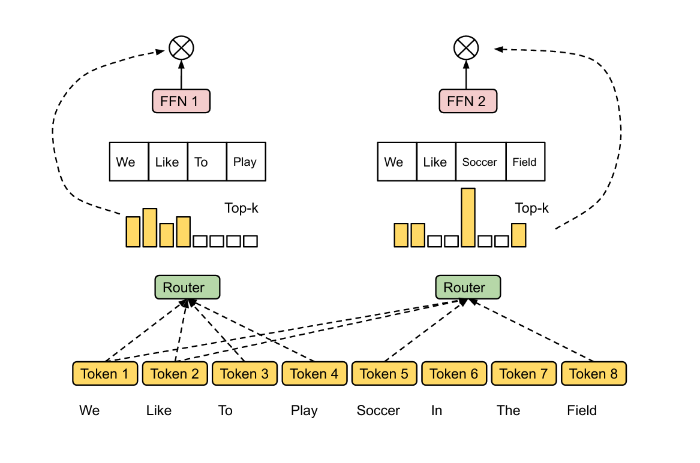

*图 4.1-4 expert-choice routing*

在 expert-choice routing 中，router logits 仍然来自 token 表示与专家打分参数，但选择方向反过来：每个 expert 从当前 batch 的 token 中挑选自己要处理的 top-k token。这样更容易控制专家容量，但可能出现部分 token 没有被选中的情况，需要额外兜底或残差路径。

**简易 MoE 的 top-k expert-choice routing 实现步骤**


第一步：定义专家网络
```python
class Expert(nn.Module):
    def __init__(self, dim):
        super().__init__()
        self.ffn = nn.Sequential(
            nn.Linear(dim, dim*4),
            nn.ReLU(),
            nn.Linear(dim*4, dim)
        )
    def forward(self, x):
        return self.ffn(x)
```

第二步：定义 EC MoE 网络
```python
class EC_MoE(nn.Module):
    def __init__(self, dim, num_experts, k):
        super().__init__()
        # 专家的总数量
        self.num_experts = num_experts
        # 每个专家最多选多少个token
        self.k = k
        # 用于给每个token输出E个专家得分的路由器
        self.router = nn.Linear(dim, num_experts)
        self.experts = nn.ModuleList([Expert(dim) for _ in range(num_experts)])
    def forward(self, x, tokens=None, verbose=False):
        # 获取输入token的数量B_total和维度D
        # B_total表示所有token的总数（批次 × token数）
        B_total, D = x.shape

        # 路由器计算每个token、每个专家的匹配得分输出维度：[B_total, num_experts]
        # softmax确保所有专家得分加起来为1
        gate_scores = F.softmax(self.router(x), dim=-1)

        # EC模式： “专家挑token”
        # 转置后变成[num_experts, B_total]
        # scores_T[e][t] = 第e个专家对第t个token的评分
        scores_T = gate_scores.transpose(0, 1)

        # 每个专家从所有token中挑选top-k个最相关的token
        # topk_idx: 每个专家选中top-k token的索引
        # topk_scores: 对应的路由得分
        # 维度：[num_experts, k]
        topk_scores, topk_idx = scores_T.topk(min(self.k, B_total), dim=-1)

        # dispatch_weights大小：[B_total, num_experts]
        # 初始化dispatch_weights
        dispatch_weights = x.new_zeros((B_total, self.num_experts))

        # 对每个专家e，把top-k token的得分写入对应位置
        for e in range(self.num_experts):
            # topk_idx[e]是一个top-k token索引列表
            # topk_scores[e]是top-k token的得分
            # 填写dispatch_weights：每个专家对各个token评分归一化处理
            for t_idx, s in zip(topk_idx[e].tolist(), topk_scores[e].tolist()):
                dispatch_weights[t_idx, e] = s

        # 初始化输出out，与输入x大小相同
        out = torch.zeros_like(x)

        # 对每个专家进行前向计算
        for e_id, expert in enumerate(self.experts):

            # mask: 这个专家是否选择了该token
            # mask[t] == 1 → token t被这个专家选中
            # 维度：[B_total, 1]
            mask = (dispatch_weights[:, e_id] > 0).float().unsqueeze(1)

            # 如果专家没有选择任何token，则跳过计算
            if mask.sum() == 0:
                continue

            # 确保每个专家只处理其选中的top-k token
            # mask会把不属于该专家的token设置为0，不同专家可能会处理相同的token
            expert_out = expert(x * mask)

            # 将专家输出按其权重加回到最终输出中
            # dispatch_weights[:, e_id]是每一组top-k token对这个专家的权重
            out += expert_out * dispatch_weights[:, e_id].unsqueeze(1)
        return out
```
**以上展示的是 top-k EC 混合专家的关键板块，运行的代码在[top-k EC](examples/topk_ec_moe.py)。**

EC_MoE(dim=32, num_experts=10, k=2)，输入文本：
>"MoE是很强大的机制！", "专家混合模型非常高效。"

输出：
>按照字节级切分并 padding 对齐后共 66 个 token 位（两句分别 27、33 字节），每个专家最多挑 k = 2 个 token，因此 0 到 9 号专家处理的 token 数均为 2，只覆盖 20 个 token 位；其余 token 一次都没有被处理，比如：['混'，'合'， '模'， '型'...]。


因此，在每一次前向传播中，模型只会对 top-k routing 机制挑选出的 expert 子集 $T$ 进行计算，从而实现稀疏化推理。routing 机制的核心作用可以概括为：**为每个输入选择少数 experts，并对这些 active experts 的输出按 routing weights 加权融合**。

routing 机制的选择依据是输入 hidden state。输入 token 在经过 embedding、位置编码及前置处理后生成 hidden state，然后作为 router（通常是线性层或小型 MLP）的输入计算 expert scores。这种行列维度的区别决定了稀疏化的粒度。

   - **TC 模式**：对每一个 token（矩阵的每一行），在 expert 维度（列维度）上选择 top-k experts。
   - **EC 模式**：对每一个 expert（矩阵的每一列），在 token 维度（行维度）上选择 top-k token。

**TC vs EC** ：

通过运行两段代码 [top-k EC](examples/topk_ec_moe.py) 和 [top-k TC](examples/topk_tc_moe.py)，可以直观比较两种 routing 策略的差异。
1. TC 模式下，每个 token 主动选择 top-k experts。优势是 token 通常都能获得 expert 处理，语义覆盖更直接；风险是 expert 负载不均衡，少数热门 experts 处理大量 token，冷门 experts 训练不足。
2. EC 模式下，每个 expert 主动从 token 集合中选择 top-k token。优势是 expert 容量天然受控，负载更均衡；风险是部分 token 可能没有被任何 expert 处理，需要 fallback、shared experts 或容量策略兜底。

**结论**：TC 和 EC 代表了稀疏 expert 系统中的典型权衡：前者更重视 token 侧覆盖，后者更重视 expert 侧负载。现代 MoE 往往会再叠加 auxiliary loss、per-expert bias、capacity control、shared experts 或 per-device balancing 来缓解这个权衡。

负载均衡同时影响优化路径、系统吞吐和训练稳定性：

- **auxiliary loss**：Switch Transformer、GShard 和早期 DeepSeek MoE 常用的思路是在主损失外加负载均衡项，让专家接收 token 数量和 router 概率更均匀。缺点是它会改变优化目标，权重过大时可能牺牲模型质量。
- **aux-free / per-expert bias**：DeepSeek-V3 一类做法给每个专家维护动态 bias，根据近期负载在线调整路由分数，使冷门专家更容易被选中、热门专家被轻微降权。它减少了显式辅助损失，但通常仍会保留序列级或设备级的约束，因此仍包含平衡机制。
- **router stochasticity**：早期 MoE 会给 gating logits 加高斯噪声或 jitter，让路由器不要过早把 token 固定到少数专家。随机扰动能提升探索，但也会让复现实验和线上推理更复杂。
- **router FP32 与 z-loss**：router logits、softmax、top-k 前后的归一化对数值非常敏感，许多系统会只让 router 保持 FP32，必要时对 router 加 z-loss，避免路由概率过尖或溢出。
- **token dropping**：当专家容量满了，超出的 token 可能被丢弃、走 fallback，或只走共享专家。token dropping 是 MoE 额外随机性的来源之一，因为同一个请求是否被丢 token 可能受同 batch 其他请求影响。

> [!WARNING]
> token dropping 把路由不均衡从“训练效率问题”推进到了“线上行为问题”：同一个请求在不同 batch 里可能因为其他请求占用热门专家而得到不同路径。MegaBlocks、grouped GEMM 和 dropless MoE 的共同目标之一，就是在保留热门 token expert 路径的前提下，让不规则 expert batch 仍能高效计算。

在一些 MoE 研究中，复杂可学习 router（如 top-k routing）并非绝对必要，还存在 hash routing 等非学习式方法：

- **Hash 原理**：通过固定哈希函数将输入 token 映射到 expert，天然具备较好的负载均衡和低开销实现。

- **Hash 的局限**：尽管 hash routing 在语义灵活性和精细化 expert 分工上通常不如可学习 routing，但在若干基准测试和工程场景中，仍能展现出相当的竞争力。


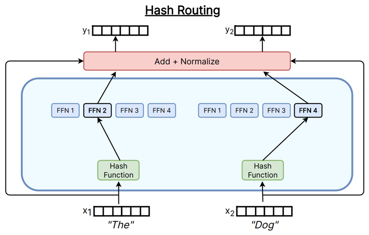

*图 4.1-5 hash routing*


Roller et al. 2021 的 [Hash Layers For Large Sparse Models, arXiv:2106.04426](https://arxiv.org/abs/2106.04426) 走的是**预计算查表**路径：在训练前就把每个 token 映射到固定 expert（random hash 或 balanced assignment），不引入随机投影，也不通过梯度优化哈希参数；其论文 §3.1 明确写明”we generally employ pre-computed hash functions, which use a lookup table during learning – precomputed in advance – to map tokens to expert modules”。这与下文示例代码采用的几何 LSH 是不同的非学习式 routing 范式，应分开理解。

下面给出一个**来自经典 LSH 家族、与 Roller 2021 实现路径不同的**简化示例来说明几何哈希在 routing 上的可能形态，目的是让”非学习 routing”具体可读。

经典 LSH routing 把每个哈希函数定义为：把输入 token embedding $x \in \mathbb{R}^d$ 投影到由随机向量 $a_i \in \mathbb{R}^d$ 和随机偏置 $b_i$ 定义的平面上，再通过桶宽度 $\epsilon$ 进行量化，从而将 $x$ 映射到一个索引值为 $i$ 的 $h_i(x)$ 整数哈希桶。桶宽度间接控制每个桶的 token 容量。

$$
h_i(x) = \left\lfloor \frac{a_i^\top x + b_i}{\epsilon} \right\rfloor
$$

单个 $h_i$ 只产生一维量化值，实际使用时把若干个 $h_i$ 拼成复合哈希，投影方向的数量对应下方示例代码里的 `n_hashes` ；token embedding 的维度是公式里的 $d$ ，对应代码里的 `d_model` 。这种方法不通过梯度优化哈希参数，但 routing 结果会因随训练演化的 $x$ （token embedding）而动态改变。LSH **概率性地**实现了负载均衡，并且由于其局部敏感性，能够保留弱局部性，即相似 token 更可能落入同一哈希桶。因此，LSH 可以看成一种”弱语义”的非学习 routing。

**桶宽度** $\epsilon$ 与上式中的量化步长对应，用于把连续投影值分桶；桶越宽，同一桶内聚集的向量越多。

> [!WARNING]
> 上文带 $\epsilon$ 的公式刻画的是经典 LSH 家族里的**随机投影 + 标量量化**；下文示例代码采用**随机超平面符号哈希**。二者同属 LSH 家族但实现细节不同，公式参数与代码变量只对应同一设计家族，不对应逐行实现。Roller 2021 Hash Layers 的实际设计是**预计算查表**（random hash / balanced assignment），与本节几何 LSH 公式及示例代码在哈希函数实现层面不同。

**基于 LSH routing 的简易 MoE 实现**：
```python
import torch
import torch.nn as nn
# 简单字符级 tokenizer
class CharTokenizer:
    def __init__(self):
        self.vocab = {}
        self.inv_vocab = {}
    def build_vocab(self, texts):
        chars = set("".join(texts))
        self.vocab = {c:i for i,c in enumerate(sorted(chars))}
        self.inv_vocab = {i:c for c,i in self.vocab.items()}
    def encode(self, text):
        return [self.vocab[c] for c in text]
    def decode(self, ids):
        return "".join([self.inv_vocab[i] for i in ids])

# Expert FFN
class Expert(nn.Module):
    def __init__(self, dim):
        super().__init__()
        self.ffn = nn.Sequential(
            nn.Linear(dim, dim*4),
            nn.ReLU(),
            nn.Linear(dim*4, dim)
        )
    def forward(self, x):
        return self.ffn(x)

# LSH Router
class LSHRouter(nn.Module):
    def __init__(self, d_model, num_experts, n_hashes=8):
        super().__init__()
        self.num_experts = num_experts
        self.n_hashes = n_hashes
        self.register_buffer(
            "random_vectors",
            torch.randn(n_hashes, d_model)
        )
    def forward(self, x):
        projections = x @ self.random_vectors.T
        signs = (projections > 0).long()
        hashes = signs @ (1 << torch.arange(self.n_hashes, device=x.device))
        expert_ids = hashes % self.num_experts
        return hashes, expert_ids

# LSH-MoE
class LSH_MoE_Text(nn.Module):
    def __init__(self, dim, num_experts, n_hashes=8, vocab_size=None):
        super().__init__()
        self.embedding = nn.Embedding(vocab_size, dim)  # embedding 层
        self.dim = dim
        self.num_experts = num_experts
        self.router = LSHRouter(dim, num_experts, n_hashes)
        self.experts = nn.ModuleList([Expert(dim) for _ in range(num_experts)])

    def forward(self, token_lists, verbose=True):
        """
        token_lists: list of LongTensor，每条tensor是一条文本token ID
        """
        lengths = [t.size(0) for t in token_lists]
        total_tokens = sum(lengths)
        x_flat = torch.cat(token_lists, dim=0)  # [total_tokens]
        x_flat = self.embedding(x_flat)         # [total_tokens, D]

        hashes, expert_ids = self.router(x_flat)
        out_flat = torch.zeros_like(x_flat)

        expert_load = torch.zeros(self.num_experts, dtype=torch.long, device=x_flat.device)
        for e_id, expert in enumerate(self.experts):
            mask = (expert_ids == e_id).float().unsqueeze(1)
            n_tokens = int(mask.sum().item())
            expert_load[e_id] = n_tokens
            if n_tokens > 0:
                out_flat += expert(x_flat * mask) * mask

        # 拆回原句子
        outputs = []
        start = 0
        for l in lengths:
            outputs.append(out_flat[start:start+l])
            start += l
        if verbose:
            print("\n========== LSH-MoE Token 哈希映射 ==========")
            start = 0
            for idx, l in enumerate(lengths):
                for j in range(l):
                    token_idx = start + j
                    print(f"Sentence {idx}, Char {j}: Hash={hashes[token_idx].item()} -> Expert {expert_ids[token_idx].item()}")
                start += l
            print("\n========== LSH-MoE 专家负载统计 ==========")
            for e in range(self.num_experts):
                print(f"Expert {e}: {expert_load[e].item()} tokens")
            print("------------------------------------------------\n")

        return outputs

# 测试
if __name__ == "__main__":
    sentences = ["你好世界", "今天天气很好"]
    tokenizer = CharTokenizer()
    tokenizer.build_vocab(sentences)
    token_lists = [torch.tensor(tokenizer.encode(s), dtype=torch.long) for s in sentences]
    dim, num_experts = 16, 5    # 每个 token 的 embedding 维度，专家数量
    moe_text = LSH_MoE_Text(dim=dim, num_experts=num_experts, vocab_size=len(tokenizer.vocab))
    outputs = moe_text(token_lists)
    for i, out in enumerate(outputs):
        print(f"Sentence {i} 输出shape: {out.shape}")

```
输入
>dim, num_experts = 16, 5

输出
>每个句子的 token 哈希映射以及 `LSH_MoE` expert 负载统计。

*输出结果会随着 embedding 层动态变化。*

**MoE routing 机制对比**

| 路由方式 | 核心思路 | 是否可学习 | 优点 | 缺点 | 典型用途 |
|---------|----------|------------|-------|--------|-----------|
| **top-k routing**（TC、EC） | gating network 为 token-expert 对计算得分，选择 top-k experts 参与计算 | 是 | 语义灵活、可适应数据分布；可结合 load balancing loss、noisy gating 等技巧 | 需要训练；大规模时有负载倾斜风险；通信开销较高 | DeepSeek-MoE、GPT-MoE、Qwen、Switch Transformer 等 |
| **哈希路由** | 通过固定哈希函数将输入映射到专家，例如 LSH 或随机哈希 | 否 | 天然负载均衡；无需训练 router；实现便宜；通信成本低 | 语义表达能力弱；无法根据任务动态分配专家 | 大规模推理、轻量级 MoE、部分稀疏训练实验 |

尽管 MoE 结构早在较早时期就已提出，但其在大规模语言模型中的广泛应用主要发生在 2021 年之后（如 Switch Transformer、GLaM 等工作）。近年来，DeepSeek-R1 等模型展示了 MoE 在高性能推理任务中的潜力，但其核心挑战仍主要体现在训练稳定性与优化效率方面：

- **在模型浅层阶段**，token 表示处于快速演化过程中，输入分布呈现出显著的非平稳性（即语义结构尚未稳定形成）。这使得基于表示学习的 router 面临高噪声输入，从而导致 expert 分配决策具有较高方差，并增加训练收敛难度。
- **MoE 中常见的负载不均衡问题**，会导致不同 experts 接收到的训练样本数量显著不均，进而使部分 experts 得到充分训练，而另一部分 experts 由于缺乏激活而处于欠训练状态，甚至出现 expert starvation。

需要注意的是，**稀疏的可学习 routing 机制（如 top-k）引入了离散决策过程，使得梯度估计具有较高方差**。同时，expert network 只有在被 routing 选中时才接收梯度并更新，而 **router 会持续从所有样本中接收训练信号并更新**。这种 conditional compute 下的梯度不对称性会导致不同模块在优化过程中依赖于不同的数据分布，从而使优化步调难以协调，增加训练不稳定性。

> [!NOTE]
> 可学习路由的 MoE 在不同迭代步中会激活不同专家子图。路由变化会改变梯度路径和被更新的专家集合，因此整体优化会呈现非平稳性与路径依赖。

---

### 4.1.2 MoE 变体

MoE 的变体大多围绕两类问题展开：一类是**路由与专家分化**，也就是 token 是否能稳定进入合适的专家；另一类是**系统效率**，也就是稀疏激活是否真的转化为端到端吞吐。专家数量、共享专家、细粒度专家、top-k、capacity、aux loss、设备级均衡和 grouped GEMM 都是在这两个目标之间折中。

专家分化并不保证自然出现。若 router 训练过慢，专家可能长期接收混合分布；若 aux loss 过强，router 可能为均衡牺牲语义选择；若热门专家持续过载，系统会出现 token dropping 或 all-to-all 尾延迟。因此，现代 MoE 设计通常同时处理结构、损失、初始化和通信。通信成本与拓扑选择的具体账本见 [第 7 章 §7.9.2 EP / ETP / EDP](../chapter7/chapter7_分布式训练.md)。

1. DeepSpeed-MoE 的贡献可以按结构、训练系统和推理加速三层理解：

- **参数效率提升：** DeepSpeed-MoE 在模型结构上提出 PR-MoE 以及蒸馏压缩版本 MoS。PR-MoE 用固定 MLP 与专家残差纠错减少参数与通信，再用反向金字塔（倒锥）式专家数量把专家集中在深层，从而提高参数效率；MoS 则通过分阶段蒸馏压缩模型。
- **蒸馏压缩加速推理：** MoS 通过分阶段知识蒸馏将 PR-MoE 压缩，用较浅的稀疏学生模型替代原模型以提升推理速度。由于直接减少层数会导致模型能力下降，而全程使用教师信号也可能导致学生欠拟合，MoS 采用两阶段方式：训练前期使用蒸馏稳定学习教师分布，后期关闭蒸馏、只优化语言模型损失，让学生模型具备自主泛化能力。
- **系统优化升级：** 系统层重写 MoE 并行与通信方式，使 MoE 在真实大规模训练和推理中更容易扩展：
    - 由于不同层的专家数量不一致，它采用 expert parallelism、expert slicing、data parallelism 和 tensor slicing 的组合，让每层获得合适的并行方式。

> [!NOTE]
> MoE 在系统侧的 all-to-all 通信、expert parallelism（EP）、expert tensor parallelism（ETP）、expert data parallelism（EDP）的拓扑选择与 overlap 调度是 [第 7 章 分布式训练](../chapter7/chapter7_分布式训练.md) §7.9.2 的主线内容；DeepSeek-V3 的 64-way EP（跨 8 节点）+ DualPipe 双向流水线 overlap 等真实训练配置见 §7.11。MoE 算法侧与系统侧的耦合主要在 EP 拓扑选择，本节不重复展开。
    - 这种自适应并行可以减少负载不均与显存浪费，但具体收益依赖硬件拓扑和通信库实现。
    - 在通信方面，DeepSpeed-MoE 通过 tensor slicing、分层 all-to-all 和显式 layout 转换降低跨节点延迟与稀疏重排开销。

> [!NOTE]
> 分层 all-to-all 指在 MoE 中把一次性全局 token 通信按硬件拓扑拆成多层通信：先在同节点内完成高速 all-to-all，再跨节点交换必要数据，从而减少跨机器通信量。

2. Switch Transformer 致力于在不显著增加每个样本 FLOPs 的前提下扩展模型参数量。其核心策略是把标准 Transformer 中的 dense FFN 替换为稀疏激活的专家集合，使不同输入动态激活不同专家。为了让这套系统可训练，它同时引入 auxiliary loss 处理负载均衡，并在 router 等敏感部分使用更保守的精度。

- **router 计算**：router 对 token 表示 $x$ 计算 logits，通常对 logits 做 softmax 得到每个 expert 的概率分布 $p_i(x)$ 。
- **实际路由决策**：Switch Transformer 采用 top-1 routing，每个 token 被分配到得分最高的单个 expert 执行 FFN。softmax 概率主要服务于统计、权重和 auxiliary loss，实际前向只使用被选中的 expert。
- **超容量处理**：若某 expert 被指派的 token 超过容量，超额 token 不会执行该 expert FFN，而是通过残差或备用路径继续传递；因此超额 token 不会为该 expert 产生梯度。
- **较小初始化**：适当减小某些线性层、FFN 或 router 的初始化尺度，可以降低训练初期梯度方差，减少早期不稳定现象。
- **router z-loss**（由 ST-MoE 引入，见 [arXiv:2202.08906](https://arxiv.org/abs/2202.08906) §3.3）：为避免 router logits 在低精度下产生极端值，引入对 logits 幅度的惩罚项

$$
L_z(x) = \frac{1}{B} \sum_{i=1}^{B} \biggl( \log \sum_{j=1}^{N} e^{x_j^{(i)}} \biggr)^{2}
$$

其中 $B$ 是 batch 内 token 数，$N$ 是 expert 数，$i$ 遍历 token，$j$ 遍历 expert。该项减小 softmax 对极端输入的敏感性，从而提高训练稳定性。Switch Transformer 论文本身未引入 z-loss。

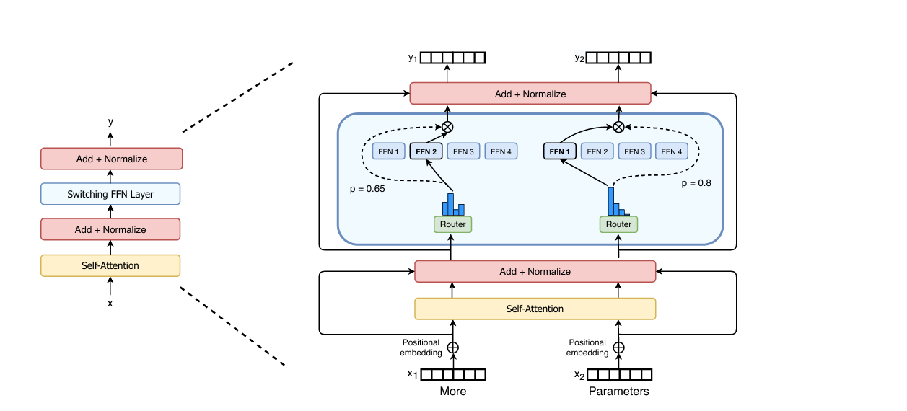

*图 4.1-6 Switch Transformer 中的稀疏 FFN*

图 4.1-6 的关键位置是 Transformer block 里的 FFN 子层：attention 先把每个 token 变成上下文化表示，router 再为这个 token 选择一个或少数 FFN experts。左侧保持标准 block 的残差结构，右侧只替换 FFN 内部的计算路径，因此 MoE 可以在尽量少改 attention 的前提下扩大参数容量。


> [!NOTE]
> Switch Transformer 的基本替换位置是 Transformer block 中的 FFN：通常先经过 self-attention 获得上下文化表示，再由稀疏 MoE FFN 对每个 token 独立变换。这个顺序沿用 Transformer block 的常见组织方式，具体层序仍需要结合模型结构做消融。

从机制上看，self-attention 负责让 token 读取上下文，FFN/MoE 负责对每个 token 的上下文化表示做逐 token 非线性变换。MoE 常替换 FFN，是因为 FFN 本来就是逐 token 的高 FLOPs 模块，最适合条件计算和 expert parallelism。

把 MoE 放在 attention 前、后或层间如何组织，仍属于架构设计问题，需要结合稳定性和系统效率做消融。


> [!NOTE]
> Switch Transformer 更强调稳定性与简化 FLOPs，DeepSpeed-MoE 更强调专家分布、模型蒸馏和系统通信。两者共同指向现代 MoE 的两条设计线：用精度与通信分级降低训练成本，用动态约束与结构调节提升训练稳定性和专家专业性。


---

### 4.1.3 混合专家与稠密模型

MoE 相较于传统 dense 模型的优势是：它可以扩大总参数规模，同时让每个 token 只使用少量 active parameters，从而控制每 token FLOPs。由于专家通常是 FFN 模块，可以作为独立单元分布在不同设备上，router 根据 token 表示决定 dispatch 到哪些专家。这种结构让 expert parallelism 成为自然的并行维度，但也把 all-to-all、负载均衡和 expert matmul 利用率变成关键瓶颈。

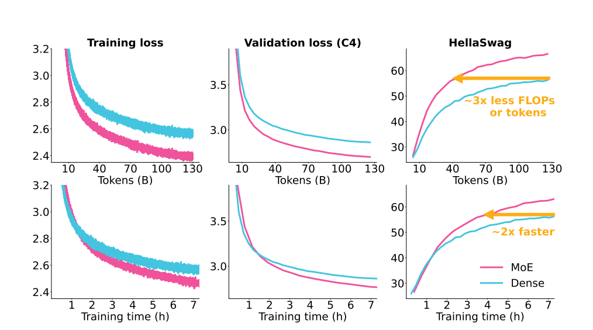

*图 4.1-7 MoE 与 dense 模型训练曲线对比*

图 4.1-7 比较的是相近训练预算下 MoE 与 dense 模型的 loss 和下游指标曲线。粉色 MoE 曲线在训练 tokens 和训练时间维度上都更快到达同等水平，说明稀疏 FFN 在该设置下提高了 sample efficiency 和 active compute efficiency。这个结论依赖模型规模、数据、router 训练和系统实现；MoE 的端到端收益需要同时把通信与负载均衡算进去。

在 MoE 研究中，常见两条实践路径：

- **稠密到稀疏升级**：把已训练好的 dense 模型 upcycling 为 MoE，以复用先前的训练成果与权重。
- **从零训练 MoE**：从随机或专门初始化开始训练 MoE，使 experts 与 router 从头共同演化。

实证结果显示，这两条路径在不同设置下表现差异显著。比如：

- OLMoE 的实验发现，采用 token-choice routing 从零训练的 MoE 在约 500–600B tokens 时就能追上并在随后超越 upcycled 模型，相当于原始 dense 模型训练数据量约 25% 的计算预算即可达到追赶点。
- Komatsuzaki 等人在其 upcycling 工作中，视觉模型与语言模型的 encoder 侧使用 expert-choice routing（容量因子 C = 2），语言模型的 decoder 侧为兼顾训练时 teacher forcing 与推理时自回归解码的一致性改用 top-K = 2 routing；其论文 Figure 4 报告的结论是，语言侧从零训练的 MoE 需要大约原 dense checkpoint 计算预算的 120% 才能追上 upcycled 模型。二者差异来自实验范式、路由策略、模型结构和训练预算不同。

OLMoE 的实验还提示，已有 dense 权重可能约束专家重新分化，因此他们更强调从零训练 MoE 的价值。

> [!WARNING]
> OLMoE 的实验说明，upcycling 不只是把稠密 FFN 复制成多个专家。已有稠密权重可能干扰专家重新分化，随机初始化的 router 也可能“学得太晚”，在学习率衰减后才形成模糊专家分工。

此外，工程实践中也出现了成功的 **upcycling** 案例，例如 Qwen1.5-MoE 通过将已有稠密模型改造为 MoE，在保持或提升性能的同时提高参数效率。upcycling 的关键决策包括专家初始化、共享专家比例、router 初始化和后续训练 token 预算；如果继续训练数据不足，稀疏专家容易在小规模 fine-tuning 中过拟合。

> [!NOTE]
> 25% vs 120% 这类差异通常来自实验范式差异：TC 与 EC 在负载均衡、专家分化速度和早期训练动态上不同；decoder 与 encoder 架构的训练目标和信息流也不同，因此 upcycling 收益不能跨设置直接比较。


## 4.2 MoE 的应用
MoE 是一种可广泛嵌入各种神经网络结构的条件计算框架。它的核心思想是让不同 experts 处理不同类型的数据或子任务，因此在 Transformer 之外也被大量应用：
- 在**CNN**中作为动态卷积提升视觉建模的多样性；
- 在**语音识别**中让不同专家专注于不同音素或噪声条件；
- 在**推荐系统**解决多任务排序问题；
- 在**强化学习** 中分解为多策略、多技能专家；
- 在**多模态模型**中实现跨模态专家协作。

正因 MoE 的结构独立性与条件计算能力，它成为大模型扩展参数规模、提升表示能力和控制计算成本的重要基础模块。下面介绍 MoE 在 LLM 中的应用。

---

### 4.2.1 MoE 与 LLM
在 LLM 中，MoE 通常通过引入 router，并将 Transformer 中的单个 FFN 替换或扩展为由多个独立 experts 组成的稀疏子网络。每个 token 在前向与反向传播中仅激活少量 experts，使模型能够在不显著增加每次计算量的前提下提升参数容量与表示能力。

### 4.2.2 简易 LLM + MoE 实现

**第一步：构建字节级分词器**
```python
class ByteTokenizer:
    def __init__(self):
        self.vocab_size = 259
        self.bos = 256 # 序列开始，告诉LLM一个独立的文本片段或输入样本从这里开始。
        self.eos = 257 # 序列结束，告诉LLM一个文本片段到这里结束。
        self.pad = 258 # 填充，在模型训练或推理时，通常需要将多条长短不一的文本组成一个批次。
        # <pad>会被添加到较短序列的末尾使批次中所有序列长度一致，便于高效的矩阵运算。
```
这个词汇表的总大小是256+3，由两部分组成：
 1. 基础字节编码：数量256个，它们代表了计算机中所有可能的单字节值从0到255。这种方法能够确保任何文本，不论其语言或编码，都能被无损地编码成一串数字Token ID。
 2. 特殊功能编码：数量3个，这些Token专门用于提供文本结构信息，确保模型能够正确处理和理解文本段落的边界和批处理时的对齐，便于计算。

```python
def encode(self, text, add_bos=True, add_eos=True):
    # 把输入文本信息进行utf-8字符集编码，得到字节序列b
    # 每个字节值0-255对应一个Token ID
    b = text.encode('utf-8', errors='surrogatepass')
    ids = list(b)   # 将UTF-8字节序列转换为Token ID列表
    if add_bos:
        # 标记文本开头，添加<bos> Token ID
        ids = [self.bos] + ids
    if add_eos:
        # 标记文本结束，添加<eos> Token ID
        ids = ids + [self.eos]
    return ids # 返回最终处理完成的Token ID序列
def batch_encode(self, texts, pad_to=None):
    # pad_to 用于规定批处理中每条 Token ID 序列的目标长度（强制对齐）
    encs = [self.encode(t) for t in texts]
    # 如果未指定pad_to，则使用当前批次中最长序列的长度；否则使用 pad_to 规定的长度
    maxlen = max(len(x) for x in encs) if pad_to is None else pad_to
    pad = self.pad

    # 将所有序列填充到maxlen长度，填充方式是在每条序列末尾添加[pad]，强制对齐形成规则的张量
    arr = [x + [pad] * (maxlen - len(x)) for x in encs]

    # 记录原始序列的真实长度，这条信息将用于Attention，避免模型关注到[pad] Token
    lengths = torch.LongTensor([len(x) for x in encs])

    # 经过填充对齐Token ID张量输入给模型，原始序列的真实长度张量用于Attention
    return torch.LongTensor(arr), lengths
```
> [!NOTE]
> 字符是语言层面的抽象单位，例如字母 `A`、汉字 `中`、符号 `+`；字节是计算机存储和传输数据的最小可寻址单位。一个字符可以由一个或多个字节表示，这正是字符编码需要处理的问题。

batch_encode阶段返回对齐处理张量、未对齐处理的序列长度的考虑：
- 不规则的张量不能直接输入到为高性能并行计算优化的硬件GPU、TPU中，对齐是进行批处理和利用硬件并行性的必要预处理步骤。这种填充虽然解决了并行计算的问题，但也引入了计算冗余比如这里的[pad]。
- 原始序列长度信息，则是为了告诉模型末尾填充[pad]从哪里开始的，从而在Attention机制中屏蔽掉它们，防止其将计算资源和注意力分散到这些无关紧要的数据上，确保模型只关注真实的输入信息。

**第二步：构建自注意力层**
```python
class SimpleSelfAttention(nn.Module):
    def __init__(self, d_model, nhead):
        super().__init__()
        # 检查模型的隐藏层维度d_model能否被头数量nhead整除
        assert d_model % nhead == 0
        self.nhead = nhead           # 多头注意力机制的头数量
        self.d_k = d_model // nhead  # 每一个头分配到的维度
        # 投影层将输入x投影到Q、K、V三个张量，总输出维度为3 * d_model。
        self.qkv = nn.Linear(d_model, d_model * 3)
        self.out = nn.Linear(d_model, d_model)
    def forward(self, x, mask=None):
        B, T, D = x.shape # 输入张量的信息
        # 线性投影 Q, K, V
        qkv = self.qkv(x)  # 对输入[B, T, D]进行投影，得到形状为[B, T, 3*D]的融合张量
        q, k, v = qkv.chunk(3, dim=-1) # 沿最后一个维度均切分成Q, K, V，形状均为[B, T, D]

        # 多头拆分借助view()，Q, K, V改变[B, T, D]->[B, T, nhead, d_k]
        # transpose转置，Q, K, V改变[B, T, nhead, d_k]->[B, nhead, T, d_k]
        q = q.view(B, T, self.nhead, self.d_k).transpose(1, 2) # 先拆分再转置
        k = k.view(B, T, self.nhead, self.d_k).transpose(1, 2)
        v = v.view(B, T, self.nhead, self.d_k).transpose(1, 2)

        # 计算Q和K的内积相似度，形状为[B, nhead, T, T]
        # 除以 √d_k 尺度缩放防止内积结果过大，导致归一化处理以后梯度消失
        scores = torch.matmul(q, k.transpose(-2, -1)) / math.sqrt(self.d_k)

        # Attention Mask掩码操作
        if mask is not None:
            # mask通常为[B, T]，生成掩码~mask.bool()需要掩码的地方为1，乘以-1e9将mask处的得分设为一个极小的负数。
            attn_mask = (~(mask.bool().unsqueeze(1).unsqueeze(2))) * -1e9
            scores = scores + attn_mask  # 对得分进行掩码操作

        # softmax 归一化：将得分转换为注意力权重，极小负数的位置权重趋近于0（完成屏蔽）。
        attn = F.softmax(scores, dim=-1)
        # 注意力加权，权重attn乘以Value，得到加权求和的输出[B, nhead, T, d_k]。
        out = torch.matmul(attn, v)

        # 先转置恢复 [B, T, nhead, d_k]，
        # 然后用contiguous().view() 将所有头的输出拼接回原始的D维度[B, T, D]。
        out = out.transpose(1, 2).contiguous().view(B, T, D)
        return self.out(out)
```

**第三步：构建 MoE layer**
其中简化 MoE layer 的几个参数含义如下：

- `d_model`：输入输出维度，即 Transformer layer 的 hidden size。
- `d_ff`：expert 内部 hidden size，即每个 expert FFN 的扩展维度。
- `n_experts`：expert 数量，也就是 MoE layer 中并行存在的 FFN 模块数量。
- `k`：top-k active experts 数量，表示每个 token 会被 router 送到多少个 experts。
- `capacity_factor`：expert capacity 系数，用于计算每个 expert 最多能接收的 token 数量，以缓解负载不均衡问题。
- `B`、`T`、`D`、`N`：分别表示 batch size、序列长度或 padding 后长度、hidden size，以及同一 batch 中的 token 总数；其中 $N = B \times T$ 。

```python
class MoELayer(nn.Module):
    def __init__(self, d_model, d_ff, n_experts=4, k=1, capacity_factor=1.25, noisy_gating=True):
        super().__init__()
        assert k in (1,2) # 确保K激活专家数是1或2
        self.d_model = d_model
        self.d_ff = d_ff
        self.n_experts = n_experts
        self.k = k
        self.capacity_factor = capacity_factor
        self.noisy_gating = noisy_gating

        # 门控网络 / gating network：负责计算每个 token 与 n_experts 个专家的匹配得分（logits）。
        self.w_gating = nn.Linear(d_model, n_experts, bias=False)
        if noisy_gating:
            # 噪声网络：引入噪声有助于在训练时平均分配token到不同的专家，缓解负载不均衡问题。
            self.w_noise = nn.Linear(d_model, n_experts, bias=False)

        # 专家网络，每个专家是一个独立的FFN
        self.experts = nn.ModuleList([
            nn.Sequential(
                nn.Linear(d_model, d_ff),
                nn.GELU(), # 使用GELU激活函数
                nn.Linear(d_ff, d_model)
            ) for _ in range(n_experts)
        ])

    def _noisy_logits(self, x):
        """
            x : 展平后的输入token向量，形状为[N, D] (N=B*T)。
            Tensor: 带噪声的专家logits，形状为[N, E]。
        """
        logits = self.w_gating(x)

        # 在训练模式且开启noisy_gating时引入随机噪声
        if self.noisy_gating and self.training:
            # 使用sigmoid将w_noise的输出映射到[0, 1]，作为噪声的标准差
            noise_std = torch.sigmoid(self.w_noise(x))

            # 加上正态分布噪声这增强了随机性，有助于训练时的负载均衡
            logits = logits + torch.randn_like(logits) * noise_std
        return logits

    def forward(self, x, mask=None):
        B, T, D = x.shape
        N = B * T
        x_flat = x.view(N, D)  # [B, T, D] -> [N, D]

        logits = self._noisy_logits(x_flat)
        scores = F.softmax(logits, dim=-1) # 归一化的专家选择权重，[N, E]

        if self.k == 1:
            top1 = torch.argmax(scores, dim=-1)  # 每个token选出的top-1专家索引，[N]
            # Dispatch Mask：[N, E]，标记每个token选中的top-1专家，用1表示选中
            dispatch_mask = F.one_hot(top1, num_classes=self.n_experts).to(x.dtype)
            # 提取每个token选中的top-1专家的得分作为最终组合权重，得到[N]
            combine_weights = torch.gather(scores, 1, top1.unsqueeze(1)).squeeze(1)
            # 计算规定每个专家最多处理的token数量
            capacity = int((N/self.n_experts)*self.capacity_factor)+1

            expert_inputs = []
            expert_indices = []
            for e in range(self.n_experts):
                # 找到专家e应该处理的token原始索引值，[N]
                idx = torch.nonzero(dispatch_mask[:, e], as_tuple=False).squeeze(-1)
                if idx.numel() > capacity:
                    # 专家e容量检查，如果超过容量，丢弃多余的token
                    idx = idx[:capacity]
                # 保存专家e需要处理的token
                expert_inputs.append(x_flat[idx])
                # 记录专家e需要处理token的原始索引值
                expert_indices.append(idx)
            # 初始化输出
            out_flat = torch.zeros_like(x_flat)

            # 遍历每个专家
            for e in range(self.n_experts):
                if expert_inputs[e].size(0)==0:
                    continue   # 专家e没有处理的token
                # 第e个专家处理token
                y = self.experts[e](expert_inputs[e])
                out_flat[expert_indices[e]] = y  # 将专家e的输出放回其在原始序列中的位置
            out_flat = out_flat * combine_weights.unsqueeze(1)  # 所有专家处理的结果乘以组合权重
            return out_flat.view(B, T, D)
        else:
            # top-2 简化实现
            # 每个token选出top-2专家的得分和索引，[N, 2]
            topk_vals, topk_idx = torch.topk(scores, k=2, dim=-1)
            # 计算出每个专家最大处理token数量
            capacity = int((N/self.n_experts)*self.capacity_factor)+1
            expert_buckets = [[] for _ in range(self.n_experts)] # 初始化存储空间
            for i in range(N):
                for j in range(2):
                    e = int(topk_idx[i,j].item())      # top-k专家索引值
                    w = float(topk_vals[i,j].item())   # 相应的token组合权重
                    expert_buckets[e].append((i,w)) # 存储：token原始索引、权重

            out_flat = torch.zeros_like(x_flat) # 初始化输出结果
            for e in range(self.n_experts):
                bucket = expert_buckets[e]
                if len(bucket)==0:
                    continue
                if len(bucket) > capacity:
                    bucket = bucket[:capacity]  # 每个专家丢弃超过容量的token

                # token的原始索引值转化为张量：[C] ->（C=容量限制后的数量）
                idxs = torch.tensor([i for i,_ in bucket], device=x.device, dtype=torch.long)
                # 对应的组合权重转化为张量：[C]
                weights = torch.tensor([w for _,w in bucket], device=x.device, dtype=x.dtype)
                inp = x_flat[idxs]  # 获取专家e需要处理的token，[C, D]
                y = self.experts[e](inp)
                # 专家的输出乘以权重后，累加到输出张量上（top-2叠加），可能有不止一个专家处理同一个token
                out_flat[idxs] += y * weights.unsqueeze(1)
            return out_flat.view(B,T,D)
```

在以上 MoE 架构中，可以用以下两种策略缓解负载不均衡：
1. 噪声门控

   - 原理：在 router logits 中引入由数据依赖的标准差 $\sigma = \text{Sigmoid}(W_{\text{noise}}x)$ 调节的正态分布随机噪声。
   - 作用：在训练过程中，这种噪声会轻微扰动 top-k 的选择结果，鼓励 router 为输入 token 选择不同的 expert 组合，从而提升 expert 多样性并减轻 routing 过早固化，帮助分散负载。

2. 容量限制

   - 原理：为每个 expert 设置一个最大容量 $C_{\mathrm{expert}} = \lceil (N / E) \times c_{\mathrm{cap}} \rceil$ ，其中 `capacity_factor` 即为 $c_{\mathrm{cap}}$ 。如果 routed 到某个 expert 的 token 数量超过 $C_{\mathrm{expert}}$ ，则*丢弃*超出的 token。
   - 作用：强制所有 experts 只能处理有限数量的 token，从而避免少数 experts 被过度占用，并让整个 MoE layer 的计算时间更可预测。但是被丢弃的 token 缺失了 expert FFN 路径；如果它未经过任何 expert 处理，这会影响模型收敛和最终质量。

**第四步：构建完整的 Transformer block**
支持在传统 FFN 和 MoE 之间切换，一个 Transformer Block 含有两个子层依次为：自注意力层、FFN 或 MoE，结构可以参考图 Switch Transformer。
```python
class TransformerBlock(nn.Module):
    def __init__(self, d_model, nhead, d_ff, use_moe=False, moe_params=None, dropout=0.1):

        super().__init__()
        # 第一子层：多头自注意力机制
        self.attn = SimpleSelfAttention(d_model, nhead)

        # Layer Normalization层：LN1位于注意力层之前
        self.ln1 = nn.LayerNorm(d_model)
        # Layer Normalization层：LN2位于FFN、MoE层之前
        self.ln2 = nn.LayerNorm(d_model)

        # Dropout层
        self.dropout = nn.Dropout(dropout)
        self.use_moe = use_moe

        # 第二子层：根据use_moe决定使用FFN还是MoE
        if use_moe:
            assert moe_params is not None
            # 稀疏MoE层
            self.moe = MoELayer(**moe_params)
        else:
            # 传统的前馈网络(FFN)
            self.ffn = nn.Sequential(
                nn.Linear(d_model, d_ff), # 扩展维度
                nn.GELU(),                # 激活函数
                nn.Linear(d_ff, d_model)  # 还原维度
            )

    def forward(self, x, mask=None):
        # Transformer Block的前向传播
        # 第一子层：自注意力模块
        # 1. Layer Norm (LN1) -> 2. Attention -> 3. Dropout -> 4. 残差连接 (+)
        attn_out = self.attn(self.ln1(x), mask=mask)
        x = x + self.dropout(attn_out)

        # 第二子层：FFN、MoE模块
        if self.use_moe:
            # MoE路径：Layer Norm -> MoE -> Dropout -> 残差连接
            moe_out = self.moe(self.ln2(x), mask=mask)
            x = x + self.dropout(moe_out)
        else:
            # FFN路径：Layer Norm -> FFN -> Dropout -> 残差连接
            ffn_out = self.ffn(self.ln2(x))
            x = x + self.dropout(ffn_out)
        return x
```
**第五步：简易 LLM + MoE 模型**
```python
# mini LLM+MoE模型
class MiniMoELLModel(nn.Module):
    def __init__(self, vocab_size, d_model=256, nhead=4, n_layers=4, d_ff=1024,
                 use_moe_layer_index=None, moe_params=None):
        """
        use_moe_layer_index: 哪些层使用MoE，例如[1,3]
        moe_params: MoE参数字典，会自动注入 d_model和d_ff
        """
        super().__init__()
        self.vocab_size = vocab_size      # 词汇表大小，不用考虑特殊token的预测
        self.d_model = d_model            # Token Embedding 维度

        # Token+位置编码
        self.tok_emb = nn.Embedding(vocab_size, d_model) # Token嵌入层
        self.pos_emb = nn.Embedding(4096, d_model)        # 可学习的位置编码，最大上下文窗口长度限制为4096

        # Transformer层
        self.layers = nn.ModuleList()
        # 判断是否使用MoE
        if use_moe_layer_index is None:
            use_moe_layer_index = set() # 默认使用标准FFN
        else:
            use_moe_layer_index = set(use_moe_layer_index)
        # 配置MoE相关参数
        if moe_params is not None:
            moe_params = moe_params.copy()        # 复制参数，注入LLM的d_model和d_ff
            moe_params.setdefault("d_model", d_model)
            moe_params.setdefault("d_ff", d_ff)

        for i in range(n_layers):
            use_moe = (i in use_moe_layer_index)  # 确定当前层是否使用MoE模块
            self.layers.append(
                TransformerBlock(
                    d_model=d_model,
                    nhead=nhead,
                    d_ff=d_ff,
                    use_moe=use_moe,
                    moe_params=moe_params
                )
            )

        # LayerNorm + 输出层，共享 embedding 权重
        self.ln_f = nn.LayerNorm(d_model) # 最终Layer Normalization
        self.lm_head = nn.Linear(d_model, vocab_size, bias=False) # 语言模型头，logits投影
        self.lm_head.weight = self.tok_emb.weight   # 权重共享

    def forward(self, idx, mask=None):
        B, T = idx.shape
        pos = torch.arange(T, device=idx.device).unsqueeze(0) # 生成位置索引 [1, T]
        x = self.tok_emb(idx) + self.pos_emb(pos)      # 输入嵌入=Token Embedding + Position Embedding，[B, T, D]
        for blk in self.layers:
            x = blk(x, mask=mask)   # 经过Transformer块，包含Attention和FFN、MoE
        x = self.ln_f(x)            # 最终的层归一化
        logits = self.lm_head(x)    # 投影到词汇表维度，得到logits[B, T, vocab_size]
        return logits  # 返回Logits，用于损失计算或Softmax后的概率预测
```
*mini LLM = token Embedding + 位置编码 + Transformer Layers + 输出投影*

> [!NOTE]
> mini LLM 在输出投影前使用 LayerNorm，是为了稳定并规范化进入 `lm_head` 的隐藏表示 $x$ 。归一化让不同 token 的特征尺度更一致，有助于训练稳定，也让最终线性层更容易把隐藏状态映射回词表 logits。

**以上是 MoE 在 mini LLM 中应用的关键模块代码展示，完整可运行代码在 [Mini LLM + MoE](examples/mini_llm_moe.py)。**


---

## 4.3 DeepSeek 的创新

### 4.3.1 DeepSeek V3 的创新关键点

DeepSeekMoE 的核心思路是把 routed experts 做得更细，并保留少量 shared experts 覆盖通用模式。

DeepSeek v1-v3 的演化可以按三步理解：v1 已经具备 shared + fine-grained experts、standard top-k routing 和 expert/device auxiliary balancing；v2 在 v1 基础上把 experts 数量扩大至 160，加入 device-level routing 与 communication balancing loss。

v3 则强调 per-expert bias、aux-loss-free balancing 和 sigmoid 打分 + 仅 top-k 内归一化（`scoring_func: "sigmoid"`、`topk_method: "noaux_tc"`、`norm_topk_prob: true`；参考 [DeepSeek-V3 config.json](https://huggingface.co/deepseek-ai/DeepSeek-V3/blob/main/config.json)）。v1/v2 用 softmax + 全局归一化，v3 改 sigmoid 后只在 top-k 内做归一化，参数路径稳定。

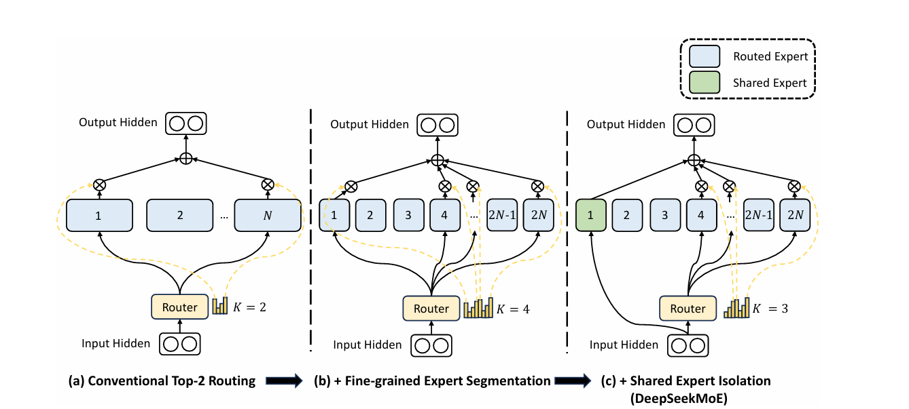

*图 4.3-1 DeepSeekMoE shared 与 fine-grained expert 结构*

图 4.3-1 展示了 DeepSeekMoE 的两个结构动作：先把较大的 routed expert 拆成更多细粒度 experts，再加入始终激活的 shared expert。细粒度拆分增加了可选组合数，使 router 能用多个小 expert 拼出更细的计算路径；shared expert 则承接所有 token 都需要的通用变换，减少 routed experts 被迫重复学习通用模式的压力。

- **细粒度专家分割**：在保持专家参数总量不变的前提下，把原来的较大 FFN expert 按比例缩小，例如取 $m=4$ 时每个小 expert 为标准 FFN 参数量的 $1/m=0.25$ 倍，并把每个原 expert 拆成 $m$ 个更小的 experts，从而把 $N$ 个 experts 扩展为 $mN$ 个小 experts。这种做法把参数密度从“每个 expert 更大”转向“更多但更小的 experts”，为更细粒度的路由组合提供空间。

   - **保持每次前向激活成本稳定**：每个小 expert 的参数量变成原来的 $1/m$，但每次前向激活的 expert 数量由原来的 $K$ 个扩展为 $mK$ 个。两项相乘后，单 token 实际经过的专家 FFN FLOPs 与未拆分前基本一致，从而在控制每次前向计算预算的同时扩大组合空间。

   - **组合灵活性增长**：细粒度化 experts 后，可供选择的 expert 组合数量显著增加。这个组合空间为 router 提供了更多表达路径，但也会增加负载均衡、通信和训练稳定性压力。

> [!NOTE]
> 细粒度专家会显著扩大组合空间。例如原始 $N=16$ 且激活 top-2 时，组合数为 $\binom{16}{2}=120$ ；若每个专家拆成 4 个小专家，总数变为 64 并激活 8 个小专家，组合数为 $\binom{64}{8}=4,426,165,368$ 。

- **共享专家**：保留若干 shared experts 来处理通用模式，在 routed experts 之外提供常驻路径。该设计与细粒度 experts 协同，能在增加路由组合空间的同时保留一条稳定的通用计算通道。

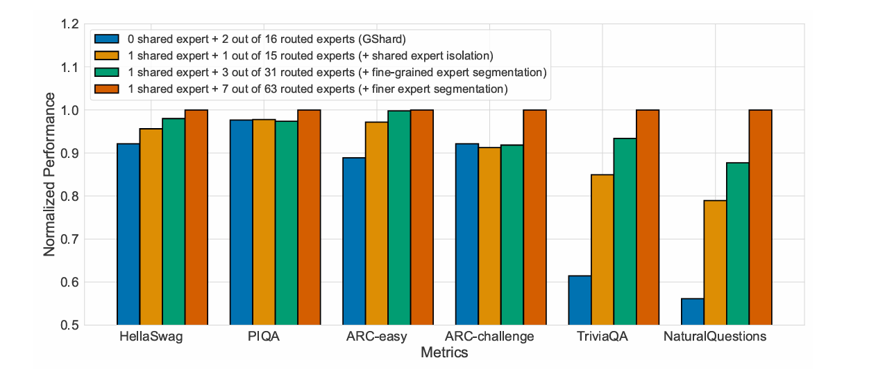

*图 4.3-2 激活计算量相同的 MoE 消融*

图 4.3-2 把每次前向的激活计算预算控制在相近水平，再改变 shared expert 与 routed expert 的粒度。多数组合中，更细的 routed experts 与少量 shared experts 能提高归一化指标；右侧问答类任务的提升尤其明显，说明 shared expert 对通用能力和 routed expert 分化有互补作用。

随着专家继续细化，收益会逐渐受通信开销、路由稳定性和每个 expert 可获得 token 数限制。[论文](https://arxiv.org/pdf/2401.06066)的消融实验也提供了一个经验：**当共享专家和激活的 routed experts 保持大约 1:3 的比例时，在基准任务上效果仅给出边际优势**——1/2/4 个共享专家的 Pile loss 差距 ≤0.005，原文 *"different ratios... do not significantly impact performance, 1:3 yields marginally better Pile loss"*。

因此，在实际操作中，需要在 expert 粒度、激活数量、shared expert 比例、通信开销和路由稳定性之间做 tradeoff，并通过消融实验找到当前硬件和计算预算下的配置。

- **负载均衡策略**：为了缓解负载不均衡导致的 expert collapse、expert starvation 和系统瓶颈，早期 DeepSeekMoE 使用 auxiliary loss；DeepSeek-V3 一类路线改用 per-expert bias / aux-loss-free balancing，通过在线调整 expert bias 平衡负载，同时尽量减少 auxiliary loss 对主目标的干扰。**注意**：DeepSeek-V3 的主要平衡策略是 aux-loss-free，但 [arXiv:2412.19437](https://arxiv.org/abs/2412.19437) §2.1.2 仍保留一个 **sequence-wise balance auxiliary loss** 作为兜底，专门防止单条序列内出现极端 imbalance；这是与"完全无辅助损失"的关键区别。

    - **expert-level balancing** 关注每个 expert 是否都有足够 token 和梯度，避免少数 experts 富者愈富。
    - **device-level balancing** 关注 experts 分布到多 GPU/多节点后，每台设备是否都在忙；即使 expert 平均负载合理，也可能出现某台设备承载的 experts 整体更热门。

> [!TIP]
> DeepSeek-V3 这类设计可以粗略记成“传输低精度、关键计算中等精度”：通信中的激活和部分梯度可用 FP8 压缩以省带宽，而专家输出 combine 等敏感计算仍保留 BF16 来维持稳定。

#### DeepSeek-V3 的另外两项关键架构创新

DeepSeek-V3 论文在 MoE 之外同时披露了两项与 MoE 并列的核心架构创新，本节统一吸收：

- **Multi-Head Latent Attention（MLA）**：把 K/V 压缩到低秩潜空间后再做注意力，相比 MHA 大幅压缩 KV cache（DeepSeek-V3 每 token 每层 MHA 需缓存 $2 h d_k = 2 \times 128 \times 128 = 32768$ 个元素，MLA 只缓存 $d_c + d_k^R = 512 + 64 = 576$ 个；细节见 [第 9 章 §9.3.2](../chapter9/chapter9_推理系统.md)）。MLA 与本节 MoE 路线在 DeepSeek-V3 中同时启用，是 V3 在长上下文与高吞吐推理两个方向都能维持竞争力的关键。
- **Multi-Token Prediction（MTP）**：训练目标中允许模型一次预测未来多个 token，可以作为辅助训练信号提升数据效率，也能在 decoding 时作为 speculative decoding 的草稿使用。MTP 在大多数主流开源模型里尚未普及，目前主要在 DeepSeek 系列内部规模化使用。
- **MoE fine-tuning 易过拟合**：MoE 专家数量大时 fine-tune 全部专家常常引发严重 overfitting；常见做法是只 fine-tune attention 层或 dense FFN 层，把 routed experts 冻结。这一经验在 V3 / V4-Pro 等大规模 MoE 后训练阶段尤其需要复现。

---

### 4.3.2 DeepSeek V4 的改进

面对浅层 MoE 训练不稳定的问题，一些模型会把浅层保留为 dense FFN，或用静态路由启动前几层，让后续可学习路由看到更稳定的表示。DeepSeek 的公开 config 给出了两种实现：`deepseek-moe-16b-base` 用 `first_k_dense_replace: 1` 让首层保持 dense FFN；DeepSeek-V4-Pro 的 config 则给出 `num_hash_layers: 3`，把前几层交给哈希路由，同一份 config 还配有 `n_routed_experts: 384`、`n_shared_experts: 1`、`num_experts_per_tok: 6`。

MoE 稳定性通常需要同时处理路由更新、激活异常值和损失尖峰。可以关注两类工程思路：

- **前瞻路由 / 缓存路由**，将路由网络与主干网络的同步更新过程进行解耦，其主要思想是：

    - 利用**之前的一步**（即步骤 $t - \Delta t$ ）的路由参数，为步骤 $t$ 的数据**提前计算并缓存好专家分配结果**；

    - 同时，引入异步自动检测机制，仅在检测到损失尖峰时自动触发该前瞻路由模式，系统会回滚并稳定运行一段时间后再切回标准训练流程。

这类方法会增加额外计算或缓存开销，是否划算取决于 loss spike 的频率、回滚成本和流水线能否隐藏额外开销。

- **SwiGLU clamping**：对 SwiGLU 中容易产生异常值的分支做范围限制，例如将线性分量限制在 `[-10, 10]`，并限制门控分量上界（[DeepSeek-V4-Pro config](https://huggingface.co/deepseek-ai/DeepSeek-V4-Pro/blob/main/config.json) 中的 `swiglu_limit: 10.0` 即此参数；DeepSeek-V3 config 没有该字段，gpt-oss-120b 取的是 `swiglu_limit: 7.0`）。这样可以降低 activation outlier 和 loss spike 风险，但是否值得使用仍取决于模型规模、精度和训练设置。

> [!NOTE]
> 这类 MoE 稳定性技巧目前更多来自工程经验和消融实验。笔记中保留机制解释，但对“必然有效”“不损害性能”等结论保持可复核表述。

## 4.4 MoE 与深度学习

**基础层级特征抽取与传统分工**

在深度学习中，神经网络的每一层通常会**逐层抽取特征**：例如卷积神经网络从低层的边缘和纹理信息开始，逐步构建到高层的物体部件和抽象语义特征。在同一层中，不同卷积核**并行响应输入**，各自对特定模式敏感——这直观地体现了**特征分工**。需要注意的是，这种分工是**隐式且固定、弱并行**的，由权重和输入数据共同决定。

**混合专家的动态与稀疏分工**

与传统卷积核的固定分工不同，MoE 引入条件路由，例如 top-k routing，在前向计算时只动态激活少数 expert modules。每个 expert 可以处理输入表示空间中的不同模式，从而在扩大总参数容量的同时保持每 token FLOPs 可控。MoE 的分工由输入和 router 动态决定；传统卷积核的分工则是算子并行且固定的。

**工程挑战**

MoE 的工程挑战来自条件激活本身：token 被分到不同 experts 后，系统要保持专家负载、设备负载和通信路径都足够均衡。在实际 MoE 系统中，还需同时考虑 expert load balancing、router stability 和 distributed communication overhead。

**超大规模 MoE 的优化思路和方法**

MoE 的训练效率来自稀疏激活，但系统上会引入 all-to-all 通信、专家负载不均和 sparse matmul 低利用率。

现代实现通常同时考虑多类约束：专家级平衡避免少数专家吃掉大部分 token；设备级平衡让专家分布到多 GPU/多节点后不出现单设备瓶颈；router 精度让 router logits、归一化和 z-loss 这类敏感计算保持足够数值稳定。

MegaBlocks 或 grouped GEMM 把不规则 expert batch 组织成更高效的矩阵乘法；expert parallelism 把专家维度和 tensor/pipeline/data/sequence parallelism 组合使用。

系统实现上可以按三步理解：

1. **Dispatch**：根据 router 结果把 token 发送到专家所在设备，通常会触发 all-to-all。
2. **Expert compute**：每个专家处理自己的 token batch。由于不同专家 token 数不同，MegaBlocks、grouped GEMM 等库会把不规则 batch 打包成更高利用率的矩阵乘法。
3. **Combine**：把专家输出按路由权重合回原 token 顺序。这里的通信和 layout 转换常常决定 MoE 是否真的比 dense 模型快。

expert parallelism 的意义在于把专家维度也变成可切分资源：attention 部分可能使用 TP/CP/DP，MLP experts 再叠加 EP/ETP/EDP。这样能扩展总参数量，但也让并行策略选择更依赖硬件拓扑。

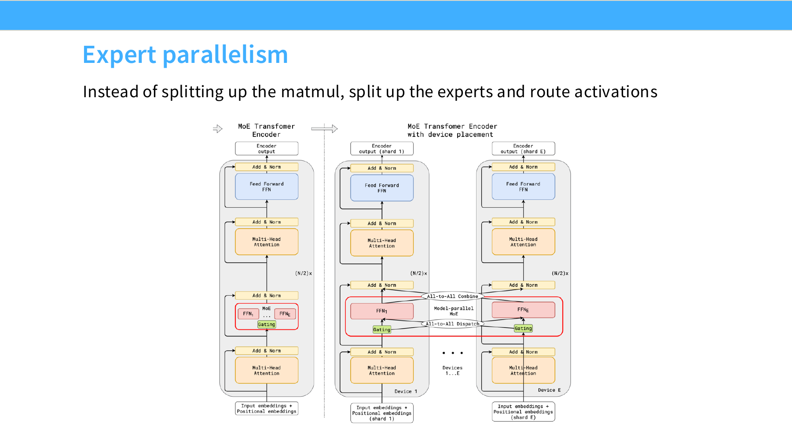

*图 4.4-1 expert parallelism 中的 dispatch 与 combine*

图 4.4-1 展示了 expert parallelism 的基本通信形状：MLP experts 被放到不同设备上，router 结果触发 all-to-all dispatch，把 token activation 送到对应 expert；expert 计算结束后再 all-to-all combine 回原来的 token 顺序。

这类通信形状也解释了为什么 attention 与 MoE 的并行策略常要拆开设计：MoE 切的是专家维度，attention 仍需要 TP/CP 等方式处理矩阵和序列维度。

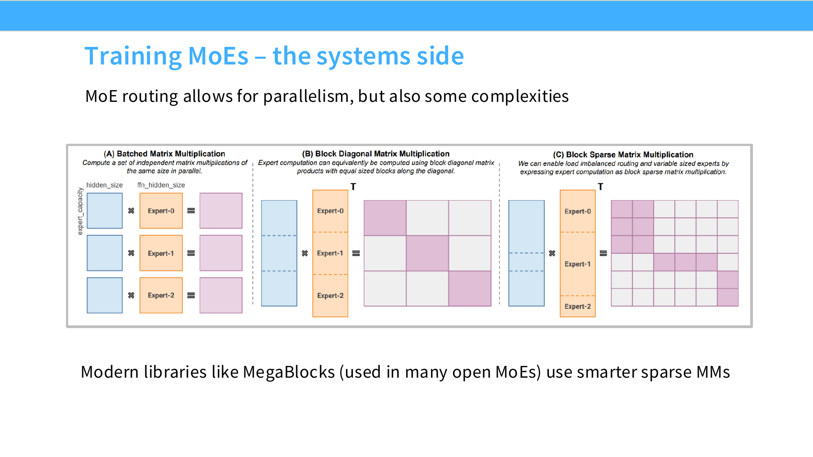

*图 4.4-2 MegaBlocks 将不规则 expert batch 组织为稀疏矩阵乘*

图 4.4-2 对比了三种 expert compute 组织方式。逐 expert 做许多小 GEMM 会浪费硬件利用率；块对角矩阵乘把多个 expert batch 合并成一个大算子；MegaBlocks 一类 block-sparse 方法进一步允许不同 expert 拿到不同 token 数。这样可以保留 dropless routing 的质量优势，同时避免不规则 batch 把 Tensor Core 利用率拖低。

> [!WARNING]
> MoE 的“总参数更大但激活参数更少”只有在路由足够均衡、通信可控、expert matmul 利用率足够高时，才会转化为端到端训练或推理收益。

在超大规模 MoE 推理模型上，研究者展示了通过 LoRA + RL 进行高效微调的可行性。这里的 LoRA 是在模型的 dense 层和 expert 层加上低秩适配器，使微调时只更新少量参数；RL 用于优化模型的行为策略。

以 [Kimi K2](https://huggingface.co/moonshotai/Kimi-K2-Instruct) 为例（约 1T total / 32B active；384 routed + 1 shared / top-8 per token，详见 [Kimi K2 论文](https://arxiv.org/abs/2507.20534)），公开材料中描述了结合混合并行与 LoRA 分片来降低 RL 微调成本的路线。这里的核心判断是：MoE 基座很大时，全参数 RL 代价极高，低秩适配和并行切分会直接决定训练是否可行。

相关对比实验通常会显示：强基座模型配合小规模 LoRA 的 RL，可能比小模型全参数 RL 更高效。直观原因是 RL 阶段很依赖基座模型的先验能力；基座越强，越容易产生高质量轨迹，RL 信号也更有效。超大规模 MoE 还会遇到一些特殊挑战：

   - **routing 不均衡**：部分 experts 被过度调用，部分 experts 闲置；
   - **通信压力**：不同 GPU、节点间数据交换频繁；
   - **并行布局复杂**：tensor、pipeline、expert 和 sequence parallelism 的组合很难优化；
   - **训练、推理不一致**：可能导致 expert 重要性比例突然失衡。

为解决这些问题，相关系统通常会组合几类工程优化方法：

1. **混合并行设计**：合理安排不同并行方式，减少通信开销；
2. **截断重要性采样修正**：防止少数专家过载；
3. **自适应并行调度器**：根据实时指标、GPU 利用率、内存、step time 自动调整 tensor、pipeline、expert、sequence 并行策略。

> [!WARNING]
>这些结论基于 Kimi K2 和特定任务，具有工程环境依赖；在其他模型、硬件或任务中，效果可能不同，需要复现验证。

## 4.5 Expert 配置表与代表模型

下表汇总公开 MoE 模型的 expert 配置，每行展示总专家数 / top-k / 共享专家数，以及实际激活 expert 比例。数据取自官方模型卡与 config.json，引用源附在最右列。

| 模型 | 总专家数 | top-k | 共享专家数 | 激活比例 | 来源 |
| --- | --- | --- | --- | --- | --- |
| GShard | 2048 | 2 | 0 | ~1/1024 | Lepikhin et al., 2020 |
| Switch Transformer | 64 | 1 | 0 | 1/64 | [arXiv:2101.03961](https://arxiv.org/abs/2101.03961) Table 9 的 Switch-XXL 变体；详见下方 NOTE |
| ST-MOE | 64 | 2 | 0 | 1/32 | Zoph et al., 2022 |
| Mixtral 8x7B | 8 | 2 | 0 | 2/8 = 1/4 | [arXiv:2401.04088](https://arxiv.org/abs/2401.04088) |
| DBRX | 16 | 4 | 0 | 4/16 = 1/4 | Databricks Mosaic |
| Grok-1 | 8 | 2 | 0 | 2/8 = 1/4 | [xai-org/grok-1](https://huggingface.co/xai-org/grok-1) |
| DeepSeek v1 (DeepSeek-MoE 16B) | 64 routed + 2 shared = 66 | 6 | 2 | (6 routed + 2 shared) / 66 = 8/66 ≈ 12.1% | [arXiv:2401.06066](https://arxiv.org/abs/2401.06066) |
| Qwen 1.5 MoE | 60 routed + 4 shared = 64 | 4 | 4 | (4 routed + 4 shared) / 64 = 8/64 = 1/8 = 12.5% | [Qwen/Qwen1.5-MoE-A2.7B config](https://huggingface.co/Qwen/Qwen1.5-MoE-A2.7B)：`num_experts: 60`、`num_experts_per_tok: 4`；shared expert 计数见下方 NOTE |
| DeepSeek v3 | 256 routed + 1 shared = 257 | 8 | 1 | (8 routed + 1 shared) / 257 = 9/257 ≈ 3.5% ≈ 1/28.6 | [arXiv:2412.19437](https://arxiv.org/abs/2412.19437) + [DeepSeek-V3 config](https://huggingface.co/deepseek-ai/DeepSeek-V3) |
| OlMoE | 64 | 8 | 0 | 8/64 = 1/8 | [arXiv:2409.02060](https://arxiv.org/abs/2409.02060) |
| Llama 4 Maverick | 128 routed + 1 shared = 129 | 1 | 1 | (1 routed + 1 shared) / 129 = 2/129 ≈ 1.55% | [Llama-4-Maverick config](https://huggingface.co/meta-llama/Llama-4-Maverick-17B-128E-Instruct) |
| MiniMax-M1 | 32 routed + 0 shared = 32 | 2 | 0 | 2/32 = 1/16 ≈ 6.25% | [MiniMax-M1-80k config](https://huggingface.co/MiniMaxAI/MiniMax-M1-80k)：`num_local_experts: 32`、`num_experts_per_tok: 2`、`shared_intermediate_size: 0` |

> [!NOTE]
> **Qwen 1.5 MoE 的 shared expert 计数**：官方架构为 60 个 routing expert（每 token top-4）加 4 个常驻 shared expert，每 token 共激活 8 个。HF config 里没有单独的 shared expert 个数字段，只有 `shared_expert_intermediate_size: 5632` 这一 shared 侧 FFN 中间维度；单个 routed expert 的 `moe_intermediate_size` 是 1408，5632 = 4 × 1408，说明 4 个 shared expert 在实现上被合成一个 fused MLP。读 config 时按维度倍数还原专家数，才能和 60 + 4 = 64 的架构描述对上。

> [!NOTE]
> **MiniMax-M1 混合架构**：attention 侧按 7 层 linear attention 配 1 层 full attention 的 7:1 比例堆叠，`MiniMax-M1-80k` config 的 `attn_type_list` 共 80 项，取值为 1 的位置在索引 7、15、23 … 79，对应 70 层 linear attention 加 10 层 full attention。表中列出的是它的 MoE 配置。

> [!NOTE]
> **DeepSeek 与 Llama 4 的设计哲学对比**：DeepSeek v3 把激活比压到约 1/28.6（极稀疏，强调参数规模扩大与计算效率），Llama 4 Maverick 在共享 expert 常驻 + 每 token 仅 1 个 routed 的极稀疏设置下激活 2/129 ≈ 1.55%（强调专家利用度）。两种选择都能 work，但意味着 all-to-all 通信、expert parallelism、负载均衡的设计权衡完全不同。

> [!NOTE]
> **Switch Transformer expert 数**：本表这一行的 64 experts / 1/64 对应 [Fedus et al., 2022, *Switch Transformers: Scaling to Trillion Parameter Models with Simple and Efficient Sparsity*, arXiv:2101.03961](https://arxiv.org/abs/2101.03961) Table 9 里的 Switch-XXL（395B，64 experts）。同一张 Table 9 还给出 Switch-Base 7B / 128 experts、Switch-Large 26B / 128 experts、Switch-C 1571B / 2048 experts，四个变体的 top-k 均为 1；表中另一列 “Expert freq.” 是 Switch 层替换 FFN 层的频率，Base / Large / XXL 为 1/2，Switch-C 为 1。

## 4.6 DeepSeek MoE 三代演进

下表展示 DeepSeek 从 V1 → V2 → V3 在 MoE 设计上的主要演进。

| 版本 | 总参数 | 激活参数 | expert 配置 | 关键创新 | 来源 |
| --- | --- | --- | --- | --- | --- |
| DeepSeek v1 (DeepSeek-MoE 16B) | 16B | 2.8B | 64 routed + 2 shared / top-6（8/66 ≈ 12.1% 激活） | 共享专家 + fine-grained experts 的早期尝试 | [arXiv:2401.06066](https://arxiv.org/abs/2401.06066) |
| DeepSeek v2 | 236B | 21B | 160 routed + 2 shared / top-6（8/162 ≈ 4.94% 激活） | device-limited routing（每个 token 的目标 expert 最多分布在 M 个 device 上，M ≥ 3 时质量与无约束 top-K 基本对齐），communication balancing loss | [arXiv:2405.04434](https://arxiv.org/abs/2405.04434) + [DeepSeek-V2 config](https://huggingface.co/deepseek-ai/deepseek-v2) |
| DeepSeek v3 | 671B | 37B | 256 routed + 1 shared / top-8（9/257 ≈ 3.5% 激活） | sigmoid 打分 + 仅 top-k 归一化；node-limited routing（每 token 最多发到 M=4 个节点，区别于 v2 的 device-limited）；aux-loss-free + seq-wise aux balance | [arXiv:2412.19437](https://arxiv.org/abs/2412.19437) + [DeepSeek-V3 config](https://huggingface.co/deepseek-ai/DeepSeek-V3) |

> [!TIP]
> DeepSeek MoE 的"共享专家 + fine-grained experts"组合是 2024-2025 年间公开 MoE 模型最常复用的模板（Qwen 1.5 MoE、Qwen MoE 系列、Llama 4 Maverick 等都用到这一组合或其变体）。但 DeepSeek 与 OlMoE 之间存在一个未解决的开放问题：DeepSeek 的实验表明共享 expert 普遍提升 loss，而 OlMoE 的实验表明共享 expert 没有明显收益、收益主要来自细粒度 expert；这一对立现象不试图在本章内解决，仅作为路由设计的"开放边界"留给读者复核。

## 本章总结与下章衔接

**本节系统梳理了 MoE 的核心收益与代价**：conditional compute 带来更大的总参数空间，但也把 routing、load balancing、通信和稳定性推到台前。更稳妥的工程结论应围绕 routing quality、expert utilization、all-to-all 开销和并行布局做联合权衡，单一模型的训练设置只能作为具体案例。

下一章进入 [第 5 章 GPU 和 GPU 相关优化](../chapter5/chapter5_GPU和GPU相关优化.md)，把 routing / dispatch / all-to-all 放进 HBM 带宽、SM 占用率和 FlashAttention 的执行视角：第 4 章回答"routing 怎么把 token 派给 expert"，第 5 章回答"这次派发在 SM、HBM 和 SRAM 上的成本是多少"。

## 思考

**基础思考问题**

1）MoE 架构中常见的 routing 机制有哪些？对应原理是什么？

2）缓解 MoE load imbalance 和训练不稳定的方法有哪些？

3）MoE 相较于 dense 模型的区别是什么？两种架构分别适合什么场景？


**进阶思考问题**

1）router 训练通常面临离散选择、早期不稳定和 expert load imbalance。load imbalance 不仅影响训练效率，也会阻碍每个 expert 形成稳定分工。如何稳定 router 训练，让 experts 在不牺牲负载均衡的前提下形成有用分化，是 MoE 架构研究中的关键问题。

> [!TIP]
> 一个思考方向是把 router 训练拆成阶段：先 warmup，让 router 自由探索、experts 接触多样输入；再分析 expert 激活模式，通过 routing loss 或 bias 调整帮助 experts 形成更稳定的功能分工；最后保持 shared experts 的通用能力，同时让 routed experts 在关键任务上更充分分化。这是教学设想，不是当前 MoE 的通用标准流程。

## 参考文献

- [减少计算消耗的万亿参数 MoE 调优](https://macaron.im/mindlab/research/building-trillion-parameter-reasoning-rl-with-10-gpus)
- [Hash Layers For Large Sparse Models](https://arxiv.org/abs/2106.04426)（Roller et al., 2021，预计算查表 hash routing）
- [Switch Transformers](https://arxiv.org/abs/2101.03961)（Fedus et al., 2022，Table 9 给 Switch-XXL 395B / 64 experts、Switch-Base 7B / 128 experts、Switch-Large 26B / 128 experts、Switch-C 1571B / 2048 experts，top-k 均为 1）
- [ST-MoE: Designing Stable and Transferable Sparse Expert Models](https://arxiv.org/abs/2202.08906)（Zoph et al., 2022，§3.3 引入 router z-loss）
- [GShard](https://arxiv.org/abs/2006.16668)（Lepikhin et al., 2020，2048 experts / top-2）
- [DeepSeekMoE](https://arxiv.org/pdf/2401.06066)（Dai et al., 2024，shared + fine-grained experts 模板，16B：64 routed + 2 shared / top-6）
- [DeepSeek-V2](https://arxiv.org/abs/2405.04434)（236B / 21B active；160 routed + 2 shared / top-6；device-limited routing M=3）
- [DeepSeek-V3](https://arxiv.org/pdf/2412.19437)（671B / 37B active；256 routed + 1 shared / top-8；aux-loss-free + seq-wise balance loss）
- [Mixtral of Experts](https://arxiv.org/abs/2401.04088)（8 experts / top-2）
- [OLMoE](https://arxiv.org/abs/2409.02060)（64 routed / top-8 / 0 shared；从零训练 vs upcycled，~25% 计算预算即可追平）
- [Sparse Upcycling](https://arxiv.org/abs/2212.05055)（Komatsuzaki et al., 2022，encoder 侧 expert-choice routing 且 C = 2、语言 decoder 侧 top-K = 2；语言侧从零训练需约 120% dense 计算预算才追上 upcycled）
- [Kimi K2](https://arxiv.org/abs/2507.20534)（1T total / 32B active；384 routed + 1 shared / top-8）

## 来源与更新记录

- 公开模型配置：[OlMoE config](https://huggingface.co/allenai/OLMoE-1B-7B-0924)、[Llama-4-Maverick config](https://huggingface.co/meta-llama/Llama-4-Maverick-17B-128E-Instruct)。DeepSeek-V4 系列配置见 [DeepSeek-V4-Pro config](https://huggingface.co/deepseek-ai/DeepSeek-V4-Pro/blob/main/config.json)：`n_routed_experts: 384`、`n_shared_experts: 1`、`num_experts_per_tok: 6`、`topk_method: "noaux_tc"`、`scoring_func: "sqrtsoftplus"`、`num_hash_layers: 3`、`swiglu_limit: 10.0`（查阅日期 2026-09-03）。
- §4.5 expert 配置表的 Qwen 1.5 MoE 与 MiniMax-M1 两行取自 [Qwen1.5-MoE-A2.7B config](https://huggingface.co/Qwen/Qwen1.5-MoE-A2.7B/blob/main/config.json) 与 [MiniMax-M1-80k config](https://huggingface.co/MiniMaxAI/MiniMax-M1-80k/blob/main/config.json)（状态：官方，查阅日期 2026-09-05）。
- 课程材料：CS336 2026 Lecture 4 slides 与 video，对应 lecture 映射见 [`sources/cs336-2026.md`](../../sources/cs336-2026.md)。
