# 第 5 章 GPU 和 GPU 相关的优化

## 本章主线

本章的主线是“数据移动与数据复用”。GPU 的算术单元很多，但 LLM 训练和推理速度常常取决于数据能不能连续、批量、少搬运地进入 SM。后文的低精度、fusion、recomputation、coalescing、tiling 和 FlashAttention，都可以看成是在不同层级上减少 HBM 往返或提高片上复用。

## 本章学习目标

本章围绕大模型训练与推理所依赖的 GPU 加速路径展开，重点解决四个问题：

1. [理解 GPU 的基本架构、与 CPU 的差异以及从图形处理器到 AI 引擎的发展历程](#51-gpu的起源图形处理器)
2. [掌握 GPU 的执行模型（SM、Warp、Block、Thread）和分层内存模型（全局内存、L2 缓存、共享内存、寄存器等）](#52-gpu的执行模型-sm流式多处理器)
3. [学习 GPU 性能优化的关键技术：避免串行执行、低精度计算、算子融合、重计算、内存合并、分块（Tiling）等](#56-性能优化技术)
4. [深入理解 FlashAttention（V1/V2/V3）的 IO 优化、分块和硬件适配](#57-flashattention)

完成本章后，你应当能把一个 GPU 性能问题拆成三类账本：算力是否足够、数据是否反复穿过 HBM、片上内存和线程组织是否让数据得到复用。FlashAttention、tiling、fusion、recomputation 和低精度都可以放回这三类账本里判断。

## 5.1 GPU 的起源：图形处理器

本节回答三个前置问题：GPU 为什么会从图形处理器演化成 AI 训练与推理的核心加速器，CPU 和 GPU 在设计目标上各偏向哪一端，以及 A100/H100/H200/B200 四代硬件在 SM 数、HBM 容量与带宽、L2 上有什么量级差异。读完后读者应能把一张规格表转译成「这一代解决了上一代什么瓶颈」的判断，建立数量级感和瓶颈判断而非背参数。

在深度学习概念没有火起来之前，GPU 更常被理解为图形处理器。图形渲染天然包含大量相似的小计算：同一套几何和像素规则要重复应用到许多顶点、三角形和像素上。这种 workload 正好适合用大量简单计算单元并行处理。

以 3D 模型为例，模型表面通常由许多三角形组成。系统不需要把每个像素点都预先存下来，而是保存顶点、边和材质等紧凑信息，再在渲染时并行计算中间像素和光照结果。


*图 5.1-1 3D model 与三角形计算*

这类计算的单个任务通常很小，但任务数量极多、形态相似、可以批量执行。GPU 的早期设计正是围绕这类吞吐型任务展开：用更多算术单元换取更高的总体处理量。

CPU 和 GPU 没有绝对优劣，它们优化的是不同目标。CPU 更适合复杂控制流和低延迟任务；GPU 更适合把同一类指令应用到大量数据上。进入深度学习时代后，矩阵乘法、卷积和逐元素操作都符合这种吞吐型模式，GPU 也就自然成为训练和推理的核心加速器。

### 5.1.1 CPU（中心处理器）和 GPU（图形处理器）的区别

CPU 的设计目标是低延迟：让少数复杂线程尽快完成。为此，CPU 会投入较多芯片面积给控制逻辑、分支预测、缓存层级、乱序执行和推测执行。它擅长处理复杂条件分支、系统调用、调度和控制密集型任务。

GPU 的设计目标是高吞吐：让大量相似线程在总体上处理更多数据。它把更多芯片面积放到算术单元上，用较轻量的控制逻辑调度许多线程。单个 GPU 任务的延迟未必低，但当任务可以批量并行时，总吞吐量会非常高。

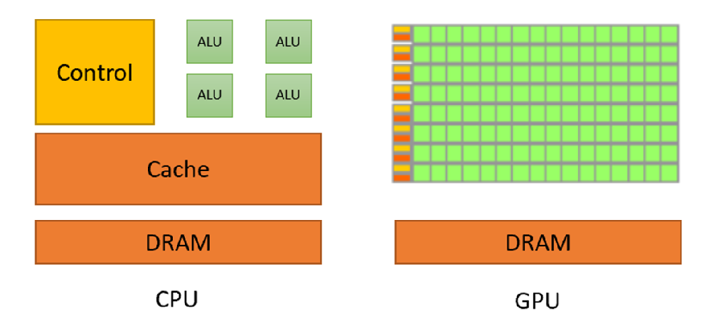

*图 5.1-2 CPU 与 GPU 的结构差异*

图 5.1-2 对应的是两种硬件目标：CPU 把更多面积用于控制、缓存和少量高性能线程，追求单个任务的低延迟；GPU 把更多面积用于大量 ALU，追求许多相似任务的总吞吐。深度学习中的矩阵乘法正好把大量乘加组织成规整批处理，因此能很好地利用 GPU 的吞吐能力。

### 5.1.2 GPU 发展：从图形管线到通用矩阵引擎

GPU 的历史背景只需要抓住一条主线：它最初为图形渲染中的大规模同构计算设计，后来通过可编程 shader、CUDA、Tensor Core 和高带宽显存，逐步变成深度学习中最重要的矩阵计算引擎。

对 LLM 工程更重要的是下面三点：

- **吞吐优先**：GPU 牺牲复杂控制逻辑，换取大量并行算术单元，适合矩阵乘法、卷积和逐元素批量计算。
- **数据移动昂贵**：算力增长速度长期快于 HBM、互联和主机通信带宽，许多优化最终都是减少数据往返。
- **编程模型分层**：PyTorch 调 kernel，Triton/CUDA 写 kernel，PTX/SASS 体现硬件实际指令。性能分析要能把这几层连起来看。

---

### 5.1.3 A100/H100/H200/B200 四代硬件量级

在进入 A100 的剖面细节前，可以先把 **A100（Ampere）/ H100（Hopper）/ H200（Hopper refresh）/ B200（Blackwell）** 放在同一张表里比较。对写 kernel、看 profiler 和理解 roofline 来说，最值得先记住的是下面这些量级差异。

> [!IMPORTANT]
> **口径声明（dense / sparse / per-SM / per-GPU）**：本表所有数字默认指 **dense 训练口径（无 2:4 结构化稀疏加速）的整卡（per-GPU）峰值**；启用 2:4 结构化稀疏时 A100/H100 公开 datasheet 在 "with sparsity" 列单独给出 2× 系数，本章不另列。SM 数、HBM 容量、HBM 带宽、L2 容量是每颗 GPU 的总资源；FP32 / Tensor Core 峰值在表内默认按整卡口径。H100 BF16 dense ≈ 989.5 TFLOP/s、FP8 dense ≈ 1,979 TFLOP/s 是 H100 自身 datasheet 的整卡峰值；其他章节若出现 H100 BF16 数字，应先核对是否为同一口径。H200 与 B200 行列只为 §5.1.3 与 §5.8 提供量级参考；本章核心范围以 A100 为基线讲 SM 与 Tensor Core，H100/H200/B200 作为代际对照。

| 指标 | A100 | H100 | H200 | B200 |
| --- | --- | --- | --- | --- |
| SM 数 | 108 | 132 | 132 | GB100 die SM 数 NVIDIA 官方未公布；按第三方拆解资料约 148 SM（部分启用配置）、每 SM 128 个 FP32 core 推算常见；NVIDIA Blackwell 公开 tuning guide 与 datasheet 未给出 SM 数字 |
| 每 SM 寄存器 | 256 KB | 256 KB | 256 KB | 256 KB |
| 每 SM L1 + shared memory | 192 KB | 256 KB | 256 KB | 256 KB |
| L2 cache | 40 MB | 50 MB | 50 MB | 单颗 GB200 / B200 GPU（全封装，含 2 个 GB100 die）L2 = 126 MB（[NVIDIA Blackwell tuning guide §1.4.2.2](https://docs.nvidia.com/cuda/blackwell-tuning-guide/)）；折算每 GB100 die ≈ 63 MB |
| HBM 容量 | 80 GB | 80 GB | 141 GB HBM3e | B200 HBM3e 192 GB（HGX B200 公开口径 180 GB HBM3e；GB200 NVL72 datasheet 按总 HBM3e 13.4 TB / 72 GPU 推回 186 GB）[NVIDIA Blackwell tuning guide](https://docs.nvidia.com/cuda/blackwell-tuning-guide/) |
| HBM 带宽量级 | 2 TB/s | 3.35 TB/s | ~4.8 TB/s | 8 TB/s |

从编程角度看，可以把它们理解成同一类 GPU 执行模型的几代演化：**A100 是理解 Ampere 时代 kernel 优化的基线，H100 增强了 shared memory、异步执行和 FP8 路径，H200 在 H100 计算能力上把显存换成更大带宽的 HBM3e，B200 则把 HBM/L2 容量和 Blackwell 低精度路径再往前推了一代**。上表数值均为 dense 训练口径；若启用结构化稀疏（Structured Sparsity，俗称 2:4 sparsity），Tensor Core 路径理论峰值翻倍——A100/H100 公开 datasheet 在 "with sparsity" 一列单独列出 2× 系数（[NVIDIA H100 datasheet](https://www.nvidia.com/en-sg/data-center/h100/)）。

新一代硬件还引入了两个会影响 kernel 设计的特性：

- **H100/B200 的 thread block clusters**：允许更大粒度的协作和 distributed shared memory。
- **B200 的 TMEM（tensor memory）**：位于寄存器与 shared memory 之间，主要服务 Tensor Core 路径，对高层程序员通常不可直接见。

硬件示例不能当作通用常数。A100、H100、B200 会共同出现，但每次都要说明它是在讲基线剖面、Hopper 特性，还是 Blackwell 新增能力。学习这些规格时要建立数量级和瓶颈判断，不需要背某个 SKU 的完整参数表。

顺着本章的学习顺序看，后面的优化技巧都可以落回同一条链路：

1. GPU 有很多算术单元，但它们只有在数据连续、批量、可复用时才能被喂饱。
2. HBM 带宽很高但仍远慢于片上寄存器、shared memory 和 L2，因此减少 HBM 往返通常比减少少量 FLOPs 更重要。
3. 低精度、fusion、recomputation、coalescing、tiling 和 FlashAttention 都是在不同层级上减少数据移动或提高数据复用。
4. 换到 H100/B200 后，执行模型没有变，但异步执行、FP8/MXFP8/MXFP4、TMEM 和更大缓存会改变“哪种实现更划算”。

后面的优化都可以沿这条链分析：先问数据从哪里来、会被读几次、能不能留在更近的内存层级；再问计算是否足够密集，能不能用 Tensor Core 或更低精度；最后才问具体 kernel 写法。FlashAttention、tiling、fusion 和 recomputation 是同一套数据移动账本上的不同操作。

### 5.1.4 A100 芯片内部结构（精简版）


*图 5.1-3 GPU 板卡结构*

完整的多层拆解（板卡 PCB / GA100 芯片宏观架构 / SM 内部结构 / Tensor Core 数据路径）属于板级百科，与本章主线（数据移动与片上复用）相关度较低；本节只保留对后续章节有用的三层结论：

- **顶层数字**：A100 = 108 SM × 64 FP32 core/SM + 4 Tensor Core/SM + 80 GB HBM2e + 2 TB/s HBM 带宽（与 §5.1.3 硬件表一致）。
- **关键 SM 内部单元**：CUDA core（FP32 ALU）、Tensor Core（FP16/BF16/INT8/INT4/TF32 矩阵乘）、register file、warp scheduler、shared memory 与 L1 cache。
- **内存层次**：HBM（global，2 TB/s） → L2 cache（40 MB） → shared memory（手动管理） → register file（每线程 255 个） → SIMT warp 调度器通过 warp 切换隐藏延迟。

下面把 GA100 拆成三个粒度，作为后续 SM / warp / shared memory 抽象的物理参照。完整多层结构图与板级实物图已收入对应 `images/` 子目录。下一节 §5.2 SM 执行模型只复用 SM / warp / shared memory 三个抽象。

#### GA100 芯片宏观拓扑

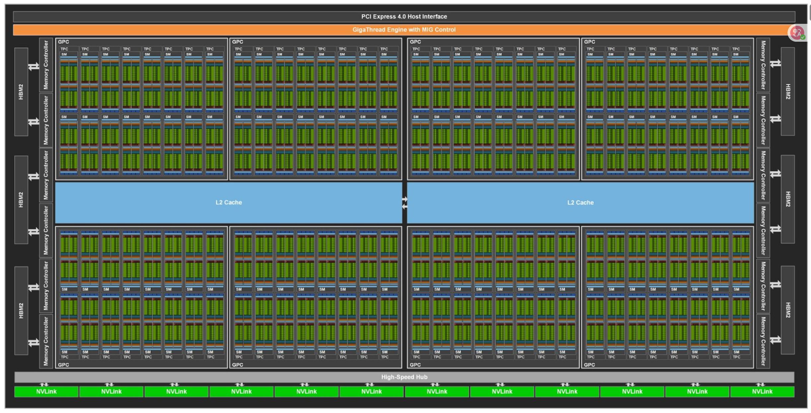

*图 5.1-4 GA100 GPU 核心架构*

A100 的宏观拓扑可以理解为四层：**GPC（Graphics Processing Cluster） → TPC（Texture Processing Cluster） → SM（Streaming Multiprocessor） → SP（Streaming Processor / CUDA core）**。一个完整 GA100 设计包含多个 GPC；每个 GPC 下有若干 TPC；每个 TPC 再包含若干 SM。

实际启用数量随 SKU 变化，A100 常见配置为 108 个 SM。按每个 SM 64 个 FP32 CUDA core 估算，常见启用配置约为 $108 \times 64 = 6912$ 个 FP32 CUDA core。A100 每个 SM 还有 4 个第三代 Tensor Core，以 108 个 SM 的常见配置估算，总计约 432 个 Tensor Core。

#### SM 内部单元

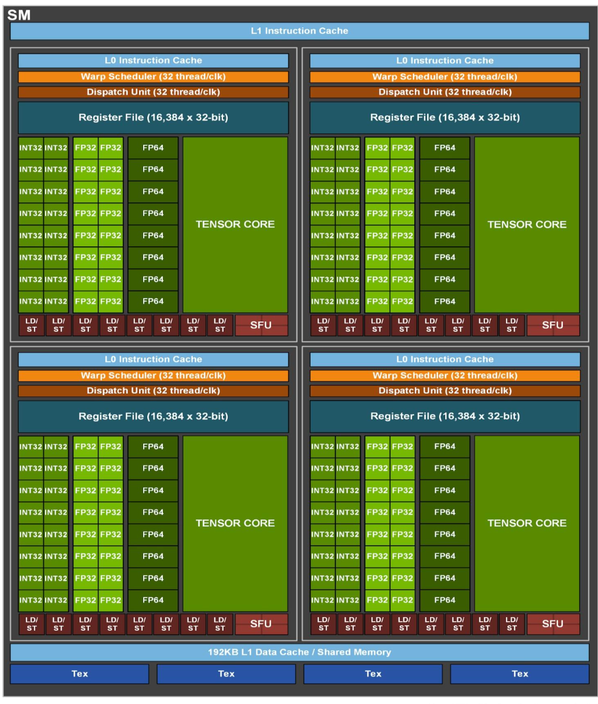

*图 5.1-5 A100 SM 内部结构*

**SM 的独特之处**在于它把大量 CUDA 核心、调度器、寄存器、共享内存/L1 缓存和 Tensor Core 放在同一个执行单元内。以 A100 为例，每个 SM 包含 64 个 FP32 CUDA 核心、64 个 INT32 CUDA 核心和 4 个第三代 Tensor Core；Tensor Core 支持结构化稀疏、TF32、FP16/BF16、INT8 等低精度矩阵运算，同时 A100 也具备面向 HPC 的 FP64 能力。

#### Tensor Core 吞吐（Ampere）

| 数据类型 | 性能（全 GPU，dense 口径） | 用途 |
|----------|-----------------------------|------|
| **FP64 CUDA Core** | 9.7 TFLOP/s（无 2:4 结构化稀疏加速） | 通用科学计算 |
| **FP64 Tensor Core** | 19.5 TFLOP/s（dense，无稀疏加速） | HPC / 高精度 AI |
| **TF32** | 156 TFLOP/s（dense）/ 312 TFLOP/s（with sparsity） | 默认 AI 训练格式 |
| **FP16/BF16** | 312 TFLOP/s（dense）/ 624 TFLOP/s（with sparsity） | 混合精度训练 |
| **INT8** | 624 TOPS（基础）/ 1,248 TOPS（结构化稀疏） | 推理加速 |
| **INT4** | 1,248 TOPS（基础）/ 2,496 TOPS（结构化稀疏）（[NVIDIA A100 白皮书](https://developer.nvidia.com/blog/nvidia-ampere-architecture-in-depth/) 与 A100 datasheet specs table 一致列出） | 极致推理优化 |

**核心技术**：

- **结构化稀疏**：在硬件和 kernel 支持的结构化稀疏模式下，可以减少部分矩阵乘计算，理论吞吐最高约 2 倍；它只对特定稀疏模式有硬件收益，任意零值不会自动提速。
- **多精度支持**：Tensor Core 支持 TF32、FP16/BF16、INT8/INT4 等多种格式；实际收益取决于算子实现、kernel 调度和数值稳定性。

---

## 5.2 GPU 的执行模型 SM（流式多处理器）

本节回答一个前置问题：kernel 在 GPU 上到底是怎么被调度和执行的。具体要看清 grid / block / warp / thread 四层抽象分别承担什么并行粒度、SM 内部的 warp scheduler 与 shared memory 如何共同决定 occupancy，以及 SIMT 模型如何让程序员写出「近似单线程」的 kernel。读完后读者应能把一段 CUDA kernel 的并行度需求拆成 block 数 × warp 数 × 寄存器预算，再回头判断它在某个 SM 数下能不能喂饱。

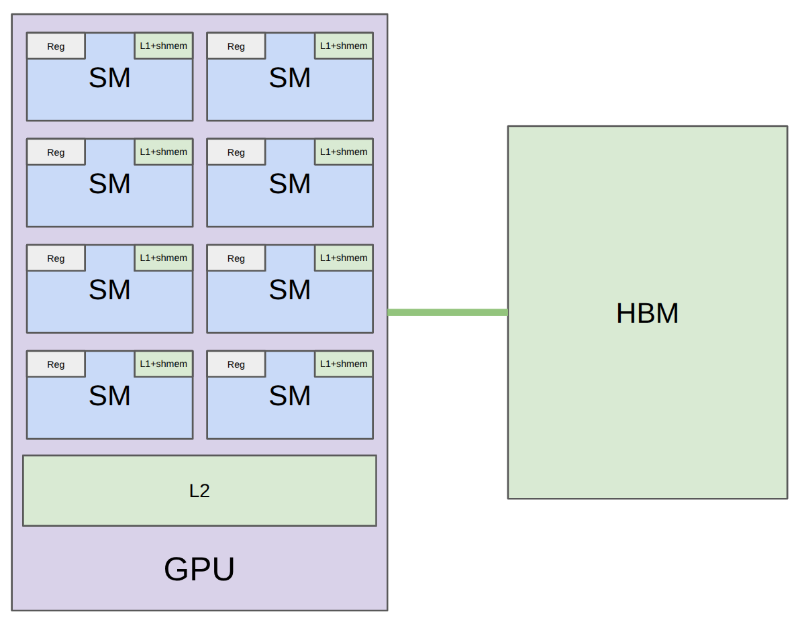

*图 5.2-1 GPU 硬件层级*

### 5.2.1 SM 的核心作用

SM 是 GPU 上调度和执行 kernel 工作的核心单元。一个 thread block 会被调度到某个 SM 上，block 内线程共享这个 SM 的 shared memory、寄存器预算和调度资源。SM 内部再包含 warp scheduler、CUDA core、Tensor Core、寄存器文件和 L1/shared memory 等组件。

从性能角度看，SM 决定了两件事：一是有多少 thread block 和 warp 可以同时驻留，用来隐藏 HBM 访问延迟；二是矩阵乘法能否持续喂饱 Tensor Core。A100 常见配置有 108 个 SM，H100/B200 的 SM 数更多，但“thread block 在 SM 上运行、warp 在 SM 内调度、数据尽量留在片上内存”的基本模型保持一致。

#### 线程调度与执行
SM 同时管理**数千个线程**，决定哪个线程在何时使用哪个计算单元。它不像 CPU 那样为每个线程保存大量状态，而是轻量级切换，几乎没有开销。

#### 指令流水线
SM 内部有 **4 条独立的指令流水线**，每个时钟周期可以同时发射 4 条不同指令给不同的 warp（线程束）。

#### 数据缓存与共享
SM 内置 **192 KB 的 L1 缓存/共享内存**，供本 SM 内所有 CUDA 核心快速存取数据，延迟比全局显存低约 100 倍。

---

### 5.2.2 执行模型的核心名词详解

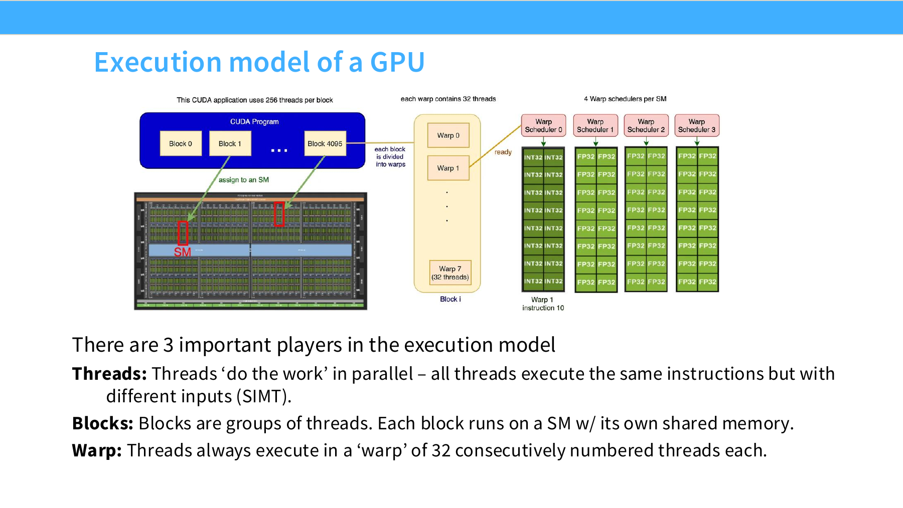

*图 5.2-2 SM 的执行模型*

GPU 程序通常按 **grid -> block -> warp -> thread** 的层级组织。grid 是一次 kernel launch 的全部工作；block 是会被调度到同一个 SM 上的线程组；warp 是 SM 内实际同步执行的一组连续线程；thread 是最细粒度的工作单元。

这个层级同时决定并行度和可通信范围：block 内可以通过 shared memory 协作，跨 block 的通信通常要回到 global memory 或由更高层 runtime 组织。

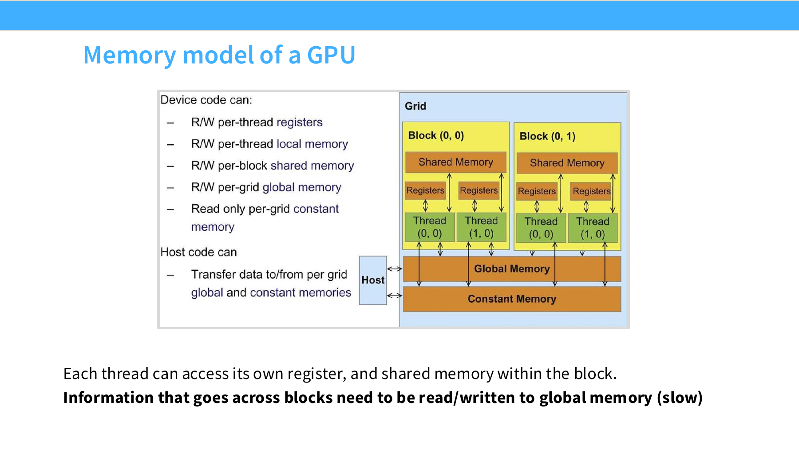

*图 5.2-3 GPU 程序可访问的内存层级*

#### Warp（线程束）

一个 **warp** 是 32 个连续编号线程组成的固定小组，是 SM 调度指令的基本单位。warp 内线程以 SIMT 方式执行：指令相同，输入数据不同。若同一 warp 内部分线程走 `if` 分支、部分线程走 `else` 分支，硬件会用 mask 分阶段执行两条路径，形成 **warp divergence**，有效利用率下降。

SM 上同时可驻留最多 **64 个 warp**（典型值，A100/H100 SM 一致），由 4 个 warp 调度器从共享的 warp 池中取指；每个周期 4 个调度器各发射 1 条指令给不同 warp，使 SM 能在数据依赖或访存等待时切换 warp 隐藏延迟。warp 内 32 个线程在 **SIMD 单元**上同步执行。

#### Block（线程块）

Block 是程序员指定的线程组，会映射到**一个 SM** 上执行。block 内线程可以访问同一块 shared memory，也可以通过同步原语协调进度。

每个 block 独占 SM 的**共享内存**和**寄存器资源**；block 内所有线程必须**在同一 SM 内**执行，不能跨 SM。

#### Thread（线程）

线程是**最细粒度的执行单元**，每个线程执行同样的 kernel 代码，但操作不同数据。常见逐元素 kernel 会让每个 thread 负责一个或几个数据元素。

每个线程有**私有寄存器**；线程 ID `threadIdx.x` 决定它处理哪个数据。

#### SIMT（单指令多线程）

GPU 执行模型中，warp 内多个线程共享同一条指令，但操作不同数据。SIMT 让程序员写出接近单线程的 kernel 逻辑，同时让硬件把这套逻辑批量应用到许多数据元素上。

---

## 5.3 GPU 的内存模型

本节回答一个前置问题：kernel 在读写数据时实际走的是哪条内存路径，延迟和带宽量级相差多少。具体要看清 global memory / L2 cache / L1 + shared memory / 常量内存 / 寄存器五层的物理位置、容量、带宽、延迟、编程控制和可见性，以及为什么分层是「速度、容量、成本」三者折中后的唯一经济可行方案。读完后读者应能把任何一段 kernel 改写成「数据在哪一层、会被读几次、能不能留在更近的层级」的判断，并意识到只看 FLOPs 数字会忽略这条主线。

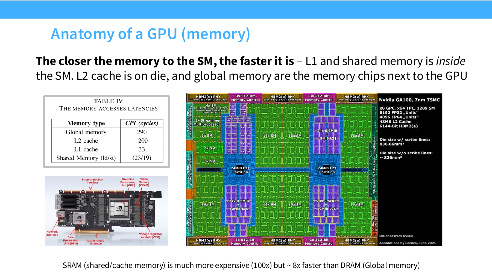

*图 5.3-1 GPU 的内存模型*

GPU 内存层级的核心规律是：**越靠近 SM，容量越小、速度越快、成本越高；越远离 SM，容量越大、延迟越高**。寄存器和 shared memory 适合保存短时间内反复使用的小块数据，global memory / HBM 适合保存模型权重、activation、KV cache 和大张量。

图 5.3-1 中绿色区域是 SM 集群，蓝色区域代表芯片上的 L2 cache。L1/shared memory 在每个 SM 内部，L2 在芯片上由多个 SM 共享，HBM 则位于芯片外部或封装附近，需要通过更远的物理路径访问。距离变化会转化为延迟和带宽差异。

数量级上，SM 内部存储的访问延迟可以低到几十个周期，而 L2 和 global memory 往往高一个数量级。若 kernel 每做少量计算就要等待 HBM，Tensor Core 和 CUDA core 会空转；若能把工作 tile 搬到 shared memory 或寄存器中重复使用，同样的 FLOPs 会更接近硬件峰值。

编写 kernel 时，最理想的形态是让一个 block 负责一小块可复用数据：先从 global memory 连续加载到 shared memory，再由 block 内线程反复读取、累积并写回最终结果。跨 block 的信息通常需要经过 global memory，因此 block 切分和 tile 布局会直接影响性能。

---

### 5.3.1 第一层：全局内存（Global Memory）

| 特性 | 参数  说明 |
|------|------------|
| **物理位置** | GPU 芯片外的 HBM2e 显存堆栈 |
| **容量** | A100：40 GB/80 GB |
| **带宽** | **2,039 GB/s** (A100) |
| **延迟** | ~500 GPU 周期 (~250 ns) |
| **编程控制** | **手动管理** (`cudaMalloc`) |
| **可见性** | 所有线程可访问 |

全局内存可以存放模型权重、activation、梯度、训练数据、中间结果和最终输出；通过 PCIe 从主机内存拷贝数据时，它也是 **CPU-GPU 传输通道**的一部分。

全局内存提供**海量容量**（如 80 GB），能容纳大模型所需的数据；成本相对低（HBM2e 虽贵，但比 SRAM 便宜很多），是 GPU 存储体系的基础。

---

### 5.3.2 第二层：L2缓存（二级缓存）

| 特性 | 参数  说明 |
|------|------------|
| **物理位置** | **GPU 芯片内，所有 SM 共享** |
| **容量** | **40 MB** (A100) |
| **带宽** | ~3 TB/s |
| **延迟** | ~200 周期 (~100 ns) |
| **编程控制** | **自动管理** (硬件控制) |
| **可见性** | 所有 SM 的所有线程 |


L2 cache 自动缓存全局内存的热点数据，例如频繁访问的模型权重或中间结果；它也是 SM 之间共享数据时的重要通道。相比直接走 HBM，命中 L2 能降低延迟并节省外部带宽。

L2 由硬件自动管理，程序员通常不直接控制具体缓存项。优化时更常调整访问顺序、数据布局和 tile 形状，让热点数据有机会在 L2 或更近的层级中复用。

---

### 5.3.3 第三层：L1缓存 / 共享内存（Shared Memory）

| 特性 | 参数  说明 |
|------|------------|
| **物理位置** | **每个 SM 内部** |
| **容量** | **192KB/SM** (A100, 可配置) |
| **带宽** | **1TB/SM** |
| **延迟** | **20-40周期** (~10-20ns) |
| **编程控制** | **完全手动** (`__shared__`) |
| **可见性** | **Block 内所有线程可见** |


L1/shared memory 是 block 内协作的核心。矩阵乘法 tiling、归约、scan 和 FlashAttention 都会把当前 tile 显式搬进 shared memory，让多个线程反复读取同一块数据。

shared memory 容量有限，使用过多会降低同一 SM 上能同时驻留的 block 数；使用过少又会让数据频繁回到 HBM。因此 tile size 需要同时看 shared memory 容量、寄存器压力、coalescing 和 block occupancy。

---

### 5.3.4 第四层：常量内存（Constant Memory）

| 特性 | 参数  说明 |
|------|------------|
| **物理位置** | 芯片内专用缓存 |
| **容量** | **64KB** (全局常量) |
| **带宽** | 广播机制 (1次读取服务32线程) |
| **延迟** | ~5周期 (命中缓存) |
| **编程控制** | 只读, `__constant__`声明 |
| **可见性** | **全 GPU 所有线程只读** |

常量内存适合同一 warp 内线程读取相同值的场景，例如 kernel 参数、查找表或常量系数。广播机制能让一次读取服务多个线程；不满足广播模式时，它的优势会明显下降。

---

### 5.3.5 第五层：寄存器文件（Register File）

| 特性 | 参数  说明 |
|------|------------|
| **物理位置** | **SM 内，每个 CUDA 核心旁** |
| **容量** | **256 KB/SM** (A100) |
| **带宽** | **10 TB/SM** (理论) |
| **延迟** | **1 周期** (零开销) |
| **编程控制** | **完全自动** (编译器分配) |
| **可见性** | **线程私有** |

寄存器文件保存线程私有的局部变量、地址和临时累积结果，速度最快、容量也最紧。每个线程使用的寄存器越多，同一个 SM 能同时驻留的 warp 或 block 越少；这会影响 occupancy。高性能 kernel 经常在“让每个线程多做一点工作”和“保留足够并行度”之间取平衡。

---

### 5.3.6 GPU 内的内存分这么多层的原因

**1. 速度和容量不可兼得**

| 内存类型 | 速度 | 容量 | 成本($/GB)（估计） |
|----------|------|------|------------|
| 寄存器 | 1 周期 | 256 KB/SM | $1,000,000 |
| 共享内存 | 20 周期 | 192 KB/SM | $100,000 |
| L2 缓存 | 200 周期 | 40 MB | $10,000 |
| HBM2e 显存 | 500 周期 | 80 GB | $100 |

如果只用寄存器，成本会高到无法制造一张合理的 GPU；如果只用显存，又会让大量算力浪费在等待数据上。分层是**唯一经济可行方案**，它在速度、容量和成本之间折中。

**2. 通用性和专用性取舍**

全局内存是一个**通用仓库**，它什么都存，但速度慢。而共享内存是**专用仓库**，程序员往往精确控制，速度极快。L1/L2 则是**自动缓存**，由硬件智能预测，无需编程。

**3. 局部性原理和并行计算**

刚访问的数据很可能再次访问（如循环中的权重），这样放在全局内存的开销就很大。除此之外还有**空间局部性**，相邻数据很可能一起访问（如矩阵的同行元素）

GPU 的解决方案是划分层级：**L2 cache** 利用时间局部性，缓存重复访问的权重；**shared memory** 利用空间局部性，手动加载 tiling 数据；**warp** 利用常量内存或 coalesced access，让一次内存事务服务多个线程。

---

#### GPU 内存和 CPU 内存的设计差异

GPU 和 CPU 的内存系统差异可以概括如下：

| 特性 | GPU (A100) | CPU (Xeon) |
|------|------------|------------|
| **主存带宽** | 2TB/s | 100GB/s |
| **缓存控制** | 共享内存**手动控制** | 缓存完全自动 |
| **线程寄存器** | 255个/线程 | 16个/线程 (x86) |
| **延迟容忍** | 通过Warp切换**隐藏延迟** | 降低延迟至上 |
| **内存模型** | **共享内存显式同步** | 缓存一致性协议 |

**CPU 和 GPU 的内存设计差异**在于：GPU 内存系统是**为吞吐量优化**，容忍高延迟；CPU 内存系统是**为延迟优化**，降低延迟。这导致 GPU 需要更多层级和手动控制。

---

## 5.4 TPU 架构（Tensor Processing Unit）

本节做对照，不展开 TPU 训练栈。本节回答两个前置问题：TPU 与 GPU 在「快矩阵乘法 + 快片上内存 + 慢但大的 HBM」这条主线上是否同构，以及 TPU 的「少而大」矩阵单元与 GPU 的「多而小」Tensor Core 在矩阵乘法粒度上的差别如何影响 kernel 设计。读完后读者应能在看到「TensorCore」「MXU」时判断语境（TPU 处理器级单元 vs GPU SM 内部矩阵电路），并把 MXU 的 systolic array 形状当作 batch / feature 维度对齐的硬性约束。

**TPU** 是 Google 自 2015 年起研发的 ASIC 加速器，目标 workload 更集中在机器学习中的矩阵乘法和张量程序。本节只用 TPU 做对照，帮助读者识别另一条加速器设计路线：GPU 更通用、更灵活，TPU 更偏向少数更大的矩阵乘法单元和配套网络。

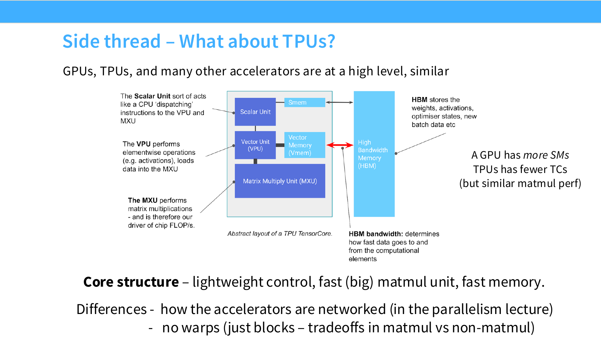

*图 5.4-1 TPU abstract model*

### 5.4.1 TPU 与 GPU 的相似性

> [!NOTE]
> **本节对应本章 TPU 核心范围**：核心要点是 GPU 多而小、TPU 少而大，二者矩阵乘法吞吐相近；互联网络差异和 MXU 几何细节放 §5.4.2 / §5.4.3 补充。本节把高阶结论放在最前面，便于读者把 TPU 放回 GPU 对照系。

TPU 和 GPU 在高层结构上很像：都有轻量控制逻辑、矩阵乘法硬件、向量/逐元素路径、片上高速内存和芯片外 HBM。它们的共同目标都是让大规模矩阵运算尽可能靠近片上高速存储完成。

关键差别在于粒度和灵活性。GPU 有较多 SM 和较多较小的矩阵乘法单元，适合覆盖更广的 kernel 形态；TPU 通常使用更少、更大的矩阵乘法单元，矩阵乘法吞吐很强，但对非矩阵乘法 workload 的灵活性较低。TPU 没有 NVIDIA GPU 语境里的 warp，编程和调度模型也不同。

图 5.4-1 里的 “TPU TensorCore” 是 TPU 的处理器级单元，里面包含 MXU（Matrix Multiply Unit）、Vector Unit 和片上内存；GPU 语境里的 **Tensor Core** 通常指 SM 内部的矩阵乘法专用电路。看到 “Tensor Core” 时要先判断上下文，否则容易把 GPU 的矩阵乘法单元和 TPU 的处理器单元混在一起。

从本章主线看，TPU 小节只需要带走两个结论。第一，现代 AI 加速器都会围绕“快矩阵乘法 + 快片上内存 + 慢但大的 HBM”组织；第二，GPU 和 TPU 的重要差别不只在单芯片，也在互联网络和多加速器系统，这部分会在分布式训练章节继续展开。

### 5.4.2 MXU 与 Tensor Core 计数对比

> [!NOTE]
> **本节为补充内容**：§5.4.1 已给出 TPU vs GPU 的高阶对照；MXU 尺寸、TensorCore 计数、MXFP8 / NVFP4 缩放因子块大小等数字来自 Google Cloud TPU v5p 文档与 OCP Microscaling Formats 规范等一手来源。读者若只关心核心对照，读 §5.4.1 即可；本节和 §5.4.3 提供对照所需的硬件粒度。

TPU 的 MXU（Matrix Multiply Unit）通常是 $128 \times 128$ 的 systolic array，每个 cycle 完成一块 $128 \times 128$ 矩阵乘。配套的 Vector Unit 负责非矩阵乘法操作（LayerNorm、Softmax、embedding lookup、elementwise 算子）。"TPU TensorCore" 在很多材料里指包含 MXU + Vector Unit + 片上内存的处理器级单元；NVIDIA GPU 语境里的 Tensor Core 通常指 SM 内部的较小矩阵乘法单元（不同代际尺寸不同，例如 Hopper Tensor Core 支持 FP8）。

实际计数方式也常被混淆。每颗 TPU v5p 芯片包含 **2 个 TensorCore**（TPU 语境下，"TensorCore" 指处理器级单元，约等于 GPU 的 SM），每个 TensorCore 内部含 **4 个 MXU**（$128 \times 128$ systolic array）、1 个 Vector Unit 和 1 个 Scalar Unit，合计**每个 TensorCore 共 6 个单元、每芯片 12 个单元**（[Google Cloud TPU v5p 文档](https://cloud.google.com/tpu/docs/v5p)）。这与"一颗 H100 = 132 SM，每 SM 4 个 Tensor Core（矩阵乘法单元），合计 528 个 Tensor Core" 的多而小路线形成对照：TPU 走"少而大"，GPU 走"多而小"。看到"TFLOP/s"时需要先确认它是按 MXU 周期计算还是按 SM 整体平均计算，二者差几个数量级。

Canonical batch floor 也由 MXU 形状决定。$128 \times 128$ 的 systolic array 要求输入张量至少有一维是 128 的倍数；不足时 MXU 会被 padding 填满，浪费算力。Google Cloud TPU 性能文档把"feature dim 128 整倍数"列为高效 MXU 利用的硬性 padding 要求；batch sweep 实验中实际可运行的下限约是 64，是 XLA 编译器在硬件约束下的实际下限（tpu tensor core refuses to accept anything smaller than a 64 dimensional input there），与 MXU 几何学上的 128 不属同一维度。GPU 一侧对应的是 warp size = 32（kernel launch 要求每个 block 的线程数是 32 的倍数）与 SM warp 驻留上限（典型 64 warp），它和 TPU 的 MXU batch floor 分别由 SIMT 调度模型与 systolic array 几何形状决定，不能直接换算。

### 5.4.3 TPU 网络拓扑与 pod 视角

> [!NOTE]
> **本节为补充内容**：§5.4.1 已点出 TPU 与 GPU 的「互联网络差异会在分布式训练章节展开」。本节给出 TPU pod 的硬件拓扑与编译抽象，相关硬件拓扑对照见 [第 7 章 §7.1.4 GPU、TPU 和数据中心拓扑](../chapter7/chapter7_分布式训练.md)。

TPU pod 把多颗 TPU 芯片用高带宽、低延迟的专用互联（典型拓扑为 2D / 3D torus 或 mesh）组织在一起。pod 内任意两颗 TPU 之间的 all-reduce / all-gather 都走同一套互联，因此模型并行可以放到比 NVLink 域更大的范围。TPU 程序（XLA / jax.jit / pjrt）通常让编译器决定 collective 路径与通信 / 计算重叠，因此使用者感受到的"网络拓扑"是被编译器抽象过的。

与 GPU 对照时要注意：GPU 的 NVLink / NVSwitch 把节点内 8 张 GPU 拉成高速域，跨节点则退到 InfiniBand / RoCE；TPU pod 把 pod 内所有芯片视为同等距离的 mesh / torus。两种设计各有取舍：GPU 更适合异构 cluster（节点内高速、节点间相对慢），TPU pod 更适合大模型单机扩展到数千芯片的整段高速域。

## 5.5 性能扩展趋势

本节回答一个前置问题：在「算力每年涨、内存带宽跟不上算力」的硬件趋势下，kernel 设计师靠什么判据区分 memory-bound 和 compute-bound。具体要看出矩阵乘法与普通浮点的吞吐分离趋势、登纳德缩放终止后计算与内存扩展的不平衡，以及 roofline 把这两条曲线合并成单一判据的写法。读完后读者应能对任何算子算出 FLOPs / bytes，再判断它落在 roofline 的哪一侧，从而选择 fusion / tiling / recomputation 这一类手段。

### 5.5.1 我们希望矩阵运算又快又好

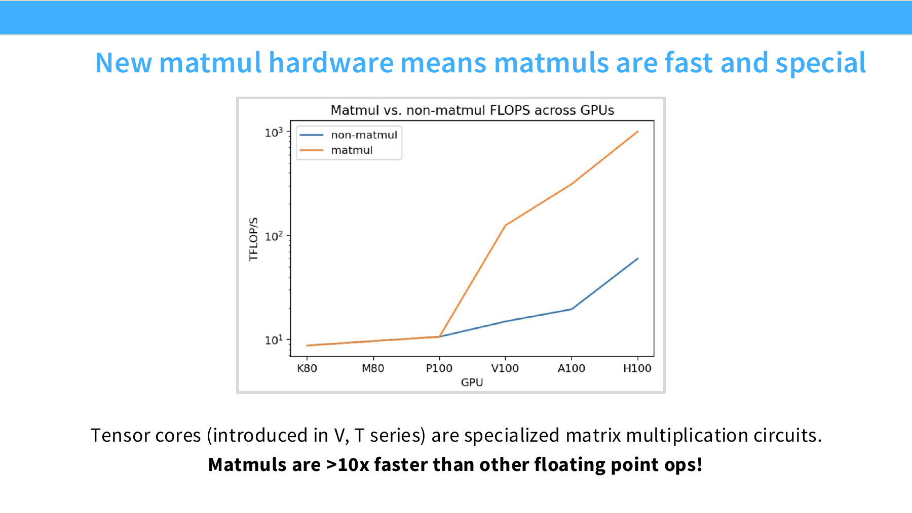

*图 5.5-1 不同 GPU 代际中的矩阵乘法吞吐*

图 5.5-1 展示了一个对 LLM 很关键的趋势：从 V100/Tensor Core 时代开始，矩阵乘法吞吐与普通浮点运算吞吐明显分离。原因是 GPU 厂商为矩阵乘法提供了专门硬件路径，Tensor Core 可以在低精度或混合精度下执行密集矩阵乘加。大模型架构长期偏向 matmul-heavy 结构，也与这条硬件路径有关。

### 5.5.2 计算与内存扩展不平衡

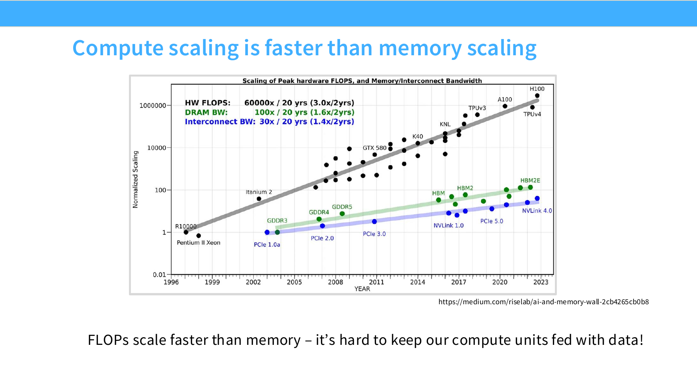

*图 5.5-2 计算速度扩展快于内存和互联扩展*

1980-2000年遵循**登纳德缩放定律**，即晶体管缩小，频率提升，功耗下降的趋势发展，但是**现状**是单线程性能**2000年后趋于平缓**，无法依靠频率提升。**现代扩展方式**是**并行扩展**（增加SM数量），从K20到H100，整数运算性能呈**超指数增长**（1-10万倍提升）。

但是其中的**核心矛盾**还没有解决---**内存扩展速度远低于计算扩展**。计算性能（灰线）是10万倍提升；内存带宽（绿线）大约100倍提升（GDDR-HBM2E）；互联带宽（蓝线）增长最缓慢。

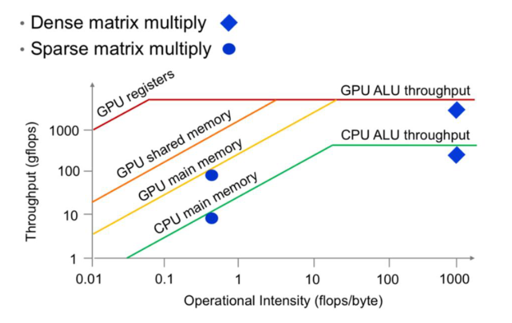

*图 5.5-3 roofline model*

这是一个屋顶线模型，横轴是**操作强度（Operational Intensity）**，表示计算与数据移动的比率。当操作强度高时，意味着计算设备在进行大量计算而数据移动相对较少；当操作强度低时，意味着数据移动占主导。纵轴是**吞吐量（Throughput）**，表示计算设备每秒可以完成的浮点运算次数。

不同颜色的线代表不同的内存结构：

1. **GPU registers（GPU寄存器，红线）**：提供最高的吞吐量，因为寄存器访问速度非常快，但容量有限。
2. **GPU shared memory（GPU共享内存，橙线）**：速度次之，适用于需要在多个线程间共享数据的场景。
3. **GPU main memory（GPU主内存，黄线）**：速度较慢，但容量更大，适用于存储大量数据。
4. **CPU main memory（CPU主内存，绿线）**：速度更慢，因为CPU内存访问速度通常低于GPU内存。

它们到达的屋顶（内存墙）

1. **GPU ALU throughput**：表示GPU的算术逻辑单元在理想情况下的最大吞吐量。
2. **CPU ALU throughput**：表示CPU的算术逻辑单元在理想情况下的最大吞吐量。

随着 **arithmetic intensity** 增加，kernel 可以把同一次数据搬运摊到更多 FLOPs 上，吞吐量会沿着带宽斜线升高；当计算单元已经被喂饱后，曲线进入平台区，继续增加每 byte 的计算量也无法超过硬件峰值。寄存器和 shared memory 的带宽更高，斜线更靠上；CPU main memory 或 GPU HBM 的带宽较低，对 memory-bound kernel 的限制更明显。

把 roofline 写成最简形式，就是：

$$
\text{attainable FLOPs/s} \le \min(\text{peak FLOPs/s},\ \text{arithmetic intensity}\times \text{memory bandwidth})
$$

其中 arithmetic intensity 是 FLOPs / bytes。逐元素 ReLU、GeLU 这类算子通常搬运一次数据只做少量计算，容易落在 memory-bound 区域；大矩阵乘法通过数据复用把每个 byte 对应的 FLOPs 拉高，更容易靠近 compute-bound 屋顶。

后面所有优化手段都可以放回这个框架里理解：fusion 减少中间读写，recomputation 用额外 FLOPs 换带宽，tiling 增加 shared memory 复用，FlashAttention 避免把完整注意力矩阵写回 HBM。

这也是性能优化主线持续回到 memory hierarchy 的原因：随着 compute scaling 快于 memory scaling，越来越多 kernel 会先被数据搬运限制。算法设计和 kernel 实现都要先问数据从哪里来、写回几次、能不能在 register、shared memory 或 L2 中复用。

Roofline 给出的训练判断很直接：低 arithmetic intensity 的算子先被内存带宽限制，高 arithmetic intensity 的矩阵乘更容易接近计算峰值。优化时要么减少 HBM 往返，例如 fusion 和 FlashAttention；要么提高单次搬运后的复用，例如 tiling 和 shared memory；要么用 recomputation 在可接受的 FLOPs 增量下换掉昂贵的 activation 读写。

## 5.6 性能优化技术

本节回答一个前置问题：当 kernel 受限于内存带宽而不是算力时，有哪些在不同层级上减少 HBM 往返的工程手段。具体要按六条线索推进——避免串行执行（control divergence）、低精度（low precision）、算子融合（operator fusion）、重计算（recomputation）、内存合并（memory coalescing）和分块（tiling）——每条都看它针对的瓶颈、收益机制，以及在什么条件下反而无效或负收益。读完后读者应能把任何一段 kernel 改进意见拆到这六条里归类，并理解 FlashAttention 是这套思路在 attention 上的集中体现。

> [!NOTE]
> **Per-kernel 算术强度速查（H100 dense BF16 口径）**：ReLU 等单指令逐元素算子 ≈0.25 FLOPs/byte（≈4 bytes/FLOP），落在 memory-bound 区域；GeLU（tanh 近似，约 20 FLOPs/element）≈5 FLOPs/byte，仍 memory-bound；Softmax（按 5MN 读 / 3MN 写 + 几次 reduction 估算）约 1-3 FLOPs/byte；matvec（`B=1`）≈1 FLOP/byte，仍 memory-bound；matmul（`B ≥ 295`）compute-bound（H100 roofline：约 989.5 TFLOP/s ÷ 3.35 TB/s ≈ 295 FLOPs/byte）。这条 [判定线](https://jax-ml.github.io/scaling-book/roofline/)决定了 kernel fusion / tiling 能否把执行从 memory-bound 推到 compute-bound。

### 5.6.1 避免串行执行

下面是一个简单的**分支预测**

```c
// 代码示例
if (x < 4) {
    A; // x < 4 执行
    B;
} else {
    X;  // x >= 4 执行
    Y;
}
Z; // 无论条件是否成立都会执行
```

GPU采用SIMT（单指令多线程）执行架构，**同一线程束（Warp）内的所有线程必须同步执行相同指令**（仅操作数据不同）。现代GPU中，一个Warp通常包含32个线程（NVIDIA）或64个线程（AMD）。

当 Warp 内的线程遇到条件分支时，若部分线程满足 `x < 4` 走 `if` 路径，另一部分满足 `x >= 4` 走 `else` 路径，便发生了**分支发散（Branch Divergence）**。

此时 GPU 采用**掩码屏蔽机制**串行化处理：先执行 `if` 分支，走 `else` 路径的线程被临时屏蔽；待 `if` 完成后，再执行 `else` 分支，此时 `if` 线程被屏蔽。两条路径的指令都会被执行，只是各自只有部分线程生效。这导致该 warp 的执行时间近似等于两条路径耗时之和，计算资源利用率下降。

因此，核心优化原则是：**避免同一线程束内的线程发散**，要尽量避免条件分支。若一个Warp内所有线程都走同一路径（如线程`x`均小于4），则分支开销几乎为零。此外，发散不仅延长执行时间，还会因为破坏内存合并性而降低带宽效率。


### 5.6.2 低精度（low precision）可以提升性能

**降低精度提升 GPU 速度**，依赖的是用更少比特换取更快的计算路径和更低的数据搬运量。这背后是硬件电路简化、存储数据量减少、专用加速单元三重优化叠加。最明显的是计算数据和权重等元素的比特数减少时，需要移动的比特量会大幅降低。即便仍从全局内存访问这些比特，带宽压力也会明显下降。

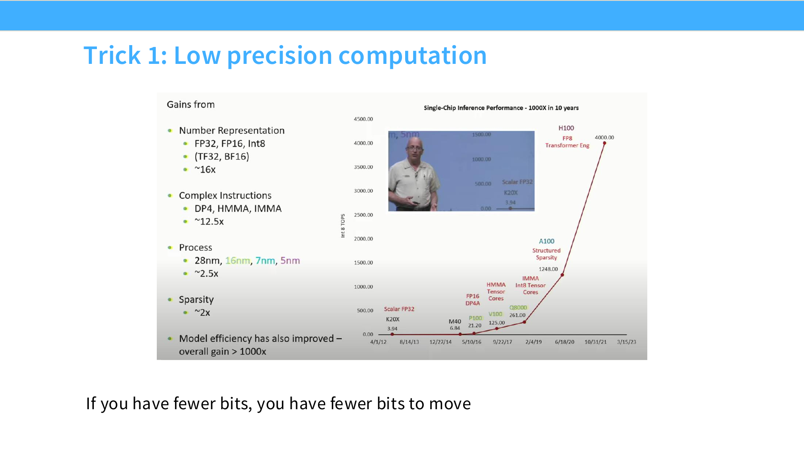

*图 5.6-1 低精度提升速度*

#### 常见的低精度格式

| 精度类型 | 位数 | 表示范围 | 典型场景 | Tensor Core 峰值加速（vs FP32 CUDA Core 19.5 TFLOP/s） |
|----------|------|----------|----------|----------|
| **FP32** | 32 位 | $3.4 \times 10^{38}$ | 传统训练，精度敏感 | 1×（FP32 CUDA Core 路径） |
| **TF32** | 19 位 | $3.4 \times 10^{38}$ | A100+ 默认格式 | **8×**（Tensor Core 156 TFLOP/s） |
| **FP16** | 16 位 | $6.5 \times 10^4$ | 通用训练/推理 | **16×**（Tensor Core 312 TFLOP/s） |
| **BF16** | 16 位 | $3.8 \times 10^{38}$ | AI 训练首选 | **16×**（Tensor Core 312 TFLOP/s） |
| **INT8** | 8 位 | 2⁸ ≈ 256 | 量化推理 | **32×**（Tensor Core 624 TOPS） |
| **INT4** | 4 位 | 2⁴ = 16 | 极致推理 | **64×**（Tensor Core 1,248 TOPS） |
| **FP8** | 8 位 | 动态范围 | Hopper/Blackwell | **约 30×**（H100 Tensor Core FP8 dense 约 1,979 TFLOP/s ÷ H100 FP32 67 TFLOP/s，H100 自身对照口径） |

> [!WARNING]
> 上表给出的「加速倍数」是 A100 上 Tensor Core dense 峰值除以 FP32 CUDA Core 19.5 TFLOP/s 的理论比值；实际训练可达加速取决于 kernel 实现、是否启用 FP32 master weight、累加器精度和数值稳定性。混合精度（FP32 master copy + FP16/BF16 计算）端到端常见 2-3× 加速，与峰值比 16× 之间留有显著差距。

---

Hopper 之后的低精度重点既包括“位数更少”，也包括更细粒度的缩放因子。FP8 常见格式包括 E4M3 和 E5M2：前者有效精度更高，后者动态范围更大。**H100/Hopper** 把 FP8 变成重要硬件路径。

到了 **Blackwell/B200**，**MXFP8** 这类带块级 scaling factor 的格式让同一张量的不同块可以使用不同缩放比例，减少异常值把整块量化范围拉大的问题。**MXFP4 / NVFP4** 则更激进，主要面向推理或特定训练路径，需要配合校准、缩放和高精度累加来控制误差。

MXFP8 这类格式不会让所有权重统一“一键切换”到同一种表示。转置权重、累加器和归一化附近的张量往往要分开处理，部分层也可能保留更高精度。

低精度选择需要同时权衡三件事：

- **存储与带宽**：位宽越小，权重、激活和 KV cache 搬运越便宜。
- **Tensor Core 路径**：只有硬件和 kernel 明确支持的格式，才能转化为吞吐收益。
- **数值稳定性**：归一化、softmax、router、loss scaling、累加器等位置通常要保留更高精度。

#### 低精度提速机制一：硬件因素

我们知道浮点运算器的复杂度与位宽平方成正比。也就是位数越大的浮点运算器的体积和复杂程度越大。FP16 的乘法器晶体管数量仅为 FP32 的**1/4**。代表着能在同样面积里放更多低精度的浮点运算器。而更多的计算单元意味着计算能力更强。

FP16 数据只占 FP32 一半的寄存器空间，同样 256 KB 寄存器文件可存**两倍数据**，同时 16 位数据总线带宽需求减半，同样带宽可传**两倍数据**，并且 FP16 乘法器延迟更低，频率可更高。

#### 低精度提速机制二：内存带宽节省（数据量减少 50%）

低精度首先减少的是数据体积。同样参数量的模型，FP32 权重每个参数 4 bytes，BF16/FP16 权重每个参数 2 bytes；activation、梯度和 KV cache 也会按 dtype 改变占用。

以 175B 参数为例，单看权重，FP32 约为 700 GB，BF16/FP16 约为 350 GB。真实训练还要加上梯度、optimizer states 和 activation，因此 dtype 只是资源账本中的一项，但它会直接影响显存容量和 HBM 带宽压力。

我们可以进行简单的**带宽计算**，假设 HBM2e 带宽 2 TB/s，那么 **FP32** 下每秒传输 500 亿个参数；**BF16** 下每秒传输 **1000 亿个参数**（翻倍）。

所以低精度下加载权重时间**成倍减小**；缓存命中率提升（同样缓存容量，存的数据更多），显存可容纳更大模型。同一参数量的 BF16 权重约为 FP32 的一半：175B 模型 BF16 权重约 350 GB，65B 模型 BF16 权重约 130 GB；后者超过单卡 80 GB HBM，需要张量并行 / 流水线并行 / 量化 / ZeRO-3 切分等手段才能跑得起来。

#### 低精度提速机制三：Tensor Core 专用加速

Tensor Core 是 NVIDIA 为低精度矩阵乘设计的**专用电路**，可以理解为围绕矩阵乘加重构的矩阵引擎。

**A100 Tensor Core 与 CUDA Core 性能对比（全卡 dense 峰值，NVIDIA A100 spec）**：

| 精度 | 峰值算力 | 相对 FP32 CUDA 核心 |
|------|----------|-------------------|
| FP32 CUDA Core（基准） | 19.5 TFLOP/s | 1× |
| TF32 Tensor Core | 156 TFLOP/s | **8×** |
| FP16 Tensor Core | 312 TFLOP/s | **16×** |
| BF16 Tensor Core | 312 TFLOP/s | **16×** |
| INT8 Tensor Core | 624 TOPS | **32×** |

（启用 2:4 结构化稀疏时 TF32 / FP16 / BF16 / INT8 各路径约翻倍；A100 FP64 Tensor Core 在 19.5 TFLOP/s dense 路径不参与稀疏加速。NVIDIA datasheet 在"with sparsity"列单独列出。）

加速的原理：

- **矩阵乘累加单元（Matrix Multiply-Accumulate, MMA）**：Ampere Tensor Core 以 warp 级 MMA 指令（如 fp16 输入下的 `mma.m16n8k16`）执行矩阵乘累加，Hopper 进一步扩展到 warpgroup 级 `wgmma` 指令；NVIDIA Tensor Core 并非 systolic array——systolic array 是 TPU MXU 的实现形态，二者在术语上不能互换。
- **输入 / 权重加载**：kernel 把矩阵元素显式送入 Tensor Core 的输入寄存器路径，由多个 warp 协同完成 GEMM。
- **累加器优化**：FP32 累加器保留精度，输入输出使用低精度格式。

#### 提速机制四：并行度提升（同样芯片面积，计算单元翻倍）

**芯片面积优化**，之前提到过精度越高的运算单元复杂度越大。按 GA100 整 die 826 mm²、平均分配到 6,912 个 FP32 CUDA 核心这一粗略估计，单个 FP32 核心约占 0.12 mm²；FP16 / INT8 路径的电路复杂度按位宽线性降低，相应单核心面积也按比例缩小，可在相同 die 上集成更多计算单元（NVIDIA 未公开 per-core 面积具体数字，0.1 / 0.05 / 0.025 mm² 仅为粗略量级参考）。

同时还有独特的**架构设计**。A100 的 SM 中，Tensor Core 复用寄存器文件；**FP32 模式**下 64 个 CUDA 核心活跃，每周期 64 次 FMA；**FP16 模式**下 64 个 CUDA 核心 + 4 个 Tensor Core 活跃，每周期 64 次 FMA + 1024 次矩阵运算。

在同样芯片面积下，低精度路径可以集成更多计算单元，从而实现更高吞吐量。

---

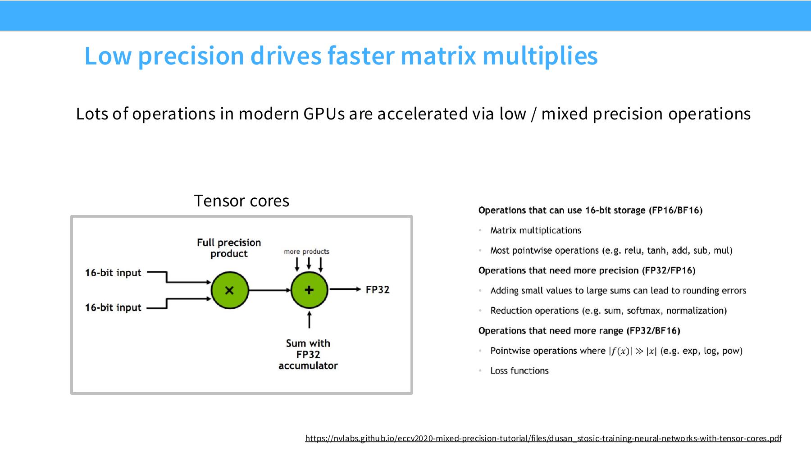

*图 5.6-2 Tensor Core 可进行的操作*

关键在于并非所有网络组件和训练算法**都适合低精度处理**。以矩阵乘法为例，混合精度矩阵乘法通常将输入设为 16 位低精度，但累加器保持更高精度，因为中间累加需要精度保障。Tensor Core 最终输出可按需降回 16 位。

输入数据可采用 16 位存储，但累加等操作通常需要更高精度；某些运算（如指数函数）需要更大动态范围，可能更适合 BF16 格式。要确保低精度训练稳定，需要大量精细的工程优化。若能实现，当内存成为瓶颈时，从 32 位转为 16 位可直接改善吞吐。

> [!WARNING]
> **六条技巧的负面条件**：低精度、fusion、recomputation、coalescing、tiling、控制发散都不是「永远更快的银弹」。
> - **低精度**：当 kernel 已是 compute-bound 且 dtype 已经被硬件路径吃满时，再切更低精度不会带来吞吐收益，反而可能因 loss scaling / 累加器精度不足引入数值漂移。
> - **算子融合**：当算子本身已经接近 Tensor Core 峰值，再 fuse 进去只会把瓶颈从内存搬到算力上；fusion 也不能跨 collective / control flow。
> - **重计算**：当 activation 本身不大或 kernel 主要受算力而非带宽限制时，recomputation 只会增加 FLOPs 而不减少 HBM 往返，反而变慢。
> - **内存合并**：当数据布局天然就是 row-major 且 block 大小对齐 cache line 时，coalescing 已经发生，进一步重排索引不会带来收益，只会增加代码复杂度。
> - **分块（tiling）**：tile size 选得过大导致寄存器溢出到 local memory（即 HBM 路径），或过小导致算力空转、kernel launch / 调度开销占比过大时，tiling 会反向拖慢执行。
> - **避免控制发散**：当分支条件在 warp 内高度一致时，发散开销本就接近零；硬把分支压平成 predication / 查表只会让代码更难维护而不会变快。
>
> 每条技巧都先要回答「当前 kernel 受 memory-bound 还是 compute-bound 限制」，再决定要不要上 —— roofline 与操作强度这条主线的核心判断正是「FLOPs 不是 runtime」。

### 5.6.3 算子融合（Operator Fusion）

算子融合通过**减少中间结果内存读写和 kernel launch 开销**提升性能。实际收益取决于算子形态、张量大小、编译器和硬件，不应写成固定倍数。

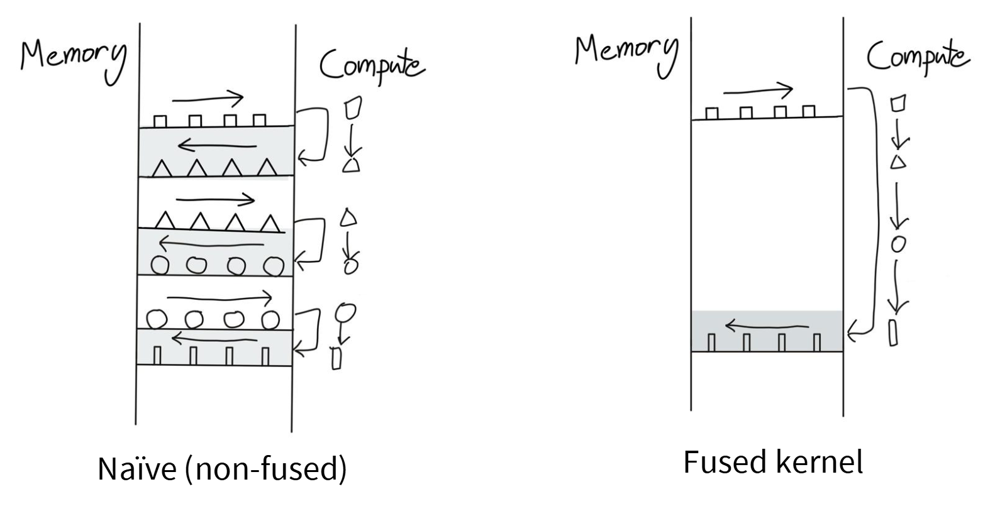

*图 5.6-3 算子融合演示*

图 5.6-3 的左侧路径中，每个小算子都会把中间结果写回 global memory，下一个算子再读回来；如果算子本身只是简单逐元素计算，这些 HBM 往返和 kernel launch 往往比数学运算更贵。

右侧路径把一串连续操作放进同一个 CUDA kernel：读入一次，在片上连续完成多个变换，最后只写回最终结果。kernel fusion 的收益来自减少中间结果落到 HBM 的次数，而数学表达式本身通常没有变化。

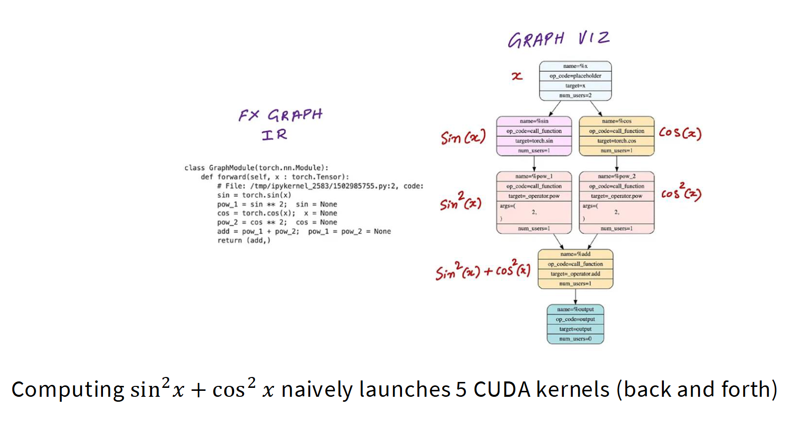

*图 5.6-4 算子融合示例*

假设我们编写了一个神经网络模块，输入 $x$ 后同时输出 $\sin^2 x$ 和 $\cos^2 x$ 。代码很简单，但在 PyTorch 中运行时会生成这样的计算图：首先载入 $x$ ，启动 CUDA 核函数计算 $\sin x$ ，再启动另一个计算 $\cos x$ 。

接着它会计算 $\sin^2 x$ 和 $\cos^2 x$ ，最后计算 $\sin^2 x + \cos^2 x$ 。为了完成这些运算，数据需要在内存和计算单元间反复传输，对应图 5.6-4 左侧的低效模式。

这些逐元素运算之间没有复杂的数据依赖，可以融合进同一个 CUDA kernel：读入 $x$ 后在片上连续完成多个逐元素操作，最后再把结果写回 global memory。

kernel fusion 把多个连续操作合并进一个 CUDA kernel，减少中间结果写回 global memory 的次数。


### 5.6.4 重计算（Recomputation）

**重计算的核心思想是通过增加计算量来避免内存访问。**

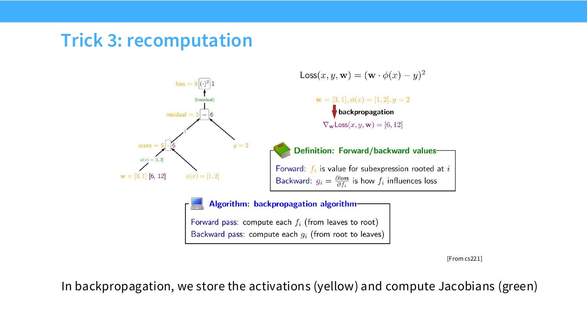

*图 5.6-5 反向传播中的 activation 保存*

前向传播会产生中间 activation，反向传播需要这些 activation 来计算局部梯度并继续传递上游梯度。默认做法是把前向产生的 activation 存下来，反向时再读出使用。系统视角下，这会带来大量 global memory 读写。

如果每个中间结果都保存下来，反向传播会产生大量 activation 读写。重计算的作用就是把其中一部分保存操作改成“反向时重新算一遍”。

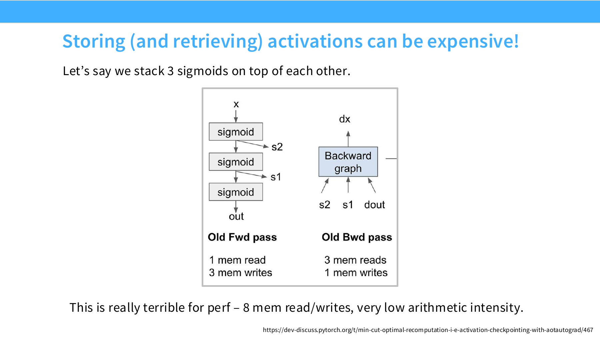

*图 5.6-6 三个 sigmoid 函数堆叠*

假设把三个 $\mathrm{sigmoid}$ 函数串起来。普通前向会读取一次 $x$ ，并写出中间 activation `S1`、`S2` 和最终输出；反向再读取这些 activation 和上游梯度，最后写出 $dx$ 。这个小例子说明：即使数学计算很少，中间 activation 的保存和读取也会让 arithmetic intensity 很低。

**重计算的核心思想**：不把所有中间 activation 都写回 global memory，而是在反向传播需要时从保留的输入或 checkpoint 重新前向计算一遍。这样做增加了 FLOPs，但减少了 activation 的读写压力。

总的来说，这里的重计算不存储 $S_1$ 和 $S_2$，而是在反向传播中重新计算。它是在计算时间成本与内存读写成本之间做权衡；当计算成本小于读写成本时，重计算往往更划算。

用这个例子的账本：重计算可以把内存访问从 8 次降到 5 次，代价是反向时重新计算这三个 $\mathrm{sigmoid}$ 。当 kernel 主要受 memory bandwidth 限制时，用额外 compute 换更少的 global memory 访问往往更划算。

### 5.6.5 内存合并（Memory Coalescing）

GPU 的 global memory / DRAM 容量大，但离 SM 远，访问代价高。硬件会以 cache line 或 burst 的方式批量取回连续数据，因此访问模式是否连续会直接影响有效带宽。

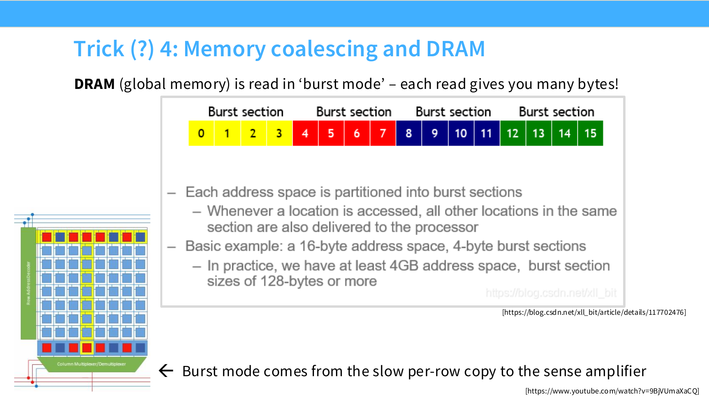

*图 5.6-7 DRAM burst mode*

其中一项 DRAM 硬件优化是：读取某个地址时，硬件通常会取回一段包含目标地址的连续数据，目标元素只是其中一部分。这个现象可以粗略理解为 burst mode。若一个 warp 的线程正好需要这段连续数据，单次事务就能服务多个线程。

memory coalescing 关心的是同一个 warp 在同一条 load 指令中访问的地址是否尽量连续。连续访问可以合并为更少的 memory transaction；分散访问会浪费带宽，甚至为少量有效数据搬回整段 cache line。

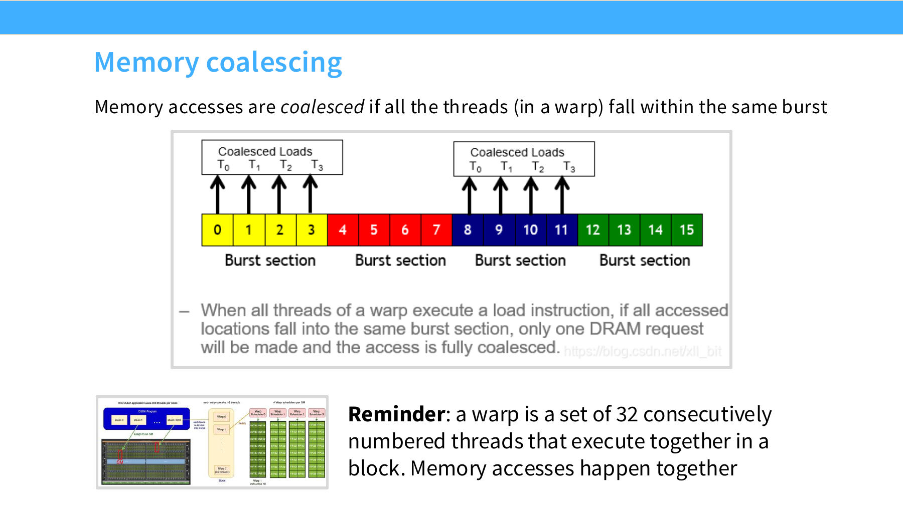

*图 5.6-8 coalesced memory access*

当同一个 warp 中的线程访问同一段连续内存时，硬件可以把这些请求合并。coalescing 是 warp 级现象，判断点是“同一时刻这一排线程要读的地址是否挨在一起”。

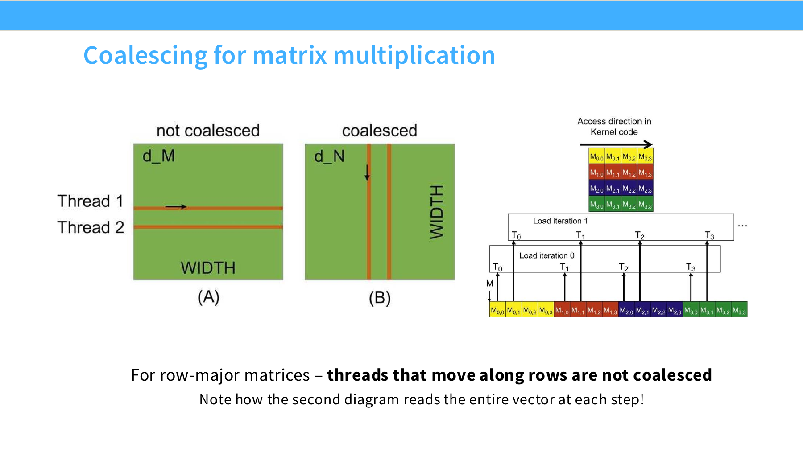

*图 5.6-9 矩阵乘法中的 coalescing*

以矩阵乘法为例，memory coalescing 关心的是**同一个 warp 在同一条 load 指令里访问的地址是否连续**。图 5.6-8 先给出基本模式：多个线程落在同一段 burst/cache line 中，硬件就能合并读取。图 5.6-9 再把这个判断放回 row-major 矩阵乘法：线程编号、矩阵布局和每一步访问的下标共同决定这次 load 是否 coalesced。

图 5.6-9 左侧的 not coalesced 情况，可以理解为多个线程各自沿着一行向右走。对单个线程来说，它访问的是连续元素；但在同一个 load iteration 里，Thread 1、Thread 2、Thread 3 等线程落在不同 row 上，线性地址之间隔着整行宽度，因此同一 warp 的访问并不连续。

图 5.6-9 中间的 coalesced 情况则把线程映射换了一个方向：同一 load iteration 中的多个线程落在相邻地址上，硬件能用更少 memory transaction 取回它们需要的数据。右侧把这种访问展开成 row-major 线性内存顺序，展示每次 load iteration 读到的地址集合。

所以判断 coalescing 时要看“同一时刻、同一条指令、同一 warp 的地址集合”。很多 CUDA kernel 的维度排列、转置、padding 和 tile layout，都是为了让关键加载点上的活跃线程尽可能落到连续地址上。一旦线程映射和内存布局不匹配，实际带宽会显著低于理论带宽。

这种内存访问顺序的差异属于非常底层的优化细节，但在 GPU 程序中却至关重要；一旦遍历顺序设计不当，性能往往会出现数量级的下降。

### 5.6.6 Tiling

**Tiling 的核心思想是把会被重复使用的数据块先搬到 shared memory，再在 block 内反复复用，从而减少 global memory 访问。**

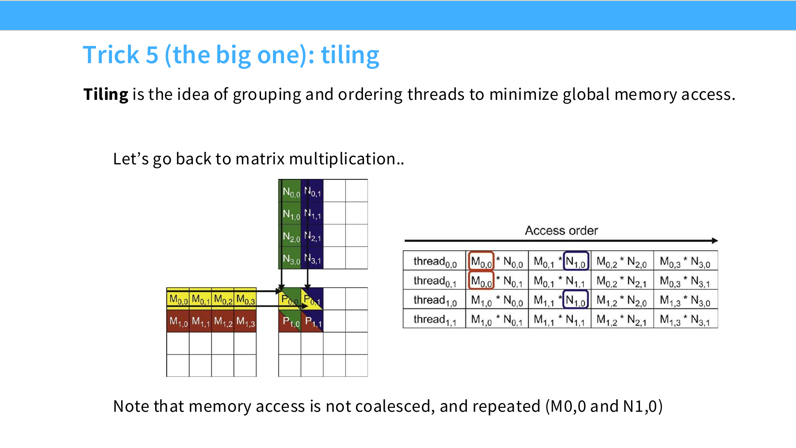

*图 5.6-10 矩阵乘法分块*

用矩阵乘法解释最直观。朴素实现中，每个输出元素都要沿 $K$ 维读取一整行 $M$ 和一整列 $N$ ，许多输入元素会被不同输出反复从 global memory 读取。

这里的问题有两类：一是部分访问不容易 coalesced，二是同一个输入元素会被重复读取。例如 $M_{0,0}$ 和 $N_{1,0}$ 都可能被多个输出位置反复使用。若每次都回 global memory 取，带宽压力会很高。

问题在于能否避免过多的全局内存读写，理想方案是用一段时间将数据块从全局内存加载到高速的共享内存，在共享内存中完成大量计算，最后再处理下一数据块。这样能最小化全局内存访问。

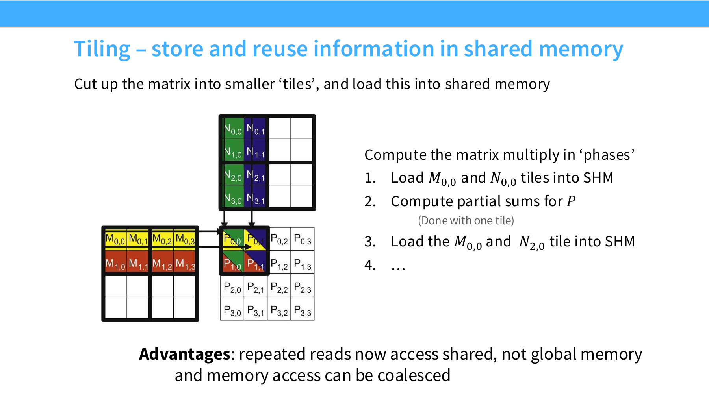

*图 5.6-11 矩阵乘法 tiling 执行过程*

在 tiled matmul 中，kernel 会把 $M$ 和 $N$ 切成小 tile，例如 $2 \times 2$ 子矩阵。一个 thread block 先把当前需要的 $M$ tile 和 $N$ tile 从 global memory 搬到 shared memory，完成一段 partial sum，再移动到下一组 tile。这样，同一个 tile 可以在 shared memory 中被多次读取，避免每次乘加都回 HBM。


*图 5.6-12 GEMM 分块示意*

另一个优势是 tile 让访存更容易被组织成连续加载：从 global memory 搬入 shared memory 时尽量 coalesced，在 shared memory 中再按计算需要反复访问。

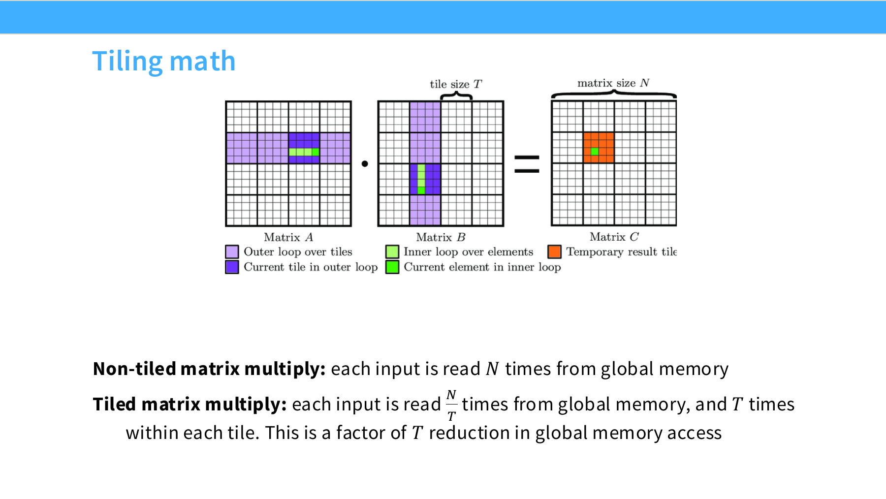

*图 5.6-13 矩阵乘法 tiling 的内存访问账本*

可以用一个粗略账本理解。对 $N \times N$ 矩阵乘法，非 tiled 实现中，每个输入元素可能要从 global memory 读取 $N$ 次。若 tile size 是 $T$ ，同一个输入元素从 global memory 读取次数可降到约 $N/T$ 次；tile 内部的重复访问转移到 shared memory 中完成。矩阵乘法 FLOPs 没有减少，减少的是昂贵的 global memory 访问。

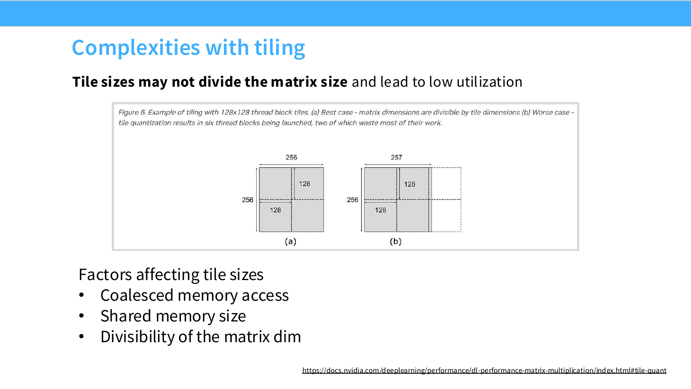

*图 5.6-14 tile size 与矩阵维度整除性*

tile size 会影响实际性能。若矩阵维度刚好能被 tile size 整除，block 分配比较均匀；若只多出少量元素，可能需要额外 tile 才能覆盖边界，部分 thread block 会做很少的有效计算。这就是矩阵维度看似只变了一点、吞吐却突然下降的原因之一。

tile size 需要同时满足几类约束：放得进 shared memory 和寄存器；让 thread block 数量足够均匀，避免部分 SM 只处理很少有效元素；让从 global memory 搬入 tile 的访问尽量 coalesced。矩阵维度、padding 和 tile size 之间只差几个元素时，实际吞吐也可能明显变化。

图 5.6-15 展示了 tile 与 burst/cache line 对齐的影响。如果一行数据因为矩阵宽度多出一个元素而跨过更多内存段，同样的逻辑 tile 就可能触发更多 memory transaction。工程上常用 padding 或调整布局来让关键访问重新对齐。这个细节不改变矩阵乘法的 FLOPs，却会改变实际 HBM 访问量。

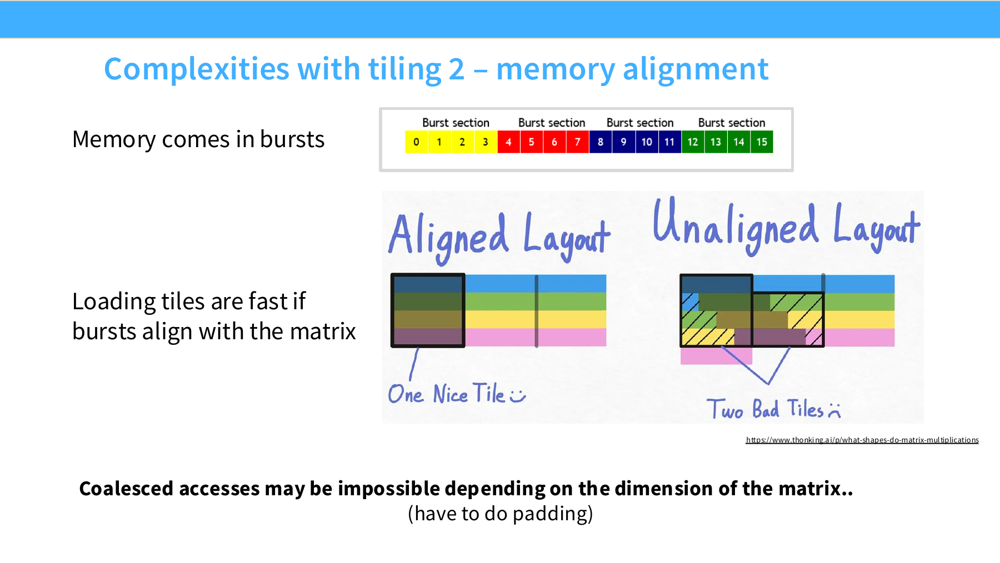

*图 5.6-15 memory alignment 对 tiling 的影响*

图 5.6-15 左侧 aligned layout 的 tile 边界和 burst/cache line 边界基本对齐，一次 tile 读取可以用较少事务完成。右侧 unaligned layout 中，每一行相对 burst 边界错开，同样大小的逻辑 tile 可能横跨更多内存段，因此需要额外 memory transaction。padding 通过重新对齐 layout 来匹配硬件实际搬运数据的粒度，矩阵乘法 FLOPs 本身没有变化。

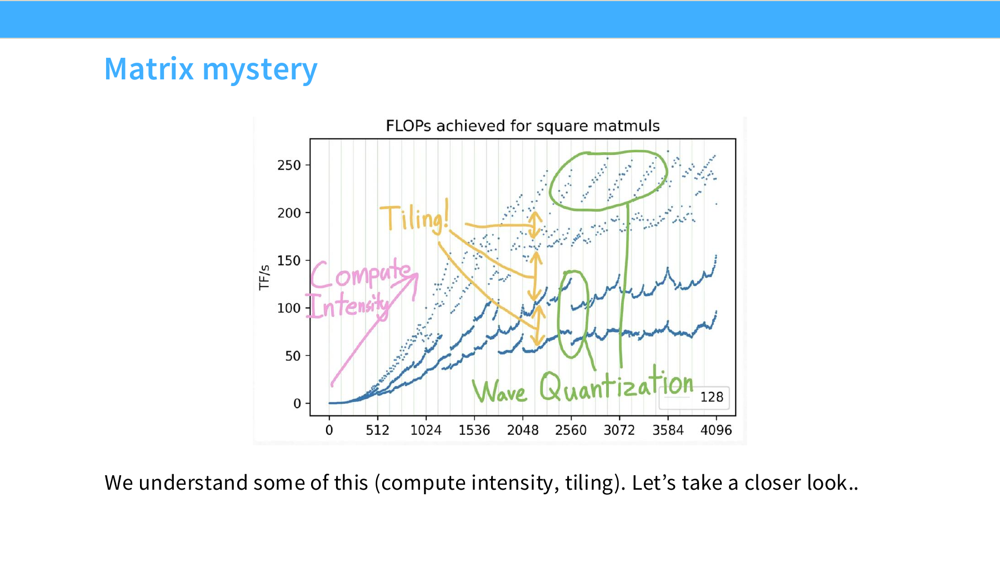

*图 5.6-16 矩阵乘法吞吐中的尺寸异常*

图 5.6-16 把 tiling 的影响放回实际 benchmark。随着矩阵维度变大，arithmetic intensity 通常会提高，整体趋势应当上升；但曲线中仍有尖锐的周期性下跌。下跌点往往来自矩阵维度、tile size、内存对齐和 SM 调度波次共同改变有效硬件利用率，算法复杂度本身没有突然变化。


*图 5.6-17 wave quantization 造成的 SM 空闲*

图 5.6-17 给出一个具体的 wave quantization 账本。若 tile size 是 $256 \times 128$ ，矩阵维度从 1792 增加到 1793，会让 tile 数从 $7 \times 14 = 98$ 变成 $8 \times 15 = 120$ 。

在有 108 个 SM 的 A100 上，98 个 tile 可以一波跑完；120 个 tile 需要第二波处理剩下 12 个 tile，绝大多数 SM 在第二波空闲。维度只增加 1，却可能触发整波调度开销，这就是 padding、tile size 和矩阵形状会影响吞吐的原因。

---

## 5.7 FlashAttention

本节回答一个前置问题：标准 attention 在序列长度 $N$ 时产生的 $N \times N$ 中间矩阵如何被「分块 + online softmax」搬到片上 SRAM 完成，从而避免完整 attention matrix 的 HBM 往返。具体要按三段看：V1 的核心 IO 思路、online softmax 的数学等价性、V2 在 V1 基础上把串行依赖改写成空间并行、V3 在 Hopper 上用 WGMMA 异步流水线和 FP8 把 Tensor Core 喂到接近峰值。读完后读者应能把 FlashAttention 的演进放回 §5.6 的六条优化线索，并理解每代分别解决了哪一类「算力空转」的根因。

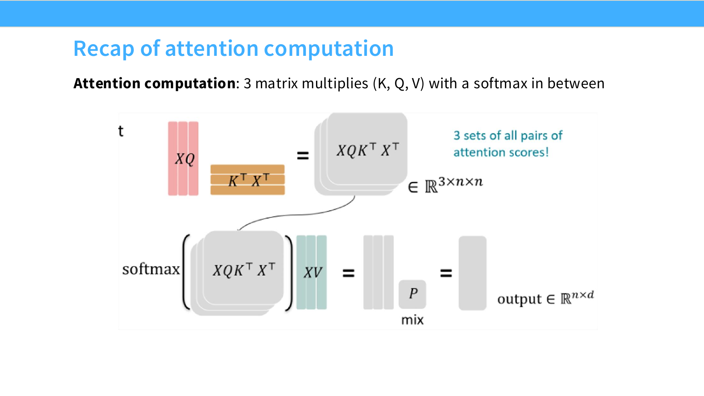

*图 5.7-1 FlashAttention V1 原理图*

标准 attention 在序列长度为 $N$ 时需要计算 $N \times N$ 的 score 矩阵，FLOPs 和中间结果规模都是二次增长。系统问题在于：这些中间矩阵是否需要完整写回 HBM，再从 HBM 读回来？

FlashAttention 的 attention 渐进 FLOPs 仍然是 $O(N^2)$ 。它改变的是数据移动方式：用 tiling 把 $QK^{\mathrm{T}}$ 、online softmax 和与 $V$ 的累积计算放到片上 SRAM / shared memory 路径里完成。

这样可以避免显式 materialize 完整 attention matrix 并写回 HBM，减少 HBM 访问，提高数据复用，让 attention 更接近高 arithmetic intensity 的 kernel。

> [!NOTE]
> FlashAttention 在数学上与标准 attention 等价（除浮点误差外），属于精确重排而非近似计算。可以运行 [flash_attention.ipynb](examples/flash_attention.ipynb)，对比 FlashAttention 和标准 attention 的计算结果差异。


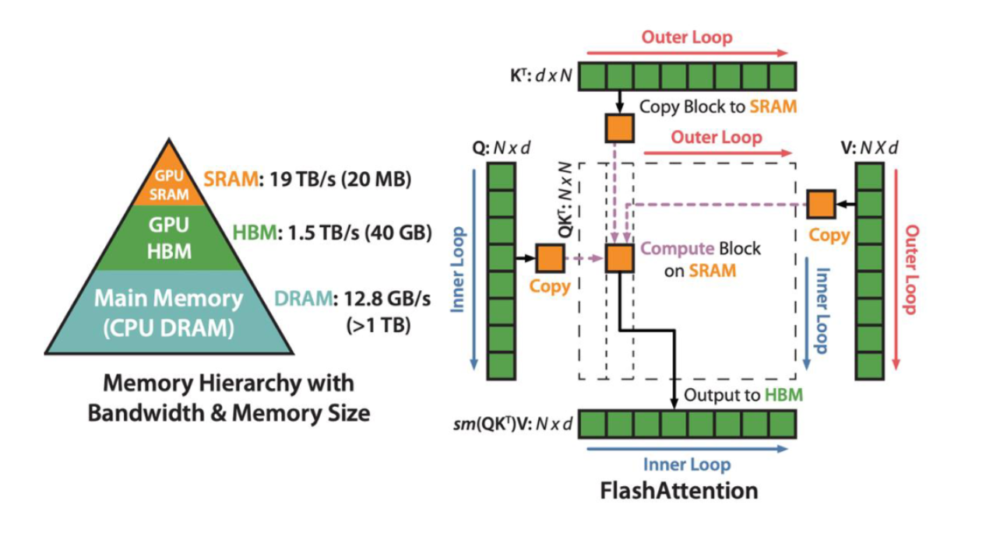

*图 5.7-2 FlashAttention 的运行时间和显存占用*

图 5.7-2 同时比较 wall time 和 memory footprint。FlashAttention 的关键优势是显著降低 attention 中间结果的显存占用；在长序列场景下，这通常比减少少量非 matmul FLOPs 更重要。


### 5.7.1 FlashAttention V1 计算原理

其中 $Q, K, V \in \mathbb{R}^{N \times d}$ ， $N$ 行表示 token， $d$ 列表示 token 的特征维度；索引 $i \in \{1,\dots,N\}$ 、 $j \in \{1,\dots,d\}$ 。下面展示的是带 causal mask 的底层计算过程：

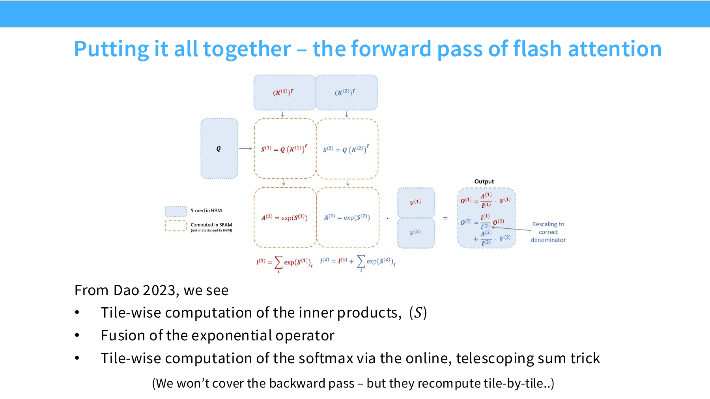

*图 5.7-3 FlashAttention 前向传播*

```text
// 初始化
m_i = -inf
l_i = 0
O_i = 0
for each Q block i:
    load Q_i
    m_i = -inf
    l_i = 0
    O_i = 0

    for each K,V block j:
        if causal and j > i:
            continue

        load K_j, V_j
        S_{ij} = Q_i @ K_j^T      // (B_r, B_c)

        if causal and i == j:
            apply mask to S_{ij}

        // softmax 累加 -> 归约
        update m_i, l_i, O_i(online softmax)

    write O_i to HBM
```


> [!NOTE]
> FlashAttention V1 要分块，是因为直接计算 $QK^T$ 会生成 $N \times N$ 中间矩阵，长序列下无法一次性放入高速缓存，并会频繁访问 HBM。分块计算让 kernel 在 SRAM 中处理可容纳的小块，同时进行 online softmax 累加，从而减少全局内存访问并保持数值稳定。


具体举例：

- 假设 $Q$ 、 $K$ 的形状为 $1024 \times 512$ 。
- 将 $Q$ 按行分成 8 块，每块大小 $128 \times 512$ ；将 $K^{\mathrm{T}}$ 按列分成 8 块，每块大小 $512 \times 128$ 。
- 每次只在 SRAM 内计算一个 $128 \times 128$ 子矩阵，并用 online softmax 累加结果，直到完成整个 $QK^{\mathrm{T}}$ 和 $QK^{\mathrm{T}}V$ 的计算。

### 5.7.2 online softmax

`online softmax` 与标准 softmax 在数学上等价，二者都做全局归一化。区别在于 `online softmax` 采用 streaming 计算：遍历 tile 时动态维护当前最大值和归一化因子，不需要先保存完整 score 矩阵。这个性质正好让 softmax 可以嵌入 FlashAttention 的分块计算。

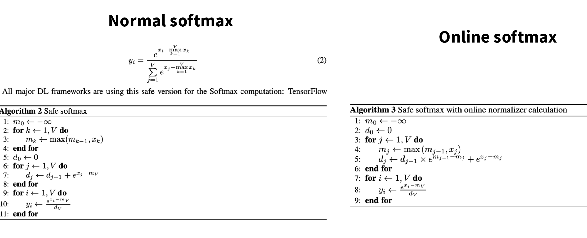

*图 5.7-4 标准 softmax 与 online softmax*

online softmax 在 FlashAttention V1 中的更新过程可以写成：

```text
m_{ij} = rowmax(S_{ij})
m_new = max(m_i, m_{ij})

l_i = exp(m_i - m_new) * l_i
  + sum(exp(S_ij - m_new), axis=1)

O_i = exp(m_i - m_new) * O_i
  + exp(S_{ij} - m_new) @ V_j

m_i = m_new
O_i = O_i / l_i
```

因此，online softmax 是 FlashAttention V1 在不显式构造完整 attention matrix 的情况下仍保持精确 attention 语义的关键组件。

---

### 5.7.3 FlashAttention V2：面向 Tensor Core 的并行优化

FlashAttention V1 通过分块和在线 softmax 解决了注意力计算的显存瓶颈，但其循环顺序和并行策略并未充分发挥现代 GPU（尤其是 A100 及后续架构）中矩阵乘法（Tensor Core）的峰值吞吐能力。V2 在保持 V1 核心思想的基础上，对算法进行了深度重构，实现了**更高效的并行**与**更低的非矩阵乘法开销**。

#### FlashAttention V2 的核心改进：分块并行化处理 Q

在 FlashAttention V1 中，计算采用**外循环遍历 $Q$ 块、内循环遍历 $K, V$ 块**的方式。对于每个 $Q_i$ ，算法依次加载所有 $K_j, V_j$ 块，并通过 online softmax 逐步累积注意力结果。这避免了显式构造完整 attention matrix，也减少了 HBM 访问，但跨 tile 的 max、exp、rescale 会穿插在 matmul 之间，形成较强的数据依赖链。

FlashAttention V2 保留了单个线程块视角下 $Q$ 外层、 $K, V$ 内层的基本数据加载顺序，优化重点在于重构并行策略与归约方式，以缓解上述`数据依赖链`带来的性能问题：

- 将原先“一个 $Q_i$ 对应一个线程块串行扫描所有 $K, V$ ”的方式，改为对同一 $Q_i$ 在 $K, V$ 维度进行切分，并由多个线程块并行处理；
- 保留 online softmax 的数学形式，但通过**分块并行计算 + 跨线程块归约**，把原本沿 $K, V$ 维度的串行依赖尽量转化为并行计算和末端归约。


```text
for each Q block i in parallel:              // V2 的核心：Q 维度并行
    load Q_i into SRAM

    // 初始化
    m_i = -inf
    l_i = 0
    O_i = 0

    for each K,V block j:
        load K_j, V_j into SRAM

        S_ij = Q_i @ K_j^T                  // Tensor Core
        m_ij = rowmax(S_ij)
        m_new = max(m_i, m_ij)

        // 重标定旧累积
        alpha = exp(m_i - m_new)
        P_ij = exp(S_ij - m_new[:, None])
        l_ij = rowsum(P_ij)

        // 更新归一化因子
        l_new = alpha * l_i + l_ij

        // 更新输出，online softmax 累加
        O_i = (alpha[:, None] * O_i) + (P_ij @ V_j)
        m_i = m_new
        l_i = l_new

    // 末端归约
    O_i = O_i / l_i[:, None]
    write O_i back to HBM
```

**V1 -> V2 性能提升的原因：**

- **降低非矩阵计算对执行的干扰**：在 V1 中，每处理一个 $K, V$ 块，都需要对当前 $Q_i$ 的统计量（ $m_i, l_i$ ）进行在线更新，并对累积输出执行重缩放操作。这些标量、向量运算会频繁穿插在矩阵乘法之间，形成计算数据依赖链。

- **把串行依赖转成并行工作**：V2 的 online softmax 数学操作仍然存在，量级仍接近 $T_q \times T_{\text{kv}}$ 。收益来自把原本沿 $K,V$ 维度的串行依赖转化为并行计算和末端归约，减少非 matmul 操作对执行调度的阻塞。

- **提升 Tensor Core 利用率**： $Q_i K_j^{\mathrm{T}}$ 和 $P_{ij} V_j$ 本身始终是矩阵乘法。V1 中 online softmax 的逐块依赖会让 matmul 与标量更新交替执行；V2 通过增加并行线程块，让更多 matmul 可以在不同 SM 上同时进行。

> [!NOTE]
> **SM 的整体占用率并不等同于实际计算单元利用率（utilization）**。即使线程块已充分填满 SM，如果数据加载与计算之间存在同步等待，Tensor Core 等执行单元仍可能空闲。FlashAttention V3 正是在这一背景下通过异步执行与流水线机制提升计算和数据传输的重叠程度。

> [!NOTE]
> V1 到 V2 的关键变化是把 online softmax 的时间串行依赖改写成更容易并行的空间划分，FLOPs 总量并没有成为主要变化点。

#### 分块大小与硬件适配

V2 对分块大小进行了精细调整，以匹配 GPU 的 SRAM 容量和寄存器资源。以 A100 为例，每个 SM 拥有 192 KB shared memory，V2 选择 $B_r$（$Q$ 块行数）和 $B_c$（$K, V$ 块行数）时，需要同时考虑 $Q_i$、$K_j$、$V_j$、中间统计量、寄存器压力和 Tensor Core tile 形状。

**性能表现**

- **速度提升**：A100 80GB SXM 上，对序列长度 512-16k 的 BF16 attention，V2 相对 V1 平均加速约 **2 倍**（范围 1.7-3.0×），相对 Triton 实现的 FlashAttention 加速 **1.3-2.5 倍**，相对 PyTorch 标准 attention 实现最高 **10 倍**加速（[FlashAttention-2 论文](https://arxiv.org/abs/2307.08691)）。
- **吞吐峰值**：A100 上 V2 最高达约 **230 TFLOPs/s**（约为 BF16 Tensor Core dense 峰值 312 TFLOPs/s 的 73%，论文给出 50-73% 区间）；H100 上 V2 可达约 **335 TFLOPs/s**（[Stanford Hazy Research blog](https://hazyresearch.stanford.edu/blog/2023-07-17-flash2)）。
- **端到端训练**：在 A100 上跑 GPT 风格训练，V2 达到约 **225 TFLOPs/s/GPU**（MFU ~72%），相对未优化的 PyTorch attention 路径约 2.8×，相对 V1 约 1.3×。
- **显存占用**：与 V1 保持一致，仍为 $O(N \cdot d)$ ，但支持的最大序列长度因计算效率提升而有所扩展（FA2 README 给出 A100 80GB 上 512 至 16k 的基准范围；具体上限取决于 batch、head dim 与模型规模）。
- **硬件适应性**：V2 的优化策略对 Ampere 及后续架构（如 H100）同样有效，为后续版本（V3）奠定了高效并行的基础。

FlashAttention V2 通过提升序列维度的并行度并优化计算调度，在保持 V1 IO-aware 特性的前提下提高 Tensor Core 利用率。这一代优化适合放在 **Ampere/A100 作为基线、Hopper/H100 仍然受益** 的语境里理解：核心机制是 shared memory、tile 布局和更高的 matmul 并行度；Hopper 之后的异步 WGMMA 能力属于 V3 关注的问题。

---

### 5.7.4 FlashAttention V3：异步与低精度优化

FlashAttention V3 面向 Hopper/H100 的新硬件能力继续优化 attention kernel，包括异步执行模型、WGMMA（Warpgroup Matrix Multiply-Accumulate）指令和 FP8 路径。它仍然沿着同一条主线前进：减少等待，让数据搬运和 Tensor Core 计算尽量重叠。

按硬件语境读，**V2 更接近 Ampere/A100 时代的并行调度优化，V3 更接近 Hopper/H100 时代的异步执行与低精度优化；Blackwell/B200 则是在这条路线之后继续放大带宽、缓存和低精度能力，不等同于 FlashAttention V3 本身**。


#### FlashAttention V3 的核心改进：异步 WGMMA 流水线

FlashAttention V3 继承 V2 的并行与归约框架，并在底层执行机制上引入生产者-消费者流水线，让数据加载和矩阵乘法更充分地重叠。

其核心思想是利用 Hopper 架构中的异步指令（如 TMA 数据搬运与 WGMMA 矩阵乘法），实现：

- 数据加载（global memory -> shared memory）与 Tensor Core 计算解耦；
- 跨 warp group 做流水线执行，在计算一个 block 的同时预取下一个 block 的数据。

这样可以减少因等待数据导致的 SM 空闲周期，使执行更接近持续计算状态。

```text
// 初始化 double buffer
buffer_K[2], buffer_V[2]

for each Q block i:
    load Q_i

    async_load(buffer_K[0], buffer_V[0])

    for j in range(num_blocks):

        curr = j % 2
        next = (j + 1) % 2

        // 生产者，提前加载下一块
        if j + 1 < num_blocks:
            async_load(buffer_K[next], buffer_V[next])

        // 消费者，使用当前 buffer 计算
        S_ij = wgmma(Q_i, buffer_K[curr])

        update m_i, l_i   // softmax reduce

        O_i += wgmma(P_ij, buffer_V[curr])

        // 只在必要时同步，避免 stall
        wait_for(buffer_K[next])

    write O_i
```

**WGMMA（Warpgroup Matrix Multiply-Accumulate）** 是 H100 引入的矩阵乘指令族，以 warpgroup 为执行粒度。V3 利用这类异步能力把 $Q_iK_j^{\mathrm{T}}$ 和 $P_{ij}V_j$ 的矩阵乘法嵌入流水线：一部分 warp group 负责准备数据，另一部分负责矩阵乘。这样做的目标是减少 Tensor Core 等待数据的时间，attention 的数学定义保持不变。


#### H100 对 FP8 的低精度支持和混合精度

H100 的第四代 Tensor Core 在 **FP8 精度下的理论吞吐量是 FP16 的两倍**（以 [NVIDIA H100 spec](https://www.nvidia.com/en-us/data-center/h100/)：dense BF16/FP16 约 989.5 TFLOP/s、dense FP8 约 1,979 TFLOP/s；启用结构化稀疏后 BF16/FP16 1,979 TFLOP/s、FP8 3,958 TFLOP/s——dense 与 sparse 都需要明确说明）。V3 原生支持 FP8 输入，但在注意力计算中必须解决**数值稳定性**问题，因为 softmax 对精度敏感。

因此 V3 采用混合精度策略来同时利用低精度吞吐和高精度累加：

矩阵乘法 $QK^T$ 使用 FP8 执行，充分利用 Tensor Core 的高吞吐；**matmul 累加器**保持在 FP32 精度，避免 FP8 累加时的精度损失。**Softmax 中的中间统计量**（ $m_i, l_i$ 与中间指数值）保留在 FP32，保证指数和归一化的数值稳定性（softmax 中的指数和除法极易在低精度下溢出）。softmax 在 FP32 下计算完成后，$P$ 需要**按块（per-block）requant 回 FP8**才能进入下一个 WGMMA，因此第二次矩阵乘 $PV$ 仍是 FP8 输入 + FP32 累加；这一 requant 与 softmax 融合在同一 pass 里，避免额外访存。最终输出 $O$ 在写回 HBM 时按下一层精度选择 BF16 或 FP8。

此外，V3 实现了 **动态缩放因子** 管理。由于 FP8 的表示范围有限（E4M3 约 -448 到 448，E5M2 约 -57344 到 57344），在计算 $QK^T$ 前需要根据输入范围确定缩放因子，防止溢出。V3 按块（tile）动态计算缩放因子，并在流水线中传递，确保 FP8 计算的精度与 FP16 相当。

#### 块布局与寄存器优化

H100 的每个 SM 拥有 256 KB shared memory（比 A100 的 192 KB 更大），寄存器和异步执行能力也更强。V3 会重新选择 $B_r$ （ $Q$ 块行数 ）和 $B_c$ （ $K, V$ 块行数 ），让 tile shape 同时适配 WGMMA 指令粒度、shared memory 容量、寄存器压力和 bank 访问模式。

更重要的是，V3 对寄存器使用进行了精细控制，**避免寄存器溢出**（register spilling）到 local memory（CUDA 把 local memory 映射到 global memory 地址空间，溢出读写会落到 HBM）。通过将中间统计量（ $m_i, l_i, O_i$ 的部分累加 ）尽量驻留在寄存器中，V3 减少了不必要的内存访问，Tensor Core 等待时间随之缩短。

**性能表现**

- **计算效率**：在 H100 SXM5 上，V3 的 FP16 路径 TFLOP/s 利用率约 75%（约 740 TFLOPS / 989.5 TFLOPS dense 峰值；H100 的 BF16 与 FP16 Tensor Core 吞吐相同，BF16 路径沿用同一峰值），FP8 路径约 60%（约 1,200 TFLOPS / 1,979 TFLOPS dense 峰值）（[Tri Dao 2024-07 FlashAttention-3 blog](https://tridao.me/blog/2024/flash3/) / [FlashAttention-3 论文](https://arxiv.org/abs/2407.08608)）。FP8 + WGMMA 流水线下注意力计算接近 compute-bound；瓶颈转移到 Tensor Core 峰值与 FP8 数值稳定性上。
- **速度提升**：V3 的 FP16 路径相比 V2 的 FP16 实现在前向约 **1.5-2 倍** 加速、反向约 **1.5-1.75 倍** 加速（[FlashAttention-3 论文](https://arxiv.org/abs/2407.08608)）。若把 FP8 路径与 V2 FP16 同台比较，FP8 路径 ≈ 1,200 TFLOPS / V3 FP16 路径 ≈ 740 TFLOPS ≈ **1.6 倍**（仅 FA-3 内 FP8 与 FP16 的相对差），按 V2 在 H100 上 35% 利用率基线 ≈ 346 TFLOPS 反推，V3 FP8 相对 V2 FP16 ≈ **3.5 倍**；这些数字都属于同一组 throughput 报告的不同切片。
- **长序列能力**：长上下文场景更能放大 IO-aware attention 的收益，但端到端上限仍取决于 batch、head dimension、mask、KV cache 布局和框架调度。

FlashAttention V3 是算法与硬件协同设计的案例：异步 WGMMA 流水线负责重叠数据加载和计算，FP8 混合精度释放低精度吞吐，tile/register 布局减少等待和溢出。更稳妥地说，V3 让长上下文 attention 更接近硬件峰值，但具体端到端收益仍取决于序列长度、batch、mask 形态、KV cache 布局和框架调度。


> [!TIP]
> FlashAttention 的演进：V1 解决 IO 瓶颈；V2 在不增加 IO 的前提下提升并行调度与 GPU 利用率；V3 通过异步流水线让数据加载与 Tensor Core 计算重叠。
> 一句话概括也就是，从“减少内存带宽瓶颈”到“提升并行调度与 GPU 利用率”，再到“实现计算与访存重叠，让 SM 尽量持续工作”。


---

## 5.8 KV cache：HBM 上的另一笔账

本节做连线，不展开推理系统本身。本节回答一个前置问题：KV cache 作为「HBM 上的一笔账」如何与本章的主线（数据移动）合流。具体要看清 KV cache 的字节公式、与单卡 HBM 容量的硬上限、与 FlashAttention 在 IO 层面的分工。完整 PagedAttention、prefix sharing、RadixAttention 等调度与分页细节放在 [第 9 章 §9.5.2 PagedAttention](../chapter9/chapter9_推理系统.md)。读完后读者应能把 KV cache 的容量估算放回 roofline 与内存账本里。

KV cache 不属于 CUDA kernel 本身的计算优化，但和 GPU 的 HBM 容量、带宽强耦合，是 inference 这条主线必须带过的资源账本。完整机制放在 [第 9 章 §9.1 推理 workload](../chapter9/chapter9_推理系统.md) 与 [第 9 章 §9.5.2 PagedAttention](../chapter9/chapter9_推理系统.md)，本节只列三个判断点：

- **字节账本**：KV cache 在 prefill 阶段被一次性写入 HBM，总量按 `batch × seq_len × n_layers × 2 × n_kv_heads × head_dim × dtype_bytes` 计算（`2 ×` 表示 K 与 V 各一份；MQA/GQA/MLA/CLA 改变的是 `n_kv_heads`，字节数随该路径变少）。
- **瓶颈来源**：单卡 HBM（80 GB / 141 GB / 192 GB 等）很快成为硬上限；剩余路径是切到多卡并行（TP/PP/CP）、压缩（量化、稀疏、GQA、MQA、MLA、CLA）或换 KV cache 调度（PagedAttention、prefix sharing、RadixAttention）。
- **与 FlashAttention 的分工**：FlashAttention 解决的是 attention forward / backward 的 IO 访问模式（把 $QK^T$ 留在 SRAM，KV 矩阵不需要写回 HBM）；PagedAttention 解决的是 generation 阶段 KV cache 在 HBM 上的分页、碎片和共享问题。FlashAttention 让 prefill 与 backward 更快，PagedAttention 让多请求共享 KV cache 时不浪费显存；两者的完整对比与实现细节在第 9 章合流。

## 5.9 参考文献

- [FlashAttention: Fast and Memory-Efficient Exact Attention with IO-Awareness](https://arxiv.org/abs/2205.14135)
- [FlashAttention-2: Faster Attention with Better Parallelism and Work Partitioning](https://arxiv.org/abs/2307.08691)
- [FlashAttention-3: Fast and Accurate Attention with Asynchrony and Low-precision](https://arxiv.org/abs/2407.08608)


## 本章总结与下章衔接

本章的主线是“数据移动决定实际速度”。硬件表建立数量级（A100/H100/H200/B200 在 SM 数、HBM 容量与带宽、L2、TMEM 上的差异），roofline 把 compute-bound / memory-bound 拆成单一判据，六条优化技巧（control divergence、低精度、fusion、recomputation、coalescing、tiling）共同把内存往返次数压下去；FlashAttention 是这套思路在 attention 上的集中体现。

下章进入 [第 6 章 GPU 高性能编程](../chapter6/chapter6_GPU高性能编程.md)：把硬件原理落到 benchmark / profiler / Triton / PTX 的可执行工具链上，从“知道原则”过渡到“能在代码里验证原则”。

## 来源与更新记录


- 本节硬件数字（B200 L2 ≈ 63 MB/GB100 die、GB200 superchip package 126 MB、OCP MXFP8 / MXFP4 每 32 元素共享一个 E8M0 scale factor、NVIDIA Blackwell NVFP4 每 16 元素共享一个 E4M3 microexponent scale、TPU v5p 每芯片 2 个 TensorCore × 4 个 MXU、MXU 128×128 systolic array、batch 64 / feature 128 padding）以 NVIDIA Blackwell tuning guide、NVIDIA H100 datasheet、NVIDIA A100 whitepaper（INT4 Tensor Core 1248/2496 TOPS、FP32 CUDA core 总数 6912、SM 108、die 826 mm²、7nm N7）、OCP Microscaling Formats specification 与 Google Cloud TPU v5p 文档为一手出处。MXFP4 与 NVFP4 在元素块大小上不同：OCP MX 规范定义 MXFP4 为 32 元素块 + E8M0 缩放；NVIDIA Blackwell 实际部署的 4-bit 路径是 NVFP4 变体（16 元素块 + E4M3 microexponent + 每张量额外 FP32 全局缩放）。笔记中"MXFP4 / 1 per 16"指 NVIDIA Blackwell NVFP4 部署口径，不是 OCP MXFP4 规范的块大小。FlashAttention V3 FP8 attention 的 matmul 累加器为 FP32、中间 softmax 统计量（ $m_i, l_i$ ）保留在 FP32（参考 [FlashAttention-3 论文 §3.1-3.2](https://arxiv.org/abs/2407.08608)）；本章已据此修正 5.7.3 与 5.7.4 中的累加器精度描述。查阅日期：2026-09-05。
