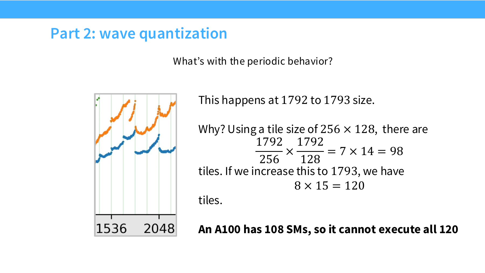

# 第 6 章 GPU 高性能编程

## 本章学习目标

读完本章应能做到三件事：

- 用 CUDA event 写一个可复用的 benchmark，并用 `torch.profiler` 定位到具体 CUDA kernel 与时间分布。
- 写出覆盖 elementwise / reduction / row-overflow / matmul tiling 四类模式的 Triton kernel，并解释为什么每种模式对应不同的 `program_id` / `tl.arange` / mask 策略。
- 从 PTX 文本中读出 `.target`、`%ctaid.x`、`%tid.x`、`ld.global.v4.b32` 等信号，并把它们对应到上面的 Triton 抽象。

## 本章主线

GPU 高性能编程先从一条可复用的排查链开始：

1. 用 benchmark 得到端到端时间。
2. 用 profiler 找到实际执行的 CUDA kernel 和时间分布。
3. 根据瓶颈判断优化方向：减少 kernel launch、减少 HBM 往返、提高 coalescing、增加 tile 复用，或交给编译器融合。
4. 在 PyTorch builtin、`torch.compile`、Triton、CUDA C++ 和 PTX 之间选择维护成本最低、收益足够明确的工具。

读完本章后，应当能把一段高层 PyTorch 代码拆成三层问题：Python 表达式触发了哪些 kernel；这些 kernel 在 GPU 上受哪些硬件约束；需要下探时，Triton program、thread block 和 PTX 信号如何对应到实际执行。

硬件基础参见 [第 5 章 GPU 体系结构](../chapter5/chapter5_GPU和GPU相关优化.md)；本章侧重编程模型、benchmark / profile 流程和 Triton / PTX 的工程落点。

正文中的代码片段保留核心结构，省略的 import、helper 和检查函数不影响主线。

## 6.1 GPU 编程模型和硬件约束

单 GPU kernel 优化要同时看两件事：程序员写下的并行抽象，以及硬件能同时驻留多少工作、从哪一级内存取数。PyTorch 可以把许多细节藏起来；一旦开始 profile 或写 Triton，这些细节会重新出现。


*图 6.1-1 GPU memory hierarchy*

图 6.1-1 把单 GPU 拆成两类资源：左侧是 GPU chip 上的多个 SM、每个 SM 内部的 registers 与 L1/shared memory，以及芯片级 L2；右侧是容量更大的 HBM。优化 kernel 时，最常见的收益来自把数据从 HBM 读入更近的层级后复用，或者减少中间结果写回 HBM 的次数。

硬件速查表把 A100、H100 和 B200 放在一起，用来建立数量级直觉。后面的 trace 和 PTX 观察主要按 B200 / Blackwell 语境理解。

| 指标 | A100 | H100 | B200 |
| --- | ---: | ---: | ---: |
| SM 数 | 108 | 132 | 148 |
| 每 SM register | 256 KB | 256 KB | 256 KB |
| 每 SM L1 + shared memory | 192 KB | 256 KB | 256 KB |
| L2 cache | 40 MB | 50 MB | 96-126 MB |
| HBM 容量 | 80 GB | 80 GB | 192 GB |
| HBM 带宽量级 | 2 TB/s | 3.35 TB/s | 8 TB/s |

*表 6.1 A100/H100/B200 硬件数量级*

> [!NOTE]
> "每 SM register 256 KB" 指的是 SM 内部的 register file 容量：CUDA Blackwell tuning guide 给出 "The register file size is 64K 32-bit registers per SM"，即 65536 × 4 B = 256 KB；这与"每个 thread 最多使用 255 个 32-bit register"是不同维度。前者是物理存储大小（决定占用率），后者是每个 thread 的可用上限（决定单 thread 寄存器压力）。这两组数字同时出现，可避免混淆：寄存器上限影响单个 thread 可用空间，寄存器总量影响 SM 上能并发驻留多少 thread block。

带宽账本比容量账本更直接影响 kernel 优化。Registers 最快但局部性最强；shared memory 适合一个 thread block 内协作；L2 是芯片级缓存；HBM 容量最大，访问代价也最高。

| 带宽层级 | A100 | H100 | B200 |
| --- | ---: | ---: | ---: |
| Register bandwidth\* | ~116 TB/s | ~401 TB/s | ~447 TB/s |
| L1 cache + shared memory bandwidth | ~19 TB/s | ~33 TB/s | ~19 TB/s |
| L2 cache bandwidth | ~5-8 TB/s | ~12 TB/s | ~9 TB/s |
| HBM bandwidth | 2 TB/s | 3.35 TB/s | 8 TB/s |

\* 来源：NVIDIA datasheet 未公开 register bandwidth 这一指标。

*表 6.2 A100/H100/B200 内存带宽数量级*

> [!NOTE]
> **Hopper 与 Blackwell 在 memory hierarchy 上的两个新硬件特征**：(1) **Tensor Memory (TMEM，Blackwell 数据中心型号 B200/GB200)**——在 Tensor Core 旁新增一组张量专用内存，容量 256 KB/SM，按 128 lane × 512 column 的 32-bit 单元组织，$128 \times 512 \times 4 \text{ B} = 256 \text{ KB}$。`tcgen05.mma` 的累加器直接驻留在 TMEM 上，无需立刻写回 shared memory 或 HBM。TMEM 由 kernel 用 `tcgen05.alloc` 显式分配、`tcgen05.dealloc` 显式释放，两条指令必须由同一个 warp 集体发起；`tcgen05.relinquish_alloc_permit` 表示当前 CTA 不再发起新的 `tcgen05.alloc`，本身不负责 alloc/dealloc 配对——cluster 中两个 peer CTA 之间的 alloc/dealloc 协同通过各自对应的 warp 同步执行完成（[CUDA PTX ISA §9.7.17.1 Tensor Memory](https://docs.nvidia.com/cuda/parallel-thread-execution/index.html#tensor-memory)；[`tcgen05.alloc` / `tcgen05.dealloc` 见 §9.7.17.7.1](https://docs.nvidia.com/cuda/parallel-thread-execution/index.html)）。(2) **Thread Block Cluster（H100 9.0+ 与 B200）**——允许把多个 thread block 编为一个 cluster，cluster 内的 block 可跨 SM 直接访问彼此的 distributed shared memory（[CUDA PTX ISA §2.2.2 Thread Block Clusters](https://docs.nvidia.com/cuda/parallel-thread-execution/index.html#thread-block-clusters)），共享内存域从单 SM 扩展到 portable cluster size 8 个 SM；若开启 `cudaFuncAttributeNonPortableClusterSizeAllowed`，可进一步扩展到 16 个 SM；这一特性自 Hopper 引入，Blackwell 沿用并扩展。TMEM 触发 Blackwell 专属的 kernel 设计模式（TMEM-resident mma、persistent kernels）；cluster 是 Hopper 与 Blackwell 都可用的 grid 调度扩展，对应 cluster-level tile 等模式。在 PTX 层，`tcgen05.alloc` / `tcgen05.dealloc` 直接暴露给程序员；默认编程模型（CUDA C++、Triton、TorchInductor）下不需要显式管理 TMEM，编译器在 `tcgen05.mma` 调用前后自动完成分配与释放。

CUDA / Triton 的基础并行模型可以写成三层：

```text
grid（一次 kernel launch 的所有工作）
  -> thread block / CTA（一组共享同一片 shared memory 的线程）
    -> thread（在一小块数据上执行指令）
```

`thread block` 在 PTX 和 profiler 语境里也常称为 `CTA`（Cooperative Thread Array）。一个 thread block 会被调度到某个 SM 上执行；block 内线程可以通过该 SM 上的 shared memory、warp shuffle 或编译器生成的 reduction 逻辑共享中间状态。

Elementwise GeLU 这类操作几乎可以按元素独立处理，thread 视角已经够用。Softmax 和 matmul 会立刻需要 block 视角：softmax 的每个输出依赖整行最大值和整行分母；matmul 的一个输出 tile 会反复复用 $A$ 和 $B$ 的 tile。Triton 的自然思维单位就是“一个 program 负责一个 block 级任务”。

Warp 是硬件执行层最重要的补充抽象。一个 warp 由 32 个 thread 组成，同一个 warp 内的线程以 lockstep 方式执行同一条指令。若同一 warp 内线程走不同分支，硬件通常要顺序执行多条路径，这会造成 control divergence。

Occupancy 有两个常见含义：

- **Warp occupancy**：一个 SM 上同时驻留多少 warp。寄存器、shared memory 和线程数都会限制它。低 occupancy 不自动代表坏结果；如果 thread coarsening 让每个 thread 做更多有用工作，较低 occupancy 也可能换来更高吞吐。
- **Block occupancy**：thread block 被分批调度到 SM 上时是否均衡。B200 有 148 个 SM，若只启动 160 个 block，第一波能填满 148 个 SM，第二波只剩 12 个 block，大量 SM 会闲置。

一个小算例可以把 warp occupancy 的含义固定下来。假设一个 thread block 有 128 个 thread，每个 thread 使用 160 个 registers，那么一个 block 需要 $128 \times 160 = 20480$ 个 registers。若一个 SM 大约有 65536 个 registers 可用（A100 / H100 / B200 公开数值一致），同一个 SM 最多同时驻留 $\lfloor 65536 / 20480 \rfloor = 3$ 个 block。

每个 block 有 $128 / 32 = 4$ 个 warps，所以一共是 12 个 resident warps。若硬件上限是 64 个 warps/SM，这个 kernel 的 warp occupancy 约为 $12 / 64 \approx 18.75\%$。这个数说明寄存器用量已经限制了并发 warp 数；后续优化判断还要结合每个 thread 做了多少有效工作、是否能隐藏 HBM 访问延迟，以及 Tensor Core 是否吃满。



*图 6.1-2 wave quantization*

图 6.1-2 展示了 block occupancy 的工程后果。横向矩阵尺寸从 1792 增到 1793 时，tile 数从 $7 \times 14 = 98$ 跳到 $8 \times 15 = 120$。

A100 有 108 个 SM，120 个 tile 无法在一波内全部执行，尾波只剩少量 block，周期性低效就会出现在性能曲线上。

调 block size、grid size 和 thread coarsening 时，需要同时看每个 block 的工作量和总 block 数对 SM 数的整除关系。

Shared memory 和 HBM 还有两类不同的访存坑：

- **Bank conflict** 发生在 shared memory。shared memory 通常分成 32 个 bank。若一个 warp 的多个线程在同一周期访问同一个 bank 的不同地址，这些访问会被串行化。连续 float32 元素常可粗略记作 $\mathrm{bank}(i) = i \bmod 32$。
- **Memory coalescing** 发生在 global memory / HBM 访问。一个 warp 同一条 load 指令访问连续地址时，硬件更容易合并成少量 cache-line transaction；若同一拍访问矩阵不同 row 的同一列，地址跨度通常很大，coalescing 会变差。

Bank conflict 常出现在 tile 被写入 shared memory 后又按另一种方向读取时。按行连续写入通常很顺，但转置读取或按列读取可能让同一个 warp 的多个 thread 落到同一个 bank。常见缓解方式是 swizzling：保持逻辑坐标不变，只改变 shared memory 中的物理下标，例如把某一维映射成 `row ^ col` 这类按位异或形式。这样相邻 thread 的访问会被打散到更多 bank；读取时使用同一套映射还原逻辑位置。

算术强度（arithmetic intensity）把这些硬件约束压成一个判断：每搬一个 byte 数据，能做多少 FLOPs。逐元素 GeLU、ReLU、加法通常算术强度低，容易被 HBM 往返和 kernel launch 限制；matmul 通过 tile 复用可以把算术强度提高到与 tile size 相关。

## 6.2 Benchmark 和 profiler 的工作流

高性能代码的第一步是先测量。Benchmark 回答“这段操作总共花多久”；profiler 回答“时间落在哪些 op、CUDA kernel 和同步点上”。这两类证据要成对出现：只看 benchmark 容易猜错瓶颈，只看 profiler 又缺少端到端收益口径。

### 6.2.1 Benchmark 流程

下面的 benchmark 函数用 CUDA event 计量 GPU 时间。关键步骤是 warmup、事件计时、多次 trial 和 `torch.cuda.synchronize()`。

```python
def run_operation2(dim: int, operation: Callable) -> Callable:
    x = torch.randn(dim, dim, device=cuda_if_available())
    y = torch.randn(dim, dim, device=cuda_if_available())
    return lambda: operation(x, y)

def benchmark(run: Callable, num_warmups: int = 1, num_trials: int = 3) -> float:
    for _ in range(num_warmups):
        run()
    torch.cuda.synchronize()

    times: list[float] = []
    for trial in range(num_trials):
        start_event = torch.cuda.Event(enable_timing=True)
        end_event = torch.cuda.Event(enable_timing=True)

        start_event.record()
        run()
        end_event.record()

        torch.cuda.synchronize()
        times.append(start_event.elapsed_time(end_event))

    return mean(times)
```

Warmup 处理第一次运行中的编译、缓存和初始化开销。CUDA 同步处理异步提交问题：CPU 侧代码返回不代表 GPU 已完成 kernel。CUDA event 计时能更贴近 GPU 执行窗口，避免把 Python 侧调度时间混进主要数字。

用这个流程测矩阵乘法，可以得到随维度变化的数量级。

```python
results = {}
for dim in [256, 512, 1024, 2048, 4096, 8192]:
    results[dim] = benchmark(
        run_operation2(dim=dim, operation=lambda a, b: a @ b)
    )
```

| 矩阵维度 `dim` | 平均时间（ms） |
| --- | ---: |
| 256 | 0.6149 |
| 512 | 0.5928 |
| 1024 | 0.5909 |
| 2048 | 0.7010 |
| 4096 | 2.5596 |
| 8192 | 17.6036 |

*表 6.3 矩阵乘法 benchmark 结果（单卡 B200）*

小尺寸区间没有立刻呈现理想的三次增长，因为固定开销、kernel launch、调度和后端 GEMM 选择仍占明显比例。尺寸变大后，GEMM 本身逐渐主导时间。Benchmark 给出真实机器上的拐点，让复杂度公式落到具体硬件上。

### 6.2.2 Profiler 看到实际 kernel

Profiler 把高层 PyTorch 调用和实际 CUDA kernel 连接起来。下面的辅助函数先 warmup，再用 PyTorch profiler 采集 CUDA 活动，并按 CUDA 时间排序输出表格。

```python
def profile(run: Callable, num_warmups: int = 1):
    for _ in range(num_warmups):
        run()
    torch.cuda.synchronize()

    with torch.profiler.profile(
        activities=[ProfilerActivity.CUDA],
        experimental_config=torch._C._profiler._ExperimentalConfig(verbose=True),
    ) as prof:
        run()
        torch.cuda.synchronize()

    return prof.key_averages().table(
        sort_by="cuda_time_total",
        max_name_column_width=100,
        row_limit=10,
    )
```

对矩阵加法，Python 里只是 `a + b`，底层会分派到 elementwise CUDA kernel。

| profile 目标 | 主要 CUDA 信号 | Self CUDA time total |
| --- | --- | ---: |
| `add(dim=2048)` | `vectorized_elementwise_kernel...CUDAFunctor_add...` | 4.960 us |

*表 6.4 矩阵加法 profiler 摘要（单卡 B200）*

对矩阵乘法，kernel 名称会暴露更多实现信息。

| profile 目标 | 主要 CUDA kernel 信号 | Self CUDA time total |
| --- | --- | ---: |
| `matmul(dim=2048)` | `cutlass3x_sm100_simt_sgemm...64x64x16...` | 329.345 us |
| `matmul(dim=128)` | `cutlass3x_sm100_simt_sgemm...32x32x16...` | 4.544 us |

*表 6.5 矩阵乘法 profiler 摘要（单卡 B200）*

`cutlass3x` 指向 NVIDIA 的线性代数 kernel 生态，`sm100` 对应 Blackwell / B200，`sgemm` 表示 float32 GEMM，`64x64x16` 或 `32x32x16` 是 tile 形状。相同 Python 表达式在不同形状下可能调用不同 kernel，因此性能分析不能只停在 `a @ b` 这一层。

## 6.3 Kernel fusion：GeLU 作为最小案例

Kernel fusion 的目标是减少中间张量写回 HBM 和重复 kernel launch。GeLU 很适合做最小案例：数学公式不复杂，朴素 PyTorch 写法却会拆成多个逐元素 op。

```python
def naive_gelu(x: torch.Tensor):
    return 0.5 * x * (
        1 + torch.tanh(0.79788456 * (x + 0.044715 * x * x * x))
    )

def builtin_gelu(x: torch.Tensor):
    return torch.nn.functional.gelu(x, approximate="tanh")
```

`naive_gelu` 里的乘法、加法、立方和 `tanh` 都是高层 PyTorch op。若每个 op 各自形成 kernel，中间结果会多次读写 HBM。`builtin_gelu` 是 PyTorch 内置融合实现，通常能用更少 kernel 完成同一件事。

第三条路线是把朴素函数交给 `torch.compile`：

```python
compiled_gelu = torch.compile(naive_gelu)
check_equal_1d(naive_gelu, compiled_gelu)
```

三个版本都计算相同函数，但耗时差异很大。下表是 `run_operation1(dim=16384, ...)`（即 16384 × 16384 输入）在单卡 B200 上的实测结果；不同 GPU 与不同输入规模会改变绝对数。

| 实现 | benchmark 平均时间 | profiler 主要信号 | Self CUDA time total |
| --- | ---: | --- | ---: |
| `naive_gelu` | 3.758 ms | 多个逐元素 PyTorch/CUDA kernel | 3.385 ms |
| `builtin_gelu` | 0.667 ms | `GeluCUDAKernelImpl` | 305.409 us |
| `torch.compile(naive_gelu)` | 0.939 ms | `triton_poi_fused_add_mul_tanh_0` | 342.848 us |

*表 6.6  GeLU 三种实现的 benchmark/profiler 对比（`dim=16384`，单卡 B200）*

逐元素链条太碎时，先找 PyTorch builtin；没有合适 builtin 时，试 `torch.compile`。在这个案例里，编译器把朴素计算图收敛成一个 Triton fused kernel，性能接近内置实现，维护成本远低于手写 kernel。内置 GeLU 仍然更快——自动编译提供的是强基线，不保证总能超过专门优化过的库 kernel。

Fusion 的收益来自数据路径：朴素版本每个中间 op 都可能读 HBM、算一小段、写回 HBM；融合版本把多个逐元素计算留在同一个 kernel 内，理想情况下每个元素只读一次、写一次。

## 6.4 Triton：从 elementwise 到 reduction

Triton 是面向 GPU kernel 的 Python DSL。它的核心抽象是 block 级 program：程序员描述一个 program 读取哪段数据、如何计算、写回哪里；编译器负责把这个 block 级描述降到线程、warp 和 PTX 形态。

> [!TIP]
> **Triton program 与 CUDA 线程的对应**：在 Triton 里写 `tl.program_id(axis=0)` 拿到的就是 CUDA PTX 中的 `%ctaid.x`（block id）；`tl.arange(0, BLOCK)` 是该 program 内部要处理的一段 tile；kernel 编译时 Triton 会自动把这段 tile 拆成 warp × thread 的向量化指令，程序员不必直接管 thread id（对应 `%tid.x`）。这是 Triton 与手写 CUDA 的最大区别——把 block 级逻辑显式写出，把 thread 级调度交给编译器。

### 6.4.1 Triton GeLU：一段连续向量一个 program

Triton GeLU 的 wrapper 先检查输入，再分配输出，最后根据元素数和 block size 决定 grid。

```python
def triton_gelu(x: torch.Tensor):
    assert x.is_cuda
    assert x.is_contiguous()

    y = torch.empty_like(x)
    num_elements = x.numel()
    block_size = 1024
    num_blocks = triton.cdiv(num_elements, block_size)

    triton_gelu_kernel[(num_blocks,)](
        x, y, num_elements, BLOCK_SIZE=block_size
    )
    return y
```

`[(num_blocks,)]` 是 Triton grid shape，表示启动多少个 program；`BLOCK_SIZE` 是单个 program 一次处理的向量宽度。两者分别回答“开多少个小队”和“每个小队处理多宽”。

```python
@triton.jit
def triton_gelu_kernel(x_ptr, y_ptr, num_elements, BLOCK_SIZE: tl.constexpr):
    pid = tl.program_id(axis=0)
    start = pid * BLOCK_SIZE
    offsets = start + tl.arange(0, BLOCK_SIZE)
    mask = offsets < num_elements

    x = tl.load(x_ptr + offsets, mask=mask)
    a = 0.79788456 * (x + 0.044715 * x * x * x)
    exp = tl.exp(2 * a)
    tanh = (exp - 1) / (exp + 1)
    y = 0.5 * x * (1 + tanh)
    tl.store(y_ptr + offsets, y, mask=mask)
```

这段 kernel 展示了大多数 Triton 入门代码的骨架：用 `tl.program_id` 找到当前 program，构造一组向量 offset，用 mask 处理末尾越界，加载一段连续数据，在片上完成计算，再写回 HBM。

| trace 信号 | 数值 / 含义 |
| --- | --- |
| `num_elements` | 8192 |
| `BLOCK_SIZE` | 1024 |
| `num_blocks` | 8 |
| PTX 目标 | `.target sm_100a` |

*表 6.7 Triton GeLU PTX 摘要*

### 6.4.2 Triton softmax：一行一个 program

Softmax 比 GeLU 多了 reduction。每个输出元素依赖整行最大值和整行分母，因此自然的切分是让一个 program 负责一行。


*图 6.4-1 Triton softmax row program*

图 6.4-1 展示了 row-wise softmax 的 block 级组织方式。左侧 `pid=1` 选择 row 1；右侧同一个 program 先 `tl.load` 整行，再做 `tl.max`、`tl.exp`、`tl.sum` 和 normalize，最后 `tl.store` 回输出。row 之间没有共享状态，所以 grid 可以是一维的 `(M,)`。

```python
def triton_softmax(x: torch.Tensor):
    y = torch.empty_like(x)
    M, N = x.shape
    block_size = triton.next_power_of_2(N)
    triton_softmax_kernel[(M,)](
        x_ptr=x,
        y_ptr=y,
        x_row_stride=x.stride(0),
        y_row_stride=y.stride(0),
        num_cols=N,
        BLOCK_SIZE=block_size,
    )
    return y
```

Kernel 内部和朴素 softmax 的数学结构很像，但访存结构完全不同。朴素 PyTorch 会经历 row max、减 max、`exp`、row sum、除法等多个 op，每一步都可能形成独立 kernel 和中间张量。以行数 $M$、列数 $N$ 为账本：朴素实现共 $5MN + M$ 次 HBM 读和 $3MN + 2M$ 次 HBM 写，访存量随 $M$ 和 $N$ 增长接近 8 倍于"每行一次读、一次写"的理想值。Triton fused softmax 把一行读入后，把 max/sum reduction 和 normalize 尽量留在同一个 program 内完成，把整条流水线收敛到每行约一次读加一次写。

```python
@triton.jit
def triton_softmax_kernel(x_ptr, y_ptr, x_row_stride, y_row_stride,
                          num_cols, BLOCK_SIZE: tl.constexpr):
    row_idx = tl.program_id(0)
    col_offsets = tl.arange(0, BLOCK_SIZE)

    x_start_ptr = x_ptr + row_idx * x_row_stride
    x_row = tl.load(
        x_start_ptr + col_offsets,
        mask=col_offsets < num_cols,
        other=float("-inf"),
    )

    x_row = x_row - tl.max(x_row, axis=0)
    numerator = tl.exp(x_row)
    denominator = tl.sum(numerator, axis=0)
    y_row = numerator / denominator

    y_start_ptr = y_ptr + row_idx * y_row_stride
    tl.store(y_start_ptr + col_offsets, y_row, mask=col_offsets < num_cols)
```

`other=float("-inf")` 让越界列在 row max 和 `exp` 中保持安全：masked 位置不会影响最大值，指数后也不会贡献有效概率。这个 mask 处理是 Triton 代码里处理非整齐尺寸的常见模式。

### 6.4.3 Triton row sum：行太长时分 tile 累加

一行能放进一个 block 时，softmax 写法很直接。若一行长于 block size，就需要让同一个 program 在行内循环多个 tile。Row sum 是最小例子：每个 thread / lane 保持一个 accumulator，遍历 tile 后再做一次 reduction。


*图 6.4-2 Triton row sum tiled accumulation*

图 6.4-2 中，block 1 负责 row 1，但 row 1 被分成多个 tile。前两轮 tile 更新每个位置的 `acc`，最后一轮用 mask 跳过越界列，再通过 `tl.sum(acc)` 得到一个标量输出。这里的 tile 属于同一个 program 内部循环；它和 grid 中的多个 block 是两层概念。

```python
@triton.jit
def row_sum_kernel(x_ptr, out_ptr, N, BLOCK_SIZE: tl.constexpr):
    row = tl.program_id(0)
    acc = tl.zeros([BLOCK_SIZE], dtype=tl.float32)

    for start in range(0, N, BLOCK_SIZE):
        cols = start + tl.arange(0, BLOCK_SIZE)
        mask = cols < N
        x = tl.load(x_ptr + row * N + cols, mask=mask, other=0.0)
        acc += x

    result = tl.sum(acc, axis=0)
    tl.store(out_ptr + row, result)
```

GeLU 的 block 之间完全独立；softmax 的一行必须在一个 program 内形成共同统计量；行太长时，program 内还要显式循环 tile。这个模式会在 matmul 中扩展成二维 tile 复用。

## 6.5 Matmul tiling、PTX 和工具选择

Matmul 是深度学习中最重要的高算术强度算子。朴素写法为每个 $C_{m,n}$ 遍历 $K$ 维，每次从 HBM 读 $A_{m,k}$ 和 $B_{k,n}$。这样是正确的，但同一行的 $A$ 元素和同一列的 $B$ 元素会被反复读取。

理想路径是把 $A$ 和 $B$ 都放进 shared memory 后再计算 $C$，这样读次数能从 $O(MKN)$ 降到接近 $O(MK + KN)$。现实中矩阵太大，shared memory 放不下完整矩阵，所以采用 tiling：一个 program 负责 $C$ 的一个输出 tile，沿 $K$ 维逐段加载 $A$ tile 和 $B$ tile，累加 partial sum，最后写回 HBM。


*图 6.5-1 GEMM tiling data reuse*

图 6.5-1 把 GEMM 的复用关系画成三个矩阵。右侧橙色块是当前输出 tile；为了计算它，kernel 会沿 $K$ 维读取左侧 $A$ 的行 tile 和中间 $B$ 的列 tile。紫色块表示外层 tile 扫描，绿色块表示内层元素乘加。tile 越大，每次 HBM 读入后能服务更多乘加，算术强度越高；tile 太大会增加 shared memory 和 register 压力，降低可驻留 block 数。

Triton 版 matmul + ReLU 的 wrapper 先确定 $M$、$K$、$N$，再启动二维 grid。每个 program 对应 $C$ 的一个 $(\mathrm{BLOCK\_M}, \mathrm{BLOCK\_N})$ tile。

```python
def triton_matmul_relu(a: torch.Tensor, b: torch.Tensor):
    assert a.is_cuda and b.is_cuda
    assert a.is_contiguous() and b.is_contiguous()
    assert a.shape[1] == b.shape[0]

    M, K = a.shape
    K, N = b.shape
    c = torch.empty((M, N), device=a.device)

    BLOCK_M, BLOCK_N, BLOCK_K = 64, 64, 32
    grid = (triton.cdiv(M, BLOCK_M), triton.cdiv(N, BLOCK_N))
    matmul_relu_kernel[grid](
        a, b, c,
        M, N, K,
        a.stride(0), a.stride(1),
        b.stride(0), b.stride(1),
        c.stride(0), c.stride(1),
        BLOCK_M, BLOCK_N, BLOCK_K,
    )
    return c
```

Kernel 内部的核心循环沿 $K$ 维移动。`tl.dot(a, b)` 负责 tile 级矩阵乘法；`tl.maximum(acc, 0.0)` 在写回前融合 ReLU，避免先写未激活的 $C$，再启动另一个 elementwise kernel 读回来做激活。

```python
acc = tl.zeros([BLOCK_M, BLOCK_N], dtype=tl.float32)

for k in range(0, K, BLOCK_K):
    a = tl.load(a_ptrs, mask=..., other=0.0)
    b = tl.load(b_ptrs, mask=..., other=0.0)
    acc += tl.dot(a, b)
    a_ptrs += BLOCK_K * stride_ak
    b_ptrs += BLOCK_K * stride_bk

acc = tl.maximum(acc, 0.0)
tl.store(c_ptrs, acc, mask=...)
```

Triton 代码最终会编译到 PTX（Parallel Thread Execution）。`triton_gelu-ptx.txt` 可以用来观察几个直接对应执行模型的信号：

| PTX 信号 | 含义 |
| --- | --- |
| `.target sm_100a` | 面向 Blackwell / B200 一类目标架构 |
| `.reqntid 128` | 一个 thread block 请求 128 个 thread |
| `%ctaid.x` | 当前 block / CTA 的 x 维 id |
| `%tid.x` | 当前 thread 在 block 内的 x 维 id |
| `ld.global.v4.b32` | 从 global memory 做 4 个 32-bit 值的向量化 load |
| `st.global.v4.b32` | 向 global memory 做 4 个 32-bit 值的向量化 store |

*表 6.8 Triton GeLU PTX 中的执行模型信号*

PTX 中同一个 thread 实际处理多个相邻元素（thread coarsening），体现在连续的 `ld.global.v4.b32` / `st.global.v4.b32` 序列上，编译器把多个相邻元素合并到同一个 thread 的连续 vector load/store 里，减少调度开销并提高每个 thread 的工作量。PTX 仍不是硬件最终全部细节；warp 调度、具体 SM 分配和许多微架构行为还要继续下探到 profiler 或 SASS 才能确认。

本章的工具选择可以压缩成一条工程判断链：PyTorch builtin 优先；逐元素链条先试 `torch.compile`；需要改变计算组织、显式控制 tile、mask、访存和片上复用时使用 Triton；只有在需要更细粒度硬件控制或复用已有 CUDA 生态时，才继续下探到 CUDA C++、PTX 或 SASS。

## 本章总结与下章衔接

本章把 GPU 高性能编程拆成一条可复用的排查链：benchmark 端到端时间 → profiler 找到实际 kernel 与时间分布 → 决定 fusion 收益 → 在 Triton 里写 block 级 kernel → 通过 PTX 与 `cuobjdump` 看到 compiler 把 block 拆到 thread/warp/指令后做了什么。当自动编译（`torch.compile`）不够用时，这套链可以定位到具体哪条 kernel 哪一行做错了。

下章进入 [第 7 章 分布式训练](../chapter7/chapter7_分布式训练.md)：单卡账本成立之后，把同一组账本扩展到跨卡——collective 语义、NCCL / torch.distributed 的实际接口、ZeRO / FSDP 的状态分片，以及 TP / PP / SP / CP / EP 在混合并行中的组合（EP 在第 7 章 §7.9 与第 4 章 MoE 章节交叉）。

## 思考

- 用 `torch.cuda.Event` 测一段 forward + backward 端到端时间，瓶颈是 kernel launch 还是 kernel 执行？
- 在 `torch.compile` 之后用 `nvprof` / `nsys` 看哪些 kernel 实际被 fuse 了，哪些仍是单点？
- 在 Triton kernel 里把 BLOCK_SIZE 从 64 改到 128、256、512，shared memory 占用和 occupancy 怎么变化？
- 同一个 reduction 在 `torch.sum` / 手写 Triton / `cub::BlockReduce` 三个实现下的 register pressure 和 SM 占用对比。

## 参考文献

- Philippe Tillet, H. T. Kung, David Cox. [Triton: An Intermediate Language and Compiler for Tiled Neural Network Computations](https://www.eecs.harvard.edu/~htk/publication/2019-mapl-tillet-kung-cox.pdf)，MAPL 2019
- [Triton 官方文档](https://triton-lang.org/)
- [PyTorch `torch.compile` 文档](https://pytorch.org/docs/stable/generated/torch.compile.html)
- [NVIDIA CUDA C++ Programming Guide](https://docs.nvidia.com/cuda/cuda-c-programming-guide/)
- [PTX ISA 文档](https://docs.nvidia.com/cuda/parallel-thread-execution/index.html)
- [Stanford CS336 Lecture 6 课件与代码](https://github.com/stanford-cs336/lectures)

## 来源与更新记录


- 来源：本章以 CUTLASS 3.x 源码、Triton 文档、PTX ISA 与 NVIDIA H100/B200 datasheet 为主；`triton_gelu-ptx.txt` 等 PTX 一手输出物仅作可访问示例引用。
- 参考：[`triton_gelu-ptx.txt`](https://github.com/stanford-cs336/lectures/blob/main/var/triton_gelu-ptx.txt)；Triton 文档；PyTorch `torch.compile` 文档。
