# 第 7 章 分布式训练


## 本章学习目标

读完本章，读者应能：

- 列出 PyTorch / NCCL 的主要 collective（`all-reduce`、`reduce-scatter`、`all-gather`、`all-to-all`）的语义与典型用例。
- 区分 DDP、ZeRO、FSDP 三类数据并行的状态复制 / 分片范围。
- 解释 TP、PP、SP、CP 各自沿哪个维度切模型，及其通信开销来源。
- 描述 EP / ETP / EDP 在 MoE 系统里的角色：router → dispatch → expert compute → combine。
- 在给定硬件拓扑（节点内 NVLink、节点间 InfiniBand）下，组合 4D 并行策略并写出资源账本。

## 本章主线

分布式训练要解决的核心问题，是在参数显存、activation 显存、通信带宽和全局 batch 之间找可行的切分方式。本章按五个问题组织：

1. 哪些 collective 是训练系统的基础原语？
2. DDP、ZeRO、FSDP 在复制和分片哪些状态？
3. TP、PP、SP、CP 分别沿哪个维度切模型？
4. EP/ETP/EDP 如何把 MoE experts 变成可切分的系统资源？
5. 在给定硬件拓扑下，如何组合这些维度让模型既放得下又跑得动？

后文先把 collective 和最小 `torch.distributed` 代码讲清楚，再把这些原语组合成 ZeRO/FSDP、TP/PP/SP/EP/CP 和混合并行策略。代码示例使用第 2 章的设备 helper：`cuda_if_available(rank)` 表示有 CUDA 时使用第 `rank` 张 GPU，否则回退到 CPU。

## 7.0 并行策略的统一视角：沿维度切分

当单卡放不下或跑不快时，分布式训练就是沿不同维度切分同一个训练步骤。先用一张表建立地图，后面再逐个展开：

| 策略 | 切分维度 | 每个 rank 主要持有什么 | 典型通信 | 适用直觉 |
| --- | --- | --- | --- | --- |
| DP / DDP | batch | 完整模型副本、本地 batch shard | 梯度 all-reduce | batch 足够大时最简单，扩吞吐但不省参数显存 |
| ZeRO / FSDP | batch + 状态分片 | 参数、梯度、优化器状态的一部分 | all-gather + reduce-scatter | 不改模型结构，把复制状态换成可重叠通信 |
| TP | hidden / width | 每层矩阵或 activation 的一部分 | 层内 all-reduce / all-gather / reduce-scatter | 高频通信，通常放在 NVLink / NVSwitch 域内 |
| PP | layer / depth | 连续层段 | 相邻阶段 send / recv | 省参数和 activation 显存，但要处理 pipeline bubble |
| SP / CP | sequence / context | 序列维 activation、attention 或 KV 分片 | all-gather / reduce-scatter / ring attention | 长上下文和 activation 显存开始主导时使用 |
| EP / ETP / EDP | expert | MoE experts 或 expert 内部切片 | all-to-all，加上 TP / DP 类通信 | MoE 中按专家维扩展，但受路由均衡和通信影响 |

> [!TIP]
> 选择并行策略时先问：要省的是参数显存、优化器显存、activation 显存、通信带宽，还是单步 wall-clock？不同答案对应完全不同的切分方向。

参数显存与优化器状态的 12 字节 / 参数基线在 [第 2 章 §2.5.6 内存账本](../chapter2/chapter2_pytorch与资源核算.md) 给出；本章按这个基线把状态分片推到 ZeRO / FSDP，把 activation 与 sequence 推到 SP / CP。

## 7.1 为什么需要分布式训练与硬件层级

这一节从单卡的两个硬约束（显存容量和单卡 FLOP/s）出发，建立"为什么必须把训练步骤拆到多个 rank"的物理理由；并把硬件拓扑按 L1 → HBM → NVLink → InfiniBand 的速度梯度铺平，作为后续 collective 与并行策略落点的参照系。

### 7.1.1 单卡瓶颈：内存和算力

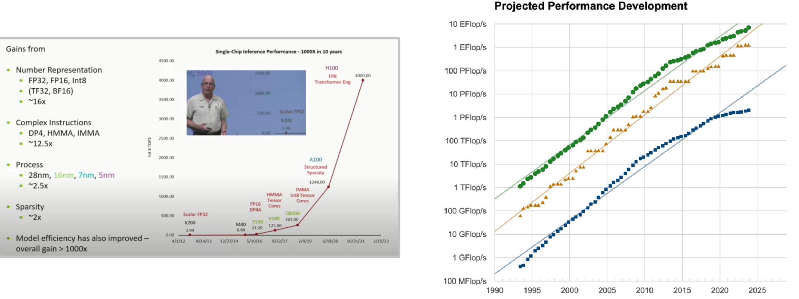

*图 7.1-1 GPU 的算力增强曲线*

单卡瓶颈有两个：一是参数、梯度、优化器状态和 activation 往往放不下；二是即便能放下，单卡 FLOP/s 也不足以把训练时间压到可接受范围。分布式训练因此同时服务两个目标：**扩展内存容量**和**扩展有效计算吞吐**。

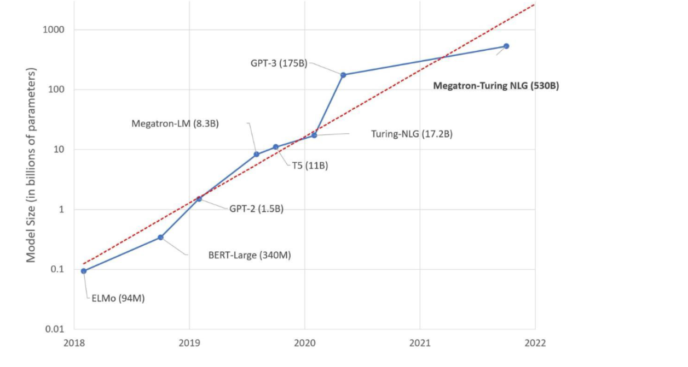

*图 7.1-2 模型的尺寸变化*

理想情况下，我们希望多卡扩展同时带来近似线性的内存扩展和近似线性的训练吞吐扩展；现实里这两个目标常常互相牵制，因为越强的分片通常意味着越多的通信。

### 7.1.2 多 GPU、多机并行架构

所谓多 GPU / 多机并行，就是把同一训练步骤拆到多个 rank 上执行。rank 可以是单机多卡，也可以跨多机；区别在于互联带宽、延迟和可承受的通信模式完全不同。

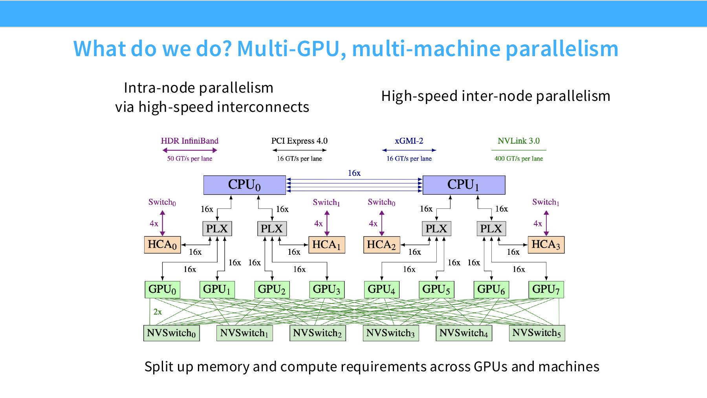

*图 7.1-3 multi-GPU, multi-machine parallelism*

图 7.1-3 展示的是一个关键分层：节点内 GPU 通过 NVLink / NVSwitch 等高速互联通信，节点间则要经过 HCA、InfiniBand、以太网或更上层交换网络。机内带宽通常远高于跨机网络，因此很多训练栈会把高频同步的 TP/SP/EP 放在单节点或高速域内，把对延迟更宽容的 DP/PP 放到跨节点层级。并行策略需要从拓扑反推哪些 collective 可以高频使用。

因此在讨论并行策略前，先要把 collective communication 这组“积木”讲清楚。

### 7.1.3 从 GPU 内存层级到跨节点通信

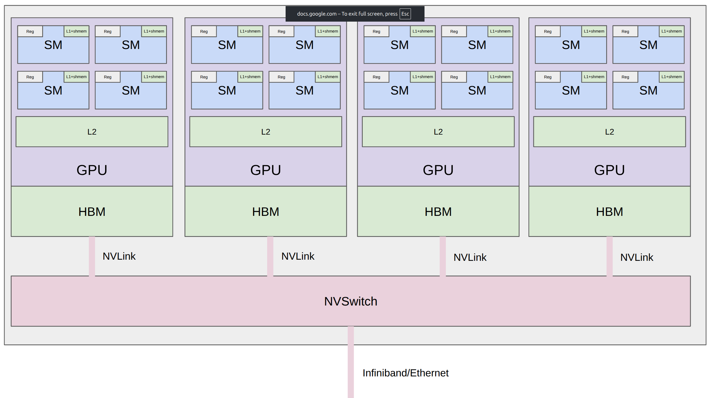

*图 7.1-4 GPU node overview*

这里讨论的是典型的多 GPU 集群视角：多个节点，每个节点挂若干 GPU，每个 GPU 内部再由多个 SM 执行计算。图中的绿色部分可以理解为内存与互联组件，它们共同决定了哪些并行策略能高频通信、哪些只能低频使用。

核心思路是：计算发生在 SM 内部的算术逻辑单元（ALU）上，但输入和输出可能位于很远的内存层级。理想情况是数据已经在 L1 / shared memory 中，次优情况是从 HBM 读取；到了多 GPU / 多节点训练，所需数据还可能在另一张 GPU、另一台机器，甚至另一个机柜里。因此分布式训练要尽量减少必须发生的传输，并让这些传输足够大块、足够能和计算重叠。

目标是**保持高算术强度**，让 GPU 尽量持续执行计算。由于数据传输通常慢得多，通信很容易成为瓶颈。前面学习 GPU 内部优化时，核心思想是减少 HBM 往返，把数据载入 L1 / shared memory，在片上完成更多计算后再谨慎写回 HBM；到了多 GPU / 多节点训练，同样的原则会扩展成：减少跨 GPU 传输，或把传输组织成更高效的 collective。

从快到慢看，可以先记住这条粗略层级：单 GPU 的 L1 / shared memory，单 GPU 的 HBM，同节点 GPU 间的 NVLink / NVSwitch，跨节点网络。越往后越应该减少通信频率，或把通信做成更大的 collective。

下面先用 `torch.distributed` 把 collective 语义跑通，再用一段小 benchmark 看通信代价的真实量级，最后用最小 MLP 代码锚定 DP、TP、PP 三种切分在代码上的差异。

### 7.1.4 GPU、TPU 和数据中心拓扑

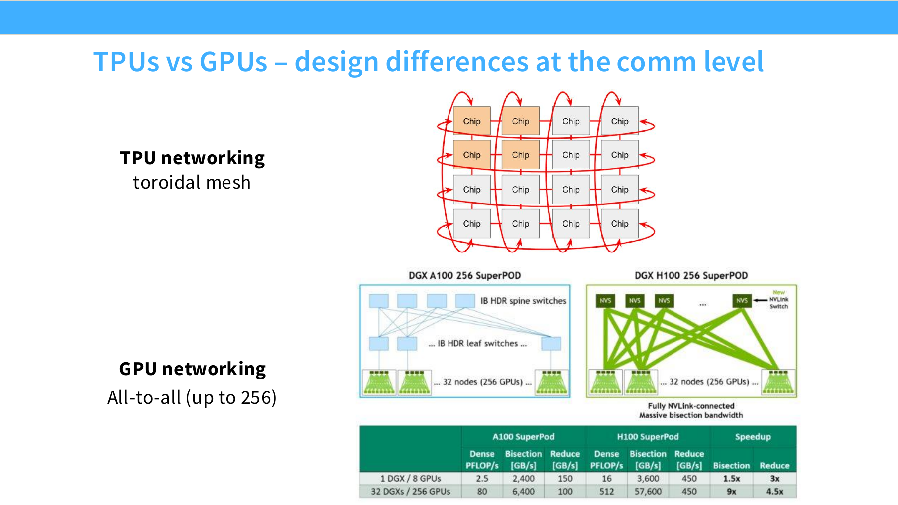

*图 7.1-5 TPU/GPU communication design*

TPU 和 GPU 的通信设计体现了两种不同取向。TPU 的经典路线更像 **toroidal mesh**：每个 chip 主要和相邻 chip 通信，形成规则网格，边界再首尾相连。GPU 训练集群则更接近分层交换网络：单节点内有 NVLink / NVSwitch，高速跨节点用 InfiniBand 或 RoCE，更大 cluster 再通过 leaf / spine / fat-tree 这类上层网络连接。

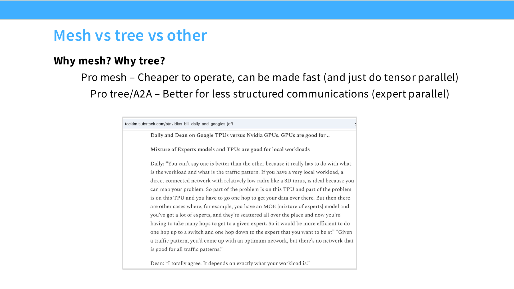

*图 7.1-6 mesh/tree topology tradeoff*

可以把 mesh 理解成规则网格：每个 chip 只连上下左右或前后相邻 chip；torus 则是在 mesh 的基础上把网格边界“首尾相连”。这种结构便宜、可扩展，并且适合规则通信，例如 tensor parallel 中的 all-reduce、reduce-scatter 或 all-gather。tree / all-to-all 取向则更适合不规则通信，例如 MoE expert parallel 里 token 按 router 结果飞到不同 experts。

> [!NOTE]
> 数据中心网络常被组织成多层树：底层 leaf switch 直接连接服务器或 GPU 节点，上层 spine switch 再连接多个 leaf switch 或 pod。
> fat-tree 可以理解成这种多层树形网络的带宽增强版，越靠近上层需要承载越多下层流量，因此会用更多链路或更高带宽来避免根部成为瓶颈。
> 对训练系统来说，交换机型号本身不如通信路径重要；集群规模越大，通信路径越长，带宽、延迟和路由复杂度越会影响并行策略。

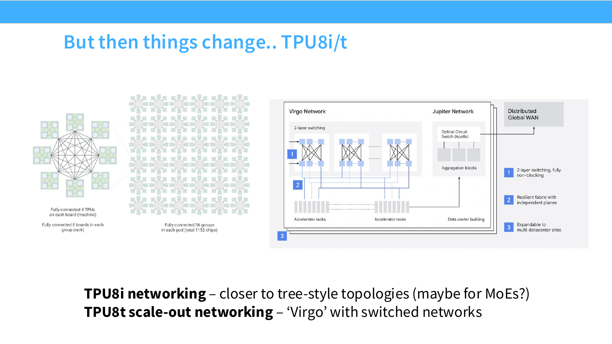

*图 7.1-7 TPU8i/TPU8t networking*

拓扑路线也会随 workload 演进。TPU 路线里 TPU8i 偏 tree-style，更贴近 expert parallel 这类较规则的路由通信；TPU8t 通过 Virgo switched network 支持更大规模和更不规则的通信。GPU 路线则通过 NVLink、NVSwitch、RoCE 和更大的 NVLink domain 缩短跨设备通信路径。

因此，讨论分布式训练时要同时看 GPU 数量和连接方式：同一节点内是否有 NVLink / NVSwitch，跨节点是 InfiniBand 还是 RoCE，是否存在更大的高速通信域。这些拓扑会直接决定 TP、SP、CP、EP 这类高频通信能不能承受。

如果看 Hopper/H100，每张卡 18 条 NVLink4 link，合计 900 GB/s（[NVIDIA NVLink 规格表](https://www.nvidia.com/en-us/data-center/nvlink/) 第四代 NVLink：每 GPU 18 link / 900 GB/s），折算每 link 50 GB/s。

B200/Blackwell 视角下还会看到**单张 Blackwell GPU HBM 约 8 TB/s**（[GB200 NVL72](https://www.nvidia.com/en-us/data-center/gb200-nvl72/) spec sheet：整机架 72 GPU 合计 13.4 TB HBM3E；GB200 superchip 标称的 372 GB、16 TB/s 是一个 Grace CPU 配 2 张 Blackwell GPU 的合计值）和更大的 NVLink 域（[HGX B200 数据表](https://www.nvidia.com/en-us/data-center/hgx-b200/)）。

这些数字的意义在于建立量级感：**跨卡通信虽然快了很多，但仍慢于片上 SRAM/L1/L2 访问，因此并行策略必须和拓扑一起设计。**

### 7.1.5 NCCL 与 `torch.distributed` 的层次

硬件 fabric 只提供能力，训练程序还需要一个通信库把 `all_reduce`、`all_gather`、`reduce_scatter` 这类 collective 变成实际的数据包、CUDA communication kernel 和调度策略。

NCCL（NVIDIA Collective Communication Library）承担的正是这一层工作：程序员声明“这组 rank 要做某个 collective”，NCCL 根据 GPU、PCIe、NVLink、NVSwitch、网卡和节点拓扑选择实现路径。

启动 NCCL 通信时，系统会先建立参与设备集合并探测拓扑；执行 collective 时，NCCL 会在 GPU 上发起相应的通信 kernel，并配合网络传输完成数据交换。这个过程隐藏了大量细节，例如分片大小、环或树形算法、跨网卡路由、是否能和计算重叠。

实际高效实现中，NCCL 可能使用 **ring all-reduce**。ring 的意思是把 rank 排成一个环，例如 `rank 0 -> rank 1 -> rank 2 -> rank 3 -> rank 0`，每一步每个 rank 只和环上的邻居收发 shard。

ring all-reduce 可以直觉地看成两个阶段：先 reduce-scatter，边传边加并让每个 rank 得到一片 reduce 后结果；再 all-gather，把这些片沿环传播给所有 rank。这里讲的是实现算法，all-reduce 的语义保持不变。

PyTorch 里的 `torch.distributed` 是更高一层的接口。写训练代码时通常调用 `dist.all_gather`、`dist.all_reduce`、`dist.reduce_scatter_tensor` 这类 API；后端可以是 GPU 上常用的 `nccl`，也可以是 CPU 调试时常用的 `gloo`。

因此要区分三层：**collective 语义**决定结果是什么，**PyTorch API**决定你怎么调用，**NCCL / Gloo backend**决定它在具体硬件上怎么跑。


## 7.2 通信编程模型

这一节定义最底层的"积木"：rank / world_size / process group 是什么，collective 各自把张量从一种分片状态搬到另一种状态。后面 §7.3 的 benchmark 与 §7.4 的并行代码都建立在这套语义之上。

### 7.2.1 Rank、world_size 与 process group

现在从 collective 开始。所谓 collective，指同一个 process group 里的多个 rank 一起调用同一个通信原语；相比自己写点对点收发，collective 把拓扑选择、分片、同步和错误处理交给通信库，是训练系统最常用的抽象层。

先明确三个术语：

- **`world_size`**：进程组中的 rank 总数，通常等于参与这组通信的 GPU 进程数。
- **`rank`**：进程组内的编号，范围是 `0` 到 `world_size - 1`；它不是线性代数里的矩阵秩。
- **`process group`**：一组参与同类通信的 rank。实际训练里可能同时存在 DP group、TP group、PP group、EP group，它们的成员关系不同。


*图 7.2-1 分布式 rank 示意*

公开的 [`lecture_07_stdout.txt`](https://github.com/stanford-cs336/lectures/blob/main/var/traces/lecture_07_stdout.txt) 记录了同一段分布式代码在多个 rank 上的实际输出。

这类输出有两个固定现象：多进程打印顺序不保证按 rank 排列；`torch.empty` 预分配缓冲区在 collective 之前可能显示旧值或未初始化值。判断 collective 语义，要看调用完成后每个 rank 拿到的结果。

> [!TIP]
> stdout 里的三行结果正好对应三个语义：all-reduce 后每个 rank 都得到完整 `[6, 10, 14, 18]`；reduce-scatter 后 rank 0/1/2/3 分别只拿到 `6/10/14/18` 这一片；再接 all-gather 后，每个 rank 又恢复完整 `[6, 10, 14, 18]`。
> 这组结果把 `all-reduce = reduce-scatter + all-gather` 的关系落到了具体张量上。

### 7.2.2 Collective 语义概览

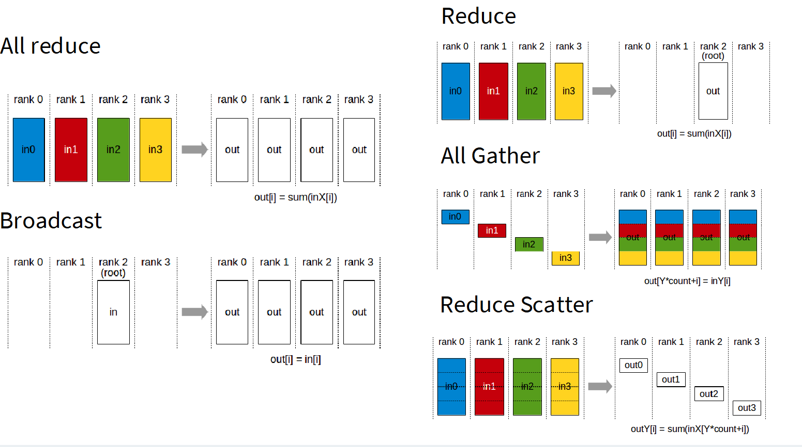

*图 7.2-2 collective 操作*

Collective 是跨多个 rank 的通信模板：程序只声明“这些 rank 要按什么模式交换张量”，具体点对点传输、拓扑和调度由通信库处理。训练系统会反复使用 `all-gather`、`reduce-scatter`、`all-reduce` 来做梯度同步、参数重组和状态分片；`broadcast`、`scatter`、`gather` 更适合作为理解这些复合原语的基础；`all-to-all` 则在 MoE routing 里成为关键通信模式。

#### 1. all-reduce

所有 rank 先对同形张量做逐元素归约，再把完整结果返回给所有 rank。它常用于数据并行里的梯度同步。

#### 2. Broadcast 操作（广播）

一个源 rank 把自己的张量复制给所有其他 rank，常用于初始化参数、同步配置或发布控制信息。

#### 3. Reduce 操作（归约）

所有 rank 的张量先做归约，但结果只保留在目标 rank 上；相比 all-reduce，它少了“再发回所有人”的那一步。

#### 4. all-gather

每个 rank 提供自己持有的一片张量，系统把所有分片拼接后分发给每个 rank。它常用于参数分片后的临时重组。

#### 5. reduce-scatter

先对各 rank 的输入做归约，再把结果按分片分给各 rank。它和 all-gather 组合后，就能构成 all-reduce。

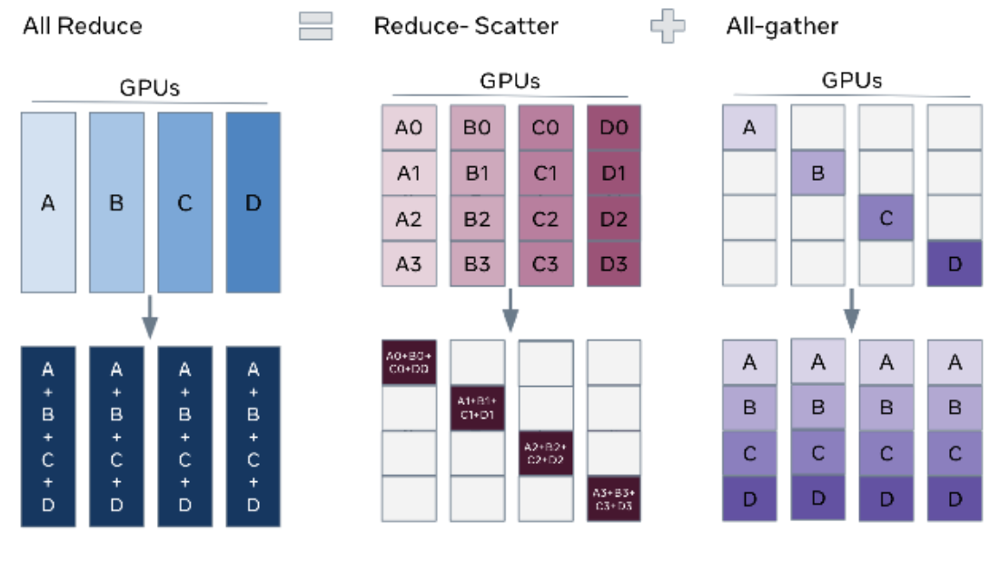

*图 7.2-3 reduce 操作*

all-gather 和 reduce-scatter 之所以特别重要，是因为很多并行算法最终都能被写成这两个原语的组合。一个关键等式是：

$$
\text{all-reduce} = \text{reduce-scatter} + \text{all-gather}
$$

这也是 ZeRO、FSDP、sequence parallelism 等实现经常围绕 reduce-scatter / all-gather 组织通信的原因。

下面这些原语可以看成训练系统里的“积木”：

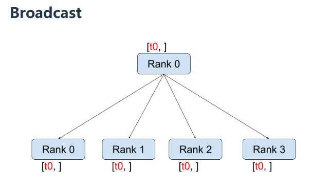

*图 7.2-4 broadcast*

**broadcast** 把源 rank 上的张量复制给所有 rank，常用于同步初始参数、配置或控制信息。

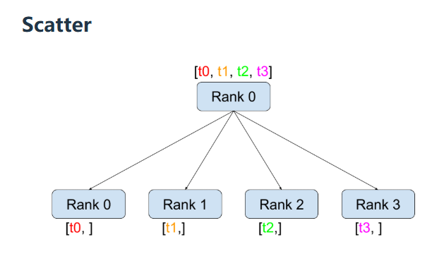

*图 7.2-5 scatter*

**scatter** 把源 rank 上的不同分片分别发送给不同 rank；每个 rank 拿到的是不同内容。

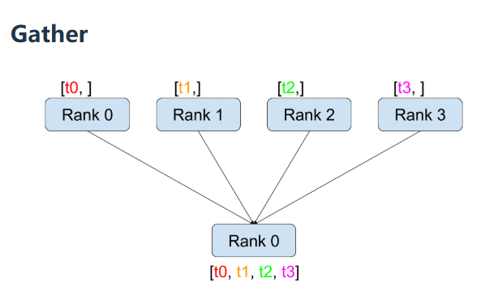

*图 7.2-6 gather*

**gather** 是 scatter 的逆操作：每个 rank 提供一个分片，目标 rank 收集并拼成完整结果。

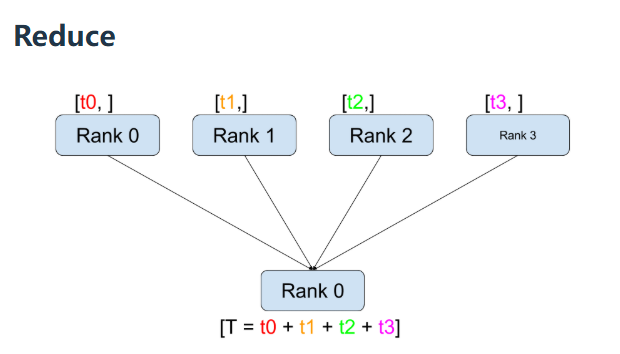

*图 7.2-7 reduce*

**reduce** 对多个 rank 上同 shape 张量的相同下标做求和、最大值、最小值或平均等聚合，但结果只保留在目标 rank。

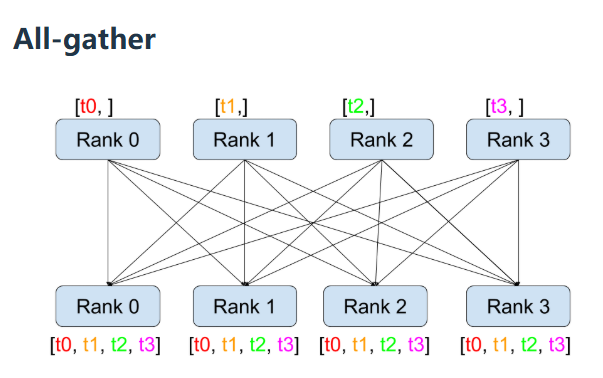

*图 7.2-8 all-gather*

**all-gather** 是“对所有 rank 执行 gather”：每个 rank 提供一片，最后每个 rank 都拿到完整拼接结果。FSDP 前向临时重组参数时就会频繁用到它。

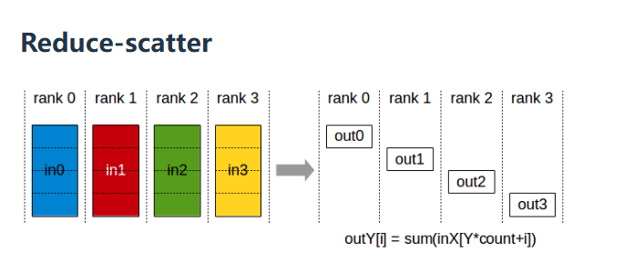

*图 7.2-9 reduce-scatter*

**reduce-scatter** 先对多个 rank 的输入做 reduce，再把 reduce 后的完整结果按 shard 分给不同 rank。它常出现在 ZeRO / FSDP 的梯度归约和状态分片里。

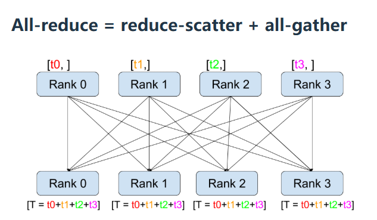

*图 7.2-10 all-reduce*

**all-reduce** 可以理解为 reduce 后让每个 rank 都得到完整结果；高效实现里也常拆成 reduce-scatter 加 all-gather。

**all-to-all** 是更一般的重排：每个 rank 都可以向每个其他 rank 发送不同分片。它常用于 MoE 的 expert routing，因为 token 需要按 router 结果发往不同设备上的专家。

balanced all-to-all 示例可以直接看作一次分片转置：

| rank | 输入张量 | 输出张量 |
| --- | --- | --- |
| rank 0 | `[0, 1, 2, 3]` | `[0, 4, 8, 12]` |
| rank 1 | `[4, 5, 6, 7]` | `[1, 5, 9, 13]` |
| rank 2 | `[8, 9, 10, 11]` | `[2, 6, 10, 14]` |
| rank 3 | `[12, 13, 14, 15]` | `[3, 7, 11, 15]` |

每个 rank 原本持有一行分片，all-to-all 后每个 rank 拿到来自所有 rank 的同一列分片。MoE 中 token 先按 router 结果分桶，再通过 all-to-all 发往对应专家所在设备；如果路由分布不均，balanced all-to-all 就会变成带不同 split size 的不均衡通信。

记忆这些名字时抓住两个词根就够了：**reduce** 表示先聚合数值，**gather** 表示拼接分片；前缀 **all** 表示所有 rank 都得到结果。

理解 reduce 系列操作时，关键是 **同 shape tensor 在所有 rank 上按相同下标对齐做 element-wise 聚合**。以求和为例：

$$
\text{out}[i] = \sum_{r=0}^{p-1} \text{input}_r[i]
$$

其中 $p$ 是 `world_size`， $r$ 是 rank 编号， $i$ 是 tensor 内部的下标。reduce 操作按不同 rank 上的相同位置聚合元素，并不在单个 rank 的向量内部求和；判断 reduce 语义时，关键是下标对齐，图里的箭头方向只表示数据流。

### 7.2.3 `torch.distributed` 输出示例

```python
spawn(collective_operations_main, world_size=4)
```

上面的工具函数会通过 Python 多进程包装器启动 `world_size` 个进程。每个进程运行同一个函数，但拿到不同的 `rank` 编号，范围从 `0` 到 `world_size - 1`。

```python

def setup(rank: int, world_size: int):
    os.environ["MASTER_ADDR"] = "localhost"
    os.environ["MASTER_PORT"] = "15623"
    if torch.cuda.is_available():
        dist.init_process_group("nccl", rank=rank, world_size=world_size)
    else:
        dist.init_process_group("gloo", rank=rank, world_size=world_size)

def cleanup():
    torch.distributed.destroy_process_group()

def collective_operations_main(rank: int, world_size: int):
    """Run asynchronously for each process (rank = 0, ..., world_size - 1)."""
    setup(rank, world_size)

    # all-reduce
    dist.barrier()
    tensor = torch.tensor([0., 1, 2, 3], device=cuda_if_available(rank)) + rank
    print(f"Rank {rank} [before all-reduce]: {tensor}", flush=True)
    dist.all_reduce(tensor=tensor, op=dist.ReduceOp.SUM, async_op=False)
    print(f"Rank {rank} [after all-reduce]: {tensor}", flush=True)

    # reduce-scatter
    dist.barrier()
    input = torch.arange(world_size, dtype=torch.float32, device=cuda_if_available(rank)) + rank
    output = torch.empty(1, device=cuda_if_available(rank))
    print(f"Rank {rank} [before reduce-scatter]: input = {input}, output = {output}", flush=True)
    dist.reduce_scatter_tensor(output=output, input=input, op=dist.ReduceOp.SUM, async_op=False)
    print(f"Rank {rank} [after reduce-scatter]: input = {input}, output = {output}", flush=True)

    # all-gather
    dist.barrier()
    input = output
    output = torch.empty(world_size, device=cuda_if_available(rank))
    print(f"Rank {rank} [before all-gather]: input = {input}, output = {output}", flush=True)
    dist.all_gather_into_tensor(output_tensor=output, input_tensor=input, async_op=False)
    print(f"Rank {rank} [after all-gather]: input = {input}, output = {output}", flush=True)

    # Indeed, all-reduce = reduce-scatter + all-gather!
    cleanup()

```

#### 1. all-reduce

```python
    # all-reduce
    dist.barrier()  # Waits for all processes to get to this point (in this case, for print statements)
    tensor = torch.tensor([0., 1, 2, 3], device=cuda_if_available(rank)) + rank  # Both input and output
    print(f"Rank {rank} [before all-reduce]: {tensor}", flush=True)
    dist.all_reduce(tensor=tensor, op=dist.ReduceOp.SUM, async_op=False)  # Modifies tensor in place
    print(f"Rank {rank} [after all-reduce]: {tensor}", flush=True)
```

通常流程中，进程首先需要初始化自身。多个进程需要相互发现对方，它们会连接到**同一主机**来确认彼此存在（使用 `setup`）。这里承担协调功能，数据传输仍通过 NCCL 完成；有 GPU 时通常使用 NCCL 后端，否则可以用 Gloo 调试。初始化完成后，才开始实际 collective。

`dist.barrier()` 会等待进程组中的所有进程都到达同一个同步点。这里使用 barrier 主要是为了让打印结果更容易阅读；在真实训练中，它也常用于 debug 或确保某些阶段全部完成。

`tensor = torch.tensor([0., 1, 2, 3], device=cuda_if_available(rank)) + rank` 为每个 rank 创建不同输入：rank 0 得到 `[0, 1, 2, 3]`，rank 1 得到 `[1, 2, 3, 4]`，以此类推。执行 all-reduce 前先打印各 rank 的本地张量。

实际输出摘录如下：

```text
Rank 3 [before all-reduce]: tensor([3., 4., 5., 6.], device='cuda:3')
Rank 1 [before all-reduce]: tensor([1., 2., 3., 4.], device='cuda:1')
Rank 2 [before all-reduce]: tensor([2., 3., 4., 5.], device='cuda:2')
Rank 0 [before all-reduce]: tensor([0., 1., 2., 3.], device='cuda:0')
Rank 0 [after all-reduce]: tensor([ 6., 10., 14., 18.], device='cuda:0')
Rank 3 [after all-reduce]: tensor([ 6., 10., 14., 18.], device='cuda:3')
Rank 1 [after all-reduce]: tensor([ 6., 10., 14., 18.], device='cuda:1')
Rank 2 [after all-reduce]: tensor([ 6., 10., 14., 18.], device='cuda:2')
```

rank 0 显示 `[0, 1, 2, 3]`，rank 1 显示 `[1, 2, 3, 4]`，以此类推。由于多个进程异步打印，输出顺序可能是乱序的；这不影响 collective 语义。随后调用 `dist.all_reduce(tensor=tensor, op=dist.ReduceOp.SUM, async_op=False)`，对同下标元素做跨 rank 求和。这里没有启用异步通信；真实训练中可以用异步方式尝试重叠通信和计算。

在 all-reduce 之后，每个 rank 都得到同一个完整结果 `[6, 10, 14, 18]`。这里的 6 来自位置 0 上的跨 rank 求和：`0 + 1 + 2 + 3`；10 来自位置 1：`1 + 2 + 3 + 4`，后面同理。这个 API 对外暴露的是“所有 rank 共同归约后再复制回每个 rank”的语义；底层可以用 ring、tree 或硬件 collective 实现。

公开 stdout 里还会看到所有 rank 最终都打印出同一结果，这正是 all-reduce 和 reduce 的差别：reduce 只把聚合结果放在目标 rank，all-reduce 则让每个 rank 都拿到完整聚合结果。训练中的 DDP 梯度同步依赖的就是这个“所有副本都看到同一份梯度”的语义。

这个例子有一点容易误导：`[0,1,2,3] + rank` 的 rank 内横向求和也碰巧是 6、10、14、18，所以容易看成“每个 rank 内部求和”。实际语义始终是同下标跨 rank 聚合。换一个不容易混淆的例子：

```text
rank 0: [1,    2,    3,    4]
rank 1: [10,   20,   30,   40]
rank 2: [100,  200,  300,  400]
rank 3: [1000, 2000, 3000, 4000]

all_reduce(SUM) = [1111, 2222, 3333, 4444]
```

#### 2. reduce-scatter

```python

    # reduce-scatter
    dist.barrier()
    input = torch.arange(world_size, dtype=torch.float32, device=cuda_if_available(rank)) + rank  # Input
    output = torch.empty(1, device=cuda_if_available(rank))  # Allocate output
    print(f"Rank {rank} [before reduce-scatter]: input = {input}, output = {output}", flush=True)
    dist.reduce_scatter_tensor(output=output, input=input, op=dist.ReduceOp.SUM, async_op=False)
    print(f"Rank {rank} [after reduce-scatter]: input = {input}, output = {output}", flush=True)

```

现在来演示 **reduce-scatter**。这里为每个 rank 创建长度为 `world_size` 的输入，`world_size = 4`；再分配一个标量输出，因为 `reduce_scatter_tensor` 不会原地覆盖输入。


实际输出摘录如下：

```text
Rank 0 [before reduce-scatter]: input = tensor([0., 1., 2., 3.], device='cuda:0'), output = tensor([0.], device='cuda:0')
Rank 1 [before reduce-scatter]: input = tensor([1., 2., 3., 4.], device='cuda:1'), output = tensor([0.], device='cuda:1')
Rank 2 [before reduce-scatter]: input = tensor([2., 3., 4., 5.], device='cuda:2'), output = tensor([0.], device='cuda:2')
Rank 3 [before reduce-scatter]: input = tensor([3., 4., 5., 6.], device='cuda:3'), output = tensor([0.], device='cuda:3')
Rank 0 [after reduce-scatter]: input = tensor([0., 1., 2., 3.], device='cuda:0'), output = tensor([6.], device='cuda:0')
Rank 1 [after reduce-scatter]: input = tensor([1., 2., 3., 4.], device='cuda:1'), output = tensor([10.], device='cuda:1')
Rank 3 [after reduce-scatter]: input = tensor([3., 4., 5., 6.], device='cuda:3'), output = tensor([18.], device='cuda:3')
Rank 2 [after reduce-scatter]: input = tensor([2., 3., 4., 5.], device='cuda:2'), output = tensor([14.], device='cuda:2')
```

在 reduce-scatter 之前，输入是输出摘录中的前四行，输出张量只是预分配缓冲区，未初始化值不重要。执行 reduce-scatter 后，系统先对同下标元素做 element-wise reduce，再把 reduce 后的完整结果按 shard 分给不同 rank：第一列结果放到 rank 0，第二列结果放到 rank 1，依此类推。它和 all-reduce 的核心 reduce 语义相同，只是最终结果没有复制给所有 rank。

#### 3. all-gather

```python

    # all-gather
    dist.barrier()
    input = output  # Input is the output of reduce-scatter
    output = torch.empty(world_size, device=cuda_if_available(rank))  # Allocate output
    print(f"Rank {rank} [before all-gather]: input = {input}, output = {output}", flush=True)
    dist.all_gather_into_tensor(output_tensor=output, input_tensor=input, async_op=False)
    print(f"Rank {rank} [after all-gather]: input = {input}, output = {output}", flush=True)

```
现在演示 **all-gather**。这里直接把 reduce-scatter 的输出作为输入，再为完整输出分配一个空数组。

实际输出摘录如下：

```text
Rank 0 [before all-gather]: input = tensor([6.], device='cuda:0'), output = tensor([ 0., 10., 14., 18.], device='cuda:0')
Rank 2 [before all-gather]: input = tensor([14.], device='cuda:2'), output = tensor([2., 3., 4., 5.], device='cuda:2')
Rank 1 [before all-gather]: input = tensor([10.], device='cuda:1'), output = tensor([1., 2., 3., 4.], device='cuda:1')
Rank 3 [before all-gather]: input = tensor([18.], device='cuda:3'), output = tensor([3., 4., 5., 6.], device='cuda:3')
Rank 0 [after all-gather]: input = tensor([6.], device='cuda:0'), output = tensor([ 6., 10., 14., 18.], device='cuda:0')
Rank 2 [after all-gather]: input = tensor([14.], device='cuda:2'), output = tensor([ 6., 10., 14., 18.], device='cuda:2')
Rank 1 [after all-gather]: input = tensor([10.], device='cuda:1'), output = tensor([ 6., 10., 14., 18.], device='cuda:1')
Rank 3 [after all-gather]: input = tensor([18.], device='cuda:3'), output = tensor([ 6., 10., 14., 18.], device='cuda:3')
```

在 all-gather 之前，`output` 只是未初始化缓冲区。执行 all-gather 后，各 rank 手里的 shard 会被收集到每个 rank 上，让每个 rank 都恢复完整 tensor。把这个步骤接在 reduce-scatter 后面，就得到和 all-reduce 相同的完整结果。

最后当进程运行结束时，只需进行清理即可。

## 7.3 通信性能与 benchmark

这一节用一段最小 benchmark 看 collective 在真实运行中花多少时间，并把 benchmark 按 [nccl-tests](https://github.com/NVIDIA/nccl-tests/blob/master/doc/PERFORMANCE.md) `bus bandwidth` 口径算出的"有效带宽"换算公式拆开：先讲 $\text{algorithm bandwidth} = S/t$、再讲 bus-bw 修正系数，从而建立"为什么不能直接用字节数除以耗时"的工程直觉。


理解 collective 的语义之后，还要看它在真实运行中花多少时间。一个小 benchmark 就可以展示通信耗时和有效带宽的基本观察方式。

benchmark 输出里的 GB/s 由 benchmark 脚本自己按固定公式算出，NCCL 并不回报这个数字，它也不等于“张量大小除以耗时”。脚本沿用 [nccl-tests 的 bus bandwidth 口径](https://github.com/NVIDIA/nccl-tests/blob/master/doc/PERFORMANCE.md)：先算 algorithm bandwidth $S/t$ ，再乘一个只和 collective 类型与 rank 数有关的修正系数——all-reduce 是 $2(p-1)/p$ ，reduce-scatter 和 all-gather 是 $(p-1)/p$ 。这个系数来自 ring 算法的最优传输量推导，但写进脚本后就与 NCCL 实际选中的 ring 或 tree 实现无关。它的价值是比较同一集群、同一 collective、同一消息大小下的趋势；某一次数字不能直接当成硬件上限。

这里有两层异步需要分开看：`torch.cuda.synchronize()` 等待本 rank 上已经提交的 CUDA / NCCL kernel 完成，`dist.barrier()` 等待所有 rank 都走到同一个同步点。前者解决 GPU 异步执行，后者解决多进程进度不齐；做通信 benchmark 时通常两个都需要。


```python

def all_reduce(rank: int, world_size: int, num_elements: int):
    setup(rank, world_size)
    # 创建张量
    tensor = torch.randn(num_elements, device=cuda_if_available(rank))
    # 预热
    dist.all_reduce(tensor=tensor, op=dist.ReduceOp.SUM, async_op=False)
    if torch.cuda.is_available():
        torch.cuda.synchronize()  # 等待 CUDA kernel 完成
    dist.barrier()                # 等待程序到这里
    # Perform all-reduce
    start_time = time.time()
    dist.all_reduce(tensor=tensor, op=dist.ReduceOp.SUM, async_op=False)
    if torch.cuda.is_available():
        torch.cuda.synchronize()  # 等待 CUDA kernel 完成
    dist.barrier()                # 等待程序到这里
    end_time = time.time()
    duration = end_time - start_time
    print(f"[all_reduce] Rank {rank}: all_reduce(world_size={world_size}, num_elements={num_elements}) took {render_duration(duration)}", flush=True)

    # 测量带宽
    dist.barrier()
    size_bytes = tensor.element_size() * tensor.numel()
    sent_bytes = size_bytes * 2 * (world_size - 1)  # 2x because send input and receive output
    total_duration = world_size * duration
    bandwidth = sent_bytes / total_duration
    print(f"[all_reduce] Rank {rank}: all_reduce measured bandwidth = {round(bandwidth / 1024**3)} GB/s", flush=True)
    cleanup()
```


以 **all-reduce** 为例，先创建一个包含 1 亿个元素的张量，`world_size = 4`。做 benchmark 时要先预热一次 collective，然后同步 CUDA 并执行 `dist.barrier()`，尽量避免把 kernel 初始化、CUDA 未完成或进程未对齐的时间混入计时。

接着开始计时，执行 all-reduce，再次同步后停止计时。公开 stdout 中这次运行的耗时如下：

```text
[all_reduce] Rank 0: all_reduce(world_size=4, num_elements=104857600) took 1.60ms
[all_reduce] Rank 2: all_reduce(world_size=4, num_elements=104857600) took 1.38ms
[all_reduce] Rank 1: all_reduce(world_size=4, num_elements=104857600) took 1.50ms
[all_reduce] Rank 3: all_reduce(world_size=4, num_elements=104857600) took 1.38ms
```

多进程输出顺序不保证按 rank 排列，且不同 rank 的计时会有轻微差异。阅读 benchmark 时，通常看一个区间比盯住某个 rank 的单点数值更稳；这次 all-reduce 大约落在 1.38-1.60 ms。

```python
    # 测量带宽
    dist.barrier()
    size_bytes = tensor.element_size() * tensor.numel()
    sent_bytes = size_bytes * 2 * (world_size - 1)  # 2x because send input and receive output
    total_duration = world_size * duration
    bandwidth = sent_bytes / total_duration
    print(f"[all_reduce] Rank {rank}: all_reduce measured bandwidth = {round(bandwidth / 1024**3)} GB/s", flush=True)
    cleanup()
```

现在测量带宽，即每秒实际传输的总 GB 数。计算方法需要考虑实际传输的数据量：`size_bytes = tensor.element_size() * tensor.numel()`，也就是张量元素数量乘以每个元素的大小。这里用的是 float32，因此每个元素占 4 字节。

这里有个细节：实际发送/接收的字节数是多少？每个 rank 上的张量大小为 `size_bytes`，需要和其他 `world_size - 1` 个 rank 交换信息。简化估算里乘以 2，是为了强调 all-reduce 可以分成“发送输入参与 reduce”和“接收完整结果”两个阶段。因此这里用 `world_size` 乘以实际经过时间来估算聚合吞吐。

> [!WARNING]
> 这里的 `size_bytes * 2 * (world_size - 1)` 是简化通信量估算，用来强调 all-reduce 包含“发送输入”和“分发结果”两类通信。精确到 ring all-reduce 时，每步通常传 shard，每 rank 单向发送量常写作 $2 \cdot \frac{p-1}{p} \cdot S$ ，其中 $S$ 对应代码里的 `size_bytes`。实际传输量由 NCCL 选定的算法、拓扑和消息大小共同决定，因此同一份公式在不同集群上会给出不同的有效带宽读数。

```text
[all_reduce] Rank 1: all_reduce measured bandwidth = 390 GB/s
[all_reduce] Rank 2: all_reduce measured bandwidth = 426 GB/s
[all_reduce] Rank 0: all_reduce measured bandwidth = 366 GB/s
[all_reduce] Rank 3: all_reduce measured bandwidth = 425 GB/s
```

这个公开 trace 里 all-reduce 的估算带宽大约是 **366-426 GB/s**。它适合用来理解“collective 有效带宽”和“硬件标称带宽”的差异：张量大小、设备数量、拓扑、NCCL 路由、是否跨节点、计时同步方式都会影响结果。随着硬件背景转向 B200 / 更大 NVLink 域，stdout 本身仍应被理解为一次运行材料中的测量，不能当作 B200 或 H100 的通用性能常数。

```python
def reduce_scatter(rank: int, world_size: int, num_elements: int):
    setup(rank, world_size)
    # 创建张量
    input = torch.randn(world_size, num_elements, device=cuda_if_available(rank))  # Each rank has a matrix
    output = torch.empty(num_elements, device=cuda_if_available(rank))
    # 预热
    dist.reduce_scatter_tensor(output=output, input=input, op=dist.ReduceOp.SUM, async_op=False)
    if torch.cuda.is_available():
        torch.cuda.synchronize()  # 等待 CUDA kernel 完成
    dist.barrier()                # 等待程序
    # Perform reduce-scatter
    start_time = time.time()
    dist.reduce_scatter_tensor(output=output, input=input, op=dist.ReduceOp.SUM, async_op=False)
    if torch.cuda.is_available():
        torch.cuda.synchronize()  # 等待 CUDA kernel 完成
    dist.barrier()                # 等待程序
    end_time = time.time()
    duration = end_time - start_time
    print(f"[reduce_scatter] Rank {rank}: reduce_scatter(world_size={world_size}, num_elements={num_elements}) took {render_duration(duration)}", flush=True)

    # 测量带宽
    dist.barrier()
    data_bytes = input.element_size() * input.numel()  # How much data in the input
    sent_bytes = data_bytes * (world_size - 1)  # How much needs to be sent (no 2x here)
    total_duration = world_size * duration  # Total time for transmission
    bandwidth = sent_bytes / total_duration
    print(f"[reduce_scatter] Rank {rank}: reduce_scatter measured bandwidth = {round(bandwidth / 1024**3)} GB/s", flush=True)
    cleanup()
```

reduce-scatter benchmark 的结构类似：创建形状为 `world_size × num_elements` 的输入，每个 rank 都持有这个矩阵。先预热，再计时执行 reduce-scatter，最后同步并计算耗时。

再看 reduce-scatter 的带宽计算。reduce-scatter 可以理解为“先 reduce，再把结果切片分散到各 rank”。示例代码用每个 rank 的完整输入矩阵大小作为 `data_bytes`，再乘以 `world_size - 1` 估算需要发送给其他 rank 的逻辑数据量；和 all-reduce 相比，这里不再额外乘发送/接收两阶段的 2 倍系数。

```text
[reduce_scatter] Rank 0: reduce_scatter(world_size=4, num_elements=104857600) took 2.61ms
[reduce_scatter] Rank 1: reduce_scatter(world_size=4, num_elements=104857600) took 2.47ms
[reduce_scatter] Rank 2: reduce_scatter(world_size=4, num_elements=104857600) took 2.39ms
[reduce_scatter] Rank 3: reduce_scatter(world_size=4, num_elements=104857600) took 2.39ms
[reduce_scatter] Rank 1: reduce_scatter measured bandwidth = 475 GB/s
[reduce_scatter] Rank 0: reduce_scatter measured bandwidth = 450 GB/s
[reduce_scatter] Rank 2: reduce_scatter measured bandwidth = 490 GB/s
[reduce_scatter] Rank 3: reduce_scatter measured bandwidth = 490 GB/s
```

按相同方式计算，这组 trace 中 reduce-scatter 的耗时大约是 2.39-2.61 ms，估算带宽大约是 **450-490 GB/s**。它和 all-reduce 的数字不能只按大小直接比较，因为这里统计的通信量口径不同。

reduce-scatter 只留下每个 rank 对应的 shard，而 all-reduce 最终让每个 rank 都拿到完整结果。实际数值仍受 NCCL 算法、消息大小、拓扑、rank 数、预热状态和设备互联影响，不能只用公式精确预测。

**NCCL 内部实现复杂，很难精确推演性能表现，所以需要基准测试**。需要明确的是，我们假设输入数据已存在于设备上，因此未计入数据准备时间，只计算执行 reduce-scatter 所需的操作。

通过对比可见，reduce-scatter 和 all-gather 各自都不含简化估算里的 2 倍系数；两者叠加才对应 all-reduce 的两阶段通信。这些公式只是用于读懂同一份 benchmark 的有效带宽口径；真实性能由 NCCL 算法、拓扑和实测决定。

## 7.4 最小并行代码实践

这一节用同一个深度 MLP 把 DP / TP / PP 三种切分落到可运行代码上：DP 切 batch、TP 切 hidden、PP 切 layer。代码不追求训练出好模型，只为把"切哪一维"对应到"在哪些位置必须交换张量"看清。

我们将通过一个深度 MLP 的简易实现演示每种策略。代码只是最小工作负载，但 MLP 矩阵乘在语言模型里通常占很大计算量，因此足以说明 DP、TP、PP 的切分和通信差异。

首先从数据并行开始。数据并行、张量并行和流水线并行可以理解为对数据、宽度和深度的不同划分方式。

这一节的代码和公开 stdout 摘录保留下来，是为了把前面讲的 collective 和并行策略落到可运行的最小例子上。阅读时可以先抓住三层结构：

- **进程层**：`world_size` 个进程运行同一份函数，只是 `rank` 不同。
- **通信层**：每个 collective 都要求同一个 process group 内的 rank 按相同顺序进入，否则容易 hang。
- **模型层**：DP 复制模型并同步梯度，TP 切矩阵并在层内通信，PP 切层并传 activation。

因此，本章代码用于观察"切分维度改变后，必须交换的数据也随之改变"，不追求训练出一个好模型。输出则用于确认每个 rank 看到的张量和通信结果是否符合预期。

### 7.4.1 数据并行实践

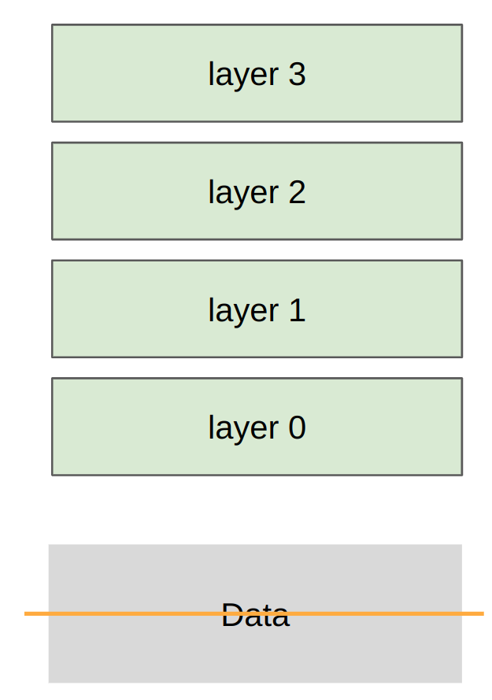

*图 7.4-1 数据并行：每个 rank 保留完整模型，只处理不同数据切片*

在数据并行中，假设模型包含四层，每个 MLP 层都是矩阵乘法。数据形状可记为 $B \times D$ ，其中 $B$ 是批次维度， $D$ 是隐藏维度。数据并行沿**批次维度**切分：每个 rank 持有完整模型，但只处理不同的数据切片。

用一个最小示例说明：batch size 为 128，hidden dimension 为 1024，先随机生成形状为 $128 \times 1024$ 的输入，再运行数据并行版本的训练循环。

```python
# 生成随机数据
def generate_sample_data():
    batch_size = 128
    num_dim = 1024
    data = torch.randn(batch_size, num_dim)
    return data
```

```python
# 数据并行
def data_parallelism_main(rank: int, world_size: int, data: torch.Tensor, num_layers: int, num_steps: int):
    setup(rank, world_size)
    # 获取此 rank 对应的数据切片（实际上，每个 rank 应该只加载自己的数据）
    batch_size = data.size(0)  # @inspect batch_size
    num_dim = data.size(1)  # @inspect num_dim
    local_batch_size = int_divide(batch_size, world_size)  # @inspect local_batch_size
    start_index = rank * local_batch_size  # @inspect start_index
    end_index = start_index + local_batch_size  # @inspect end_index
    data = data[start_index:end_index].to(cuda_if_available(rank))

    # 创建 MLP 参数 params[0], ..., params[num_layers - 1]（每一层都包含完整参数）
    params = [get_init_params(num_dim, num_dim, rank) for i in range(num_layers)]
    optimizer = torch.optim.AdamW(params, lr=1e-3)  # 每个 rank 都有自己的优化器状态
    for step in range(num_steps):
        # 前向传播
        x = data
        for param in params:
            x = x @ param
            x = F.gelu(x)
        loss = x.square().mean()  # 损失函数是平均平方幅值
        # 反向传播
        loss.backward()
        # 同步各 rank 的梯度（标准训练和 DDP 之间的唯一区别）
        for param in params:
            dist.all_reduce(tensor=param.grad, op=dist.ReduceOp.AVG, async_op=False)
        # 更新参数
        optimizer.step()
        print(f"[data_parallelism] Rank {rank}: step = {step}, loss = {loss.item()}, params = {[summarize_tensor(params[i]) for i in range(num_layers)]}", flush=True)
    cleanup()
```

现在处理输入数据：全局 batch size 除以 `world_size` 得到 local batch size。每个 rank 根据自己的编号计算起止行号，只取对应的数据 shard；也就是沿 batch 维把输入矩阵分给不同 rank。

然后搭建多层感知机（MLP）。这里每层参数对应一个矩阵，维度为 $1024 \times 1024$ （`num_dim = 1024`）。

下一步是初始化优化器。整个函数会在所有 rank 上异步运行，四个进程分别以编号 0/1/2/3 执行相同代码。每个训练步都先做前向传播，计算示例 loss，再反向传播得到本地梯度。

这几乎就是标准 SGD 的实现，关键区别是 DDP 在反向传播后插入梯度同步：对每个参数调用 `dist.all_reduce(tensor=param.grad, op=dist.ReduceOp.AVG, async_op=False)`，把所有 rank 的梯度取平均。可以把它理解成在普通训练循环里加了一句：“更新参数前，先把各 rank 的梯度对齐。”

完成梯度同步后，照常更新参数。从 SGD 的视角看，训练循环几乎没有变化；从系统视角看，关键变化是所有 rank 在 optimizer step 前共享了同一份平均梯度。

公开 stdout 中的数据并行输出如下：

```text
[data_parallelism] Rank 2: step = 0, loss = 0.011991873383522034, params = ['1024x1024[-0.0299...]', '1024x1024[-0.0299...]', '1024x1024[-0.0279...]', '1024x1024[-0.0299...]']
[data_parallelism] Rank 0: step = 0, loss = 0.01151061337441206, params = ['1024x1024[-0.0299...]', '1024x1024[-0.0299...]', '1024x1024[-0.0279...]', '1024x1024[-0.0299...]']
[data_parallelism] Rank 3: step = 0, loss = 0.012755745090544224, params = ['1024x1024[-0.0299...]', '1024x1024[-0.0299...]', '1024x1024[-0.0279...]', '1024x1024[-0.0299...]']
[data_parallelism] Rank 1: step = 0, loss = 0.012116298079490662, params = ['1024x1024[-0.0299...]', '1024x1024[-0.0299...]', '1024x1024[-0.0279...]', '1024x1024[-0.0299...]']
```

在数据并行环境下，各 rank 的 loss 可以不同，因为它们看到的是不同数据；但经过 all-reduce 后，参数梯度一致，随后 optimizer step 也会保持参数同步。这是 all-reduce 在训练系统中的经典用途。

all-reduce 本身也是一个同步点：它会阻塞参与进程，直到所有 rank 都进入同一次 collective 并完成归约。如果某个 rank 少调用一次 all-reduce，其他进程会一直等待，这也是分布式训练 debug 时常见的 hang 来源。

**总结 DDP 特性**：各 rank 的 loss 不同，但通过梯度归约实现参数同步。可以把它理解成并行运行多个 SGD 实例，再用同步机制让它们在参数更新前回到同一条轨道上。

### 7.4.2 张量并行实践


*图 7.4-2 张量并行：每个 rank 持有每层参数的一部分，并在层内交换 activation 或局部结果*

张量并行（TP）和数据并行（DP）不同：TP 保持数据不变，沿 hidden 维切模型参数——每个 rank 拥有所有层，但只拥有每层矩阵的一部分。为了让下一层继续计算，各 rank 必须频繁交换局部 activation 或局部输出，这就是 TP 需要高速互联的原因。

```python
def tensor_parallelism_main(rank: int, world_size: int, data: torch.Tensor, num_layers: int):
    setup(rank, world_size)
    data = data.to(cuda_if_available(rank))
    batch_size = data.size(0)  # @inspect batch_size
    num_dim = data.size(1)  # @inspect num_dim
    local_num_dim = int_divide(num_dim, world_size)  # Shard `num_dim`  @inspect local_num_dim
    # 创建模型（每个 rank 获得 1/world_size 的参数）
    params = [get_init_params(num_dim, local_num_dim, rank) for i in range(num_layers)]
    # 前向传播
    x = data
    for i in range(num_layers):
        # 计算本地 activation shard（batch_size x local_num_dim）
        x = x @ params[i]  # 注意：这仅针对参数的一个切片。
        x = F.gelu(x)
        # 为所有 rank 的 activation shard 分配缓冲区
        activations = [torch.empty(batch_size, local_num_dim, device=cuda_if_available(rank)) for _ in range(world_size)]
        # 通过 all-gather 发送激活
        dist.all_gather(tensor_list=activations, tensor=x, async_op=False)
        # 将它们连接起来得到 batch_size x num_dim
        x = torch.cat(activations, dim=1)
    print(f"[tensor_parallelism] Rank {rank}: forward pass produced activations {summarize_tensor(x)}", flush=True)
    # Backward pass is omitted here.
    cleanup()
```

使用同一批样本时，张量并行不切 batch，而是切 hidden 维。

在这个示例里，`num_dim = 1024`、`world_size = 4`，所以 `local_num_dim = 256`。每个 rank 持有形状为 $1024 \times 256$ 的参数切片，也就是完整矩阵的四分之一列。

前向传播先计算本地切片：`x @ params[i]` 的输出形状是 $B \times D_{\text{local}}$ ，其中 $B$ 对应 `batch_size`， $D_{\text{local}}$ 对应 `local_num_dim`。也就是完整 hidden activation 的一片。这里示例只实现前向传播，不包含完整反向传播。

得到本地 activation 后，就需要通信。`activations = [torch.empty(batch_size, local_num_dim, device=cuda_if_available(rank)) for _ in range(world_size)]` 会为所有 rank 的 activation shard 预留缓冲区。

随后执行 `dist.all_gather(tensor_list=activations, tensor=x, async_op=False)`。每个 rank 发送自己的本地 shard，也接收其他 rank 的 shard。

all-gather 结束后，每个 rank 都拿到 `world_size` 个 shard，再沿 hidden 维拼接回完整 activation。后续每层都会重复这个过程，所以 TP 的核心成本来自每层的高频通信。

公开 stdout 中的张量并行输出如下：

```text
[tensor_parallelism] Rank 0: forward pass produced activations 128x1024[4.0669...]
[tensor_parallelism] Rank 1: forward pass produced activations 128x1024[4.0669...]
[tensor_parallelism] Rank 2: forward pass produced activations 128x1024[4.0669...]
[tensor_parallelism] Rank 3: forward pass produced activations 128x1024[4.0669...]
```

四个 rank 最终都打印出 $128 \times 1024$ 的 activation，说明 all-gather 后每个 rank 都恢复了完整 hidden 维。这个最小示例用每层 all-gather 展示 TP 前向传播中的通信位置。

切 hidden 维以后，下一层如果需要完整 hidden activation，就必须先把各 rank 的 shard 收集回来。真实系统通常会把 columnwise / rowwise 切分成对组织，尽量避免每层都把 activation 完整拼回再切开。

### 7.4.3 流水线并行实践


*图 7.4-3 流水线并行：每个 rank 负责连续层段，前一阶段把 activation 发送给后一阶段*

流水线并行沿 layer / depth 维切模型：每个 rank 拿到连续若干层，并通过点对点通信把 activation 传给下一阶段。

```python
def pipeline_parallelism_main(rank: int, world_size: int, data: torch.Tensor, num_layers: int, num_micro_batches: int):
    setup(rank, world_size)
    # 使用所有数据
    data = data.to(cuda_if_available(rank))
    batch_size = data.size(0)  # @inspect batch_size
    num_dim = data.size(1)  # @inspect num_dim
    # 拆分层
    local_num_layers = int_divide(num_layers, world_size)  # @inspect local_num_layers
    # 每个 rank 都获得一个层子集
    local_params = [get_init_params(num_dim, num_dim, rank) for i in range(local_num_layers)]
    # Forward pass
    # 切成 micro-batches，减少 pipeline bubble
    micro_batch_size = int_divide(batch_size, num_micro_batches)  # @inspect micro_batch_size
    if rank == 0:
        # The data
        micro_batches = data.chunk(chunks=num_micro_batches, dim=0)
    else:
        # 为激活分配内存
        micro_batches = [torch.empty(micro_batch_size, num_dim, device=cuda_if_available(rank)) for _ in range(num_micro_batches)]
    for x in micro_batches:
        # 获取上一阶段传来的 activation
        if rank - 1 >= 0:
            dist.recv(tensor=x, src=rank - 1)
        # 计算分配给此 rank 的层
        for param in local_params:
            x = x @ param
            x = F.gelu(x)
        # 发送给下一阶段
        if rank + 1 < world_size:
            print(f"[pipeline_parallelism] Rank {rank}: sending {summarize_tensor(x)} to rank {rank + 1}", flush=True)
            dist.send(tensor=x, dst=rank + 1)
    # Not handled: overlapping communication/computation to eliminate pipeline bubbles
    # Backward pass is omitted here.
    cleanup()

```

所有 rank 运行同一个函数。`local_num_layers` 表示每个 rank 分到多少层；本例是四层网络、两个 rank，因此每个 rank 获得两层。

朴素 PP 会产生 pipeline bubble，因为后面的阶段必须等前一阶段传来 activation 才能开始。缓解方法之一是把 batch 拆成 micro-batch：这里把 batch size 128 拆成 4 个大小为 32 的 micro-batch，让不同阶段可以处理不同 micro-batch，从而减少空闲时间。

从 rank 0 开始：它把输入数据切成多个 micro-batch，并逐个送入本地层段。非首阶段 rank 先分配接收缓冲区，等待上一阶段传来的 activation。

每个中间阶段先用 `dist.recv` 接收上一阶段的 activation，计算自己负责的层，再用 `dist.send` 发给下一阶段。这里走点对点通信，不走 collective。

公开 stdout 中 rank 0 逐个发送 micro-batch activation：

```text
[pipeline_parallelism] Rank 0: sending 32x1024[0.2459...] to rank 1
[pipeline_parallelism] Rank 0: sending 32x1024[0.1663...] to rank 1
[pipeline_parallelism] Rank 0: sending 32x1024[0.7809...] to rank 1
[pipeline_parallelism] Rank 0: sending 32x1024[-0.1654...] to rank 1
```

这就是 PP 的最小前向实现。它概念上简单，但距离生产级还很远：当前 `send` / `recv` 是 blocking 的，没有实现通信与计算重叠；这里只演示前向传播，没有安排反向传播。最后一个阶段拿到的是每个 micro-batch 经过全部层后的输出 activation；如果继续做训练，loss 和反向传播会从最后阶段开始，activation gradient 再沿相反方向逐阶段传回。

> [!NOTE]
> 这个 toy code 的价值是看清“按层切分后传 activation”。真实 PP 系统还要处理非阻塞收发、micro-batch 调度、1F1B、interleaving、zero-bubble、activation 释放和重计算，后面的模型并行小节会从调度角度重新解释这些问题。

上面的代码示例只是在最小工作负载上演示“沿哪个维度切、在哪些位置通信”。真实 Transformer 训练还要处理参数注册、梯度 bucket、通信计算重叠、重计算、optimizer state 分片和异步调度，因此生产级实现通常直接依赖 Megatron-LM、DeepSpeed、PyTorch FSDP 或 JAX/Levanter 这类框架。

7.4 用最小代码展示了三种切分方向：DP 切 batch，TP 切 hidden / width，PP 切 layer / depth。这些切分方向最终要落回训练系统的资源账本：哪些状态被复制，哪些状态被分片，哪些通信可以和计算重叠，哪些瓶颈仍然会留下来。

先看数据并行和它的分片版本。朴素 DDP 复制完整模型和优化器状态，只沿 batch 维分片数据；ZeRO / FSDP 则继续把 optimizer states、gradients、parameters 逐步分片。ZeRO 原始论文：Rajbhandari et al., *ZeRO: Memory Optimizations Toward Training Trillion Parameter Models*, [arXiv:1910.02054](https://arxiv.org/abs/1910.02054)（2020）；PyTorch FSDP 文档：[pytorch.org/docs/stable/fsdp.html](https://pytorch.org/docs/stable/fsdp.html)。之后再讨论模型并行和 activation memory，因为模型做大、序列拉长后，光处理参数状态还不够。

## 7.5 数据并行（DDP）

这一节回到朴素随机梯度下降：模型复制、batch 沿样本维切分、用一次 all-reduce 同步梯度。先把朴素 DP 的"16 字节 / 参数"账本写清楚，作为后面 §7.6 ZeRO / FSDP 减存量、§7.7+ 模型并行切模型的对照基准。

核心思想是复制模型，分片数据批次。

数据并行的起点是最朴素的随机梯度下降 (SGD)。

$$
\theta_{t+1} = \theta_t - \eta \sum_{i=1}^{B} \nabla f(x_i)
$$

其中：

- $\theta_{t+1}$ 是更新后的参数；
- $\theta_t$ 是当前的参数；
- $\eta$ 是学习率；
- $B$ 是 batch size；
- $\nabla f(x_i)$ 是函数 $f$ 在 $x_i$ 处的梯度。

数据并行把全局 batch size $B$ 沿样本维切成多个 local batch shard，每个 rank 在自己的 shard 上计算本地梯度。参数更新前，各 rank 通过 all-reduce 对同一参数位置的梯度做逐元素聚合，得到等价于大 batch 的平均梯度，然后再执行 optimizer step。

数据并行的吞吐扩展来自更大的并行 batch：如果有 $M$ 个 rank，每个 rank 会分到约 $B/M$ 个样本。当 batch 足够大时，每张 GPU 都能获得相当规模的本地数据，计算量足以掩盖一部分梯度 all-reduce 成本。

它的限制也很直接：每个 GPU 都完整复制参数、梯度和 optimizer states。扩卡可以增加并行计算，但不会自动降低单卡上的模型状态显存；模型继续变大或序列继续变长时，显存瓶颈仍然会出现。因此问题改写成：哪些状态必须复制，哪些状态可以分片，并用通信把它们在需要时临时恢复出来。这正是 §7.6 ZeRO / FSDP 的处理对象。

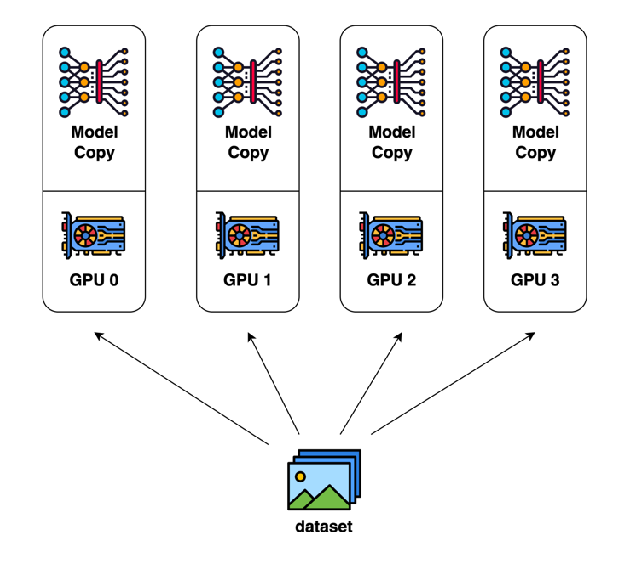

*图 7.5-1 朴素数据并行中的内存使用情况*

在普通的数据并行内存账本里，每个 rank 都要保存一份参数、梯度和优化器状态。图 7.5-1 使用一组教学账本假设：参数 2 B/param、梯度 2 B/param、优化器状态 $K=12$ B/param（FP32 master weights 4 + Adam 一阶矩 4 + 二阶矩 4），因此 baseline 是 **16 B/param**。

后面 “Pure BF16 training with Kahan summation” 的表格使用 **12 B/param** 作为另一个精度/优化器假设；常数会随训练设置变化，核心问题始终是哪些状态在每个 rank 上复制，哪些状态可以分片。

## 7.6 ZeRO / FSDP

朴素 DP 复制参数、梯度和优化器状态，扩卡只能加算力、不能扩展单卡模型容量。这一节沿"逐步把复制状态换成分片状态"的路线展开 ZeRO 三个阶段：先分片 optimizer state（ZeRO-1），再分片梯度（ZeRO-2），最后连参数也按需 all-gather（FSDP / ZeRO-3）；并把每阶段的内存收益写到同一张表里（通信代价另在正文里给出：ZeRO-1/2 约 $2\Psi$，ZeRO-3 约 $3\Psi$）。

### 7.6.1 ZeRO 解决 DP（数据并行）的内存开销问题

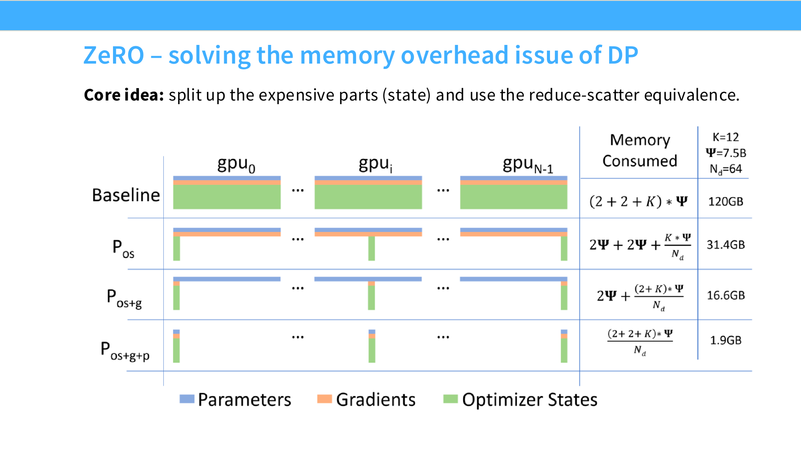

*图 7.6-1 ZeRO 解决 DP 内存开销：逐步把 optimizer states、gradients、parameters 从复制状态换成分片状态*

图中蓝色是 parameters，橙色是 gradients，绿色是 optimizer states。左侧的 `P_os`、`P_os+g`、`P_os+g+p` 分别表示只分片 optimizer states、再分片 gradients、再分片 parameters。

通过图示可以直观看到，optimizer states 往往是内存账本里的大项。ZeRO 保持模型计算路径基本不变，把昂贵状态拆到不同 rank 上，并利用 reduce-scatter / all-gather 与 all-reduce 的通信等价关系维持正确更新。

以数十亿到数百亿参数模型为例，若每个 rank 都复制完整参数、梯度和优化器状态，总显存会随 GPU 数量线性重复，扩卡只能加算力，不能扩展每个模型副本可用的状态容量。

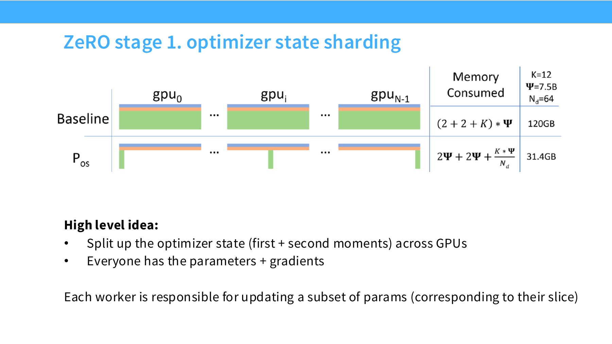

*图 7.6-2 优化器状态分片*

参数和梯度跨设备复制是朴素数据并行的默认做法，但 optimizer states 不需要在每个 rank 上完整复制。按 ZeRO 论文的 7.5B / $N_d = 64$ 案例，只分片 optimizer states 时，每卡内存占用可从 **120 GB 降至 31.4 GB**；同时分片 optimizer states 和 gradients 后可降至 **16.6 GB**；optimizer states、gradients、parameters 三者全部分片后，可降至 **1.88 GB**。这些数字说明 ZeRO 的三个阶段是在逐步减少“每个 rank 都复制一份”的状态。

> 这组数字来自 ZeRO 论文 Figure 1 的案例设定：模型规模 $\Psi = 7.5$B、DP degree $N_d = 64$、优化器状态倍率 $K = 12$，对应 fp16 混合精度 Adam（fp16 参数 2Ψ + fp16 梯度 2Ψ + fp32 master weights 与 Adam 一二阶矩 12Ψ = 16Ψ baseline）。Figure 1 给出四档数字：**120 GB → 31.4 GB → 16.6 GB → 1.88 GB**，分别对应 baseline DP / ZeRO-1 (optimizer states 分片) / ZeRO-2 (+ gradients 分片) / ZeRO-3 (+ parameters 分片)；论文 Table 1 按 DP degree 列出同一组数字（$N_d = 64$ 行为 31.4 / 16.6 / 1.88，$N_d = 1$ 行为 120）。详见 [Rajbhandari et al., ZeRO, arXiv:1910.02054](https://arxiv.org/abs/1910.02054)。

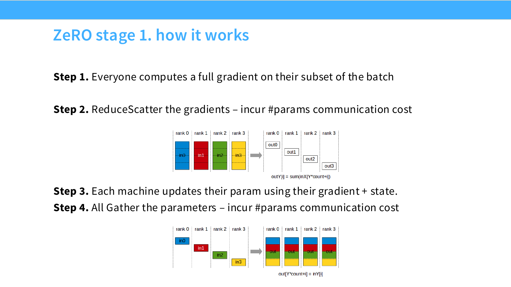

*图 7.6-3 ZeRO 工作阶段 1*

**第一步**：假设每个 GPU 获取不同的数据点。假设有 GPU 0 到 GPU 3，每个 GPU 处理单个样本，并基于自有样本计算完整梯度。

**第二步**：执行**梯度 reduce-scatter** 操作，收集每个 GPU 持有的梯度。假设 GPU 0 负责前四分之一参数。通过 reduce-scatter，GPU 0 可以获得其他 GPU 针对其负责参数子集的梯度信息。这样它就汇集了来自 GPU 1/2/3 的梯度信息，全部归约到 GPU 0 中。现在 GPU 0 拥有更新自身参数所需的所有信息，持有对应第一部分参数的优化器状态，也拥有该部分完整的聚合梯度。

**第三步**：使用梯度和状态对这部分参数执行梯度更新。

**第四步**：GPU 0 已经得到该参数 shard 的更新版本，最后通过 all-gather 把各 rank 更新好的参数 shard 重新拼回每个设备上的完整参数。

这里的关键是我们正在进行 reduce-scatter 和 all-gather。reduce-scatter 加上 all-gather 的成本与 all-reduce 相同。我们之前在所有梯度上进行 all-reduce，以确保每个人的梯度同步，那会产生约 2 倍参数量的通信。我们可以在 reduce-scatter 和 all-gather 两个步骤之间进行一些计算，获得相同通信成本下更多的计算重叠机会。

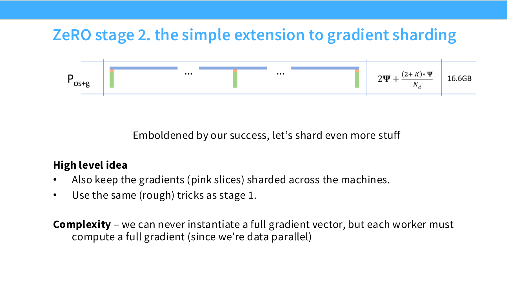

*图 7.6-4 ZeRO 工作阶段 2*

ZeRO stage 2 在 stage 1 的基础上继续分片 gradients，但 parameters 仍然在每个 rank 上保持完整副本。这样做降低的是梯度和 optimizer states 的峰值显存：反向传播逐层产出 `dW_l` 后，可以立刻对这一层梯度做 reduce-scatter，把对应 shard 交给负责该参数分片的 rank，并释放本地完整梯度。

因此图 7.6-4 的内存账本是“完整参数 + 分片梯度 + 分片优化器状态”。它没有像 ZeRO stage 3 那样按需 all-gather parameters，所以计算路径仍接近普通数据并行；收益来自避免在每个 rank 上长期保留完整梯度和完整 optimizer states。

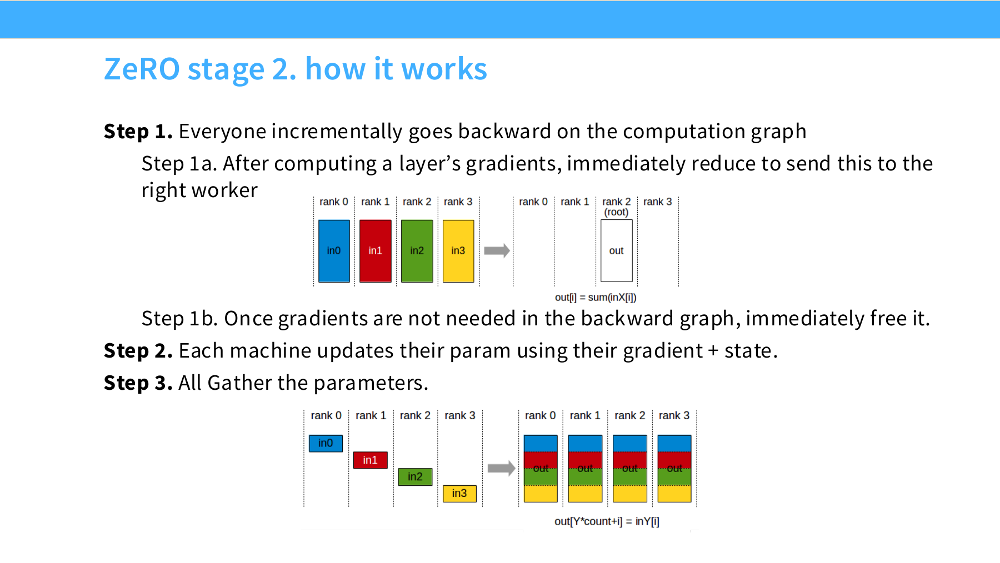

*图 7.6-5 ZeRO 工作阶段 2 的工作流程*

具体的过程是在反向传播中**边算梯度、边分片梯度**。这里的“某层梯度算完”指这一层参数的梯度 `dW_l` 已经由 backward 产出；这一层的 optimizer update 仍然发生在对应 shard 的梯度聚合完成之后。

以 4 层网络为例，前向按 `L1 -> L2 -> L3 -> L4` 执行，反向按 `L4 -> L3 -> L2 -> L1` 返回。反向经过 `L4` 时会产出两类量：一类是第 4 层参数梯度 `dW4`，另一类是继续传给前一层的输入梯度 `dX4`。

`dX4` 必须继续往 `L3` 传；但 `dW4` 一旦算出来，就可以立刻 reduce-scatter 到负责第 4 层参数 shard 的 rank，并在本地释放完整梯度。随后 `dW3`、`dW2`、`dW1` 也按相同方式处理。

```text
时间 →
反向计算:   [算 dW4] -> [算 dW3] -> [算 dW2] -> [算 dW1]
通信:       [rs dW4====] [rs dW3====] [rs dW2====] [rs dW1====]
释放显存:    [dW4 free ] [dW3 free ] [dW2 free ] [dW1 free ]
```

如此循环往复，每个 rank 只保留自己负责参数 shard 的聚合梯度，也拥有该 shard 对应的优化器状态；不再需要在显存中常驻完整梯度向量。各 rank 更新自己的参数 shard 后，再通过 all-gather 整合参数。ZeRO 第二阶段仍然依赖逐层同步和调度，但总体带宽量级仍接近 stage 1，主要新增的是实现复杂度和调度开销。

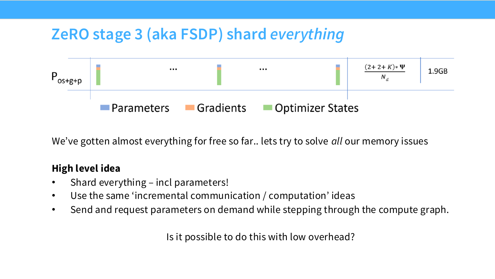

*图 7.6-6 ZeRO 工作阶段 3*

最后来到 ZeRO 第三阶段，更复杂但收益也更大，现在**所有组件**（包括参数）都可以根据 GPU 数量进行**均分**，实现最大程度的内存节省。FSDP（全分片数据并行）可以看作 ZeRO 第三阶段的具体实现。

**核心思路**是对所有组件（包括参数）进行分片，并延续 ZeRO 第二阶段的增量通信计算策略，避免保存庞大的梯度向量。在遍历计算图（包括前向和反向传播）时，按需 all-gather 参数、计算后释放，反向阶段再 reduce-scatter 梯度。关键在于把这些通信尽量和计算重叠。

FSDP / ZeRO-3 的关键问题是：参数不常驻完整副本后，如何在需要计算某一层时临时拿到完整参数，并把额外通信尽量藏到计算后面。

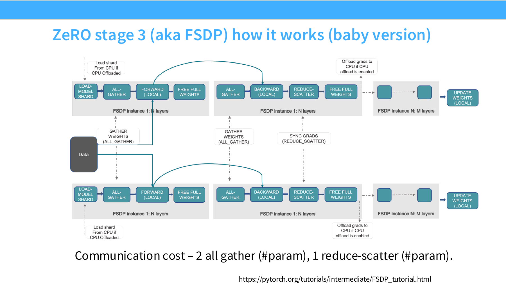

*图 7.6-7 FSDP 的原理*

上图把每个 FSDP block 画成一段很短的流水线：先 `LOAD-MODEL-SHARD`，再 `ALL-GATHER` 把当前层需要的完整权重临时拼出来，接着做 `FORWARD (LOCAL)`，然后立刻 `FREE FULL WEIGHTS`。

反向时同样先 `ALL-GATHER` 这一层的权重，做 `BACKWARD (LOCAL)`，把梯度通过 `REDUCE-SCATTER` 分回各个 shard，最后再 `FREE FULL WEIGHTS`。本地只保留分片后的状态并执行 `UPDATE WEIGHTS (LOCAL)`；图里上下两条轨道表示计算与通信尽量重叠，弯箭头表示前向产生的激活要保留到反向阶段使用。

> [!NOTE]
> 这里的 `ALL-GATHER` 是所有 rank 一起参与的一次 collective：每个 rank 都会临时拿到这一层的完整参数，用来在本地计算自己的 batch shard；它不是 `world_size` 次独立的全量 gather。FSDP 也不会自动把 `activation` 分发到别的 rank，activation 仍由各 rank 为本地数据保留。

若暂不考虑 activation，这种模式非常理想：当前层的参数只在需要时临时 all-gather，算完就释放，因此常驻参数显存很低。反向传播也遵循同样逻辑：每次在某层开始 backward 前按需 all-gather 该层参数，梯度算完后立刻 reduce-scatter，把梯度分回对应 shard，再释放完整参数。最终既可释放不需要的梯度数据，也能释放参数，得到完整更新的模型。

这里需要关注三种核心操作：**两次 all-gather 和一次 reduce-scatter**。一次 all-gather 用于前向按需重组参数，另一次 all-gather 用于反向所需参数，reduce-scatter 用于把梯度归约并分发回对应 shard。从概念上看，这比 ZeRO 第二阶段多了参数按需重组，因此总通信成本从约 2 倍参数量增加到约 3 倍参数量，还需要承担通信等待带来的额外开销。

如果每次计算前都同步等待参数传完，ZeRO-3 会很慢；实际系统会通过预取和通信/计算重叠降低等待时间。直觉上，当前层在算的时候，下一层的 all-gather 已经可以在通信流上提前发起。

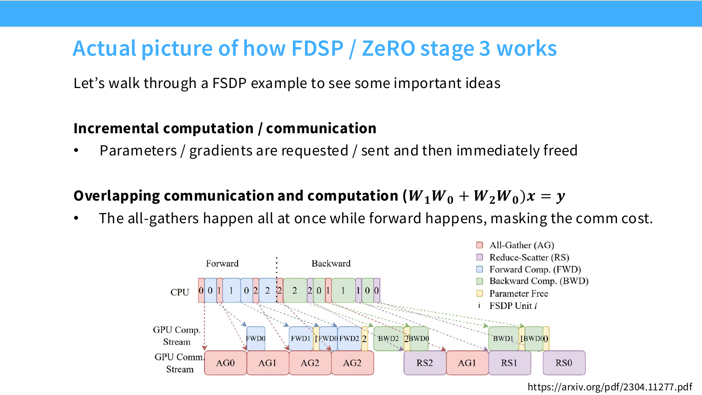

*图 7.6-8 FSDP / ZeRO-3 工作流程*

图 7.6-8 分成三条轨道：`CPU` 这一行表示调度端，`GPU Comp. Stream` 表示本地计算，`GPU Comm. Stream` 表示 all-gather / reduce-scatter 这类通信。FSDP 每次只为当前 FSDP unit 临时拼出完整参数副本，用完就释放掉这份副本。

图里给的 $(W_1 \cdot W_0 + W_2 \cdot W_0) x$ 是一个小例子，用来说明同一份参数可以在前向里被复用，所以通信可以提前发起、计算可以继续推进。

> [!NOTE]
> 图里的 `AGi` 和 `Free i` 是一一对应的：`AGi` 表示把第 `i` 个 FSDP unit 的临时完整参数 all-gather 出来，`Free i` 表示把这份临时完整参数缓冲区释放掉。因为同一层在前向和反向各要用一次，所以同一个 `AG2` 会在前向出现一次、在反向再出现一次；它们对应两次不同的临时生命周期，不能视为一次 gather 的复用。
> 图中的 `CPU` 轨道更像调度层，模型计算仍在 GPU 计算流上完成；调度层提前把下一次 all-gather 发起来，让通信尽量被后面的计算覆盖。

顺着这个时间线，可以把 FSDP 的执行概括成一个模板：

- 前向阶段：`AGi` 把第 `i` 个 unit 的完整参数临时拼出一份完整副本，`FWDi` 用这份完整副本做本地前向，随后 `Free i` 释放这份临时副本。
- 反向阶段：同一个 unit 再走一次 `AGi -> BWDi -> RSi -> Free i`，先拿到完整参数，再算本地 backward，然后把梯度 reduce-scatter 回各个 shard。

图里的 `AG2` 出现两次，对应 unit 2 在前向和反向的两次独立生命周期。图中的黄色块就是对应的 `Free i`：释放的是这次临时 all-gather 出来的完整参数副本，原始 shard 仍然保留。

从系统实现上看，下一层的 all-gather 可以在上一层计算时提前发起，于是 `AGi`、`FWDi`、`Free i` 会和 `AG(i+1)` 交错进行，形成一种很短的流水线。这样做的目的就是把通信尽量藏到计算后面。ZeRO 论文 §7.2.2 推导出 ZeRO-3（$P_{os+g+p}$）的总通信量是 $3\Psi$（$\Psi$ 是参数规模），为 baseline DP 的 1.5 倍；论文 §1 在列举 ZeRO-DP 三个阶段时把这一代价称作 "a modest 50% increase in communication volume"，换来的是与 $N_d$ 成正比的显存缩减。

反向传播阶段仍然要付通信成本，因为每个 FSDP unit 需要 all-gather 参数、计算 backward、再 reduce-scatter 梯度。和 ZeRO-1/2 近似 2 倍参数量通信相比，ZeRO-3 / FSDP 多了一次参数 all-gather，因此常用的教学账本会把它记成约 **3 倍参数量通信**。实际 wall time 取决于预取、重叠程度、网络带宽、层计算量和 bucket 策略；通信隐藏得越好，额外等待越小。

参数预取仍需要临时缓冲区，读取当前层权重也会产生一定开销；更重要的是，前面还没有处理 activation memory。前向保留下来的 activation 会在反向前持续占用显存，因此 ZeRO-3 / FSDP 能大幅缓解参数、梯度和优化器状态内存，但不直接消除 activation memory。

### 7.6.2 ZeRO 三阶段小结

从资源核算角度看，ZeRO 的三阶段可以理解为“逐步把复制状态换成分片状态”：

- **ZeRO-1**：分片优化器状态，参数和梯度仍复制。
- **ZeRO-2**：再分片梯度，减小反向阶段的梯度驻留显存。
- **ZeRO-3 / FSDP**：连参数也分片，前向/反向按层做 all-gather，反向再做 reduce-scatter。

ZeRO 的意义是在不要求模型结构改写的前提下，把 DDP 的复制成本逐步换成可重叠的通信成本。这也是 FSDP 广泛流行的原因：它对模型结构约束较少，适合作为通用的分片外壳。

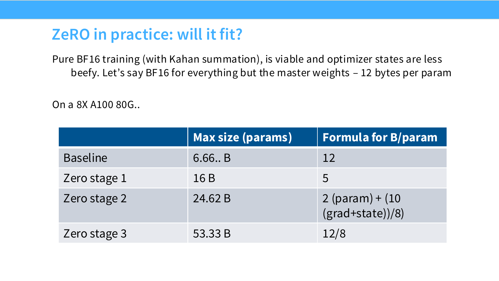

*图 7.6-9 ZeRO 实践：模型能否放下*

图 7.6-9 换一个精度假设回答“模型能否放下”：纯 BF16 训练（配 Kahan summation）时 master weights 之外都用 BF16，账本降到 **12 B/param**（参数 2 + 梯度 2 + 优化器状态 8，其中优化器状态 8 = FP32 master weights 4 + BF16 Adam 一阶矩 2 + BF16 Adam 二阶矩 2）。在一台 8×A100 80G 上，每卡 80 GB 预算除以各阶段的每参数字节数，得到可放下的最大模型规模：

| 阶段 | 每参数字节数 | 最大模型规模 |
| --- | --- | ---: |
| Baseline（无分片） | 12 | 6.66 B |
| ZeRO-1（分片 optimizer states） | 2 + 2 + 8/8 = 5 | 16 B |
| ZeRO-2（+ 分片 gradients） | 2 + (2 + 8)/8 = 3.25 | 24.62 B |
| ZeRO-3（+ 分片 parameters） | 12/8 = 1.5 | 53.33 B |

同一台机器上，ZeRO-3 能放下的模型规模是 baseline 的 8 倍，正好等于 DP degree。这里只统计模型状态，不含 activation、临时缓冲和通信 buffer，因此给出的是上界，实际配置还要留出这几项的余量；硬件换成 B200 和更大的 NVLink 域后容量数字会变化，分片把复制状态换成更大可训练模型这一关系保持不变。

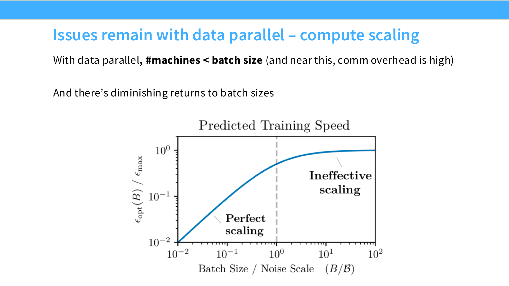

*图 7.6-10 数据并行的计算扩展问题*

数据并行的扩展会受到**全局 batch** 的约束：它相当于把 batch 切给更多 GPU 来换吞吐，但 batch 一旦接近 critical batch size，再继续堆 DP 往往只是在增加同步，却不能按比例提升样本效率。更重要的是，纯 DP/ZeRO 对 activation 显存帮助有限，因此模型做大、序列拉长后，仍需要引入 TP、PP、sequence parallelism 或 context parallelism 这类模型与 activation 维度策略。

另一类做法是把模型计算本身切开，让不同设备负责不同层段或不同矩阵切片。这样可以在不继续放大全局 batch 的情况下扩展显存容量。

和 ZeRO-3 / FSDP 相比，模型并行通常传递 activation 或 activation gradient；这会改变通信量和调度方式，因为 activation 的大小、生命周期和参数并不相同。

---

## 7.7 流水线并行（Pipeline Parallelism，PP）

朴素按层切分会留下大量空闲窗口：前一阶段没发出 activation，下一阶段只能等。这一节从"为什么朴素 layer-wise 浪费算力"出发，把 pipeline 切到 micro-batch 这一刀，再把 bubble 占比写成 $(n_\mathrm{stages}-1) / n_\mathrm{micro}$；最后看 zero-bubble 这类用通信与调度进一步压缩空闲窗口的进阶做法。

DP 和 ZeRO/FSDP 先从 batch 和模型状态下手：DP 沿 batch 维复制模型，ZeRO/FSDP 把参数、梯度和优化器状态分片。但全局 batch 不能无限放大，且 activation memory 仍可能成为主瓶颈。模型并行开始切模型本身，最常见的另一条路线是沿深度切的流水线并行（PP），与下面 §7.8 张量并行（TP）形成对照。

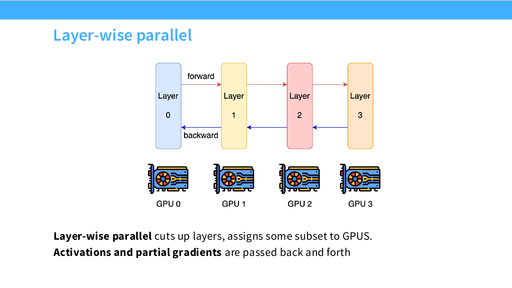

*图 7.7-1 逐层并行*

最直观的模型并行是按层切分：前几层放在一组 GPU 上，后几层放在另一组 GPU 上，前向时传 activation，反向时传 activation gradient。这确实能减少单个设备上的参数和激活压力，但朴素逐层执行会让大多数设备长时间等待。

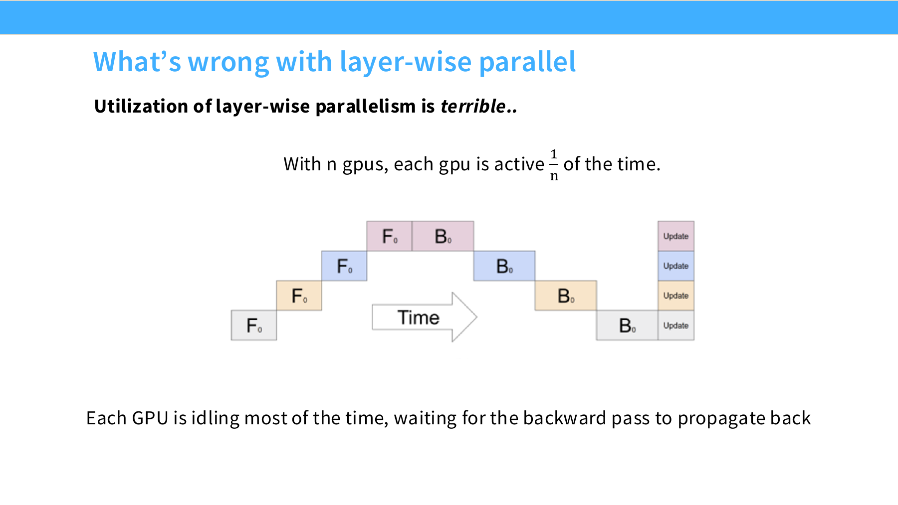

*图 7.7-2 逐层并行的问题*

图 7.7-2 展示的是最坏的直觉：一个样本先经过第 1 个阶段，再经过第 2 个阶段，后面的阶段只能等前面的 activation 到达。阶段数为 $n$ 时，单个设备有效工作时间可能接近 $1/n$ ，其余时间就是 pipeline bubble。按层切分解决了“放不下”的问题，但还没有解决“吃不满 GPU”的问题。

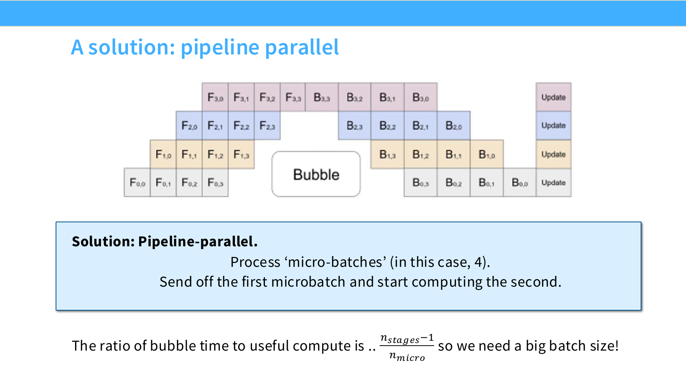

*图 7.7-3 流水线并行方案*

流水线并行的核心补救方法是把一个 batch 切成多个 **micro-batch**。第一个 micro-batch 通过第 1 个阶段后，就把 activation 传给第 2 个阶段；与此同时，第 1 个阶段继续处理第二个 micro-batch。这样不同阶段可以同时处理不同 micro-batch，空闲时间被摊薄。

图中用 $n_{stages}$ 表示流水线阶段数，用 $n_{micro}$ 表示 micro-batch 数量。填满和排空流水线都会带来等待，pipeline bubble 的空闲开销量级由 $n_{stages} - 1$ 决定；micro-batch 越多，这部分开销越容易被平摊。一个常用粗略估算会把 bubble time 相对 useful compute 写成

$$
\frac{n_{stages} - 1}{n_{micro}}
$$

如果把分母也计入 bubble 本身，更接近 bubble fraction 的写法常见为

$$
\frac{n_{stages} - 1}{n_{micro} + n_{stages} - 1}
$$

两种写法服务的直觉相同：阶段越多，填充/排空流水线带来的空闲窗口越大；micro-batch 数量越多，pipeline bubble 越容易被摊薄。这也解释了 batch 为什么是资源：同一份全局 batch 既可以分给 DP 扩吞吐，也可以切成更多 micro-batch 来提高 PP 利用率；但 batch 受 critical batch size 约束，不能无限放大。

流水线并行仍然常用，是因为它的通信模式很适合跨慢链路：相邻阶段之间主要传 activation，通信量约和 $\mathrm{bsh}$ 同阶，其中 $b$ 是 micro-batch 大小， $s$ 是序列长度， $h$ 是 hidden size。相比 TP/FSDP 里频繁的 collective，PP 的点对点通信更容易放到节点间或更慢的网络层级；但它并非拓扑无关，带宽、延迟和调度策略仍会直接影响 bubble 和吞吐。

> [!TIP]
> PP 的定位可以这样记：它擅长解决“模型太深或太大，单个高速域放不下”的问题；代价是要用足够多 micro-batch 来隐藏 pipeline bubble。TP 更适合放在节点内高速互联，PP 更能容忍跨节点慢链路。

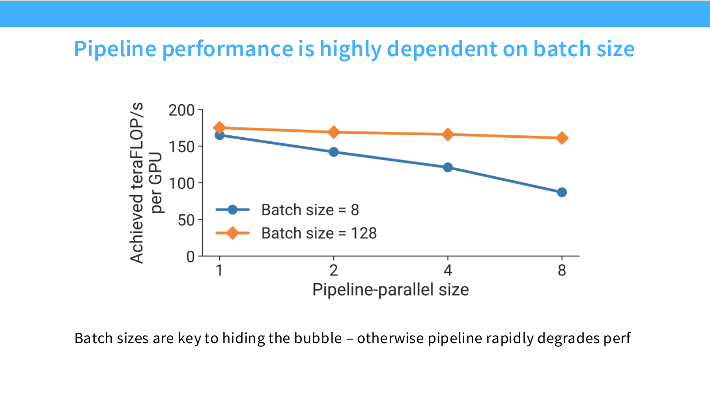

*图 7.7-4 batch size 和利用率关系*

图 7.7-4 展示 batch 与利用率的趋势：batch 太小时，可切出的 micro-batch 少，pipeline bubble 很难摊薄；batch 足够大时，即使 pipeline stages 增加，利用率也能维持在较高水平。这再次说明 batch 同时被 DP 和 PP 消耗，是并行策略里的有限资源。

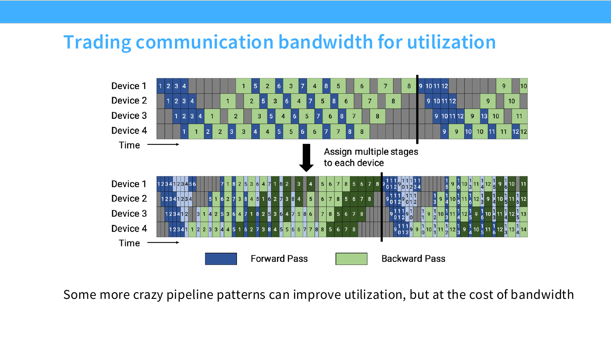

*图 7.7-5 通信带宽换利用率*

更复杂的流水线调度会把每个物理设备上的层段继续拆成多个 **virtual pipeline stages**，让前向和反向片段更密集地交错。

这样可以用更多阶段间通信和更复杂的调度，换取更少的空闲窗口。图 7.7-5 展示的是用通信带宽换更高 pipeline 利用率的取舍。

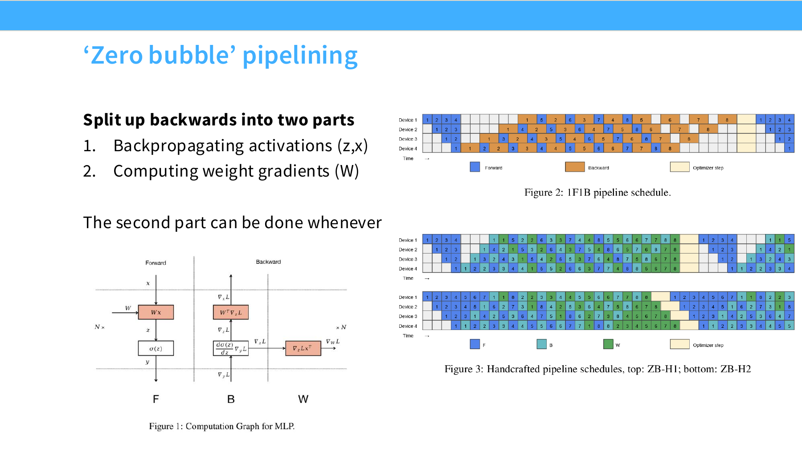

*图 7.7-6 zero-bubble pipeline 技术*

zero-bubble pipeline 直接利用 backward 的依赖结构。反向传播里有两类计算：一类是把 activation gradient 继续传回前一阶段，图中记作 `B`，它在关键路径上；另一类是计算本层权重梯度，图中记作 `W`，它更像叶子计算，可以延后到空闲窗口执行。

于是调度器可以先推进关键路径上的 `B`，再把 `W` 塞进原本的 bubble。

这类方法的教学价值在于说明：PP 的难点主要来自生产级调度。生产系统需要同时处理前向、反向、权重梯度、异步通信、激活释放和重计算；zero-bubble pipeline 还要显式拆开 backward 的依赖关系。

## 7.8 张量并行（Tensor Parallelism，TP）

TP 沿矩阵乘法的宽度切分：把大矩阵切成子块在不同 rank 上算，再在边界处合并。与 PP 比，TP 没有 pipeline bubble，但每个 Transformer block 都会产生 activation-sized collective。这一节从 columnwise / rowwise 的对偶结构出发，写出每层通信量级 $8bsh (n_\mathrm{devices}-1) / n_\mathrm{devices}$，并解释为什么 TP 通常被限制在 NVLink 域内。

流水线并行沿网络深度切分，张量并行则沿矩阵乘法的宽度切分。LLM 的大部分参数和 FLOPs 都集中在 attention projection 和 MLP projection 这些矩阵乘法里，因此把大矩阵拆成多个子矩阵是很自然的模型并行方式。

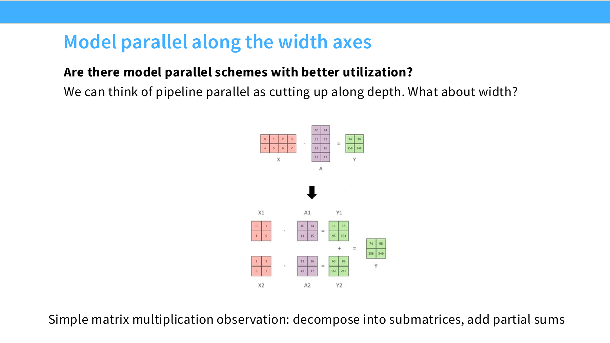

*图 7.8-1 宽度维度模型并行*

对矩阵乘法 $X \cdot A = Y$ 来说，可以把矩阵切成多个子块，在不同设备上计算局部结果，再在需要的位置合并。它和 [第 6 章 §6.5 Matmul tiling](../chapter6/chapter6_GPU高性能编程.md) 的 tiling 有相同直觉：把一个大矩阵乘拆成更小的并行工作单元，只是这里的工作单元分布在不同 GPU 上。

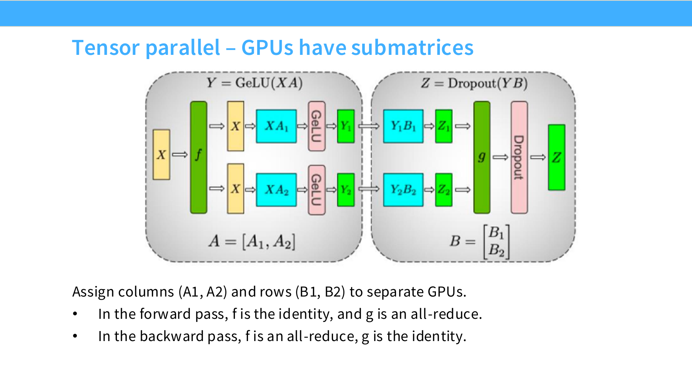

*图 7.8-2 MLP 示例*

图 7.8-2 用两层 MLP 展示 columnwise / rowwise 成对出现的原因。左侧先把 $A$ 按列切成 $A_1, A_2$ ，两个 rank 都看到同一个输入 $X$ ，分别算出 $X A_1$ 和 $X A_2$ ，于是中间激活 $Y$ 被切成两个 shard。右侧再把 $B$ 按行切成 $B_1, B_2$ ，各 rank 计算自己的局部贡献，最后通过 all-reduce 把局部贡献相加得到完整输出 $Z$ 。

图中的 `f` 和 `g` 表示并行区域两端的边界函数。forward 时，`f` 是 identity，`g` 是 all-reduce；backward 时依赖方向反过来，`g` 是 identity，`f` 是 all-reduce。这个对偶关系说明：TP 不会消除通信，只是把通信放在矩阵切分的边界上。

常用 TP 切分方式可以概括成下面这张小表。判断时看这个矩阵乘是在产生更宽的中间表示，还是在把多个局部结果合回残差流：

| 切分方式 | 常见位置 | 通信直觉 |
| --- | --- | --- |
| Columnwise | QKV projection、MLP up-projection | 按输出列切分，各 rank 产生不同 hidden shard，常和后续 rowwise 层配对 |
| Rowwise | attention output projection、MLP down-projection | 按输入行切分，各 rank 计算局部贡献，再通过 all-reduce / reduce-scatter 合并 |
| Replicated | norm、router、小型非线性或控制模块 | 参数量小、切分收益低，通常复制比单独通信更划算 |

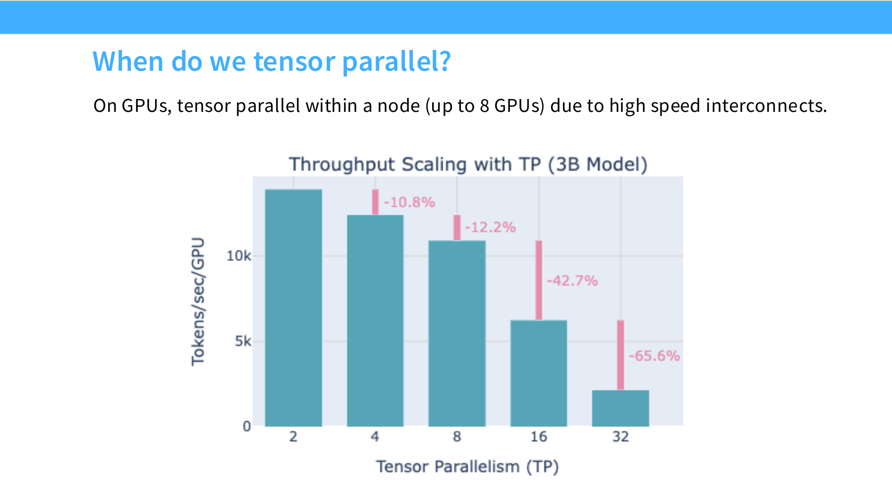

*图 7.8-3 张量并行的条件*

TP 的优势是没有 PP 那种 pipeline bubble，也不依赖增大 batch 来提高利用率；只要网络足够快，层内矩阵乘可以保持较高并行效率。缺点是通信非常频繁：TP 在每个 Transformer block 内都会产生 activation-sized collectives。pipeline 的点对点通信量通常按每个 micro-batch 约 $\mathrm{bsh}$ 估算，而 TP 的通信量级可以写成每层约

$$
8\mathrm{bsh} \frac{n_{devices} - 1}{n_{devices}}
$$

这个公式服务的判断是通信量级和通信频率：TP 通信发生在每层、每个 block 的矩阵切分边界上，因此更依赖低延迟、高带宽互联。

GPU 训练里通常把 TP 限制在节点内 NVLink / NVSwitch 域；TPU 的 mesh / torus 网络更适合规则 collective，所以可以支持更大范围的 TP。TP 上限会随模型宽度、设备拓扑和实际 benchmark 改变。

这些策略也可以组合。常见做法是节点内使用 TP 处理宽度方向的大矩阵，跨节点再叠加 PP 或 DP。DeepSeek-V3 这类系统更强调 PP/EP 和通信重叠；稠密模型则常见 TP、PP、DP 的组合。核心判断仍是：模型是否放得下，通信是否能跟上，batch 是否足够隐藏 bubble。

## 7.9 SP / CP / EP：Activation 与长上下文 / MoE 维度的并行

参数状态分片切完之后，剩余的 activation 显存、长序列 KV 和 MoE experts 又会接替成为瓶颈。这一节给出三条继续切分 activation 的路线：sequence parallelism 让 pointwise 项沿序列维度分摊、context parallelism / ring attention 让 attention 在长序列上 ring 通信、expert parallelism 让 MoE 的 experts 沿设备维度分布。

### 7.9.1 Activation Memory 与 Sequence Parallelism

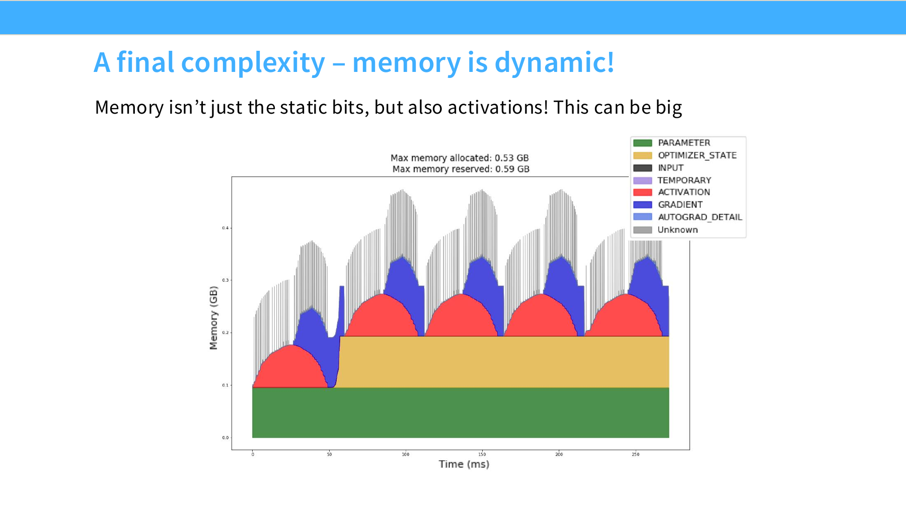

*图 7.9-1 训练内存是动态的*

前面讨论了参数、梯度和优化器状态，但训练显存还有一个动态部分：activation。前向传播会逐层保存反向所需的激活，反向传播开始后激活逐步释放，同时梯度逐步累积。因此峰值显存常出现在 backward 刚开始不久：此时还保留大量 activation，又已经开始出现梯度。

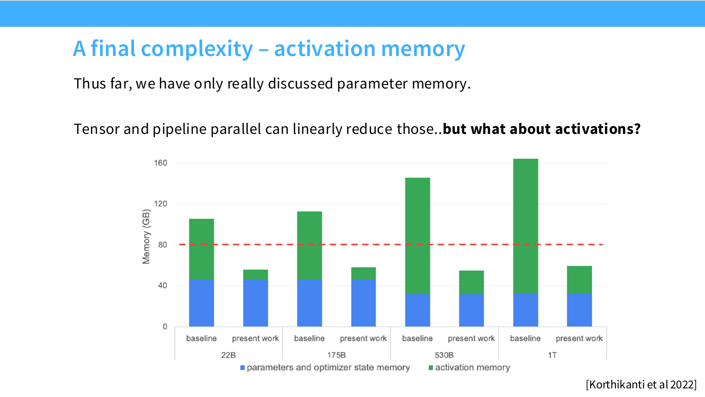

*图 7.9-2 activation memory 的使用*

张量并行和流水线并行可以降低很多参数和中间矩阵乘相关的内存，但并不能自动消除所有 activation。随着模型变大，某些 activation 项仍会持续增长；如果只分片参数状态，最终仍可能被 activation memory 卡住。

一个便于估算的每层 activation memory 起点，来自 Korthikanti et al., *Reducing Activation Recomputation in Large Transformer Models*（[arXiv:2205.05198](https://arxiv.org/abs/2205.05198)）Eq. (1)：

$$
M_{\text{act,layer}} = \mathrm{sbh} \left(34 + 5 \frac{as}{h}\right)
$$

其中 $s$ 是序列长度， $b$ 是 micro-batch 大小， $h$ 是 hidden size， $a$ 是 attention heads 数。展开后可以读成：

$$
\mathrm{sbh} \left(34 + 5 \frac{as}{h}\right) = 34\mathrm{sbh} + 5\mathrm{as}^2\mathrm{b}
$$

左边的 $34\mathrm{sbh}$ 是逐层的线性项，按 Korthikanti 等人的拆解由三部分组成：attention block 的非二次项 $11\mathrm{sbh}$、MLP block 的 $19\mathrm{sbh}$、两个 LayerNorm 的 $4\mathrm{sbh}$。右边的 $5\mathrm{as}^2\mathrm{b}$ 来自 attention 中随序列长度二次增长的项，包括 dropout mask 等存储。和 FlashAttention 的思路一样，二次项可以通过重计算或更节省存储的 attention 实现大幅削减。

在 TP 下，矩阵乘相关 activation 可以随 tensor parallel size $t$ 分摊，但仍会留下不随 $t$ 缩小的逐点项。同一篇论文的 Eq. (2) 把加入 TP 后的账本写成：

$$
\text{Activations memory per layer} = \mathrm{sbh} \left(10 + \frac{24}{t} + 5\frac{as}{ht}\right)
$$

其中 $10\mathrm{sbh}$ 由三个逐点分量构成：两个 LayerNorm（4）+ Dropout（2）+ attention / MLP 输入（4）。它们计算便宜，但如果每个 rank 都保存完整序列维度，就会成为 TP 之后剩下的显存瓶颈。

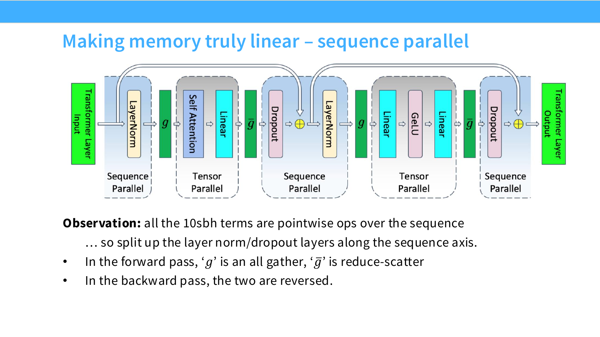

*图 7.9-3 sequence parallelism*

sequence parallelism（序列并行，SP）的目标就是处理这部分 $10\mathrm{sbh}$ 。LayerNorm、Dropout 这类操作通常沿 token 位置独立执行，因此可以把 activation 沿 sequence 维度切开，让不同 rank 只保存和处理自己的 sequence shard。

需要和 TP matmul 对接时，再在边界上使用 all-gather 或 reduce-scatter，让数据布局在“sequence-sharded”和“hidden-sharded”之间切换。

> [!NOTE]
> sequence parallelism 让 pointwise activation 常驻为 sequence shard；collective 主要发生在进入或离开张量并行矩阵乘的边界，不需要在所有位置都 all-gather 完整 activation。forward 和 backward 的 all-gather / reduce-scatter 方向互为对偶。

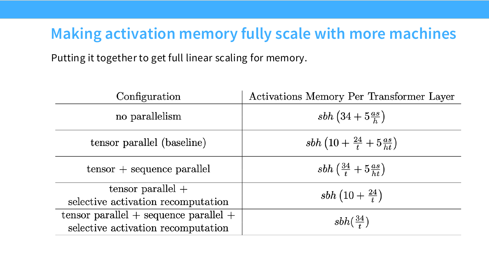

*图 7.9-4 activation memory 线性扩展*

把 TP 和 sequence parallelism 合起来看，TP 先让矩阵乘相关 activation 随 $t$ 缩小，sequence parallelism 再让剩余 pointwise activation 也随 $t$ 缩小。

再叠加 activation recomputation，就能用额外 FLOPs 换更低显存。实际判断时要识别 activation memory 中哪些项随矩阵并行缩小，哪些项需要 sequence parallelism 或重计算继续处理。

### 7.9.2 Expert Parallelism：MoE 的系统并行


*图 7.9-5 expert parallelism*

**专家并行（expert parallelism, EP）** 面向 MoE 层。它把不同 experts 放到不同设备上，再把 token activation 按 router 结果发往对应 expert。对于 MoE 的 MLP 部分，这通常比继续把 dense matmul 切得更细更自然，因为每个 expert 可以保留较大的本地 GEMM。

一次 MoE EP 前向可以按下面的系统路径读：

1. 每个 rank 先持有自己的 local batch shard 和本地 token activation。
2. `router` 对每个 token 产生 expert 选择，例如 top-k experts。
3. 系统按目标 expert 把 token activation 重新分桶，形成发往不同 rank 的发送缓冲区。
4. `all-to-all dispatch` 把 token activation 发送到持有目标 expert 的 rank。
5. 每个 rank 对收到的 token 执行本地 `expert compute`。
6. `all-to-all combine` 把 expert 输出送回 token 原来的 rank 或后续需要的位置。
7. 系统按原 token 顺序恢复 activation，并继续后面的 Transformer block。

直觉上，EP 把“每个 rank 都复制所有 experts”的参数成本变成“每个 rank 只持有一部分 experts”，同时把计算集中到 router 选中的 experts 上。代价是 token routing 会引入动态 all-to-all：如果 router 分布不均，某些 expert rank 会比其他 rank 更忙，通信 split size 也会变得不规则。

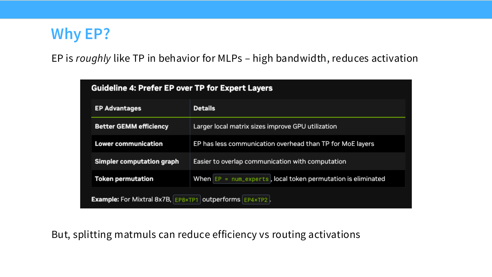

*图 7.9-6 why expert parallelism*

EP 和 TP 在系统行为上有相似处：二者都需要高带宽互联，也都在 MLP 相关计算里减少单个 rank 的 activation 或参数压力。

区别在于，TP 继续切矩阵，切得太细会让本地 GEMM 变小、GPU 利用率下降；EP 则让每个 expert 的本地矩阵乘保持较大，只把 token route 到需要的 expert。

NVIDIA [Megatron Core MoE 文档](https://docs.nvidia.com/megatron-core/developer-guide/latest/user-guide/features/moe.html) 把这条经验写进调优指南：expert layer 优先用 EP 而不是 TP，因为更大的局部 GEMM 提高 GPU 利用率，且 MoE 层上 EP 的通信开销低于 TP；文档给的例子是 Mixtral 8x7B 上 `EP8×TP1` 优于 `EP4×TP2`。这条规则只适用于 MoE expert layer，不适用于 dense attention layer。

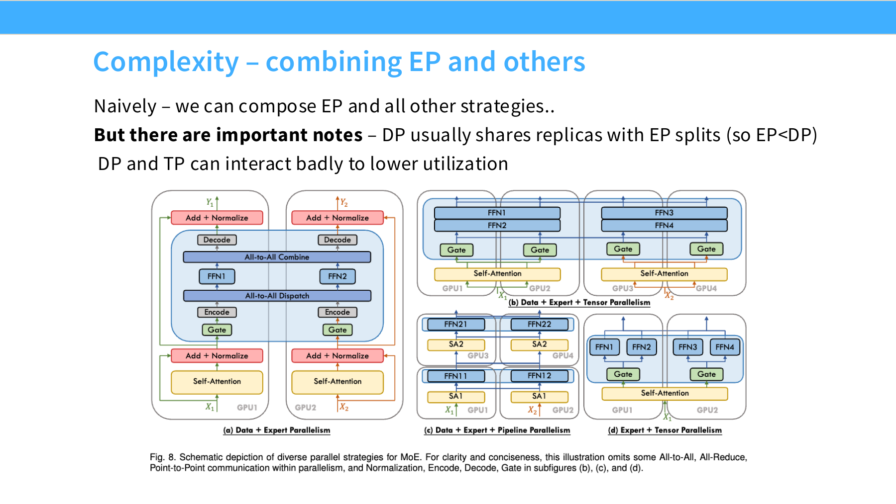

*图 7.9-7 combining expert parallelism*

在大 MoE 系统里，EP 常常还会拆成更细的组合：

- **EP**：不同专家放在不同设备上。
- **ETP（expert tensor parallelism）**：单个专家内部的矩阵乘再做张量并行。
- **EDP（expert data parallelism）**：专家副本沿数据维复制，用来扩展吞吐或缓解单个专家热点。

这些维度需要和 TP、PP、DP、SP、CP 一起选择。简单相乘并不总是可行：DP 和 EP 往往共享一部分 replica 结构，EP 的上限会受到 DP group 划分约束；TP 和 EP 也可能互相影响，因为 attention 层需要 TP/CP，而 MoE MLP 层更希望保留较大的 expert GEMM。同一层 Transformer block 里的 attention 和 MoE FFN 可能需要不同的并行组合。

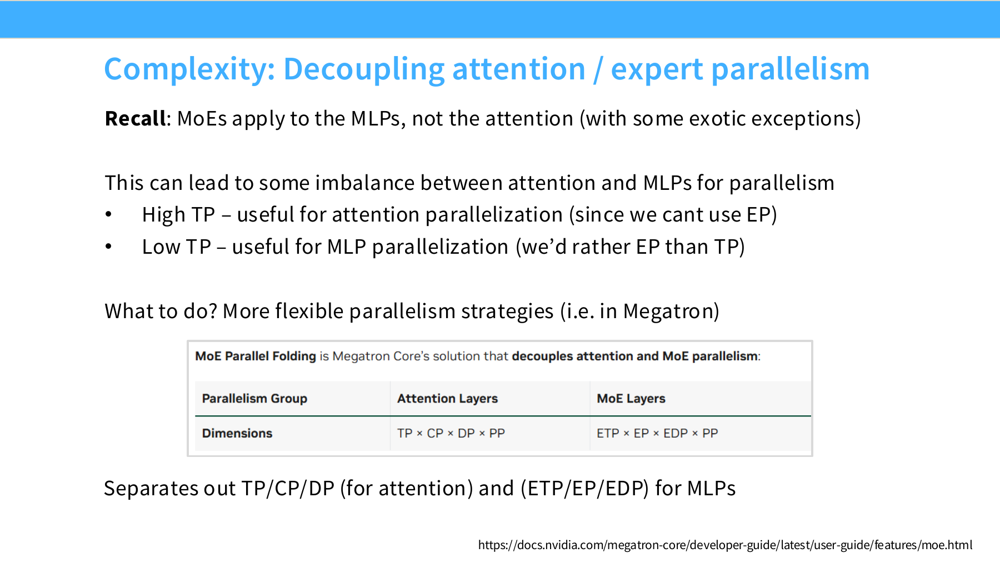

*图 7.9-8 decoupling attention / expert parallelism*

Megatron 的 MoE parallel folding 体现了这种解耦：attention layers 可以用 TP/CP/DP/PP 组合，MoE layers 则用 ETP/EP/EDP/PP 组合，两组之间只要求 PP 划分一致。这样做同时解除了上面那条 EP ≤ DP 的上限——传统映射把 EP group 放在 DP 的子组里，专家并行度就被数据并行度卡住（[Liu et al., *MoE Parallel Folding*, arXiv:2504.14960](https://arxiv.org/abs/2504.14960) §3.2）。MoE 通常替换 MLP；attention 没有 experts 可以 route token，所以不能靠 EP 解决 attention 的宽度和长上下文问题。

像 norm、router 这类参数量小但调用频繁的模块，很多系统会直接复制在各设备上，避免为它们单独设计复杂的并行切分。

### 7.9.3 Context Parallelism 与 Ring Attention

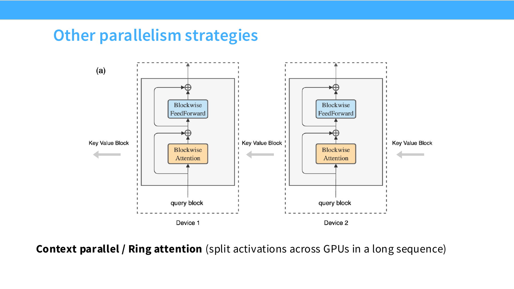

*图 7.9-9 other parallelism strategies*

**上下文并行（context parallelism, CP）/ ring attention** 面向长上下文场景。它沿序列长度切分 activation 或 KV：每个 rank 负责一段 query，key/value 按环形或其他规则在 rank 间传递，逐块完成 attention 累积。这可以降低单卡长序列显存压力，但会让 attention 本身更通信敏感。

## 7.10 混合并行与大规模训练组合

单条策略都不能同时满足显存、通信和 batch 三类约束。这一节把它们放回同一张资源表，并给出一条经验决策顺序：先判断显存瓶颈（参数 / optimizer state / activation），再选高频通信该落在哪层拓扑（NVLink vs InfiniBand），最后用 DP / gradient accumulation 把剩余算力扩满。

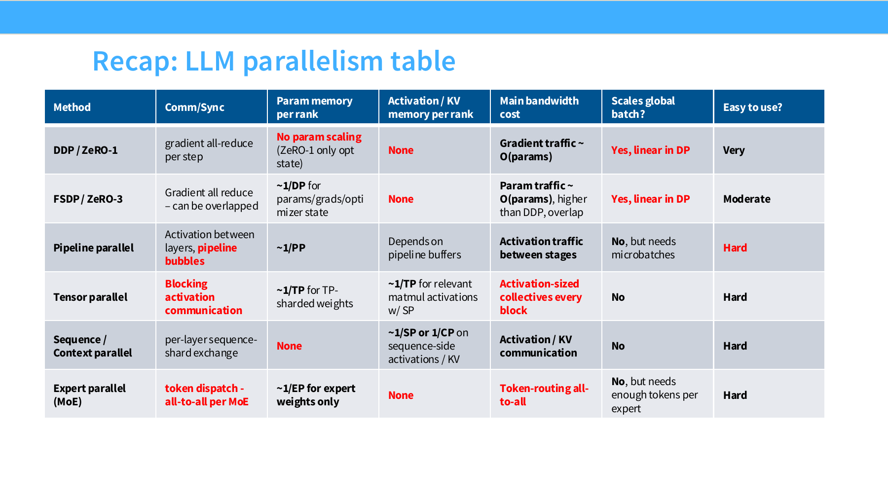

*图 7.10-1 LLM 并行策略表*

图 7.10-1 把前面的策略放在同一张资源表里。可以按三类有限资源读：

- **Memory**：DDP 不省参数显存；ZeRO-3 / FSDP 分片参数、梯度和优化器状态；PP/TP/EP 分别从深度、宽度和 expert 维度切模型；SP/CP 面向 activation 或 KV。
- **Bandwidth**：DDP/FSDP 需要参数或梯度规模的 collective；TP/SP/CP/EP 需要更频繁的 activation、sequence 或 token 通信；PP 主要是相邻阶段之间的 activation 点对点通信。
- **Batch**：DP 扩吞吐需要足够 global batch；PP 隐藏 bubble 需要足够 micro-batches；TP/SP/CP 不直接消耗 global batch，但更依赖高速互联。

因此没有单一策略严格占优。FSDP 容易作为通用外壳，但不解决 activation；TP 没有 pipeline bubble，但层内通信重；PP 省显存且适合慢链路，但调度复杂并需要 micro-batches；EP 对 MoE 高效，但受路由均衡和 all-to-all 影响。

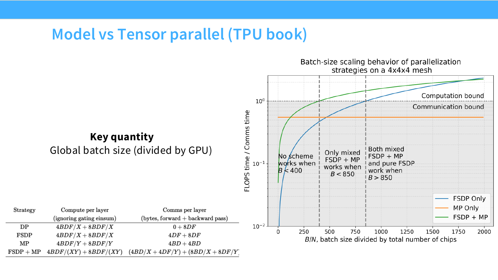

*图 7.10-2 模型并行与张量并行权衡*

图 7.10-2 的横轴是每个 chip 分到的 batch，纵轴可以理解为 compute time / communication time。高于虚线表示更接近 compute-bound，低于虚线表示通信更容易成为瓶颈。batch 很小时，纯 FSDP 可能通信占比过高；加入模型并行后，每层计算和通信的比例会变化，可以把系统推回更高利用率区域。混合并行的目标是在 batch、通信和显存约束下让计算单元尽量保持忙碌。

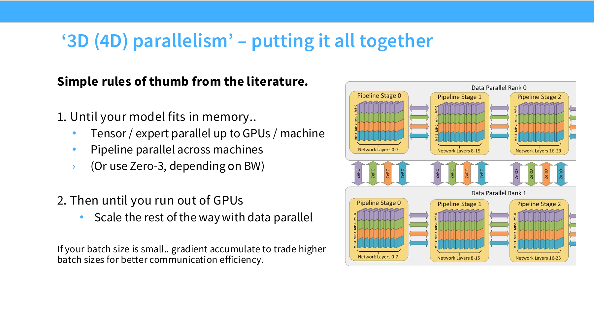

*图 7.10-3 3D 并行*

混合并行可以写成一个资源决策流程：

1. 先判断模型为什么放不下。如果主要是参数、梯度和 optimizer states，优先考虑 ZeRO-3 / FSDP；如果是层数和模型主体太大，可以加入 PP；如果是长序列 activation 或 KV，继续看 SP/CP 和 activation recomputation。
2. 再判断高频通信应该放在哪个拓扑层级。TP、SP、CP、EP 都会产生频繁 activation、sequence 或 token 通信，通常优先放在节点内 NVLink / NVSwitch 这类高速域；PP 主要是相邻 stage 点对点传 activation，更能容忍跨节点链路。
3. 模型已经能放下后，再用 DP 扩展吞吐。DP 消耗的是 global batch 资源；如果 batch 接近 critical batch size，继续加 DP 的收益会转向同步成本，样本效率很难等比例提升。
4. 如果 batch 太小导致 PP bubble 或通信开销难以摊薄，可以用 gradient accumulation 增加有效 batch，用 activation recomputation 换显存，或者重新分配 TP/PP/EP/DP 的比例。

> [!TIP]
> 混合并行的决策顺序可以记成：先解决显存，再匹配通信频率，最后用 batch 调利用率。高频细粒度通信放在最快互联里，低频或点对点通信可以放到更慢的互联层级。

下面几张案例图关注 memory、bandwidth 和 batch 的划分方式；配置数字只是特定模型和硬件下的例子。

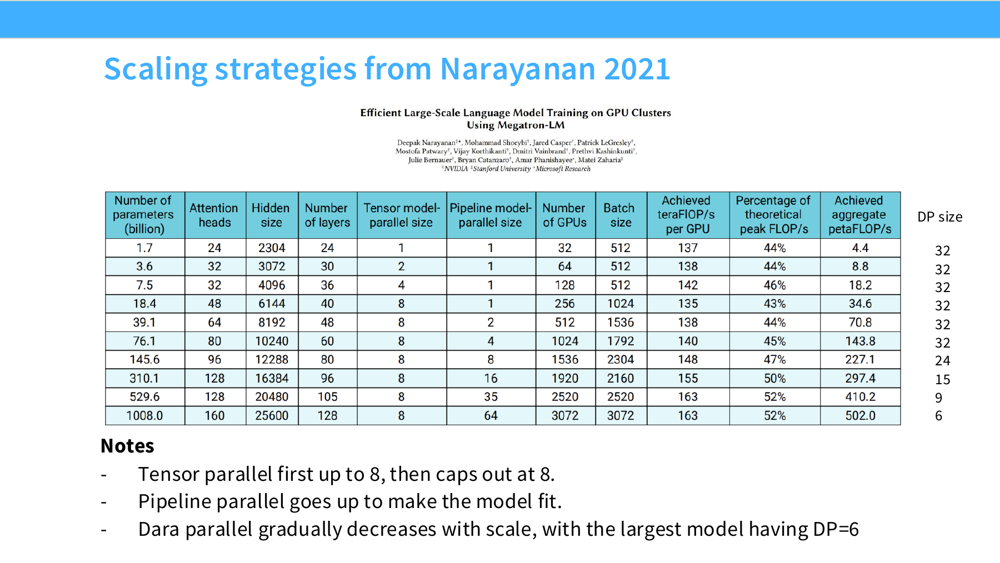

*图 7.10-4 Narayanan 论文*

Narayanan 2021 的实验（[arXiv:2104.04473](https://arxiv.org/abs/2104.04473)，*Efficient Large-Scale Language Model Training on GPU Clusters Using Megatron-LM*）展示了从 17 亿到 1 万亿参数（1.7B / 3.6B / 7.5B / 18B / 39B / 76B / 145B / 310B / 530B / 1T）模型的 3D 并行配置；论文另以 GPT-3 175B 作为参照配置。表格说明：随着模型变大，单靠 DP 不够，需要逐步增加 TP 和 PP；但只要组合得当，模型 FLOPs utilization 仍能维持在较高区间。

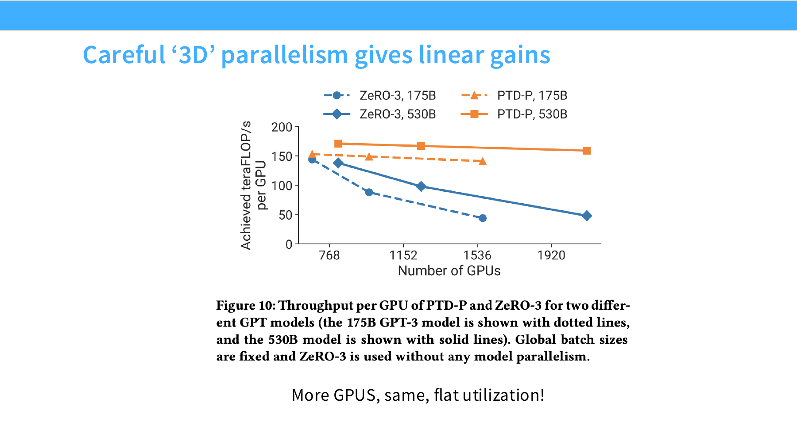

*图 7.10-5 3D 并行的收益*

图 7.10-5 延续同一结论：TP 先在节点内增加，到合适互联范围后停止；模型继续变大时，PP 开始增加；DP 则使用剩余设备扩吞吐。模型越大，越多设备要先用于让模型和 activation 放得下，剩余设备再用于 DP 扩吞吐。

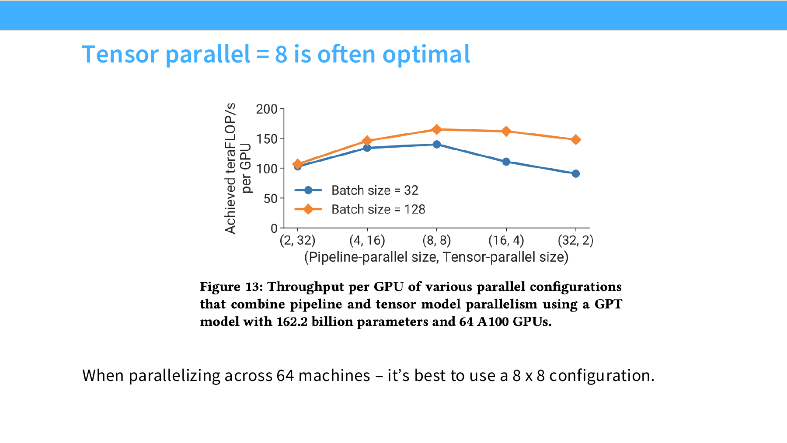

*图 7.10-6 张量并行度 8 的经验最优*

图 7.10-6 展示的是对应硬件和模型设定下的经验现象：TP = 8 经常是节点内较好的选择，因为它通常对应单机高速互联域。这个数字会随 GPU 数、互联、模型宽度或 batch 改变，实际配置仍需要 benchmark。

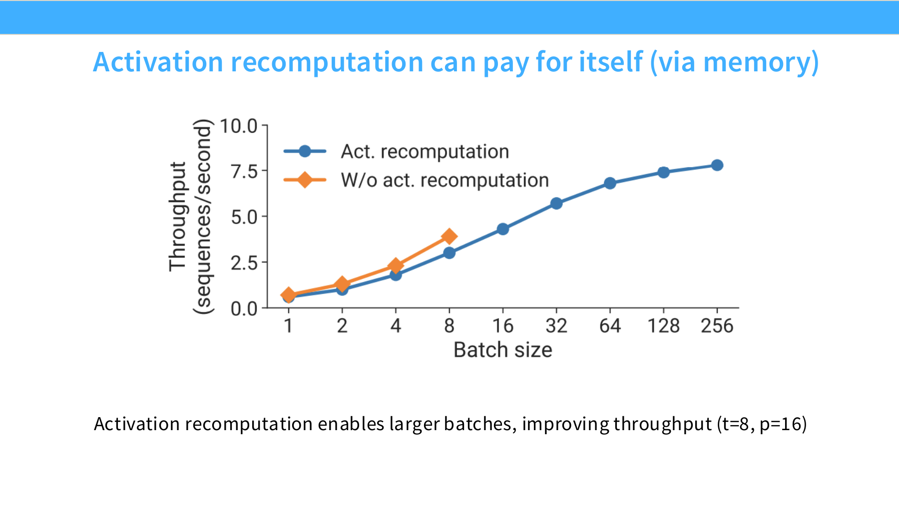

*图 7.10-7 激活重计算的收益*

图 7.10-7 说明 activation recomputation 可能“自己付回成本”：它增加 FLOPs，但节省显存后可以支持更大 batch；更大的 batch 又能帮助隐藏 pipeline bubble 或摊薄通信，从而提高整体吞吐。这个取舍和 FlashAttention 类似：多算一点，少存和少搬很多。

多篇技术报告展示了这些规则的实际组合。OLMo / Dolma 这类 7B 级 dense 模型可以主要依赖 FSDP，因为参数状态还可以用通用分片外壳处理。Gemma 2 走的是 TPU 路线：27B 用 6,144 颗 TPUv5p，768-way data 分片配 8-way model 分片，optimizer state 再按类 ZeRO-3 的方式切开。Llama 3 405B 这类超大 dense 模型没有 expert 可切，通常需要 TP、CP、PP 和 DP 一起分摊宽度、长上下文、深度和 batch。

DeepSeek / Qwen 这类 MoE 系统则会把 MoE FFN 的 expert 维度交给 EP/ETP/EDP，同时仍然为 attention 保留 TP/CP。案例里的并行度数字要和 dense layer、MoE layer、长上下文和网络拓扑一起理解。

训练规模继续变大后，“计算单元”不再只是单张 GPU，而是由节点内 NVLink/NVSwitch、节点间 InfiniBand/RoCE、机柜和数据中心网络共同组成的系统。并行策略要做的事，是把最频繁、最细粒度的数据交换放到最快的互联里，把更能容忍延迟的通信放到更慢的层级。

## 7.11 代表性大规模训练配置

这一节把前面所有抽象落到公开报告的真实数字：Llama 3 405B 标准上下文（DP=64/128 两档集群规模）与 128K 长上下文（DP=8）的 TP/PP/CP/DP、DeepSeek-V3 的 PP16 + EP64 + ZeRO-1（TP 压到 1）、Mixtral / Gemma 2 / Qwen3 / Nemotron 3 Super 的公开并行度。表里 `?` 字段表示一手源未公开，不在笔记里凭手感补全。

下表汇总公开来源给出的代表性大规模训练配置（`?` 表示对应论文 / 官方文档未公开的字段）：

| 模型 | TP | PP | CP | EP | DP | ZeRO | 备注 |
| --- | ---: | ---: | ---: | ---: | ---: | --- | --- |
| Llama 3 405B (标准上下文) | 8 | 16 | 1 | 0 | 64 或 128 | - | CP=1；DP=64 / 128 ([Llama 3 paper Table 4](https://arxiv.org/abs/2407.21783)) |
| Llama 3 405B (128K long-context) | 8 | 16 | 16 | 0 | 8 | - | 长上下文阶段 CP=16，DP=8 ([Llama 3 paper Table 4](https://arxiv.org/abs/2407.21783), 16,384 GPUs / 131,072 seq len) |
| DeepSeek V3 | 1 | 16 | - | 64 | - | ZeRO-1 | 16-way PP + 64-way EP（跨 8 节点）+ ZeRO-1 DP，TP 压到 1；§3.2 Training Framework 写明 "without using costly Tensor Parallelism (TP)"，DualPipe 与跨节点 all-to-all kernel 见 §3.2.1、§3.2.2（[arXiv:2412.19437](https://arxiv.org/abs/2412.19437)） |
| Mixtral 8x22B | 2 | 8 | 1 | 8 | 1 | - | TP=2 / PP=8 / CP=1 / EP=8 / VPP=7，16 节点 128 GPU（DP=1，TP×PP×EP 占满 128 卡）；来自社区维护的 [Megatron-MoE-ModelZoo](https://github.com/yanring/Megatron-MoE-ModelZoo) `runtime_configs/benchmarking/runtime.conf` benchmarking recipe，构建在 Megatron-Core 之上 |
| Nemotron 3 Super 120B-A12B | ? | ? | ? | ? | ? | - | 模型已公开（[nvidia/NVIDIA-Nemotron-3-Super-120B-A12B-FP8](https://huggingface.co/nvidia/NVIDIA-Nemotron-3-Super-120B-A12B-FP8)，120B 总参 / 12B 激活，2026-03-11），model card 只给部署侧 TP/EP；家族论文 [NVIDIA Nemotron 3, arXiv:2512.20856](https://arxiv.org/abs/2512.20856) 描述 LatentMoE 架构与 NVFP4 训练，训练侧并行度放在单独的 Nemotron 3 Super 技术报告 |
| Gemma 2 27B | 8 | 0 | 0 | 0 | 768 | ZeRO-3 类 | [arXiv:2408.00118](https://arxiv.org/abs/2408.00118) Table 3：6,144 颗 TPUv5p，768-way data 分片 + 8-way model 分片，optimizer state 另按类 ZeRO-3 方式分片（2B 为 512 chips / 512×1，9B 为 4,096 chips / 1,024×4） |
| Qwen3 235B-A22B | 2 | 8 | 1 | 32 | ? | - | 官方 [arXiv:2505.09388](https://arxiv.org/abs/2505.09388) 与 HF model card 未公开原训练并行度；以上 TP/PP/CP/EP 数值来自社区 [Megatron-MoE-ModelZoo](https://github.com/yanring/Megatron-MoE-ModelZoo) `runtime_configs/benchmarking/runtime.conf` benchmarking recipe（VPP=4，32 节点 256 GPU）。TP×PP×CP×EP=512 已超过 256 卡总数，公开 recipe 在 MoE 层引入 ETP/EDP 或专家共享以使总卡数对齐，具体数值未在仓库 README 给出；本行并非阿里原训练配置 |

> **校准说明**：表中数值仅来自公开论文 / 官方模型卡 / config.json；标 `?` 的字段在公开材料中未给出，不在此处凭手感补全。表中所有行仅作为并行方案示例，不构成任何模型团队的官方部署推荐配置。

观察到的工程模式：

- **TP 一般 ≤ 8**：节点内 NVLink/NVSwitch 提供足够带宽；超出 8 之后跨节点 TP 的 all-reduce 开销迅速失控。DeepSeek V3 paper §3.2 Training Framework 写到 "enabling us to train DeepSeek-V3 without using costly Tensor Parallelism (TP)"，是把 TP 压到 1 的代表性例证。
- **EP 可很大但极难调**：MoE 的 all-to-all 通信与 expert imbalance 互相耦合；DeepSeek V3 的 64-way EP（跨 8 个节点）依赖 DualPipe 调度和定制的跨节点 all-to-all kernel。
- **长上下文阶段会切到大 CP**：Llama 3 paper Table 4 显示标准上下文阶段 CP=1，128K 长上下文阶段 CP=16、DP 相应从 128 降到 8。DeepSeek-V3 走的是另一条路线，用 YaRN 分两阶段把窗口从 4K 扩到 32K 再到 128K，并把 batch size 从 1920 降到 480 来控制 activation（[arXiv:2412.19437](https://arxiv.org/abs/2412.19437) §4.3）。
- **DP 上限由 batch size 和硬件规模共同决定**：GPU 集群上的公开配置多落在 DP≤128（Llama 3 paper Table 4 的 DP=64/128/8）；TPU pod 上的 data 分片可以大得多，Gemma 2 的 27B 用 768-way、9B 用 1,024-way data 分片。

硬件层级方面，NVIDIA **NVL72**（GB200/GB300）把 36 张 Grace CPU + 72 张 Blackwell GPU 放进一个 NVLink domain；72-way TP 在 NVL72 内部仍然是节点内通信，可以大幅放宽"TP ≤ 8"的工程经验（[NVIDIA GB200 NVL72 数据表](https://www.nvidia.com/en-us/data-center/gb200-nvl72/)）。

## 本章总结与下章衔接

本章从 collective 语义开始，到状态分片、模型切分、activation memory、EP 和混合并行收束。每种策略都可以落回同一个资源账本：它切分哪类资源，引入哪种通信，依赖哪一层拓扑。

本章示例以 PyTorch/NCCL 为主，因为它更容易直接看到 collective 和通信边界；JAX/TPU 路线会把更多切分和调度决策交给编译器，但底层仍然面对同一组物理约束：参数和 optimizer states 是否放得下，activation 是否过大，通信是否能被拓扑和调度承受，global batch 是否还能继续扩。

更实用的结论可以压缩成一句话：**先让模型放得下，再让通信跟得上，最后再追求满算力。** 具体到策略选择时，通常先判断参数、optimizer state、activation 谁是主瓶颈，再根据节点内外带宽决定 TP、PP、DP、SP、CP、EP 的组合；“标准并行方案”只能作为起点，最终仍要由资源账本和 benchmark 校准。

资源账本只能回答"训练会不会爆"和"算力跑满没有"，不能回答"这个规模训下来是什么 loss"。下一章把视角从"训得起"切到"训得对"：[第 8 章 Scaling Laws](../chapter8/chapter8_Scaling_Laws.md) 用 IsoFLOP、Chinchilla、muP 等方法把 compute budget 拆成最优的模型规模和数据量。

对照章首学习目标，读到这里应能：

- 说出 `all-reduce`、`reduce-scatter`、`all-gather`、`all-to-all` 各自的输入输出和典型用例（§7.2）。
- 写出 DDP、ZeRO-1/2/3、FSDP 各自复制 / 分片参数、梯度、优化器状态的范围（§7.5–§7.6）。
- 区分 TP 沿宽度、PP 沿深度、SP/CP 沿序列三种切模型的维度和通信来源（§7.7–§7.9）。
- 列出 MoE 系统里 router → dispatch → expert compute → combine 四步对应的 collective（§7.9.2）。
- 在给定 NVLink / InfiniBand 拓扑下，从 §7.10 的决策流程出发组合 TP/PP/EP/DP/CP，并写出每张卡的模型状态、activation、token 路由账本（§7.10–§7.11）。

## 思考

- 给定一个 70B dense 模型 + 8×A100-80G 节点，参数状态先选 DDP 还是 FSDP？如果改成 16 节点 + NVLink-only 域内通信，4D 并行的第一刀切哪里？
- 同模型换到 MoE（8 专家、top-2），activation 是否仍按 dense 估算？all-to-all 的 split size 在不同 micro-batch 上波动多少时仍算 balanced？
- 同一段 `dist.all_reduce` 在 `world_size=4` 单节点 NVLink 与 `world_size=128` 双层 fat-tree 上的有效带宽差几倍？哪部分差距来自拓扑，哪部分来自消息大小？
- §7.6 给出 ZeRO-3 总通信量约 $3\Psi$；如果参数预取能藏掉一半通信 wall time，是否仍要把 FSDP 通信系数视为 1.5× DDP？换言之"通信代价"指的是 byte 总量还是 wall time？
- §7.10 决策流程中"先解决显存，再匹配通信频率，最后用 batch 调利用率"——这个顺序在长上下文（>32K）或超大 vocab（>200K）场景下是否仍是最优？哪一步需要前置？

## 来源与更新记录


- 参考：PyTorch distributed 文档；NCCL 文档；ZeRO/FSDP、Megatron-LM、GPipe 相关论文或文档；[NVIDIA Megatron Core MoE 文档](https://docs.nvidia.com/megatron-core/developer-guide/latest/user-guide/features/moe.html)。
- 一手来源核对（2026-09-03）：
  - Rajbhandari et al., *ZeRO*, [arXiv:1910.02054](https://arxiv.org/abs/1910.02054) — Figure 1（Ψ=7.5B / $N_d$=64 / K=12，120 → 31.4 → 16.6 → 1.88 GB）、Table 1（按 DP degree 的每卡内存）、§7.2.2（ZeRO-3 通信量 3Ψ = 1.5× baseline）；"a modest 50% increase in communication volume" 出自 §1 Extended Introduction 对三个阶段的列举，不在 abstract 里。论文按 fp16 混合精度记账。
  - Korthikanti et al., *Reducing Activation Recomputation in Large Transformer Models*, [arXiv:2205.05198](https://arxiv.org/abs/2205.05198) — Eq. (1) $\mathrm{sbh}(34 + 5as/h)$ 与 Eq. (2) $\mathrm{sbh}(10 + 24/t + 5as/(ht))$；34 拆为 attention 11 + MLP 19 + LayerNorm 4。
  - Grattafiori et al., *The Llama 3 Herd of Models*, [arXiv:2407.21783](https://arxiv.org/abs/2407.21783) Table 4 — 三阶段 TP/CP/PP/DP 配置与 MFU。
  - DeepSeek-AI, *DeepSeek-V3 Technical Report*, [arXiv:2412.19437](https://arxiv.org/abs/2412.19437) §3.2、§4.3 — 16-way PP / 64-way EP / ZeRO-1 DP；长上下文用 YaRN 两阶段扩窗。
  - Gemma Team, *Gemma 2*, [arXiv:2408.00118](https://arxiv.org/abs/2408.00118) Table 3 — 2B/9B/27B 的 chip 数与 data / model 分片数。
  - [NVIDIA NVLink 规格页](https://www.nvidia.com/en-us/data-center/nvlink/)、[GB200 NVL72 数据表](https://www.nvidia.com/en-us/data-center/gb200-nvl72/) — 第四代 NVLink 每 GPU 18 link / 900 GB/s；NVL72 为 36 Grace CPU + 72 Blackwell GPU，13.4 TB HBM3E。
  - [CS336 `lecture_07_stdout.txt`](https://github.com/stanford-cs336/lectures/blob/main/var/traces/lecture_07_stdout.txt) — §7.2.3 至 §7.4 引用的 collective 输出、耗时与带宽数值。
  - [Megatron-MoE-ModelZoo](https://github.com/yanring/Megatron-MoE-ModelZoo) `runtime_configs/benchmarking/runtime.conf` — Mixtral 8x22B 与 Qwen3-235B-A22B 的 benchmarking 并行度；该仓库由社区维护，构建在 Megatron-Core 之上。
- 一手来源核对（2026-09-04）：
  - [nccl-tests `doc/PERFORMANCE.md`](https://github.com/NVIDIA/nccl-tests/blob/master/doc/PERFORMANCE.md) — algorithm bandwidth $S/t$ 与 bus bandwidth 的修正系数（all-reduce $2(n-1)/n$ ，reduce-scatter / all-gather $(n-1)/n$ ）由 benchmark 侧计算；同一套公式见 lecture 引用的 [`all_reduce_bench.py`](https://github.com/stas00/ml-engineering/blob/master/network/benchmarks/all_reduce_bench.py)（`busbw_coeff = (2*(ranks - 1) / ranks)`）。
  - Liu et al., *MoE Parallel Folding*, [arXiv:2504.14960](https://arxiv.org/abs/2504.14960) §3.2 — 传统映射把 EP group 放进 DP 子组，专家并行度被数据并行度上限卡住；folding 后 attention 用 TP×CP×DP×PP、MoE 用 ETP×EP×EDP×PP，只要求 PP 划分一致。
  - NVIDIA, *NVIDIA Nemotron 3: Efficient and Open Intelligence*, [arXiv:2512.20856](https://arxiv.org/abs/2512.20856) — Nemotron 3 家族的 LatentMoE 架构与 NVFP4 训练；Super 120B-A12B 的训练侧并行度不在该论文与 HF model card 内。
  - Narayanan et al., *Efficient Large-Scale Language Model Training on GPU Clusters Using Megatron-LM*, [arXiv:2104.04473](https://arxiv.org/abs/2104.04473) Table 1 — 弱扩展模型规模为 1.7B / 3.6B / 7.5B / 18B / 39B / 76B / 145B / 310B / 530B / 1T；论文正文另以 GPT-3 175B 作为参照配置。§7.10-4 引用已同步更改为 17 亿起的真实表行。
