# 第 8 章 缩放定律（Scaling Laws）

## 本章学习目标

读完本章，读者应当能够：

- 解释一张 scaling 图里横轴的资源、纵轴的目标、被固定的训练条件各是什么。
- 用 Chinchilla / IsoFLOP / critical batch size / tokens per parameter 这些概念读懂公开 scaling report。
- 在给定 FLOPs 预算下，决定模型规模、训练 token 数、batch size 和 learning rate 的起点。
- 判断 train-optimal 与 inference-optimal 之间的取舍，并用 muP / WSD / optimizer scaling 处理超参数迁移。
- 看到新模型架构或新数据集时，能套 §8.1 末尾的检查表判断是否值得投入大规模预训练。

## 章节路线图

把章内七节按学习路径连成一张速查表，方便随时回查哪一节解决哪类问题。

| 节 | 解决什么训练决策 | 主要工具 | 关键概念 |
| --- | --- | --- | --- |
| §8.1 Scaling Workflow | 大训练前需要做哪些前置选择 | 小模型 sweep + IsoFLOP + 中等规模复核 | compute budget、$C \approx 6ND$ |
| §8.2 缩放定律的历史与背景 | scaling 思路从何而来，怎样的曲线形式才可信 | learning curve、power law、irreducible error | VC 维、Bell Labs、Banko & Brill、Hestness |
| §8.3 LLM 的 Scaling Behavior | data / model / compute / batch / LR / muP 各自的 scaling 形状 | 单变量 baseline + log-log 拟合 | data scaling、model scaling、critical batch size、muP |
| §8.4 Joint Scaling | 固定 FLOPs 时，$N$ 与 $D$ 怎样分配；为什么 Kaplan 与 Chinchilla 会分叉 | joint fit + IsoFLOP sweep + lower envelope | tokens per parameter、train-optimal |
| §8.5 扩散模型与其他 IsoFLOP 例子 | IsoFLOP 流程能否推广到 AR 之外 | 与 §8.4 同一套 sweep 流程 | diffusion LM、MoE 三轴网格 |
| §8.6 Scaling in Practice | 公开报告怎样把前面的工具落到大训练上 | MiniCPM / DeepSeek / Qwen / Kimi K2 / Llama 3 / Hunyuan / StepFun / Cerebras-GPT / Muon | muP、WSD、lower envelope、sparsity、active parameters |
| §8.7 本章总结与下章衔接 | 训练侧算力最优与 serving 侧成本最优如何衔接 | 与第 9 章推理系统对接 | train-optimal vs inference-optimal、KV cache |

建议路径上，第一遍可按 §8.1 → §8.2 → §8.3 → §8.4 → §8.6 的顺序走完主线，§8.5 作为方法论扩展在需要时插入，§8.7 在读完所有大训练案例后回看。如果已经熟悉 Chinchilla / IsoFLOP，可以跳过 §8.1–§8.4 的概念铺陈，直接看 §8.6 的现代报告案例。

## 本章主线

本章把 `scaling law` 当作大训练前的决策工具来学。目标训练很贵，很多选择不能等到大模型上反复试错；更实际的做法，是先用小模型和较短训练测出稳定关系，再决定模型做多大、数据喂多少、batch size 和 learning rate 怎么选。

贯穿全章的问题是：训练预算固定时，参数量、tokens、训练时长和推理成本怎样一起进入取舍。

学完本章，应能回答五类问题：

- 一张 scaling 图里，横轴是什么资源，纵轴是什么目标，哪些训练条件被固定。
- 数据量、参数量和训练 compute 怎样共同限制预算。
- 固定 FLOP budget 时，模型大小和训练 tokens 怎样分配。
- Batch、learning rate、scheduler 这类优化超参数怎样用小实验估计和复核。
- `train-optimal` 结果怎样被 serving cost、overtraining 和 downstream 指标改写。

本章分成两部分。前半部分建立工具：scaling workflow、data scaling、model scaling、critical batch、IsoFLOP 和 Chinchilla。后半部分看这些工具怎样进入真实训练：MiniCPM、DeepSeek、公开报告里的 batch / LR 经验，以及 optimizer 和 muP 的边界。

整章连起来，是一条“从小实验到大训练方案”的主线：先拟合可预测关系，再用 `IsoFLOP 分析` 选择固定预算下的模型和数据，最后用下游指标与推理成本检查 `train-optimal` 配置是否值得部署。

学习这一章时，可以先问每张图回答的工程问题：数据增加是否还有效，固定 FLOP budget 下模型该做多大，batch size 还能放到多大，learning rate 是否能从小模型迁移。图里的资源轴换成 compute、tokens、parameters 或 downstream accuracy 后，能回答的问题会完全不同。

Scaling law 的可靠性来自固定训练条件下的实验覆盖范围。这里的训练条件包括模型结构、数据处理、optimizer、batch、learning rate、scheduler 和训练长度。超出覆盖范围时，需要中等规模复核。

## 8.1 Scaling Workflow：先拟合，再放大

设想这样一个场景：有人给你一万张 B200 和一个月时间，让你训练一个尽可能好的开源语言模型。这个问题听起来像“算力很多，直接开训”，难点却在一开始就要决定一组会长期影响整个项目的配置。

你至少要同时做三类选择：

- 基础设施：用什么训练框架、并行策略、checkpoint 策略和监控方式。
- 数据：构建多大数据集，如何去重、过滤、混合不同来源，是否允许重复训练。
- 模型：选择架构、宽深比、参数量、训练 tokens、batch size、learning rate 和 scheduler。

此时更大的风险通常来自模型规模、数据量、batch size、learning rate 和 scheduler 一开始就选错。某个 CUDA kernel 慢了 5% 也很重要，但大训练配置选错会让整轮预算都偏离目标。

Scaling workflow 的目标是把最贵的不确定性前移到小实验：

1. 固定 tokenizer、数据清洗、模型代码、训练代码和评测集。
2. 在小模型、小 token 数、小 FLOP budget 上系统扫 data、model size、compute、batch size 和 learning rate。
3. 拟合 log-log plot 上的近似直线或其他低维函数形式。
4. 用 IsoFLOP 分析选择固定预算下的配置。
5. 在中等规模复核之后，再启动大训练。

这五步分别切断一类混杂因素：第 1 步把数据、实现和评测锚定，避免曲线变化来自实验协议；第 2 步用正交的资源扫描建立可识别的因果对照；第 3 步把观测点压缩成可检验的函数，并保留拟合残差；第 4 步在同一 $C$ 约束下比较 $N$ 与 $D$ 的替代关系；第 5 步用未参与拟合的中等规模点检查外推误差。五步完整时，大训练配置才同时具备因果对照和复用依据。

初学者先记住一个粗略训练预算关系：

$$
C \approx 6ND
$$

这里 $N$ 是参数量口径， $D$ 是累计训练 tokens， $C$ 是训练 FLOPs。系数 6 来自 dense decoder-only LM 的训练计算近似：每个 token 的 forward pass 约需要 $2N$ FLOPs，backward pass 通常约为 forward 的 2 倍，所以 forward + backward 合起来约是 $6N$ FLOPs/token。再乘上 $D$ 个训练 tokens，就得到 $C \approx 6ND$ 。

这个式子只是一阶估算。它忽略了 attention 中和 sequence length 相关的二次项、embedding / output head 口径、activation recomputation、MoE sparsity、硬件利用率和具体 kernel 实现。后面做精确 resource accounting 时，需要按目标模型配置重新计算。

预算式表达的是资源约束。固定 $C$ 时，增大 $N$ 会压缩可训练的 $D$ ；增大 $D$ 则要求模型相对更小。Compute budget 增大时，Chinchilla 和 IsoFLOP 分析讨论的是 $N$ 和 $D$ 怎样一起增长。

精确拟合时还要说明 $N$ 的口径。Dense 模型可以用 total parameters 或 non-embedding parameters；MoE 还要区分 total parameters、active parameters 和 per-token compute。口径不同，横轴就不同，外推结论也会变。

> [!WARNING]
> Scaling law 是固定训练条件下的经验拟合。它预测在同一组训练条件下，增加模型规模、数据量或 compute 后 loss 如何变化。
>
> 可靠范围取决于实验点覆盖的 compute、loss、数据和优化器区间。小实验只覆盖很窄的区间时，曲线形式本身会成为主要假设。

一个具体例子是 batch size。大训练希望 batch 尽量大，因为 data parallelism 需要足够大的 global batch 才能把更多 GPU 填满；从优化角度看，batch 过大又会降低 sample efficiency。

Scaling workflow 先在小模型上找到“增大 batch 还划算”的区域，再把这个选择外推到大训练，并用中等规模实验复核。

另一个例子是数据配比。你可能有网页、书籍、代码、数学、多语言和对话数据。小模型上的数据混合实验不能完全替代大训练，但它能告诉你哪些配比会把 loss 曲线整体下移，哪些配比只是让模型在某些下游任务上短期好看。Scaling law 的价值在于给这些选择建立共同坐标系。

比较可靠的 scaling report 至少要回答四个问题：

- 小实验是否覆盖了目标大实验附近的 loss 区间。
- 拟合对象是 pretraining loss、bits per byte、下游 benchmark，还是部署成本。
- 数据是否发生重复、质量过滤或混合比例变化。
- optimizer、learning rate scheduler、batch size 和模型宽深比是否随规模一起变化。

把这四个问题展开成完整检查表，公开 scaling report 还可以从下面这些维度追问：

- 横轴是什么资源：compute、tokens、parameters、active parameters，还是 downstream score。
- 纵轴是什么目标：pretraining loss、terminal loss、accuracy，还是 serving cost proxy。
- 哪些训练条件固定：tokenizer、数据处理、optimizer、batch、LR、scheduler、context length 是否一致。
- 哪些变量随规模调整：模型大小、训练 tokens、batch、LR、MoE sparsity、architecture 或 optimizer。
- 实验点是否覆盖目标规模附近，还是从很小 compute 区间远距离外推。
- 参数化是否说明清楚：standard parametrization、muP、optimizer-specific scaling 或其他初始化规则是否改变。
- 若报告使用 hyperparameter transfer，是否说明 proxy model、搜索空间、coordinate check 和中等规模复核。
- 结论服务哪类决策：模型 / data 分配、batch / LR / scheduler、optimizer、MoE sparsity、architecture choice，还是 deployment cost。

只给最终模型和少量曲线的报告仍然能提供训练思路，但很难直接复用具体超参数。可迁移的信息通常来自完整的实验覆盖、清楚的参数口径、统一的训练条件、参数化规则，以及大训练后对预测误差的回看。这份扩展检查表与 §8.6 各小节的公开报告案例可以同时阅读：先在 §8.1 用它给一张 scaling 图定位，再到 §8.6 看每一份报告怎样应答这些维度。

训练条件没有固定时，曲线会把数据清洗、scheduler、batch、optimizer 和模型结构的变化混在一起。这样的曲线仍然可能好看，但很难指导下一次更大的训练。

Scaling law 不会替你做决定；它把昂贵的大训练决策拆成一组可以在小规模上测量、拟合和复核的问题。

## 8.2 缩放定律的历史与背景

这一节回答两个前置问题：scaling law 为什么不是 LLM 时代才突然出现的概念，以及为什么"用小实验预测大实验"可以成为一种工程方法。读完本节应能理解 learning curve、样本复杂度上界和 empirical power law 各自描述什么，以及这一串早期工作如何给后续 LLM scaling 留下共同的坐标系。

本节历史背景对工程决策的价值有两层，需要先点明。第一层是它给出工程直觉：完整实验太贵时，先用便宜实验拟合一条曲线，再外推到更大区间；这个直觉直接服务今天的大模型预训练。第二层，也是这一节与 §8.3 / §8.4 的关系：VC 维、asymptotic value 与 power-law region 描述的是误差下降的速度和不可压低的底线，而 LLM 的 scaling law 在同一组概念上把横轴换成 model size、tokens、compute、batch size 与 learning rate，再去回答哪些横轴下的曲线仍然接近直线、哪些横轴下的曲线在大区间会弯平。早期工作给坐标系，LLM 工作填具体横轴和工程判断。

### 8.2.1 理论起源：样本复杂度

统计学习理论很早就在研究“样本变多后误差怎么下降”。例如 VC 维理论给出类似下面的上界：

$$
\epsilon(\hat{h}) \le \epsilon(h^*) + \mathcal{O}\left(\sqrt{\frac{d}{m}}\right)
$$

其中 $\hat{h}$ 是学到的假设， $h^*$ 是假设类里的最优假设， $\epsilon(\cdot)$ 是泛化误差， $m$ 是样本数， $d$ 是模型类复杂度。它说明样本数会影响泛化误差，但这类理论通常给出 worst-case upper bound，和实际训练 loss 还有距离。

这和现代 scaling law 的关系是：两者都在问“资源增加后误差怎么下降”。区别在于，理论 bound 往往很保守，关心最坏情况；LLM scaling law 更像工程测量，关心某组固定训练条件在真实数据和真实模型上的经验曲线。因此它不能替代理论证明，但能直接服务训练预算决策。

认识链在这里要把理论陈述和实验陈述分开：VC 维上界的起点是假设类复杂度与样本数，结论是最坏情况下的泛化误差随 $m$ 的上界；LLM scaling 实验则把模型、数据和优化器固定，只改变一个资源轴，再用 held-out loss 测量曲线。两者共享“资源增加—误差下降”的问题形式，证据类型和可外推范围不同。

### 8.2.2 早期实证研究

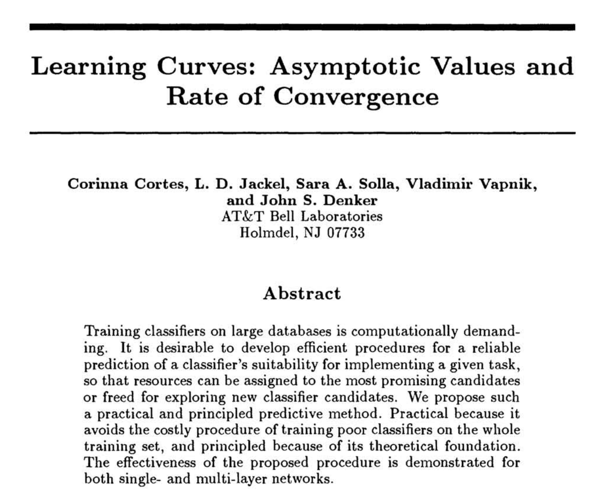

*图 8.2-1 Bell Labs learning curves paper*

图 8.2-1 是 Cortes 等人 1993 年论文里的论文页本身：上方是 figure（学习曲线图），下方是 figure caption 和文中对应的文字说明。它把这张图放进原始论文语境里，本身不解释曲线——曲线含义见 §8.2.2 的图 8.2-2 解释。LLM 训练在这条思路上把资源轴从训练样本数扩展到模型大小、训练 FLOPs、数据配比、batch size 和 learning rate。

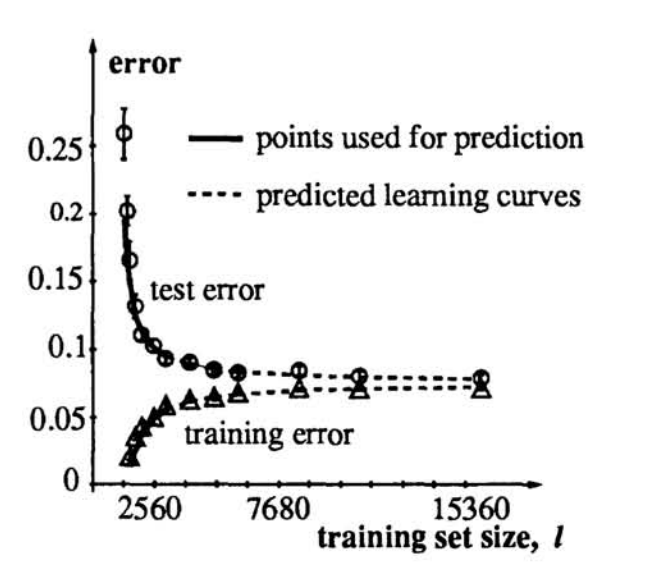

*图 8.2-2 Bell Labs learning curves loss*

Bell Labs 的 Cortes、Jackel、Solla、Vapnik 等人在 1993 年研究过“用小数据学习曲线预测大数据表现”。这已经非常接近现代 data scaling 的工程动机：少跑昂贵实验，用曲线外推更大规模。

图 8.2-2 展示的是 Cortes 等人在 Bell Labs 1993 年那篇 learning curves 工作的拟合结果：横轴是训练样本数，纵轴是测试误差，多条曲线对应不同模型复杂度或不同特征集合。图上能直接读到的是：误差随训练样本数下降，曲线在大样本端趋于水平——这就是 asymptotic value 的可视化版本。它给出的是曲线形状本身，不是脱离曲线的经验结论口号。

这类早期工作还强调了 asymptotic value 和 rate of convergence。前者对应“最终再加数据也降不下去的误差”，后者对应“接近这个极限的速度”。现代 scaling law 也有同样两个问题：曲线能降到哪里，以及要花多少数据或 compute 才能降到那里。

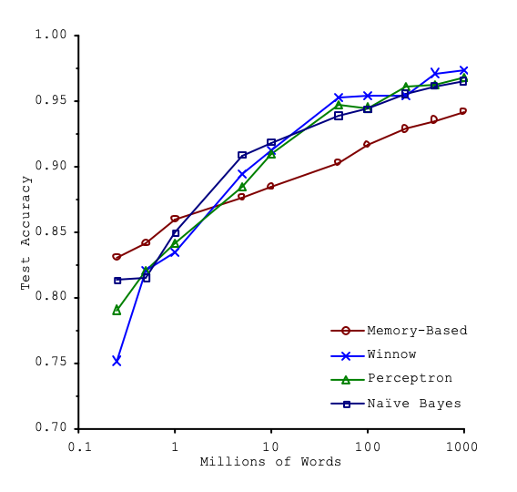

*图 8.2-3 Banko-Brill confusion set learning curve*

Banko & Brill 2001 在 confusion set disambiguation 上展示了一个经典结论：对某些 NLP 任务，增加数据量带来的收益可以超过改进算法本身。这个例子的意义在于把“花钱收集数据”和“花钱做算法研发”放到同一条 learning curve 里比较。

Confusion set disambiguation 是根据上下文在易混词集合中选正确词。例如混淆集是 `{to, two, too}`，句子是 `I am going ___ the store.`，模型需要根据上下文判断应填 `to`。这个任务很小，但它非常适合解释 learning curve：如果数据继续增加，模型还能不能继续变好；算法 A 在小数据上领先，到了大数据区间是否仍然领先。

图 8.2-3 把训练数据规模放在横轴、把任务表现（困惑度 / 错误率）放在纵轴，多条曲线对应不同算法在同一任务上的对照。读图时重点看"曲线交叉点"和"斜率排序"：小数据端的领先算法到了大数据端未必领先；一个简单方法若随数据增长更快，到达同一水平所需的样本量反而更小。这张图最早把"加数据"和"改算法"放到同一张坐标系里直接比较。

这也是 scaling law 的第一个工程直觉：资源包括数据、算法研发和训练 compute。Learning curve 给这些选择一个共同坐标系。LLM 训练里同样如此：数据去重、数据过滤、tokens per parameter 和训练 FLOP budget 都是同一张账本里的变量。

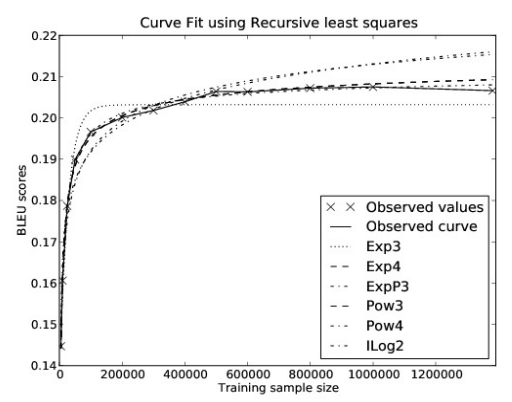

*图 8.2-4 Kolachina learning curve fit*

图 8.2-4 展示的是用少量观测点拟合学习曲线，并预测更大数据区间。对训练决策来说，已有点拟合得好只说明函数能解释已观察区间；更重要的是外推到未观察区域时是否仍然稳定。点越少、外推越远，函数形式的选择越重要。

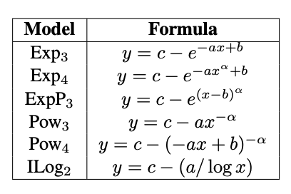

*图 8.2-5 Kolachina curve families*

Kolachina et al. 2012 问得更直接：如果只有小数据上的几个点，要预测大数据上的 BLEU 或 loss，应该选线性、指数、对数，还是幂律？图 8.2-5 把同一批 BLEU / loss 观测点用多组函数族同时拟合：线性、指数、对数和幂律，给出未来区间的不同预测曲线。读图重点是"小数据区间拟合差距小、外推区间差距大"这件事：函数形式不同，已观测区间的拟合残差可能都接近，但外推到 10×、100× 数据量时，曲线会朝完全不同方向走。

对这类学习曲线来说，幂律常常更有竞争力，因为很多误差会随着样本数按多项式速度下降。具体的 exponent 和截距仍然依赖任务、数据和训练方法，所以还要确认拟合区间落在 power-law region，而且目标规模不要离观测点太远。

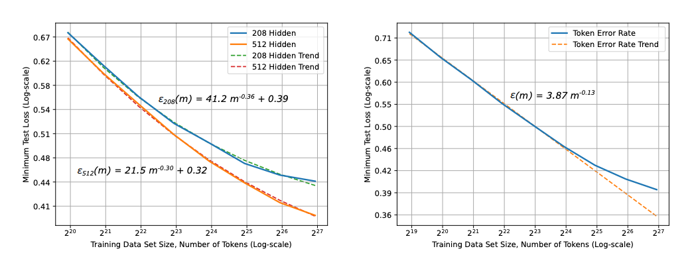

*图 8.2-6 Neural machine translation learning curve*

图 8.2-6 展示的是神经机器翻译任务上 BLEU 随训练句对规模增长的曲线。横轴是训练样本数（对数），纵轴是 BLEU 分数。读图时关注曲线拐点：拐点之前仍可测、可拟合，扩大资源仍有可见收益；拐点之后曲线变平，需要先判断瓶颈是数据噪声、模型容量还是任务上限，再决定是否值得继续投入资源。这条判断路径今天仍然适用，只是横轴换成了 tokens 或 compute。

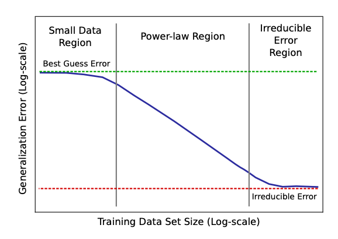

*图 8.2-7 Power law learning curve*

Hestness et al. 2017 是早期大规模 neural scaling 工作之一。它把学习曲线分成小数据区、power-law region 和 irreducible error region。图 8.2-7 的重点是：只有中间段在 log-log plot 上接近直线，所以最适合做外推。

这三个区间很重要。小数据区里模型可能接近随机猜测，点会很 noisy；power-law region 里 log-log plot 近似直线，适合外推；irreducible error region 里继续加数据也很难降低 loss，因为已经接近数据噪声、模型容量或任务本身的上限。做 scaling 拟合时混用这些区间，往往会得到看似精确但不可用的曲线。

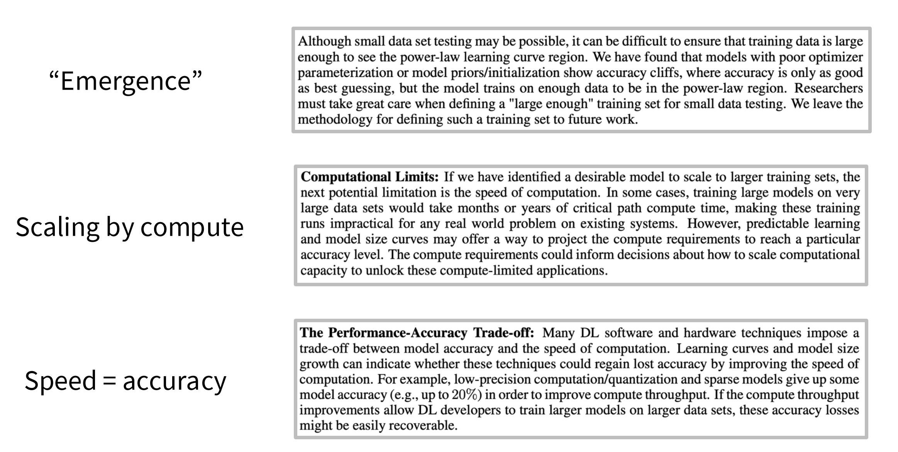

*图 8.2-8 Hestness scaling concepts*

Hestness 的另一个重要贡献是把 scaling、emergence、compute 和 systems optimization 连接起来。图 8.2-8 的含义是：如果系统在同样的墙钟时间或训练周期里，能完成更多实际计算，比如通过 kernel fusion、通信优化或更高 MFU 跑出更多 tokens 或更大模型，那么最终点就会沿着 scaling curve 往更低 loss 走。系统效率因此不只是实现细节，也会影响可达到的模型质量。

## 8.3 LLM 的 Scaling Behavior

这一节进入 LLM 训练，把复杂问题拆成几个单变量资源轴：data、model size、compute、batch size 和 learning rate。每个横轴对应一种 scaling behavior，但回答的训练问题不同。读完本节应能：识别一张 scaling 图里横轴的资源、纵轴的目标、被固定的训练条件各是什么；判断某个 scaling 结论是否能外推到目标 compute；区分数据配比、数据重复、数据选择三条路径各自回答什么；把架构、optimizer、batch size、learning rate 当成可独立缩放的变量；以及理解 muP 与普通超参搜索在小模型到大模型迁移上的边界。

### 8.3.1 Data Scaling：数据量与性能

本节回答最基础的单变量 scaling：如果只增加一个资源，loss 会怎么降。Kaplan et al. 2020 系统展示了语言模型 loss 与 compute、parameter count、dataset size 之间的幂律关系（[arXiv:2001.08361](https://arxiv.org/abs/2001.08361) §3–§4）。读完后应能：分别读 data scaling、model scaling、compute scaling 三条曲线；识别 power-law region 与 irreducible error region；理解为什么测试分布改变会让曲线整体平移而非斜率改变。

进入 LLM 后，问题变成：如果只增加一个资源，loss 会怎么降？Kaplan et al. 2020 系统展示了语言模型的 loss 与 compute、parameter count、dataset size 之间的幂律关系。

先分清三个横轴：

- `compute` 是训练总计算量，也就是花了多少 FLOPs。
- `parameter count` 是模型大小，也就是容量。
- `dataset size` 是训练 tokens 或样本量，也就是看到多少数据。

每个横轴回答的问题不同，不能把“加数据的收益”和“加参数的收益”混成同一件事。

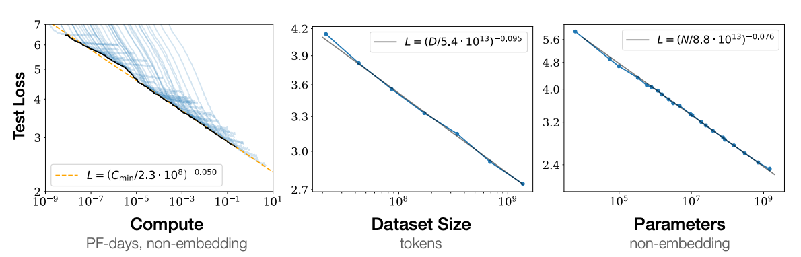

*图 8.3-1 Kaplan language model scaling*

图 8.3-1 把 Kaplan 等人 2020 年论文里三条曲线放在同一张图里：横轴分别为 dataset size、parameter count 和 compute，纵轴都是 validation loss，每张子图拟合出一条 power law 直线。读图时先固定一个横轴，再看另一条曲线斜率。三张子图横轴单位、点密度不同，对应不同训练设置下的拟合结果。

这类单变量实验的可识别条件是：改变 dataset size 时，模型结构、optimizer、训练步数口径和 validation set 保持一致；改变 parameter count 时，数据和优化流程保持一致；改变 compute 时，明确 compute 是通过模型大小、训练长度还是二者共同改变得到。只有先写清这些控制变量，曲线斜率才有明确含义。

这三条曲线服务同一个判断：scaling law 只能回答固定账本下的问题。账本一变，曲线的含义也会变。曲线变平时，先看瓶颈落在哪里：数据不够、模型太小，还是优化设置不合适。

训练集和测试集来自不同分布时，曲线常常整体平移。这类现象支持一个实用判断：数据质量和分布常常影响截距，斜率未必改变。更直观地说，数据质量可能把整条曲线往上或往下平移，但未必改变“每增加一倍数据能学到多少”的速度；如果测试分布多了新的能力或格式，斜率也可能变化。

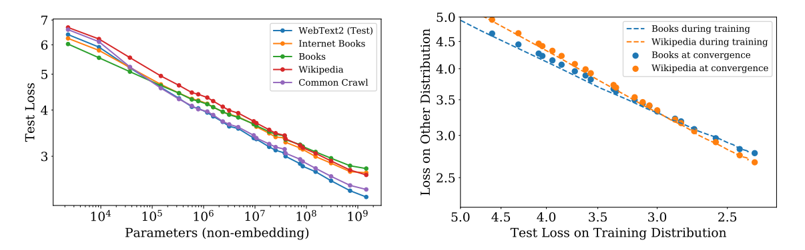

*图 8.3-2 Distribution shift scaling*

图 8.3-2 把同一批模型在不同测试集上的 loss 放在一起画：横轴可以是 model size 或 dataset size，纵轴是 test loss，不同颜色曲线对应不同 test distribution。读图重点是"平行 vs 交叉"：若几条曲线大致平行，说明分布差异主要改变 offset；若曲线在某段交叉或分离，说明斜率本身随分布变化。

Data scaling law 可以理解为一个把数据量 $n$ 映射到 error 或 loss 的简单函数。更严格地说，很多图里更适合幂律拟合的是 excess error：当前 loss 距离不可约误差或最佳可达 loss 还有多远。若用 $L_\infty$ 表示不可约项，常见直觉形式是：

$$
L(n) - L_\infty \approx A n^{-\alpha}
$$

其中 $A$ 是整体系数， $\alpha$ 是 scaling exponent。不可约项可以理解成误差底线：继续增加数据、继续增大模型，或者继续优化训练流程，这一层 loss 仍然很难明显下降。它通常来自数据噪声、任务本身的歧义、标注误差，或者输入信息本来就不足。

若当前还离不可约误差很远，也常简写为：

$$
\mathrm{Error}(n) \propto n^{-\alpha}
$$

这里的 $\mathrm{Error}(n)$ 就是上面那部分 excess error，也就是 $L(n) - L_\infty$ 。换成这个名字，只是为了更直白地说“扣掉底线以后还剩多少误差”。

比如总 loss 是 `0.50`，底线是 `0.20`，那么剩下的 `0.30` 就是还能靠更多数据、更多模型容量继续压低的那部分误差。

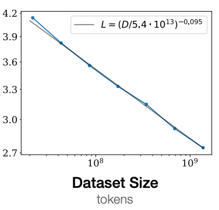

*图 8.3-3 Data size error power law*

> [!TIP]
> Power law 要看 log-log 图，也就是横轴和纵轴都用对数坐标。只有点在这种坐标里接近直线时，才适合说误差按固定比例衰减。

图 8.3-3 把多组实测点放在同一张 log-log 图上，每组点的横轴起点和终止点不同，覆盖各自的 data scaling 区间。读图先看斜率绝对值——它就是 scaling exponent 的负号；再看截距——它对应 power law 公式里的 $A$。点偏离直线的部分要么是噪声，要么是已经接近 irreducible error，曲线开始弯平。

这给的是一条可以外推的比例关系，但只在当前观测区间里可靠。图里的直线通常对应扣掉不可约误差后的 excess error；如果看的是原始 loss，且已经接近 $L_\infty$，曲线就会自然弯平。

### 8.3.2 为什么 log-log plot 上会是直线？

本节解释一个具体的可视化现象：power law 在 log-log plot 上为什么会变成直线，并借此区分 offset 与 slope 两个工程概念。读完本节应能：在看到任意 scaling 曲线时判断它是否落在 power-law region；理解 log-log 直线的斜率等于 scaling exponent；以及在数据质量或任务分布改变时，分辨曲线变化是平移还是斜率变化。

这一节只解释一个现象：为什么 power law 在 log-log plot 上会变成直线。`log-log` 的意思是横轴和纵轴都用对数坐标。

先看一个最简单的估计问题。假设有一批样本 $x_1, \dots, x_n \sim N(\mu, \sigma^2)$ ，用样本均值 $\hat{\mu} = \frac{1}{n}\sum_i x_i$ 估计真实均值 $\mu$ ，则：

$$
\mathbb{E}\left[(\hat{\mu} - \mu)^2\right] = \frac{\sigma^2}{n}
$$

两边取对数：

$$
\log(\mathrm{Error}) = -\log(n) + 2\log(\sigma)
$$

这就是 log-log plot 上斜率为 $-1$ 的直线。更一般地，只要误差按 $1/n^\alpha$ 下降，取对数后就会变成直线。

普通坐标关心“少了多少绝对值”。Log-log 坐标关心“按比例增加资源后，误差按什么比例下降”。这正好适合读 scaling law。

在均值估计例子里， $\sigma^2$ 改变直线的上下位置， $n^{-1}$ 决定直线的斜率。对应到模型训练，数据质量、任务分布和学习问题复杂度都可能影响曲线形状：有些变化主要改变曲线高低，有些变化会改变斜率。

均值估计只提供了拆分 offset / slope 的直觉，不构成训练定律。真实训练里，数据和任务经常一起变。比如把普通网页数据换成高质量教材，曲线可能整体下降；如果新数据里还加入大量数学证明、代码和长推理文本，模型要学的模式也变复杂了，斜率也可能跟着变化。

因此，曲线分析要分别检查两件事：曲线有没有整体上移或下移，斜率有没有变平或变陡。前者对应同等资源下的 loss 高低，后者对应继续增加资源时的边际收益。

神经网络的 scaling exponent 通常比经典均值估计慢很多。一个有用的直觉来自非参数学习：越灵活、越高维的函数类，样本效率越低。

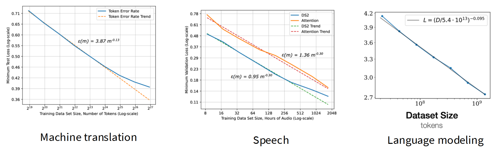

*图 8.3-4 Scaling exponents by task*

图 8.3-4 把机器翻译、语言模型、图像分类、围棋等任务的实测点放在同一张 log-log 图上，每条曲线是一类任务在不同样本数下的 error。读图重点是斜率分布：低维参数估计斜率最陡，复杂感知 / 语言任务斜率明显更平。差距直接对应"每多 10× 数据能降多少 loss"这个边际收益。

这里的数据指训练材料数量，例如更多 unique tokens、更多图片或更多样本。Compute 指训练时实际花掉的计算量，通常用 FLOPs 表示。固定模型时，喂更多数据会消耗更多 compute；固定数据时，把模型做大、训练更多 epoch 或扫更多配置，也会消耗更多 compute。所以二者相关，但不是同一个资源轴。

举个数量级直觉：若 $\alpha = 0.1$ ，数据量增加 $10$ 倍，误差项只乘以 $10^{-0.1} \approx 0.79$ ；若 $\alpha = 0.3$ ，同样增加 $10$ 倍，误差项乘以约 $0.5$ 。所以 exponent 的差异很重要，它决定了继续堆资源的边际收益。

可以用一个二维地图例子打开直觉。假设要学习一张地图上的温度函数，样本越多，地图就能切得越细，估计也越准。

把地图想成一个正方形。如果有 $n$ 个样本点均匀铺开，横向和纵向大约各能分成 $\sqrt n$ 份，因为 $\sqrt n \times \sqrt n = n$ 。这样每个小格子的边长大约是 $1/\sqrt n$ 。

如果温度函数足够平滑，离已知样本点越近，估计误差通常越小；于是误差的数量级可以跟着格子边长走。把 $1/\sqrt n$ 写成幂的形式，就是 $n^{-1/2}$ 。

推广到 $d$ 维时，$n$ 个样本要铺满 $d$ 个方向，每个方向大约只能分成 $n^{1/d}$ 份，格子边长约为 $n^{-1/d}$ 。因此直觉形式是：

$$
\mathrm{Error}(n) \approx n^{-1/d}
$$

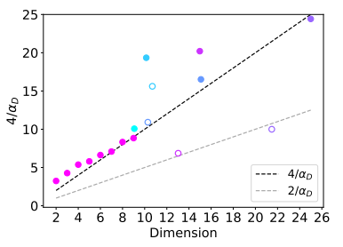

*图 8.3-5 Intrinsic dimension scaling slope*

图 8.3-5 可以分三步读。先看横轴：`Dimension` 指有效维度，也叫 intrinsic dimension，表示数据主要沿多少个独立方向变化。原始输入数字很多时，有效维度仍可能低得多。

二维地图的有效维度接近 2，因为位置主要由横坐标和纵坐标决定。图片虽然有很多像素，但自然图片不会任意乱变，边缘、纹理、物体形状和光照会限制它的变化方式，所以有效维度低于像素数。语言数据的变化因素更多，例如主题、语法、事实、推理、风格和多语言混合，有效维度通常更高。

再看纵轴：图里画的是 $4/\alpha_D$ 。这里的 $\alpha_D$ 是 data scaling exponent，也就是“只增加数据量 $D$ 时，误差下降有多快”的指数：

$$
\mathrm{Error}(D) \approx A D^{-\alpha_D}
$$

在 log-log 图上，这条线的斜率是 $-\alpha_D$ 。$\alpha_D$ 越大，数据增加后误差降得越快；$\alpha_D$ 越小，数据增加后的收益越慢。

最后看点的位置。纵轴是 $4/\alpha_D$ ，所以点越高，代表 $\alpha_D$ 越小，学习越慢。图中的点大致从左下走向右上，意思是：有效维度越高，data scaling 往往越慢。两条虚线是理论关系的参考线；点没有完全落在线上，说明这只是数量级趋势，不是精确预测公式。

Intrinsic dimension 视角给 scaling exponent 提供了一个解释：斜率不只是拟合出来的数字，也和任务本身有多难学有关。真实数据的 intrinsic dimension 很难稳定估计，因此它更适合帮助理解 exponent，不适合直接代入大训练配置。对 LLM 训练来说，更可靠的做法仍然是跑小规模实验并拟合真实曲线。

到这里只需要记住一件事：log-log plot 上的直线表示误差按固定比例下降；斜率越平，同样比例的新增数据带来的收益越小。LLM 的难点在于下降很慢，必须靠大规模资源和稳定训练条件持续推进。

### 8.3.3 Data Composition 与 Data Repetition

本节处理三个互相联系但回答不同问题的工程变量：data composition（数据配比）、data repetition（重复数据）、data selection（数据选择）。读完本节应能：把"加数据"和"换数据"分到不同判断路径；在总 token 数受限时区分有效数据与 raw tokens；判断一个 data filtering 阈值在多大 compute 下还能保持最优。

#### Data Composition：数据配比

Data composition 主要回答一个比“数据越多越好吗”更具体的问题：在总 token 数差不多时，应该用什么数据源、什么比例、什么过滤阈值？

看数据配比时，先问一个更小的问题：换了数据以后，曲线是整体上移 / 下移，还是下降速度也变了？这个问题也适用于换测试集、换数据源、换数据混合比例。

为回答这个问题，需要分清两个词。`intercept / offset` 指曲线整体高低：同样资源下 loss 更高还是更低。`slope / exponent` 指曲线下降速度：资源继续增加时 loss 降得快还是慢。图 8.3-6 先用不同测试集建立 offset / slope 的区分，图 8.3-7 再回到真正的 data mix 搜索。

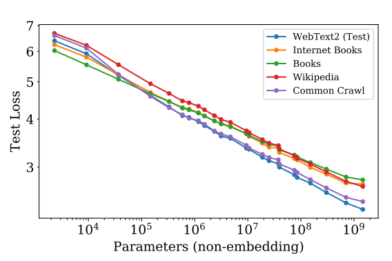

*图 8.3-6 Data composition offset*

图 8.3-6 的横轴是 non-embedding parameters，纵轴是 test loss，不同颜色是不同测试集。几条线整体一起下降，而且大致平行。

这说明一件事：换测试分布会改变 loss 的高低，但在这张图里，没有明显改变“模型变大时 loss 下降的速度”。用前面的词说，就是 offset 变了，slope 大体接近。

这个区分进入 data composition 后很有用。若不同 data mix 的曲线也近似平行，小规模上 loss 更低的 mix，放大后通常仍值得优先考虑。这个前提需要中等规模复核，因为加入大量代码、数学、多语言或长上下文数据时，数据分布会明显改变，slope 也可能跟着变。

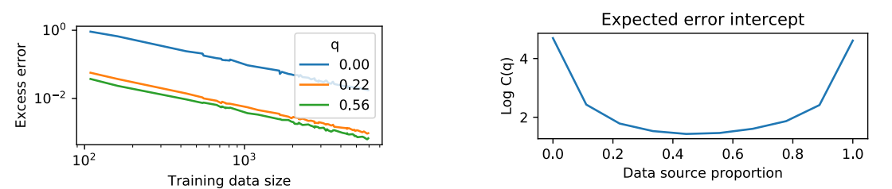

*图 8.3-7 Data mixture scaling*

图 8.3-7 才进入数据配比优化。设 $q$ 是某个数据源的比例， $q = 0$ 表示完全不用这个数据源， $q = 1$ 表示全用这个数据源，中间值表示混合。左图比较不同 $q$ 的 loss 曲线是否近似平行；右图把 loss 对 $q$ 作图，最低点就是当前实验里的最优 mixture ratio。

真实数据工作通常比理想曲线更 noisy。常见做法是先训练一批小模型，挑小规模上表现最好的 data mix，再把这个 mix 放大。这个做法依赖一个前提：不同 mix 的 slope 接近，放大后的排序主要由曲线高低决定。如果某个 mix 在小规模低 loss，但 slope 更平，放大后优势可能消失。

因此，data-mix 实验至少要固定总 tokens、模型配置、训练 compute 和评测集，只改变来源比例 $q$；重复数据实验还要固定 unique-token 池，单独改变 epoch 数。左图的曲线偏移、右图的比例扫描和 effective-data 拟合分别对应“质量差异”“混合比例”和“重复收益递减”三个可检验假设。

#### Data Repetition：重复数据

Data repetition 处理的是有限数据集的放大问题。无限新数据的 scaling law 不能直接套到有限数据集上；重复同一批 token 的价值会递减。现实问题是：如果高质量数据有限，重复训练它几遍，是否等价于拿到了同样多的新数据？

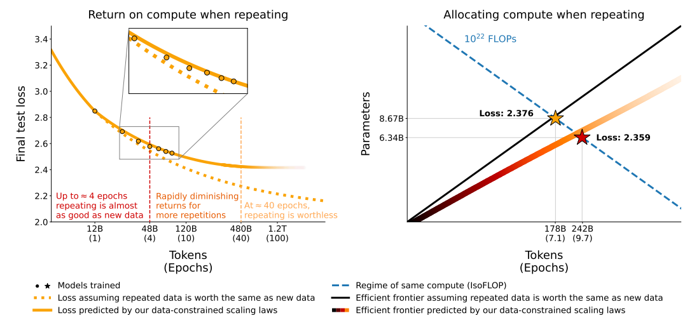

*图 8.3-8 Data repetition effective data*

图 8.3-8 左侧直接回答"重复数据还值不值"。曲线来自固定 4.2B 参数的模型：横轴是 raw tokens（括号数字是 epoch 数），纵轴是 final test loss；虚线对应"每次都是 fresh data"的理想假设，实线对应 data-constrained scaling law。读图时重点看虚实两条线的距离：到约 4 个 epoch 为止两线重合；过 4 epoch 后实线逐渐变平；到约 40 个 epoch 时实线接近水平，重复几乎不再降 loss。

读左图时看虚线和实线的距离。到约 4 个 epoch 为止，两条线基本重合，重复数据几乎像新数据一样有用。再往右实线逐渐变平，和虚线拉开距离；到约 40 个 epoch 时，实线已经接近水平，继续重复几乎不再降低 final test loss。

为了把这件事写进公式，可以把 repeated tokens 折算成 effective data，也就是“等价新数据量”。它回答的问题是：重复训练这些 token 的效果，大约相当于看到了多少不重复的新 token。

比如有 100B unique tokens，训练 4 个 epoch 时，raw tokens 是 400B。但这 400B 里有很多内容是重复的，效果可能只相当于 250B fresh tokens。这个 250B 就是 effective data 的直觉。Raw tokens 会随着 epoch 近似线性增加；effective data 增长更慢，因为重复 token 提供的新信息会递减：

$$
D' = U_D + U_D R_D^* \left(1 - e^{-R_D / R_D^*}\right)
$$

其中 $D'$ 是 effective data， $U_D$ 是 unique tokens， $R_D$ 表示重复强度， $R_D^*$ 控制重复收益多快饱和。第一项 $U_D$ 是第一遍独特数据的价值；第二项是重复训练带来的额外价值。

读这个量时，不必先判断它“比谁大”。它的角色是给重复 token 打折：第一遍 unique tokens 按 $U_D$ 算满；后面重复训练还能加一些等价新数据量，但加得越来越慢。这样算出来的 $D'$ 表示模型实际得到的有效数据信号，raw tokens 表示训练过程实际处理了多少 token。

图 8.3-8 右侧把同一组训练点画到 (parameters, training tokens) 平面上：纵轴是 parameters，横轴是训练 tokens / epochs，蓝色虚线是一条 IsoFLOP 预算线，表示落在虚线上的方案训练 compute 基本相同。黑色 / 橙 / 红线分别对应不同假设下的 efficient frontier，曲线最低点对应"该 compute 下 N 与 D 的最优配比"。

黑色线和橙 / 红色线分别表示两种假设下的有效前沿（efficient frontier）：在同一 compute 预算附近，不同 token / parameter 配比对应的预期 loss。黑色线对应理想假设，重复 token 和 fresh token 一样有价值；橙色 / 红色线对应 data-constrained 情况，重复 token 的收益要打折。

右图在最大 FLOP 预算 $9.3 \times 10^{21}$ 上比较两组最优解。黄色星星是 Chinchilla 假设下的最佳点（重复 token 与 fresh token 等价），落在 8.67B 参数 / 178B tokens，final loss 2.376；红色星星是 data-constrained 假设下的最佳点，落在 6.34B 参数 / 242B tokens，final loss 2.359。后者参数少约 27%，把省下来的训练 compute 转给同一批 unique tokens 的额外 epoch：epoch 数从 7.1 提高到 9.7。

结论限定在同一条 IsoFLOP 预算线上：如果重复 token 和 fresh token 一样有价值，最佳点偏向更大模型、较少训练 tokens；如果重复 token 的收益要打折，最佳点会移动到更小模型、更多训练 tokens。原因是数据有限时，大模型很快会缺少足够的新信息；把模型稍微做小一些，把 compute 留给更多训练 tokens，反而可能得到更低 loss。

这就是固定训练预算下“数据有限会改变最优配置”的意思。下一张图把数据受限推到 compute 更充足的情形。

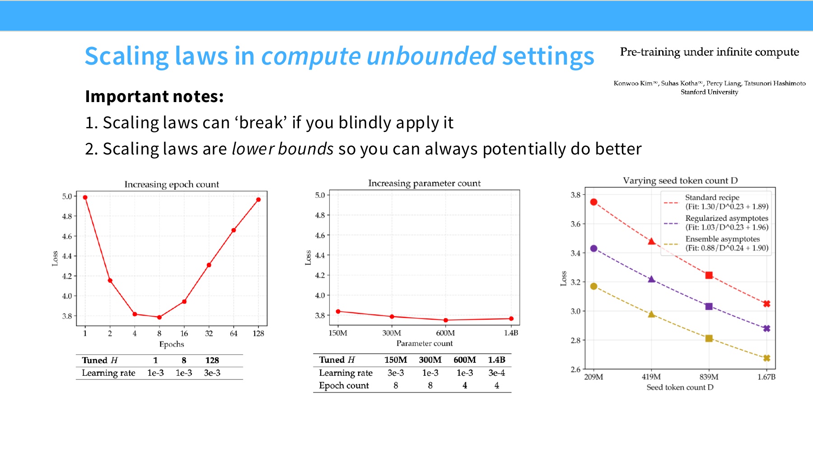

*图 8.3-9 Compute-unbounded settings*

图 8.3-9 把 repeated-data 推到更极端的问题：给定一批有限 seed tokens（起始数据集里的 unique tokens），如果 compute 很充足，靠重复训练 / 做大模型 / 额外技巧还能不能继续压低 loss。图分左中右三栏：左栏扫 epoch count，中栏扫 parameter count，右栏扫 seed token count $D$，纵轴都是 loss。读图按栏比较曲线形状，不必把三栏数据合到一张坐标。

左图扫 epoch count。loss 先降后升，说明重复几遍有用，继续重复很多遍后收益会消失，甚至可能变差。

中图扫 parameter count。Muennighoff 论文共训练 400 多个模型，参数量覆盖 $10\mathrm{M}$ 到 $9\mathrm{B}$ 。论文 Figure 4 的三档 IsoFLOP 预算是 $9.3 \times 10^{20}$ 、 $2.1 \times 10^{21}$ 、 $9.3 \times 10^{21}$ ，单 epoch 下对应的最优模型大小分别是 2.8B、4.2B、8.7B。

中图给出的结论一致：固定同一批 unique data 时，参数更多不能凭空提供新信息，数据成了主要瓶颈。超过一个门槛后，再加参数反而略恶化 loss，论文把这一点归因为 regularization 不足。

右图扫 seed token count $D$ 。这里的 `seed` 指起始数据集，和 random seed 无关； $D$ 是这批起始 unique tokens 的规模。三条曲线都随 $D$ 增大而下降，说明更多 unique tokens 仍然最直接地降低 loss。

论文 Figure 3 把这件事单独画出来：一批模型在 100M unique tokens 上只训练一个 epoch，图里同时给出实测 loss、data-constrained scaling law 的预测和 Chinchilla 的预测。实测曲线在参数量超过某个位置后开始回升，data-constrained 公式预测 loss 会走平，Chinchilla 公式则预测 loss 继续改善。

论文把“多余参数反而略变差”归因为 regularization 不足，并提出把指数 $\alpha$ 、 $\beta$ 也随规模衰减的替代形式，让函数形式本身能容纳“先降后升”的行为。muP 与默认超参的对比放在 Appendix F：在这组实验里 muP 的 test loss 反而高于默认超参，而且换成 muP 之后多余参数同样会损害性能。

数据受限时，把重复 token 当成新 token 来外推，会高估继续训练的收益。这张图把优先级说清楚：增加 unique tokens 仍然最直接；当 unique tokens 受限时，更强的 regularization 和更好的数据选择是在提高同一批数据的利用率。

#### Data Selection

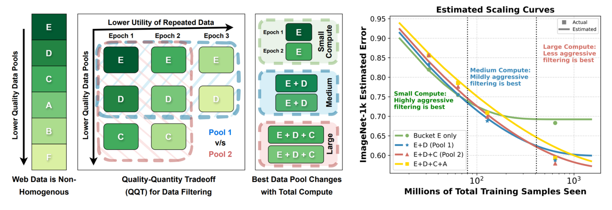

*图 8.3-10 Data selection finiteness*

数据选择也要随 scale 调整。小模型或小预算下，高质量小数据可能更好；大预算下，过度过滤会让 unique tokens 不够，质量稍低的新数据反而更有价值。

把过滤阈值当作可测变量时，先固定模型、训练 tokens、optimizer、batch、学习率和评测集，只改变保留规则或阈值；对每个 compute 档位记录保留 token 数、重复率、held-out loss 与下游指标。若阈值变化同时改变了数据量和数据分布，就无法区分收益来自质量还是覆盖面；只有在这组控制下，图中的最优阈值移动才能解释为“数据规模改变了过滤强度的折中”。

图 8.3-10 来自 Goyal et al. 的 data filtering scaling law 工作（[*Scaling Laws for Data Filtering — Data Curation cannot be Compute Agnostic*, arXiv:2404.07177](https://arxiv.org/abs/2404.07177)）。图把 DataComp 的 web 数据按质量切成 A–F 若干 bucket（`E` 是质量最高的一档，往下依次变差），组合方式用累加池（`E only`、`E+D`、`E+D+C`）表示；横轴是 compute，纵轴是 optimal filtering 强度。读图重点是阈值随 compute 单调下降：small compute 下最优是 highly aggressive filtering，medium compute 下退到 mildly aggressive filtering，更大 compute 下阈值继续放松，让更多但稍差的数据进入训练。

过滤阈值因此会随 scale 变松。最高质量池可以先用，但随着 compute 增大，继续只重复它会让 effective data 增长变慢，训练会逐渐转向"高质量 + 更多覆盖面"的组合。

### 8.3.4 Model Scaling 与 Architecture Scaling

本节把规模变量从 data scaling 切换到模型本身：先问参数量要多大，再问架构、optimizer、depth / width、parameter accounting 哪些会改写 scaling 曲线。读完本节应能：在 fixed FLOP budget 下决定模型大小；判断一个架构改动主要影响 offset 还是 slope；识别 parameter accounting 口径变化会怎样重写小实验拟合；以及把 MoE 的 total / active parameters 拆开分析。

`Model scaling` 先问参数量要多大。这里先把规模账本定住：模型要沿宽度、深度还是 total parameters 放大，训练预算大致怎么分。

规模先定住后，后面的架构、optimizer、depth-width 和 MoE 才有可比性。

#### Architecture Choice：Transformer vs LSTM

在同一规模账本下，先比较最基础的结构选择。至少有三种常见账本：

- 同样 parameter count 下，哪个架构 loss 更低？
- 同样 FLOP budget 下，哪个架构更有效？
- 同样 inference budget 下，哪个架构更适合部署？

这三个问题可能给出不同答案。Parameter count 只看参数规模，FLOP budget 只看训练计算，inference budget 还要看 latency、KV cache、batching 和 serving throughput。横轴选错时，图上的赢家可能服务不了真正的工程目标。

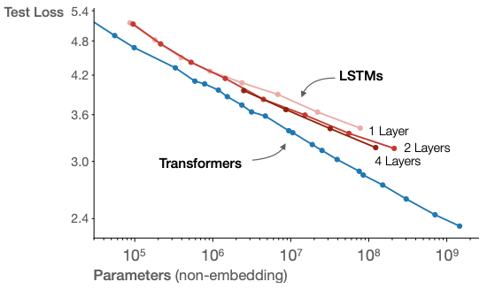

*图 8.3-11 Transformer-LSTM scaling*

图 8.3-11 把 LSTM 和 Transformer 放在同一张 scaling 图上：横轴是 non-embedding parameters（对数），纵轴是 test loss；蓝线对应 Transformer，红线对应不同层数的 LSTM，每条曲线是一档 compute 范围。读图重点是"曲线是否随参数规模收敛"：同等参数规模下 Transformer 曲线更低；参数变大后，LSTM 里层数更多的版本也没有把差距追平。

同等参数规模下，Transformer 曲线更低；参数变大后，LSTM 里层数更多的版本也没有把差距追平。这个结果说明，在这组实验里，更值得放大的候选是 Transformer。

今天的 Mamba、Gated DeltaNet 等架构论文也常用类似图。候选架构要进入更大训练，至少应在中小规模上低于或接近 baseline，并且放大趋势不能变差。

#### Upstream / downstream：loss 到 benchmark 的迁移

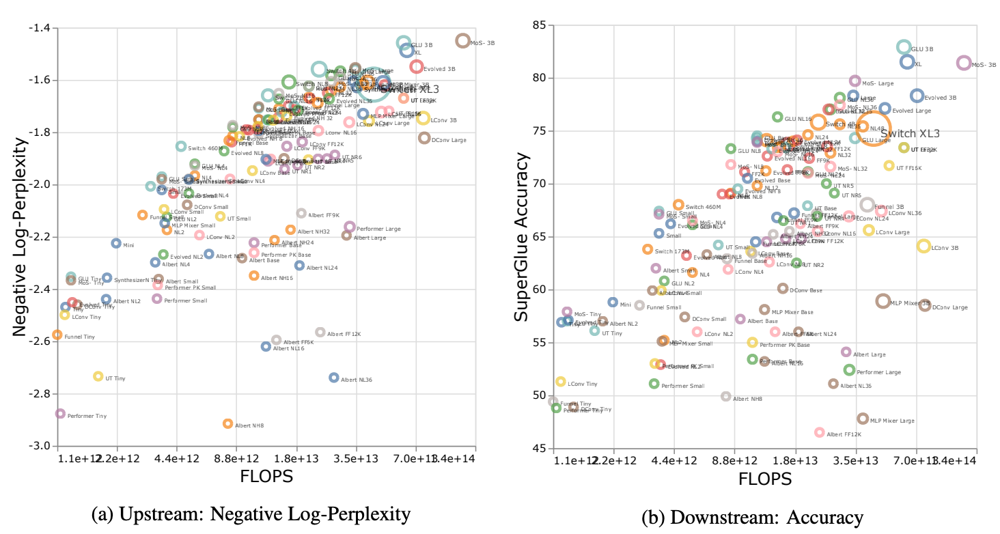

*图 8.3-12 Compute-performance architectures*

图 8.3-12 由左右两图组成：左图横轴是 compute，纵轴是 pretraining loss，每条曲线对应一种架构；右图横轴仍是 compute，纵轴换成 SuperGLUE accuracy。同一个架构在两图里被一对点表示，因此可以直接对照"左图低 loss 的架构是否在右图拿到高 accuracy"。每个点都是一个架构在一个规模上，所以这张图是在比较训练效率和下游迁移。

pretraining loss 和 downstream accuracy 往往相关，但不是一一对应。某些架构会先把 loss 压低，accuracy 却涨得慢；也有些架构在中等 compute 区间就已经把 accuracy 拉开。loss 可以当作第一道筛选，downstream 还要单独验。

如果最后关心部署，还要再看参数量、active parameters、通信和显存。Switch XL3、MoS、GLU、Performer 这类点说明，训练侧和部署侧的账本不一定一致。

#### Transformer Variants

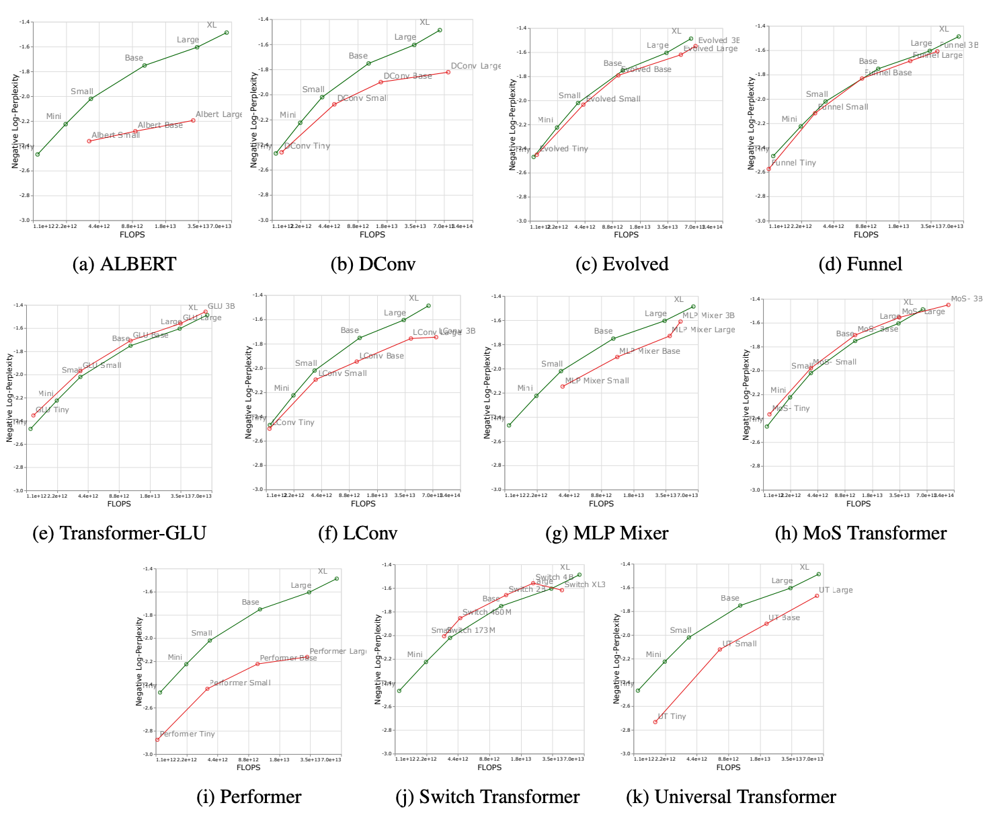

*图 8.3-13 Transformer variant scaling*

图 8.3-13 把比较对象换成 Transformer variants：横轴是 compute，纵轴是 loss，每条曲线对应一种架构改动（GLU / Performer / Switch / MoE 等）。曲线在多个 compute 区间稳定低于 baseline，意味着这个改动在同等资源下持续降低 loss；曲线斜率与 baseline 平行则说明改动主要带来 offset。

这组 T5-style scaling 给出几个具体判断。Gated linear unit 的趋势很好，后来进入很多主流模型设计。Performer 这类 efficient attention 在这些实验里 scaling trend 不够好。Switch / MoE 的趋势有吸引力，因为 MoE 每个 token 只激活一部分 experts：active compute 更接近每个 token 的实际计算量，训练和推理都会受它影响；total parameters 更接近容量和存储上限；routing 成本则决定通信和吞吐。MoE 的 routing / load balancing / expert 配置在 [第 4 章 §4.4 MoE 与深度学习](../chapter4/chapter4_混合专家模型.md) 展开。

小规模曲线的作用是先筛掉放大后不划算的架构。大训练再集中验证剩下的候选。很多架构改动主要带来 offset：曲线整体更低，但斜率变化不大。这个 offset 在大训练里很值钱，因为它可能等价于少花一大段 compute。

#### Optimizer Choice：Adam vs SGD

架构之外，optimizer 也可以作为 scaling 变量。

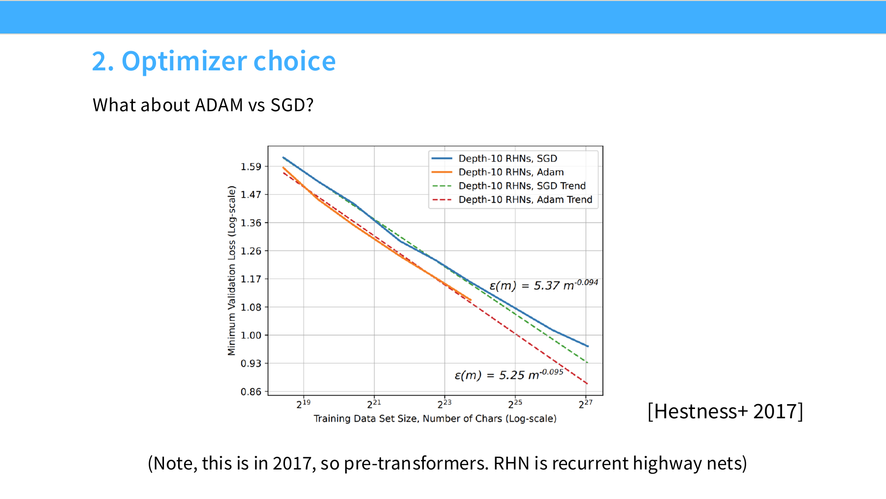

*图 8.3-14 Optimizer comparison*

图 8.3-14 把同一组 RHN（recurrent highway network）实验用两种 optimizer 拟合到同一张 log-log 图上：横轴是训练数据字符数，纵轴是 validation loss；蓝 / 绿虚线对应 SGD，橙 / 红虚线对应 Adam。读图重点是斜率接近、offset 不同——SGD 约是 $m^{-0.094}$，Adam 约是 $m^{-0.095}$，两条拟合线的 exponent 几乎一致，但 Adam 的曲线整体略低。

两条拟合线的指数几乎一样：SGD 约是 $m^{-0.094}$ ，Adam 约是 $m^{-0.095}$ 。两种 optimizer 的 loss 下降速度接近。Adam 的曲线整体略低，在这组设置里，同样数据规模下 Adam 的 validation loss 更低。

这张图支撑的是一个有限判断：optimizer 会改变曲线位置，但未必改变 scaling slope。它来自 2017 年 recurrent highway net 实验，不是现代 Transformer pretraining 的通用结论；换 optimizer 后仍要重新调 learning rate、batch、weight decay 和 schedule，并在多个规模上复核。

#### Depth / Width 与其他 Transformer hyperparameters

Depth / width 和其他 Transformer hyperparameters 沿三步展开：先看层数，再看宽深比、FFN expansion 和 attention head dimension，最后看参数计数口径为什么会改写结论。参数计数口径指的是：横轴里的参数量到底把哪些参数算进去。

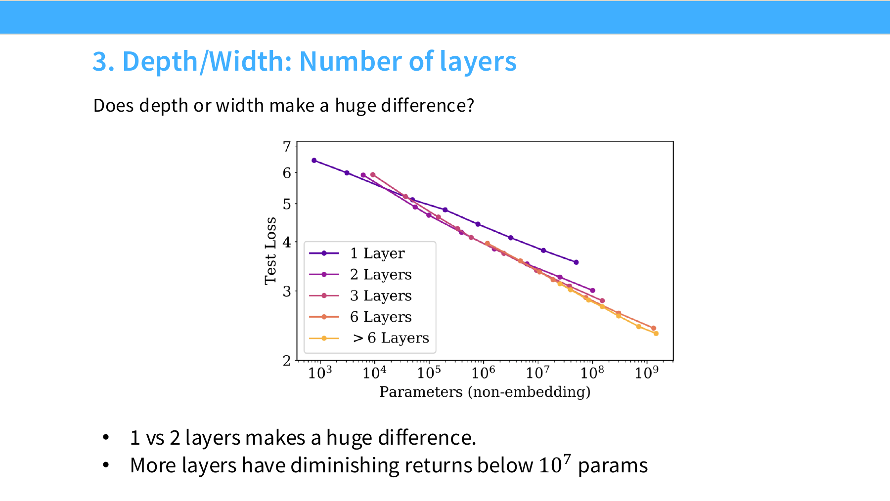

*图 8.3-15 Number of layers scaling*

图 8.3-15 先看层数。这里的 layer 指 Transformer block（attention + MLP + residual）。横轴是 compute，纵轴是 loss，每条曲线对应一个 layer 数（1 / 2 / 4 / 8 等）。读图重点是层数增加带来的 loss 收益：1 层模型基本没有竞争力；层数增加后 loss 继续下降，但收益开始递减，曲线在大 compute 区间逐渐靠近。

绝对层数会随模型变大而增加，适合迁移的通常是比例关系。固定层数从小模型搬到大模型，常常会偏离合理结构。Scaling 实验的作用，是判断哪些结构选择随规模变化，哪些结构比例更稳定。

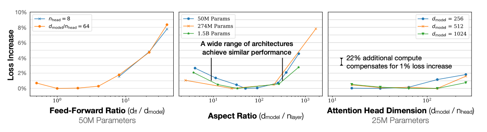

*图 8.3-16 Transformer hyperparameter scaling*

图 8.3-16 同时检查三类 Transformer hyperparameters。三张子图横轴分别是 feed-forward ratio $d_{\mathrm{ff}}/d_{\mathrm{model}}$、aspect ratio $d_{\mathrm{model}}/n_{\mathrm{layer}}$ 和 attention head dimension $d_{\mathrm{model}}/n_{\mathrm{head}}$，纵轴都是 loss increase（越低越好）。每张子图都有一段低 loss 区域，scaling 时通常先选落在这段里的 hyperparameter，再在更大模型里保持同一比例。

左图横轴是 FFN expansion。蓝线和橙线对应两种固定 attention 配置的方式：固定 head 数，或固定每个 head 的维度（ $d_{\mathrm{model}} / n_{\mathrm{head}} = 64$ ，也就是每个 head 分到的 hidden dimension）。这里重点看共同趋势：两条线都在中间一段较低，右侧快速上升，说明过大的 FFN ratio 会挤压其他部分，最后表现成 loss increase。

中图横轴是 aspect ratio。不同颜色对应不同模型规模，低 loss 区域都落在中间较宽的一段。图上的标注也在说：很多宽深组合性能接近。因此 scaling 时通常先选落在这段低 loss 区域里的 aspect ratio，再在更大模型里尽量保持这个比例。

右图横轴是 attention head dimension。低 loss 区域同样集中在一段范围内，head dimension 太大时 loss 会上升。图里把 1% loss increase 折算成约 22% additional compute，是在提醒这类小超参数偏差也会折算成训练成本。

#### Parameter Accounting：口径会改写曲线

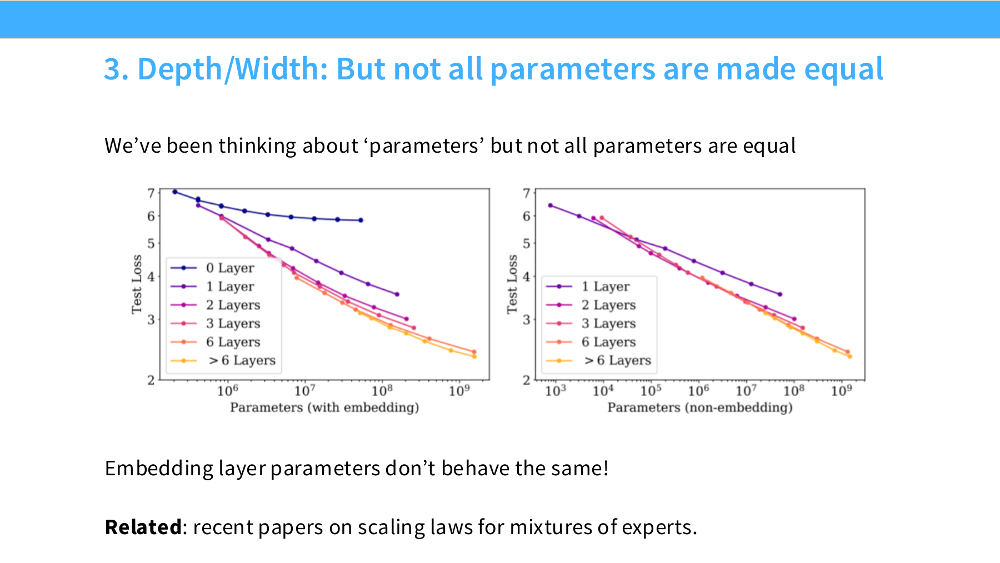

*图 8.3-17 Parameter accounting in depth scaling*

图 8.3-17 比较同一批深度实验在两种参数口径下的曲线形状：横轴里的"参数量"怎么数，会改变曲线形状。左右两图各画一张 scaling 曲线：左图横轴是 total parameters（含 embedding + output head），右图横轴是 non-embedding parameters（仅 block 内部）。

左图的横轴是 total parameters，包括 embedding 和 output head。`0 Layer` 模型虽然没有 Transformer block，但仍然有 token embedding、positional embedding 或 output head，所以左图能画出 `0 Layer` 曲线。

右图的横轴是 non-embedding parameters，只数 Transformer block 里的 attention、MLP 和 residual block 参数。`0 Layer` 没有这些 block 参数，横轴上接近 0；log-scale 不能画 0，所以右图不再画 `0 Layer` 曲线。

这就是 parameter accounting 的影响。Embedding 参数主要由 vocabulary size 和 $d_{\mathrm{model}}$ 决定，增加 Transformer block 不会让它按层数重复增加；每个 token 也只查用对应的 embedding row。Block 参数则会在每一层参与 attention 和 MLP 计算。两类参数的作用方式不同，所以小规模 scaling fit 对参数口径很敏感；横轴口径、hyperparameters 和目标大训练越一致，外推越可靠。

后面比较 Kaplan 和 Chinchilla 时，non-embedding 参数口径、小 compute 区间和 warmup / batch tuning 都会影响最终比例。

#### MoE Scaling：active 与 total parameters

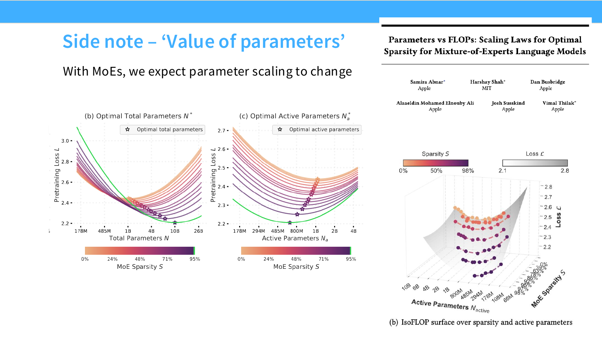

*图 8.3-18 MoE value of parameters*

MoE 的麻烦在于总参数和每个 token 实际使用的参数分开了。Dense 模型里，total parameters 和 active parameters 基本是同一件事；MoE 里，total parameters 是所有 experts 的参数，active parameters 是一个 token 被路由到的那些 experts。

图 8.3-18 把 MoE 的 scaling 拆成三张子图：左图横轴是 total parameters，中图横轴是 active parameters，右图把 active parameters 和 sparsity 放在同一张 loss surface 上；颜色都表示 MoE sparsity，sparsity 越高每个 token 激活的 experts 比例越低。读图按子图分别读：左图看总参数下的 loss 最低点，中图看每个 token 实际算的专家参数下的最低点，右图看 sparsity 在 loss 曲面上的走向——三者一起说明 MoE 不能用单一"参数量"轴描述。

高 sparsity 区域更低的直觉是：在相近 active compute 下，更高 sparsity 可以保留更大的 total expert pool，让 token 有更多可选择容量。右图把 active parameters 和 sparsity 放在同一个 loss surface 上，说明 MoE 的 loss 不能只用一个“参数量”解释。最后还要把 routing、expert placement、通信和显存成本算进去。

### 8.3.5 Critical Batch Size 与 Learning Rate

本节把视角从"loss 怎样随资源变化"切到"训练控制本身怎样随规模变化"：global batch 能放到多大，learning rate 该怎样随模型规模调整。读完本节应能：定义 critical batch size 并估计它的位置；理解 noise-limited / bias-limited 两段行为；用 critical batch size 判断一组 global batch 是否在大训练里仍然合理；以及分辨直接拟合 learning rate 和用 muP 重参数化这两条迁移路线。

Batch size 和 learning rate 是大训练前最敏感的 optimizer 超参数。前面几节主要问 loss 怎样随 data、parameters 或 compute 变化；这一节换成训练控制问题：global batch 能放到多大，learning rate 该怎样随模型规模调整。

这两个问题都服务同一个目标：用小实验减少大训练的不确定性。Batch size 影响并行吞吐和样本效率；learning rate 影响每次 update 的尺度。它们都会随 target loss、模型大小、训练 tokens 和 optimizer 细节漂移，所以也需要 scaling 思路。

#### Critical batch size：并行吞吐和样本效率

Data parallelism 扩到更多 GPU 时，global batch 通常要跟着变大，否则每张卡分到的工作太少，吞吐上不去。Batch 变大后，每一步会处理更多 tokens，梯度噪声也更小；代价是如果 steps 没有同比例减少，总训练 tokens 反而会增加。

所以这里真正比较的是两个量：达到同一 target loss 需要多少 optimizer steps，以及总共看过多少 samples / tokens。Critical batch size 描述的是一个 batch 量级：batch 增大到这里附近时，steps 还降得明显，样本浪费还不明显；继续增大以后，吞吐可能更好，但样本效率开始明显变差。

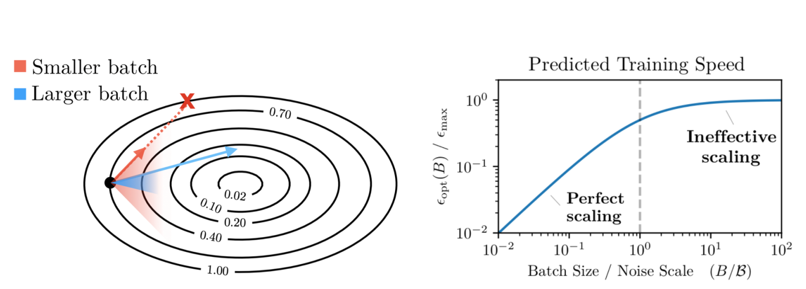

*图 8.3-19 Critical batch size regimes*

图 8.3-19 把 batch size 和"达到 target loss 所需的 steps / samples"放在同一张图里：横轴是 batch size（对数），纵轴分别画 total samples / steps 与 batch 的关系。读图时按 batch 增长方向看：左侧进入 noise-limited regime，batch 翻倍 steps 接近减半，总 samples 几乎不变；右侧进入 bias-limited regime，steps 下降变慢，总 samples 开始上升。两条 regime 的过渡位置就是 critical batch size。

Noise-limited regime 里，batch 还小，mini-batch gradient 的随机噪声很明显。增加 batch 会平均掉一部分噪声，让每一步方向更可靠。这个区间里，batch 翻倍常常能让达到同一 loss 所需的 steps 接近减半，所以总 tokens 不会明显增加。

Bias-limited regime 里，batch 已经大到梯度噪声不再是主要限制。即使用 full-batch gradient，它也只是当前位置的局部下降方向，仍受优化轨迹、曲率和 learning rate 等因素限制。继续增大 batch 时，steps 下降变慢，总 tokens 往往上升。

Noise scale 指 gradient noise scale。可以把它理解成一个 batch 量级：在这个量级附近，mini-batch 梯度噪声和平均梯度信号差不多大。常见估计接近 gradient covariance trace 与 squared gradient norm 的比值。它给出了 noise-limited 到 bias-limited 的大致转折位置。

一个简单例子：batch 从 1M tokens 增到 2M tokens，如果达到同一 loss 的 steps 也接近减半，总训练 tokens 基本不变，并行吞吐变好。batch 再从 2M 增到 4M tokens，如果 steps 只少 10%，总训练 tokens 会明显增加，这次放大就在用样本效率换并行吞吐。

#### 怎样估计 critical batch size

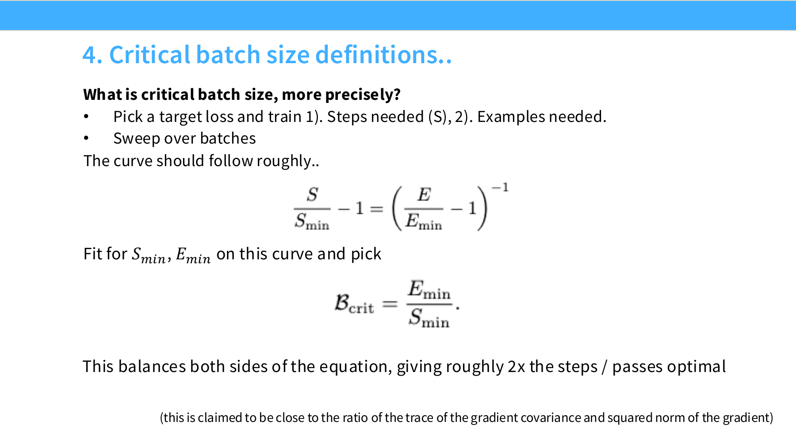

*图 8.3-20 Critical batch size definitions*

图 8.3-20 给出更正式的估计方法：先把一组 (E, S) 实验点画出来（横轴是 samples $E$，纵轴是 steps $S$，每个点对应一个 batch size），再用双曲线拟合。图上能直接读的是 $E_{\min}$ 与 $S_{\min}$ 两个极限量，以及从它们推出的 $B_{\mathrm{crit}} = E_{\min}/S_{\min}$。

下面是对每个 batch $B$ 记录的两个量：

- $S(B)$ ：达到 target loss 需要多少 optimizer steps。
- $E(B)$ ：达到 target loss 总共看过多少 examples / tokens。

二者按定义满足：

$$
E(B) = S(B)B
$$

小 batch 往往 sample efficient， $E(B)$ 较小，但需要很多 optimizer update， $S(B)$ 较大。大 batch 可以减少 steps，但每一步消耗更多 samples， $E(B)$ 往往变大。

把每个 batch 的实验结果画成一组 $(E(B), S(B))$ 点后，可以用下面这种双曲线形状拟合：

$$
\frac{S}{S_{\min}} - 1 = \left(\frac{E}{E_{\min}} - 1\right)^{-1}
$$

这条双曲线只需要估计两个极限量。$S_{\min}$ 是 batch 极大时能接近的最少 steps，可以理解成 update 次数下限。$E_{\min}$ 是小 batch、高 sample efficiency 时能接近的最少 examples，可以理解成样本数下限。

Critical batch size 来自这两个极限量的比值：

$$
B_{\mathrm{crit}} = \frac{E_{\min}}{S_{\min}}
$$

这个 $B_{\mathrm{crit}}$ 通常是拟合出来的量，不一定等于某个真实 run 使用过的 batch。在这条拟合曲线上，$B_{\mathrm{crit}}$ 对应的点大约同时付出 $2S_{\min}$ 的 steps 和 $2E_{\min}$ 的 examples。它牺牲一部分单项最优，换来并行速度和样本效率之间的实用折中。

图 8.3-20 给出的是拟合定义，图 8.3-21 把同一件事放回训练曲线。

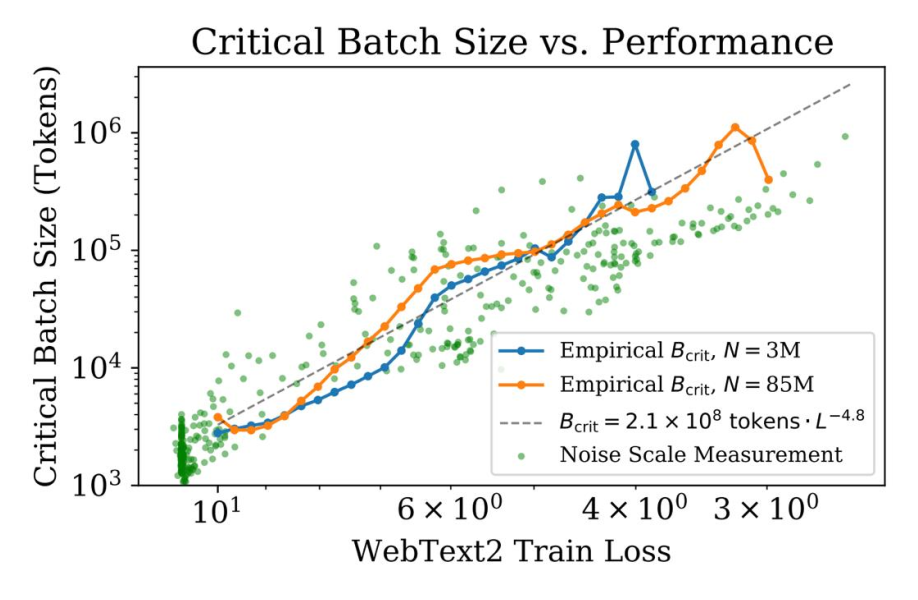

*图 8.3-21 Critical batch loss*

图 8.3-21 把 $S(B)$ 和 $E(B)$ 放回训练曲线：几个不同 batch 的 run 都追同一个 target loss，横向比较它们分别花了多少 optimizer update 和多少样本。

batch size 增大时，达到同一 loss 可能需要更少 steps，但按 $E(B) = S(B)B$ ，每一步消耗的样本同比例增加。样本数增加得比 steps 减少得更多时，这次放大就在用 sample efficiency 换并行吞吐。Critical batch size 是这两种效率之间的平衡点。

#### Critical batch size 怎样随 loss 变化

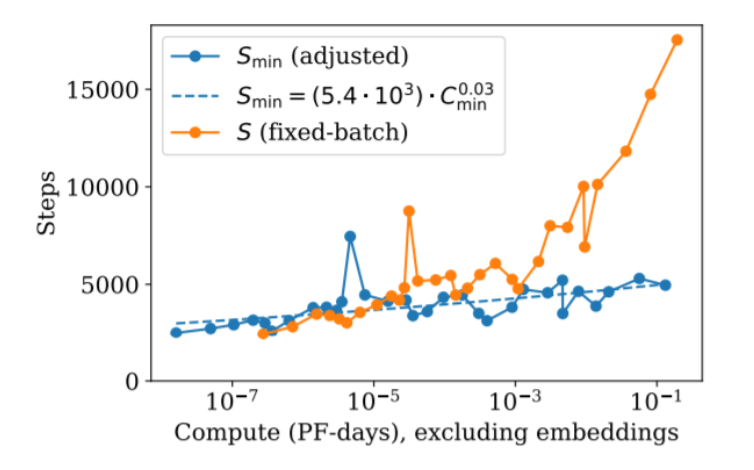

*图 8.3-22 Optimal batch size*

图 8.3-22 解释 critical batch size 为什么会随 target loss 变化。横轴是 target loss，纵轴是 critical batch size（或类似最优 batch 量）。读图时看曲线斜率方向：目标 loss 越低，训练越接近精细优化区间，梯度噪声相对更重要，critical batch size 随目标 loss 降低而单调上升。曲线本身把"压低 loss"和"放大 batch"两件事耦合成一条曲线，两者不能拆开判断。

这解释了为什么大规模 pretraining 往往能使用很大的 global batch。模型更大、目标 loss 更低、并行需求更强，都会把可用 batch 区间推大。实际系统里还要叠加硬件约束：data parallelism 扩吞吐需要足够大的 global batch；如果任务的 critical batch size 不够大，就需要调小并行规模、重新调 learning rate，或者接受一部分样本效率损失。

Batch size 的结论是：不能只按 GPU 数量决定 global batch，还要估计它在目标 loss 附近有没有超过 critical batch size 太多。Batch 和 learning rate 一起决定一次 update：batch 决定梯度估计有多稳，learning rate 决定这份梯度会把参数推多远，所以 learning rate 的 scaling 是同一组决策的另一半。

#### Learning rate：直接拟合或重参数化

Learning rate scaling 要回答的问题是：模型做宽、做深、做大之后，小模型上调出来的 learning rate 还能不能用。这个问题和 critical batch size 很像：都希望用便宜的小实验，预测昂贵大训练里的 optimizer 设置。

这里可以分成两条路线。第一条路线直接拟合：测出最优 learning rate 怎样随 width、compute 或模型规模变化。第二条路线改变参数化：通过初始化、输出缩放和 per-parameter learning rate 规则，让不同 width 下的最优 learning rate 尽量对齐。muP 属于第二条路线。

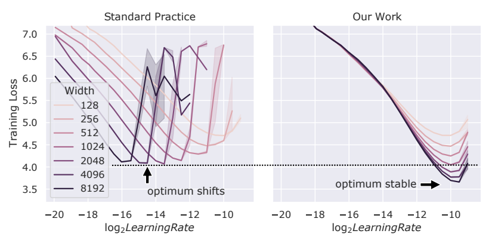

*图 8.3-23 muP learning rate stability*

图 8.3-23 展示 learning rate 随 width 放大时的漂移：横轴是 learning rate，纵轴是 loss，多条曲线对应不同的 width。读图重点是"最低点位置随 width 的漂移"：标准参数化下，宽度变大时最低点整体往左移（最优 learning rate 变小）；muP 把不同 width 的最低点对齐到相近 learning rate，让小模型搜索到的 base learning rate 更容易迁移到大模型。

#### muP：把 width scaling 写进超参规则

muP 常写作 $\mu\mathrm{P}$ ，全称是 maximum update parametrization。正文后续统一写 `muP`。这里的 parametrization 指“同一个网络函数怎样用参数、初始化尺度和 learning rate 尺度表示”。

`maximum update` 强调宽度放大时仍要保留足够大的函数变化。更新太小，宽模型会更接近只在初始特征附近做线性化学习；更新太大，activation、gradient 或 logits 的尺度又可能失控。muP 选择的是中间那类可迁移尺度：一步更新对模型表示有实际影响，但数量级不随 width 明显漂移。

标准参数化通常先保证初始化时的 forward activation 不随 width 明显失控，但模型变宽后，backward gradient 和一次 optimizer update 对表示的影响仍可能随 width 漂移。结果是小模型上合适的 learning rate，放到更宽模型上可能偏大或偏小。

muP 的目标是在 width 放大时同时控制初始化尺度和更新尺度：前者让 forward / backward 的数量级保持稳定，后者让一次参数更新对模型表示的影响保持可比。它为不同参数矩阵规定初始化、输出缩放和 per-parameter learning rate 规则，让 base width 上搜索到的 base learning rate 更有机会迁移到更宽的目标模型。

实践中通常先选一个 base width，在小模型上搜索 base learning rate、初始化尺度和 embedding scale，再把这些 base 超参按 muP 规则映射到更宽的目标模型。这样，小模型调参才有机会迁移到大模型。

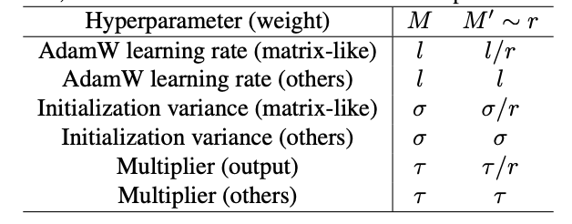

*图 8.3-24 muP implementation table*

图 8.3-24 把 muP 对齐落实到具体参数规则表：行为参数类型（embedding、attention QKV、MLP in / out、output head），列为 base 超参与 target 超参。表中每行给出"宽度从 base 放大到 target 时"应套的 multiplier（learning rate、初始化方差、输出缩放）。这张表直接回答 §8.3.5 里那个迁移问题——base 模型上选的超参按表里的规则乘上对应倍率就能落到 target width。

表头里的 `M' ~ r` 表示把 base model `M` 按宽度倍率 `r` 放大，得到目标模型 `M'`。这里的 `~` 表示宽度缩放关系，可理解为 “scaled by”；右边那一列给出目标宽度上的 muP 超参规则。

这里的 `r` 是 width multiplier，通常对应 hidden size 或 layer width 的倍率：

$$
r = \frac{d_{\text{model,target}}}{d_{\text{model,base}}}
$$

比如 base model 的 hidden size 是 1024，目标模型的 hidden size 是 2048，那么 $r = 2$；如果 hidden size 变成 4096，那么 $r = 4$。图 8.3-24 里的规则使用这个 `r` 调整 matrix-like 参数的 AdamW learning rate、初始化方差和输出 multiplier，目标是让不同 width 下的 update scale 更接近。

做 model scaling、IsoFLOP 或 Chinchilla-style 比较时，横轴通常换成实际参数量、训练 tokens 或训练 FLOPs。宽度倍率需要先通过模型结构换算成参数量。对固定深度的 dense Transformer 主干，attention 和 MLP 里的主要矩阵参数大致随 $d_{\text{model}}^2$ 增长，所以：

$$
\frac{N_{\text{block,target}}}{N_{\text{block,base}}} \approx r^2
$$

若 depth 也从 $L_{\text{base}}$ 变成 $L_{\text{target}}$ ，主干参数量还要乘上层数倍率：

$$
\frac{N_{\text{block,target}}}{N_{\text{block,base}}}
\approx
\frac{L_{\text{target}}}{L_{\text{base}}} r^2
$$

精确比较时不直接拿 `r` 当模型大小。先按目标模型的真实配置数出参数量 $N$，再和训练 tokens $D$、训练 FLOPs $C$ 放到同一张 scaling 账本里。Dense LM 的粗略预算常写成 $C \approx 6ND$ 。

一些结构选择会让 $N$ 偏离上面的 $r^2$ 近似。例如 embedding 和 output head 是否共享权重、FFN expansion 多大、attention 是否使用 GQA / MQA，都会改变实际参数量。MoE 还要区分 total parameters 和 active parameters。

同一个目标模型可以同时放在两张账本里：muP 账本记录 `r`，说明 base 超参如何映射到目标宽度；资源账本记录 actual parameters、tokens 和 FLOPs，说明它和其他训练方案怎样公平比较。

到这里，8.3 已经把 pretraining scaling 的主要变量放进账本：data、model size 和 compute 决定 loss 曲线，batch size、learning rate 和 muP 决定放大时的 optimizer 设置。最后还要补一个边界：这些规律大多建立在 pretraining loss / perplexity 上，最终选择模型时还要检查这种改善能否转成 downstream 收益。

### 8.3.6 下游任务的边界

本节划定 scaling law 的一个边界：pretraining loss / perplexity 的改善能否转成下游 benchmark 的改善。读完本节应能：解释为什么 upstream 与 downstream 排序可能不一致；在小规模和中等规模实验里同时记录两张表（pretraining loss 与下游指标）；判断排序分叉时是否需要把目标任务分数纳入模型选择。

Pretraining loss / perplexity 适合作为 scaling 主指标：数值连续、eval set 大、每个 checkpoint 都能测，随机波动通常较小。它能帮助我们比较数据配比、模型 shape、batch size 和 learning rate 是否让训练曲线稳定改善。

下游 benchmark 回答的是另一类问题：这个 checkpoint 在 SuperGLUE、产品任务或后训练管线里是否更好。Accuracy 等指标更离散，也会受到 prompt、评测格式、fine-tuning、后训练和数据污染影响，所以它和 pretraining loss 通常相关，但模型排序可能改变。

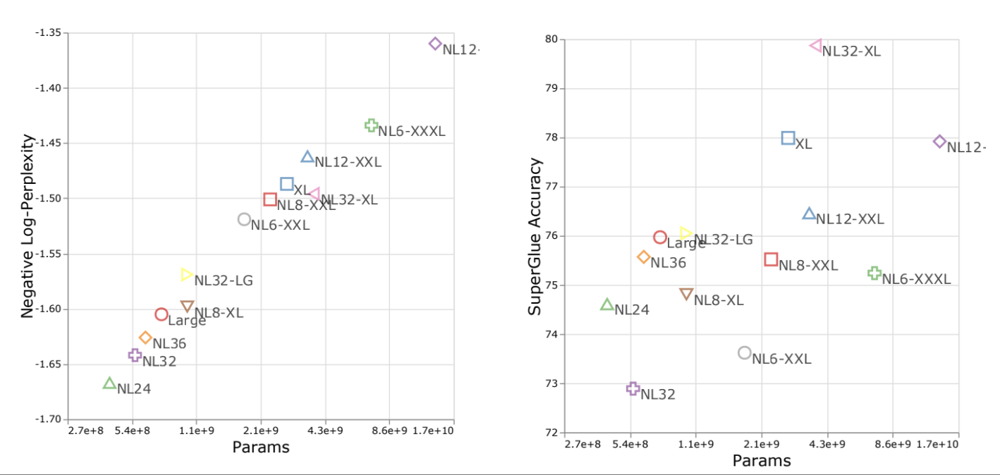

*图 8.3-25 Downstream scaling differences*

图 8.3-25 对比同一批模型在 upstream 和 downstream 上的排序：左右两图横轴都是 parameters，但纵轴分别是 negative log-perplexity 和 SuperGLUE accuracy。左图点大体随参数量上升，趋势清晰；右图同一批点的排序明显变散，pretraining 上很强的模型未必在 SuperGLUE 上拿最高分。读图重点是"两图对应排序的差异"，差异越大说明 downstream 不能用 perplexity 排序直接代替。

因此，大训练前可以把 pretraining loss 当作第一道筛选。Loss 趋势稳定变好，说明数据、模型形状和 optimizer 设置值得继续放大。最终模型选择还要看目标任务，尤其是候选模型的 depth / width 比例、fine-tuning 设置或 prompt 格式不同时，下游排序可能和 perplexity 排序不一致。

如果 SuperGLUE 或产品任务是最终目标，就在小规模和中等规模实验里同时记录两张表：一张表预测 pretraining loss，另一张表记录目标任务分数。两张表排序一致时，放大决策更稳；排序开始分叉时，目标任务分数需要进入模型选择。

## 8.4 Joint Scaling：模型、数据与计算

前面的小节分别看单个资源轴；这一节把模型参数量、训练 tokens 和 compute 放到同一个预算里。固定训练 FLOPs 时，模型越大，每个 token 的训练计算越贵，能训练的 tokens 就越少；模型小一点，同一笔预算可以训练更多 tokens。Joint scaling 要回答的是：给定这笔计算预算，参数量 $N$ 和训练 tokens $D$ 应该怎么配。

### 8.4.1 Joint Fit：先学 N 和 D 怎么影响 loss

本节回答 §8.3 单变量 scaling 留下的开放问题：真实训练里参数量 $N$ 和训练 tokens $D$ 必须放进同一个函数里。读完应能：写出把 loss 拆成 $N$ 方向和 $D$ 方向两项的可加公式；区分 $L_0$、$A$、$B$、$\alpha$、$\beta$ 在公式里各自的角色；以及在小实验网格上验证拟合出的 $L(N,D)$ 曲面能否外推到没参与拟合的点。

前面分别看了 data scaling 和 model scaling。真实训练时，这两个变量不能分开选。沿用 8.1 的粗略 compute 账本 $C \approx 6ND$ ：总训练计算量 $C$ 固定时，参数量 $N$ 增大，训练 tokens $D$ 就要减少；$N$ 小一点，$D$ 就可以更多。

联合缩放把 model size $N$ 、data size $D$ 和 loss 放进同一个函数。它回答的问题是：在同一笔训练计算量下，哪一组 $N$ 和 $D$ 的组合能得到最低 loss？

Rosenfeld 风格的联合误差公式常被写成：误差可以拆成“模型不够大”的项、“数据不够多”的项和一个常数项。换成本章的 $N$ 和 $D$ 记号，可以写成下面这种可加近似：

$$
L(N, D) = L_0 + A N^{-\alpha} + B D^{-\beta}
$$

其中 $L_0$ 和前面的 $L_\infty$ 类似，表示这套任务和数据分布下很难继续压低的 loss 底线。剩下两项描述两种可改进空间：

- $A N^{-\alpha}$ ：模型太小带来的 loss。参数量 $N$ 增大时，这一项下降。
- $B D^{-\beta}$ ：数据太少带来的 loss。训练 tokens $D$ 增大时，这一项下降。

把公式落回训练选择：固定 compute 下，$N$ 和 $D$ 会互相挤占。模型太小，虽然能训练很多 tokens，但容量不够；模型太大，每个 token 太贵，能训练的 tokens 又太少。Joint scaling 要找的是中间区域：模型容量够用，训练 tokens 也够用。

这条公式在这里只负责拆分两种 loss 来源。$L_0$ 是任务和数据分布留下的底线，$A$ 和 $B$ 是拟合常数，$\alpha$ 和 $\beta$ 表示参数量、数据量继续增加时各自的收益速度。后面比较 Kaplan 和 Chinchilla 时，再讨论具体函数形式、IsoFLOP 包络线、参数口径和 optimizer 设置怎样改变外推结果。

#### 从联合损失推导 compute-optimal 配比

把联合损失和计算预算联立，才能得到最优配比的来源。固定 $C$ 时，约束式给出

$$
D=\frac{C}{6N}.
$$

代回联合损失并省略与 $N$ 无关的 $L_0$：

$$
\tilde L(N)=A N^{-\alpha}+B\left(\frac{C}{6N}\right)^{-\beta}
=A N^{-\alpha}+B\left(\frac{6N}{C}\right)^{\beta}.
$$

对 $N$ 求导并令其为零：

$$
-\alpha A N^{-\alpha-1}+\beta B\left(\frac{6}{C}\right)^{\beta}N^{\beta-1}=0.
$$

整理得到

$$
N_{\mathrm{opt}}\propto C^{\frac{\beta}{\alpha+\beta}},\qquad
D_{\mathrm{opt}}\propto C^{\frac{\alpha}{\alpha+\beta}}.
$$

因此，compute 增大时，模型和数据都应增长；增长指数由拟合得到的 $\alpha,\beta$ 决定。当 $\alpha\approx\beta$ 时，两者近似按 $C^{1/2}$ 同步增长，tokens per parameter 在相邻预算间变化较小。Chinchilla 的 IsoFLOP sweep、lower envelope 和 joint fit 都是在实验上估计这两个指数及其常数，而非从公式之外预先指定一个固定的 20 tokens/parameter。

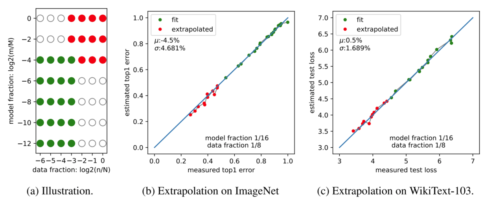

*图 8.4-1 Joint model-data scaling*

图 8.4-1 展示的是“用小模型、小数据实验预测更大组合”的过程，左图把 (model fraction, data fraction) 网格上的绿色点（用于拟合 scaling law）和红色点（用于检查外推到更大数据或更大模型时准不准）用颜色区分；拟合只用绿色，外推只用红色，避免循环验证。

中图和右图把预测值和真实测量值放在一起比较。蓝色对角线表示预测完全准确。点越贴近对角线，说明用绿色小实验拟合出来的公式越能预测红色外推点。

中图是 ImageNet 的 top-1 error，右图是 WikiText-103 的 test loss。两边的红点大体靠近对角线，说明在这组实验里，小模型、小数据上的联合 scaling fit 可以预测一部分没参与拟合的模型-数据组合。这个结论依赖实验点覆盖范围和训练条件一致性；如果红点远离对角线，外推就不可信。

### 8.4.2 Compute Scaling：从训练曲线到 Chinchilla

本节回答 §8.4.1 留下的具体问题：给定训练 FLOPs $C$，$N$ 与 $D$ 怎样配。读完应能：解释 compute scaling 曲线；用 Chinchilla Method 1 / 2 / 3 三种 sweep 互相校验同一组 $N_{\mathrm{opt}}$、$D_{\mathrm{opt}}$；区分 Kaplan 与 Chinchilla 在 $N_{\mathrm{opt}}(C)$、$D_{\mathrm{opt}}(C)$ 指数上的差异；以及在小实验拟合前先对齐参数口径、warmup、batch 和 learning rate。

Joint fit 先把 loss 拆成模型大小 $N$ 和训练 tokens $D$ 两个方向。大训练还要面对第三个变量：总训练计算量 $C$ 。这里的 compute 指训练总 FLOPs，也就是一次训练累计花掉多少次浮点运算；硬件吞吐率 FLOP/s 表示每秒能算多少次。总 FLOPs 除以有效 FLOP/s，才得到训练时间。

把 $N$ 、 $D$ 和 $C$ 放在一起，问题分成两层。第一层是 compute scaling：训练 compute 增大时，最好的 loss 大致怎样下降。第二层是配置分配：在某个固定 compute 下，应该把预算分给更大的模型，还是分给更多 tokens。

#### 从训练曲线到固定预算

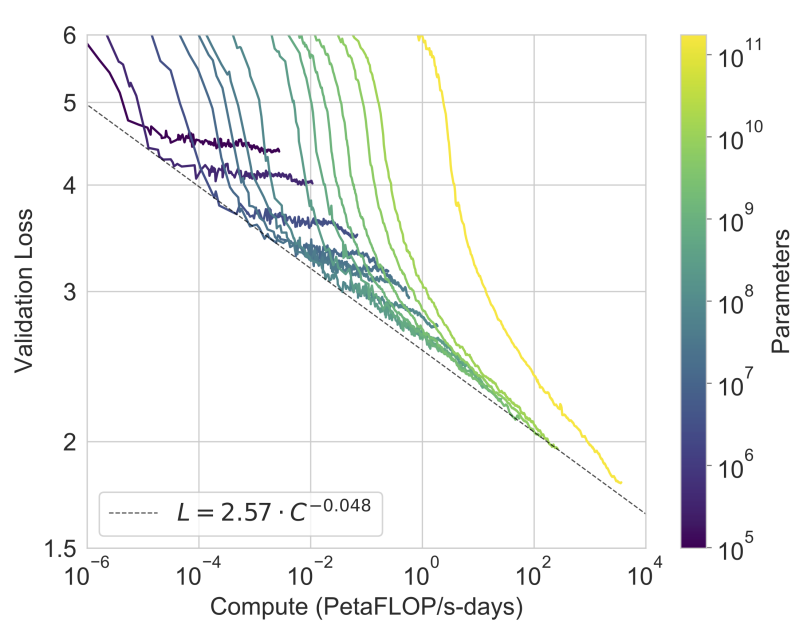

*图 8.4-2 Compute scaling curves*

图 8.4-2 把多条不同模型大小的训练曲线画在同一张图上。每条彩色曲线是一次具体 run 的累计 compute vs validation loss：曲线越往右，表示同一个 run 已经训练得更久，累计消耗的 FLOPs 更多。沿同一条曲线走时，模型大小不变；不同颜色之间才对应不同 model size。虚线是把每条曲线最低点串起来形成的 lower envelope，也是 Method 1 的拟合形态。

横轴单位写作 `PetaFLOP/s-days`。这里的连字符不是减号，只是在英文复合单位里把 `FLOP/s` 和 `day` 连在一起，含义是 $(\text{PetaFLOP}/s) \times \text{day}$ 。`Peta` 是 SI 十进制前缀，表示 $10^{15}$ ；1 天是 $24 \times 60 \times 60 = 86400$ 秒。因此 1 个 `PetaFLOP/s-day` 表示以 $10^{15}$ FLOP/s 的有效速度连续运行 1 天产生的计算量：

$$
10^{15} \times 86400
= 8.64 \times 10^{19}
\text{ FLOPs}
$$

它是总计算量单位，真实训练耗时还要除以硬件的有效 FLOP/s。

虚线给出这批训练点拟合出的 compute scaling 趋势：随着训练 compute 增加，可达到的较低 loss 近似按 power law 下降。图上的实际判断来自曲线的相对位置：在某个 compute 位置，loss 最低的那条训练曲线对应当时最划算的 run。把这些低点串起来，就是后面 Method 1 的 lower envelope 思路。

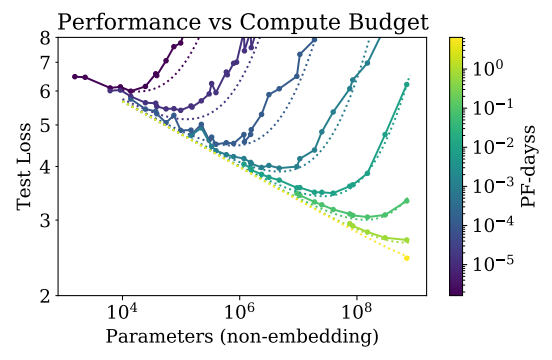

*图 8.4-3 Loss vs model size by compute*

图 8.4-3 把固定 compute 下的配置取舍放到参数量轴上：每条曲线是一档训练 compute 区间，沿同一条曲线移动时，参数量在变、训练 tokens 也随 $C \approx 6ND$ 预算约束一起变化。

图 8.4-3 把固定 compute 下的配置取舍放到参数量轴上。参数量太小时，模型容量限制 loss；参数量太大时，同一预算下可训练 tokens 变少，loss 也会变差。曲线最低点对应这个 compute 区间里更合适的模型大小。后面的 Chinchilla Method 2 会把这个想法做得更系统：显式固定一组 FLOP budgets，在每个预算内扫参数量 $N$ 和训练 tokens $D$ 的配比。

#### Chinchilla 的 fixed compute 结论

Chinchilla 是固定 compute 问题上的代表性案例。它的结论是 train-optimal：给定训练 compute，模型参数量和训练 token 数要一起增长。模型过大时，tokens per parameter 会太低，参数没有被充分训练。

最常被引用的经验点是 `20 tokens/parameter` 附近。数量级上，如果模型有 70B 参数，按这个比例就是大约 $70\text{B} \times 20 = 1.4\text{T}$ tokens。这个例子很有用，因为它把抽象比例变成了训练计划：既要问“模型多大”，也要问“这些参数看过多少 token”。

*图 8.4-4 Chinchilla IsoFLOP curves*

图 8.4-4 把 Chinchilla 的 fixed compute 问题画成一组 IsoFLOP 曲线，每条曲线是一档固定训练 FLOP budget，曲线的最低点用不同颜色的星号标出。沿同一条曲线移动时，训练 compute 近似固定，可以用 $C \approx 6ND$ 理解：参数量 $N$ 增大，可训练 tokens $D$ 就要减少；参数量 $N$ 减小，tokens $D$ 可以增加。

每条曲线的最低点对应这档预算下的 train-optimal 配置。最低点左侧是模型偏小的区域，容量限制 loss 继续下降；最低点右侧是模型偏大的区域，同一预算只能看较少 tokens，参数训练不充分。更大的 FLOP budget 会把可达到的 loss 往下推，同时把最优点推向更大的 $N$ 和更多的 $D$ 。

这组曲线解释 Kaplan 风格结论和 Chinchilla 结论的分歧。早期 extrapolation 更容易选择大模型、少 tokens 的方案；Chinchilla 重新固定训练 compute 后，很多预算下的低点落在相对更小的模型和更多 tokens 一侧。

这里的“更优”限定在训练 compute 和 pretraining loss。serving cost 还要单独核算模型上线后的 GPU 时间、显存、KV cache、延迟和吞吐成本。

#### 三种方法校验同一个比例

Chinchilla 使用三种方法互相校验：minimum over runs、IsoFLOP 分析、joint fits。它们都在找同一件事：固定 compute 时，哪种模型/数据组合 loss 最低。三种方法的差别在于实验点怎么取、函数形式假设多强，以及能否直接回答固定预算问题。

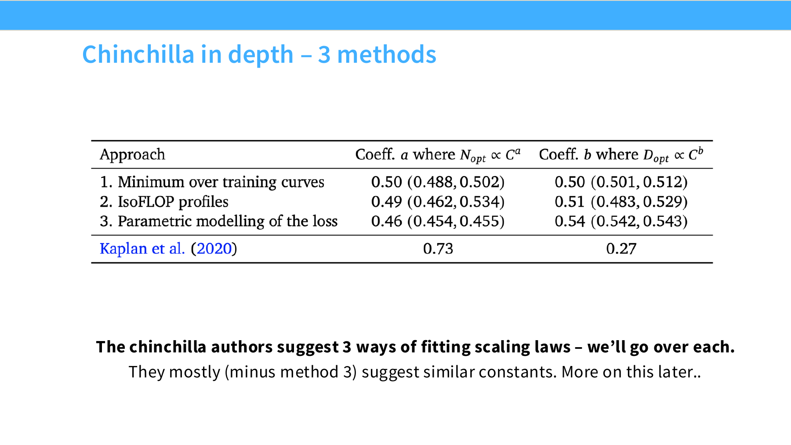

*图 8.4-5 Chinchilla three methods*

图 8.4-5 先给出三种方法的总览。Method 1 直接从已有训练曲线里取最低 loss，Method 2 专门构造固定 FLOP 预算下的 sweep，Method 3 把所有点放进一个联合 loss surface。三种方法的实验设计和函数假设不同；它们指向相近比例时，结论对单一设计选择的依赖就更小。

#### Method 1：从已有 runs 取下包络

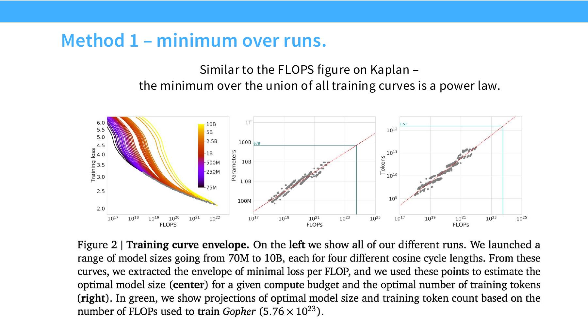

*图 8.4-6 Method 1 lower envelope*

Method 1 也叫 `minimum over runs`。Lower envelope 可以理解成“下包络线”：把所有已经跑过的训练曲线画在同一张图上，在每个 compute 位置只取 loss 最低的那个点，再把这些最低点连起来。每个最低点都来自某个具体训练 run，因此可以反推出对应的模型大小和训练 tokens。

Lower envelope 的优点是直观，不需要先假设完整 $L(N,D)$ 曲面；限制是它只能在已经跑过的训练曲线里选赢家。若某个更好的模型/数据组合没有被训练过，下包络线也看不到它。

#### Method 2：把 IsoFLOP 做成实验 sweep

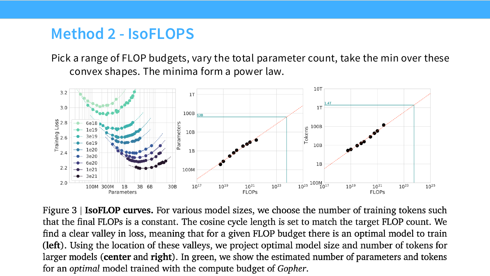

*图 8.4-7 Method 2 IsoFLOP*

图 8.4-7 和图 8.4-4 属于同一类 fixed-compute 曲线。图 8.4-4 用这组曲线解释 Chinchilla intuition；这里把同一类曲线放回 Method 2 的实验流程：先选一组固定 FLOP budgets，再在每个预算内扫不同模型大小。每换一个 $N$ ，训练 tokens $D$ 都按同一个 compute 账本调整。

Method 2 的关键输出是每条预算曲线的最低点。把这些最低点收集起来，就能拟合 $N_{\mathrm{opt}}(C)$ 和 $D_{\mathrm{opt}}(C)$ 的 scaling 关系。它的好处是问题定义最干净：固定预算，只比较配置。代价是实验更贵，因为每个 FLOP budget 都需要专门扫一组候选模型。

#### Method 3：拟合完整 loss surface

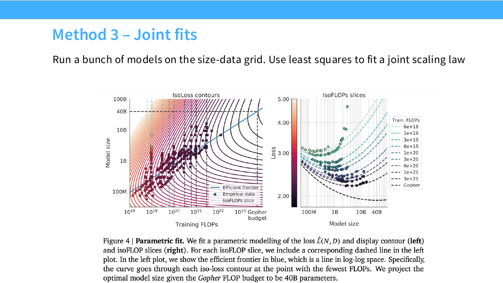

*图 8.4-8 Method 3 joint fits*

Method 3 是 joint fit。它假设一个完整的 $L(N,D)$ 函数形式，把不同模型大小和数据量的训练点一起拟合成 loss surface，再从曲面上推导固定 compute 下的最优 $N,D$ 。这个方法利用的点最多，也最依赖函数形式和拟合质量。

#### Kaplan 和 Chinchilla 为什么会分叉

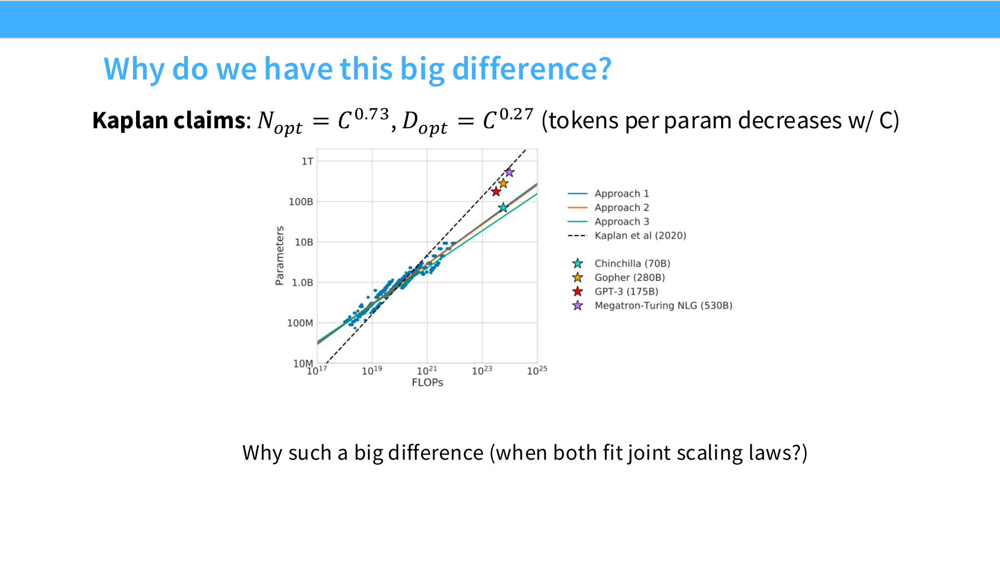

*图 8.4-9 Kaplan-Chinchilla difference*

图 8.4-9 对比 Kaplan 和 Chinchilla 对 compute-optimal 配置的预测。Kaplan 的拟合给出 $N_{\mathrm{opt}} \propto C_{\min}^{0.73}$ 、 $D_{\mathrm{opt}} \propto C_{\min}^{0.27}$ （[arXiv:2001.08361](https://arxiv.org/abs/2001.08361) §6.1 与 Table 附录），也就是新增 compute 主要分给参数量，tokens per parameter 随预算增大而下降；Chinchilla 则让参数量 $N$ 和训练 tokens $D$ 接近同比例增长。

这个分歧主要来自低 compute 区间的拟合差异。Scaling law 会从小模型、小预算实验外推到大训练；如果小实验的参数口径、训练步数或 optimizer 设置有偏差，外推后的 $N_{\mathrm{opt}}(C)$ 和 $D_{\mathrm{opt}}(C)$ 就会明显分叉。

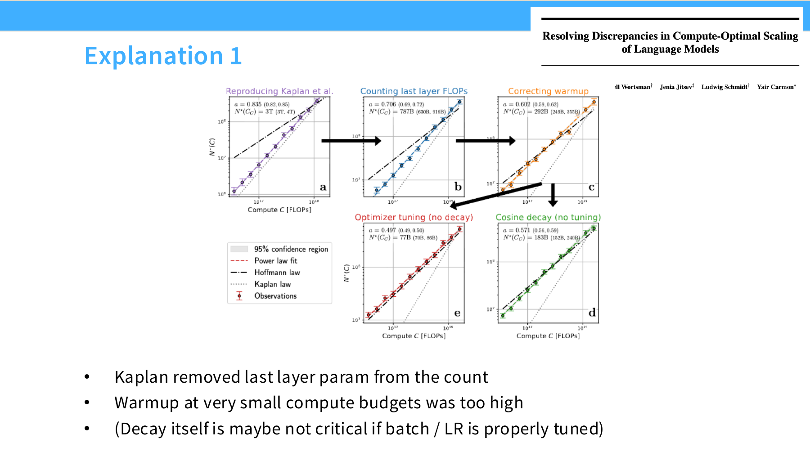

*图 8.4-10 Discrepancy explanation 1*

图 8.4-10 可以拆成三类因素。

第一类是参数和 compute 口径。Kaplan 的拟合使用 non-embedding parameters；小模型里 embedding 和 output head 占比更高，排除这些参数会明显改变横轴位置。output head 还会消耗训练 compute，因此参数口径和 compute 口径不一致时，小模型区间会被重新弯折，外推斜率也会变。

第二类是 warmup。很多低 compute run 训练步数很少；如果 warmup 占了过高比例，模型会在 learning rate 还没进入有效区间时消耗掉大量预算。这样的小模型 loss 会偏高，拟合会低估“小模型多训练 tokens”的收益。

第三类是 batch / LR。固定 batch 和固定 optimizer 设置会让不同规模的模型处在不同的优化状态。小模型通常需要更小或重新调过的 batch、learning rate 和 AdamW 参数；这些设置随规模调好后，复现实验会更接近 Chinchilla 的比例。Learning rate decay 的影响相对次要，前提是 batch 和 learning rate 已经在对应规模上调通。

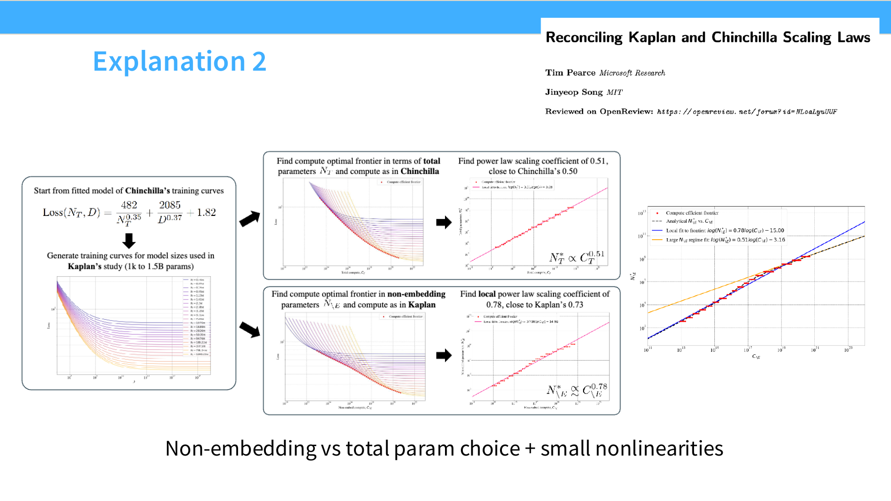

*图 8.4-11 Discrepancy explanation 2*

图 8.4-11 从另一个角度说明同一件事：把 Chinchilla 隐含的训练曲线按 Kaplan 的低 compute 口径重新投影，也能得到接近 Kaplan 的斜率。这里不需要假设两篇工作的真实趋势完全矛盾；低 compute 区间很敏感，参数口径和训练设置的小差别足以改变外推形状。

所以，可靠的 scaling fit 要先固定横轴口径和训练口径。参数量用 total parameters 还是 non-embedding parameters，compute 是否包含 output head，warmup 是否按训练步数缩放，batch / LR 是否按规模重新调优，都会进入最终外推。

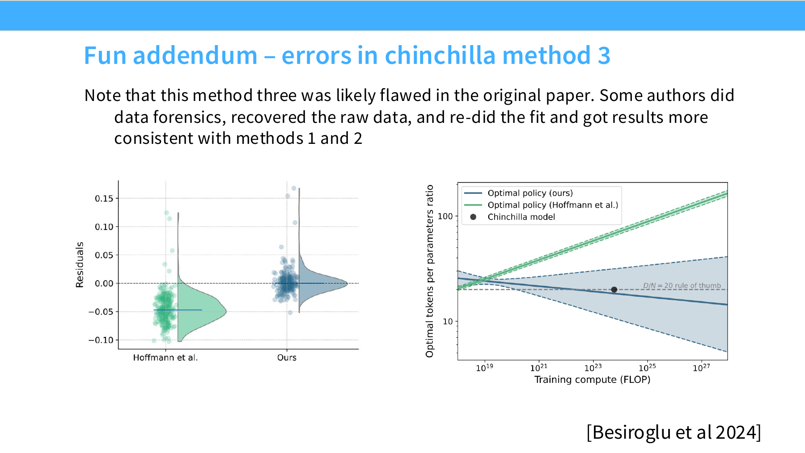

*图 8.4-12 Chinchilla method 3 error*

图 8.4-12 处理 Chinchilla 内部的另一个细节：Method 1 / 2 支持 parameters 和 tokens 近似同比例增长，也就是 `D/N` 大致稳定；原始 Method 3 的 exponents 不同，直接外推时 tokens 和 parameters 的比例会随 compute 漂移。

后续复核（Besiroglu et al. 2024，[arXiv:2404.10102](https://arxiv.org/abs/2404.10102)）从论文图中恢复数据并重做拟合，发现原始 Method 3 对那组点 underfit。重拟合后，Method 3 也更接近 Method 1 / 2 和 `D/N ≈ 20` 的结论。

这一组图的训练含义很直接：不要只抄最终 tokens per parameter。先对齐 total parameters、训练 FLOPs、warmup、batch、learning rate、optimizer、tokenizer、上下文长度和数据处理，再用自己的小实验复核比例。

### 8.4.3 Train-Optimal 不等于 Inference-Optimal

本节回答 §8.4.2 留下的部署侧问题：train-optimal 比例能否直接用于 serving。读完应能：区分 train-optimal 与 inference-optimal 的目标函数；解释 overtraining 把更多一次性训练投入换成更长期 serving 成本的原因；以及用 tokens per parameter 这一比例大致判断一个模型是接近 train-optimal 还是已经 overtraining。

Chinchilla 的 20 tokens per parameter 描述的是训练计算最优附近的经验比例。部署时，inference 成本常常占模型生命周期的大头。为了降低延迟和 serving 成本，很多团队会选择更小模型、更多 tokens 的 overtraining 策略。

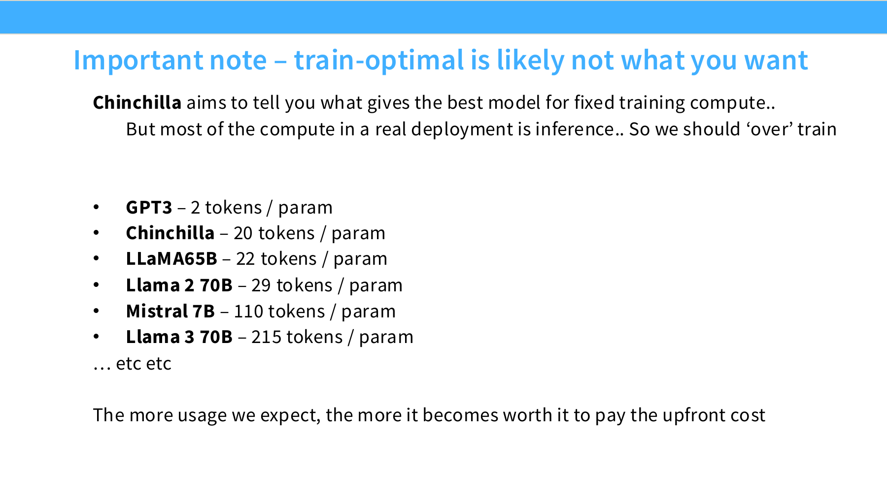

*图 8.4-13 Train-optimal vs inference-optimal*

图 8.4-13 比较两种优化目标。`train-optimal` 在固定训练 FLOP budget 下寻找 loss 最低的配置。`inference-optimal` 还会计算模型上线后的长期推理成本；预计请求量很大时，更小的模型配合更多训练 tokens 可能带来更低的总成本。

几个公开模型的 tokens per parameter 大致趋势是：

| 模型 | 大致 tokens per parameter |
| --- | --- |
| GPT-3 | 约 1.7 |
| Chinchilla | 约 20 |
| LLaMA 65B | 约 22 |
| Llama 2 70B | 约 29 |
| Mistral 7B | 约 1100（官方未披露，社区按 ~8T tokens 估计） |
| Llama 3 70B | 约 223（15.6T / 70B） |

一个简单账本是：训练只付一次，但推理会在模型生命周期里反复付费。若两个模型 pretraining loss 接近，较小模型通常更容易部署，KV cache 更小，单 token latency 和服务成本也更低。因此生产系统常愿意用更多训练 tokens 换一个更小、更便宜的 serving 模型。

在部署语境里，`overtraining` 表示相对于 train-optimal 比例，给较小模型训练更多 tokens。它把更多一次性训练投入换成更低的长期 serving 成本；是否划算取决于预计请求量、延迟目标和部署硬件。

公开模型的 tokens per parameter 越来越高，通常反映的是 serving 成本变得更重要。Chinchilla 帮你回答“训练预算固定时怎么分配参数和 tokens”；部署时还要再问“这个模型未来要被调用多少次，每次推理成本是多少”。

## 8.5 扩散模型与其他 IsoFLOP 例子

这一节只说明一个实验流程：IsoFLOP 不限于 autoregressive LM。对每一档固定的训练 FLOP budget，扫描模型大小等配置，找出 validation loss 最低的点，再观察最优配置怎样随预算变化。扩散语言模型可以使用同一流程，但它的 compute-optimal 趋势不必和 autoregressive LM 相同。

> [!NOTE]
> Autoregressive LM 的 scaling 主线见 §8.4；diffusion 与 MoE 的 IsoFLOP 例子来自 Plaid 等公开论文，用于把同一套工作流推广到 AR 之外。它们共享固定 FLOP budget、扫描候选配置、比较 lower envelope 的分析步骤，但计算图和质量指标有所不同。

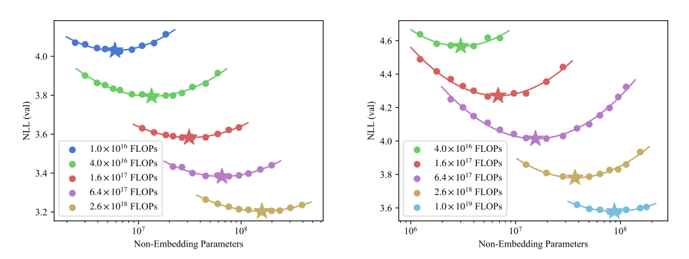

*图 8.5-1 Diffusion IsoFLOP curves*

图 8.5-1 把 diffusion LM 的 IsoFLOP sweep 画在一组 U 形曲线上，每种颜色是一档固定训练 FLOP budget，曲线上不同位置的点是不同模型大小。NLL 衡量模型对未参与训练的验证文本预测得有多好。对验证样本 $x$ ，它对应 $-\log p_\theta(x)$ ，实际报告通常还会按 token 平均。直观上，真实 token 的预测概率是 `0.6` 时，NLL 会低于预测概率只有 `0.1` 的情况，因此 NLL 越低越好。

每种颜色对应一档固定训练 FLOP budget，曲线上的点是不同模型大小。从小模型开始增加参数量时，容量提升会降低 NLL；模型继续变大后，可训练的 tokens 随单 token 成本增加而减少，NLL 又会升高。星号标出该预算下的 compute-optimal 模型大小。

### 8.5.1 扩散语言模型的 IsoFLOP

本节回答 §8.5 留出的具体问题：把同一套 IsoFLOP 流程搬到 diffusion LM 上，结果有什么差异。读完应能：把每档 FLOP budget 下的最低 NLL 连成 power-law；区分 4× smaller × 4× longer 这一 compute-optimal 形状差异，与 64× 这一追平 AR 同等 NLL 所需额外 compute 的常数因子；以及在工程上判断 diffusion sweep 是否值得扩展到比 §8.4 更大的预算。

扩散语言模型（diffusion LM）可以把同样的 IsoFLOP 流程跑一遍：对每档训练 FLOP budget 扫描模型大小，标出最低点，再拟合 scaling 曲线。与 autoregressive LM 的关键差异是单 token 的训练成本不同，因此 diffusion 达到相近 NLL 通常需要约 64× 的训练 compute（Plaid 论文 [arXiv:2305.18619](https://arxiv.org/abs/2305.18619) §5 报告的常数因子）。该论文同时给出：compute-optimal Plaid 模型约比 compute-optimal AR **小 ~4×、训练长 ~4×**——4× smaller × 4× longer 是 diffusion 在同一 FLOP 预算下的 compute-optimal 前沿形状（与 AR 的 compute-optimal 形状并行），而 64× 是"追平 AR 同等 NLL 所需额外 compute"这一独立常数因子。沿用同一套 IsoFLOP 工作流意味着：先得到每档预算的最优配置，再把这些最优点拟合到 power law。趋势稳定时，小规模 sweep 仍可用于规划更大的训练预算。

这里的迁移是实验设计的迁移，不是结论的直接继承：AR 与 diffusion 必须分别定义一次训练 step、token 预算和 NLL 评测协议，再在相同 FLOP budget 下比较。只有当数据、模型容量、优化器和评测分布对齐时，4×/64× 才能解释为 compute efficiency 差异；否则它们只是不同实验协议下的比例。

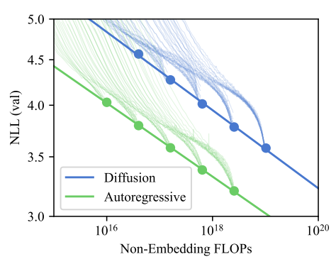

*图 8.5-2 Diffusion optimal scaling*

图 8.5-2 的半透明细线是各个固定模型的完整训练轨迹。沿一条细线向右，模型大小保持不变，累计训练 FLOPs 增加，validation NLL 逐渐下降。图 8.5-1 中每档 FLOP budget 的最低点在这里画成大圆点；蓝色和绿色粗线分别是对 diffusion 与 autoregressive 最优点做出的 power-law fit。

细线描述固定模型怎样随训练推进，粗线描述每个 compute 位置能够达到的最低 NLL，两者的斜率含义不同。这组实验中，diffusion 和 autoregressive 的粗线斜率几乎相同，主要差异是 compute efficiency：diffusion 达到相近 NLL 约需要 64 倍训练 compute。

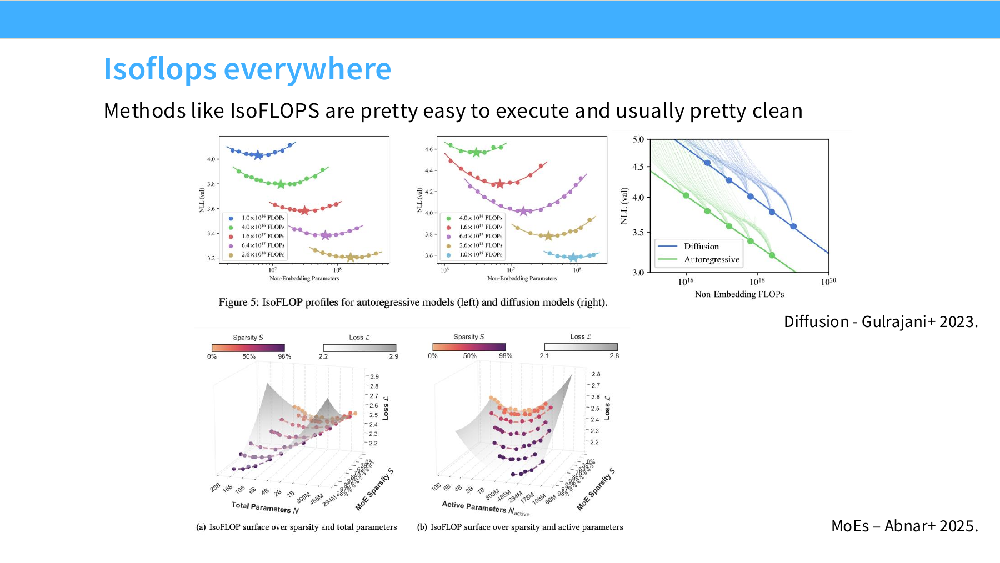

*图 8.5-3 IsoFLOP everywhere*

图 8.5-3 把同一流程扩展到 MoE。MoE 实验可以在固定预算下扫描 total parameters、active parameters 和 sparsity，比较每种组合的 loss。IsoFLOP 的产物始终是两步：先得到每档预算下的最优配置，再检查这些最优点能否形成稳定的 scaling rule。趋势稳定时，小规模 sweep 才能用于规划更大的训练。

### 8.5.2 MoE 的 IsoFLOP

本节回答 §8.5 留出的另一个具体问题：把 IsoFLOP 流程扩展到 MoE 时，新增的第三轴 sparsity 怎样参与 sweep。读完应能：在 fixed FLOP budget 下同时扫描 total params、active params、sparsity 三轴网格；解释 active params 边际收益先饱和的现象；以及理解 DeepSeek / Qwen / Kimi K2 在 §8.6 如何复用这一三轴网格选 MoE 配置。

MoE 给 IsoFLOP 加了一个变量：total parameters 与 active parameters 之比。固定 FLOP budget 下，扫描 total params、active params 和 sparsity 三轴网格，比较每种组合的 validation loss。与 dense LM 相比，MoE 的 scaling rule 通常表现为：total params 更大时 loss 更低，但 active params 增加带来的边际收益会先饱和。这一现象在 §8.6 现代报告里被 DeepSeek / Qwen / Kimi K2 反复使用：先确定 FLOP budget，再在 MoE 三轴网格上选 active params 与 sparsity。

三轴 sweep 要把路由成本纳入同一账本：固定总 FLOPs 只约束 expert compute，还要记录 router、dispatch、all-to-all 和 capacity overflow。实验中分别报告 total parameters、active parameters、每 token FLOPs、expert utilization 和 validation loss，才能判断 loss 改善来自容量增加、激活计算增加，还是路由/通信条件变化。

## 8.6 Scaling in Practice：MiniCPM、DeepSeek 与现代报告

这一节把前面的 scaling 工具放回实际训练流程里。大训练前最难定的量通常不止一个：learning rate、batch size、scheduler、训练 tokens、模型大小、MoE 稀疏度、optimizer 都可能随规模变化。

每个案例都对应一个训练决策问题。MiniCPM 关心怎样用小模型预实验降低搜索成本；DeepSeek 关心怎样直接测 batch / LR / IsoFLOP；后面的公开报告把同一套思路扩展到 MoE、architecture choice、optimizer 和下游指标。

### 8.6.1 MiniCPM：muP、WSD 与逐级放大的小模型预实验

本节解决一组前置问题：目标模型已经大到不能反复试错时，哪些选择可以先在更小模型上定下来、怎样逐级验证迁移是否成立。读完本节应能：理解 muP 的五类参数操作如何稳定跨宽度 learning rate、识别 batch / learning rate / WSD 的拟合曲线随 token budget 怎样移动，以及判断 §8.6.5 Cerebras-GPT 与 §8.6.6 的 muP 推导细节何时需要单独查阅。

MiniCPM 的具体答案是：用 muP 改参数化让 base learning rate 跨宽度迁移，用 WSD 把训练轨迹复用成多档 token budget 的 final checkpoint，再用 lower envelope 与 joint fit 估计模型—数据分配。下面按这三步展开。

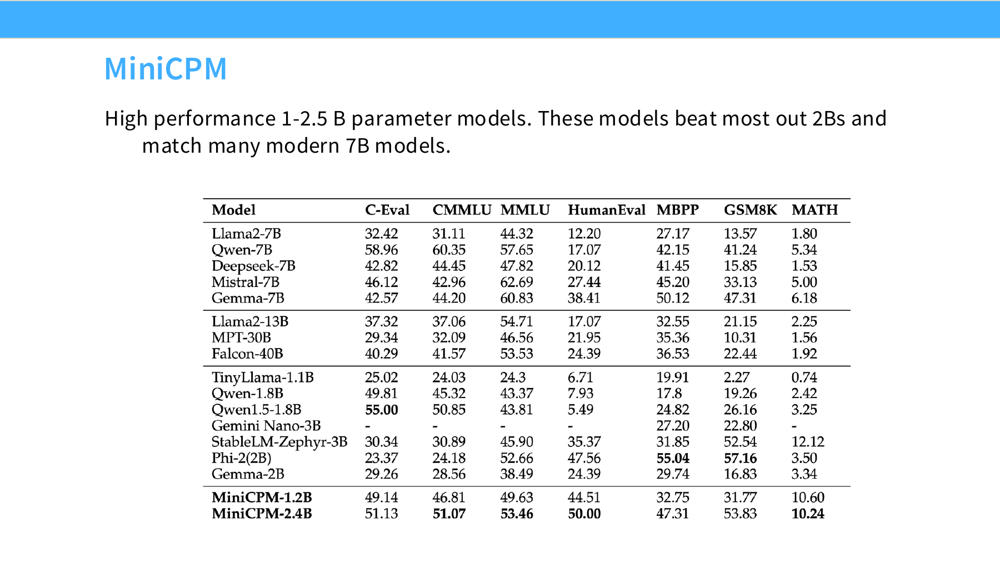

*图 8.6-1 MiniCPM performance comparison*

图 8.6-1 把 MiniCPM 与同代 1-2.5B 参数规模的开源模型放在一起比较 benchmark 分数，标出 MiniCPM 在这一区间的相对位置。它本身不解释具体数字。本节下面三张图（§8.6.1 的 muP / WSD / 数据 sweep）逐一展开训练过程：哪些超参数可以先在小模型上定，哪些仍需要随规模重新测。

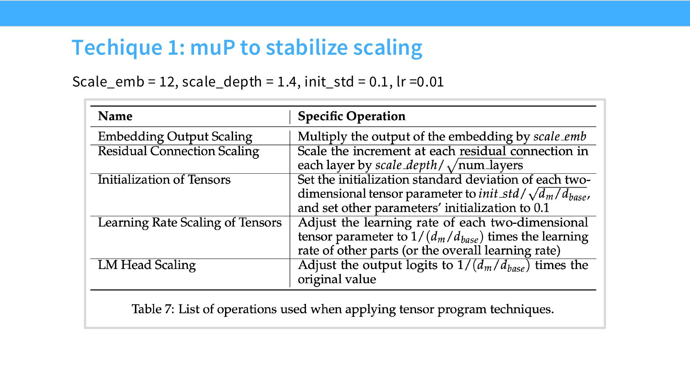

*图 8.6-2 MiniCPM muP operations*

MiniCPM 的第一步是用 muP 改参数化，让 learning rate 更容易跨规模迁移。图 8.6-2 列出的五类操作都在控制 activation 或 update 随模型宽度变化的尺度。

| 操作 | MiniCPM 做法 | 训练含义 |
| --- | --- | --- |
| Embedding output scaling | embedding 输出乘以 `scale_emb` | 控制 embedding 信号进入主干时的尺度。 |
| Residual connection scaling | 每层 residual increment 乘以 `scale_depth / sqrt(num_layers)` | 避免深层残差累积让 activation 尺度漂移。 |
| Matrix tensor initialization | attention / MLP 这类矩阵权重用 `init_std / sqrt(d_m / d_base)` 初始化 | 宽度变大时同步调整矩阵初始尺度。 |
| Tensor learning-rate scaling | 矩阵权重的 learning rate 乘以 `1 / (d_m / d_base)` | 控制矩阵 update 对函数的影响。 |
| LM head scaling | 输出 logits 乘以 `1 / (d_m / d_base)` | 让输出层尺度与主干宽度调整保持一致。 |

表中五类规则共同控制两类尺度：初始化后的 activation scale，以及一次 optimizer update 带来的 activation change。只要这两类尺度在当前架构上近似稳定，小模型上找到的 base learning rate 才更可能迁移到大模型。

> [!NOTE]
> MiniCPM paper（[arXiv:2404.06395](https://arxiv.org/abs/2404.06395) Appendix A.1）给出一组具体 muP 超参数：`Scale_emb = 12`、`Scale_depth = 1.4`、`init_std = 0.1`、`base learning rate = 0.01`。CerebrasGPT 的 muP 对照组使用相同的参数化方法覆盖 111M 到 2.7B（SP 组另含 6.7B / 13B），验证 muP 比 standard parametrization 在跨宽度 loss 稳定性上更优。具体微调（如 `d_base` 的取值）随模型族不同。

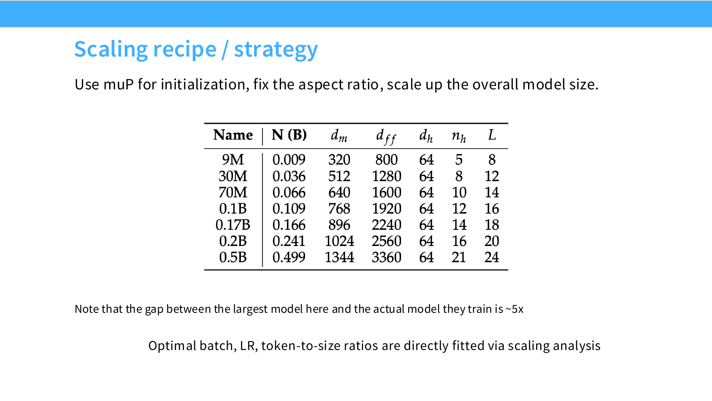

*图 8.6-3 MiniCPM scaling strategy*

图 8.6-3 把这条路线放到模型族上：先固定 aspect ratio，再用一批逐级放大的预实验模型做系统实验。论文里每个问题各用一组规模——batch size 实验用 0.009B / 0.03B / 0.17B（§3.2），learning rate 实验用 0.04B / 0.1B / 0.3B / 0.5B 并在 2.1B 上验证迁移（§3.3），WSD 与 scaling law 拟合用 0.04B 到 2B 之间的 6 档（§4.5）。最终发布的 MiniCPM-2.4B 有约 24.4 亿非 embedding 参数，与最大预实验档位 2B–2.1B 处于同一数量级；预实验网络足够覆盖发布模型的规模区间，超参数迁移的样本就在这一档内做验证。

这套流程要在较小模型上先定住最敏感的量：muP 相关初始化和 per-parameter learning rate、optimal batch size、base learning rate，以及训练 token 数与模型参数量的比例。MiniCPM 的 scaling workflow 可以压缩成四个训练问题：

1. 用 muP 后，小模型上的 learning rate 能不能迁移。
2. 固定模型 aspect ratio 后，batch、learning rate 和 tokens per parameter 怎么随规模变。
3. 比较多个 token budget 时，WSD 能不能减少重复训练成本。
4. 多组模型和训练长度的 loss，能不能由同一个 scaling function 稳定拟合。

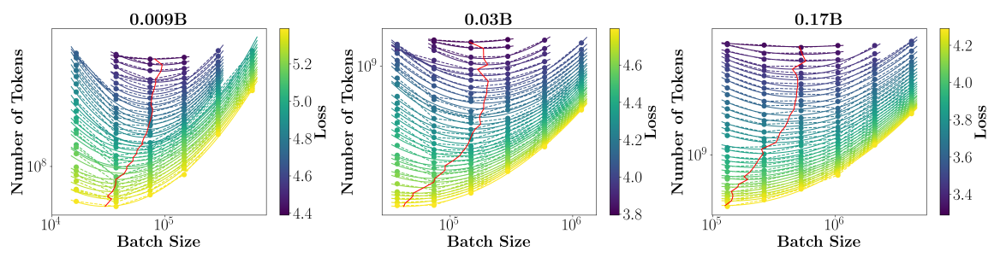

*图 8.6-4 MiniCPM optimal batch curves*

Learning rate 稳定之后，还要决定 batch size。图 8.6-4 的三个子图分别对应 `0.009B`、`0.03B` 和 `0.17B` 参数模型；这里标题中的 `B` 表示 billion parameters。每个子图的横轴是 batch size，纵轴是累计训练 tokens，颜色表示 loss。同一横坐标上的竖列来自一个固定 batch 的训练 run；沿竖列向上，模型累计处理的 tokens 增加。

在相同纵坐标，也就是相同 token budget 附近，可以比较不同 batch 得到的 loss。红线标出每个 token budget 下 loss 较低的 batch。随着累计训练 tokens 增加、目标 loss 降低，红线整体向更大的 batch 移动，说明这组实验中的 optimal batch size 会随训练目标提高而增大。这个趋势绑定当前模型、数据和 optimizer 设置，仍需要在目标训练条件下复核。

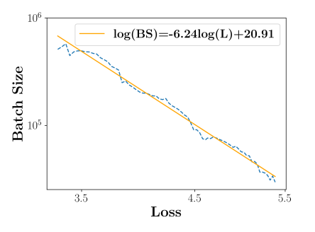

*图 8.6-5 MiniCPM optimal batch trend*

图 8.6-5 把各个 token budget 下选出的 optimal batch 整理到 batch-loss 坐标系。横轴是达到的 C4 loss $L$，纵轴是 optimal batch size $bs$。这些点在 log-log 坐标中近似落在一条直线上，论文拟合得到：

$$
bs \approx \frac{1.21 \times 10^9}{L^{6.24}}
$$

这组实验中，目标 loss 越低，推荐的 batch 越大。这个公式是当前模型、数据、learning rate 和 scheduler 条件下的经验拟合，不能直接作为其他训练任务的固定配置。

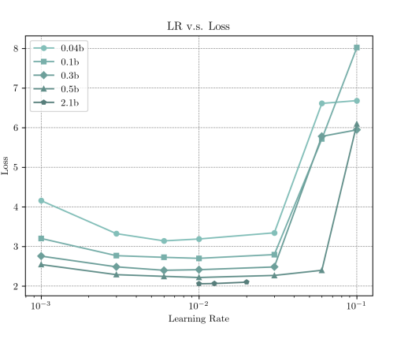

*图 8.6-6 MiniCPM learning-rate stability*

图 8.6-6 检查 muP 是否真的稳定 learning rate。每条曲线对应一个模型规模，横轴是 learning rate，纵轴是 loss。若不同规模的低点都落在相近 learning rate 附近，就说明小模型搜索到的 base learning rate 有机会迁移到更大模型。

工程收益是减少大模型搜索空间：先在较小模型上找到 base learning rate，再迁移到更大模型，并保留中等规模复核。这个结论绑定当前架构、norm、weight decay 和 optimizer；muP 稳定的是特定尺度条件下的 learning rate 迁移，batch、scheduler 和数据量仍要另外测。

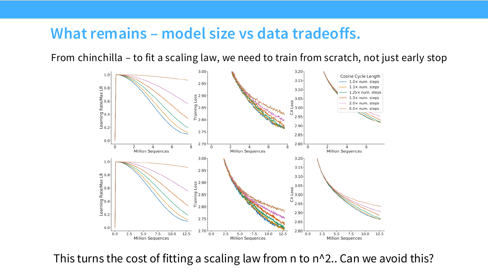

*图 8.6-7 MiniCPM data-model sweep cost*

MiniCPM 还要估计数据量和模型大小的比例。这里的成本来自 scheduler：如果使用普通 cosine schedule，每个计划训练长度都有自己的 decay 轨迹。4M sequences 的 run 与 8M sequences 的 run 起点不同，LR 轨迹不兼容；从 4M checkpoint 接续到 8M 长度会保留 4M 的 LR 轨迹，与 8M-from-scratch 跑出的 final loss 不可直接比较；要在 8M 长度下报告 final loss，需要为 8M 长度重新设计 cosine schedule 的 decay。

图 8.6-7 展示的就是这个 data sweep 成本。若要比较多个训练 token 数，cosine 做法往往需要从头跑多条曲线；WSD 则把大部分训练变成一条可复用轨迹，再从不同 checkpoint 接短 decay，得到多个训练长度对应的 final loss。

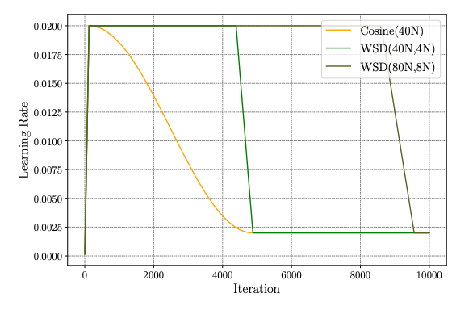

*图 8.6-8 WSD learning-rate schedule*

WSD 是 warmup-stable-decay。图 8.6-8 的横轴是 optimizer iteration，表示 scheduler 随 update step 的推进方式。WSD 先用短 warmup 把 learning rate 拉到目标值，在 stable phase 里保持较高且近似恒定的 learning rate，最后接一段短 decay。Warmup 通常按固定 step 数定义；stable phase 覆盖大部分训练；decay phase 往往只占总训练长度的 10% 到 20%，并把 learning rate 降到峰值的一小部分。

把 stable phase 想成一条可复用的训练轨迹会更容易理解。想比较 100B、200B、300B tokens 的 final loss 时，可以在同一条 stable 轨迹上取三个 checkpoint，再分别接短 decay。这样大部分训练成本只付一次，额外成本主要来自几段 re-decay。

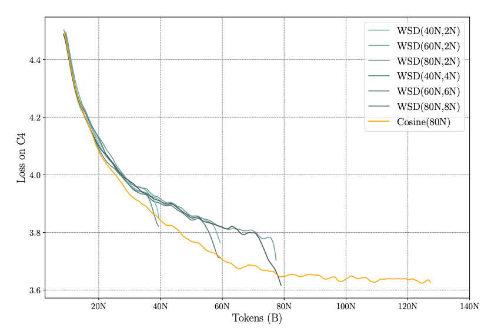

*图 8.6-9 WSD decay loss drop*

图 8.6-9 的横轴 `Tokens (B)` 表示累计训练 tokens，其中 `B` 表示 billion tokens；纵轴是 C4 validation loss。不同 WSD 曲线对应不同 stable / decay 长度设置，橙线是 cosine baseline。这里的横轴记录同一训练过程推进了多少数据，与模型参数量分开。

Stable phase 中的 learning rate 仍然较大，loss 可能比已经 decay 的 cosine 曲线高。这个中途 loss 不能直接作为最终比较点。进入 decay phase 后，learning rate 降下来，loss 会快速下降，最终可以接近甚至超过 cosine baseline。

比较不同训练长度时，要看接完 decay 后的 checkpoint。Stable 中途的点回答的是“继续训练过程中暂时处在什么 loss”，post-decay checkpoint 回答的是“如果把这个训练长度当成终点，最终 loss 是多少”。

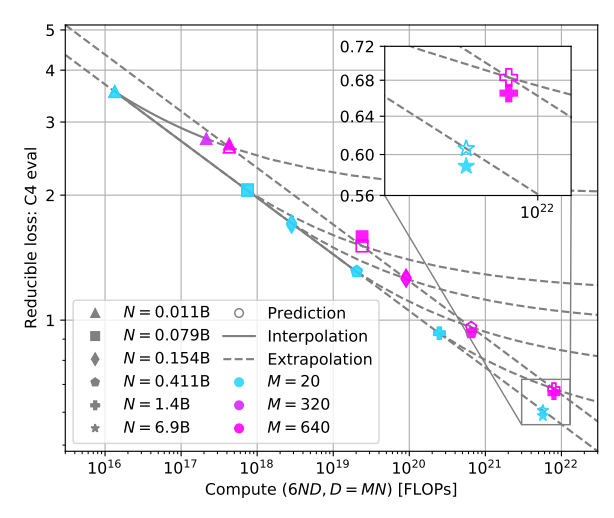

*图 8.6-10 独立对照：over-training scaling fit*

图 8.6-10 来自 Gadre et al. 的 over-training 研究（[*Language Models Scale Reliably with Over-training and on Downstream Tasks*, arXiv:2403.08540](https://arxiv.org/abs/2403.08540)），并非 MiniCPM 实验。这里插入它是为了区分训练 tokens、模型参数量和 tokens per parameter 三种口径。横轴是训练 compute： $C \approx 6ND$ ，其中 $N$ 是模型参数量， $D$ 是累计训练 tokens；图中写成 $D = MN$ ，所以 $M = D/N$ 表示 tokens per parameter。点的形状区分 $N$ ，颜色区分 $M$ ，纵轴是 reducible loss。

这张独立对照比较不同 $N$ 和 $M$ 组合在 compute 轴上的 loss，并检查拟合能否跨组合做 interpolation 或 extrapolation。横轴同时包含参数量和训练 tokens 的贡献，不能解释成单个固定模型的训练轨迹。

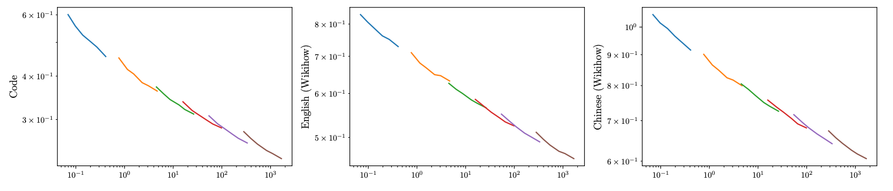

*图 8.6-11 MiniCPM WSD lower envelope*

图 8.6-11 把 §8.4.2 提到的 Chinchilla Method 1 lower envelope 真正落到 MiniCPM 数据上：横轴是训练 compute，纵轴分别是 Code、English Wikihow 和 Chinese Wikihow 上的 held-out loss 三栏；每段颜色对应一个固定模型规模在若干 decayed checkpoints 上的结果。比较同一 compute 附近的不同模型，最下方的边界就是 Chinchilla Method 1 使用的 lower envelope；它依赖候选模型和训练长度是否覆盖了真正的低 loss 区域。

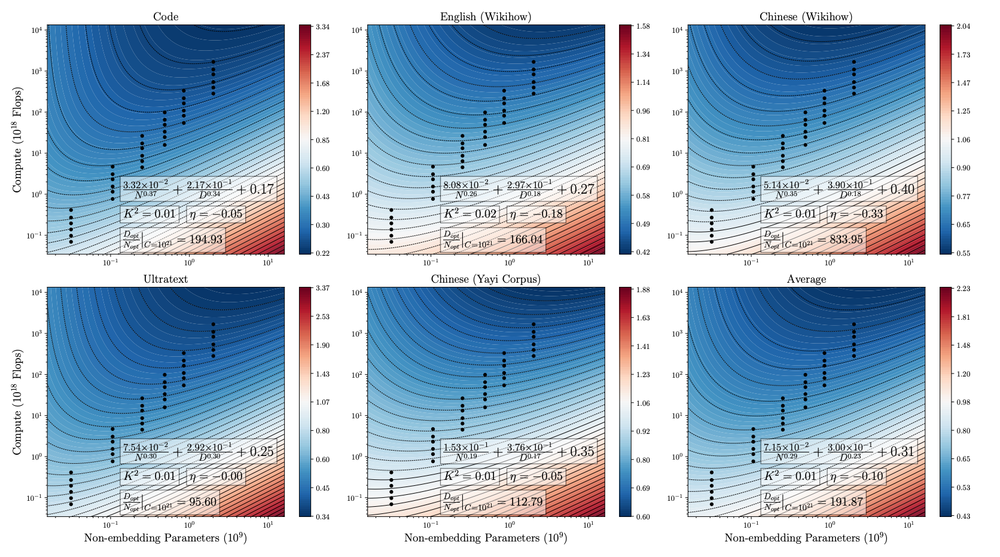

*图 8.6-12 MiniCPM WSD joint fit*

图 8.6-12 是 joint fit 视角，把多组模型大小和数据量的 decayed checkpoint 一起拟合成一张 $L(N,D)$ 曲面（背景色 + 等高线），并标出实际黑点；和 §8.4.2 的 Chinchilla Method 3 同样需要把整张曲面看完。每个黑点是一组实际 decayed checkpoint；等高线和背景色来自拟合函数。MiniCPM 论文 §4.5 "Measuring the Scaling Law with WSD LRS" 给出的拟合结果是 $D_{opt}/N_{opt}\approx 192$，也就是"data size should be 192 times larger than the model size on average"，明显高于 Chinchilla 的约 20；同一曲面对 Llama 2 反推得到 $D_{opt}/N_{opt}\approx 70\text{–}100$（[arXiv:2404.06395](https://arxiv.org/abs/2404.06395)）。这个 192 来自拟合函数在整个曲面上的外推，没有对应某一档固定 compute 预算下的直接测量，证据强度弱于直接覆盖多档固定预算的 IsoFLOP sweep。

这个比例绑定拟合函数、评测语料和指定 compute。MiniCPM 的 Method 1 / 3 曲线较平滑，但论文拟合得到的 exponent 与 Chinchilla 并不完全一致；论文对这次远距离外推也保持保留态度。

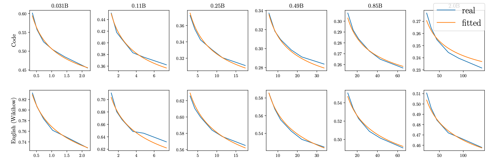

*图 8.6-13 MiniCPM real and fitted loss curves*

图 8.6-13 检查 joint fit 沿数据轴的拟合质量。六列对应 `0.031B` 到 `2.0B` 的模型规模；上排是 Code held-out loss，下排是 English Wikihow held-out loss。横轴是累计训练数据量 $D$，蓝线是真实 checkpoint loss，橙线是 $L(N,D)$ 在固定 $N$ 后给出的拟合值。

真实曲线和拟合曲线大体贴合，说明函数在这些模型规模和训练长度内能够描述 held-out loss；局部偏差也提醒我们，平滑的 contour 并不等于每个 checkpoint 都能被精确预测。这张图没有展示 downstream benchmark，也没有建立 pretraining loss 到任务分数的映射。

MiniCPM 的流程是：用 muP 稳定 learning rate，用 WSD 复用训练轨迹，再用 lower envelope 和 joint fit 估计模型—数据分配。论文最终给出的 $D_{opt}/N_{opt}\approx 192$ 是一次远距离外推结果，Llama 2 反推区间落在 70–100；这类曲面外推的证据强度弱于直接覆盖多档固定预算的 IsoFLOP sweep。

### 8.6.2 DeepSeek：直接拟合 Batch / LR / IsoFLOP

本节回答 MiniCPM 那条 muP 迁移路线之外的可选方案：当参数化迁移假设不成立时，可以直接用小规模实验拟合 batch size、learning rate 与 model-data tradeoff，让 scaling law 自己描述变化。读完本节应能：在 LR / batch grid 上识别近似最优区域是否足够宽、用 IsoFLOP sweep 把 fixed-compute 下的 optimal 配置外推到更大预算，以及判断 DeepSeek-V3 后续多段 LR schedule 与本节思路的承接关系。

DeepSeek LLM 的具体做法是：在多个小模型上同时扫 batch × learning rate 网格，把低 loss 区域连成随 compute 变化的趋势；再在固定 FLOP budget 下做 IsoFLOP sweep，把每档预算的最优配置拿出来拟合。

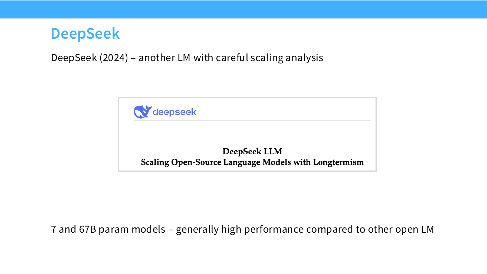

*图 8.6-14 DeepSeek scaling analysis case*

图 8.6-14 把 DeepSeek LLM 7B / 67B 与同代 7B 级开源模型放在一起比较 benchmark 分数，标出 DeepSeek 在这两档规模上的相对位置。它公开了 7B 和 67B 模型，并给出比较细的训练设置分析。本图只标 DeepSeek 7B / 67B 的相对位置；§8.6.2 的图 8.6-15–图 8.6-19 给出 batch / LR / IsoFLOP sweep 的具体曲线。和 MiniCPM 相比，DeepSeek 的实验重心是直接测量超参数如何随规模变化。

这条路线的代价是实验量更大，因为每个规模都需要扫一片 LR-batch space；好处是少依赖参数化迁移假设。只要低 loss 区域在多个规模上形成稳定趋势，就可以把趋势外推到目标训练。

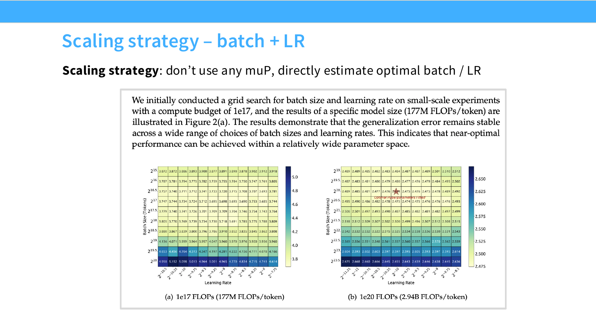

*图 8.6-15 DeepSeek batch / LR strategy*

图 8.6-15 展示两档小规模实验中的 LR-batch grid。纵轴是 batch size，横轴是 learning rate，每个格子的数字和颜色表示 validation loss。在每个固定模型规模与 compute budget 内，DeepSeek 同时扫描这两个超参数；低 loss 区域较宽，说明近似最优解并非单个孤立网格点。

batch size 和 learning rate 需要一起调。大 batch 往往允许或需要不同 learning rate；learning rate 太大可能发散，太小又训练慢。这类 grid 的价值，是直接观察 loss surface 的形状：低 loss 区域是很窄的孤立点，还是一条较宽的可用区域。

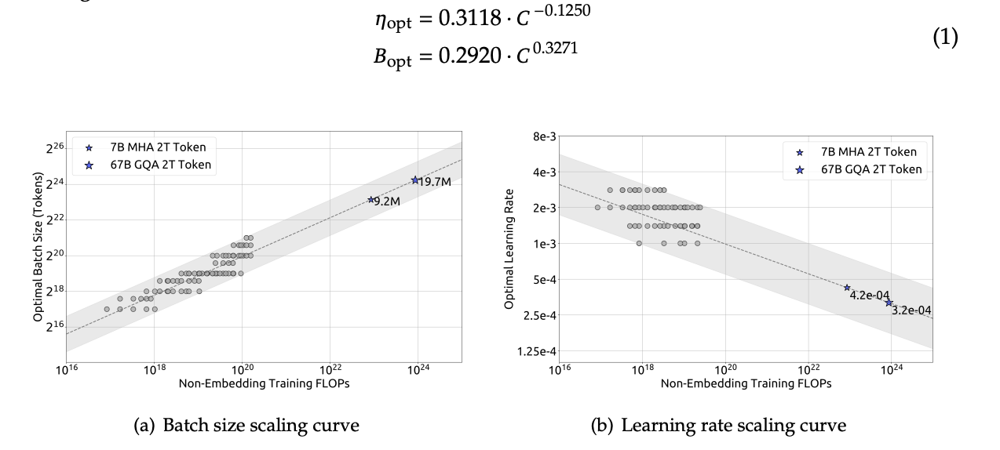

*图 8.6-16 DeepSeek batch / learning-rate scaling*

图 8.6-16 把多个 grid 里的低 loss 点连成放大趋势。横轴是 non-embedding training FLOPs，纵轴分别是 optimal batch size 和 optimal learning rate。DeepSeek 在每个规模上先收集接近最低 loss 的点，再拟合一条随 FLOPs 变化的线；图中的星号对应最终大训练实际采用的点。

Batch size 曲线相对规整，可以给大训练的 global batch 提供依据；learning rate 曲线更容易受搜索网格位置和训练长度影响。高 FLOPs 处通常会走向更大的 batch 和更小的 learning rate，但 learning rate 的直线外推比 batch 外推更需要目标规模复核。

这组拟合更适合给出安全区间。Batch / LR 可以用 scaling 实验来定，但精确常数仍要在目标规模附近复核；若 grid 没覆盖低 loss 区域，外推出的直线也会偏。

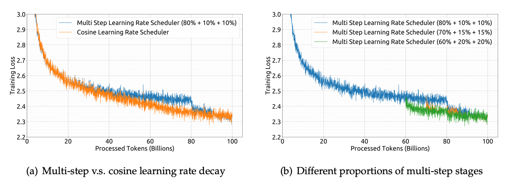

*图 8.6-17 DeepSeek scheduler comparison*

图 8.6-17 对应 scheduler 的选择。DeepSeek LLM [arXiv:2401.02954](https://arxiv.org/abs/2401.02954) §2.3 给出 multi-step schedule（按论文 Figure 1）：warmup 2000 steps 线性升到 peak learning rate → 前 80% tokens 维持 peak → 80% 之后降到 peak 的 31.6% → 90% 之后降到 peak 的 10%。DeepSeek 公开的 ablation 图（图 8.6-17 右图）比较 `80%+10%+10%`、`70%+15%+15%`、`60%+20%+20%` 等分段占比方案；左图显示分段方案与 cosine 的最终 loss 接近。这套 schedule 的主要用途是复用前一阶段 checkpoint，方便继续增加训练数据量。DeepSeek-V3 后续又采用了类似思路的多段 LR schedule（[arXiv:2412.19437](https://arxiv.org/abs/2412.19437) §4.2）。

选择 scheduler 时，要同时看 final checkpoint 的 loss，以及它能否在数据量 sweep 中复用。Scheduler 会改变小实验能否代表大实验：如果小模型和大模型使用不同 scheduler，batch / LR scaling 就很难外推；一个 scheduler 在短训练里看起来更好，也可能只是 decay 时机更早。因此要对齐训练长度和 final checkpoint 的定义。

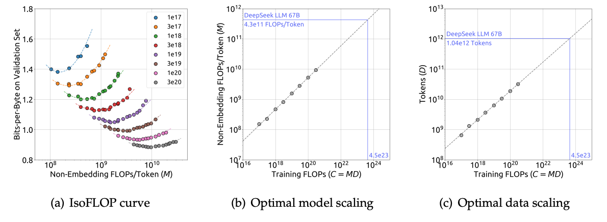

*图 8.6-18 DeepSeek IsoFLOP scaling law*

图 8.6-18 是更直接的 IsoFLOP sweep，左中右三栏分别承担三件事：左图给出固定 FLOP budget 下的 optimal $M$（U 形曲线最低点）、中图拟合 optimal $M$ 随总 compute $C$ 的增长、右图拟合 optimal training tokens $\mathrm{D}$ 随 $C$ 的增长。左图每种颜色固定一档 training FLOPs，横轴 $M$ 是 non-embedding FLOPs/token，作为模型计算规模的口径；纵轴是 validation bits-per-byte。每条 U 形曲线的最低点给出该预算下的 optimal $M$。

DeepSeek 这一步比 MiniCPM method 1 / 3 更直接：它在固定 FLOP budget 下比较候选配置，减少了 lower envelope 候选不足和 joint fit 函数形式带来的歧义。

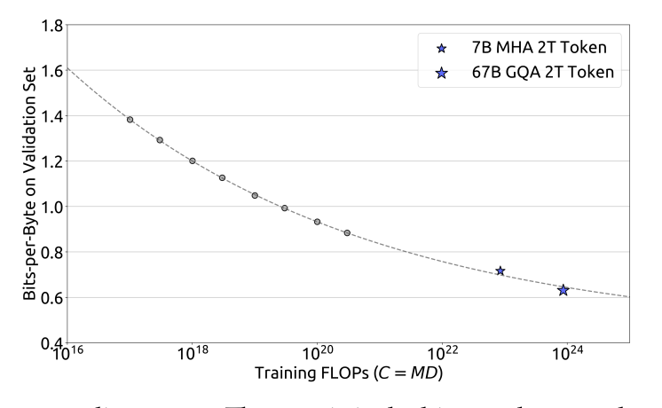

*图 8.6-19 DeepSeek final loss prediction*

图 8.6-19 是最终检验：用拟合出的 scaling law 预测大模型 final loss，再看真实训练是否落在预期附近。如果 7B / 67B 这类大模型星形点落在小实验外推曲线附近，说明训练条件一致性较好。Scaling workflow 的闭环还包括大训练后回看预测误差，并用它修正下一轮实验设计。

DeepSeek 的案例强调：如果小实验覆盖得足够好，final loss 可以被预测到可用精度；但这种预测依赖训练条件一致，尤其是 scheduler、batch 和数据处理一致。

MiniCPM 通过参数化争取超参数迁移，DeepSeek 则直接拟合超参数随 compute 的变化。前者依赖 muP 在目标架构上成立，后者需要支付更高的网格实验成本。

### 8.6.3 其他公开报告：把 scaling 变量扩展到 MoE、架构和 downstream

本节把 scaling 变量从 batch / LR 扩展到 MoE sparsity、active parameters、architecture choice 与 downstream 映射，覆盖 §8.6.1–§8.6.2 没有处理的公开报告。读完本节应能：识别不同公开报告把哪个变量当作主缩放轴、把这个变量对应的训练决策回写到自己的训练计划里，以及在 §8.1 末尾检查表的八个维度上快速定位每份报告的强弱项。

下面按 Qwen / Kimi K2 / Llama 3 / Hunyuan / MiniMax / 近期 scaling-law 训练设置汇总的顺序逐份过，每份都回答同一组问题：报告把哪个变量拿来做 scaling，这个变量最后服务什么决策。

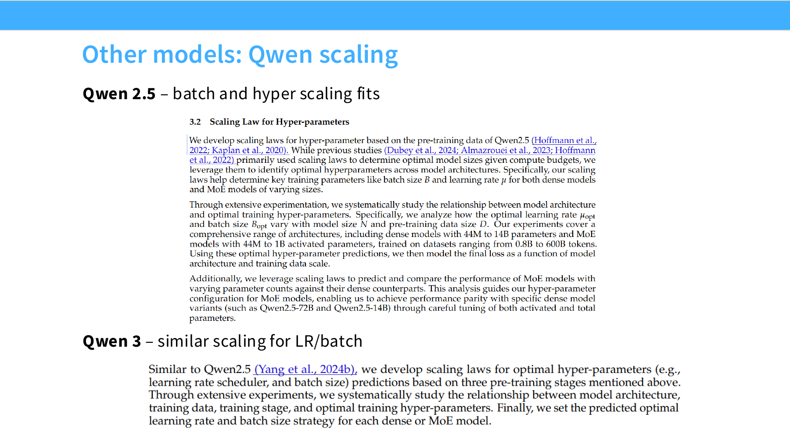

*图 8.6-20 Qwen batch and learning-rate scaling*

Qwen 系列公开的信息没有 DeepSeek 那么完整，但图 8.6-20 说明 batch / LR scaling 已经进入常规训练流程：batch size 和 learning rate 会随训练规模一起拟合。Qwen 2.5 还会说明用 scaling experiment 寻找 optimal batch / LR；到 Qwen 3 时，报告更像沿用上一代流程，只保留简短说明。

这类结果提醒我们，模型变大时，参数、tokens、batch、LR schedule 和数据处理方案通常会同步变化。任何一项脱节，都可能让最终曲线偏离预期。公开报告没有给出完整 sweep 时，只能学习它的变量选择和训练思路，不能直接复制具体超参数。

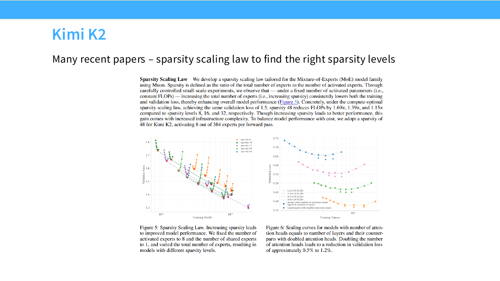

*图 8.6-21 Kimi K2 sparsity scaling*

Kimi K2 把 scaling 变量扩展到 MoE sparsity。图 8.6-21 要回答的训练决策是：给定总参数和每 token compute，应该激活多少 experts、保留多少稀疏度，才能在 loss、吞吐和存储之间取得更好的折中。

Kimi K2 在固定 active experts 的实验中观察到：增加 total experts、提高 sparsity 可以降低 validation loss。报告最终采用 sparsity 48 的设置（MoE 结构的 expert 总数 / 每 token 激活数按 [arXiv:2507.20534](https://arxiv.org/abs/2507.20534) §4 与对应模型卡核对），选择同时考虑了 loss、FLOPs 收益和基础设施复杂度，并不表示 48 是跨系统通用的最优常数。Active parameters 决定主要的单 token 计算量，total parameters 还会影响容量、存储、通信和 routing 成本。

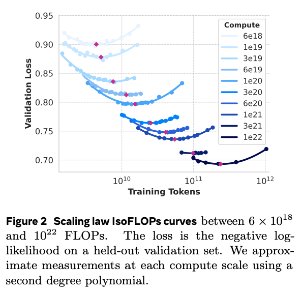

*图 8.6-22 Llama 3 IsoFLOP scaling law*

Llama 3 报告展示了两层外推。图 8.6-22 用一组同色 IsoFLOP 曲线把 compute-budget 维度固定，再用洋红色菱形标出每条曲线的最低点，作为训练 token 数与模型大小配比的实验依据。每种颜色固定一档 compute，横轴是 training tokens，纵轴是 held-out validation NLL；同一档预算下，tokens 增加意味着模型相应变小。NLL 是连续指标，通常比下游 accuracy 更适合拟合 scaling trend。

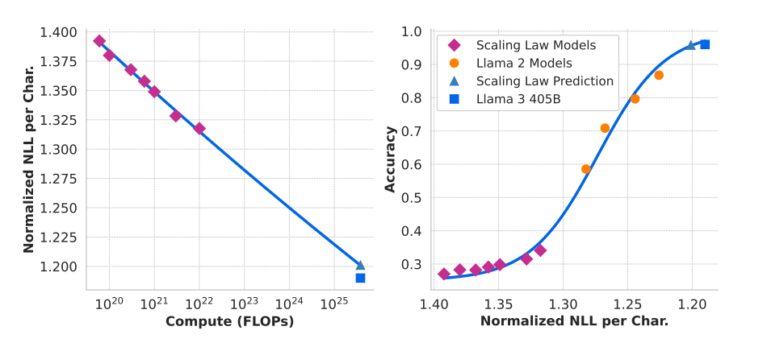

*图 8.6-23 Llama 3 ARC-Challenge scaling*

图 8.6-23 把 NLL 映射到 ARC-Challenge 这类 downstream accuracy。左半部分对应 compute -> NLL，右半部分对应 NLL -> accuracy。右半部分通常更像一条 sigmoid：loss 改善到某个区间后，accuracy 才会更明显上升。

Downstream 映射环节风险更高，因为 accuracy 是离散指标，受 prompt、数据污染和后训练影响更大。它的价值在于提供产品指标方向感，精度要求低于 pretraining loss 外推。

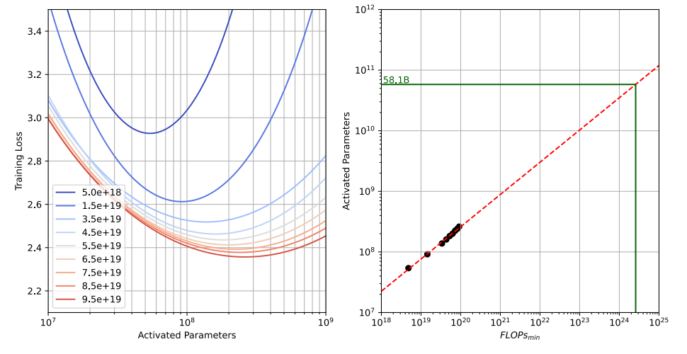

*图 8.6-24 Hunyuan MoE scaling law*

Hunyuan 的 MoE scaling 强调参数口径：对 MoE 来说，train compute 更接近 active parameters，但内存、routing 和 expert 配置又受 total experts 影响；同一份 sweep 不能同时套两个口径。

图 8.6-24 把 Hunyuan-Large 在 fixed sparsity（16 specialized experts / top-1 routing + 1 shared expert）下的 active-parameter IsoFLOP sweep 画成一族曲线，最低点对应 compute-optimal 配置。Hunyuan-Large 论文 §2.3.1 的 compute-optimal sweep 给出约 `58.1B activated / 5.6T tokens`，对应约 96 tokens per active parameter（5.6T ÷ 58.1B ≈ 96.4）；最终发布模型选择 `52B activated / 7T tokens`，对应约 135 tokens per active parameter（7T ÷ 52B ≈ 134.6）。

两个数字的差别来自论文的发布策略：scaling-law optimum 给出 58.1B 参数 / 5.6T tokens，但发布模型刻意下移到 52B 参数、上移到 7T tokens，原因是该 optimum 附近的 quadratic curve 比较平滑，往参数小、数据多一端平移可以更充分地利用训练数据。这个比例绑定 active-parameter 口径；Hunyuan 这组实验没有同时搜索 sparsity level。换 active experts、routing、sparsity 或数据处理方案时，需要重新检查。

MoE scaling 的结论必须绑定参数口径。只看 total parameters，MoE 会显得“参数很多但 compute 不高”；只看 active parameters，又会忽略显存和通信成本。

Hunyuan 这类图把参数口径问题放到前台：dense LM 的 $N$ 迁移到 MoE 时，必须说明横轴表示 total parameters、active parameters，还是每 token compute。

> [!NOTE]
> 图 8.6-25 来自 MiniMax（稀宇科技）团队的 *MiniMax-01: Scaling Foundation Models with Lightning Attention*（[arXiv:2501.08313](https://arxiv.org/abs/2501.08313)，2025-01-14）。

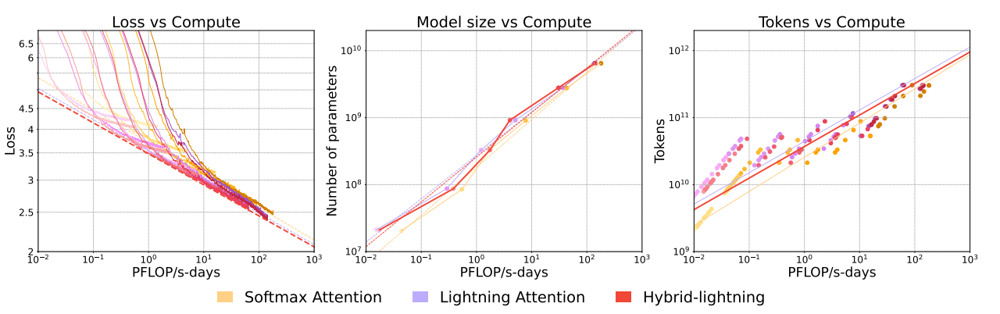

*图 8.6-25 MiniMax architecture scaling laws*

MiniMax-01 把 architecture choice 也纳入 scaling law。图 8.6-25 比较 lightning attention、softmax attention 和 hybrid 设计在不同 FLOPs 下的 loss、parameter count 和 tokens。

这张图服务的是最终结构选择。Lightning attention、softmax attention 和 hybrid 设计在这些实验里整体接近，MiniMax 因此有依据选择 hybrid architecture。Architecture scaling 特别容易被实现质量影响：kernel 是否优化、sequence length 是否一致、batch 是否相同，都会改变曲线位置。

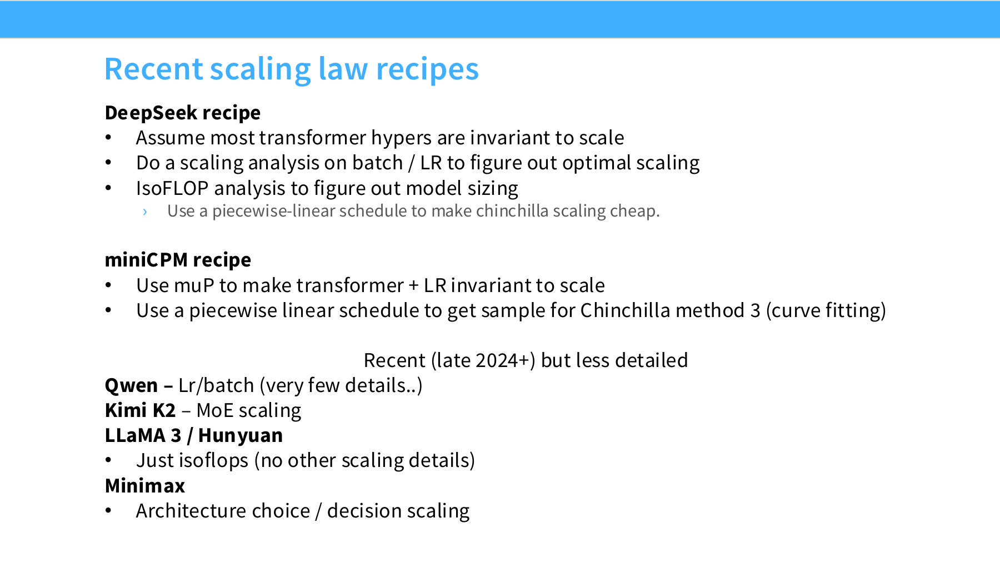

*图 8.6-26 近期 scaling-law 训练设置汇总*

图 8.6-26 把 §8.6.3 这一组公开报告的核心决策变量和原始论文图集中放在一张表/矩阵里，方便横向比较。图 8.6-26 汇总不同报告公开的决策变量：DeepSeek 展示 batch / LR 与 IsoFLOP；MiniCPM 展示 muP、WSD 和 joint fit；Qwen 只简述超参数 scaling；Kimi K2、Hunyuan、Llama 3 和 MiniMax 分别公开 MoE sparsity、active-parameter IsoFLOP、downstream 外推和 architecture comparison。公开点越完整，越容易复核具体超参数；只有结论或少量曲线时，主要能复用的是实验设计。

这里还有一个边界：这些图主要服务 pretraining 决策。Post-training 会改变最终能力形态，也可能反过来改变 pretraining 对覆盖面、多样性和能力分布的要求。现在公开材料里还少见把 pretraining、SFT、RL 和 downstream 指标放进同一个稳定 scaling workflow 的做法。

### 8.6.4 Optimizer Scaling：新 optimizer 的规模风险

本节回答一组训练决策问题：如果一个 optimizer 在小模型上更快，怎样判断它是否值得带到更大的 pretraining run？比较时要先看调参是否公平，再看规模放大后收益是否还保持。读完本节应能：识别 AdamW / AdamH / Muon / cautious optimizer 之间的关键差异、把 optimizer speedup 沿 model size 与 Chinchilla ratio 两个轴同时检验，以及在公开发布的 AdamH loss-spike 案例中理解 scaling 失败的可能形态。

下面分四步处理：先做调参公平性 sanity check，再加 compute scale 与 Chinchilla ratio 两个轴，然后用 StepFun / DeepSeek / OpenAI 三种 LR-batch scaling 视角对照，最后看 AdamH loss-spike 与 Muon 这两个具体工程案例。

比较 optimizer 的认识链从“更新规则改变了什么”开始：先固定模型、数据和训练预算，只替换 optimizer 并为每种方法分别搜索学习率、weight decay 与 batch；再沿 model size 和 tokens-per-parameter 扫描，记录 loss、吞吐、梯度稳定性和发散率；最后在未参与拟合的规模上复测。这样才能把单点速度优势与真正的 scale robustness 分开，也能定位收益来自更新几何、超参调优还是实现效率。

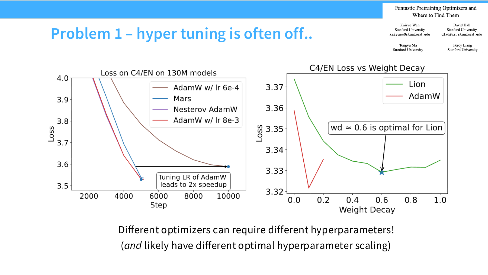

*图 8.6-27 Optimizer hyperparameter interactions*

图 8.6-27 先处理调参公平性。同一个 AdamW，只要 learning rate 调得更合适，就可能从很慢变成接近最优；不同 optimizer 对 weight decay 的敏感区间也不同。

Optimizer 比较必须报告搜索范围、LR schedule、batch、weight decay 和训练长度。缺少这些信息时，小规模收益可能来自调参投入差异。

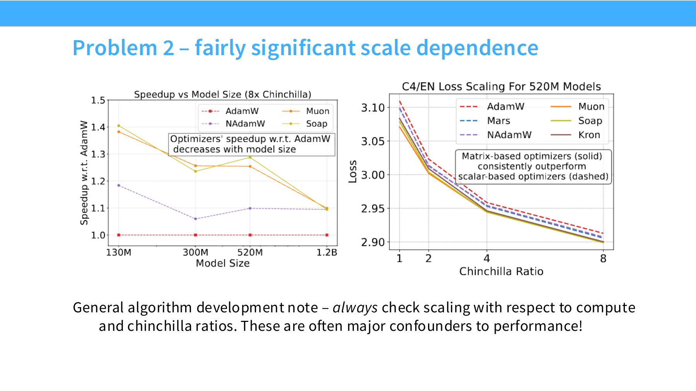

*图 8.6-28 Optimizer scale dependence*

图 8.6-28 再加入规模轴。左图看 optimizer speedup 是否随 model size 改变，右图把 Chinchilla ratio 也纳入比较。

算法开发至少要同时看 compute scale 和 tokens per parameter。一个轴回答“compute 变大后收益是否还在”，另一个轴回答“模型相对数据是 undertrained 还是 overtrained”。只沿 model size 扩展还不够，Chinchilla ratio 也是常见混杂因素。

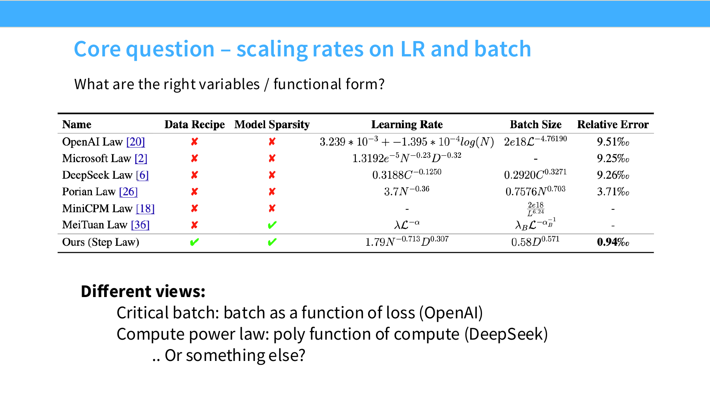

*图 8.6-29 LR / batch scaling variables*

图 8.6-29 用一张汇总表把 OpenAI critical batch、DeepSeek power-law、StepFun 经验拟合三种 LR / batch scaling 公式的拟合变量、适用区间和失败案例并列对比。OpenAI critical batch 视角把 batch 写成 target loss 的函数；DeepSeek 把 batch / LR 写成 compute power law；StepFun 的拟合直接使用模型规模 $N$ 和数据量 $D$，并另外检查换 data recipe 或 model sparsity 后是否仍能迁移。

变量不同，外推含义就不同。普通 loss scaling 只问 compute 多了 loss 怎么变；hyperparameter scaling 还要问最优 batch 和最优 learning rate 是否随 compute、数据量或 sparsity 一起变。若变量选错，小规模上看起来最优的方法可能只是被调得更充分。

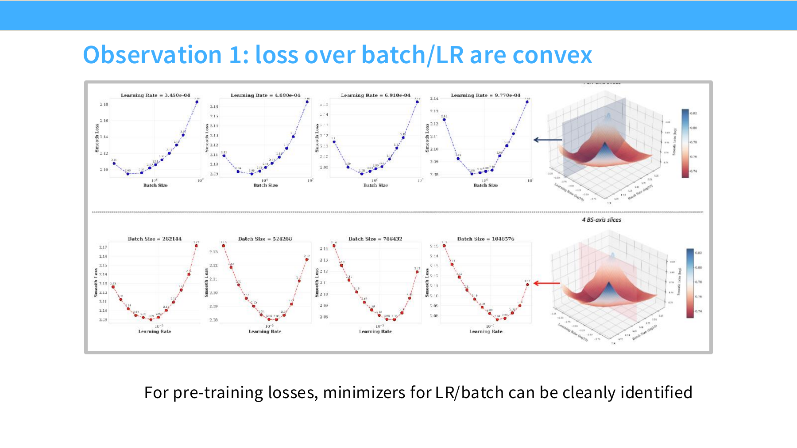

*图 8.6-30 StepFun LR / batch landscape*

StepFun 先把 LR 和 batch 放进经验网格。图 8.6-30 把同一固定训练设定下的 loss surface 画成 batch × learning rate 的二维等高线图：低 loss 区域在 LR / batch 平面上的形态（窄谷、宽带、孤立峰）是判断「能否用网格搜到最优 LR / batch」的直接证据。这个 surface 在切片上相对平滑、近似凸，说明用网格寻找最优 LR / batch 是可行的。

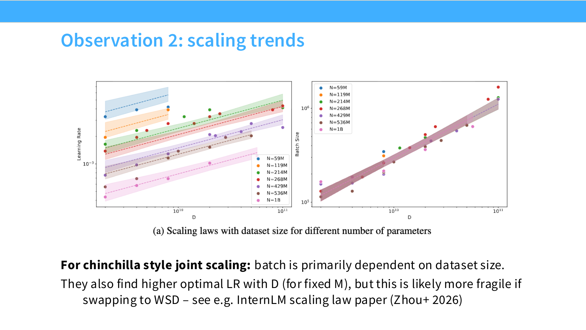

*图 8.6-31 StepFun LR / batch trends*

图 8.6-31 看最优点如何随 scale 变化。StepFun 的结果把 batch 和数据量的关系放得更重：optimal batch size 更像训练数据量 $D$ 的函数。Learning rate 的行为更复杂，大模型倾向较小 LR，更多数据在这组实验里对应较高 LR，但这个方向在不同论文里并不完全一致。

工程含义是：batch / LR scaling 很难只按 compute 写一个通用指数；模型大小、数据规模、训练阶段和 optimizer 细节都会改变拟合结果。外部 scaling law 可以作为默认值，目标训练仍需要用自己的数据、模型和训练设置做复核。

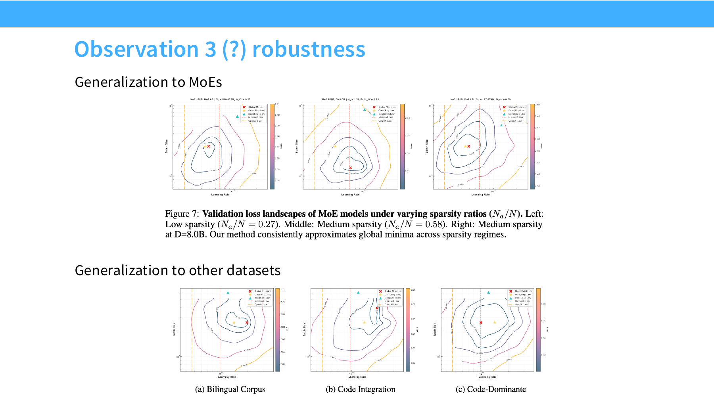

*图 8.6-32 StepFun MoE and dataset robustness*

StepFun 还检查训练设置的鲁棒性。它把 MoE、不同 dataset 和不同训练设置纳入复核，目标是判断这套 LR / batch 选择在相邻配置里是否仍然可用。MoE 在控制 active parameters 后大体能迁移；换数据时最优 LR / batch 会出现漂移，说明这些系数对数据处理方案很敏感。

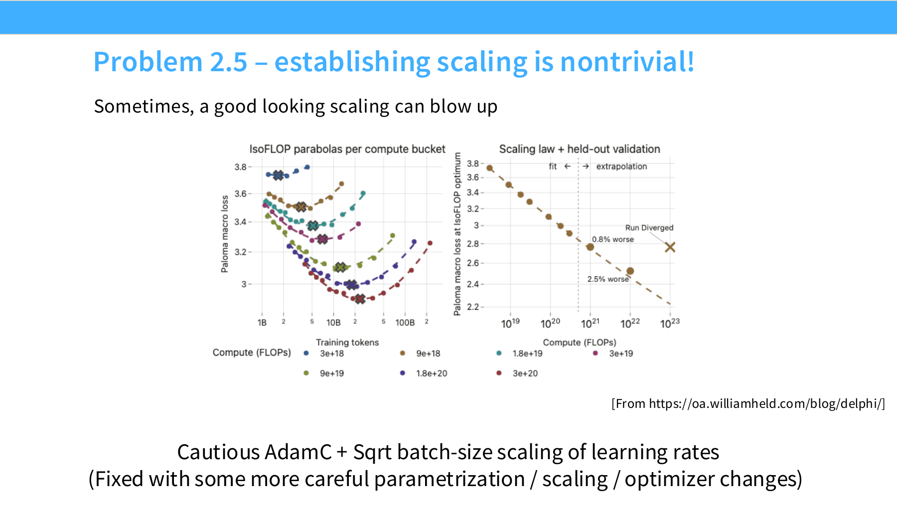

*图 8.6-33 Cautious AdamC scaling blow-up under extrapolation*

图 8.6-33 是一个工程案例，也是 §8.6.4“Optimizer Scaling：新 optimizer 的规模风险”讨论的具体失效样本。左右两图对应同一组数据的不同分析层级：左图在 $3 \times 10^{18}$ 到 $3 \times 10^{20}$ 七档 compute bucket 上分别拟合 IsoFLOP 抛物线，叉号标出每档的 minima；右图把这些 minima 拟合成一条 compute 到 Paloma macro loss 的直线，$10^{21}$ 处的虚线把图分成 fit 与 extrapolation 两段。

图中外推区的三个点展示 Cautious AdamC 的失败形态：$10^{22}$ 处两个不同 seed 给出 `0.8% worse` 与 `2.5% worse` 两档偏离，$10^{23}$ 处标注 *Run Diverged*。caption 将这组设置概括为 *Cautious AdamC + Sqrt batch-size scaling of learning rates*，并指出需要重新设计参数化、缩放或 optimizer 才能修复外推。

Open Athena / Marin 的 Delphi 博客 [*Scaling Laws That Extrapolate 300 Past the Fit*](https://openathena.ai/blog/delphi) 给出 fix 之后的结果：把 optimizer 从 Cautious AdamC 换成 AdamH（Adam with Hyperball——按 Frobenius 范数把权重重新缩放到当前 $\|W\|_F$ 球面上，等价于把 weight decay 从超参搜索里拿掉），并把 LR scaling 从 $\sqrt{\mathrm{batch}}$ 改成 token-horizon $(T_0/T)^{0.3}$ 形式。在这套 fix 下，$10^{21}$、$10^{22}$、$10^{23}$ 三档 held-out 预测全部落在 observed Paloma macro loss 的 $\sim 0.5\%$ 误差带内；其中 $10^{23}$、25B 参数、600B tokens 的预注册预测相对实测偏差约 $0.2\%$，是博客标题里 *Extrapolate 300 Past the Fit* 的具体口径（外推到拟合所用最大 compute 的约 300 倍）。同一博客还提到 attempt 1 在一批重复文本 batch 上出现 spike，按 grad_norm 阈值跳过 bad steps 后缓解，是 fix 链路上的一环而非独立机制。

Volkova et al. [Towards Robust Scaling Laws for Optimizers, arXiv:2602.07712](https://arxiv.org/abs/2602.07712) 处理同一类问题的另一面：论文指出 per-optimizer 直接拟合 Chinchilla-style scaling law 是 ill-conditioned 的、拟合参数高度相关，因此改用“共享 power-law exponents + optimizer-specific rescaling factors”，并在 AdamW、Muon、Scion、Shampoo、SOAP 五种 optimizer、两种架构上验证。

这类失败说明，建立可外推的 scaling 趋势并不容易。Muon、AdamH、cautious Adam 等新 optimizer 或 Adam 变体都可能改善某些规模下的训练效率；比较它们时，要把 weight decay、norm 参数、embedding 参数、混合精度和并行切分纳入同一组训练条件，并在 compute 增加、Chinchilla-style 数据比例和大 batch 训练下复核。

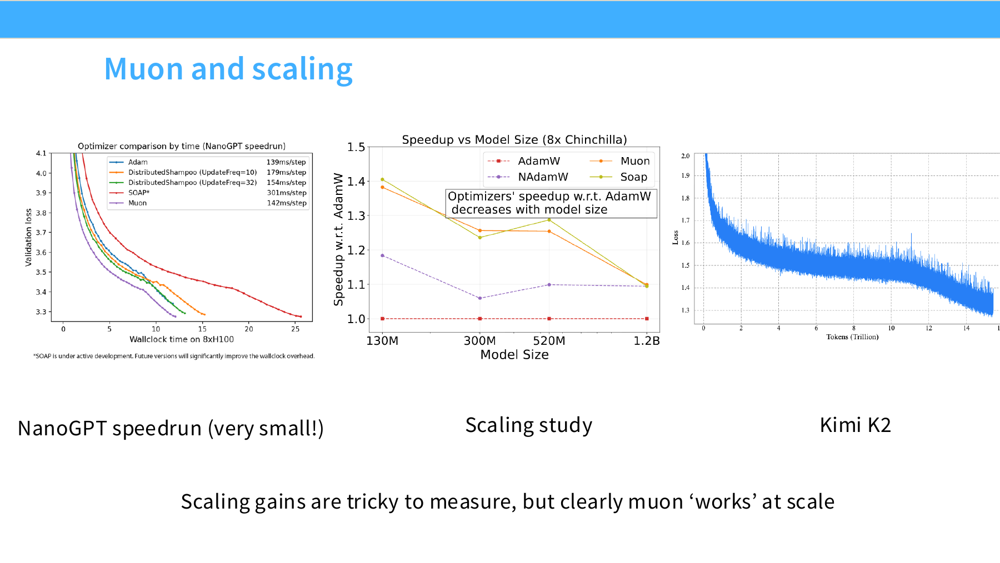

*图 8.6-34 Muon scaling*

图 8.6-34 把 Muon 的证据拆成三层。第一，在 nanoGPT speedrun 这类小模型限时训练基准上，它相对 Adam 有明显收益；第二，scaling study 需要检查收益是否随 compute 变小、是否受 Chinchilla ratio 影响；第三，Kimi K2 说明 Muon 可以在大规模训练中工作。

Muon 主要作用在形状为矩阵的参数上，对 momentum update 做近似 orthogonalization；vector 参数通常仍可交给 AdamW 一类方法。它的核心步骤是 Newton-Schulz 迭代：设 momentum update 矩阵的奇异值分解为 $B_t = U S V^\top$ ，若干次矩阵乘法迭代把 $B_t$ 近似推向 $U V^\top$ ，也就是把奇异值统一压到 1 附近。更新投影到谱范数约等于 1 的方向之后，elementwise 步长不必按最大奇异值收缩，避免更新过大或过小。算法本身出自 Keller Jordan 2024 年 12 月的公开笔记 [*Muon: An optimizer for hidden layers in neural networks*](https://kellerjordan.github.io/posts/muon/)；对应的 duality 理论背景见 [Bernstein & Newhouse, *Modular Duality in Deep Learning*, arXiv:2410.21265](https://arxiv.org/abs/2410.21265)。

Muon 在大模型上的稳定性补丁是 MuonClip，由 Kimi K2 引入：在 attention logits 超过约 100 时只对 Q / K 投影做 rescale，使 Muon 能在万亿参数 MoE 上完成 15.5T token 的稳定预训练。

公开材料还不足以证明 Muon 在同等训练设置下稳定优于 AdamW。当前更稳的工程判断是：Muon 值得关注，但比较时仍要把 optimizer、LR / batch、weight decay 和稳定性补丁放进同一张账本。

> [!NOTE]
> 公开大规模训练中，Kimi K2（[arXiv:2507.20534](https://arxiv.org/abs/2507.20534)）是 Muon 的代表案例；Kimi K2.5 在 hybrid attention 上沿用 lightning + softmax 路线，公开训练披露覆盖范围不同，K2 主要用于 sparsity scaling 等公开对比，K2.5 主要承袭 K2 的 Muon 与 scaling 设计；公开训练网格的复用价值因版本而异。

### 8.6.5 Cerebras-GPT：muP 的公开验证案例

本节处理一个独立验证问题：muP 在 Cerebras-GPT 这套公开模型族里是否真的能压低跨 width 的 loss 波动，并把小模型搜索到的 base 超参稳定迁移到更大模型。读完本节应能：把 standard parametrization 与 muP 在同一张 compute-loss 图上直接比较、识别 scale noise 数量级差异对应的工程含义，以及把 Cerebras-GPT 的 40M proxy model 搜索流程复用到自己的训练里。

下面四张图按 compute-loss 基线、muP vs standard 偏差、参数化差异表、40M proxy 搜索四个层面展开，分别回答 baseline 在哪、muP 带来什么、参数化具体差异在哪、超参搜索如何复用。

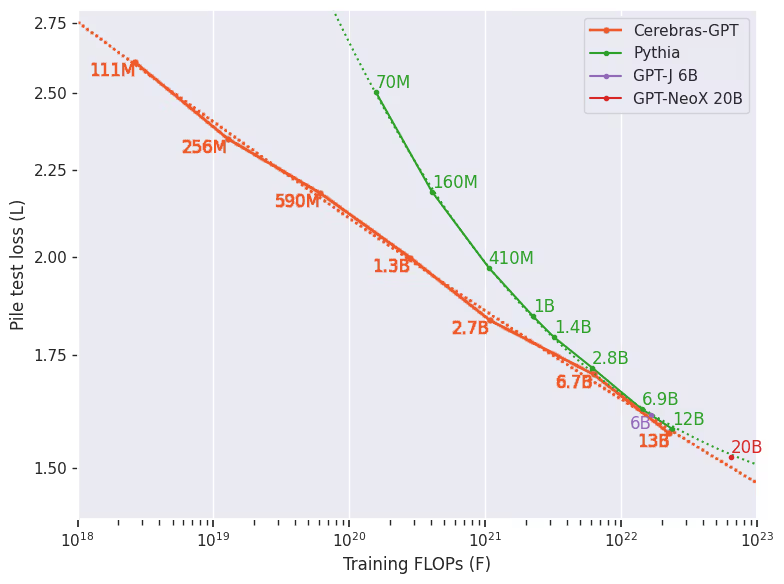

*图 8.6-35 Cerebras compute-loss baseline*

图 8.6-35 把 Cerebras-GPT standard-parametrization 模型族与同代开源参照（Pythia、GPT-J、GPT-NeoX）放在同一张 compute-loss 图上，橙色点是 Cerebras-GPT 实际训练点、虚线是其 compute-optimal fit、Pythia / GPT-J / GPT-NeoX 用作公开模型参照。这张图先建立整个模型族的 compute-loss 基线，本身还没有比较 standard parametrization 与 muP——下一张图 8.6-36 才是 muP 验证。

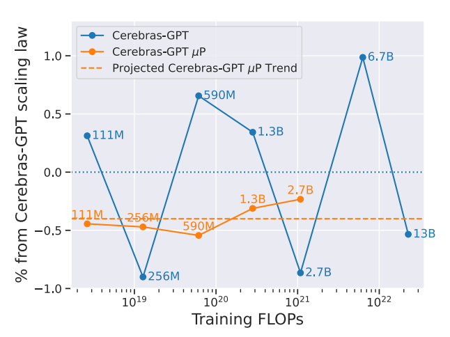

*图 8.6-36 Cerebras muP predictable scaling*

图 8.6-36 把图 8.6-35 的 compute-loss baseline 转成相对偏差视角：纵轴是相对 standard-parametrization scaling law 的 loss 百分比偏差，蓝点对应 standard parametrization、橙点对应 muP；两组点的标准差比较直接给出 muP 是否真把跨宽度 scale noise 压低。蓝点的标准差约为 `0.66%`，橙色 muP 点约为 `0.04%`，后者的 scale noise 在这组实验里低约 16 倍。muP 模型的平均 Pile test loss 还比基线 fit 低约 `0.43%`。这些结果支持更稳定的超参数迁移，但实验只覆盖 Cerebras-GPT 的架构、optimizer 和训练设置。

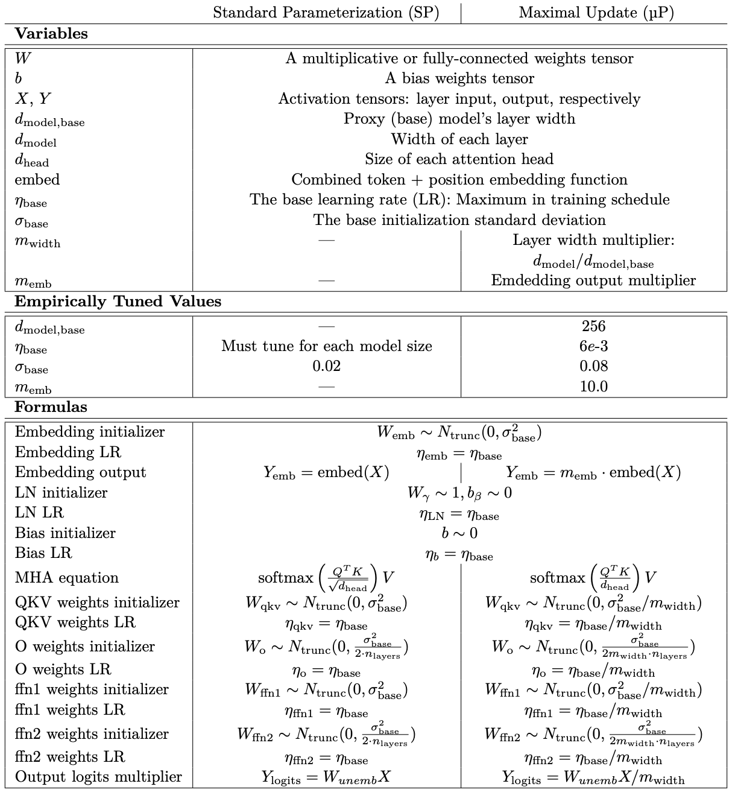

*图 8.6-37 Cerebras standard vs muP details*

图 8.6-37 把 standard parametrization 和 muP 的实现差异列成账本。差别包括 embedding 输出缩放、QKV / output / FFN 矩阵的初始化标准差，以及矩阵类参数的 learning rate 如何随 width multiplier 变化。

表里的 `base learning rate`、base initialization standard deviation 和 embedding multiplier 都要先定下来。muP 是一套随宽度调整初始化和 update scale 的参数化规则，作用层级不同于 optimizer。

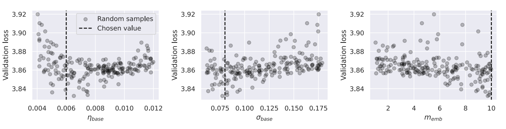

*图 8.6-38 Cerebras muP hyperparameter search*

图 8.6-38 展示 Cerebras 如何使用这套规则：先在 40M proxy model 上随机搜索 `base learning rate`、initialization scale 和 embedding scale，再把选出的值迁移到 111M–2.7B 的 muP 模型。三张子图里的虚线是最终选定值。

工程收益是把“大模型逐个搜索超参”变成“小模型一次性搜索后迁移”。这也是 `hyperparameter transfer` 的核心含义：先在 proxy models 上找合适的 base 超参，再迁移到目标宽度。前提是目标架构真的满足 muP 的迁移假设，且数据处理、optimizer、regularization 和训练长度没有引入新的 scale drift。

### 8.6.6 muP 推导直觉：A1、A2 与 width scaling

本节回答 §8.6.1 / §8.6.5 留下的开放问题：muP 为什么能稳定 learning rate？这背后的两个宽度尺度条件（A1 初始化后的 activation 尺度、A2 一次 update 引起的 activation 变化）如何具体推出每类参数的初始化与 per-parameter learning rate 规则。读完本节应能：从 A1 / A2 两条条件反推 $\sigma_l = \Theta(1/\sqrt{n_{l-1}})$ 与 SGD / Adam 的 learning rate factor，以及理解标准参数化与 muP 在同一张参数表里的具体差别。

下面先给线性层下的 A1 / A2 推导，再回到 §8.6.5 表格里的具体规则：标准参数化在矩阵层使用 $\Theta(1/\sqrt{n_{l-1}})$ 的初始化标准差与 $\Theta(1)$ 的 learning rate，而 muP 把 Adam 的矩阵 learning rate factor 换成 $1/n_{l-1}$，并按 fan-out / fan-in 比调整初始化项。

*图 8.6-39 muP conditions*

图 8.6-39 把 muP 的目标压成两个宽度尺度条件。设第 $l-1$ 层和第 $l$ 层的宽度分别为 $n_{l-1}$ 和 $n_l$：

- A1：初始化后的每个 activation 坐标保持 $\Theta(1)$。
- A2：一次 gradient step 引起的每个 activation 坐标变化也保持 $\Theta(1)$。

$\Theta(1)$ 表示数值随 width 增长仍处于常数量级，既不发散也不趋近于零。A1 控制前向信号，A2 控制一步更新对模型函数的影响。

先用线性层说明 A1。令 $h_{l-1}\in\mathbb R^{n_{l-1}}$、$h_l\in\mathbb R^{n_l}$，权重矩阵 $W_l\in\mathbb R^{n_l\times n_{l-1}}$：

$$
h_l = W_l h_{l-1}
$$

假设权重元素独立同分布地初始化：

$$
W_{l,ij} \overset{iid}{\sim} \mathcal N(0, \sigma_l^2)
$$

其中 $\sigma_l$ 是初始化标准差。用 spectral norm（operator norm）衡量矩阵的最大放大倍数：

$$
\|W_l\|_* = \max_{\|x\|_2 = 1} \|W_l x\|_2
$$

对上述随机矩阵，数量级近似为：

$$
\|W_l\|_* \approx \sigma_l(\sqrt{n_{l-1}} + \sqrt{n_l})
$$

若 $h_{l-1}$ 的每个坐标是 $\Theta(1)$，则 $\|h_{l-1}\|_2=\Theta(\sqrt{n_{l-1}})$。A1 要求输出范数为 $\Theta(\sqrt{n_l})$，因此需要让 $\|W_l\|_*=\Theta(\sqrt{n_l/n_{l-1}})$。对应图 8.6-40 中的初始化标准差：

$$
\sigma_l=\Theta\!\left(
\frac{1}{\sqrt{n_{l-1}}}
\min\!\left(1,\sqrt{\frac{n_l}{n_{l-1}}}\right)
\right)
$$

当相邻层等宽时，这个式子退化为常见的 $\sigma_l=\Theta(1/\sqrt{n_{l-1}})$；fan-out 小于 fan-in 时，额外的比例项进一步收紧初始化尺度。

A2 处理 update。对简化的 SGD 线性层，一步权重更新是反向梯度与输入 activation 的外积：

$$
\Delta W_l = -\eta_l \nabla_{h_l}\ell \, h_{l-1}^{\top}
$$

其中 $\eta_l$ 是该层 learning rate。更新后的 activation 变化可以拆成：

$$
\Delta h_l = W_l \Delta h_{l-1} + \Delta W_l(h_{l-1} + \Delta h_{l-1})
$$

A2 要求 $\Delta h_l$ 的每个坐标保持 $\Theta(1)$，也就是 $\|\Delta h_l\|_2=\Theta(\sqrt{n_l})$。因此 update matrix 需要满足：

$$
\|\Delta W_l\|_* \sqrt{n_{l-1}} = \Theta(\sqrt{n_l})
$$

这就是 learning-rate scaling 的来源。把 $\|\Delta W_l\|_* = \eta_l \|g_l\| \|h_{l-1}\|$（Adam 把 $\|g_l/\sqrt{v_l}\|_2$ 量级记为 $\|g_l\|$ 同样适用），代入 $\|g_l\| = \Theta(\sqrt{n_l})$、$\|h_{l-1}\| = \Theta(\sqrt{n_{l-1}})$，解 $\eta_l \sqrt{n_l n_{l-1}} = \Theta(\sqrt{n_l/n_{l-1}})$ 得到 $\eta_l = \Theta(1/n_{l-1})$。因此图 8.6-40 的简化线性层里，SGD 与 Adam 对矩阵参数的 learning-rate factor 都是 $1/n_{l-1}$；当相邻层等宽时退化为常见的 $1/n$，与 Tensor Programs V（[arXiv:2203.03466](https://arxiv.org/abs/2203.03466) §5.3–§5.4）给出的 muP LR 缩放一致。标准参数化在同一张表里的对应项是初始化标准差 $\Theta(1/\sqrt{n_{l-1}})$ 、learning rate $\Theta(1)$ ；两者差别集中在 per-parameter LR 缩放以及 fan-out 小于 fan-in 时的初始化项。具体规则取决于 optimizer 和参数类型；Transformer 的 embedding、attention / MLP matrices、output head、bias 与 norm 参数需要分别处理。

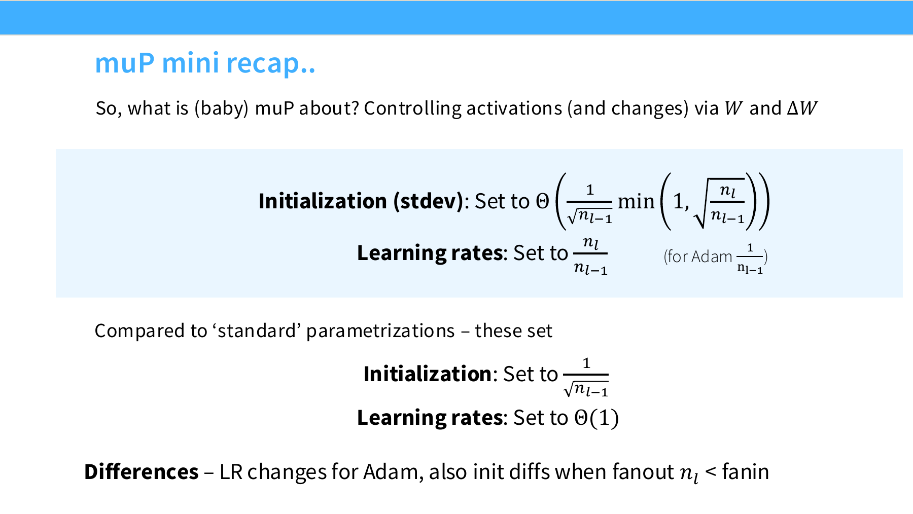

*图 8.6-40 muP mini recap*

图 8.6-40 把结论收束成两张账本：初始化规则维持 A1，per-parameter learning-rate rules 维持 A2。muP 先指定 width 放大时要保持的量，再反推出每类参数的初始化和 update scale。它主要争取的是同一模型族内的 hyperparameter transfer；架构、optimizer、norm 或 regularization 改变后，需要重新做 transfer test。

### 8.6.7 muP 的实践检查与失效边界

本节回答一个工程实操问题：把 muP 写进训练代码之后，第一步该做哪些检查、哪些场景下标准 muP 规则会失效。读完本节应能：用 coordinate check 与 transfer test 验证 muP 是否真在自己的目标架构上成立、识别 RMSNorm gain、sign-based optimizer（Lion）、强 weight decay 这三类常见失效模式，以及在自己的训练栈里规划额外的 stress test。

下面三张图按 RMSNorm gain / Lion / 强 weight decay 顺序逐一展示标准 muP 配方在哪类细节上不能直接套用，并给出对应的应对方向。

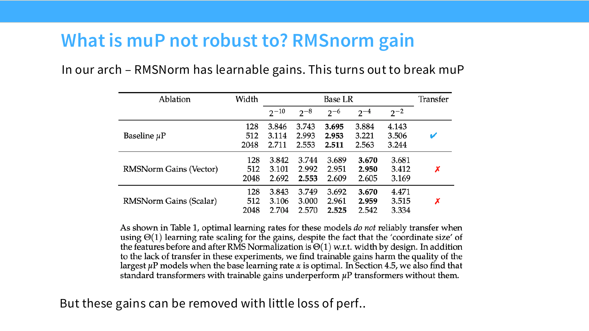

*图 8.6-41 muP RMSNorm gain caveat*

图 8.6-41 关注 RMSNorm gain。表中不同 width 和 base LR 下的最低 loss 位置没有稳定迁移，右侧用叉号标出 transfer 失败。

这组实验说明，仅保证 RMSNorm 前后的 activation 坐标为 $\Theta(1)$，不足以保证可学习 gain 的最优 LR 随 width 迁移。实践中可以移除 gain，或为它单独设计并验证参数化规则；图中实验发现移除 gain 对性能影响很小。

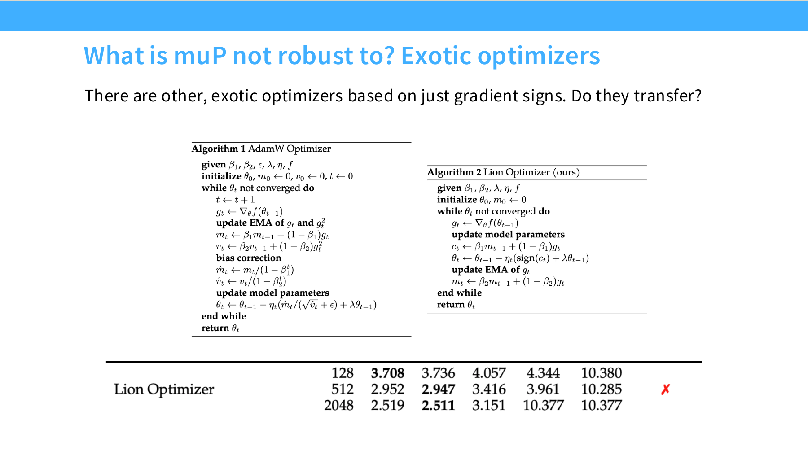

*图 8.6-42 muP exotic optimizers caveat*

图 8.6-42 关注 sign-based optimizer Lion。沿用基线 muP 规则后，不同 width 的最优 LR 没有可靠对齐。这里能够得出的结论是现成的 Adam-style muP 配方不能直接套到任意 optimizer；Lion、Muon 或其他 update geometry 都需要重新推导或用 transfer test 校准。

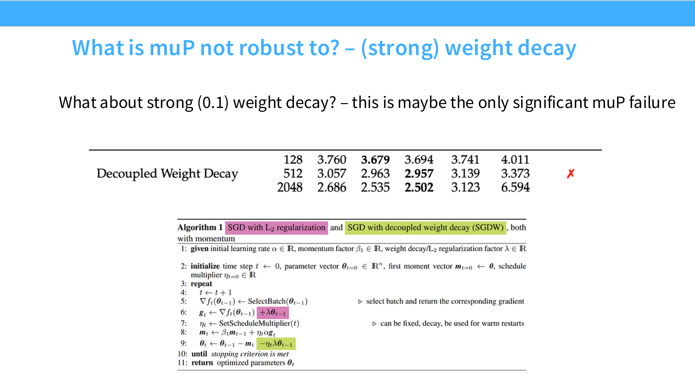

*图 8.6-43 muP weight decay caveat*

图 8.6-43 关注强 weight decay。Decoupled weight decay 会直接按参数值收缩权重，强度较大时会改变参数范数和 optimizer update 之间的平衡。

图中的 `0.1` decoupled weight decay 让不同 width 的最优 LR 明显错位，是这组 stress tests 中最显著的 failure case。它表明强 regularization 不能被视为与 width 无关的背景常数；是否需要按参数类型或 width 缩放，要在具体 optimizer 和模型上重新验证。

这三张图强调 muP 的适用边界。它通常能让标准参数化更稳定、让小模型超参更容易迁移；但现代 Transformer 里的 norm gain、特殊 optimizer、强 regularization、初始化变体和 batch choice 都可能打破简化理论。使用 muP 时仍要在目标架构上做小规模和中等规模复核，确认低 loss 区域是否真的随规模对齐。

### 8.6.8 公开 Scaling Report 的方法论边界

§8.1 末尾已经给出扩展检查表（横轴 / 纵轴 / 固定训练条件 / 随规模调整的变量 / 实验点覆盖 / 参数化 / hyperparameter transfer / 决策类型 八个维度），回到那一节即可拿到完整清单。本节只补一段方法论边界，提醒即使检查表逐条通过，外推仍然有结构性风险。

> [!NOTE]
> **Scaling law 方法论的边界**：
> - **Scaling law 是 recipe-dependent lower bound**——scaling law 只对固定训练配置 + 单一数据来源有效；改换 optimizer、warmup、batch schedule 或数据混合会得到另一条 lower bound，不能跨曲线插值。同一条 curve 上的预测回答的是"沿用这一套 recipe 继续放大能拿到什么"，换 recipe 后预测会移到另一条 curve 上。
> - **多项式 vs 指数在小窗口难分辨**——只在 1 个数量级以内的 compute 区间观察，外推到 5 个数量级会得到与函数形式无关的伪线性结论；区分幂律与指数趋势通常需要至少 1.5–2 个数量级的 compute 跨度。
> - **跨实验设置 transfer 时要核训练口径**——把别处报告的 slope / intercept 直接套到自己的训练上，前提是 optimizer、batch、warmup、数据混合都对齐；否则就是 "我用别人报告的 recipe 直接外推到自己的实验设置" 的拟似预测，曲线看起来科学，背后仍是经验拟合。

## 8.7 本章总结与下章衔接

训练侧的所有决策最终都要面对部署侧的成本账：serving 时的 GPU 时间、KV cache 显存、TTFT、throughput、continuous batching 与 PagedAttention 等具体工程对象。Train-optimal 模型上线后被实际负载压成的形状，往往和 IsoFLOP sweep 给出的最佳点不一样。

[第 9 章 §9.1 Inference Workload：为什么推理不同于训练](../chapter9/chapter9_推理系统.md) 把视角从训练侧切到 serving 侧，继续回答"算力最优的模型怎么被高效部署"这一组工程问题。读完本章后，读者可以带着 §8.1 末尾的检查表去看公开推理报告：横轴换成 QPS / latency / serving cost 后，哪些结论仍然成立、哪些需要重写。

## 思考

- 看一张 scaling 图时，先固定横轴的资源（compute / tokens / parameters / downstream score）和被钉住的训练条件（tokenizer、optimizer、batch、scheduler），再判断结论能外推到多大的目标训练。这条读图动作对应学习目标 1 和 §8.1 末尾检查表。
- 给定训练 FLOPs $C$ 和目标 loss，用 Chinchilla / IsoFLOP / critical batch size / tokens per parameter 这些概念在公开报告的网格上读出模型大小、训练 token 数、batch size 和 learning rate 的起点；起点只是 baseline，仍要在目标规模附近复核。这条对应学习目标 3。
- 在 tokens per parameter 从 1.7（GPT-3）上升到几十乃至数百（不同规模的 overtrained 模型）的趋势里，train-optimal 与 inference-optimal 的差距如何随模型大小和预计请求量变化？Llama 3 405B 约使用 15.6T tokens，即约 39 tokens/parameter；更小模型的公开或估计比例可超过 200。overtraining 把更多一次性训练投入换成更低的长期 serving 成本是否划算？这一组问题对应学习目标 4 和 §8.4.3。
- 在目标模型上用 muP / WSD / optimizer scaling 时，哪些超参可以从小模型迁移，哪些必须随 compute、tokens per parameter、MoE sparsity 或数据处理方案重新扫描？这条对应学习目标 4 的另一半。
- 当一个新模型架构（如 Mamba、Gated DeltaNet、hybrid attention）或一个新数据集出现时，如何套 §8.1 末尾的检查表判断它是否值得投入大规模预训练？检查表逐条通过只是必要条件，外推区间和参数化口径仍要单独核。这条对应学习目标 2 与学习目标 5。

## 参考文献

- [Kaplan et al., Scaling Laws for Neural Language Models, arXiv:2001.08361](https://arxiv.org/abs/2001.08361)
- [Hoffmann et al., Training Compute-Optimal Large Language Models (Chinchilla), arXiv:2203.15556](https://arxiv.org/abs/2203.15556)
- [Muennighoff et al., Scaling Data-Constrained Language Models, arXiv:2305.16264](https://arxiv.org/abs/2305.16264) — §8.3.3 effective data 公式 + Figure 1 右图 8.67B / 6.34B IsoFLOP 星点 + Figure 3 100M unique tokens IsoLoss contours + Figure 4 三档 IsoFLOP 预算 + Appendix F "Do Excess Parameters Hurt, Plateau or Help?" 与 muP 对照主源
- [Goyal et al., Scaling Laws for Data Filtering — Data Curation cannot be Compute Agnostic, arXiv:2404.07177](https://arxiv.org/abs/2404.07177) — §8.3.3 data selection 与 quality-quantity tradeoff（图 8.3-10）主源
- [Yang et al., Tensor Programs V: Tuning Large Neural Networks via Zero-Shot Hyperparameter Transfer, arXiv:2203.03466](https://arxiv.org/abs/2203.03466)
- [MiniCPM Technical Report, arXiv:2404.06395](https://arxiv.org/abs/2404.06395)
- [DeepSeek LLM, arXiv:2401.02954](https://arxiv.org/abs/2401.02954)
- [Cerebras-GPT, arXiv:2304.03208](https://arxiv.org/abs/2304.03208)
- [MuonClip / Kimi K2, arXiv:2507.20534](https://arxiv.org/abs/2507.20534) — MuonClip 起源（§4）
- [StepFun Predictable Scale Part I, arXiv:2503.04715](https://arxiv.org/abs/2503.04715)

## 来源与更新记录

- 早期 learning-curve 与 data-scaling 论文：Banko & Brill 2001 https://aclanthology.org/P01-1005/；Kolachina et al. 2012 https://aclanthology.org/P12-1003/；Hestness et al. 2017 https://arxiv.org/abs/1712.00409。
- 论文与技术报告：Kaplan et al. 2020 https://arxiv.org/abs/2001.08361；Chinchilla https://arxiv.org/abs/2203.15556；Likelihood-Based Diffusion Language Models https://arxiv.org/abs/2305.18619（Gulrajani & Hashimoto, 2023）；MiniCPM https://arxiv.org/abs/2404.06395；Language models scale reliably with over-training and on downstream tasks https://arxiv.org/abs/2403.08540（Gadre et al.）；DeepSeek https://arxiv.org/abs/2401.02954；Cerebras-GPT https://arxiv.org/abs/2304.03208；Tensor Programs V https://arxiv.org/abs/2203.03466；A Spectral Condition for Feature Learning https://arxiv.org/abs/2310.17813；Hunyuan-Large https://arxiv.org/abs/2411.02265；MiniMax-01 https://arxiv.org/abs/2501.08313；Towards Robust Scaling Laws for Optimizers https://arxiv.org/abs/2602.07712（Volkova, Safaryan, Lampert, Alistarh, 2026）；Predictable Scale: Part I — Step Law https://arxiv.org/abs/2503.04715（Li et al., StepFun, 2025）；Llama 3 Herd of Models https://arxiv.org/abs/2411.18243（§3.2：405B 模型使用 15.6T tokens，约 39 tokens/parameter，查阅 2026-09-06）；Qwen3 Technical Report https://arxiv.org/abs/2505.09388；Kimi K2 https://arxiv.org/abs/2507.20534；Mamba-2 https://arxiv.org/abs/2405.21060；Gated DeltaNet https://arxiv.org/abs/2412.06464。
- 现代报告参考：Qwen、Kimi、StepFun、Llama 3、Hunyuan、MiniMax 相关论文或技术报告；其中未公开完整训练网格的案例只作为变量账本和公开口径样例。
- 2025-2026 新模型与扩展：**Nemotron 3** 系列在 NVFP4 精度下训练；**DeepSeek v3.2** 在 MoE 规模与 RLHF 后训练上扩展；**Qwen 3 / 3.5 / 3 Next / 3 Coder Next** 在 thinking mode fusion、MoE、agentic RL 上持续迭代；**OLMo 3** 系列覆盖完整训练可复现性披露；**MiniMax M2.5** 与 **Kimi K2.5** 在 hybrid attention 上沿用 lightning + softmax 路线；**GLM 5** 与 **Xiaomi MIMO** 进入开源权重榜单前列。TPU 侧，**TPU 8t** 在 3D torus 之上叠加 **Virgo** scale-out fabric，单 fabric 可达 ~134,000 颗 TPU 8t、~47 Pb/s non-blocking bisection；**TPU 8i** 采用 Boardfly 拓扑（Dragonfly 变体）替代 3D torus；两者均以 optical circuit switching 与 flattened two-layer topology 影响大规模训练的 collective 调度。**Cohere Command A** 用 3:1 hybrid attention：3 层 sliding window attention（窗口 4,096，RoPE）+ 1 层 global attention（NoPE）作为 hybrid attention 的另一参考样本。这些 2026 模型的具体超参与 token 数随官方技术报告更新，本节只记录其类别和角色，不替代论文级复核。
- 官方实践指南：Cerebras / EleutherAI `The Practitioner's Guide to the Maximal Update Parameterization` https://www.cerebras.ai/blog/the-practitioners-guide-to-the-maximal-update-parameterization。
- Muon 相关（2026-09-05 复核）：Keller Jordan, `Muon: An optimizer for hidden layers in neural networks` https://kellerjordan.github.io/posts/muon/（2024-12，算法原始出处，社区笔记）；Bernstein & Newhouse, `Modular Duality in Deep Learning` https://arxiv.org/abs/2410.21265（2024-10-28，论文，duality 理论背景）。
- 学习参考（2026-09-01 复核可访问）：How To Scale https://howtoscalenn.github.io/（muP 与 HP scaling）；Work at a Frontier Lab scaling tutorial https://www.workatafrontierlab.com/lessons/foundations/scaling-laws（Chinchilla / μ-Transfer 教学）；Epoch AI scaling topic https://epoch.ai/topics/scaling（compute / data / scaling 趋势综述）；Emergent Mind Chinchilla scaling https://www.emergentmind.com/topics/chinchilla-scaling（Chinchilla 综合技术介绍，2026-04-06 更新）；Simulations4All LLM scaling visualizer https://simulations4all.com/simulations/llm-scaling-laws-visualizer（Chinchilla compute-optimal 可视化）。
- 不可访问（2026-09-01）：mbrenndoerfer.com Chinchilla tutorial（HTTP 403，可能限流或下线）；aiwiki.ai scaling laws（HTTP 429 rate limit，无法复核）。这两条仅在公开维护者社区偶尔出现，缺它们不影响主线；如未来恢复可再加回。
- 学习参考只用于讲义组织、预算直觉和可视化辅助；技术口径来自课程材料、论文、技术报告和官方实践指南。
