# 第 9 章 推理系统

## 本章学习目标

读完本章，读者应能：

- 区分 `prefill` 与 `generation` 阶段的算力 / 带宽瓶颈，并解释 `TTFT`、latency、throughput 的来源。
- 计算推理系统的 `arithmetic intensity`，判断一段推理是 `compute-bound` 还是 `memory-bound`。
- 描述 KV cache 压缩的四种主要路径（MQA / GQA / MLA / CLA）及其显存收益与质量代价。
- 解释 speculative sampling 的工作机制：draft model 起草、target model 验证、按接受率调整 round 长度。
- 描述 PagedAttention、continuous batching、prefix sharing 等 serving scheduler 在显存与吞吐之间的折中。

推理系统是语言模型把能力交给用户和下游系统的工程层。训练决定模型学到了什么，推理系统决定这些能力能以多高吞吐、多低延迟、多少显存和多少服务成本被释放出来。对话、代码补全、搜索、智能体调用、批量数据处理、评测和 RL rollout 都在消耗推理预算。

推理系统里有一个很直接的账本：生成 token 就是在花 compute。聊天产品里，人类阅读速度常常是瓶颈；但 agent、代码执行、搜索增强、RL rollout 和合成数据生成会产生大量中间 trace，许多 token 甚至不会被最终用户看到。因此推理优化不只是“让一个回答更快”，还包括控制系统里所有可见和不可见 token 的成本。

本章按一条推理系统主线展开：先理解 workload，再建立 KV cache 与 `arithmetic intensity` 账本，然后讨论模型与 KV cache 压缩、保持分布的 speculative sampling，最后进入在线 serving 的动态 workload。

对应到工程系统里，这条主线就是 `TTFT`、latency、throughput、KV cache、batching、quantization、speculative sampling、PagedAttention 和 serving scheduler 的联合优化。

本章的成本账本也会支撑后续 reasoning 章节：CoT、多路径采样、工具调用、agent trace 和 RLVR rollout 都会把更多 token 交给 `prefill`、`generation`、KV cache 和 scheduler。

训练这些行为的 RL 系统细节放在 [第 13 章 可验证奖励的强化学习](../chapter13/chapter13_可验证奖励的强化学习.md) 中讨论；模型为什么会展开思考、这些方法怎样改变可见推理行为，放到 [推理行为与能力专题](../topics/reasoning_behavior.md) 中讨论。

读这一章时要始终区分四类问题：

- 这个优化减少的是 weight memory、KV cache、scheduler 空闲、kernel 开销，还是模型分布采样成本？
- 它改善的是单请求 latency、系统 throughput，还是 `TTFT`？
- 它是否改变模型输出分布或质量？
- 它是否依赖请求长度、并发数、共享前缀和显存碎片情况？

后文的每个优化都可以沿着这四个问题定位：先看它减少哪一类数据搬运或串行步骤，再看它把收益转化成 latency、throughput 还是 `TTFT`，最后检查质量和 workload 假设。

## 9.1 Inference Workload：为什么推理不同于训练

训练和推理都在执行 Transformer 前向计算，但它们面对的资源约束不同。训练更像“对整段 token 做大规模矩阵运算并保存 activation”；推理更像“反复读取权重和历史 KV cache，为下一个 token 做增量计算”。

*图 9.1-1 Inference overview*

图 9.1-1 把推理成本放到真实使用场景里看。聊天、代码补全、agent、批处理、evaluation 和 RL rollout 都在调用同一个生成系统；差别在于哪些 token 会被人读到，哪些 token 只是系统内部为了搜索、验证或打分而产生。推理优化要同时服务交互体验和大规模 token 产出成本。

### 9.1.1 训练看全序列，推理逐 token 生成

对 decoder-only 自回归模型来说，无论训练还是推理，单步目标都可以写成：

$$
P(\text{token}_i \mid \text{token}_1, \text{token}_2, \dots, \text{token}_{i-1})
$$

关键差异来自前文来源和并行方式：

| 阶段 | 前文来源 | 并行方式 | 主要瓶颈 |
| --- | --- | --- | --- |
| 训练 | 真实 token，使用 teacher forcing | 整段序列位置可并行 | FLOPs、activation、梯度同步 |
| 推理 | 模型已生成 token，逐步追加 | generation 方向串行 | weight memory、KV cache、HBM bandwidth |

训练能高并行，是因为整段序列都已知，模型可以一次性处理所有位置，并把中间 activation 保留下来做反向传播。推理必须把上一步生成结果接回下一步输入，所以时间维度串行、单步内部并行。也正因为如此，训练更容易做成 compute-bound，推理尤其是自回归 generation 更容易 memory-bound。

> [!NOTE]
> teacher forcing 的价值不只在于监督稳定，还在于它允许整段序列并行训练。如果训练时把模型采样结果再喂回去，会同时破坏梯度路径、增大噪声，并显著降低吞吐。

### 9.1.2 TTFT、Latency 与 Throughput

推理性能通常用四个相互关联的指标描述：

- `TTFT`：time to first token，从请求发出到第一个 token 出现的时间。
- `per-token latency`：首 token 之后，相邻两个输出 token 的时间间隔，常写成 seconds/token；其倒数表示单请求的 generation speed。
- `end-to-end latency`：从请求到整条回答结束的总时间，包含排队、prefill 和全部 generation steps。
- `throughput`：系统单位时间能产出的总 token 数，常写成 tokens/second。

这四个指标并不等价。`TTFT` 决定用户什么时候看到第一个输出，主要受 prompt prefill 和调度排队影响；per-token latency 决定后续回答流得是否顺畅；end-to-end latency 还会累积回答长度带来的 generation 时间；throughput 决定整套服务能处理多少 token。

高 throughput 系统完全可能让单条请求等很久，因为在线服务还要同时处理上下文长度差异、请求到达时间差异、KV cache 占用和调度排队。交互式聊天更关心 `TTFT` 和 per-request latency；离线批量处理更关心 throughput。Agent workload 同时关心两者，因为它会产生大量中间 token，而且下一步动作常依赖上一段生成结果。

### 9.1.3 prefill 与 generation

现代 LLM 服务通常把一次请求拆成两个阶段：

- `prefill`：把 prompt 中已有 token 一次性送入模型，序列维度可并行，通常更容易做成 compute-bound。
- `generation`：每次只生成一个新 token，必须反复读取模型权重和当前请求的 KV cache，常常是 memory-bound。工程里也常把这个自回归 generation 阶段称为 `decode`。

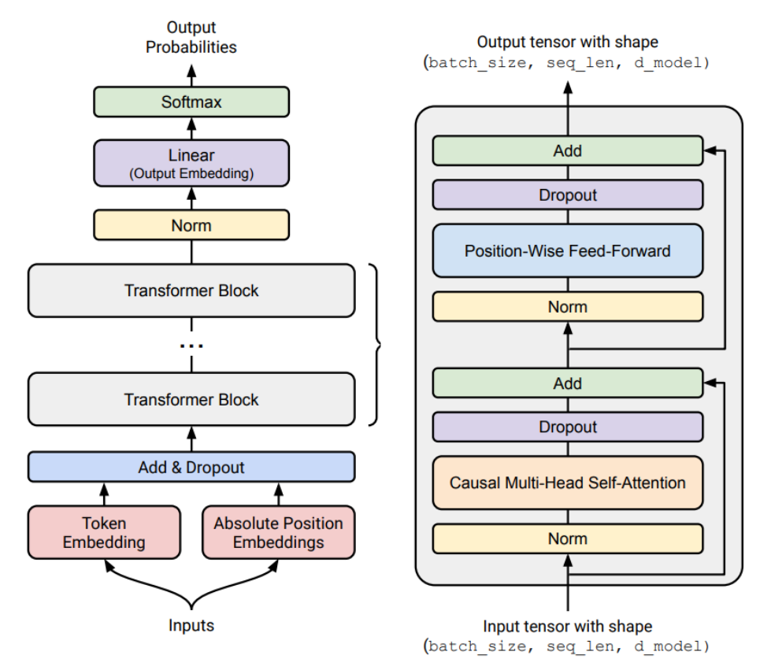

*图 9.1-2 Transformer architecture notation*

图 9.1-2 的作用是统一张量记号。`B` 是 batch size，`T` 是这次要处理或生成的 token 数，`S` 是已有上下文长度，`D` 是 model dimension，`H` 是 head dimension。

注意力头还会用到 $N = K_{\mathrm{kv}} G$ 这组记号：$N$ 是 query head 数，$K_{\mathrm{kv}}$ 是 KV head 数，$G$ 是每个 KV head 对应的 query heads 数。后文把 key 张量仍记作 $K$，把 KV head 数固定写作 $K_{\mathrm{kv}}$，避免混淆。训练时通常可以把很多位置一起处理；推理 generation 时，$T = 1$，这正是后面 `arithmetic intensity` 下降的根源。

*图 9.1-3 Naive inference*

最朴素的自回归推理是：每生成一个 token，就把“prompt + 已生成 token”整段重新喂给 Transformer。这样做语义上正确，但会反复计算旧 token 的 key/value 和 activation。

设 prompt 长度为 $S$，连续生成 $T$ 个 token。若每步都重跑完整前缀，第 $t$ 步的 attention 需要处理长度 $S+t$ 的序列，重复计算的 attention 成本为：

$$
\sum_{t=1}^{T}O((S+t)^2)=O(TS^2+ST^2+T^3)
$$

当 $S$ 和 $T$ 处于同一数量级时，这个式子可写成 $O(T^3)$。它只描述重复执行完整 attention 的代价；MLP、norm 和采样还会产生额外工作。KV cache 的价值就是把 causal prefix 里不会再变化的 key/value 存下来，让后续步骤只为新 token 增量更新。

*图 9.1-4 KV cache incremental inference*

KV cache 的观察很简单：在 causal Transformer 里，过去 token 的 key/value 不会因为未来追加 token 而改变。因此 `prefill` 阶段先为 prompt 写入 KV cache；后续 `generation` 阶段每步只计算新 token 的 query/key/value，把新 key/value 追加进 cache，并让 query 读历史 cache。

注意力仍然是：

$$
\mathrm{Attention}(Q, K, V) = \mathrm{softmax}\left(\frac{QK^\top}{\sqrt{d_k}}\right)V
$$

只是这里的 $K$ 和 $V$ 大部分来自 KV cache，无需每一步重新计算。KV cache 的规模近似随 batch、上下文长度、层数、KV heads 和 head dimension 线性增长：

$$
\mathrm{KV\ cache} \propto B \times S \times L \times K_{\mathrm{kv}} \times H
$$

其中 $B$ 是并发请求数， $S$ 是上下文长度， $L$ 是层数， $K_{\mathrm{kv}}$ 是 KV head 数， $H$ 是 head dimension。实际字节数还要乘上 key/value 两份和 dtype 字节数。

*图 9.1-5 prefill and generation*

图 9.1-5 把两阶段差异画出来：`prefill` 像训练的一次前向，prompt token 都已知；`generation` 像一个循环，每次只追加一个 token。后面所有推理优化都可以放回这个两阶段账本里理解：要么减少每步读的权重和 KV cache，要么让更多请求一起摊薄权重读取，要么用小模型先起草再让大模型并行检查。

KV cache 用显存换重复计算，让自回归推理可以流式部署；代价是长上下文和高并发会把瓶颈转移到 HBM bandwidth 与显存管理上。它适用于过去 token 表示不会被未来 token 改写的 causal generation。若输入上下文频繁被编辑、模型使用双向 attention，或者生成范式需要多轮重写同一批位置，缓存的 key/value 通常需要重新计算，或改用完全不同的缓存机制。

## 9.2 Arithmetic Intensity：为什么 generation 常常 memory-bound

`arithmetic intensity` 衡量每搬运 1 byte 数据做多少 FLOPs：

$$
I = \frac{\mathrm{FLOPs}}{\mathrm{Bytes\ Transferred}}
$$

若计算的 `arithmetic intensity` 高于硬件的 FLOP/s 与 HBM bandwidth 比值，就更可能 compute-bound；若低于这个比值，就更可能 memory-bound。以 H100/Hopper 的 BF16 数量级示例看，峰值 FLOP/s 除以 HBM bandwidth 大约是几百 FLOPs/byte。这个数值只用于帮助判断瓶颈，不能当成所有硬件和 kernel 的通用阈值。

> [!NOTE]
> **H100 dense BF16 显式判据**：约 **989.5 TFLOP/s ÷ 3.35 TB/s ≈ 295 FLOPs/byte**。NVIDIA H100 datasheet 把 BF16 Tensor Core 标为 1,979 TFLOPS（含结构化稀疏），dense 取一半即 989.5；jax-ml scaling-book roofline 章节用 9.89 × 10¹⁴ bfloat16 FLOPs/s 表示同一值，与本节 989.5 一致（[NVIDIA H100 datasheet](https://www.nvidia.com/en-us/data-center/h100/) / [JAX Scaling Book roofline](https://jax-ml.github.io/scaling-book/roofline/)）。对矩阵乘法 $X(B \times D) \cdot W(D \times F)$，当 $D, F \gg B$ 时 arithmetic intensity 收敛到 $B$；因此**compute-bound iff $B > 295$**。用 Llama 2 13B 例子演示：B=64 时 latency / throughput 仍在 latency–throughput tradeoff 区间（worse latency, better throughput），且参数 + KV cache 约 79.7 GB 仍可装下单卡 80 GB；B=256 时 KV cache + 参数总内存约 240.8 GB，单卡 H100 已无法容纳。注意 80 GB 是显存容量口径，与 latency/throughput 是不同维度——B=64 vs B=256 的差距由 80 GB 容量约束决定，与 295 FLOPs/byte 的 compute-bound 判据是两条独立线索。这条阈值与上述"几百 FLOPs/byte"的数量级说法一致；这里给出具体数字只是为了把判据直接落到 batch size。

### 9.2.1 MLP 层：batch 和 token 数能摊薄权重读取

先看一个矩阵乘法 $X(B \times D)W(D \times F)$ 。如果 $D$ 和 $F$ 远大于 $B$ ，主要数据搬运来自读取权重 $W$ ，而计算量随 $B$ 增长。于是算术强度近似随 $B$ 增长：

$$
I_{\mathrm{matmul}} \approx B
$$

Transformer 的 MLP 层主要由几次大矩阵乘法组成。把 sequence 维度也算进去后，MLP 层的关键量是 $B \times T$ ：

$$
I_{\mathrm{MLP}} \approx B T
$$

`prefill` 时 $T = S$ ，prompt 可以一次处理，所以 $B S$ 往往足够大；`generation` 时 $T = 1$ ，算术强度退化到 $B$ 。因此 MLP generation 要靠 concurrent requests 来摊薄权重读取。可以把这件事理解成“多条请求共同分摊一次权重读取”：权重矩阵对 batch 中所有请求相同，读到片上后可以服务多个 token，batch 越大，每搬运 1 byte 权重能做的矩阵乘法越多。

### 9.2.2 Attention 层：batch 不能同样摊薄 KV cache

attention generation 更难。对 attention 的核心矩阵乘法，近似计算可写成：

$$
I_{\mathrm{attention}} \approx \frac{S T}{S + T}
$$

`prefill` 时 $T = S$ ，所以：

$$
I_{\mathrm{attention,prefill}} \approx \frac{S}{2}
$$

上下文足够长时，这仍然有机会接近 compute-bound，并且 FlashAttention 等 kernel 能提高片上复用。

`generation` 时 $T = 1$ ，所以：

$$
I_{\mathrm{attention,generation}} \approx \frac{S}{S + 1} < 1
$$

这里的关键是 batch size 并没有像 MLP 那样进入公式。原因是 MLP 权重对 batch 中所有请求共享，读一次权重可以服务多个 sequence；但 attention 里的 KV cache 是每个请求自己的历史， $B$ 个请求就有 $B$ 份不同 KV cache。把更多请求合到一起，确实增加总工作量，却不能像共享权重那样复用同一份 KV。

表格化看就是：

| 阶段 / 层 | 近似算术强度 | 主要瓶颈直觉 | 优化含义 |
| --- | ---: | --- | --- |
| MLP prefill | $B S$ | prompt token 可并行，权重读取可摊薄 | 长 prompt 或批量 prefill 更容易 compute-bound |
| attention prefill | $S / 2$ | 读写整段上下文，但序列维度仍可并行 | 长序列 prefill 适合 FlashAttention 类优化 |
| MLP generation | $B$ | 每步只生成一个 token，需要靠并发请求摊薄权重读取 | continuous batching 能提高 throughput |
| attention generation | $< 1$ | 每个请求读取自己的 KV cache，batch 不能共享 KV | 减小 KV cache、改善 KV 布局更关键 |

这张表给出两个不同的工程方向。MLP generation 的低算术强度可以通过更大的并发 batch 缓解，因为大家共享同一份权重；attention generation 的低算术强度来自每个请求私有的 KV cache。

在标准 Transformer 上，增加 batch 会带来更多不同的历史缓存，不能把 attention generation 变成高复用的大矩阵乘法。更直接的优化方向是减少 KV cache、改善 KV 布局或改变 attention 结构。

### 9.2.3 Latency 与 Throughput 的取舍

当 generation memory-bound 时，一个粗略估计是：每生成一步，需要读模型参数和当前 batch 的 KV cache。单步 latency 近似随需要搬运的总字节数增长：

$$
\mathrm{latency} \approx \frac{\mathrm{parameter\ bytes} + B \times \mathrm{KV\ cache\ bytes\ per\ request}}{\mathrm{memory\ bandwidth}}
$$

throughput 则是同一步里并行生成了 $B$ 个 token：

$$
\mathrm{throughput} \approx \frac{B}{\mathrm{latency}}
$$

增大 batch size 通常会让 throughput 变好，因为参数读取被更多请求摊薄；但单请求 latency 可能变差，因为每一步要处理更大的 batch，并且 KV cache 总量也随 $B$ 增长。若 batch 再继续增大，还会撞上显存容量上限。

这就是推理系统里常见的 tradeoff：

- 小 batch：单请求 latency 更低，但 GPU 利用率和系统 throughput 可能较差。
- 大 batch：系统 throughput 更高，但单请求等待和 per-token latency 可能变差。
- 更小 KV cache：可能同时改善 latency 和 throughput，因为它直接减少 memory traffic。

batch size 是 throughput 的燃料，也有直接成本。更大的 batch 会让权重读取被更多请求分摊，也会让每一步需要管理的 KV cache 总量变大；服务系统通常会给 `prefill` 和 `generation` 使用不同调度策略，用小一点的 prefill batch 控制 `TTFT`，用更大的 generation batch 提高总体 throughput。

一个 Llama 2 13B 的带宽估算把这条 tradeoff 具体化。设权重使用 BF16、上下文长度 $S = 1024$、$K_{\mathrm{kv}} = 40$、$H = 128$、$L = 40$，并假设 H100 的 HBM bandwidth 为 $3.35\ \mathrm{TB/s}$。模型权重约为 $26.0\ \mathrm{GB}$，单条请求的 KV cache 约为 $0.84\ \mathrm{GB}$：每 token 容量 $2 \times 2 \times K_{\mathrm{kv}} \times H$ 字节（2 是 K + V 两份，2 是 bf16 字节数），$L$ 层、$S$ token 累加，代入 $1024 \cdot 40 \cdot 128 \cdot 40 \cdot 4 = 838{,}860{,}800$ 字节 $\approx 0.84$ GB。

把这些量代入上面的带宽下界，得到：

| generation batch $B$ | 参数与 KV cache 总量 | 单步 latency 下界 | 吞吐上界 | 80 GB H100 容量判断 |
| ---: | ---: | ---: | ---: | --- |
| 1 | 26.9 GB | 8.0 ms | 125 tokens/s | 可容纳 |
| 64 | 79.7 GB | 23.8 ms | 2,689 tokens/s | 仅余极少空间 |
| 256 | 240.8 GB | 71.9 ms | 3,562 tokens/s | 无法容纳 |

表中的 latency 和 throughput 是理想带宽下界与上界；实际服务还要为 activation、CUDA graph、kernel launch、内存池、并行通信和调度保留空间。它说明 batch 增大可以摊薄权重读取，但收益会逐渐变小，KV cache 容量会先成为硬约束。

## 9.3 模型与 KV cache 压缩：减少每步数据搬运

前面已经看到，inference 的关键瓶颈通常是 memory traffic，尤其是 generation attention 的 KV cache。本节的共同目标是让每一步搬运更少数据，并同时检查质量。

GQA、MLA、CLA 和 local / sparse attention 会改变 attention 的结构。已有 MHA checkpoint 换成这些结构需要额外训练，但通常远低于从头训练的成本：GQA 论文给出的 uptraining 方案是先把每组内的 key/value 投影矩阵做 mean pooling 得到转换后的 checkpoint，再按原始预训练配方续训 5% 的原始训练步数。quantization、pruning 和 distillation 则从既有模型出发压缩权重或模型本体，也需要校准数据、专用 kernel 或修复训练才能把字节数减少转化为实际加速。

### 9.3.1 GQA / MQA：减少 KV head 数

多头注意力里，query heads、key heads 和 value heads 通常数量相同。`MQA` 和 `GQA` 的思路是：query heads 仍然多，但多个 query heads 共享较少的 KV heads。

- `MHA`：KV head 数 $K_{\mathrm{kv}}$ 等于 query head 数 $N$。
- `MQA`：所有 query heads 共享一组 key/value，$K_{\mathrm{kv}} = 1$。
- `GQA`：介于两者之间，$1 < K_{\mathrm{kv}} < N$。

KV cache 大小大致与 $K_{\mathrm{kv}} \times H$ 成正比，所以从 MHA 改成 GQA 可以按 $N / K_{\mathrm{kv}}$ 的比例减少 KV cache。

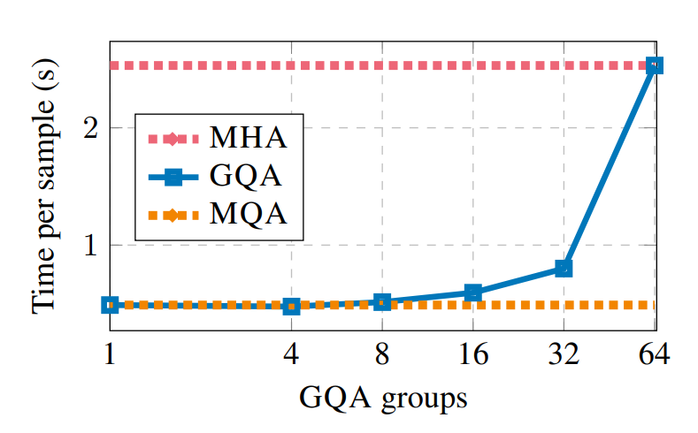

*图 9.3-1 GQA speed*

图 9.3-1 展示了 KV heads 变少后的系统收益。每一步需要读写的 KV cache 变小，memory traffic 下降，latency 和 throughput 往往都能改善。这里 latency 和 throughput 不必总是对立；当二者共同受 KV cache 读写限制时，直接减少 KV cache 可以同时帮到单步速度和总体吞吐。

*图 9.3-2 GQA accuracy*

图 9.3-2 给出质量侧的检查。GQA 同时是系统设计和模型结构改动，减少 KV heads 会压缩 attention 的表示自由度，因此需要结合 downstream eval 和目标任务选择位置。

工程上看的是吞吐收益和质量损失之间的曲线，不必只追求最少的 KV heads。不同模型设置的结论可能不同；一组模型上的 GQA 准确率曲线不能替代目标模型和目标 workload 的复测。

### 9.3.2 MLA：存压缩 latent，再按需展开

`MLA` 的思路更激进：不直接把完整 key/value 存进 KV cache，而是先把 hidden state 压到低维 latent，再在需要时从 latent 投影出 key/value。

*图 9.3-3 MLA schema*

普通 attention 的 KV cache 存的是 $\mathbf{k} = W_K h$ 和 $\mathbf{v} = W_V h$。MLA 存的是压缩向量 $c = W_c h$，使用时再从 $c$ 投影出 key/value。这样 KV cache 的存储维度可以明显下降。一个工程细节是 RoPE 通常直接作用在 key/query 相关维度上，所以 MLA 还要为 RoPE 保留额外维度；即便如此，总 KV cache 仍可大幅缩小。

*图 9.3-4 MLA accuracy: MHA and GQA*

图 9.3-4 把 MLA 放回 MHA / GQA 的质量对照里看。MHA 保留完整 KV 表示，cache 成本最高；GQA 减少 KV heads，cache 更小但可能牺牲一部分表示能力；MLA 则试图把每个 token 的 KV 信息压进 latent，再按需展开。横向比较时要同时看 cache 缩小比例和 loss / eval 变化，否则只看速度会忽略结构改动带来的质量风险。

*图 9.3-5 MLA accuracy*

图 9.3-5 展示的是 DeepSeek MLA 在具体模型设置下的质量结果。它支持“存压缩 latent、使用时再展开 key/value”这条设计路线：在显著减少 KV cache 的同时，质量可以接近甚至优于常规 attention 对照。结果依赖压缩维度、RoPE 额外维度、训练设置和模型规模；迁移到其他架构时仍要重新评估。

### 9.3.3 CLA：跨层共享 KV

`CLA` 把共享维度从“head 之间”扩展到“layer 之间”。正常 Transformer 每层都有自己的 key/value；CLA 只在部分层计算 KV，其他层复用邻近层或前一层的 KV。

*图 9.3-6 CLA diagram*

这和 GQA 的类比很直接：GQA 共享 heads 上的 KV，CLA 共享 layers 上的 KV。收益仍然来自更小的 KV cache；风险仍然是表达能力下降。

*图 9.3-7 CLA results*

图 9.3-7 展示的是 Pareto frontier：在相似 KV cache size 下，CLA 是否能达到更低 loss 或更好 eval；在相似质量下，CLA 是否能用更小 KV cache。这类结果更适合比较 frontier 的移动，而非单个配置点的胜负。

### 9.3.4 Local Attention 与 Sparse Attention

除了压缩 KV 向量维度，还可以减少每一步需要读取的历史 token。

*图 9.3-8 Longformer attention*

`local attention` / `sliding-window attention` 只看最近窗口里的 token。窗口宽度为 $W$ 时，单层 attention 每步读取的历史 KV 可以限制在 $O(W)$ ，不再随完整上下文长度增长。多层堆叠后，信息可以逐层传播到更远位置，但模型仍然可能丢失需要精确检索的远距离信息。

cache 存储量取决于实现方式。rolling buffer（循环缓冲区）会把窗口外的 KV 覆盖或回收，让单层 KV cache 的容量固定在窗口大小附近。只修改 attention mask、持续保留全部历史 KV 的实现，cache 占用仍会随序列长度增长。Mistral 的 sliding-window attention 使用 rolling buffer。

这类结构保留局部高分辨率历史，适合近期 token 最重要的生成场景；linear attention、SSM 或递推层更像把长历史压成摘要。很多模型采用 hybrid 结构，把 local / global / recurrent 记忆放在不同层里组合，避免只优化某一种访问模式。

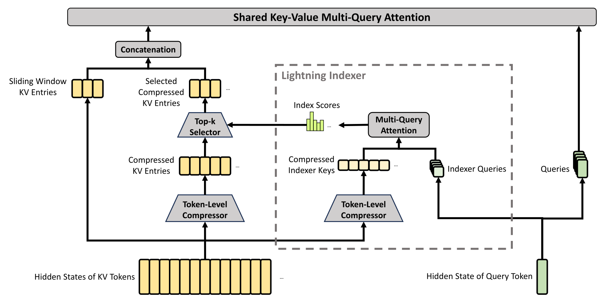

*图 9.3-9 Native Sparse Attention*

图 9.3-9 展示更复杂的稀疏和压缩 attention。Native Sparse Attention 把 key/value 分成 compression、selection、sliding window 三条并行分支：compression 把连续 block 聚合成 block-level 表示，selection 直接复用 compression 分支已经算出的注意力分数当作 block importance 打分并取 top-n block，sliding window 保留最近窗口的局部上下文。三条分支共用同一组 query、各自持有独立的 key/value，输出由一个 MLP + sigmoid 学出的 gate 加权求和。GQA、MLA、CLA、local attention 和 sparse attention 都在重写 KV cache 账本；它们能换速度和显存，也会改变模型保留长程信息的方式，所以需要和具体任务质量一起评估。

### 9.3.5 Quantization、Pruning 与 Distillation

除了 KV cache，推理还要搬运模型权重。模型压缩可以分成三类：

- `quantization`：降低权重、activation 或 KV cache 的 dtype，例如 BF16 到 INT8 / INT4 / FP8。
- `pruning`：删除不重要的层、head、channel 或 hidden dimension。
- `distillation`：用大模型的 logits、偏好或中间表示训练小模型。

*图 9.3-10 AWQ schema*

量化的核心收益是减少 memory traffic 和显存占用。`QAT` 在训练时模拟量化误差，质量更稳但成本高；`PTQ` 在训练后校准或重构权重，部署成本低；`GPTQ` 利用近似二阶信息修正逐列量化误差。

`AWQ` 观察到少数 activation channel 的幅值明显更大，与这些 channel 相乘的权重对量化误差更敏感。把这 0.1%-1% 的显著权重单独留在 FP16 会引入混合精度，硬件实现代价高；AWQ 改用 per-channel 的等价缩放，在量化前放大显著通道，让全部权重都保持低比特并且不依赖反向传播或重构。校准数据决定了哪些 channel、layer 或 tensor 被认为重要，和目标任务分布不匹配时，压缩后的模型可能在关键场景里掉点。

> [!WARNING]
> 量化减少字节数，不等于端到端 latency 必然按同样比例下降。dequantization、分组 scale、kernel 支持、batch size、KV cache dtype 和 memory layout 都会影响真实收益。

*图 9.3-11 Pruning and distillation loop*

pruning 更像“先切掉，再修复”。通常先用校准数据估计 layer/head/channel 的重要性，再构造更小模型，最后通过继续训练或 distillation 修复质量。

结构化 pruning 更容易带来真实 wall-clock 加速；非结构化稀疏如果没有硬件和 kernel 支持，可能只减少参数量，不减少延迟。若某些 activation 长期很大或方差很低，也要判断它们是可吸收的偏置现象，还是删除后会破坏下游行为的关键通道。

*图 9.3-12 Pruning and distillation results*

图 9.3-12 把 pruning / distillation 放到压缩比例、修复训练成本和质量损失之间权衡。distillation 也不只服务最终小模型，它还可以训练 speculative sampling 的 draft model。所有会改变模型表示或压缩数值的方案都要同时看两件事：质量是否还能接受，以及 kernel、dtype 和硬件是否真的把参数或 activation 的减少转化成 wall-clock 收益。

## 9.4 Speculative Sampling：先起草，再验证

前面的方法会改变模型结构或数值表示，可能损失质量。`speculative sampling` 的目标更强：利用小模型加速，但保持 target model 的精确采样分布。

核心不对称是：generation 慢，因为 target model 要逐 token 串行生成；checking 快，因为给定一段候选 token 后，target model 可以在 `prefill` 风格的并行前向里一次检查多个位置。

因此 speculative sampling 的收益来自把 target model 的串行步骤换成更少次并行检查。Draft model 越接近 target model，候选 token 越常被接受；候选长度越接近当前模型和硬件的甜点区，target model 的并行检查越能抵消 draft model 的额外成本。

### 9.4.1 Draft Model 与 Target Model

`speculative sampling` 使用两个模型：

- `draft model`：小、便宜，先自回归生成 $k$ 个候选 token。
- `target model`：大、准确，对这 $k$ 个 token 并行计算概率并决定接受或拒绝。

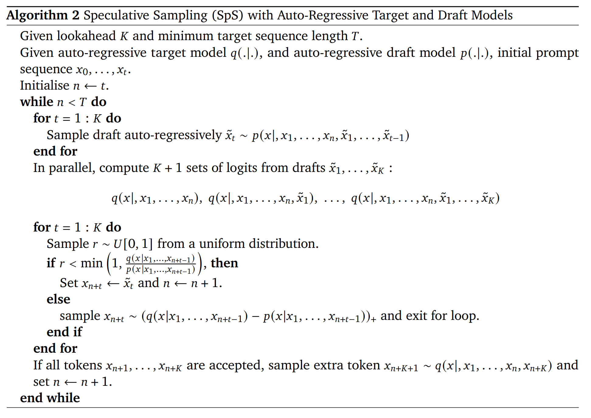

*图 9.4-1 Speculative sampling algorithm*

对第 $i$ 个候选 token $x_i$，设 draft model 和 target model 在同一候选前缀下的条件分布分别为 $p_i$ 和 $q_i$。这个前缀包含已接受 token 和此前已起草的候选 token。候选的接受概率是：

$$
a_i(x_i) = \min\left(1, \frac{q_i(x_i)}{p_i(x_i)}\right)
$$

当 draft model 过度偏向某个 token 时，第一次拒绝后从归一化的残差分布 $r_i(y) \propto \max(q_i(y) - p_i(y), 0)$ 采样一个 token。若 $k$ 个候选全部被接受，再从 target model 采样一个额外 token。接受与残差采样共同补偿 proposal distribution 的偏差。

关键性质在于分布保持。正确的 speculative sampling 是修改过的 rejection sampling，可以保持从 target model 分布精确采样。它减少 target model 串行 generation 步数，同时保留 target model 的目标分布。

### 9.4.2 速度取决于 Draft 质量和候选长度

*图 9.4-2 Speculative sampling results*

图 9.4-2 展示 speculative sampling 的经验收益。若 draft model 太弱，候选 token 经常被拒绝，target model 仍然要频繁接管；若候选长度太短，target model 的并行检查优势没有发挥；若候选长度太长，后面 token 更容易偏离 target model，拒绝率又会上升。

*图 9.4-3 Speculative sampling stats*

图 9.4-3 中候选长度通常存在一个中间区间：draft model 的开销较低，target model 的并行检查足够划算，接受率也没有低到抵消收益。

### 9.4.3 Medusa 与 EAGLE

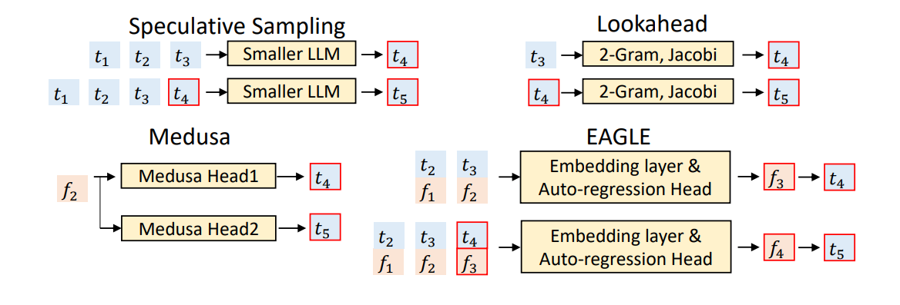

*图 9.4-4 Medusa and EAGLE*

Medusa 和 EAGLE 都是在改进 draft token 的生成方式。Medusa 给 target model 加多 token 预测头，让候选生成更贴近目标模型；EAGLE 使用 target model 的高层特征来构造更好的 draft。

它们的共同目标是提高候选质量和接受率，从而让 target model 更少做串行 generation。只要验收数学正确，speculative sampling 就可以保持 target distribution，同时减少 target model 的串行瓶颈。

## 9.5 Dynamic Serving：Continuous Batching 与 PagedAttention

真实在线服务更像不断变化的请求流。请求到达时间不同、prompt 长度不同、generation 长度不同、结束时间不同，还可能共享 system prompt 或对同一 prompt 采样多条回答。这种 workload 是 ragged 的。

### 9.5.1 Continuous Batching 与 Selective Batching

静态 batching 要等一批请求一起开始，并且常被最长请求拖住。`continuous batching` 使用 iteration-level scheduling：每个 generation step 都可以把新请求加入 batch，把完成请求移出 batch。

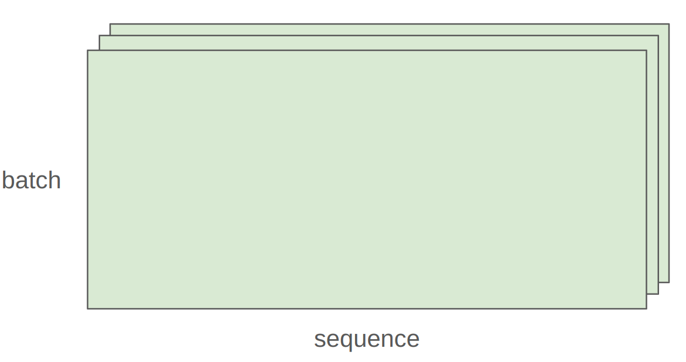

*图 9.5-1 Selective batching*

图 9.5-1 说明了另一个细节：不同长度 sequence 很难整齐堆成一个 $B \times S \times H$ 张量。Attention 部分依赖各自上下文长度，通常需要按 sequence 或 block 处理。

Non-attention MLP 部分可以把不同请求的 token 拼成一个更大的 token batch 来计算。`continuous batching` 处理请求什么时候进出 batch，`selective batching` 处理不同算子用什么形状打包更合适。

### 9.5.2 PagedAttention：把 KV cache 当分页内存管理

PagedAttention 面向在线服务中 KV cache 的生命周期管理。传统做法按最大长度给每个请求预留连续 KV cache，会产生两类浪费：

- 内部碎片：请求实际生成很短，却占了最大长度的空间。
- 外部碎片：多个请求释放后留下零散空洞，总空闲显存够，但找不到足够大的连续块。

KV cache 的硬件预算与 HBM 容量约束已在 [第 5 章 §5.8 KV cache 管理](../chapter5/chapter5_GPU和GPU相关优化.md) 给出，本节继续讲服务侧的调度问题。

*图 9.5-2 PagedAttention fragmentation*

vLLM 的 PagedAttention 借鉴操作系统分页思想，把每个序列的 KV cache 切成固定大小 `KV block`，用 block table 把逻辑连续 token 映射到物理上不连续的显存块。请求增长时按需分配 block，结束后回收 block。

*图 9.5-3 PagedAttention blocks*

`logical block` 是某个请求自己的连续上下文视图，`physical block` 是显存里实际分配到的块。二者通过 block table 连接，因此同一个请求在逻辑上连续，物理上可以散落在不同空闲块中。

*图 9.5-4 PagedAttention logical and physical blocks*

图 9.5-4 展开了 block table 的作用。左侧的 logical blocks 按 token 顺序编号，表示请求自己看到的连续上下文；右侧的 physical blocks 是显存里实际分配的 KV block，可以散落在不同位置。推理 kernel 通过 block table 找到每个 logical block 对应的 physical block，于是服务端既能按需复用零散显存，又能让模型逻辑上看到连续的历史 token。

### 9.5.3 Prefix Sharing 与 Copy-on-Write

在线服务中经常有共享前缀：相同 system prompt、多轮对话的公共历史、同一 prompt 采样多条回答。PagedAttention 的 block table 可以让多个请求共享同一段 prefix KV cache。

*图 9.5-5 PagedAttention prefix sharing*

如果两个请求后续生成不同 token，就在分叉处触发 `copy-on-write`。完整的共享 prefix block 可以继续共享；若新 token 要写入同一个尚未填满的共享末尾 block，服务端会复制该 block，再让两个请求分别写入。分叉从新 block 开始时，各请求只需分配自己的新 block。

*图 9.5-6 PagedAttention copy-on-write*

PagedAttention 和 FlashAttention 的层级不同：

- FlashAttention 是算子级优化，减少 attention forward 中 HBM 与 SRAM 的往返。
- PagedAttention 是服务系统级优化，减少 KV cache 的预留浪费、碎片和重复存储。
- 两者可以配合使用，但 page/block 布局会影响 attention kernel 的访存模式，需要 serving engine 共同设计。

PagedAttention 也不是 serving 性能的全部。实际 serving engine 还会把 block lookup 和 attention kernel 融合，使用 FlashDecoding 一类 kernel，并通过 CUDA graphs 等机制减少 kernel launch overhead。

SGLang 的 `RadixAttention` 可以看成另一类 prefix / KV cache 复用策略：它把请求前缀组织成 radix tree，复用多轮对话、agent 工具调用或批量采样中重复的 prompt KV。

PagedAttention 更强调显存分页和碎片管理，RadixAttention 更强调 prefix cache 命中和调度；两者都服务于同一个 dynamic serving 问题：不断变化的一群请求怎样共享权重、共享前缀、少浪费 KV cache，并保持合理 latency。

> [!NOTE]
> Disaggregated Serving 思路在 Step-3（[arXiv:2507.19427](https://arxiv.org/abs/2507.19427)）之前由 DistServe / Splitwise 等工作给出 prefill-decode 分离部署方案：让擅长高吞吐矩阵乘的硬件专门承担 prefill，让单 token latency 敏感的硬件专门承担 decode。代价是 prefill 阶段写入的 KV cache 必须跨 prefill → decode 边界搬运或重算，跨单元网络与调度策略因此成为新的系统瓶颈。Step-3 进一步做的是 **Attention-FFN Disaggregation (AFD)**——按 attention 层与 FFN 层这条维度把模型解耦到两套专用 GPU 子系统上，prefill/decode disaggregation 假设已在外部完成。这两条线都以拆分换部署灵活性，但拆分维度不同：prefill/decode 拆分优化 latency / throughput 的资源分配，AFD 优化 attention 与 FFN 这两类算子的硬件匹配。这一模式也意味着是否拆分是和硬件配置绑定的工程选择，单一硬件 / 负载下只有相对优解，没有跨场景的统一答案。

## 9.6 扩展研究：更换输入、记忆和生成范式

前面是推理系统主线。本节收束几类扩展研究：prompt compression、SSM / linear attention、diffusion language model 和 speculative cascades。它们都有价值，但要和主线分开读：有些改输入长度，有些改记忆结构，有些改生成范式，有些改大小模型协作策略。

### 9.6.1 Prompt Compression

prompt 也会消耗推理预算。长 prompt 会增加 `prefill` 时间，也会写入更多 KV cache；若后续 generation 很长，还会让每步 attention 读取更多历史。过多冗余信息还可能稀释注意力，让模型在无关上下文里寻找线索。因此 prompt compression 的目标是：尽量保留任务相关信息，同时减少输入 token 或压缩输入表示。

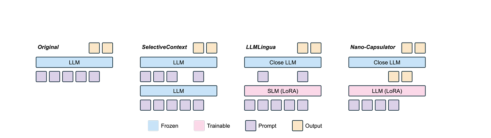

*图 9.6-1 Hard prompt compression*

hard prompt compression 直接在离散文本上做选择、摘要或改写。常见做法包括按 query 相关性筛选段落、摘要长文档、改写冗长指令，或者根据任务难度动态控制 token 数。它通常更可解释，也更容易和检索、重排、摘要系统结合；风险是删掉看似冗余但实际关键的上下文。

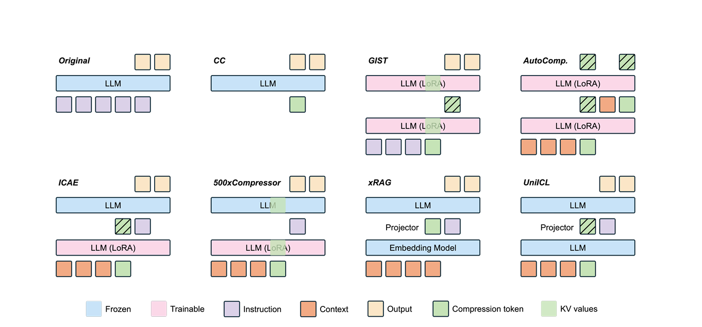

*图 9.6-2 Soft prompt compression*

soft prompt compression 使用连续向量替代或补充自然语言 prompt。它可以把任务信息压到少量 embedding 中，适合固定任务或固定模板下的压缩；代价是可解释性较弱，跨任务泛化更依赖训练数据。只要这些向量仍作为 prefix 进入模型，就仍会参与前向和 attention，因此它减少的是文本 token 表达负担，不必然减少所有推理成本。

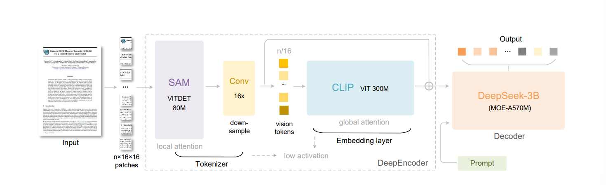

*图 9.6-3 DeepSeek-OCR prompt compression*

视觉层面的 prompt compression 把长文本转成视觉表示或图像 token，再由多模态编码器读取。它的优势是可能绕开纯文本 token 数限制；风险是引入 OCR / vision encoder 误差，并且会改变模型看到的信息通道。三类 prompt compression 优化的都是输入长度、`prefill` 时间和 KV cache 压力，使用时要把压缩率和任务质量一起评估。

### 9.6.2 SSM、Linear Attention 与 Hybrid Attention

Transformer 的 KV cache 来自显式保存所有历史 token 的 key/value。另一类架构尝试把历史压成递推状态或低维摘要。

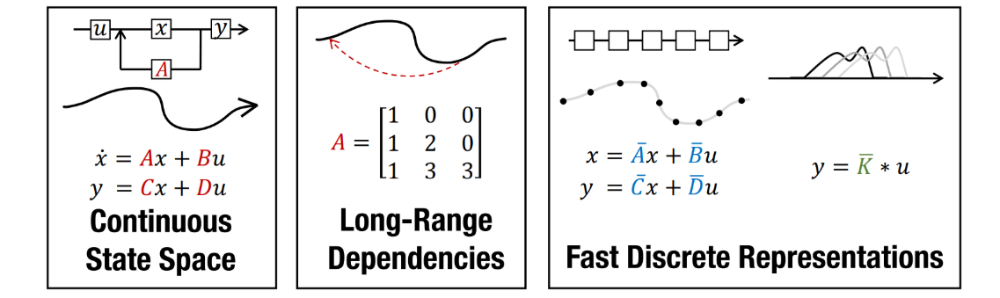

*图 9.6-4 State space model*

SSM / Mamba / GatedDeltaNet 这类模型可以被看作更适合流式推理的记忆结构：不显式保存完整 KV cache，而是更新某种 hidden state。它们对长序列更友好，但能否保留精确长程检索能力取决于状态容量和训练方式。

> [!NOTE]
> 本节引用的 MiniMax / MiniMax-01 由 MiniMax 团队发表于 arXiv [2501.08313](https://arxiv.org/abs/2501.08313)（2025 年 1 月），采用 7:1 hybrid（7 个 linear attention 层 + 1 个 softmax attention 层）的设计；图 9.6-5 与图 9.6-6 来自该论文。

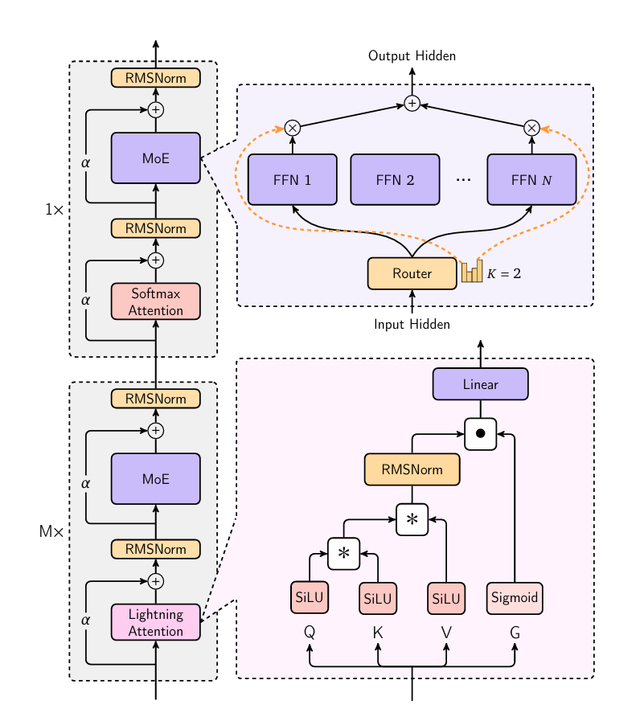

*图 9.6-5 MiniMax hybrid attention*

图 9.6-5 讲的是 hybrid attention 的结构动机。标准 softmax attention 擅长精确检索历史 token，但 KV cache 和长上下文成本高；linear attention、SSM 或递推层把历史压成低维状态，流式推理更友好，但可能丢失精确长程检索能力。Hybrid 结构把这些机制放在不同层或不同模块里组合，目标是在保留一部分全局检索能力的同时降低长序列 generation 成本。

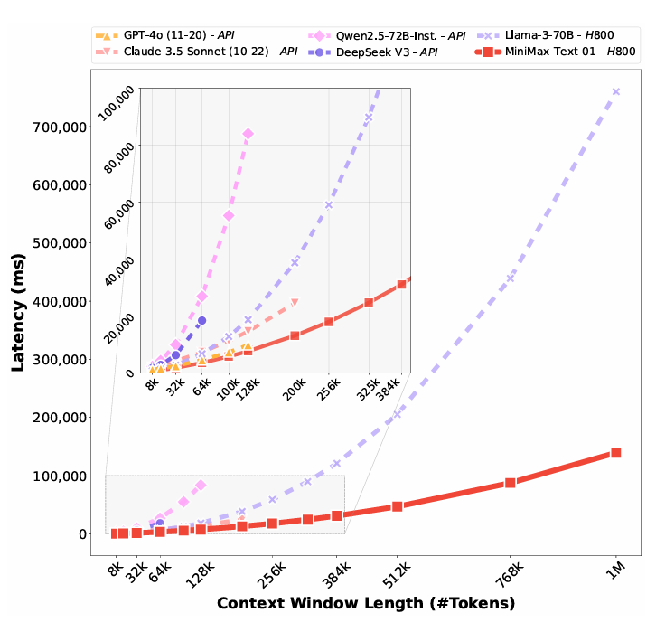

*图 9.6-6 MiniMax inference time*

图 9.6-6 把这种 architecture choice 落到 inference time 上。随着上下文变长，完整 attention 的 KV cache 读取和 attention 计算会持续增长；替换成更多线性或递推层后，长序列 generation 的成本曲线可以变平。这里仍然要保留质量账本：如果任务需要 needle-in-a-haystack 式精确检索，过度压缩历史可能让速度收益换来能力损失。

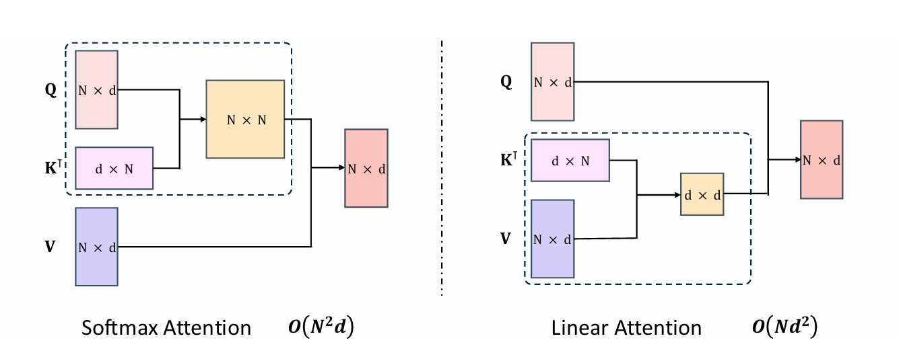

*图 9.6-7 Global attention vs linear attention*

linear attention 需要注意因果性。若直接使用整段序列的全局 $K^\top V$ 汇总，当前位置会看到未来 token；自回归 generation 必须使用前缀累加，只允许当前 token 读已经出现的历史。这样可以把某些计算变成递推，但也限制了表达形式。SSM 和 linear attention 优化的是“如何表示历史”：它们可能比 KV cache 更适合 streaming，但长程精确检索和最终质量仍决定能否替代标准 attention。

### 9.6.3 Diffusion Language Models

diffusion language model 试图把文本生成从严格逐 token 自回归，改成迭代去噪或块内并行生成。

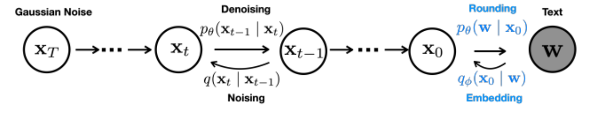

*图 9.6-8 Diffusion model*

扩散路线的潜在优势是并行生成多个位置，减少自回归串行步数；挑战是离散 token 的概率建模、长文本因果一致性、代码和工具调用这类强结构任务，以及如何与 KV cache / serving scheduler 结合。

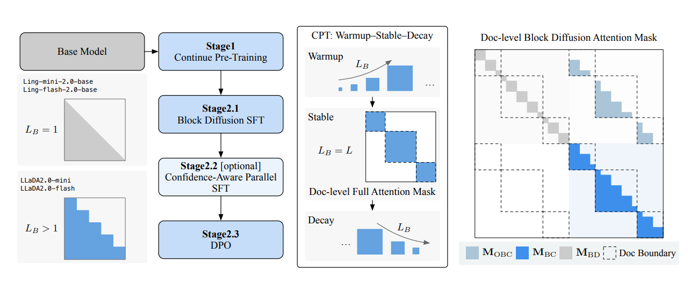

*图 9.6-9 LLaDA2.0 training*

LLaDA 2.0 这类工作把扩散语言模型推到更大规模：LLaDA2.0-mini 16B 与 LLaDA2.0-flash 100B 都是 MoE，并且从已有 AR checkpoint 转换而来，而非从零训练。它用 Warmup-Stable-Decay 调度 block diffusion 的 block size：warmup 阶段把 block size 从 1 逐步提到 4096，stable 阶段做全序列扩散，decay 阶段再收回到紧凑 block 以适配部署。扩散路线还没有取代自回归 Transformer，但非自回归和块内并行生成已经成为值得关注的推理效率方向。

### 9.6.4 Speculative Cascades

Speculative cascades 也是大小模型协作，但它和标准 speculative sampling 的目标不同。标准 speculative sampling 追求保持 target model 精确分布；cascades 更像风险感知路由：低风险片段用小模型，高风险片段升级到大模型。

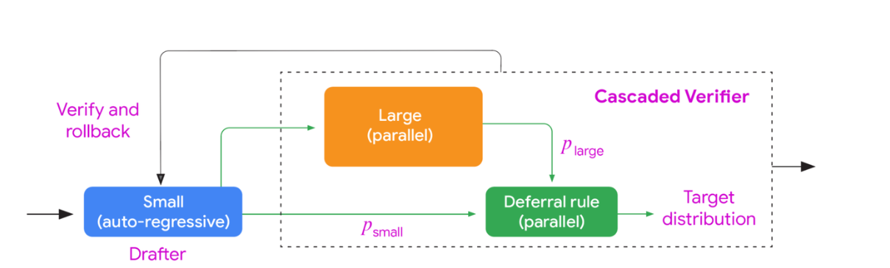

*图 9.6-10 Speculative cascades models*

图 9.6-10 展示的是 cascades 的模型层级：小模型先承担低成本生成或判断，大模型只在不确定、风险高或质量要求更高的片段介入。它和前面的 speculative sampling 都利用大小模型协作，但目标函数不同；这里更接近服务系统里的风险路由，通常不承诺严格保持某个 target model 的逐 token 分布。

*图 9.6-11 Speculative cascades demo*

图 9.6-11 把流程动态化：小模型生成 candidate block，验证器或更大模型判断是否接受；若片段通过，就继续沿低成本路径前进，若不通过，则升级到更强模型重算或修正。这个方向优化的是质量、成本和延迟之间的产品取舍，通常不承诺保持 target model 的逐 token 精确采样分布，因此更适合作为扩展研究处理。

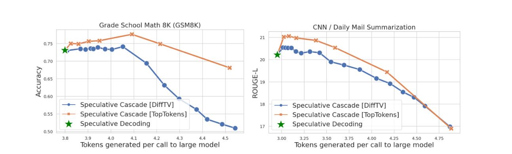

*图 9.6-12 Speculative cascades quality and rejection*

图 9.6-12 展示质量与拒绝率的取舍：拒绝率越高，大模型参与越多，质量更稳但成本更高；拒绝率越低，小模型承担更多工作，latency 和成本可能更好但质量风险更高。标准 speculative sampling 通过接受与残差采样保持 target distribution；speculative cascades 是产品质量约束下的风险路由，两者相似但目标函数不同。

## 本章总结与下章衔接

推理系统的核心是把 token generation 的成本拆到账本里：

- `prefill` 能并行看 prompt，常更接近 compute-bound；`generation` 逐 token 串行，常被 weight memory 和 KV cache 读取限制。
- MLP generation 可以靠 batch 摊薄权重读取；attention generation 受每请求私有 KV cache 限制，GQA、MLA、CLA、local attention 的目标就是把这份 cache 压小或换种组织方式。
- GQA、MLA、CLA、local attention、sparse attention 都是在减少或重组 KV cache，但要检查质量。
- Quantization、pruning、distillation 减少权重或模型本体成本，但真实加速依赖 kernel 和硬件支持。
- Speculative sampling 用 draft model 起草、target model 并行验收，可以保持 target distribution。
- Continuous batching 和 PagedAttention 面向动态 serving，把 ragged workload、KV fragmentation、prefix sharing 和 copy-on-write 变成可管理的问题。
- CoT、多路径采样、工具搜索和 RL rollout 会放大 token 生成、KV cache 与调度压力；训练侧分析见 [第 13 章 可验证奖励的强化学习](../chapter13/chapter13_可验证奖励的强化学习.md)，能力侧分析见 [推理行为与能力专题](../topics/reasoning_behavior.md)。
- SSM、linear attention、diffusion language model 和 speculative cascades 是更激进的扩展方向，应该按“优化哪个瓶颈、留下什么质量风险”来读。

推理系统决定了 token 的产出成本，token 产出又受数据规模与配比约束：压得越狠，蒸馏 / 量化校准 / draft model 训练数据的需求越高；这些都把视角从模型与系统切到训练数据本身。下一章把这些数据侧工程串起来：[第 10 章 数据工程](../chapter10/chapter10_数据工程.md)。

## 思考

1. 如果一个服务的 `TTFT` 很差，但 generation latency 很好，优先应该检查 prompt prefill、scheduler 排队，还是 KV cache 布局？

2. 如果一个模型使用 GQA 后 throughput 提升，但某些长上下文任务变差，这说明压缩了哪个资源，可能损失了什么能力？

3. Speculative sampling 和 speculative cascades 都用小模型，但为什么前者可以强调 exact sampling，后者更像质量/成本路由？

## 参考文献

- [JAX Scaling Book: Inference](https://jax-ml.github.io/scaling-book/inference/)
- [vLLM / PagedAttention](https://arxiv.org/abs/2309.06180)
- [Orca: A Distributed Serving System for Transformer-Based Generative Models (OSDI 2022)](https://www.usenix.org/conference/osdi22/presentation/yu)
- [SGLang / RadixAttention](https://github.com/sgl-project/sglang)
- [TensorRT-LLM](https://nvidia.github.io/TensorRT-LLM/)
- [Speculative decoding (Leviathan et al.)](https://arxiv.org/abs/2211.17192)
- [Speculative sampling (Chen et al.)](https://arxiv.org/abs/2302.01318)
- [GQA](https://arxiv.org/abs/2305.13245)
- [DeepSeek-V2 / MLA](https://arxiv.org/abs/2405.04434)
- [Cross-Layer Attention](https://arxiv.org/abs/2405.12981)
- [Mistral 7B / sliding-window attention](https://arxiv.org/abs/2310.06825)
- [Longformer: The Long-Document Transformer](https://arxiv.org/abs/2004.05150)
- [Sparse Transformer](https://arxiv.org/abs/1904.10509)
- [Native Sparse Attention](https://arxiv.org/abs/2502.11089)
- [GPTQ](https://arxiv.org/abs/2210.17323)
- [AWQ](https://arxiv.org/abs/2306.00978)
- [Compact Language Models via Pruning and Knowledge Distillation](https://arxiv.org/abs/2407.14679)
- [Medusa](https://arxiv.org/abs/2401.10774)
- [EAGLE](https://arxiv.org/abs/2401.15077)
- [Prompt Compression for Large Language Models: A Survey](https://aclanthology.org/2025.naacl-long.368/)
- [DeepSeek-OCR](https://arxiv.org/abs/2510.18234)
- [MiniMax-01](https://arxiv.org/abs/2501.08313)
- [Efficiently Modeling Long Sequences with Structured State Spaces](https://arxiv.org/abs/2111.00396)
- [Diffusion-LM](https://arxiv.org/abs/2205.14217)
- [LLaDA2.0: Scaling Up Diffusion Language Models to 100B, arXiv:2512.15745](https://arxiv.org/abs/2512.15745)
- [Faster Cascades via Speculative Decoding](https://arxiv.org/abs/2405.19261)

## 来源与更新记录

- 章节引用的 trace / video 资源：见 `sources/lectures/` 与 `sources/captions/lecture_*.md` 对应章节。
- 链接复核：2026-09-04（[LLaDA2.0: Scaling Up Diffusion Language Models to 100B, arXiv:2512.15745](https://arxiv.org/abs/2512.15745)，Tiwei Bie 等 31 位作者按姓氏字母序署名，机构覆盖 Ant Group / Renmin University of China / Zhejiang University / Westlake University / Hong Kong University of Science and Technology 五所，v1 提交 2025-12-10 / v2 修订 2025-12-24；MiniMax-01 [arXiv:2501.08313](https://arxiv.org/abs/2501.08313) 引用回连到第 3 章与第 8 章；稀疏 attention 一节引用 [Native Sparse Attention (arXiv:2502.11089)](https://arxiv.org/abs/2502.11089) 与 [Sparse Transformer (arXiv:1904.10509)](https://arxiv.org/abs/1904.10509)；其余链接本次复核仍可访问）。
- 推理系统与指标来源：[JAX Scaling Book: Inference](https://jax-ml.github.io/scaling-book/inference)（Transformer inference 综述，2025-02-04 出版）；[vLLM / PagedAttention](https://arxiv.org/abs/2309.06180)；[Orca (OSDI 2022, Gyeong-In Yu 等)](https://www.usenix.org/conference/osdi22/presentation/yu)，continuous batching 的 iteration-level scheduling 与 selective batching 出处；SGLang / RadixAttention；[TensorRT-LLM](https://nvidia.github.io/TensorRT-LLM/)（NVIDIA 官方文档，2026-09-04 查阅）；[Prompt Compression Survey (NAACL 2025)](https://aclanthology.org/2025.naacl-long.368/)；[Speculative decoding (arXiv:2211.17192)](https://arxiv.org/abs/2211.17192) 与 [Speculative sampling (arXiv:2302.01318)](https://arxiv.org/abs/2302.01318)。
- 结构与压缩来源：[GQA](https://arxiv.org/abs/2305.13245)（uptraining：KV 投影 mean pooling + 5% 原始训练步数）、[DeepSeek-V2 / MLA](https://arxiv.org/abs/2405.04434)（$d_c=512$、RoPE 额外 $d_h^R=64$，合计每 token 每层 576 维）、[CLA](https://arxiv.org/abs/2405.12981)、[Mistral 7B](https://arxiv.org/abs/2310.06825)（rolling buffer cache，$W=4096$）、[Longformer (arXiv:2004.05150)](https://arxiv.org/abs/2004.05150)、[Sparse Transformer](https://arxiv.org/abs/1904.10509)、[Native Sparse Attention (arXiv:2502.11089)](https://arxiv.org/abs/2502.11089)、[GPTQ](https://arxiv.org/abs/2210.17323)、[AWQ](https://arxiv.org/abs/2306.00978)、[pruning 与 distillation (arXiv:2407.14679)](https://arxiv.org/abs/2407.14679)、[Medusa (arXiv:2401.10774)](https://arxiv.org/abs/2401.10774)、[EAGLE (arXiv:2401.15077)](https://arxiv.org/abs/2401.15077)、prompt compression、DeepSeek-OCR、MiniMax-01 (arXiv:2501.08313，7 个 lightning attention 层后接 1 个 softmax attention 层，共 80 层)、S4 (arXiv:2111.00396)、Diffusion-LM (arXiv:2205.14217)、[LLaDA2.0 (arXiv:2512.15745)](https://arxiv.org/abs/2512.15745)、[Faster Cascades via Speculative Decoding (arXiv:2405.19261)](https://arxiv.org/abs/2405.19261)。
