# 专题：推理行为与能力

## 本专题解决什么问题

LLM 推理能力既是可观察的生成行为，也是消耗系统预算的训练与服务决策。日常使用大语言模型（LLM）时，简单聊天、代码辅助和复杂问题求解都会触发模型生成一段看起来有条理的回答；一些人类几乎能一眼判断的简单问题，也可能触发模型生成较长的推理文本。推理行为要从能力、解码、训练目标和系统成本几个角度一起分析。

本专题围绕五条主线展开：

- 预训练分布是否已包含正确推理轨迹；
- CoT 与多路径采样怎样改变这些轨迹被取出的概率；
- prompt 模板如何引导问题分解方式；
- SFT / RLHF / RLVR 等后训练如何重排搜索偏好与奖励风险；
- 外部工具与搜索如何扩展信息来源与动作空间。

阅读完本专题后，读者可以判断：在给定的预算与服务约束下，某个推理行为改进主要提升的是 `accuracy`、`efficiency` 还是 `resources`；`多路径 CoT` 这类方法的代价来自哪几项 serving 指标；`RLVR` 的能力上限受哪些信号与覆盖范围限制。第 9 章 serving 系统与第 13 章 RLVR 训练流程是本专题的工程上下文，本专题只讨论推理行为本身。

## 推理能力的研究案例

本节先用三个 2026 年公开案例把"LLM 推理"从抽象能力落到具体研究工件上：三条案例分别覆盖程序合成、定理证明和数学公式推导三类典型应用，后续小节再沿着五条主线拆解能力、概率与系统代价。

- Anthropic 的 Claude 参与 Donald Knuth 研究过的图论猜想推导过程，记录见 [Knuth 的 PDF](https://www-cs-faculty.stanford.edu/~knuth/papers/claude-cycles.pdf)。
- Brenner（Google Research 与 Harvard SEAS）、Cohen-Addad（Google Research）和 Woodruff（Google Research 与 Carnegie Mellon 联合）在 [arXiv:2603.04735 *Solving an Open Problem in Theoretical Physics using AI-Assisted Discovery*](https://arxiv.org/abs/2603.04735) 中，结合 Gemini Deep Think 与 Tree Search 框架及自动化数值反馈，求解宇宙弦引力辐射功率谱的精确解析解，共识别出 6 种解析方法（最优雅的一种以 Gegenbauer 多项式展开核函数）。
- Tony Feng 的 [arXiv:2601.23245 *Eigenweights for arithmetic Hirzebruch Proportionality*](https://arxiv.org/abs/2601.23245) 在 *Declaration of AI Usage* 中写明：核心数学内容（Type A / Type C / Type D 等经典群的 eigenweight 公式与证明）由内部推理代理（基于 Gemini Deep Think 构建）完整生成，Type B 沿用 prior work [FYZ25a] 计算；人类作者负责搭建推理代理、把代理输出重写成论文形式并撰写引言。

三个案例从不同角度展示同一类机制：模型负责生成推理轨迹和数学构造，作者负责设定目标、组织验证与最终叙述。这与本专题后面讨论的 CoT、多路径采样与工具扩展主题相互呼应：推理行为既可以由模型直接产生，也可以由作者代理作为中间环节。

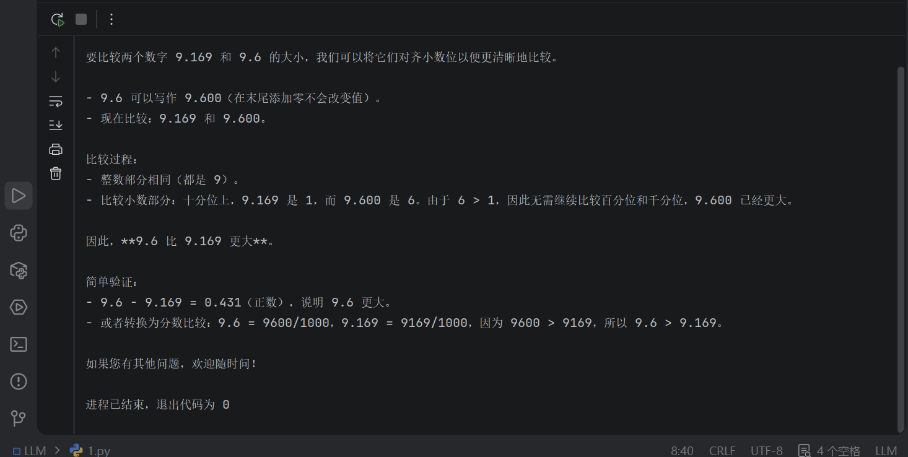

*专题图 1 简单数值比较中的过度推理示例*

专题图 1 的问题只是比较 $9.169$ 和 $9.6$ 的大小，但模型仍然可能生成一段分步解释。这类例子把能力问题和成本问题放在同一张账本里：推理文本可以提高可读性和可验证性，也会占用更多输出 token、更长上下文和更多 serving 资源。本专题余下部分沿着五条主线逐一展开，每条主线都会回到这个能力—成本账本。

## 预训练与解码：潜在推理如何被显式取出

预训练模型通过 next-token prediction 学习文本分布。这个目标看起来只是在预测下一个 token，但大规模文本中包含数学推导、代码执行、类比、证明、反事实和常识约束。模型为了降低交叉熵，会在参数中压缩这些结构。推理阶段能否看见这些结构，很大程度取决于解码策略怎样从输出分布中取样。

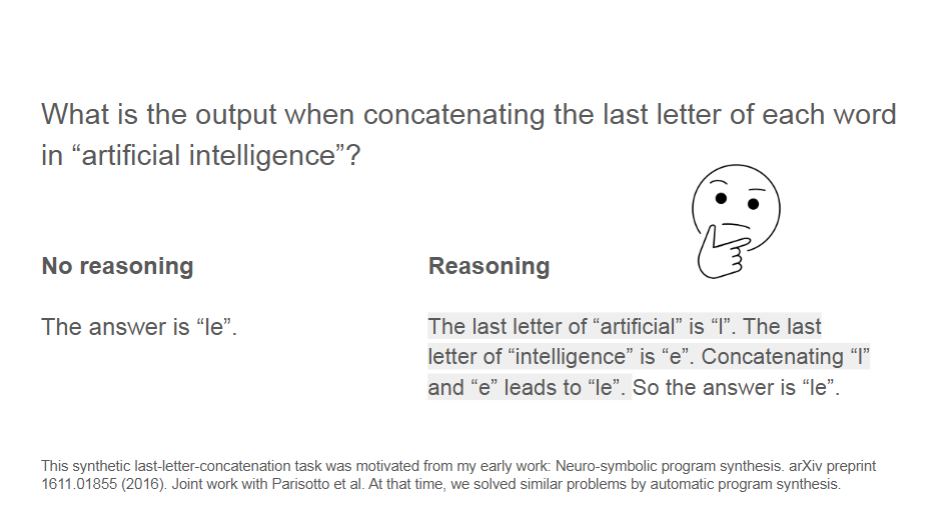

*专题图 2 无推理回答与显式推理回答的对比*

专题图 2 对比了直接给答案和展开中间步骤两种输出形态。直接回答 latency 更低，适合确定性较高的短任务；显式推理把中间状态暴露出来，更适合多约束、多步计算和需要审计的任务。这里的关键变量包括正确轨迹在分布中的概率、采样时能否触达，以及输出策略是否保留了可检查的中间步骤。

### 单路径解码与多路径搜索

Denny Zhou 等人在 2024 年的 [CoT 解码研究](https://arxiv.org/pdf/2402.10200)中指出，解码策略会显著影响模型推理能力的可见形式。贪心解码每一步只选择当前条件概率最大的 token，容易得到局部最优轨迹；多路径解码保留若干候选轨迹，再用置信度、logits 或答案一致性筛选更可靠的路径。

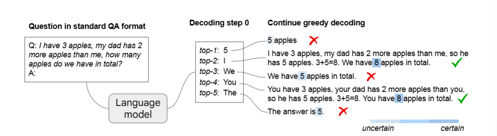

*专题图 3 预训练模型的 CoT 解码示意图*

专题图 3 展示了预训练模型在无需额外 prompt 的情况下，也可能在候选解码路径中包含显式推理链。颜色越深表示模型对最终答案的置信度越高。单一路径只看到 top-1 token 连成的轨迹，多路径搜索则把 top-k 候选展开成若干 candidate trace，从而提高正确轨迹被保留下来的机会。

在自回归生成中，贪心解码每一步选择：

$$
\arg\max P(x_t \mid x_{<t})
$$

它的优点是简单、低延迟、易于批处理；限制是每一步都只看当前局部最大概率，无法保证整条序列的联合概率最优。一个两步例子可以说明这个问题。设第一步仅在 A、B 中选一个，第二步仅在 C、D 中选一个，目标是生成两步路径。

**第 1 步的概率分布：**

| 候选 token | 概率 $P(x_1)$ |
| --- | --- |
| **A** | **0.6** |
| B | 0.4 |

**若已选择 A，第 2 步的概率分布：**

| 候选 token | 概率 $P(x_2 \mid A)$ |
| --- | --- |
| **C** | **0.6** |
| D | 0.4 |

**若已选择 B，第 2 步的概率分布：**

| 候选 token | 概率 $P(x_2 \mid B)$ |
| --- | --- |
| C | 0.05 |
| **D** | **0.95** |

贪心解码会先选 A，再从 A 出发选 C，得到路径联合概率：

$$
P(A \to C) = 0.6 \times 0.6 = 0.360
$$

所有等长路径的联合概率如下：

| 生成路径 | 联合概率计算 | 结果 |
| --- | --- | --- |
| **A → C**，贪心路径 | $0.6 \times 0.6$ | $0.360$ |
| A → D | $0.6 \times 0.4$ | $0.240$ |
| B → C | $0.4 \times 0.05$ | $0.020$ |
| **B → D**，全局最高联合概率路径 | $0.4 \times 0.95$ | $0.380$ |

> [!WARNING]
> 这个例子中，全局最高联合概率路径是 **B → D（0.380）**，贪心路径是 **A → C（0.360）**。
> 第一步的局部最高概率选择会锁定后续条件分布，Beam Search 和多路径 CoT 解码要解决的就是这类轨迹搜索问题。

### 多路径 CoT 解码

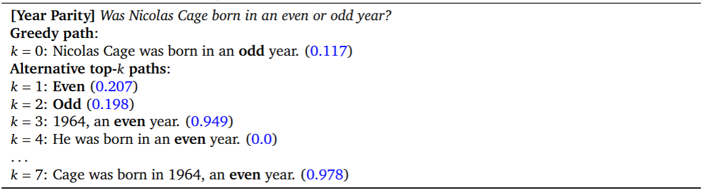

*专题图 4 PaLM-2 Large 的第一个解码步骤候选*

专题图 4 聚焦第一个解码步骤。$k = 0$ 表示贪心选择，$k > 0$ 表示保留较低排名的候选 token。如果某个非贪心候选开启了更清晰的中间推理，它在后续步骤中可能形成更高置信度的答案。这说明推理能力的可见性不只由模型参数决定，也由推理阶段的搜索宽度和筛选规则决定。

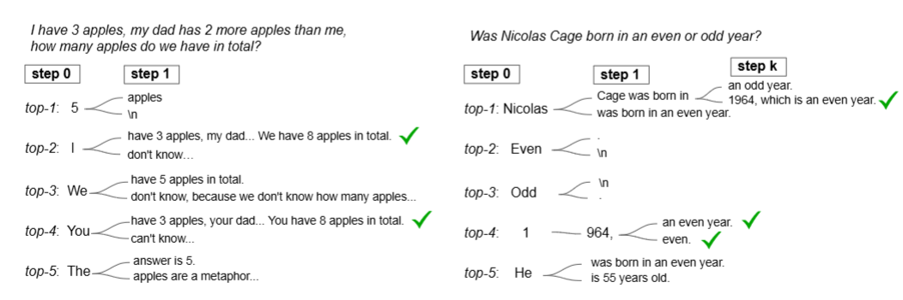

*专题图 5 多路径 CoT 解码过程*

专题图 5 把这种机制展开成多步搜索：每一步都保留多个候选 token，候选 token 继续扩展成多条推理路径，再在路径级别比较置信度、答案一致性或外部验证信号。它适合零训练地挖掘预训练模型的潜在能力，代价是需要维护更多 candidate trace，增加 generation token、KV cache 和调度压力。

从系统侧看，多路径 CoT 会把一次问题求解变成多条 candidate trace 的生成与筛选。能力侧关注正确率和稳定性；系统侧关注候选条数、平均长度、接受规则、是否共享前缀缓存，以及这些请求能否在 continuous batching 中高效合并。

### Pass@k：基座模型也包含正确轨迹

[Yue 等人在 2025 年的研究](https://arxiv.org/pdf/2504.13837)对 Qwen、LLaMA 等基础模型及其 RLVR 变体进行了比较。当 $k$ 较小时，强化学习模型的 *Pass@k* 通常更高；随着 $k$ 增大，基础模型的 *Pass@k* 会逐渐逼近强化学习模型，部分任务上还会出现反超。这说明基础模型分布中已经存在一些正确轨迹，只是这些轨迹的原始概率较低，小规模采样时不容易被触发。

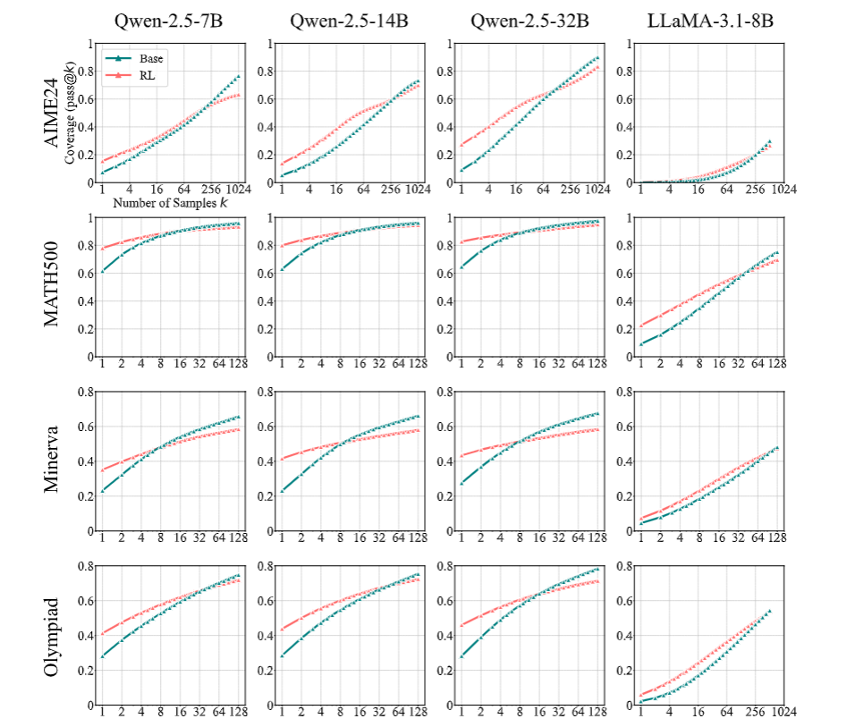

*专题图 6 基础模型与 RLVR 变体的 Pass@k 曲线*

专题图 6 的横轴是采样条数 $k$，纵轴是至少有一条轨迹答对的概率。RLVR 变体在小 $k$ 区间的优势说明后训练会把高质量轨迹的概率质量往前排；基础模型在大 $k$ 区间追上来，说明能力上限的一部分已经藏在预训练分布中。因此，RLVR 的直接效果是重排并稳定调用已有轨迹，同时也可能通过训练过程改变模型的搜索偏好。

### 问题求解能力的来源：压缩、表征和记忆

从信息论角度看，语言建模可以理解为学习文本分布的压缩方式。模型预测越接近真实分布，平均编码长度越接近最优编码；为了做到这一点，模型需要捕捉语法、语义、世界知识、代码模式和问题求解模板。

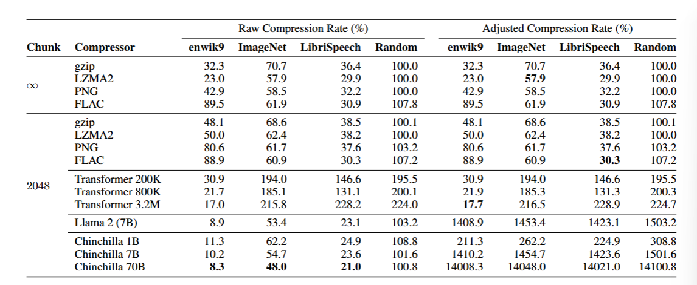

*专题图 7 语言模型作为压缩器的实验结果*

专题图 7 比较了不同 1GB 数据集上的压缩率，数值越小代表压缩效果越好。序列预测器、Llama 2 和 Chinchilla 都可以通过算术编码被用作无损压缩器。图上的关键关系是：大型语言模型在多类数据上表现出较强压缩能力，而从头训练的小型 Transformer 在单一数据集上容易过拟合。这个结果支持“语言建模即压缩”的视角，同时也说明需要区分训练集记忆和可迁移结构。

> [!NOTE]
> 假设真实分布是 $p(x)$，模型预测分布是 $q(x)$，最优前缀编码中符号 $x$ 的理想编码长度满足
> $L(x) \approx -\log_2 p(x)$。如果实际按 $q(x)$ 编码，平均编码长度就是交叉熵：
>
> $$
> H(p,q) = -\sum p(x)\log_2 q(x)
> $$
>
> 并且：
>
> $$
> H(p,q) = H(p) + D_{\mathrm{KL}}(p \| q)
> $$
>
> 当 $q(x)$ 越接近 $p(x)$，KL 散度越小，实际平均编码长度 $H(p,q)$ 越接近理论最优的 $H(p)$。

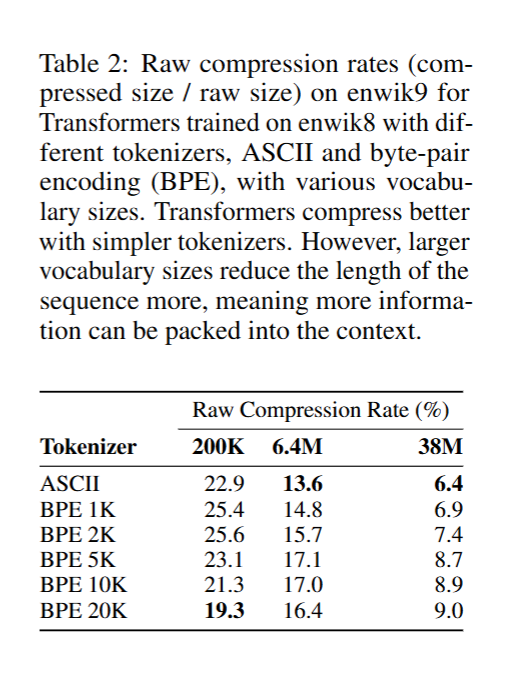

*专题图 8 tokenizer、BPE、词表大小和压缩率*

专题图 8 把压缩问题拉回 tokenizer。BPE 合并规则和词表大小会改变同一段文本被切成多少 token，进而影响训练 token 数、上下文占用和推理成本。tokenizer 只能决定输入输出的离散化方式；语言模型参数承担的是更高层的分布压缩，例如语义关系、程序结构和数学模板。

表示学习的经典线索可以追溯到反向传播早期研究。Rumelhart、Hinton 和 Williams 等人在 [Nature 论文（*Learning Representations by Back-propagating Errors*, 1986）](https://www.cs.toronto.edu/~hinton/absps/naturebp.pdf)中展示了家谱实验：研究者构建人物与亲属关系数据集，训练一个多层神经网络根据输入人物和关系预测目标人物。

$$
(\text{Person}, \text{Relation}) \to \text{Target Person}
$$

训练完成后，隐藏层单元的激活模式开始对应国籍、代际、家族分支等潜在结构（论文中并未显式监督这些特征）。这个实验说明，神经网络可以通过梯度优化从数据中形成分布式表征（distributed representation）。抽象概念不必存放在某一个单独神经元里，可以由多个神经元的联合激活模式表示。

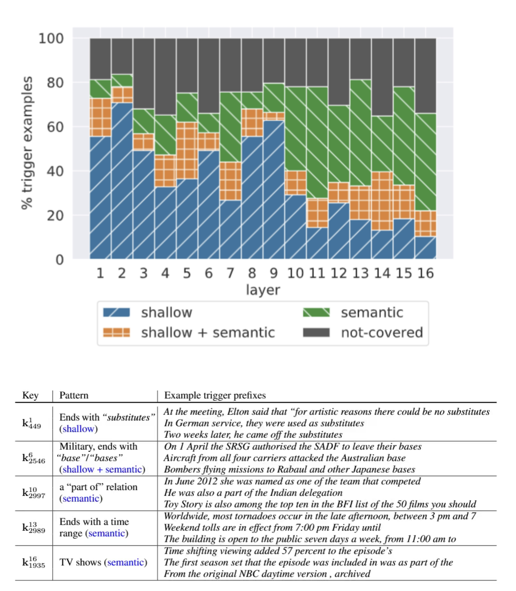

*专题图 9 FFN 层的 key-value memory 视角*

Transformer 中的 FFN 也可以从记忆和特征重组的角度理解。Mor Geva 等人在 [2021 年研究](https://aclanthology.org/2021.emnlp-main.446/)中，把 FFN 层神经元视为一种 key-value memory：输入上下文先经过 attention 汇聚信息，再激活 FFN 中与当前模式匹配的神经元，这些神经元输出会影响下一 token 的概率分布。

专题图 9 展示了这种 key-value memory 解释。较浅层 FFN 更容易响应固定短语、词形模式和局部上下文；较深层 FFN 更容易响应实体类型、语义关系和抽象语法模式。Attention 更偏向信息路由，FFN 更偏向非线性特征加工；残差连接让浅层表层线索和深层抽象线索逐层叠加。

> [!NOTE]
> 近年的推理模型也让更多人重新关注 MoE 架构，因为 MoE 能在控制每 token 激活 $\mathrm{FLOPs}$ 的同时扩展总参数量。
> 机制上，MoE 仍然是在 attention 之后做非线性特征重组，只是把单个 FFN 换成了被 router 选择的少数专家子网络。

参数记忆也确实存在。部分研究通过特定提示从生产语言模型中抽取出与训练文本高度相似的片段，这说明模型会记住某些罕见或高频材料。推理能力的来源需要同时包含两类机制：一类是字面片段记忆，另一类是通过压缩压力形成的可迁移结构。

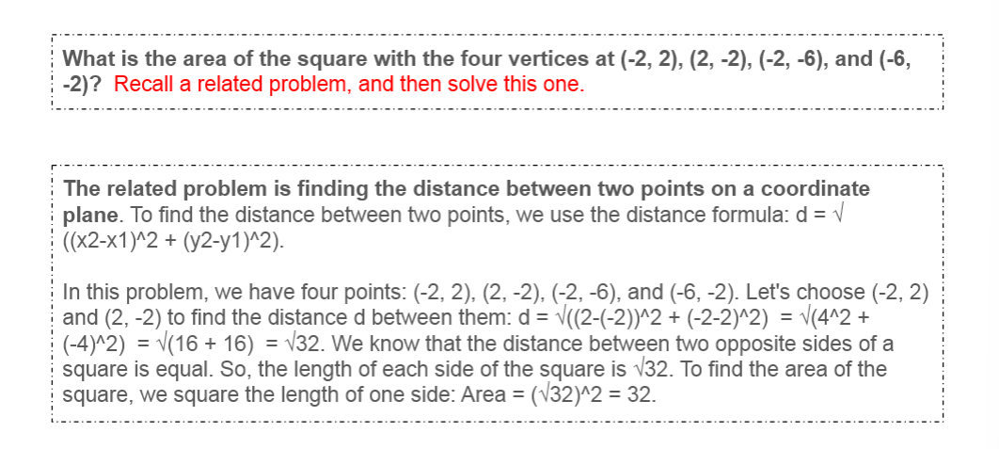

*专题图 10 类比推理提示对推理任务求解的帮助（覆盖 GSM8K、MATH、Codeforces、BIG-Bench 推理任务）*

专题图 10 展示了类比推理的使用方式。直接要求模型解复杂任务时，模型可能找不到合适路径；先要求模型回忆一个相关问题，再求解当前问题，可以把参数中已有的相似结构调出来。这个机制是在检索和重组内部模式：prompt 改变了模型进入解题空间的位置，后续解码再把相似模板迁移到当前问题。

综合这些线索，LLM 的问题求解能力未必来自单一机制。模型既会记住具体片段，也会在参数里形成可迁移结构；解码、prompt 和后训练决定这些结构能否被稳定触发，并把它们转化为可见的推理行为。

## 后训练：奖励信号如何改变搜索偏好

后训练的作用是改变模型行为分布。常见 post-training 路线可以拆成 imitation（SFT）和 reinforcement（RLHF）两条线：SFT 用示范数据抽取更符合指令的数据分布，RLHF/DPO 等方法用偏好信号优化输出。RLVR 把奖励信号换成更可验证的正确性反馈，用在数学、代码和 agentic 任务中。

更强的基座模型通常更容易从 RL 或偏好优化中获益。后训练依赖基座模型先提供足够好的初始策略；如果底座能力太弱，奖励信号也很难把采样轨迹推到高质量解题区域。

读到这里，读者应能区分 imitation、preference 与 verifiable 三类目标，并理解后训练的成功条件建立在预训练能力之上。

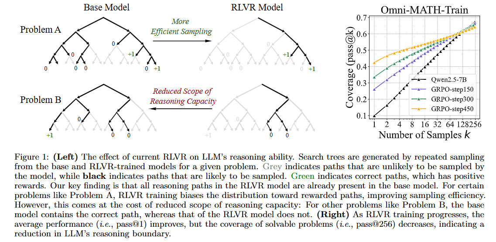

*专题图 11 RLVR 对推理搜索空间的影响*

专题图 11 可以理解为搜索空间重加权。预训练模型已经覆盖了许多候选轨迹，其中既有正确推理，也有错误捷径、冗长模板和格式化噪声。RLVR 用可验证奖励提高正确轨迹的相对概率，使小规模采样更容易命中有效路径。

但 Yue 等人的实验同时给出反向证据（专题图 11 Problem B 与右侧 Omni-MATH-Train 曲线）：对于基座模型原本就能找到正确路径的部分题目，RLVR 训练会把这些路径的概率压低，使对应题目在新策略下变成不可解；随着训练步数推进，平均 pass@1 在提升，但 pass@256 在下降，说明可解题集合在收缩。这与 §2.3 Pass@k 部分的结论一致——RLVR 的能力上限仍由基座模型的分布决定，它主要重排并稳定调用已有轨迹，副作用是在覆盖范围和平均性能之间做权衡。RLVR 的工程风险除了奖励信号覆盖不足、格式奖励过强和长度偏差，还包括这一类能力边界收缩；与 [第 13 章 §13.4 R1-Zero](../chapter13/chapter13_可验证奖励的强化学习.md) 案例中"a-ha moment 在 base 模型中已出现"的观察共同指向同一个结论：基座模型已经把可解题的上限写在分布里，后训练主要是重排触达概率。

后训练常见方法包括：

- **SFT**：用人工或模型生成的高质量示范，让模型更稳定地遵循指令、输出特定格式和采用期望风格。
- **RLHF / DPO**：用偏好数据优化回答质量，能改善有用性和安全性，也可能引入 length effects、
  overoptimization 和 mode collapse。
- **RLVR**：在数学、代码等可验证任务中直接奖励正确性，适合训练长 CoT 和搜索行为。
- **Distillation**：让学生模型学习强教师模型生成的 CoT、格式和解题策略，外部知识与推理轨迹会随数据进入学生模型。

> [!TIP]
> 知识蒸馏和纯 RL 后训练的边界要分清：RL 主要依赖模型自身探索，容易受基座能力和奖励覆盖约束；
> 蒸馏会把教师模型的外部知识、解题格式和推理模式迁移给学生模型。学生模型能否承接这些能力，
> 仍取决于自身容量、预训练覆盖和微调数据质量。

在 RL 微调过程中，若使用奖励模型或 AI judge 动态打分，就可能出现 reward hacking：模型学会利用奖励漏洞获取高分，输出质量却没有同步提高。常见缓解方式是在优化目标中加入 $D_{\mathrm{KL}}$ 惩罚，使新策略不要过度偏离参考策略。

偏好优化的关键风险来自实验条件依赖性。偏好评估容易受长度、风格和标注者分布影响；同一份回答在长版本下往往获得更高偏好分。RLVR 的系统代价主要来自 on-policy 训练需要的大量 rollout：每条 rollout 都要执行慢速 generation，训练框架与推理框架之间的切换、长 CoT 造成的 ragged batch，以及 verifier 打分都会成为系统瓶颈。

后训练可以理解为三件事的组合：提高好轨迹的采样概率，约束输出格式和风格，降低错误轨迹的表面吸引力。这些调整建立在预训练提供的能力基础上，重排能力被调用、搜索和呈现的方式。

## CoT：推理长度、有效深度与系统成本

随着智能体和长流程任务变多，推理成本里越来越大的一部分来自更长上下文和更长思维链。CoT 自 2022 年被系统提出后，显著提升了数学和复杂推理任务表现；与此同时，工程上需要回答一个边界问题：更长的推理链在什么条件下带来有效计算，什么时候只是更贵的输出。

> [!WARNING]
> 更长的思维链并不自动等于更强的推理能力。后训练可以通过奖励函数鼓励模型生成更长、更详细的 CoT；如果奖励只偏好长度或形式，模型可能学会冗长表达、重复推导和奖励黑客。

更长的 CoT 会拉长 generation 阶段，并让后续每一步 attention 读取更长历史。在线服务里，这会表现为更高 latency、更大的 KV cache 占用和更难打包的 ragged batch；训练 RLVR 时，则会表现为 rollout 吞吐下降。先看长度与准确率的关系，再看有效深度的统计指标。

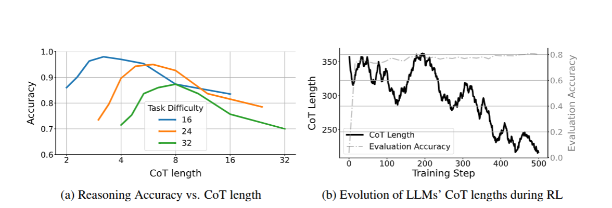

*专题图 12 CoT 长度与准确率的倒 U 型关系*

专题图 12 展示了 CoT 长度与准确率之间的倒 U 型关系。短 CoT 可能没有足够中间状态来完成自我检查；适度延长 CoT 可以提供草稿空间，让模型分解问题、记录局部结论并修正错误；超过任务需要后，额外 token 可能稀释关键信息，增加自相矛盾和反复修改的机会。

2025 年，Wu / Wang / Ye / Du / Jegelka / Wang（[arXiv:2502.07266](https://arxiv.org/pdf/2502.07266)）通过控制实验构造不同长度的推理链，在多个难度梯度任务上绘制长度与准确率曲线。结果说明，最佳 CoT 长度会随任务难度移动：更难任务通常需要更长中间步骤，但最优长度依然存在。专题图 12(b) 还展示了 RL 训练过程中 CoT 长度的演化：随着训练推进，平均 CoT 长度从约 350 token 收敛到约 220 token，验证准确率却稳定在 0.8 左右。这说明准确率提升并不要求更长 CoT，模型在学会正确路径后倾向于用更短表达，这与上文的"长度—准确率倒 U 型"结论互为印证。

2026 年 2 月，论文 [Think Deep, Not Just Long](https://arxiv.org/pdf/2602.13517) 提出 DTR（deep-thinking ratio，深度思考率）。DTR 试图衡量生成序列中有多少 token 需要较深层网络计算后才收敛。

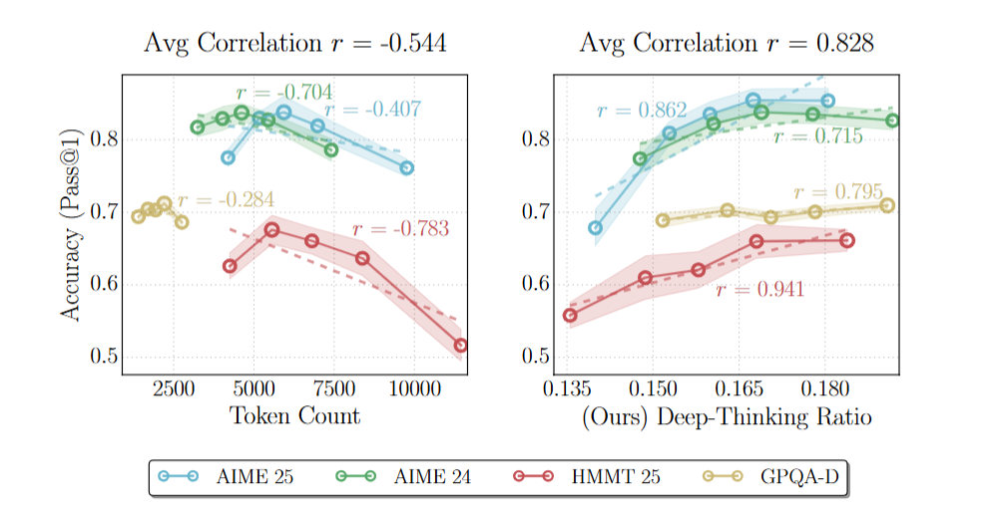

*专题图 13 DTR 与任务准确率的关系*

专题图 13 的机制是比较 Transformer 各层对同一 token 的预测分布变化。若某个 token 在浅层就基本稳定，它通常承担语法、模板或填充表达；若预测分布到深层才稳定，它更可能承担关键计算或推断。DTR 与准确率正相关，说明有效推理不只看输出长度，还要看生成 token 是否真的调用了更深层计算。

DTR 仍然是统计性指标。完整推理链需要浅层组织语言，也需要深层完成关键判断；未来如果要用 DTR 控制 CoT，还需要结合 token 不确定性、路径一致性、外部验证器和任务难度。Qwen 3 公开的混合思维模式（hybrid thinking modes）也沿着这条线索前进：通过 thinking 与 non-thinking 数据混合、特殊终止标记和 thinking budget，让模型在不同任务上调节推理长度。

到这里，读者应能区分 CoT 长度、有效深度和外部奖励信号对最终行为的不同影响。下一节进入 prompt 这一轻量控制接口。

## Prompt 引导：用输入结构约束模型行为

Prompt 的作用是改变模型的条件分布。prompt 不改写模型参数，却能通过任务描述、示例、格式约束和角色设定，让模型更容易进入合适的解题轨迹。对第一次阅读者来说，prompt 可以理解为推理阶段的轻量控制接口。先看常见提示设计原则，再看示例与边界。

- **明确任务目标**：写清任务类型、输入信息和输出要求。例如要求“给出结论和关键步骤”，
  比只写“分析一下”更容易得到稳定结果。
- **提供必要背景**：补充领域、已知条件和限制范围。背景信息应服务任务判断，过长背景会占用上下文窗口，
  也可能稀释注意力。
- **引导分步推理**：对数学、逻辑、规划等多步任务，可以要求模型先列出约束、再计算、最后检查结论。
  对简单任务则不必强行展开长 CoT。
- **使用分隔符和结构化输入**：用换行、编号、`---` 或 `###` 划分任务描述、材料和输出要求，
  有助于模型识别输入边界。
- **减少模糊描述**：把“稍微短一点”“多分析一下”改成具体长度、字段和评价标准。
- **提供示例**：少样本提示（few-shot prompting）通过输入输出对展示任务模式，适合分类、格式转换和风格迁移。
- **设定角色**：在需要领域风格时，可以设定“数学讲解者”“代码审查者”等角色。
  角色设定应服务评价标准，不能替代真实上下文。
- **约束输出格式**：需要程序消费结果时，直接指定 JSON、表格或 Markdown 字段，降低解析失败率。

示例输入输出对可以写成：

```text
输入：苹果
输出：水果

输入：胡萝卜
输出：蔬菜
```

Prompt 设计的边界同样重要。高质量 prompt 依赖用户理解任务、数据和评价标准；如果任务本身定义模糊，模型仍可能生成流畅但不稳定的答案。对生产系统来说，prompt 只是控制层的一部分，还需要检索、工具、验证器、结构化解析和监控共同保证可靠性。

## 外部工具搜索增强

模型参数在训练结束后通常保持固定，因此参数化知识天然存在时间滞后和覆盖范围限制。外部工具把模型能力从“只依赖参数记忆”扩展到“可以检索、调用 API、执行代码、观察环境并整合结果”。先看工具增强的总体路径，再看 RAG / Deep Research 这两类典型形态。


*专题图 14 智能体思考能力的四代演进*

专题图 14 把推理与外部动作的结合拆成四个阶段：第一代「无思」直接产出答案；第二代「规划」在动作前先生成计划；第三代「工具」让模型调用搜索、数据库、代码执行器或浏览器；第四代「交错」让思考与工具调用在每一步中交替进行。能力上每一代都在前一代基础上叠加新维度（规划、工具、交错），但模型参数本身保持不变，改变的是推理阶段如何组合内部思考与外部动作。

检索增强生成（RAG）是最常见的形式。系统先从外部知识库检索相关文档，再把文档片段作为上下文输入模型，从而减少过时知识和幻觉。Deep Research 类系统把一次回答拆成多轮搜索、阅读、筛选和综合，适合开放式研究任务。

> [!NOTE]
> 检索增强和工具调用可以被理解为用“外部记忆”和“外部动作空间”扩展模型能力边界，
> 使模型不再只依赖训练阶段写入参数的静态知识。

工具搜索也会增加系统成本。一次回答可能包含多段 prompt prefill、多次 generation、长上下文 KV cache、工具返回内容压缩、引用去重和 scheduler 排队。能力上它接近“推理 + 搜索 + 验证”的组合；系统上则回到 [第 9 章 推理系统](../chapter9/chapter9_推理系统.md) 的 serving 账本。

## 本专题小结

读完五条主线后，需要把能力、成本和工程判断放回同一张账本：CoT 增加 generation tokens，多路径采样增加 candidate trace，RLVR 需要大量 rollout，工具搜索会引入多轮调用和长上下文。能力提升和系统成本必须一起评估：正确率、稳定性、latency、throughput、KV cache、batching 和验证信号质量属于同一条工程链路。判断一条推理改进是否成立，至少要回答两件事：它激活的是哪一类预训练结构？它把什么代价压到了哪一段服务预算上？

随着高质量人类文本逐渐接近可获取上限，合成数据和自我改进会继续成为重要方向。这条路线可以借鉴 AlphaGo Zero 的闭环思想，但语言模型面对的大多数开放式任务没有完美规则验证器。数学、代码等可验证任务可以接入客观验证器，把对错信号直接喂给 RL；开放式任务缺乏稳定奖励函数，反复用自身生成数据训练时，reward hacking、分布收窄和模型坍塌三类失效模式会同时出现，能力随训练步数呈先升后降的曲线。借鉴自我博弈思想时，verifier 的稳定性与覆盖度直接决定可学习信号的有效性；不可验证领域的 reward model 始终是真实偏好的代理。

预训练提供可迁移结构和候选轨迹；后训练、prompt、解码和工具系统决定这些轨迹以什么概率、成本和可靠性被调用。这条主线贯穿五条具体路线，是本专题反复回到的同一判断。

## 参考资料

- [Brenner / Cohen-Addad / Woodruff：AI 辅助求解宇宙弦引力辐射功率谱解析解](https://arxiv.org/abs/2603.04735)
- [Tony Feng：Eigenweights for arithmetic Hirzebruch Proportionality（AI 代理生成 Type A/C/D，Type B 沿用 FYZ25a）](https://arxiv.org/abs/2601.23245)
- [Google DeepMind 团队 Denny Zhou 的 LLM 推理研究探讨](https://dennyzhou.github.io/LLM-Reasoning-Stanford-CS-25.pdf)
- [DeepSeek-R1 的训练经验总结](https://arxiv.org/abs/2501.12948)
- [Does Reinforcement Learning Really Incentivize Reasoning Capacity in LLMs Beyond the Base Model?](https://arxiv.org/pdf/2504.13837)
- [On the Interplay of Pre-Training, Mid-Training, and RL on Reasoning Language Models](https://arxiv.org/pdf/2512.07783)
- [CoT 多路径解码方法](https://arxiv.org/pdf/2402.10200)
- [Hinton 等人的家谱实验](https://www.cs.toronto.edu/~hinton/absps/naturebp.pdf)
- [Transformer 中前馈层网络的探究](https://aclanthology.org/2021.emnlp-main.446/)（[arXiv:2012.14913](https://arxiv.org/abs/2012.14913)）
- [从生产语言模型中抽取训练数据](https://arxiv.org/abs/2012.07805)
- [Stanford 与 Google 团队合作提出的类比推理](https://arxiv.org/pdf/2310.01714)
- [Mind Lab 工程博客：在 1T 参数 Kimi-K2 上用 LoRA + RL 训练的经验](https://macaron.im/mindlab/research/building-trillion-parameter-reasoning-rl-with-10-gpus)
- [第 13 章 可验证奖励的强化学习](../chapter13/chapter13_可验证奖励的强化学习.md)
- [过犹不及：理解大语言模型中的思维链长度](https://arxiv.org/pdf/2502.07266)
- [DTR 指标](https://arxiv.org/pdf/2602.13517)
- [OpenAI 提示词工程指南](https://developers.openai.com/api/docs/guides/prompt-engineering)
- [第 8 章 Scaling Laws](../chapter8/chapter8_Scaling_Laws.md)
- [神经细胞自动机生成非语言合成数据，用于语言模型预训练](https://arxiv.org/pdf/2603.10055)
- [序列预测器都可以作为压缩器](https://arxiv.org/pdf/2309.10668)
- [CS336 2026 课程主页](https://cs336.stanford.edu/)

## 来源与更新记录


- 来源：本专题与第 9 章的 serving / inference systems 分工互补；具体案例链接见上方「参考资料」一节。
- 课程映射：提供后训练、RLHF、DPO、RLVR 和现代推理模型案例背景；CoT、多路径解码、DTR、工具增强等主题主要依赖上方公开论文和专题材料。
- 材料边界：rollout、训练 infra 和 serving 成本等系统侧细节由第 9 章与第 13 章承载；本专题只引用其结论，不重复系统账本。
- 跨章引用：[第 13 章 §13.4 R1-Zero / Dr.GRPO 案例](../chapter13/chapter13_可验证奖励的强化学习.md) 与本专题 §3 RLVR 副作用部分共享同一组证据（"RL 不必然增加新能力，更可能重排基座模型的轨迹概率"）；[第 14 章 多模态模型](../chapter14/chapter14_多模态模型.md) 在章末把多模态 agent trace 与 RLVR 验证指向本专题。
- 查阅日期：2026-09-05。覆盖 CS336 2026 Lecture 10（inference）与 Lecture 15 / 16 后训练背景；外部论文按 arXiv 提交日期记录。
